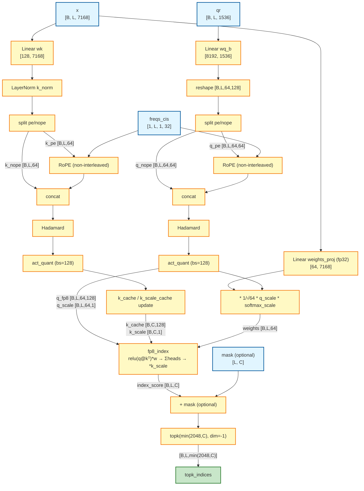

# Indexer Layer (CPU reference) — DeepSeek-V3.2-Exp

CPU-runnable reimplementation of the DeepSeek-V3.2 `Indexer` layer, mirroring the GPU
reference in
`models/demos/deepseek_v32/reference/DeepSeek-V3.2-Exp/inference/` (`model.py`, `kernel.py`).
The tilelang CUDA kernels are replaced with pure-PyTorch equivalents so the layer can run and be
inspected on CPU.

## Files

| File | Contents |
|------|----------|
| `indexer_cpu_utils.py` | CPU equivalents of the three kernels: `act_quant_cpu`, `fp8_index_cpu`, `rotate_activation_cpu` |
| `test_indexer.py` | `IndexerCPU` module (RoPE, projections, cache) + a standalone forward/save harness |

## How to run

```bash
cd models/demos/deepseek_v32/reference_cpu
python test_indexer.py
```

This builds an `IndexerCPU` with random weights (`seed=42`), runs one forward pass on dummy
inputs (`batch_size=2`, `seq_len=8`), asserts the output shapes, and saves tensors +
`metadata.json` to `test_outputs/`. To run against pretrained weights, implement the checkpoint
branch in `IndexerCPU.initialize_weights` (currently a `NotImplementedError`).

## Overview

The Indexer is a sparse-attention selector. For each query position it scores every cached key,
aggregates the score across all index heads, and returns the indices of the top-K most relevant
tokens. Those indices later gate the MLA attention in the full model. The scoring path runs in FP8
on device for memory/bandwidth efficiency.

## Architecture

### Components

1. **Query projection (`wq_b`)** — LoRA-rank query → full per-head query dimension.
2. **Key projection (`wk`)** — input → single key of `head_dim`.
3. **Key norm (`k_norm`)** — `LayerNorm` over `head_dim` (fp32 compute, `eps=1e-6`).
4. **Weights projection (`weights_proj`)** — input → per-head importance weights (fp32).
5. **Key cache** — historical keys stored quantized, with per-block scales.

All projections are **bias-free**, matching the reference `Linear(bias=False)`.

### Parameters (DeepSeek-V3.2 671B / `config_671B_v3.2.json`)

```python
dim              = 7168     # model dimension
index_n_heads    = 64       # index heads
index_head_dim   = 128      # dimension per index head
qk_rope_head_dim = 64       # rotary dimension
index_topk       = 2048     # tokens selected per query
q_lora_rank      = 1536     # query LoRA rank
max_batch_size   = 8
max_seq_len      = 16384
scale_fmt        = "ue8m0"  # power-of-two quantization scales
```

### Learnable parameters

| Parameter | Shape | Dtype | Description |
|-----------|-------|-------|-------------|
| `wq_b.weight` | `[n_heads * head_dim, q_lora_rank]` = `[8192, 1536]` | bfloat16 | Query projection |
| `wk.weight` | `[head_dim, dim]` = `[128, 7168]` | bfloat16 | Key projection |
| `k_norm.weight` | `[head_dim]` = `[128]` | float32 | LayerNorm γ |
| `k_norm.bias` | `[head_dim]` = `[128]` | float32 | LayerNorm β |
| `weights_proj.weight` | `[n_heads, dim]` = `[64, 7168]` | float32 | Per-head importance weights |

`weights_proj` is kept in fp32 for precision; the projections carry no bias term.

### Buffers (cache)

| Buffer | Shape | Reference dtype | CPU dtype |
|--------|-------|-----------------|-----------|
| `k_cache` | `[max_batch_size, max_seq_len, head_dim]` = `[8, 16384, 128]` | float8_e4m3fn | bfloat16 |
| `k_scale_cache` | `[max_batch_size, max_seq_len, head_dim // 128]` = `[8, 16384, 1]` | float32 | float32 |

On CPU the key cache is stored as bfloat16 (matmul-friendly), but values are still rounded onto the
FP8 E4M3 grid during quantization so the quantization error is simulated.

## Forward pass

### Inputs

```python
x:         [B, L, 7168]     # input features
qr:        [B, L, 1536]     # LoRA-compressed query representation
start_pos: int              # write offset into the cache
freqs_cis: [1, L, 1, 32]    # rotary frequencies (qk_rope_head_dim // 2 = 32)
mask:      [L, end_pos] or None
```

### Steps

1. **Query projection / RoPE** — `q = wq_b(qr)` → reshape `[B, L, 64, 128]`; split into
   `q_pe` (first 64) and `q_nope` (last 64); apply **non-interleaved** RoPE to `q_pe`; concat back.
2. **Key projection / RoPE** — `k = k_norm(wk(x))` → `[B, L, 128]`; split `k_pe`/`k_nope`; apply
   non-interleaved RoPE to `k_pe`; concat back.
3. **Hadamard transform** — `rotate_activation` applies a fast Walsh–Hadamard transform (scale
   `head_dim**-0.5`) to both `q` and `k`.
4. **Quantization** — `act_quant` block-quantizes (`block_size=128`) `q` and `k`, returning
   quantized values plus per-block scales. With `scale_fmt="ue8m0"`, scales are rounded up to a
   power of two.
5. **Cache update** — write `k_fp8` and `k_scale` into `k_cache` / `k_scale_cache` at `start_pos`.
6. **Weights** — `weights = weights_proj(x.float()) * n_heads**-0.5`, then
   `* q_scale * softmax_scale` (with `softmax_scale = head_dim**-0.5`).
7. **Index score** — `fp8_index(q, weights, k_cache[:end_pos], k_scale_cache[:end_pos])`:
   - `logits = q @ kᵀ` per head → `[B, L, H, C]`
   - `relu(logits) * weights` (per-head)
   - **sum over heads** → `[B, L, C]`
   - `* k_scale`
8. **Mask (optional)** — `index_score += mask` (`[L, end_pos]` broadcasts over batch).
9. **Top-K** — `topk_indices = index_score.topk(min(index_topk, end_pos), dim=-1)[1]`.

### Output

```python
index_score:  [B, L, end_pos]                   # fp32, summed over heads
topk_indices: [B, L, min(index_topk, end_pos)]  # int64 token indices
```

The reference `Indexer.forward` returns `topk_indices` only; the CPU harness also returns
`index_score` for inspection.

### Data flow



## CPU vs. GPU reference

| Aspect | GPU reference | CPU port |
|--------|---------------|----------|
| Quantized dtype | `float8_e4m3fn` | bfloat16 storage, values rounded onto the E4M3 grid |
| `ue8m0` scales | `fast_round_scale` (pow-2) | `2**ceil(log2(amax * fp8_max_inv))` |
| Index/GEMM kernels | tilelang JIT (`fp8_index`, `act_quant`) | `torch.einsum` / `torch` ops |
| Hadamard | `fast_hadamard_transform` package | recursive Walsh–Hadamard (Sylvester order) |
| Distributed | `dist.broadcast` consistency check | omitted (single process) |

These keep the math equivalent; the only intentional numerical differences are the absence of true
fp8 storage and any tilelang-specific accumulation order.

## Key design choices

1. **Per-head scoring summed across heads** — the index score for a token is the sum over all 64
   index heads of its ReLU'd, weighted query·key score.
2. **FP8 quantization** with block-wise (`128`) scales and power-of-two (`ue8m0`) rounding.
3. **Non-interleaved RoPE** — distinct from the interleaved form used in standard MLA attention.
4. **Hadamard rotation** before quantization for better feature mixing.
5. **Separate index head dim** (`128`), independent of the MLA attention head dimension.
