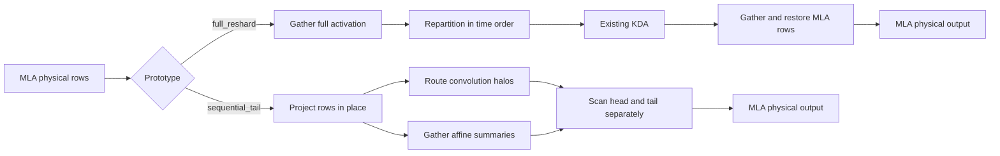
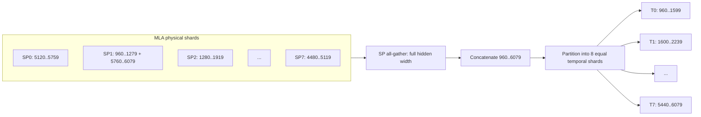
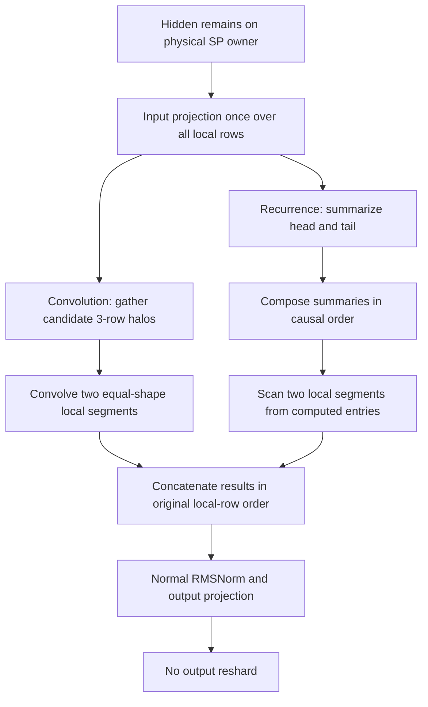
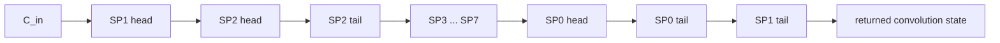
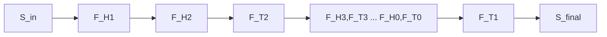

# KDA offset prototypes: full reshard and sequential tail

## Executive summary

Two throwaway implementations make KDA process the same 5120 tokens that MLA
stores in offset-rotated physical order:

1. **Full reshard** converts the entire hidden activation into chronological SP
   partitions, runs unchanged KDA, and converts the output back to MLA physical
   placement.
2. **Sequential tail** leaves the activation in MLA placement. It routes small
   convolution halos and recurrent affine summaries in chronological order,
   scans the boundary device's head and tail separately, and writes every output
   row back to its original physical location.

For Kimi-K3 with `T=5120`, SP8×TP4, and `actual_start=960`, each SP rank owns
640 rows. SP1 is the wraparound device: its first 320 rows are chronologically
first and its last 320 rows are chronologically last.

```text
Chronological interval [960, 6080)

  initial state
       |
       v
  SP1 head    SP2       SP3       SP4       SP5       SP6       SP7       SP0      SP1 tail
  960..1279 ->1280..1919->1920..2559->2560..3199->3200..3839->3840..4479->4480..5119->5120..5759->5760..6079
    320        640        640        640        640        640        640        640        320
                                                                                              |
                                                                                              v
                                                                                         final state
```

The prototypes choose different ways to realize that same arrow:



The selector and common end-to-end dispatch are in
[`tt/kda/kda.py`](tt/kda/kda.py#L452-L516).

## Concrete tensor and state geometry

Kimi-K3 defines `hidden_size=7168`, 96 KDA heads, head dimensions 128, and a
four-tap causal convolution
([`reference/kimi_k3_config.py`](reference/kimi_k3_config.py#L96-L101)). For
the target topology:

| Value | Global or logical shape | Per SP8×TP4 device |
| --- | --- | --- |
| KDA hidden input | `[1, 5120, 7168]` | `[1, 640, 7168]` |
| KDA output after TP reduce-scatter | `[1, 5120, 7168]` | `[1, 640, 1792]` |
| Recurrent state | `[1, 96, 128, 128]` | `[1, 24, 128, 128]` |
| Convolution state | `[1, 3, 3×96×128]` | `[1, 3, 9216]` |

The hidden input is sharded over tokens across SP and replicated across TP at
the KDA boundary. Projection weights divide the 96 heads across TP. The returned
hidden width is reduce-scattered across TP. Both states are replicated across
SP; their head/channel dimensions remain sharded across TP.

The offset prototypes require exactly 5120 global rows. `actual_start` must be
a non-negative multiple of 32, the KDA chunk and TT tile size. These checks and
the canonical logical-segment calculation are in
[`tt/kda/offset_prototype.py`](tt/kda/offset_prototype.py#L9-L26).

## The physical input at offset 960

Define:

```text
G = 5120 global rows
P = 8 SP ranks
C = G/P = 640 local rows
S = actual_start = 960

boundary rank b = floor(S/C) mod P = 1
split offset o  = S mod C          = 320
head length h   = C-o              = 320
tail length t   = o                = 320
```

MLA supplies KDA this physical arrangement:

| Physical SP rank | Local rows | Absolute token positions | Causal role |
| ---: | ---: | --- | --- |
| SP0 | `0:640` | `5120..5759` | last full rank |
| SP1 | `0:320` | `960..1279` | boundary head; first |
| SP1 | `320:640` | `5760..6079` | boundary tail; last |
| SP2 | `0:640` | `1280..1919` | full rank 1 |
| SP3 | `0:640` | `1920..2559` | full rank 2 |
| SP4 | `0:640` | `2560..3199` | full rank 3 |
| SP5 | `0:640` | `3200..3839` | full rank 4 |
| SP6 | `0:640` | `3840..4479` | full rank 5 |
| SP7 | `0:640` | `4480..5119` | full rank 6 |

```text
Physical device order

SP0  [                 5120 ................................ 5759 ]
SP1  [ 960 ........ 1279 | 5760 ........ 6079 ]
SP2  [                 1280 ................................ 1919 ]
SP3  [                 1920 ................................ 2559 ]
SP4  [                 2560 ................................ 3199 ]
SP5  [                 3200 ................................ 3839 ]
SP6  [                 3840 ................................ 4479 ]
SP7  [                 4480 ................................ 5119 ]
       ^ boundary head      ^ boundary tail
```

The physical mapping is generated independently in tests using
`rotated_chip_positions`; the offset tests upload exactly that order in
[`tests/kda/layer/test_offset_prototype.py`](tests/kda/layer/test_offset_prototype.py#L35-L75).

## Prototype 1: full reshard

### Intent

Make the existing KDA implementation see the representation it already
understands: equal, chronological SP partitions ordered `SP0 -> ... -> SP7`.
This is the simplest correctness oracle and the most expensive movement option.

### Input transformation

`mla_to_temporal_sp` performs three operations:

1. `all_gather` all eight `[1,640,7168]` physical shards across the SP axis;
2. slice and concatenate the logical segments in chronological order;
3. `mesh_partition` the chronological `[1,5120,7168]` tensor into eight new
   640-row shards.

The implementation is in
[`tt/kda/offset_prototype.py`](tt/kda/offset_prototype.py#L44-L79).



The temporal partitions do not preserve original device ownership:

| Temporal KDA rank | Absolute positions | Physical sources |
| ---: | --- | --- |
| T0 | `960..1599` | SP1 head + first half of SP2 |
| T1 | `1600..2239` | second half of SP2 + first half of SP3 |
| T2 | `2240..2879` | second half of SP3 + first half of SP4 |
| T3 | `2880..3519` | second half of SP4 + first half of SP5 |
| T4 | `3520..4159` | second half of SP5 + first half of SP6 |
| T5 | `4160..4799` | second half of SP6 + first half of SP7 |
| T6 | `4800..5439` | second half of SP7 + first half of SP0 |
| T7 | `5440..6079` | second half of SP0 + SP1 tail |

### KDA execution

After the reshard, the normal implementation is unchanged:

```text
T0 -> T1 -> T2 -> T3 -> T4 -> T5 -> T6 -> T7
```

- the normal convolution halo exchange gives T0 the caller's state and each
  later partition its predecessor's final three projected-QKV rows;
- the normal distributed recurrence composes rank summaries in rank order;
- the final convolution and recurrent states therefore describe the stream
  through absolute token 6079.

The full-reshard branch is selected before projection, then delegates to the
existing convolution and recurrence paths
([`tt/kda/kda.py`](tt/kda/kda.py#L481-L507)).

### Output restoration

KDA produces chronological temporal shards, but the next layer expects the MLA
physical layout. `temporal_to_mla_sp` therefore:

1. all-gathers the chronological output across SP;
2. walks the same logical segments and assigns slices back to their physical
   owners;
3. concatenates SP1 head and tail into its original 640 local rows;
4. partitions the reconstructed tensor across physical SP ranks.

This happens after output projection and TP reduce-scatter, so each TP device
reshards `[1,640,1792]` output shards, not the full 7168 output width. See
[`tt/kda/offset_prototype.py`](tt/kda/offset_prototype.py#L82-L120) and the
dispatch at [`tt/kda/kda.py`](tt/kda/kda.py#L508-L515).

```text
Chronological output                       Restored physical output

T0 .. T7: [960 .................. 6079]    SP0: [5120 ............ 5759]
                                      ->   SP1: [960..1279|5760..6079]
                                           SP2: [1280 ............ 1919]
                                           ...
                                           SP7: [4480 ............ 5119]
```

### What full reshard moves

The offset-specific cost is two full-SP exchanges:

| Phase | Per-device source shard on SP8×TP4 | Payload character |
| --- | --- | --- |
| Before KDA | `[1,640,7168]` BF16 | complete hidden activation |
| After KDA | `[1,640,1792]` BF16 | TP-sharded hidden output |

This is in addition to KDA's normal convolution, recurrence, and TP collectives.
It is deliberately retained as a correctness and performance reference.

## Prototype 2: sequential tail

### Intent

Keep MLA's activation placement unchanged and make causal state flow follow
logical time. Projection, gates, normalization, and output projection are
token-local, so they can operate on physical rows without reordering. Only
convolution predecessors and recurrent entry states require chronological
coordination.



The branch projects the original tensor directly, invokes the specialized
convolution and recurrence, then skips output restoration
([`tt/kda/kda.py`](tt/kda/kda.py#L487-L515)).

### Why every rank is split in this prototype

Only SP1 has a semantic wrap, but current mesh operations require equal local
tensor shapes. The prototype therefore splits **every** rank at row 320:

```text
SP0 [ H0: 320 rows | T0: 320 rows ]   adjacent in time
SP1 [ H1: 320 rows | T1: 320 rows ]   first and last in time
SP2 [ H2: 320 rows | T2: 320 rows ]   adjacent in time
...
SP7 [ H7: 320 rows | T7: 320 rows ]   adjacent in time
```

The actual causal schedule is:

```text
H1 -> H2 -> T2 -> H3 -> T3 -> H4 -> T4 -> H5 -> T5
   -> H6 -> T6 -> H7 -> T7 -> H0 -> T0 -> T1
```

For non-boundary ranks, `Hr -> Tr` is just the original contiguous 640-row
partition. SP1 is special: `H1` is first and `T1` is last. This equal-shape
split is a prototype convenience, not a proposed production optimization. It
is stated directly in the recurrence implementation
([`tt/kda/recurrence.py`](tt/kda/recurrence.py#L424-L430)).

## Sequential-tail convolution

The four-tap causal convolution needs three earlier projected-QKV rows at each
logical segment boundary. The prototype moves those halos, not the hidden
activation.

### Halo collection

Each physical rank contributes two candidate tails:

- `head_tail[r]`: the last three rows of `Hr`;
- `full_tail[r]`: the last three rows of the complete physical rank.

Each three-row tail is padded to a 32-row tile for transport. Two SP
`all_gather` operations make all candidates available. The implementation is
in [`tt/kda/convolution.py`](tt/kda/convolution.py#L10-L53) and
[`tt/kda/convolution.py`](tt/kda/convolution.py#L92-L129).

### Carry routing at offset 960

`C_in` is the caller's convolution state immediately before token 960.

```text
Segment  Entry convolution carry
-------  -----------------------------------------------------------
H1       C_in
H2       tail(H1)
T2       tail(H2)
H3       tail(T2) = full_tail(SP2)
T3       tail(H3)
...
H0       full_tail(SP7)
T0       tail(H0)
T1       full_tail(SP0)

Returned convolution state = tail(T1) = full_tail(SP1)
```

Visually:



The exact routing rules are
[`tt/kda/convolution.py`](tt/kda/convolution.py#L131-L146). The layer then runs
the existing convolution kernel once for all head tensors and once for all tail
tensors, and concatenates Q, K, and V back in physical row order
([`tt/kda/kda.py`](tt/kda/kda.py#L309-L334)).

## Sequential-tail recurrence

### Segment summaries

KDA recurrence is stateful, but each segment can be summarized as an affine
state transition:

```text
F_segment(S) = A_segment × S + B_segment
```

The prototype prepares recurrence chunk terms once for all physical rows, then
slices them into head and tail chunks. Every rank computes `A` and `B` for both
local segments. Four small SP collectives gather:

```text
head A summaries   head B summaries   tail A summaries   tail B summaries
```

Summary creation and transport are in
[`tt/kda/recurrence.py`](tt/kda/recurrence.py#L310-L360); the physical split and
dual summary calls are in
[`tt/kda/recurrence.py`](tt/kda/recurrence.py#L459-L471).

### Chronological composition

Every rank now has the summaries needed to calculate all segment entry states.
Starting from `S_in`, the prototype composes them in the exact causal schedule:

```text
S0 = S_in

S_after_H1 = F_H1(S0)
S_after_H2 = F_H2(S_after_H1)
S_after_T2 = F_T2(S_after_H2)
...
S_after_T0 = F_T0(...)
S_final    = F_T1(S_after_T0)
```

For each `F_X`, the state before applying it becomes that segment's scan entry
state. The implementation records separate `head_entries[r]` and
`tail_entries[r]`, applies the boundary head first, all intervening ranks next,
and the boundary tail last
([`tt/kda/recurrence.py`](tt/kda/recurrence.py#L473-L506)).



This is the refinement of "run the existing workflow through the head, then
scan the final state through the tail": the boundary tail is still logically
last, but its entry state comes from composing affine summaries. It does not
wait for every preceding token scan to finish.

### Local scans and returned state

The replicated entry-state lists are partitioned so each physical rank receives
its head and tail entries. Existing recurrent scan kernels run once for all
heads and once for all tails. Outputs are concatenated as `[head, tail]`, which
restores each rank's original physical rows. The returned recurrent state is
`S_final`, after SP1 tail
([`tt/kda/recurrence.py`](tt/kda/recurrence.py#L508-L523)).

Therefore, for offset 960:

```text
returned recurrent state   = state after absolute token 6079
returned convolution state = projected-QKV rows 6077..6079
```

Both are replicated across SP and retain their normal TP sharding.

## Offset exactly between devices: zero tail

If `actual_start % 640 == 0`, the boundary lies between SP ranks. For example,
at `actual_start=640`:

```text
boundary rank = 1
split offset  = 0
tail length   = 0

causal order: SP1 -> SP2 -> SP3 -> SP4 -> SP5 -> SP6 -> SP7 -> SP0
```

No physical rank is split into a wraparound head and tail.

- Full reshard gathers and repartitions whole ranks into chronological order.
- Sequential tail rotates one convolution halo per rank and composes one
  recurrent summary per rank in rotated order. It does not manufacture or scan
  an empty tail.

The no-tail convolution path is
[`tt/kda/convolution.py`](tt/kda/convolution.py#L66-L89); the no-tail recurrence
path is [`tt/kda/recurrence.py`](tt/kda/recurrence.py#L437-L457).

## Side-by-side comparison

| Property | Full reshard | Sequential tail |
| --- | --- | --- |
| Hidden activation placement | Changed to temporal SP, then restored | Never changed |
| Existing KDA fast path | Used unchanged after repack | Convolution and recurrence replaced by prototype paths |
| Offset-specific full-width traffic | Full input and output SP all-gathers | None |
| Offset-specific small traffic | None beyond normal KDA | Two halo gathers plus head/tail affine-summary gathers |
| Wrap device | Disappears after temporal repartition | Explicit head-first/tail-last handling |
| Other SP ranks | Each gets a new mixed temporal partition | Artificially split in two for equal mesh shapes |
| Final state | Normal last temporal partition | Explicitly composed after boundary tail |
| Main advantage | Simple correctness oracle | Preserves MLA activation layout |
| Main cost/risk | Moves wide activations twice | Extra launches/work; direct segment scans are not production-ready |

```text
FULL RESHARD

wide data moves; causal machinery stays simple

MLA rows ==full gather/repack==> natural KDA ==full gather/restore==> MLA rows


SEQUENTIAL TAIL

wide data stays; causal machinery becomes segmented

MLA rows ==> local projection ==> halo/summary routing ==> head+tail scans ==> MLA rows
```

## Validation and measured behavior

### Correctness

The hardware test compares both prototypes with a natural-order PyTorch KDA
reference at offsets `0`, one exact device boundary, and `960`. It covers
SP8×TP1 and SP2×TP4 with T=5120 and checks output, recurrent state, and
convolution state
([`tests/kda/layer/test_offset_prototype.py`](tests/kda/layer/test_offset_prototype.py#L59-L196)).

Observed results from the validated prototype commit:

```text
topology tests:                         172 passed
combined hardware prototype tests:       4 passed
sequential-tail focused hardware tests:  2 passed, 2 deselected
existing default-path regression:        1 passed, PCC 1.0

offset-960 output PCC:             0.999947 (SP8), 0.999944 (SP2)
returned recurrent-state PCC:      0.999893
returned convolution-state PCC:    0.999997
```

The prototype tests use zero initial state. They check the returned state at
SP0 and the boundary rank; a later production-dimension benchmark additionally
compared both states on every SP rank against the no-offset device result.

### Performance

On the available eight-chip Blackhole host, a production-dimension SP2×TP4
trace benchmark measured T=5120 and offset 960:

| Path | Median warm trace latency | Relative to no offset |
| --- | ---: | ---: |
| No-offset baseline | 9.541 ms | 1.000× |
| Full reshard | 11.562 ms | 1.212× |
| Sequential tail | 12.304 ms | 1.290× |

Each number is the median of five samples of ten synchronized trace replays;
compilation and host validation are excluded. Sequential tail was 6.4% slower
than full reshard in that topology. Output PCC rounded to 1.0 and both returned
states had PCC 1.0 against the no-offset device result on both SP ranks.

This is **not** a Galaxy SP8×TP4 performance result. The host exposes eight
chips, so the 32-chip mesh was skipped. Production-dimension SP8×TP1 reached
the sequential-tail recurrent scan but failed an L1 static-buffer allocation;
there is no valid SP8 latency. The failure confirms that the direct two-segment
scan is a proof mechanism, not a production-feasible scan schedule.

## Prototype limitations and implications

1. **Fixed length:** only full 5120-token intervals are supported. Partial
   prefill and zero padding are explicitly out of scope.
2. **Tile-aligned offset:** `actual_start` must be a multiple of 32.
3. **Uniform split overhead:** every rank is split at the boundary row even
   though only one rank wraps. This doubles convolution and recurrent scan
   launches for non-boundary ranks.
4. **Production recurrence gap:** segmented direct scans can exceed L1 at
   production geometry. A production implementation needs a grouped/streamed
   segmented scan or a kernel interface that accepts distinct active segment
   lengths without forcing equal work on every rank.
5. **Performance remains topology-specific:** SP2×TP4 shows that the current
   sequential-tail proof is slower than full reshard. It does not determine the
   result on SP8×TP4, where activation communication and segment scheduling
   have different costs.
6. **Input contract remains external:** both prototypes assume the caller has
   already supplied the hidden tensor in MLA's correct offset-rotated physical
   order. They do not repair an incorrectly ordered producer input.

## Bottom line

Full reshard establishes correctness by moving data until ordinary rank order
equals time order. Sequential tail establishes correctness by keeping data
fixed and moving just enough state information to make time order explicit.

For offset 960, the invariant shared by both is:

```text
incoming state -> SP1 head -> SP2 -> ... -> SP7 -> SP0 -> SP1 tail -> returned state
```

The sequential-tail prototype proves that full hidden-activation movement is
not mathematically required. Its present equal-shape, two-scan realization does
not yet prove that avoiding that movement is faster or production-feasible.
