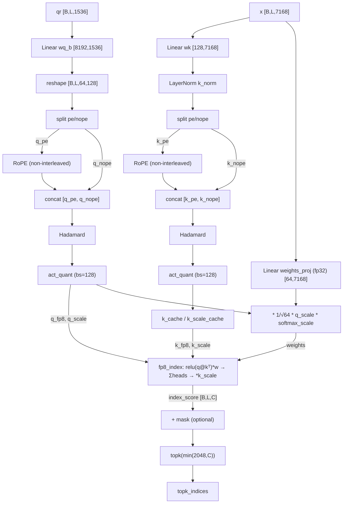

# DeepSeek-V3.2 attention (Indexer + MLA) — CPU reference

CPU-runnable reimplementation of the DeepSeek-V3.2-Exp attention stack: the **MLA**
(Multi-Head Latent Attention) layer and the **Indexer** (the "lightning indexer" sparse
attention selector) that MLA nests. Mirrors the GPU reference in
`DeepSeek-V3.2-Exp/inference/` (`model.py`, `kernel.py`); the tilelang CUDA kernels and
tensor-parallel `Linear` variants are replaced with pure PyTorch so the layers run and can
be inspected on CPU. The MLA spec followed is `DeepSeek-V3.2-Exp/MLA_LAYER.md`.

The Indexer scores every cached key per query and returns the indices of the top-K most
relevant tokens; MLA turns those into an additive `{0, -inf}` mask and runs attention over
the latent KV cache.

## Files

| File | Contents |
|------|----------|
| `model.py` | Architecture only: `ModelArgs`, building blocks (`Linear`, `LayerNorm`, `RMSNorm`), and the `IndexerCPU` / `MLACPU` modules |
| `weights.py` | Weight init (`initialize_weights`) + pretrained HF loading/dequant (`load_attention_state_dict`, `_HF_TO_MLA`, `_dequant_fp8`) |
| `utils.py` | CPU kernel equivalents (`act_quant_cpu`, `fp8_index_cpu`, `rotate_activation_cpu`) + RoPE helpers (`precompute_freqs_cis`, `apply_rotary_emb`) |
| `test_model.py` | Forward/equivalence/determinism harness (`test_indexer_layer`, `test_mla_layer`, `test_*_pretrained_layer0`, `test_mla_pretrained_determinism`) |

## How to run

```bash
cd models/demos/deepseek_v3_d_p/reference/cpu_deepseek_v32
python test_model.py            # or: pytest test_model.py -m slow
```

This builds an `IndexerCPU` and an `MLACPU` with random weights (`seed=42`,
`batch_size=2`, `seq_len=8`) and:
- **Indexer** — runs one forward pass and asserts output shapes.
- **MLA** — runs a one-shot **prefill** of `P` tokens, then on a fresh identically-seeded
  module runs **prefill(P-1) + decode(1)**, and asserts the decoded last position matches
  the one-shot prefill (the cache-correctness invariant).

Outputs are saved to `test_outputs/` (`topk_indices.pt`, `index_scores.pt`, `k_cache.pt`,
`mla_prefill_out.pt`, `mla_decode_out.pt`, `mla_metadata.json`).

## Loading pretrained weights

Random init is the default. `initialize_weights` is the single entry point — pass a
`layer` to load real DeepSeek-V3.2-Exp weights, and it resolves the right shard(s) from the
HF index and loads them, downloading any missing shard in full **just-in-time** (cached; it
logs a warning first since shards are multi-GB):

```python
from model import MLACPU, ModelArgs
from weights import initialize_weights

mla = MLACPU(ModelArgs())
initialize_weights(mla)            # random init (default)
initialize_weights(mla, layer=0)   # pretrained layer 0; downloads the shard if missing
```

For layer 0 that shard is `model-00001-of-000163.safetensors` (~5.2 GB). Other modes:
`local_files_only=True` (cache only, raises if absent — used by tests to skip) and
`checkpoint_path=<shard>` (load from a local path you already have). The repo is public/MIT
— no gating — but `huggingface_hub` and ~5 GB of free disk are required. The lower-level
`load_pretrained_hf` / `load_pretrained` / `resolve_layer_shards` remain available.

Mechanics (`weights.load_attention_state_dict`):
- HF transformers-style names are mapped to our module names via `_HF_TO_MLA` (mirrors
  `inference/convert.py`): `q_a_proj→wq_a`, `q_b_proj→wq_b`, `kv_a_proj_with_mqa→wkv_a`,
  `kv_b_proj→wkv_b`, `o_proj→wo`, the layernorms→`q_norm`/`kv_norm`, and
  `indexer.{wq_b,wk,k_norm,weights_proj}` straight through.
- fp8 (`float8_e4m3fn`) weights are dequantized to bf16 with their companion
  `weight_scale_inv` blockwise (128×128) scales (`weights._dequant_fp8`, matching
  `model.py:weight_dequant`). Norms and the indexer's `weights_proj` are cast to fp32 to
  match the module dtypes.
- For an `MLACPU` module, `initialize_weights` loads MLA **and** its nested indexer in one
  `load_state_dict(strict=False)`; for a standalone `IndexerCPU` it strips the `indexer.`
  prefix. `test_mla_pretrained_layer0` exercises this and is skipped if the shard isn't
  cached.

## Config (DeepSeek-V3.2 671B / `config_671B_v3.2.json`)

```python
# shared
dim              = 7168     # model dimension
q_lora_rank      = 1536     # query LoRA rank (shared by MLA and the indexer)
qk_rope_head_dim = 64       # rotary dim (rope/2 = 32 complex pairs)
scale_fmt        = "ue8m0"  # power-of-two quantization scales
max_batch_size   = 8
max_seq_len      = 16384    # > original_seq_len (4096) -> YaRN mscale applies
# MLA
n_heads          = 128      # attention heads
kv_lora_rank     = 512      # KV latent rank (c)
qk_nope_head_dim = 128      # non-positional Q/K per-head dim
qk_head_dim      = 192      # nope + rope
v_head_dim       = 128      # value per-head dim
# Indexer
index_n_heads    = 64       # index heads (half of MLA's; K is single-head)
index_head_dim   = 128      # dim per index head
index_topk       = 2048     # tokens selected per query
```

All projections are **bias-free** (`Linear(bias=False)`).

---

# MLA

MLA compresses K/V into a small **latent** that is cached (`kv_cache` 512 + `pe_cache` 64
per token, ~71× smaller than a classic MHA cache). Two runtime paths share one front-end,
selected purely by chunk length (a causal `mask` is built only when `seqlen > 1`):

- **Prefill / MHA** (`mask is not None`, `seqlen > 1`): K and V are materialized per head
  via `wkv_b`, standard scaled-dot-product attention.
- **Decode / MQA** (`mask is None`, `seqlen == 1`): `wkv_b` is **absorbed** into the query
  and the output, so attention runs directly against the latent cache — no per-head K/V.

The two are algebraically equal on overlapping positions.
`softmax_scale = qk_head_dim**-0.5 = 192**-0.5`, multiplied by `mscale²` (YaRN) since
`max_seq_len > original_seq_len`, with `mscale = 0.1 * mscale_arg * log(rope_factor) + 1`.

### Learnable parameters (one MLA layer)

| Module | Type | Weight shape (in → out) |
|---|---|---|
| `wq_a` | Linear | 7168 → 1536 |
| `q_norm` | RMSNorm | (1536,) |
| `wq_b` | Linear | 1536 → 24576 (= 128 × 192) |
| `wkv_a` | Linear | 7168 → 576 (= 512 + 64) |
| `kv_norm` | RMSNorm | (512,) |
| `wkv_b` | Linear | 512 → 32768 (= 128 × 256) |
| `wo` | Linear | 16384 → 7168 |
| `indexer` | IndexerCPU | (nested — see below) |

The `256` columns of `wkv_b` per head split as `[qk_nope_head_dim=128 | v_head_dim=128]`;
ordering matters for the decode absorption slices `[:, :128]` and `[:, -128:]`.

### Buffers (latent KV cache, not checkpoint weights)

| Buffer | Shape | Holds |
|---|---|---|
| `kv_cache` | `[max_batch, max_seq, 512]` bf16 | latent `kv` (post `kv_norm`), no rope |
| `pe_cache` | `[max_batch, max_seq, 64]` bf16 | `k_pe` — shared rope key (1 head) |

### Forward pass

Inputs: `x [B,S,7168]`, `start_pos`, `freqs_cis [S,32]` (YaRN table sliced at absolute
positions), `mask [S,S]` (prefill) or `None` (decode). Output: `out [B,S,7168]`.

**Shared front-end (both paths)**
1. `qr = q_norm(wq_a(x))` → `[B,S,1536]` (also fed to the indexer).
2. `q = wq_b(qr).view(B,S,128,192)`; split `[q_nope=128, q_pe=64]`; **interleaved** RoPE on `q_pe`.
3. `kv, k_pe = split(wkv_a(x), [512, 64])`; `kv = kv_norm(kv)`; **interleaved** RoPE on `k_pe.unsqueeze(2)`.
4. **fp8 KV-cache simulation**: `act_quant_cpu(kv)` then dequant, so the stored latent is exactly what the device would store (applied on every write path).
5. Write `kv → kv_cache[:, start:end]`, `k_pe → pe_cache[:, start:end]`.

**Prefill / MHA** (`mask is not None`)
```
q   = cat([q_nope, q_pe], -1)                     # [B, S, H, 192]
kvb = wkv_b(kv).view(B, S, H, 256)
k_nope, v = split(kvb, [128, 128])
k   = cat([k_nope, k_pe.expand(H)], -1)           # [B, S, H, 192]
scores = einsum('bshd,bthd->bsht', q, k) * softmax_scale
topk_indices = indexer(x, qr, start_pos, freqs_cis, mask)
index_mask = (-inf scattered to 0 at topk_indices) + causal_mask
scores += index_mask.unsqueeze(2);  scores = softmax(scores)
x = einsum('bsht,bthd->bshd', scores, v)          # [B, S, H, v]
out = wo(x.flatten(2))
```

**Decode / MQA** (`mask is None`, weight absorption)
```
wkv_b = wkv_b.weight.view(H, 256, c=512)
q_nope = einsum('bshd,hdc->bshc', q_nope, wkv_b[:, :128])          # absorb into query
scores = ( einsum('bshc,btc->bsht', q_nope, kv_cache)
         + einsum('bshr,btr->bsht', q_pe,   pe_cache) ) * softmax_scale
topk_indices = indexer(...);  index_mask = -inf scattered to 0 at topk_indices
scores += index_mask.unsqueeze(2);  scores = softmax(scores)
x = einsum('bsht,btc->bshc', scores, kv_cache)                    # [B, S, H, c]
x = einsum('bshc,hdc->bshd', x, wkv_b[:, -128:])                  # absorb value half -> v
out = wo(x.flatten(2))
```

### Key design choices / gotchas

1. **Two code paths must agree.** Prefill (materialized K/V) and decode (absorbed `wkv_b`)
   are algebraically equal by the `wkv_b` absorption identity, *provided they read the same
   latent cache*. The harness asserts this (the **cache-correctness invariant**,
   `MLA_LAYER.md` §B.6): prefill `P` tokens vs prefill `P-1` + decode 1 must produce the
   same output for position `P-1`. On CPU this matches within ~1 bf16 ULP.
2. **Small `seq_len` in the harness.** With `seq_len = 8 ≤ index_topk = 2048`, the indexer
   selects *all* positions, so the additive index mask is all-zero — the equivalence test
   isolates the attention math from the (discrete) top-k selection, which would otherwise be
   sensitive to tiny score perturbations.
3. **`k_pe` is shared across heads** (MQA-style key rope): `[B,S,1,64]` expanded to all 128
   heads; only `q_pe` is per-head.
4. **Latent caching** is the MLA memory win: `kv_cache` stores the post-`kv_norm` latent
   (512, no rope), `pe_cache` the shared rope key (64) — not per-head K/V.
5. **Softmax in fp32** then cast back, for numerical stability.

---

# Indexer

The Indexer is a sparse-attention selector. For each query position it scores every cached
key, sums the score across all 64 index heads, and returns the top-K token indices. Its
only output is `topk_indices`; MLA turns those into the additive index mask. The scoring
path runs in FP8 on device for memory/bandwidth efficiency. `softmax_scale = index_head_dim**-0.5 = 128**-0.5`.

Note `index_n_heads = 64` is **half** of MLA's `n_heads = 128`, and the indexer's **K is
single-head** (one shared 128-d key dotted against all 64 query heads).

### Learnable parameters

| Parameter | Shape | Dtype | Description |
|-----------|-------|-------|-------------|
| `wq_b.weight` | `[index_n_heads*index_head_dim, q_lora_rank]` = `[8192, 1536]` | bf16 | Query projection (consumes MLA's `qr`) |
| `wk.weight` | `[index_head_dim, dim]` = `[128, 7168]` | bf16 | Single-head key projection |
| `k_norm.weight` / `.bias` | `[128]` | fp32 | LayerNorm γ / β (full LayerNorm, not RMSNorm) |
| `weights_proj.weight` | `[index_n_heads, dim]` = `[64, 7168]` | fp32 | Per-head importance weights |

### Buffers (cache)

| Buffer | Shape | Holds |
|--------|-------|-------|
| `k_cache` | `[max_batch, max_seq, 128]` bf16 (device: `float8_e4m3fn`) | quantized keys |
| `k_scale_cache` | `[max_batch, max_seq, 1]` fp32 | per-block dequant scale |

On CPU the key cache is stored bf16 (matmul-friendly) but values are rounded onto the FP8
E4M3 grid during quantization so the quantization error is simulated.

### Forward pass

Inputs: `x [B,L,7168]`, `qr [B,L,1536]` (MLA's `q_norm` output), `start_pos`,
`freqs_cis`, `mask [L, end_pos]` or `None`.

1. **Query / RoPE** — `q = wq_b(qr).view(B,L,64,128)`; split `[q_pe=64, q_nope=64]`;
   **non-interleaved** RoPE on `q_pe`; `cat([q_pe, q_nope])` (**rope first**).
2. **Key / RoPE** — `k = k_norm(wk(x))` → `[B,L,128]`; split `k_pe`/`k_nope`;
   non-interleaved RoPE on `k_pe`; `cat([k_pe, k_nope])`.
3. **Hadamard** — `rotate_activation_cpu` (orthogonal Walsh–Hadamard, scale `128**-0.5`) on
   `q` and `k`. Orthogonal, so it does not change `q·k`; it only spreads outliers for fp8.
4. **Quantization** — `act_quant_cpu` block-quantizes (`block_size=128`); `ue8m0` rounds
   scales to a power of two.
5. **Cache update** — write `k_fp8` / `k_scale` into `k_cache` / `k_scale_cache`.
6. **Weights** — `weights = weights_proj(x.float()) * index_n_heads**-0.5 * q_scale * softmax_scale`.
7. **Index score** — `fp8_index`: `relu(q @ kᵀ) * weights`, **summed over heads** → `[B,L,C]`, `* k_scale`.
8. **Mask (optional)** — `index_score += mask`.
9. **Top-K** — `topk_indices = index_score.topk(min(index_topk, end_pos), dim=-1)[1]`.

Output: `topk_indices [B,L,min(index_topk,end_pos)]` (the CPU harness also returns
`index_score [B,L,end_pos]` for inspection).



### Indexer-specific notes

- **Per-head scoring summed across heads**: a token's score is the sum over all 64 index
  heads of its ReLU'd, weighted query·key score.
- **Single-head K** shared across the 64 query heads; **`weights_proj` is fp32**.
- **Rope/nope order is `[pe, nope]`** (rope first) — opposite of MLA's `[nope, pe]`.

---

## CPU vs. GPU reference (deviations)

| Aspect | GPU reference | CPU port |
|--------|---------------|----------|
| `ColumnParallelLinear` / `RowParallelLinear` | sharded; `wo` does `all_reduce` | plain `Linear`; at `world_size=1` the all-reduce is a no-op |
| Index / attention / GEMM kernels | tilelang JIT (`fp8_index`, `act_quant`) | `torch.einsum` / `torch` ops |
| Quantized dtype | `float8_e4m3fn` | bf16 storage, values rounded onto the E4M3 grid |
| `ue8m0` scales | `fast_round_scale` (pow-2) | `2**ceil(log2(amax * fp8_max_inv))` |
| MLA KV cache | `float8_e4m3fn` on device | bf16, but `act_quant_cpu` quant→dequant *simulates* fp8 precision — applied identically on both write paths |
| `weight_dequant` (fp8 → bf16) | run on device | done at load time in `weights._dequant_fp8` (random init skips it) |
| Hadamard | `fast_hadamard_transform` package | recursive Walsh–Hadamard (Sylvester order) |
| RoPE | `apply_rotary_emb` | same helper; **MLA interleaved**, **Indexer non-interleaved**; `freqs_cis` is YaRN-scaled and tracks **absolute** position |
| Distributed `dist.broadcast` topk check | present | omitted (single process) |

These keep the math equivalent; the only intentional numerical differences are the absence
of true fp8 storage and any tilelang-specific accumulation order.

## Next steps

Pretrained-weight loading is implemented (see "Loading pretrained weights"). A natural
follow-up is a numerical cross-check of the CPU layer-0 output against the GPU reference
(`inference/model.py`) on identical inputs/weights.
