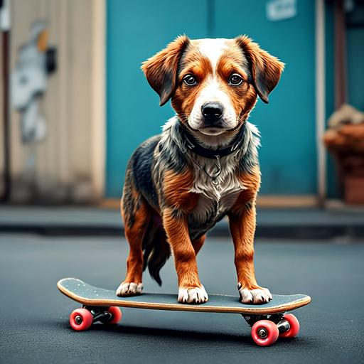

# Gemma3

## Platforms:
    Wormhole (n150, n300, t3k)

## Introduction
Gemma is a family of lightweight, state-of-the-art open models from Google, built from the same research and technology used to create the Gemini models. Gemma 3 models are multimodal, handling text and image input and generating text output, with open weights for both pre-trained variants and instruction-tuned variants. Gemma 3 has a large, 128K context window, multilingual support in over 140 languages, and is available in more sizes than previous versions. Gemma 3 models are well-suited for a variety of text generation and image understanding tasks, including question answering, summarization, and reasoning. Their relatively small size makes it possible to deploy them in environments with limited resources such as laptops, desktops or your own cloud infrastructure, democratizing access to state of the art AI models and helping foster innovation for everyone.

Resource link - [source](https://huggingface.co/google/gemma-3-27b-it)

## Prerequisites
- Cloned [tt-metal repository](https://github.com/tenstorrent/tt-metal) for source code
- Installed: [TT-Metalium™ / TT-NN™](https://github.com/tenstorrent/tt-metal/blob/main/INSTALLING.md)
  - To obtain the perf reports through profiler, please build with: `./build_metal.sh -p`

## How to Run

### TT-Metal
Use the following command(s) to run the model:
- Vision Demo
```
HF_MODEL=google/gemma-3-27b-it pytest models/demos/gemma3/demo/vision_demo.py -k “batch1-trace”
```
- Text only Demo
```
HF_MODEL=google/gemma-3-27b-it pytest models/demos/gemma3/demo/text_demo.py -k “performance and batch1”
```

### vLLM offline
Tested with [vllm:03cb300](https://github.com/tenstorrent/vllm/commit/03cb30064575c7dbda6f62f18d7889758531bcfd)

```
HF_MODEL=google/gemma-3-27b-it MESH_DEVICE=T3K python examples/offline_inference_tt.py --model "google/gemma-3-27b-it" --multi_modal --max_seqs_in_batch 32 --override_tt_config "{\"l1_small_size\": 768, \"fabric_config\": \"FABRIC_1D\"}"
```

## Details
- The entry point to the model is located at:`models/demos/gemma3/tt/gemma_e2e_model.py`
- Batch Size :1-32
- The image pre-processing is performed using PyTorch on host before passing to the on-device vision model.

## Performance

Current model performance metrics can be found in [PERF.md](PERF.md)

## Inputs and outputs
### Input:
- Text string, such as a question, a prompt, or a document to be summarized
- Images, normalized to 896 x 896 resolution and encoded to 256 tokens each
- Total input context of 128K tokens for the 4B, 12B, and 27B sizes, and 32K tokens for the 1B size
### Output:

- Generated text in response to the input, such as an answer to a question, analysis of image content, or a summary of a document
- Total output context of 8192 tokens

## Example

Example model outputs providing the following image:



with the text prompt:

> "Describe this image in detail."

### Model output:

Here's a detailed description of the image:

**Overall Impression:**

The image features an adorable puppy sitting on a skateboard. It's a vibrant, well-lit photograph with a slightly urban feel.

**Subject:**

*   **Puppy:** The main focus is a young dog, likely a mixed breed. It has a beautiful coat with a mix of brown, black, and white fur. The puppy has floppy ears and a sweet, inquisitive expression. It's wearing a dark collar with a small tag.
*   **Skateboard:** The puppy is sitting on a standard skateboard with red wheels. The board appears to be a wooden deck.

**Setting & Background:**

*   **Location:** The scene appears to be outdoors, possibly in a city or urban area.
*   **Background:** The background is somewhat blurred, but it seems to be a wall painted in shades of blue and teal. There's a glimpse of a potted plant on the right side, and a blurred sign or object on the left. The ground is a dark asphalt or pavement.

**Composition & Lighting:**

*   **Focus:** The puppy is in sharp focus, drawing the viewer's attention.
*   **Lighting:** The lighting is bright and natural, suggesting it was taken during the day.
*   **Angle:** The photo is taken at eye level with the puppy, creating a sense of connection.

**Overall Tone:**

The image is playful, charming, and heartwarming. It evokes feelings of joy and cuteness. It's a visually appealing photograph that would likely appeal to dog lovers.
