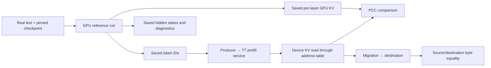

# GPU capture reference

**Kimi runs the GPU reference once, saves its tokens and intermediate tensors, then replays those exact tokens on TT and compares the resulting KV.** GPU execution is not part of the TT test.



## Kimi capture and input

Kimi-K2.7's adapter selects one Kimi-K2.7-Code input sequence from:

```text
/mnt/models/deepseek-prefill-cache/golden/structured_traces/vllm-kimi-k27-codedebug-56320
```

The input is InfiniteBench code-debug text beginning with Pyarmor source code. [Adapter configuration](../deepseek_v3_d_p/tt/runners/adapters/kimi_k2_7.py)

For the default capture:

- Raw text; **no chat template**, `add_special_tokens=false`.
- One 56,320-token prompt and one generated token.
- All 61 layers captured.
- The code-debug source was `datasets/infinitebench_code_debug.txt` on the capture machine.
- Metadata stores the exact input token IDs and a text preview. It does **not** preserve the dataset-preparation script or full source file.

InfiniteBench publishes the `code_debug` dataset. The exact preprocessing used to assemble that particular text file is not recorded, but **the saved token IDs completely specify what TT replays**. [Dataset source](https://github.com/OpenBMB/InfiniteBench/blob/main/README_ZH.md)

## Kimi tensor format

Kimi uses `chunked_group_a_v1`:

```text
trace/
├── metadata.json
├── index.json
├── kv_cache/layer_0/rows_00000000_00056320.safetensors
├── decoder_io/decoder_input_layer_0/rows_....safetensors
├── decoder_io/decoder_output_layer_0/rows_....safetensors
├── routing/expert_ids_layer_1/rows_....safetensors
├── routing/expert_weights_layer_1/rows_....safetensors
├── topk/...
└── logits.safetensors
```

Here, `T = 56,320`.

| Tensor | Shape / dtype | Meaning |
|---|---|---|
| `kv_post_transform_layer_L` | `[T, 576]`, BF16 | **512 normalized compressed KV channels + 64 post-RoPE key channels** |
| `decoder_input_layer_0` | `[T, 7168]`, BF16 | Embedded input to the first decoder block |
| `decoder_output_layer_L` | `[T, 7168]`, BF16 | Block output including the residual addition |
| `expert_ids_layer_L` | `[T, 8]`, INT32 | Selected MoE experts |
| `expert_weights_layer_L` | `[T, 8]`, BF16 | Their routing weights |
| `logits` | `[1, 163840]`, FP32 | Final next-token vocabulary scores |
| `topk_*` | `[4, 100]` in this capture | Per-forward top-100 diagnostics |

Three details matter:

1. **Kimi’s KV is an MLA compressed representation**, not separate full per-head K and V tensors.
2. Rows are in **logical token order**, independent of GPU memory layout or TT sharding. The capture standardizes RoPE channel order; the TT reader converts it to TT’s adjacent-pair order.
3. Decoder input for layer `L>0` aliases the previous layer’s output. Routing is **recomputed from captured gate logits**, not an exact dump of fused-kernel routing decisions.

`index.json` maps tensor names to shard paths, shapes and row ranges. `metadata.json` records tokens and run settings. The service’s KV test needs only the metadata and KV tensors; hidden states help localize numerical divergence. [Capture hooks](https://github.com/tenstorrent/bit_sculpt/blob/ff1deddd5c6ced030e931057191ad30c645715c8/analysis/model_traces/deepseek_ai/r1_0528/vllm_tracer.py), [Kimi routing capture](https://github.com/tenstorrent/bit_sculpt/blob/ff1deddd5c6ced030e931057191ad30c645715c8/analysis/model_traces/moonshotai/kimi_k26/vllm_tracer.py)

The default bundle contains approximately **3.69 GiB of KV** and **46.62 GiB of decoder states**.

## GPU capture generation

BitSculpt provides:

```text
scripts/model_traces/moonshotai/kimi_k26/run_vllm.py
analysis/model_traces/moonshotai/kimi_k26/vllm_tracer.py
```

The K2.7 capture metadata names this tracer and records:

| Setting | Recorded value |
|---|---|
| Engine | vLLM `0.19.0` |
| Tensor parallelism | 8 |
| Execution | Eager, allowing Python hooks to fire |
| Saved floating-point tensors | BF16 |
| Checkpoint revision | `74797c9c62378b951a1f6fcf5c4631024e9b8bef` |
| Prompt processing | Four GPU forwards: 16,384 + 16,384 + 16,384 + 7,168 tokens |

Hooks capture decoder outputs and MLA inputs, move them to CPU, and write safetensors. Rank 0 records the relevant logical tensors. The capture metadata does not record the GPU model. [GPU runner](https://github.com/tenstorrent/bit_sculpt/blob/ff1deddd5c6ced030e931057191ad30c645715c8/scripts/model_traces/moonshotai/kimi_k26/run_vllm.py)

**GPU execution chunks, file shards, and TT prefill chunks are separate quantities.** This capture processes roughly 16K GPU chunks, saves 56,320-row files, and is replayed in 5,120-token TT chunks.

The capture metadata does not record the exact launcher revision.

## TT consumers

### Dedicated model accuracy test

`test_kimi_prefill_transformer_chunked`:

- Blackhole 8×4.
- Replays saved token IDs in 5,120-token chunks.
- Includes 1-, 10- and 61-layer configurations, with captured and uncaptured TT execution.
- Reads KV back after execution, restores token order, and compares the 512-channel latent and 64-channel rotary portions separately.
- Its accuracy check applies **PCC ≥ 0.96 across all configured layers**.

Performance tests are separate and can disable PCC. Some padded/diagnostic paths have different depth limits; their coverage should not be inferred from this test. [Accuracy test](../deepseek_v3_d_p/tests/test_prefill_transformer_chunked.py)

### Prefill-service CI

The service CI has materially different coverage:

- Separate runner and producer processes.
- Device layer acknowledgments ensure computation finishes before readback.
- Producer reads device DRAM through the exported migration table and device map.
- **One producer user**, even when the runner allocates more slots.
- Runs to 256,000 tokens by repeating the saved token pool.
- **Checks only the first 56,320 tokens**, using **PCC ≥ 0.85**.

Therefore, that CI run does **not** establish 256K golden accuracy or distinct-input coverage across all slots. [Service CI configuration](../common/prefill/runners/ci/run_multirank_pcc.sh)

### Migration test

The shared migration driver adds a real copy and two independent checks:

- **Destination bytes equal source bytes:** verifies transport.
- **Destination PCC against the source prompt’s GPU trace:** verifies numerical content.

Distinct prompts are necessary to detect crossed slots. Replaying one trace into six slots cannot reliably expose that bug. [Migration checks](../common/prefill/docs/PREFILL_MIGRATION_TESTING.md)

## Gemma4 capture and validation

Gemma4 uses one Gutenberg *Les Misérables* prompt with **262144 saved token IDs**, HF/SDPA KV for all **60 layers**, and this default prepared reference:

```text
/mnt/models/huggingface/gpu_traces/gemma4_d_p/gutenberg-135
```

K is captured after normalization and RoPE; V is captured after normalization. The capture retains the full token sequence before sliding-window eviction. The `gemma4_kv_heads_v1` format stores contiguous BF16 heads in validation channel order: separate sliding K/V and packed global KV. It contains **212.5 GiB** of KV in 60 files. The validator also accepts row-sharded `chunked_group_a_v1` captures. See [GPU reference formats](PREFILL_MIGRATION.md#gpu-reference) for tensor shapes and conversion commands.

The tests replay exact token prefixes at **8K, 16K, 128K, and 256K**, using 8192-token TT chunks. Six slots are allocated; slot 0 receives the prompt and is compared once against the GPU reference at **PCC ≥ 0.91**.

The owning runner reads the populated KV prefix through TTNN and checks sampled migration-table addresses through UMD. Loopback additionally copies slot 0 to slot 5 and verifies destination bytes. [Test setup](PREFILL_MIGRATION.md), [mock and loopback flows](PREFILL_TEST_FLOWS.md).
