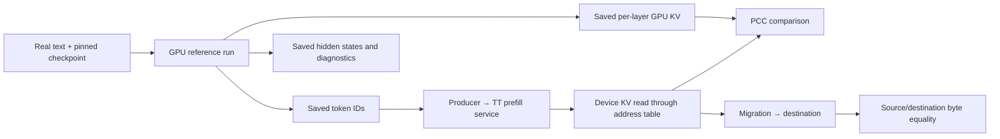

## The overall picture

**Kimi runs the GPU reference once, saves its tokens and intermediate tensors, then replays those exact tokens on TT and compares the resulting KV.** GPU execution is not part of the TT test.

I inspected the staged files, their tensor headers, the TT consumers, and BitSculpt’s GPU capture code.



**There is already a 256K Gemma4 GPU trace on this machine.** That gives us a useful starting point.

## 1. Which Kimi traces and inputs are actually used?

Root:

```text
/mnt/models/deepseek-prefill-cache/golden/structured_traces/
```

| Directory | Actual checkpoint | Input | Tokens |
|---|---|---|---:|
| `vllm-kimi-k27-codedebug-56320` | Kimi-K2.7-Code | InfiniteBench code-debug text, starting with Pyarmor source code | 56,320 |
| `kimi_debug_55k_vllm` | **Kimi-K2.6** | Same code-debug token sequence | 56,320 |
| `kimi_longbook_55k_vllm` | **Kimi-K2.6** | InfiniteBench English long-book QA input, beginning with adapted *Les Misérables* text | 56,320 |

**The first directory is Kimi-K2.7’s current default. It contains one input sequence.** The other two are not additional K2.7 test cases: their metadata identifies K2.6 weights. [Adapter defaults](/localdev/svuckovic/_workspace/repos/tt-metal/models/demos/deepseek_v3_d_p/tt/runners/adapters/kimi_k2_7.py:22)

For the default capture:

- Raw text; **no chat template**, `add_special_tokens=false`.
- One 56,320-token prompt and one generated token.
- All 61 layers captured.
- The code-debug source was `datasets/infinitebench_code_debug.txt` on the capture machine.
- Metadata stores the exact input token IDs and a text preview. It does **not** preserve the dataset-preparation script or full source file.

InfiniteBench publishes the underlying `code_debug` and `longbook_qa_eng` datasets. The exact preprocessing used to assemble that particular text file is not recorded, but **the saved token IDs completely specify what TT replays**. [Dataset source](https://github.com/OpenBMB/InfiniteBench/blob/main/README_ZH.md)

## 2. What is inside a GPU trace?

Kimi uses `chunked_group_a_v1`:

```text
trace/
├── metadata.json
├── index.json
├── kv_cache/layer_0/rows_00000000_00056320.safetensors
├── decoder_io/decoder_input_layer_0/rows_....safetensors
├── decoder_io/decoder_output_layer_0/rows_....safetensors
├── routing/expert_ids_layer_1/rows_....safetensors
├── routing/expert_weights_layer_1/rows_....safetensors
├── topk/...
└── logits.safetensors
```

Here, `T = 56,320`.

| Tensor | Shape / dtype | Meaning |
|---|---|---|
| `kv_post_transform_layer_L` | `[T, 576]`, BF16 | **512 normalized compressed KV channels + 64 post-RoPE key channels** |
| `decoder_input_layer_0` | `[T, 7168]`, BF16 | Embedded input to the first decoder block |
| `decoder_output_layer_L` | `[T, 7168]`, BF16 | Block output including the residual addition |
| `expert_ids_layer_L` | `[T, 8]`, INT32 | Selected MoE experts |
| `expert_weights_layer_L` | `[T, 8]`, BF16 | Their routing weights |
| `logits` | `[1, 163840]`, FP32 | Final next-token vocabulary scores |
| `topk_*` | `[4, 100]` in this capture | Per-forward top-100 diagnostics |

Three details matter:

1. **Kimi’s KV is an MLA compressed representation**, not separate full per-head K and V tensors.
2. Rows are in **logical token order**, independent of GPU memory layout or TT sharding. The capture standardizes RoPE channel order; the TT reader converts it to TT’s adjacent-pair order.
3. Decoder input for layer `L>0` aliases the previous layer’s output. Routing is **recomputed from captured gate logits**, not an exact dump of fused-kernel routing decisions.

`index.json` maps tensor names to shard paths, shapes and row ranges. `metadata.json` records tokens and run settings. The service’s KV test needs only the metadata and KV tensors; hidden states help localize numerical divergence. [Capture hooks](https://github.com/tenstorrent/bit_sculpt/blob/ff1deddd5c6ced030e931057191ad30c645715c8/analysis/model_traces/deepseek_ai/r1_0528/vllm_tracer.py), [Kimi routing capture](https://github.com/tenstorrent/bit_sculpt/blob/ff1deddd5c6ced030e931057191ad30c645715c8/analysis/model_traces/moonshotai/kimi_k26/vllm_tracer.py)

The default bundle contains approximately **3.69 GiB of KV** and **46.62 GiB of decoder states**.

## 3. How is the GPU capture produced?

BitSculpt provides:

```text
scripts/model_traces/moonshotai/kimi_k26/run_vllm.py
analysis/model_traces/moonshotai/kimi_k26/vllm_tracer.py
```

The staged K2.7 artifact explicitly identifies that Kimi tracer module. Its recorded setup is:

| Setting | Recorded value |
|---|---|
| Engine | vLLM `0.19.0` |
| Tensor parallelism | 8 |
| Execution | Eager, allowing Python hooks to fire |
| Saved floating-point tensors | BF16 |
| Checkpoint revision | `74797c9c62378b951a1f6fcf5c4631024e9b8bef` |
| Prompt processing | Four GPU forwards: 16,384 + 16,384 + 16,384 + 7,168 tokens |

Hooks capture decoder outputs and MLA inputs, move them to CPU, and write safetensors. Rank 0 records the relevant logical tensors. The documented K2.6 setup uses eight H200s; the **K2.7 artifact does not record its GPU SKU**. [GPU runner](https://github.com/tenstorrent/bit_sculpt/blob/ff1deddd5c6ced030e931057191ad30c645715c8/scripts/model_traces/moonshotai/kimi_k26/run_vllm.py)

**GPU execution chunks, file shards, and TT prefill chunks are separate quantities.** This capture processes roughly 16K GPU chunks, saves 56,320-row files, and is replayed in 5,120-token TT chunks.

The exact long-input launcher revision is missing from the artifact. The current public runner accepts different input options, so its command line should not be presented as an exact reproduction of this capture.

## 4. How do the TT tests use it?

### Dedicated model accuracy test

`test_kimi_prefill_transformer_chunked`:

- Blackhole 8×4.
- Replays saved token IDs in 5,120-token chunks.
- Includes 1-, 10- and 61-layer configurations, with captured and uncaptured TT execution.
- Reads KV back after execution, restores token order, and compares the 512-channel latent and 64-channel rotary portions separately.
- Its current accuracy path applies **PCC ≥ 0.96 across all configured layers**.

Performance tests are separate and can disable PCC. Some padded/diagnostic paths have different depth limits; their coverage should not be inferred from this test. [Accuracy entry point](/localdev/svuckovic/_workspace/repos/tt-metal/models/demos/deepseek_v3_d_p/tests/test_prefill_transformer_chunked.py:2490), [actual assertion](/localdev/svuckovic/_workspace/repos/tt-metal/models/demos/deepseek_v3_d_p/tests/test_prefill_transformer_chunked.py:2214)

### Prefill-service CI

The service CI has materially different coverage:

- Separate runner and producer processes.
- Device layer acknowledgments ensure computation finishes before readback.
- Producer reads device DRAM through the exported migration table and device map.
- **One producer user**, even when the runner allocates more slots.
- Runs to 256,000 tokens by repeating the saved token pool.
- **Checks only the first 56,320 tokens**, using **PCC ≥ 0.85**.

Therefore, that CI run does **not** establish 256K golden accuracy or distinct-input coverage across all slots. [CI setup](/localdev/svuckovic/_workspace/repos/tt-metal/models/demos/common/prefill/runners/ci/run_multirank_pcc.sh:15), [producer configuration](/localdev/svuckovic/_workspace/repos/tt-metal/models/demos/common/prefill/runners/ci/run_multirank_pcc.sh:175)

### Migration test

The shared migration driver adds a real copy and two independent checks:

- **Destination bytes equal source bytes:** verifies transport.
- **Destination PCC against the source prompt’s GPU trace:** verifies numerical content.

Distinct prompts are necessary to detect crossed slots. Replaying one trace into six slots cannot reliably expose that bug. [Migration checks](/localdev/svuckovic/_workspace/repos/tt-metal/models/demos/common/prefill/docs/PREFILL_MIGRATION_TESTING.md:274)

## 5. What we already have for Gemma4

Existing directory:

```text
/mnt/models/huggingface/gpu_traces/gemma4_d_p/
  hf-gemma4-31b-36db66e9-262144tok/
```

It contains:

- One Gutenberg *Les Misérables* input, with **262,144 saved token IDs**.
- All **60 layers**, in **32 × 8,192-row shards**.
- HF/SDPA reference tensors.
- KV captured **after K normalization/RoPE and V normalization**, before losing earlier sliding-window entries.
- Approximately **220 GiB KV**, plus **160 GiB decoder states**.

Unlike our new validator’s separate `[1, heads, tokens, dim]` K/V files, this bundle stores flattened `K || V` rows:

| Layer type | GPU trace row |
|---|---|
| Sliding | `[16 × 256 K channels \| 16 × 256 V channels]` → width 8,192 |
| Global | `[4 × 512 K channels \| 4 × 512 V channels]` → width 4,096 |

**It needs a reader adaptation, not new reference generation.** Split and reshape these rows, then apply our existing Gemma4 cache-layout conversion. [Trace metadata](/mnt/models/huggingface/gpu_traces/gemma4_d_p/hf-gemma4-31b-36db66e9-262144tok/metadata.json)

I checked yesterday’s matching 8,192-token CPU reference against sampled GPU layers. Token IDs match exactly; sampled K/V PCC ranges from approximately **1.0 to 0.9802**. The references differ, but this does not prove that GPU comparison will fix the TT failures.

## Recommended replication

1. **Start with the existing Gemma4 GPU trace:** validate 8K, then 16K, then 256K using its exact token IDs.
2. Add its row-sharded format to the validator.
3. For six-slot isolation, capture **six distinct prompts** with identical model/settings.
4. Keep numerical PCC and migration byte equality as separate results.
5. Establish Gemma4 thresholds from verified runs; neither Kimi’s 0.85 nor its 0.96 transfers automatically.
6. Record checkpoint/tokenizer revisions, capture-code revision, backend/version, precision, token IDs, and source-text hash with every new capture.

No repository changes or commits; no TT hardware was needed for this investigation.
