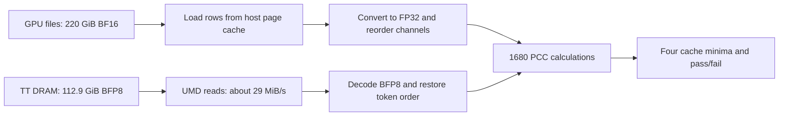

# Gemma4 GPU KV PCC performance

## 256K result

The optimized **mock 256K test passed in 12m 12s**, with all 1680 scores above the unchanged **0.91** threshold. Minimum PCC was **0.916626098**. Validation took **7m 24s**, 2.68× faster than the slow prepared-reference run. Full elapsed time improved by 2.35× versus that run and 1.60× versus the original 19-minute run.

| Phase | Original reference, 4 threads | Prepared reference, 4 threads | Optimized, 16 threads |
| --- | ---: | ---: | ---: |
| GPU reference loading and conversion | 6m 05s | 2m 42s | 0m 51s |
| TT readback, host gathering, and address checks | 2m 39s | 4m 21s | 1m 36s |
| PCC and finite-value checks | 6m 31s | 12m 46s | 4m 57s |
| Total validation | 15m 15s | 19m 50s | 7m 24s |
| Everything outside validation | 4m 13s | 8m 50s | 4m 48s |
| Total elapsed | 19m 28s | 28m 40s | 12m 12s |

All runs use 262144 captured Gutenberg tokens, 60 layers, six allocated slots, and one full comparison of slot 0. The two prepared-reference runs read the same `/mnt/models/huggingface/gpu_traces/gemma4_d_p/gutenberg-135` capture. The final run used writable HF/model caches under `/tmp`; it wrote nothing under `/mnt`. All 675 local cache files (35.63 GiB), including host weights, were verified byte-for-byte against the canonical 8×4 cache after the test. Filesystem caches were not dropped, so reference-loading and setup differences also include cache state and storage effects. The slow run's elapsed time was observed from its process lifetime; the final run was timed around pytest.

### Why the prepared-reference run was slower

The new reference path **did take effect**. Loading improved from 364.74 s to 162.31 s, and all 1680 scores were identical to the original-reference run. The slowdown came from other phases: PCC added 375.21 s, readback/host work added 102.23 s, and work outside validation added 276.86 s.

A controlled CPU check compared identical tensors from both reference layouts using the unchanged PCC function. Sliding K took 0.529 s with the original layout and 0.536 s with the prepared layout; sliding V improved from 0.609 s to 0.536 s. The prepared layout did not reproduce the PCC regression.

The existing CPU path repeatedly allocated large tensors. One 256K sliding head occupies 256 MiB in FP32; stacking both operands and centering them creates additional full-size arrays. A representative four-thread call incurred about **492,000 minor page faults** and around **0.9–1.0 CPU-seconds in the kernel**. These are memory-allocation/page-mapping costs, not disk page faults. The controlled reusable-buffer measurements largely removed them. Host gathering also built several full-cache intermediates before converting the result to FP32.

This identifies an allocation-sensitive bottleneck and removes it. It does **not** establish why the earlier session's unchanged operations ran faster: the original run had no per-operation CPU profile. Likewise, the 226-second quiet interval after its fabric-ready message cannot be attributed to a specific startup call retrospectively. In the instrumented final run, opening the mesh took 4.42 s, HF configuration 0.12 s, KV allocation 0.37 s, and model construction/compilation 100.53 s; the long quiet interval did not recur.

### Changes

- Store prepared GPU heads contiguously in validation channel order, avoiding repeated channel gathers and packing.
- Copy each TT host shard directly to its final token/head positions in one BF16 output allocation. Avoid intermediate concatenations and a whole-cache FP32 copy.
- Compute PCC in a reusable FP64 buffer of at most **16 MiB**. Combine block means and centered cross-products into one whole-head correlation; do not average block PCCs. Finite-value, constant-input, and shape checks remain.
- Default the Gemma4 migration test to **16 OpenMP threads**, retaining the environment override.
- Log reference, readback, and PCC seconds after every layer and save them in `gemma4_slot0.json`.

The 16 MiB limit describes the PCC workspace, not total process memory. Reference tensors, TT host buffers, migration metadata, and finite-check temporaries also occupy memory. TT conversion now happens inside the small PCC blocks and is included in PCC time.

### Thread scaling

All **4, 8, 16, 32, and 64** thread settings were measured. These are **PCC-only estimates** from two trials of each representative pair of captured GPU sliding K, sliding V, global rotary K, and global V heads at full 256K. Medians are weighted by the model's 800/800/40/40 scores. They are not five full hardware runs.

| Threads | Original full-head FP32 PCC | Bounded FP64 PCC |
| --- | ---: | ---: |
| 4 | 1007.0 s | 666.6 s |
| 8 | 761.5 s | 412.4 s |
| 16 | 623.7 s | 300.6 s |
| 32 | 573.8 s | 336.0 s |
| 64 | 596.3 s | 361.6 s |

Sixteen threads was fastest for the final implementation on this host. The complete hardware run measured 297.07 s of PCC, close to the 300.64 s estimate. Increasing the thread count beyond 16 did not improve this workload. Direct host gathering at 16 threads took 0.088 s for a full sliding K tensor versus 0.847 s for the previous gather; all output values matched exactly. These isolated gather times exclude device transfer and address checks.

### Final readback breakdown

| Stage | Time |
| --- | ---: |
| Device slicing and untilize dispatch | 6.12 s |
| Command-queue read, including pending device work | 14.07 s |
| Host-shard access and conversion | 16.12 s |
| Direct gathering and reader overhead | 25.08 s |
| Table-address samples, including UMD initialization | 21.51 s |
| Remaining reader/generator overhead | 13.43 s |
| Total readback and address checks | 96.32 s |

The command queue moved **212.5 GiB** in 14.07 s: **16.2 GB/s aggregate across 32 devices**. Reference loading and FP32 conversion processed the same 212.5 GiB of BF16 files in 50.99 s, an effective **4.17 GiB/s**; this includes cached file reads and conversion, not just storage bandwidth. PCC checked 1680 head/cache scores in 297.07 s, about **5.65 scores/s**, while reading every requested value.

### Numerical verification

The updated correlation uses FP64 accumulation, so it is not bit-identical to the old whole-vector FP32 calculation. The lower final minimum is a precision difference, not a relaxed threshold. The four cache-type minima were independently checked using full-vector `torch.corrcoef` in FP64, outside the validation timer:

| Cache type | Bounded PCC | Absolute difference from full-vector FP64 |
| --- | ---: | ---: |
| global_v | 0.939126651993 | 2.27e-12 |
| global_k_rotary | 0.936421972916 | 2.14e-13 |
| sliding_k | 0.935192124262 | 2.78e-13 |
| sliding_v | 0.916626098454 | 6.06e-13 |

The extra FP64 verification took 2.12 s and is included in total elapsed time under work outside validation. Seventeen host tests also passed, including uneven blocks, noncontiguous BF16/FP32 inputs, changing block means, constants, and nonfinite values. The hardware test passed without changing `GPU_PCC_THRESHOLD`.

Evidence: [hardware pytest log](/tmp/gemma4-optimized-mock256k-pytest.log), [all PCC scores and phase timings](/tmp/gemma4-optimized-mock256k/test_prefill_migration_mock_250/gemma4_slot0.json), [startup/readback/accuracy profile](/tmp/gemma4-optimized-mock256k/test_prefill_migration_mock_250/validation_profile.json), [elapsed and CPU times](/tmp/gemma4-optimized-mock256k-run.json), [combined measurements](/tmp/gemma4-speedup-investigation.json), [thread probes](/tmp/gemma4-pcc-final-thread-probe.json), [gather probe](/tmp/gemma4-gather-optimization-probe.json), and [reference-layout control](/tmp/gemma4-reference-layout-control.json), and [weight-cache verification](/tmp/gemma4-local-weight-verification.json).

## Earlier command-queue measurements

These earlier measurements use TTNN command-queue reads, on-device untilize, PyTorch host gathering, and whole-vector FP32 PCC. Each row checks one slot with six allocated, all 60 layers, and all 1680 scores. Those FP32 scores matched the original UMD results exactly.

| Context | UMD comparison estimate | Measured fast comparison | Approximate speed-up | Minimum PCC |
| --- | ---: | ---: | ---: | ---: |
| 8K | 174.2 s | 43.2 s | 4.0× | 0.920747 |
| 16K | 346.0 s | 64.0 s | 5.4× | 0.929830 |
| 128K | 2769.3 s | 441.7 s | 6.3× | 0.934371 |

UMD totals are weighted estimates from the two measured layers below; fast totals are complete 60-layer measurements. These ratios are approximate, not matched whole-run benchmarks. Fast totals include UMD initialization for the retained table samples; the UMD layer estimates exclude first-use initialization. Both exclude model startup, table export/import, and prefill.

### Fast comparison breakdown

| Stage | 8K | 16K | 128K |
| --- | ---: | ---: | ---: |
| GPU reference loading and layout conversion | 6.38 s | 14.11 s | 179.55 s |
| Device slicing and untilize dispatch | 0.34 s | 1.01 s | 1.18 s |
| Command-queue read, including pending device work | 0.39 s | 0.54 s | 8.83 s |
| Individual host-shard conversion | 0.70 s | 1.30 s | 7.16 s |
| Host gathering, reordering, FP32 conversion, and reader overhead | 0.82 s | 1.91 s | 29.75 s |
| Table-address sample checks, including UMD initialization | 21.12 s | 21.34 s | 21.23 s |
| Remaining reader overhead | 0.01 s | 0.02 s | 6.64 s |
| PCC and finite-value checks | 13.47 s | 23.78 s | 187.32 s |
| Total comparison | 43.24 s | 64.02 s | 441.67 s |

The 8K readback pipeline moves 6.641 GiB through the command queue in 0.388 s: about **18.4 GB/s aggregate across 32 devices**. This includes waiting for previously queued device work and is not a per-chip bandwidth measurement. Including slicing, untilize, host conversion, and gathering, TT tensor readback takes 2.24 s at 8K. The separate address samples still use MMIO.

Startup remains material: model loading/compilation and two shared-runner table exports take minutes; each table export was about 55–57 s, and importing it for validation takes about 14 s. These costs are outside the comparison timer. Each context uses a fresh process and closes the mesh on completion.

At 128K, command-queue readback moved 106.25 GiB in 8.83 s, about **12.9 GB/s aggregate**. The complete TT tensor readback pipeline took 46.93 s; reference preparation took 179.55 s and PCC took 187.32 s. Peak process RSS was 55.6 GiB, including the table, UMD allocations, model state, and tensor temporaries.

The three-case pytest session took 20 min 52.6 s: 9 min 8.9 s in the timed comparisons and 11 min 43.7 s in setup, table handling, producer startup, prefill, and teardown. The 128K device prefill itself took about 5.65 s. Comparison speed-up should not be read as model throughput improvement.

## Prepared GPU reference

The [prepared reference](PREFILL_MIGRATION.md#prepared-gpu-reference) stores each BF16 head contiguously in validation channel order. It occupies 212.5 GiB in 60 safetensors files under `/tmp/gemma4-gpu-traces/gemma4-31b-256k-kv-heads`. Conversion verified all 1640 head tensors against the original loader at 256K with exact equality. Prompt text, token IDs, and token-source metadata were preserved.

A CPU-only load pass checked all 60 layers at each supported context, using four PyTorch threads. Timings cover the actual loader call and replacing the preceding layer's FP32 tensors. Cache state was not controlled.

| Context | Prepared reference loading and FP32 conversion |
| --- | ---: |
| 8K | 1.31 s |
| 16K | 2.09 s |
| 128K | 49.76 s |
| 256K | 96.39 s |

For comparison, the completed 256K hardware run with the original reference spent **364.74 s** preparing reference tensors, **159.15 s** in the TT reader and address checks, and **391.05 s** in PCC. Validation totaled **914.95 s**; the user measured **19m 27.915s** for the full test. The full prepared-reference runs are reported above; these CPU-only load measurements used different cache and storage conditions.

During conversion, paired per-layer reads totaled **416.30 s** through the original loader and **69.67 s** through the prepared loader. Those prepared reads immediately followed writing each file, and exclude releasing the previous layer's reference tensors. The separate load pass above better matches the validation loop's reference replacement.

The loader now slices the requested prefix and casts BF16 to FP32. Channel gathers, global KV packing, and source-shard concatenation are performed once by the converter. FP32 conversion and PCC remain runtime work.

Evidence: [per-layer conversion and equality checks](/tmp/gemma4-gpu-traces/gemma4-31b-256k-kv-heads/preparation.json), [all-context CPU load measurements](/tmp/gemma4-prepared-reference-load-times.json), and [recorded 256K baseline metrics](/tmp/gemma4-speedup-investigation.json).

## Command-queue probe

The probe copied real layer-0 GPU-capture values to one Blackhole device as a BFP8 tiled DRAM tensor, then timed `ttnn.from_device` separately from `ttnn.to_torch` on the returned host tensor. Six iterations were run; medians exclude the first.

| Measurement | Result |
| --- | ---: |
| Shape | `[1, 1, 8192, 8192]` |
| Encoded payload | 68 MiB |
| Device-to-host read | 68.79 ms |
| Device-to-host throughput | 1.04 GB/s, or 989 MiB/s |
| Host decode/conversion | 343.49 ms |
| Transfer improvement over measured MMIO | About 34× |

This is a single-device transfer probe, not the 32-device service comparison. It uses real captured values, but has a different shape and memory layout from the service's sharded caches. The full hardware test must include slicing, mesh gathering, CP token reordering, reference loading, PCC, and migration-table sample checks.

A second probe used `ttnn.untilize` to expand the temporary BFP8 copy to BF16 row-major on the device. It transferred 128 MiB in 133.72 ms including device conversion, then converted the host result to FP32 in 107.87 ms. All 67,108,864 decoded values matched the original BFP8 host decode exactly. This uses an existing operation; no shared C++ code or kernels were changed.

Before that extra step, the full 8K hardware comparison passed in 95.45 s with all 1680 scores exactly matching the original UMD run. Its command-queue transfer took only 0.265 s, while `to_torch` decoding/gathering took 53.95 s. On-device untilize alone did not improve the full-mesh comparison: it still took 97.36 s, including 54.60 s in `to_torch`. That isolated the generic mesh composition as the dominant remaining part of this stage.

The generic composer uses [`MeshToTensor::compose`](../../../ttnn/core/distributed/distributed_tensor.cpp#L489), which concatenates shards through `xtensor`. A host-only probe joining 32 real-data BF16 shards with `torch.cat` took 60.4 ms for one 8K sliding K tensor. The model-local reader now converts individual host shards and joins them with PyTorch.

The hardware test reads one slot's populated prefix on all 32 devices. It compares all 1680 head/cache scores against the GPU capture, and separately verifies 26,240 table-address samples against the gathered TT values. The sampled data totals 225.8 MiB independent of context length. These checks cover each head/layer and each CP rank's first and last block; they do not replace the optional loopback's full destination-byte check.

## UMD baseline setup

Measured on 2026-09-19 with Gemma4-31B-it, Blackhole 8×4, 60 layers, 8192-token chunks, six allocated slots, and one checked slot. The host is an AMD EPYC 9354P, 32 cores/64 threads, with 566 GiB RAM. PyTorch used four threads.

The GPU capture is read from:

```text
/mnt/models/huggingface/gpu_traces/gemma4_d_p/hf-gemma4-31b-36db66e9-262144tok
```

The service had already produced 128K tokens. Timers wrapped the actual [validator](tt/runners/kv_validation.py) while comparing sliding layer 39 and global layer 35 at 8K, 16K, and 128K. The other comparison process was paused during each profile; the service remained idle with its KV resident. Inputs were read-only; profiling artifacts are under `/tmp`.

These are measurements of two representative layers, not a statistical benchmark. Whole-model estimates weight the sliding layer by 50 and the global layer by 10. The 256K estimates double the 128K measurements. They exclude service startup, prefill execution, transport verification, and first-use initialization.

## Data that has to move

| Context | GPU KV files | GPU BF16 input | UMD BFP8 readback | Fast BF16 readback | Decoded FP32 values, one side |
| --- | ---: | ---: | ---: | ---: | ---: |
| 8K | 60 | 6.875 GiB | 3.528 GiB | 6.641 GiB | 13.281 GiB |
| 16K | 120 | 13.750 GiB | 7.056 GiB | 13.281 GiB | 26.563 GiB |
| 128K | 960 | 110 GiB | 56.445 GiB | 106.250 GiB | 212.5 GiB |
| 256K | 1920 | 220 GiB | 112.891 GiB | 212.500 GiB | 425 GiB |

These are logical tensor payloads, excluding small safetensors headers and the extra 225.8 MiB of table-address samples. Fast readback transfers more bytes to avoid CPU BFP8 decoding; the live model caches remain BFP8. Files contain 8192 rows each. The additional 160 GiB of captured decoder states is not loaded by this test.

At 256K:

- Each of 50 sliding layers loads 4 GiB of GPU K/V. TT readback is 2.125 GiB in BFP8 or 4 GiB in BF16.
- Each of 10 global layers loads 2 GiB of GPU K/V. Packed TT readback is about 0.664 GiB in BFP8 or 1.25 GiB in BF16.
- A BFP8 tile uses 1088 bytes for 1024 values, including exponents.
- Global comparison uses the actual packed cache: 128 rotary K channels plus 512 V channels per head. The GPU file stores separate 512-channel K and V.
- The comparison evaluates 1680 PCC values: 50 × 16 × 2 sliding values and 10 × 4 × 2 global values.

The UMD baseline path:



Volumes are cumulative. The UMD reader processes one reference layer and one TT head at a time. The fast reader gathers one layer's K, V, or packed KV tensor at a time. Neither retains the entire model's decoded KV.

## UMD baseline: where the time goes

Measured at 128K, after correcting read batching:

| Stage | Sliding layer 39 | Global layer 35 | Estimated 60-layer total | Share |
| --- | ---: | ---: | ---: | ---: |
| Load/concatenate cached GPU rows | 0.146 s | 0.209 s | 9.4 s | 0.3% |
| Convert reference to FP32 and reorder/pack | 3.080 s | 1.567 s | 169.6 s | 6.1% |
| UMD device reads, including returned bytes | 37.258 s | 11.644 s | 1979.3 s | 71.5% |
| Decode BFP8 to FP32 | 6.964 s | 2.049 s | 368.7 s | 13.3% |
| PCC, including shape/finite checks and reductions | 3.734 s | 1.386 s | 200.5 s | 7.2% |
| Address-table lookups | 0.027 s | 0.003 s | 1.4 s | 0.1% |
| Address grouping, scatter, and remaining reader work | 0.746 s | 0.184 s | 39.1 s | 1.4% |
| **Total** | **51.954 s** | **17.163 s** | **46.2 min** | **100%** |

Small differences between summed components and total are loop/timer overhead and rounding.

| Context | Measured sliding layer | Measured global layer | Estimated full comparison |
| --- | ---: | ---: | ---: |
| 8K | 3.255 s | 1.147 s | 2.9 min |
| 16K | 6.494 s | 2.128 s | 5.8 min |
| 128K | 51.954 s | 17.163 s | 46.2 min |
| 256K | — | — | 92.3 min, extrapolated |

### Throughput

- **Raw device readback:** 29.2 MiB/s for both layer types. This is observed aggregate throughput of the serial UMD reader, not the hardware's PCIe or DRAM bandwidth limit.
- **BFP8 decoding:** 156–166 MiB/s of encoded input, equivalent to about 0.57–0.61 GiB/s of FP32 output.
- **PCC calculation:** 1.8–2.1 GiB/s, counting both FP32 input vectors once. The implementation actually makes several passes and allocates temporaries, so this is not a measured physical RAM bandwidth.
- **Cached GPU row loading:** 4.8–13.7 GiB/s. These numbers include row concatenation but exclude FP32 conversion/channel reordering.
- **Reference pre-read:** touching all 220 GiB of KV through four host readers took 212 s, or 1.04 GiB/s. The files live on NFS; cache state was not controlled. This is an observed warm-up rate, not a cold-storage benchmark. No system caches were dropped.

The checked-out read path is `read_dram_umd → Cluster::read_from_device → LocalChip::read_from_device → TLB-mapped MMIO copy`. This call does not use the separate DMA read API. The host CPU copies from a mapped device-memory window; batching Python calls does not change that transfer mechanism. See the [UMD reader](../../../tt_metal/impl/internal/disaggregation/umd_dram_reader.cpp) and [local-chip read path](../../../tt_metal/third_party/umd/device/chip/local_chip.cpp).

### Costs outside the table

The exported six-slot address table is 1,813,882,378 bytes, about 1.69 GiB. A standalone profiler imported it in 14.9 s. Initializing its bare UMD reader took another 9.9 s. These costs occur once per reader process and matter more for short contexts.

Peak profiler RSS was about 46.9 GiB at 128K, including the imported table, UMD allocations, GPU reference tensors, and comparison temporaries. This is not solely tensor storage. UMD reported a 1 GiB sysmem allocation per chip; adding reader processes can be expensive.

The producer's `DONE wall=... throughput=...` line measures scheduling/push activity. It precedes draining device acknowledgments and PCC, so it must not be used as either full prefill latency or validation time.

## What the batching experiment showed

`DeviceGroupIndex` objects compare equal but do not provide a matching value-based hash. Using them directly as dictionary keys prevented reads from combining. The reader now groups by `int(device_group_index)` and DRAM bank, while still checking every table entry and requiring consecutive addresses.

At 128K for sliding layer 39:

| Measurement | Individual blocks | Grouped bank reads |
| --- | ---: | ---: |
| UMD calls | 131,072 | 2,048 |
| Bytes read | 1.0625 GiB | 1.0625 GiB |
| UMD time | 37.611 s | 37.258 s |
| BFP8 decode time | 10.567 s | 6.964 s |
| Total layer time | 58.050 s | 51.954 s |
| Minimum PCC | 0.934371233 | 0.934371233 |

Thus, 64× fewer calls produced about an 11% wall-time improvement, mainly in decoding and Python overhead. It did not materially change device-read bandwidth. The same measured PCCs were preserved for both profiled layers at all three lengths.

At full context the corrected reader makes 104,960 UMD calls across 60 layers, compared with 13,434,880 individual 32-token block reads. It still reads every requested token and head.

## Why the MMIO reader reaches only about 29 MiB/s

A second probe enabled UMD's existing `TT_UMD_MEMCPY_TIMING=1` instrumentation and read one known populated bank at three request sizes. Disassembly of the loaded `libtt-umd.so.0.80.0` confirmed the vectorized bulk loop: eight 32-byte loads per 256-byte iteration. The source is [device_memcpy.cpp](../../../tt_metal/third_party/umd/device/pcie/device_memcpy.cpp).

| Request size | 256-byte iterations | Mean time per iteration | Observed API throughput |
| --- | ---: | ---: | ---: |
| 8.5 KiB | 34 | about 8.3 µs | about 29 MiB/s |
| 34 KiB | 136 | about 8.3 µs | about 29 MiB/s |
| 544 KiB | 2176 | about 8.3 µs | about 29 MiB/s |

For one 544 KiB read, the full Python-visible API call took **18.30 ms**, while the timed copy-loop operations totaled **18.12 ms**, about 99% of the call. Instrumentation adds some overhead; the uninstrumented layer profile independently measured 29.2 MiB/s.

The arithmetic matches the observed rate: `256 bytes / 8.3 µs ≈ 29 MiB/s`. Giving this API a larger byte count still executes the same small-load loop. It does not turn the request into a bulk DMA transfer. The validator also visits chips serially, so this rate does not aggregate the bandwidth of all 32 chips.

This localizes the bottleneck to the MMIO copy loop. It does not separate PCIe/NoC response latency, CPU memory-ordering effects, register spills, and loop instrumentation, or establish a maximum achievable transfer rate. Those would require further experiments. Detailed timing was unset in the calibration process and enabled only in the separate probe.

## How Kimi and the faster repository examples read KV

| Path | Read API | Where it runs |
| --- | --- | --- |
| Kimi shared service producer | `read_dram_umd` for each address-table block | Separate producer; no owning mesh |
| Kimi model accuracy test | `gather_cache_natural` → `ttnn.to_torch` | Process that owns the model and mesh |
| Kimi runtime PCC helper | `ttnn.to_torch` with a mesh composer | Owning runtime process |
| PCIe transfer microbenchmark | `distributed::ReadShard` on a mesh command queue | Process that owns the test mesh |

The [Kimi test gather](../deepseek_v3_d_p/utils/test_utils.py#L53) uses `ttnn.to_torch`. Its [KV PCC caller](../deepseek_v3_d_p/tests/test_prefill_transformer_chunked.py#L300) gathers the cache before comparing each layer. The [runtime helper](../deepseek_v3_d_p/tt/runners/prefill_kv_validation.py#L224) uses the same tensor API. These differ from the [external service producer](../common/prefill/runners/prefill_producer.py#L711), which uses the slow UMD path measured here.

`ttnn.to_torch` calls `ttnn.from_device`; the underlying [tensor CPU operation](../../../ttnn/core/tensor/tensor_ops.cpp#L223) obtains the tensor's owning mesh command queue and enqueues a tensor read. Fast dispatch moves device data into host memory through the device/command-queue transfer machinery, avoiding a CPU MMIO load for every small piece of KV.

The [PCIe transfer benchmark](../../../tests/tt_metal/tt_metal/perf_microbenchmark/3_pcie_transfer/test_rw_buffer.cpp#L163) times command-queue `ReadShard`. Its local-device read criterion is **8 GB/s** (`16 × 0.5`). This is a criterion in the code, not a measured result on this run. [Pinned-host-buffer tests](../../../tests/tt_metal/distributed/test_mesh_buffer.cpp#L731) also demonstrate bulk `enqueue_read_shards` with explicit buffer regions.

A direct substitution of UMD's `dma_read_from_device` is not the corresponding fast path on this target: [BlackholeDmaTransfer::d2h_transfer](../../../tt_metal/third_party/umd/device/tt_device/protocol/pcie_dma/blackhole_dma_transfer.cpp#L17) throws that D2H DMA is unsupported. Command-queue readback is a different mechanism.

For full-context Gemma4 numerical validation, the existing fast pattern is to have the **owning runner read the requested slot through TTNN**, then compare the host tensors to the GPU capture. The producer can still send the workload. The external producer cannot directly enqueue reads on a mesh that belongs to another process. A bulk KV stream from the service is another option, but needs a service interface. Such a change must retain separate coverage of migration-table addressing; reading a logical TTNN tensor alone does not exercise those addresses.

## Where improvements could help

1. **The implemented fast path removes bulk MMIO and generic mesh composition from numerical validation.** It uses the owning mesh, on-device untilize, and PyTorch gathering. The shared external producer still uses UMD. Remaining fast-test time is mainly reference preparation, PCC, and sampled migration-address validation.
2. **Threading requires checking the binding.** `read_dram_umd` currently holds the Python GIL, so wrapping the existing call in a Python thread pool does not provide parallel raw reads. Multiple processes avoid that limitation but introduce UMD memory allocations and IPC copies. Neither approach was added for this test.
3. **Reduce PCC passes and temporary copies.** The bounded FP64 reduction measured above now avoids whole-head temporaries and retains finite-value checks. Further changes should be compared against an independent FP64 result.
4. **Reference conversion/reordering now matters more.** Caching the comparison layout would cost substantial disk space; it is only worth considering for repeated runs. Cached file loading was already a small part of the measured UMD baseline.
5. **Reuse a producer when startup cost matters.** Table parsing and UMD initialization add tens of seconds per process. The fast hardware test starts a fresh service for each context; it does not incur a separate UMD process startup for full-cache validation, but model loading and table export still contribute to end-to-end runtime.

Sampling fewer layers/tokens or checking a shorter prefix reduces coverage. Those changes are not performance improvements to the same full-context check. Checking all six slots would multiply most validation work by six; this test deliberately checks one.

## Evidence

- [Final per-context reports and exact-score comparison](/tmp/gemma4-final-readback-results.json)
- [Final hardware-test artifacts](/tmp/gemma4-fast-isolated)
- [Command-queue probe measurements](/tmp/gemma4-fast-readback-profile.json)
- [On-device untilize probe](/tmp/gemma4-untilize-profile.json)
- [PyTorch host-gather probe](/tmp/gemma4-host-gather-profile.json)
- [8K BFP8 command-queue comparison](/tmp/gemma4-fast-test-8k-v2/test_prefill_migration_mock_8k0/gemma4_slot0.json)
- [Corrected component measurements](/tmp/gemma4-pcc-profile.json)
- [Measurements before the batching correction](/tmp/gemma4-pcc-profile-before.json)
- [Profiling harness](/tmp/gemma4_pcc_profile.py)
- [UMD copy-loop timing](/tmp/gemma4-mmio-probe.log)
- [Loaded copy-loop disassembly](/tmp/gemma4-mmio-disassembly.txt)
- [Calibration logs and per-head reports](/tmp/gemma4-gpu-calibration)

These `/tmp` artifacts belong to this run and are not versioned. Timings used `time.perf_counter` around the actual reference loader, layout conversion, UMD read, BFP8 decoder, table lookup, and PCC function. Reference file loading was warm; full-context estimates remain explicitly identified above.
