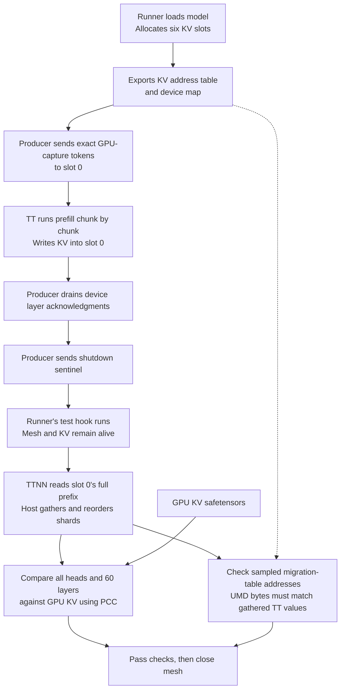
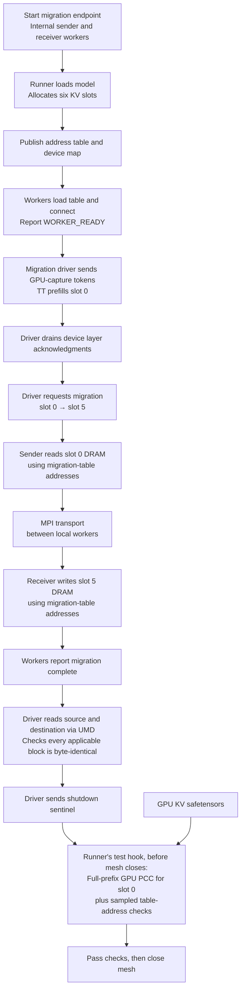

# Gemma4 prefill test flows

## Run the tests

From the tt-metal repository root, in both terminals for loopback:

```bash
source python_env/bin/activate
export PYTHONPATH="$PWD" TT_METAL_HOME="$PWD" OMP_NUM_THREADS=4
export \
    HF_MODEL=google/gemma-4-31B-it \
    HF_HOME=/mnt/models/huggingface \
    TT_CACHE_PATH=/mnt/models/huggingface/tt_cache/gemma4_d_p/google--gemma-4-31B-it \
    HF_HUB_OFFLINE=1
export PREFILL_TTNN_CACHE="$TT_CACHE_PATH"
```

### Mock, 16K

The test starts the runner and producer automatically.

```bash
pytest 'models/demos/gemma4_d_p/tests/test_prefill_migration.py::test_prefill_migration[mock-16k]' -sv
```

### Loopback, 16K

The test starts the model runner and migration driver. Start the migration endpoint separately and keep it running until the test finishes. These commands use the compatible temporary tt-llm-engine build on this machine, OpenMPI at `/opt/openmpi-v5.0.7-ulfm`, and TCP over `eth0`.

**Terminal 1 — start the endpoint:**

```bash
export MIGRATION_BUILD_DIR=/tmp/gemma4-loopback-tt-llm-engine/disaggregation/migration/build_RelWithDebInfo
export PATH=/opt/openmpi-v5.0.7-ulfm/bin:$PATH
export LD_LIBRARY_PATH=/opt/openmpi-v5.0.7-ulfm/lib:$TT_METAL_HOME/build/lib${LD_LIBRARY_PATH:+:$LD_LIBRARY_PATH}
export OMPI_MCA_pml=ob1 OMPI_MCA_btl=self,tcp OMPI_MCA_btl_tcp_if_include=eth0
export PRTE_MCA_oob_tcp_if_include=eth0 PMIX_MCA_ptl_tcp_if_include=eth0
export MIGRATION_DEVICE_BACKEND=umd

"$MIGRATION_BUILD_DIR/bin/migration_endpoint" \
    --endpoint-id 1 \
    --cmd-queue /mig_ep1_cmd --table-queue /mig_ep1_table --response-queue /mig_ep1_resp \
    --worker-bin "$MIGRATION_BUILD_DIR/bin/migration_worker" \
    --worker-hosts "$(hostname)" 2>&1 | tee /tmp/gemma4-loopback-endpoint.log
```

**Terminal 2 — wait for endpoint readiness, then run the test:**

```bash
export MIGRATION_BUILD_DIR=/tmp/gemma4-loopback-tt-llm-engine/disaggregation/migration/build_RelWithDebInfo
export PREFILL_MIGRATION_CLIENT_DIR="$MIGRATION_BUILD_DIR/python"

python "$MIGRATION_BUILD_DIR/../_migration_endpoint_driver.py" \
    --client-dir "$PREFILL_MIGRATION_CLIENT_DIR" \
    --cmd-queue /mig_ep1_cmd --table-queue /mig_ep1_table --resp-queue /mig_ep1_resp \
    --mode ready --alive-timeout 60 && \
GEMMA4_TEST_LOOPBACK=1 pytest \
    'models/demos/gemma4_d_p/tests/test_prefill_migration.py::test_prefill_migration[loopback-16k]' -sv
```

The readiness command prints `ALIVE` before pytest starts. The runner subsequently publishes its table and device map, then waits for `WORKER_READY`. After the test finishes, stop the endpoint with Ctrl-C in terminal 1.

Replace `16k` with `8k`, `128k`, or `256k` to select another context. Both tests start and stop their model runner; loopback leaves the external migration endpoint running.

Both tests use real TT hardware, allocate six KV slots, and prefill slot 0 with the exact token prefix from the GPU capture. KV stays resident on the device during validation; only logs, address metadata, and PCC reports are written to disk.

## Mock migration

`mock` exports the migration address table and checks its addresses without transferring KV between slots. Model execution and GPU comparison are real.



## Loopback migration

`loopback` copies KV from slot 0 to slot 5 through the migration endpoint's internal sender and receiver workers on the same machine. It verifies destination bytes before running the GPU comparison once on the source slot.



## What each check proves

| Check | Coverage |
| --- | --- |
| GPU PCC | All applicable heads and all 60 layers over the complete requested prefix in slot 0; threshold 0.91 |
| Address-table samples | Each head/layer and each CP rank's first and last populated 32-token block; table-based UMD reads must exactly match TTNN-gathered values |
| Loopback byte equality | Every applicable 32-token block over the requested prefix; slot 5 must exactly match slot 0 |

TTNN readback slices the populated prefix, untilizes a temporary copy to BF16 row-major, reads through the owning mesh command queue, and gathers/reorders host shards with PyTorch. The live BFP8 caches remain unchanged. UMD reads use the physical addresses described by the exported migration table and device map.

See [test commands and setup](PREFILL_MIGRATION.md) and [PCC performance](PCC_PERFORMANCE.md).
