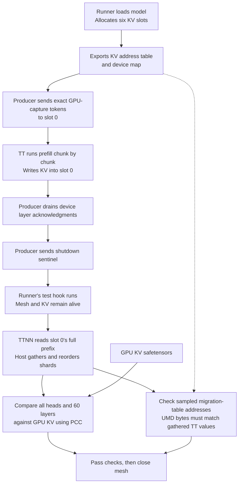
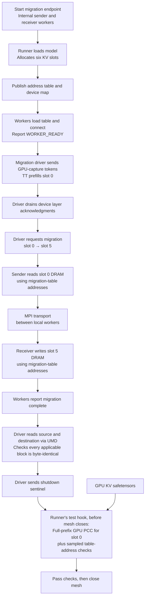

# Gemma4 prefill test flows

Both tests use real TT hardware, allocate six KV slots, and prefill slot 0 with the exact token prefix from the GPU capture. KV stays resident on the device during validation; only logs, address metadata, and PCC reports are written to disk.

## Mock migration

`mock` exports the migration address table and checks its addresses without transferring KV between slots. Model execution and GPU comparison are real.

## Loopback migration

`loopback` copies KV from slot 0 to slot 5 through the migration endpoint's internal sender and receiver workers on the same machine. It verifies destination bytes before running the GPU comparison once on the source slot.

## What each check proves

| Check | Coverage |
| --- | --- |
| GPU PCC | All applicable heads and all 60 layers over the complete requested prefix in slot 0; threshold 0.91 |
| Address-table samples | Each head/layer and each CP rank's first and last populated 32-token block; table-based UMD reads must exactly match TTNN-gathered values |
| Loopback byte equality | Every applicable 32-token block over the requested prefix; slot 5 must exactly match slot 0 |

TTNN readback slices the populated prefix, untilizes a temporary copy to BF16 row-major, reads through the owning mesh command queue, and gathers/reorders host shards with PyTorch. The live BFP8 caches remain unchanged. UMD reads use the physical addresses described by the exported migration table and device map.

See [test commands and setup](PREFILL_MIGRATION.md) and [PCC performance](PCC_PERFORMANCE.md).
