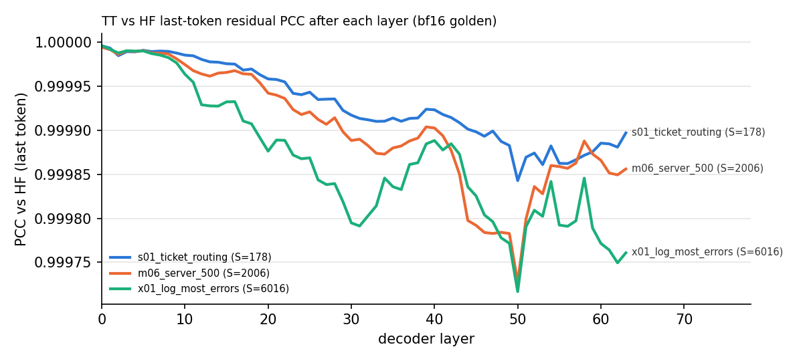

# Stage 6: full model, decision head and demo (prefill-only classifier)

Model `perplexity-ai/pplx-decider-v1-27b` (revision `b01a5cbaca5`), one Blackhole p150a, batch 1.
Branch `gtobarTT/pplx-decider-bringup`, built on the stage-2 fused layers (`63e7f42d76a`).
Precision policy unchanged from stages 1-2: `act_bf16__w_bfp8_all__hifi2` (BF16 activations, BFP8
weights for every projection, HiFi2 matmuls with fp32 accumulation, BF16 embedding and norms,
fp32 DeltaNet state). Labels: **measured** = a command and its output are recorded here or in
[`work_log.md`](work_log.md); **inferred** = follows from code or arithmetic.

## Result

**Decision agreement with HF bf16: 25/25 rows (measured).** The gate is >= 24/25, with a miss allowed
only on a near-tie. Readout-logit PCC over the valid options: min 0.99801, median 0.99995. All 64
layers are resident on the device: 27.30 GiB allocated, 4.54 GiB free.

Warmed end-to-end prefill latency, batch 1, one real prompt per bucket (measured,
`tests/perf/test_model_perf.py`, ms, median). **Burst** = each pass after 10 s idle (median of 5).
**Sustained** = passes back to back (2 warm-ups, median of 7). A request is tokenize + upload +
forward + readback of the probabilities.

| bucket | prompt tokens | device forward, burst | device forward, sustained | request, burst | request, sustained | decisions/s, burst | decisions/s, sustained |
|---:|---:|---:|---:|---:|---:|---:|---:|
| 128 | 100 | 146.9 | 146.6 | 148.4 | 149.6 | 6.74 | 6.69 |
| 1024 | 178 | 363.7 | 463.3 | 366.0 | 467.6 | 2.73 | 2.14 |
| 2048 | 2006 | 656.6 | 898.2 | 665.4 | 919.8 | 1.50 | 1.09 |
| 4096 | 3906 | 1474.3 | 1865.6 | 1481.5 | 1917.4 | 0.67 | 0.52 |
| 8192 | 7928 | 3487.8 | 3969.8 | 3512.9 | 4022.5 | 0.28 | 0.25 |

Decisions/s = 1000 / request ms at batch 1. Each pass computes the whole bucket, so latency
depends on the bucket, not on the prompt length inside it.

## What was built

| path | content |
|---|---|
| `tt/model.py` | `PplxDeciderModel`: embedding -> 64 `PplxDecoderLayer` (stage-2 modules, unchanged) -> `PplxDecisionHead`. `from_snapshot()` converts the weights one layer at a time and uploads them; the disk weight cache is used when present. `upload_tokens()` right-pads to the bucket; `forward()` returns device tensors; `decide()` returns the `count` probabilities. |
| `tt/head.py` | `PplxDecisionHead`: slice the last real token -> final RMSNorm -> readout (5120 x 256, column 255 zero) -> fp32 mask `>= count` with -1e9 -> `* 1/T` -> softmax. Only the [1, 1, 256] probabilities (and logits, for tests) come back. |
| `tt/weight_adapter.py` | `build_readout_weight(..., pad_to=256)` (one new keyword argument). |
| `demo/decider.py` | `TTDecider.predict(state, question)`: the snapshot's `Decider.predict`. Prompt rendering, tokenization, option count and `answer()` come from the snapshot `autojev` package via `reference/decision_prompts.AppTokenizer` (with its Python-3.10 `types.py` stub). |
| `demo/demo.py` | Runs the snapshot `inference.py` text example (Stripe message: urgency `noul` + team-routing `choice`) and prints JSON. `--compare-hf` compares it with HF answers. |
| `reference/hf_demo_reference.py` | HF bf16 answers for the demo rows (layer-streamed on CPU). |
| `tests/e2e/test_model.py` | Decision-agreement gate, logit/hidden PCC, layer-wise trace, bucket-padding check, determinism, runtime fallback audit of the full forward. |
| `tests/e2e/report_layer_trace.py` | Writes `layer_trace.md` / `layer_trace.png` from the e2e results. |
| `tests/perf/test_model_perf.py` | Per-bucket latency (burst and sustained), trace replay, profiler target. |

The forward is `embedding -> for layer: layer(x) -> head`. Between `upload_tokens` and the
probability readback it issues only TTNN device ops (audit below). The real length and the option
count are Python integers. They set the slice index and the comparison scalar; no tensor data
goes back to the host.

### Weight loading and the disk cache (measured, `artifacts/pplx_decider/stage6/load_times.json`)

| load | wall time | cache hits |
|---|---:|---:|
| first load, empty cache dir (read safetensors, convert, dump, upload) | 162.6 s | 0/66 |
| cached load, new process | 36.8 s | 66/66 |
| cached load, second device open in the same process (page cache warm) | 4.0 s | 66/66 |

- The cache is `artifacts/pplx_decider/weight_cache/<revision[:12]>/<policy name>/` (27 GB, 819 files).
- A cached load builds the weight bundles from `meta` tensors (shapes from the safetensors headers),
  so it reads no HF weight bytes. The model checks that every weight hits before it skips the real
  tensors.
- Host sources are swapped for meta tensors after each layer's upload. Host RAM stays at one layer.
- Fix found here: `LazyWeight` puts `device.id()` in the cache file name. That id is a per-process
  counter, so a second `open_device` in one process missed all 66 groups (measured 0/66 before the
  fix). `tt/model.py::CachedWeight` drops the id. The file holds an unsharded host tensor, so the id
  is not needed.

### DRAM (measured, `ttnn.get_memory_view`)

| item | GiB |
|---|---:|
| embedding table (BF16, 248320 x 5120) | 2.368 |
| per `linear_attention` layer (weights + fp32 zero state + scan constants) | 0.3857 x 48 |
| per `full_attention` layer (weights + 2 x 16 MiB BF16 K/V cache + page table) | 0.4003 x 16 |
| after load (all 64 layers, head, RoPE tables) | 27.296 allocated / 4.536 free of 31.831 |
| S=8192 peak at layer boundaries | 27.455 allocated / 4.376 free (largest free block 532 MiB per bank) |

All-BFP8 fits. The transient inside one layer pass is not visible to the allocator view. It is
inferred to be a few hundred MiB (one 2048-token chunk of intermediates), and every 8192-bucket run
completed. `doc/context_contract.json` has these numbers.

## Accuracy against the stage-6 HF golden (measured)

Golden: `artifacts/pplx_decider/goldens/decisions/` (`reference/hf_decision_golden.py`). It has 25
rows of HF bf16 on CPU, streamed one layer at a time, with the same token ids. Command:
`pytest models/demos/pplx_decider_v1_27b/tests/e2e/test_model.py -q -s`. Result: **6 passed in 87 s,
exit 0**. Results: `artifacts/pplx_decider/stage6/e2e_decisions.json`.

| row | type | seq_len | bucket | options | HF choice | HF p | TT choice | TT p | max abs prob diff | HF top-2 gap | logit PCC (valid) | final-hidden PCC |
|---|---|---:|---:|---:|---|---:|---|---:|---:|---:|---:|---:|
| s01_ticket_routing | choice | 178 | 1024 | 3 | billing | 0.9907 | billing | 0.9906 | 0.0002 | 0.9850 | 0.99999 | 0.99980 |
| s02_review_positive | noul | 172 | 1024 | 2 | true | 0.9972 | true | 0.9970 | 0.0002 | 0.9943 | 1.00000 | 0.99973 |
| s03_restaurant_stars | score | 188 | 1024 | 5 | 1 | 0.6600 | 1 | 0.6477 | 0.0123 | 0.3439 | 0.99995 | 0.99991 |
| s04_recipe_cuisine | choice | 210 | 1024 | 4 | japanese | 0.9929 | japanese | 0.9929 | 0.0000 | 0.9902 | 1.00000 | 0.99983 |
| s05_unit_conversion | choice | 183 | 1024 | 6 | 2,500 m | 0.9769 | 2,500 m | 0.9760 | 0.0009 | 0.9664 | 0.99998 | 0.99976 |
| s06_math_check | noul | 143 | 1024 | 2 | true | 0.9472 | true | 0.9413 | 0.0060 | 0.8945 | 1.00000 | 0.99973 |
| s07_language_id | choice | 148 | 1024 | 5 | de | 0.9916 | de | 0.9919 | 0.0004 | 0.9891 | 0.99999 | 0.99978 |
| s08_itinerary_airport | choice | 250 | 1024 | 12 | LIS | 0.9576 | LIS | 0.9619 | 0.0043 | 0.9443 | 0.99985 | 0.99969 |
| s09_bug_severity | score | 180 | 1024 | 3 | 0 | 0.9897 | 0 | 0.9901 | 0.0005 | 0.9825 | 0.99998 | 0.99981 |
| s10_match_winner | choice | 169 | 1024 | 2 | Hilltop Foxes | 0.9960 | Hilltop Foxes | 0.9960 | 0.0000 | 0.9920 | 1.00000 | 0.99983 |
| m01_sku_lookup_120opt | choice | 1784 | 2048 | 120 | SKU-1077 | 0.9841 | SKU-1077 | 0.9839 | 0.0001 | 0.9829 | 0.99984 | 0.99971 |
| m02_support_thread | choice | 1209 | 2048 | 8 | shipping_delivery | 0.9842 | shipping_delivery | 0.9843 | 0.0002 | 0.9785 | 0.99994 | 0.99968 |
| m03_orders_refunded | noul | 1521 | 2048 | 2 | false | 0.9780 | false | 0.9780 | 0.0000 | 0.9560 | 1.00000 | 0.99984 |
| m04_reviews_positive | score | 1674 | 2048 | 5 | 3 | 0.6314 | 3 | 0.5983 | 0.0394 | 0.3113 | 0.99844 | 0.99963 |
| m05_store_receipt | choice | 1903 | 2048 | 30 | Seattle Mall | 0.9571 | Seattle Mall | 0.9575 | 0.0003 | 0.9527 | 0.99985 | 0.99971 |
| m06_server_500 | noul | 2006 | 2048 | 2 | true | 0.9932 | true | 0.9936 | 0.0004 | 0.9864 | 1.00000 | 0.99973 |
| l01_faq_match_230opt | choice | 3303 | 4096 | 230 | faq_141 | 0.8492 | faq_141 | 0.8555 | 0.0063 | 0.8415 | 0.99801 | 0.99898 |
| l02_delivery_feed_json | noul | 2642 | 4096 | 2 | true | 0.8848 | true | 0.8958 | 0.0111 | 0.7695 | 1.00000 | 0.99921 |
| l03_service_health | score | 3617 | 4096 | 4 | 2 | 0.6658 | 2 | 0.6772 | 0.0117 | 0.3644 | 0.99990 | 0.99989 |
| l04_laptop_department | choice | 2301 | 4096 | 10 | hardware_repair | 0.9785 | hardware_repair | 0.9806 | 0.0021 | 0.9708 | 0.99966 | 0.99960 |
| l05_league_leader | choice | 3906 | 4096 | 8 | Lakeview United | 0.9786 | Lakeview United | 0.9778 | 0.0008 | 0.9697 | 0.99993 | 0.99972 |
| x01_log_most_errors | choice | 6016 | 8192 | 5 | payments | 0.9736 | payments | 0.9753 | 0.0017 | 0.9631 | 0.99986 | 0.99959 |
| x02_faq_returns | noul | 5005 | 8192 | 2 | true | 0.9960 | true | 0.9961 | 0.0001 | 0.9920 | 1.00000 | 0.99977 |
| x03_reviews_negative | score | 7004 | 8192 | 5 | 0 | 0.4805 | 0 | 0.4827 | 0.0038 | 0.0514 | 0.99983 | 0.99984 |
| x04_customer_lookup | choice | 7928 | 8192 | 25 | Priya Okafor | 0.9671 | Priya Okafor | 0.9672 | 0.0001 | 0.9638 | 0.99982 | 0.99961 |

- **Agreement 25/25.** The closest row, `x03_reviews_negative` (HF top-2 gap 0.0514), keeps its
  order on TT (TT gap 0.0517).
- **Readout-logit PCC over valid options:** min 0.99801 (`l01`, 230 options), median 0.99995.
  For the 6 two-option rows this PCC is 1.0 by construction (two points). Over all 255 raw logits:
  min 0.99772, median 0.99990.
- **Max abs prob diff:** 0.0394 (`m04_reviews_positive`, a flat 5-level score distribution, HF
  0.6314 vs TT 0.5983). All other rows are <= 0.0123.
- **Final-hidden (final-normed last token) PCC:** min 0.99898, median 0.99973.

### Layer-wise trace (measured, diagnostic)

The table is [`layer_trace.md`](layer_trace.md) (64 values for each flagged row; all 25 rows are in
`e2e_decisions.json`). The plot is below.



There is no steep decay. PCC drifts down slowly from 0.99999 at layer 0. The lowest point is layer
50 in all three rows (0.99984 / 0.99973 / 0.99972 for S=178 / 2006 / 6016). After layer 50 PCC
recovers, and layer 63 ends at 0.99990 / 0.99986 / 0.99976. The lowest value over all 25 rows and
64 layers is 0.99818. Longer prompts drift a little more. The dip happens at the same layer in
all rows, so it comes from that layer, not from the prompt. A likely cause is a layer where a few
large-magnitude residual channels change (inferred, not investigated; the effect is 1e-4).

### Bucket padding, determinism, fallback audit, watcher (measured)

- **Bucket padding** (`test_bucket_padding`): `s01` (178 tokens) at buckets 1024 and 2048, and `l05`
  (3906 tokens) at 4096 and 8192, give the same decision with **bit-identical** probabilities and logits
  (logit PCC 1.0). The real tokens' chunks are the same physical computation, and the pad tokens are
  causal-only.
- **Determinism** (`test_determinism`): `m06` twice, probabilities and logits bit-identical.
- **Fallback audit** (`test_full_forward_stays_on_device`, using `tests/runtime_audit.py`
  `count_host_calls`): `s01` (bucket 1024) and `x01` (bucket 8192) record **0** ttnn host conversions
  or torch calls between the token upload and the probability readback. The counter's positive control
  is in `tests/pcc/test_runtime_audit.py`.
- **Watcher**: `TT_METAL_WATCHER=10` full-forward run at bucket 1024 (`-k "test_full_forward_stays_on_device
  and s01"`): 1 passed, exit 0, 5 watcher dumps, 0 lines that match error/assert/sanitize/hang/overflow.
  Log: `artifacts/pplx_decider/stage6/watcher/generated/watcher/watcher.log`.

### Demo (measured)

`python models/demos/pplx_decider_v1_27b/demo/demo.py --compare-hf artifacts/pplx_decider/stage6/demo_hf_reference.json`, exit 0:

```json
{"urgency": {"type": "noul", "noul": 0.9929980981993036},
 "routing": {"type": "choice", "probabilities": {"billing": 0.0047046955642259655,
  "technical_support": 0.9917506372383665, "sales": 0.0035446671974075227},
  "choice": "technical_support", "confidence": 0.9876259558575496}}
```

HF bf16 (layer-streamed, `reference/hf_demo_reference.py`) gives urgency 0.99300 and routing
`technical_support` 0.99181. Both decisions match HF; the max abs prob diff is 0.0000 for urgency and
0.0002 for routing. The two demo prompts have 100 and 115 tokens, so they use the 128 bucket. Stage 2
assumed the 128 bucket is never used because the shortest golden prompt has 143 tokens. Short
real questions do use it.

## Performance analysis

### Projection vs measured (measured)

Projection = 48 x linear_attention layer + 16 x full_attention layer, from the stage-2 per-layer
medians (`doc/fused_decoder/README.md`).

| bucket | projected ms | burst ms | burst / projected | sustained ms | sustained / projected |
|---:|---:|---:|---:|---:|---:|
| 128 | 148.6 | 146.9 | 0.99 | 146.6 | 0.99 |
| 1024 | 369.9 | 363.7 | 0.98 | 463.3 | 1.25 |
| 2048 | 658.9 | 656.6 | 1.00 | 898.2 | 1.36 |
| 4096 | 1377.6 | 1474.3 | 1.07 | 1865.6 | 1.35 |
| 8192 | 3054.2 | 3487.8 | 1.14 | 3969.8 | 1.30 |

- A fresh pass (burst) matches the layer projection up to 2048. The embedding, the head and the
  per-layer handoff add nothing measurable.
- The tt-perf-report device-time sum of one 2048 forward is 648.0 ms against a 656.6 ms host-measured
  burst forward, so the host/dispatch gap is about 1 %.
- Back-to-back passes slow down. A cooldown experiment (`artifacts/pplx_decider/stage6/cooldown_experiment.json`)
  measured, at 1024: 363.9 ms after 10 s idle (5/5 passes), then 367.5 -> 390.5 -> 427.8 -> 453.8 ->
  462.6 ms back to back, then 364.0 ms again after 10 s idle. At 2048: 656.9 ms idle, 743 -> 900 ms back
  to back, 656.8 ms idle again.
- Inside one sustained pass, layer times rise from first to last (1024: L0 6.15 ms -> L63 6.6 ms). The
  4096 and 8192 bursts are already long single passes (1.5 s and 3.5 s) and show part of the same
  effect.
- Cause (inferred, not measured): device clock or power management under sustained load. The
  slowdown reverses with idle time and does not depend on the code path. AICLK was not sampled during
  the runs, because device commands run one at a time. The sustained numbers are the honest throughput
  for continuous serving, and the burst numbers apply to an isolated request.

### Host share and trace (measured)

- Tokenize: 0.76 ms (100 tokens) to 29.1 ms (7928 tokens). Upload: 0.08 to 0.49 ms. Request minus
  device forward (burst), which is tokenize + upload + readback: 1.5 ms (128) to 25.1 ms (8192). The
  tokenizer is most of it.
- Trace (`test_traced_forward`, buckets 128 / 1024 / 2048): replay output is bit-identical to eager.
  The speedup is 1.025x / 1.007x / 1.008x (eager 155.1 / 471.4 / 940.9 ms vs traced 151.2 / 468.0 /
  933.6 ms). The forward is device-bound, so trace is not worth its constraints at batch 1. The current
  trace bakes the last-token index and the option count, so a serving trace needs them as device
  inputs. Stage-7 candidate, low value.

### Profile (measured)

The Tracy capture is one warmed full forward at the 2048 bucket (`m06`, 2006 tokens), between the
`PREFILL_START` / `PREFILL_END` signposts. The run used `TT_METAL_PROFILER_PROGRAM_SUPPORT_COUNT=4000`
and flushed the profiler after load and after each warm-up. One forward is 1713 device ops, and every
op has a device time (0 missing). The DRAM profiler buffer warned "full" on two cores during the final
read. The window still has complete per-op data, so the drop is small but not zero. Summary table:
[`perf/full_S2048_summary.csv`](perf/full_S2048_summary.csv). The full per-op CSV and the stacked PNG
are in `artifacts/pplx_decider/stage6/perf_report/`.

| op | share | device ms | ops |
|---|---:|---:|---:|
| minimal_matmul (all projections) | 62.6 % | 405.9 | 320 |
| GDN chunk prep + scan | 13.8 % | 89.6 | 96 |
| binary eltwise | 4.5 % | 29.2 | 293 |
| RMSNorm | 4.2 % | 27.0 | 161 |
| GDN causal conv | 3.4 % | 22.1 | 48 |
| SDPA | 3.1 % | 20.4 | 16 |
| readout matmul (`MatmulDeviceOperation`, the only non-minimal matmul) | 0.01 % | 0.06 | 1 |

Stage-7 candidates: the sustained-load slowdown, matmul program configs (67 % mean FLOP
utilisation), the GDN prep/scan kernels, and per-chunk reshapes/untilize. Trace is low value, as
measured above.

## Notes and deviations

- **Softmax in the head.** It is composed from fp32 `max / subtract / exp / sum / divide`, not
  `ttnn.softmax`. On a random fp32 [1, 1, 256] row, `ttnn.softmax` (HiFi4, fp32 acc) measured 2.1e-3
  relative error, and its probabilities summed to 0.9989. The composition measured 4e-7 (scratch
  probe; see the work log).
- **Batch** is 1, as the person-approved contract and the app's `inference.py` specify. The
  low-level API (`upload_tokens` / `forward`) is single-request. Larger batches are not implemented.
- **Images** (vision tower) are a later stage. `TTDecider` is text only.

## Reproduce

```bash
pytest models/demos/pplx_decider_v1_27b/tests/e2e/test_model.py -q -s         # gate + checks, ~2 min with cache
python models/demos/pplx_decider_v1_27b/tests/e2e/report_layer_trace.py       # layer_trace.md / .png
python models/demos/pplx_decider_v1_27b/demo/demo.py                          # README example, JSON
pytest models/demos/pplx_decider_v1_27b/tests/perf/test_model_perf.py -q -s -k "test_model_perf and not traced and not profile"
pytest models/demos/pplx_decider_v1_27b/tests/perf/test_model_perf.py -q -s -k test_traced_forward
TT_METAL_PROFILER_PROGRAM_SUPPORT_COUNT=4000 python -m tracy -r -p -v --no-web-server -o <dir> -m pytest \
  "models/demos/pplx_decider_v1_27b/tests/perf/test_model_perf.py::test_profile_model"
tt-perf-report <dir>/reports/<ts>/ops_perf_results_<ts>.csv --start-signpost PREFILL_START \
  --end-signpost PREFILL_END --no-advice --summary-file <out>
```
