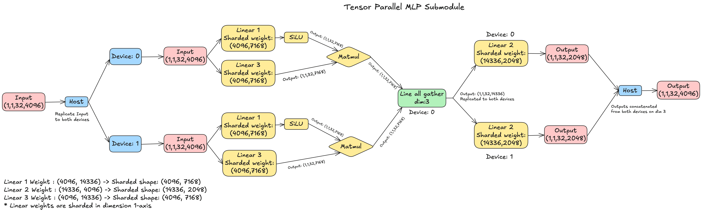
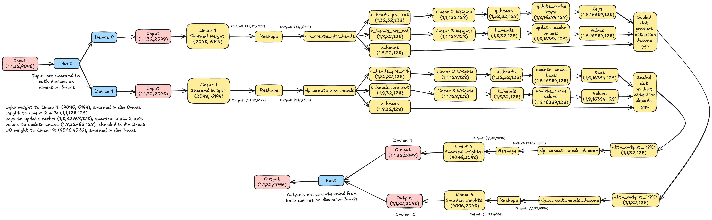

#  Llama3.1_8b Tensor Parallel Model

## Contents

- [1. Overview](#1-overview)
- [2. Llama3.1_8b Submodules](#2-llama31_8b-submodules)
- [3. Tensor Parallelism](#3-tensor-parallelism)
  - [3.1 Tensor Parallel MLP Submodule](#31-tensor-parallel-mlp-submodule)
  - [3.2 Tensor Parallel RMS Norm Submodule](#32-tensor-parallel-rms-norm-submodule)
  - [3.3 Tensor Parallel Attention Submodule](#33-tensor-parallel-attention-submodule)
- [4. Conclusion](#4-conclusion)

## 1. Overview
The Llama 3.1 8B model is part of the LLaMA (Large Language Model Meta AI) family developed by Meta and is designed for advanced natural language processing (NLP) tasks. This model, containing 8 billion parameters, is optimized for various applications such as text generation, instruction-following, and chat-based systems. It provides high performance across a wide range of NLP benchmarks and has been a popular choice for fine-tuning, especially in use cases like chatbot systems and content generation.

## 2. Llama3.1_8b Submodules
Submodules of Llama3.1 are as follows:
- MLP
- RMS Norm
- Attention
- Decoder

## 3. Tensor Parallelism
When your model is too large to fit on a single device, tensor parallelism provides a solution by sharding the model parameters across the distributed SRAM/DRAM of multiple devices. Each device then performs computations on its portion of the data, with communication between devices occurring as needed to aggregate results via CCL primitives.

Key benefits of tensor parallelism include:
1. Ability to run larger models that exceed single-device memory capacity
2. Potential for increased computational throughput
3. Efficient utilization of multi-device systems

**Frequent APIs and Definitions**
- ShardTensorToMesh: To shard the tensor to the available devices on the dimension given
- ReplicateTensorToMesh: To replicate the tensor to the available devices.
- ConcatMeshToTensor: To concatenate the tensor on the dimension given from all the available devices
- line_all_gather: To gather the data of a tensor and concate in given dimension from all available devices in middle of parallel implementation. Line_all_gather is a collective operation. Any time spent in the collective op can be viewed as having two components:
  - Waiting for the other devices to reach the collective op
  - Performing the collective communication

### 3.1 Tensor Parallel MLP Submodule
The MLP Submodule contains Linear, SiLU and Matmul operations.
The diagram below illustrates the Tensor Parallelism of MLP Submodule:


In this representation, the input of shape (1,1,32,4096) is replicated over both the devices, wheareas the model parameters of MLP submodule, i.e. the weights of Linear op of MLP submodule are sharded. The weights of Linear 1, Linear 2 and Linear 3 are of shapes (4096, 14336), (14336, 4096), (4096, 14336) respectively. The weights are sharded in dimension 1-axis, to get the sharded weight shape of Linear 1, Linear 2 and Linear 3 as (4096,7168), (14336, 2048), (4096,7168) respectively in Tensor Parallel model.

Here is the Tensor Parallel implementation of MLP Submodule for the sequence length 32:
1. **Create a TTNN LLama3.1_8B MLP Submodule implementation**
```python
import torch
import ttnn
from ttnn import ShardTensorToMesh


class TtLlamaMLP(torch.nn.Module):
    def __init__(
        self,
        mesh_device,
        args,
        state_dict,
        weight_cache_path,
        layer_num,
        dtype,
        model_config,
    ):
        super().__init__()

        self.state_dict = state_dict
        self.mesh_device = mesh_device
        self.args = args
        self.model_config = model_config

        base_name = f"layers.{layer_num}.feed_forward"
        torch_weight = lambda name: torch.transpose(self.state_dict[f"{base_name}.{name}.weight"], -2, -1)
        cache_name = lambda name: weight_cache_path / (base_name + f".{name}")
        as_tensor = lambda name, type: ttnn.as_tensor(
            torch_weight(name),
            dtype=type,
            device=self.mesh_device,
            layout=self.model_config["MLP_W_LAYOUT_TILE"],
            memory_config=self.model_config["MLP_WEIGHTS_MEMCFG"],
            mesh_mapper=ShardTensorToMesh(self.mesh_device, dim=1),
            # cache_file_name=cache_name(name),
        )

        self.w1 = as_tensor("w1", ttnn.bfloat8_b)  # bfp4 normally ok here but sub .99 pcc for llama 3.1 weights
        self.w2 = as_tensor("w2", ttnn.bfloat8_b)
        self.w3 = as_tensor("w3", ttnn.bfloat8_b)  # same here

    def forward(self, x: ttnn.Tensor) -> ttnn.Tensor:
        """
        w1 -> gate_proj
        w2 -> down_proj
        w3 -> up_proj
        HF reference: self.down_proj(self.act_fn(self.gate_proj(x)) * self.up_proj(x))
        """
        seq_len = x.shape[-2]
        compute_kernel_config = self.model_config["MLP_KERNEL_CONFIG"]
        if seq_len >= 1024:  # Too big to compute. Set different program configs based on seqlen
            # Reshape input to to fit on mesh_device and parallelize computation
            x = ttnn.reshape(x, [1, seq_len // 1024, 1024, -1])
            pc_1 = self.model_config["PREFILL_MLP_W1_PRG_CONFIG"]
            pc_2 = self.model_config["PREFILL_MLP_W2_PRG_CONFIG"]
            pc_3 = self.model_config["PREFILL_MLP_W3_PRG_CONFIG"]
        else:
            pc_1 = self.model_config["PREFILL_MLP_W1_PRG_CONFIG_128"](seq_len)
            pc_2 = self.model_config["PREFILL_MLP_W2_PRG_CONFIG_128"](seq_len)
            pc_3 = self.model_config["PREFILL_MLP_W3_PRG_CONFIG_128"](seq_len)

        w1_out = ttnn.linear(
            x,
            self.w1,
            compute_kernel_config=compute_kernel_config,
            core_grid=ttnn.CoreGrid(y=8, x=8) if not pc_1 else None,
            dtype=ttnn.bfloat16,
            activation="silu" if not pc_1 else None,
            program_config=pc_1,
        )

        w3_out = ttnn.linear(
            x,
            self.w3,
            compute_kernel_config=compute_kernel_config,
            core_grid=ttnn.CoreGrid(y=8, x=8) if not pc_3 else None,
            dtype=ttnn.bfloat16,
            program_config=pc_3,
        )
        x.deallocate(True)
        w2_in = ttnn.multiply(w1_out, w3_out)

        w3_out.deallocate(True)
        w1_out.deallocate(True)

        w2_in = ttnn.to_device(w2_in, self.mesh_device)
        w2_in = ttnn.line_all_gather(w2_in, dim=3, num_links=1, memory_config=w2_in.memory_config())

        w2_out = ttnn.linear(
            w2_in,
            self.w2,
            compute_kernel_config=compute_kernel_config,
            core_grid=ttnn.CoreGrid(y=8, x=8) if not pc_2 else None,
            dtype=ttnn.bfloat8_b,
            program_config=pc_2,
        )

        w2_in.deallocate(True)

        if seq_len >= 2048:  # Reshape back to intended shape
            w2_out = ttnn.reshape(w2_out, [1, 1, seq_len, -1])

        return w2_out
```
2. **Instantiate torch model for comparison**
```python
dtype = ttnn.bfloat8_b
model_args = TtModelArgs(device=mesh_device)
state_dict = torch.load(model_args.consolidated_weights_path, map_location=torch.device("cpu"))

partial_state_dict = {k[22:]: v for k, v in state_dict.items() if (k.startswith("layers.0.feed_forward"))}

model_args.WEIGHTS_DTYPE = dtype
reference_model = FeedForward(
	dim=model_args.dim,
	hidden_dim=4 * model_args.dim,
	multiple_of=model_args.multiple_of,
	ffn_dim_multiplier=model_args.ffn_dim_multiplier,
)
reference_model.load_state_dict(partial_state_dict)
torch_input = torch.randn(1, 1, seq_len, 4096) # seq_len is 32
reference_output = reference_model(torch_input)
```

3. **Executing TTNN Llama3.1_8B MLP Module on MeshDevice with Tensor Parallel**
```python
tt_model = TtLlamaMLP(
        mesh_device=mesh_device,
        args=model_args,
        state_dict=state_dict,
        weight_cache_path=model_args.weight_cache_path(dtype),
        layer_num=0,
        dtype=dtype,
        model_config=model_args.get_model_config(),
    )
tt_input = ttnn.from_torch(
        torch_input,
        device=mesh_device,
        dtype=ttnn.bfloat16,
        memory_config=ttnn.L1_MEMORY_CONFIG,
        mesh_mapper=ReplicateTensorToMesh(mesh_device),
        layout=ttnn.TILE_LAYOUT,
    )
tt_output = tt_model(tt_input)
tt_output_torch = ttnn.to_torch(tt_output, mesh_composer=ConcatMeshToTensor(mesh_device, dim=3))

pcc_required = 0.99
passing, pcc_message = comp_pcc(reference_output, tt_output_torch, pcc_required)

logger.info(comp_allclose(reference_output, tt_output_torch))
logger.info(pcc_message)

if passing:
	logger.info("Llama_MLP Passed!")
else:
	logger.warning("Llama_MLP Failed!")

assert passing, f"Llama_MLP output does not meet PCC requirement {pcc_required}: {pcc_message}."
```

**Additional Notes:**
- In Tensor Parallelism, Linear Operation works well only when input is replicated and weights are sharded.
- At the moment, line_all_gather is the API to perform all_gather operation on 2 devices.

### 3.2 Tensor Parallel RMS Norm Submodule
The RMS Norm Submodule contains rms norm operation (ttnn API).
The diagram below illustrates the Tensor Parallelism of RMS Norm Submodule:


In this representation, the input and weights of shape (1,32,4096) is sharded to both the devices on dimension 2-axis. The sharded input and weight shape to the RMS Norm operation is (1,32,2048).

Here is the Tensor Parallel implementation of RMS Norm Submodule:
1. **Create a TTNN LLama3.1_8B RMS Norm Submodule implementation**
```python
class RMSNorm(LightweightModule):
    """
    RMSNorm supporting replication over a MeshDevice and sharding within devices.

    This class implements a Root Mean Square Normalization (RMSNorm) that can be
    distributed across multiple devices and cores. If the `device` parameter is a
    MeshDevice, the weights and computations are replicated across all devices in
    the mesh. Expects an interleaved input tensor, can optionally output a sharded tensor.

    Args:
        device: The device or MeshDevice on which to perform the computations.
        state_dict: The state dictionary containing the model parameters.
        dim: Input dimension (e.g. model hidden dimension size).
        layer_num: The layer number to determine the weight key in the state dictionary.
        weight_key: The key for retrieving the weight from the state dictionary.
        weight_cache_path: Optional path for caching the tilized weights.
        weight_memory_config: Configuration for the weight memory, default is DRAM_MEMORY_CONFIG.
        weight_dtype: The data type for the tensors, bfp8_b hits >0.999 PCC in the models we tested.
        model_config: Optional configuration dictionary for the model.
        is_sharded: Sharded version is faster for some models but doesn't support all batch sizes.
        eps (float): Small value to avoid division by zero in normalization, default is 1e-05.

    If model_config is provided, it must specify SHARDED_NORM_INPUT_MEMCFG, SHARDED_NORM_PRGM_CFG
    and SHARDED_NORM_OUTPUT_MEMCFG. If not provided, default configurations will be generated.
    """

    def __init__(
        self,
        device,
        dim,
        state_dict,
        weight_key,
        layer_num=None,
        weight_cache_path=None,
        weight_memory_config=ttnn.DRAM_MEMORY_CONFIG,
        weight_dtype=ttnn.bfloat8_b,
        model_config=None,
        is_sharded=False,
        eps: float = 1e-05,
    ):
        super().__init__()
        self.eps = eps
        self.is_sharded = is_sharded

        if layer_num is None:
            weight_name = f"{weight_key}.weight"
        else:
            weight_name = f"layers.{layer_num}.{weight_key}.weight"

        torch_weight = state_dict[weight_name].unsqueeze(0).view(1, 1, dim).expand([1, SHARD_HEIGHT, dim])
        cache_name = None if weight_cache_path is None else weight_cache_path / weight_name

        is_mesh_device = device.__class__.__name__ == "MeshDevice"
        self.weight = ttnn.as_tensor(
            torch_weight,
            device=device,
            dtype=weight_dtype,
            layout=ttnn.TILE_LAYOUT,
            memory_config=weight_memory_config,
            cache_file_name=cache_name,
            mesh_mapper=ttnn.ShardTensorToMesh(device, dim=2) if is_mesh_device else None,
        )

        if is_sharded:
            if model_config:
                self.input_config = model_config["SHARDED_NORM_INPUT_MEMCFG"]
                self.program_config = model_config["SHARDED_NORM_PRGM_CFG"]
                self.output_config = model_config["SHARDED_NORM_OUTPUT_MEMCFG"]
            else:
                assert (
                    dim % SHARD_HEIGHT == 0
                ), f"Input dimension dim ({dim}) must be a multiple of SHARD_HEIGHT ({SHARD_HEIGHT})"
                shard_width_hidden_dim_across_32_cores = dim // SHARD_HEIGHT
                core_grid = ttnn.CoreGrid(x=8, y=SHARD_HEIGHT // 8)
                self.input_config = ttnn.create_sharded_memory_config(
                    shape=(SHARD_HEIGHT, shard_width_hidden_dim_across_32_cores),
                    core_grid=core_grid,
                    strategy=ttnn.ShardStrategy.WIDTH,
                    orientation=ttnn.ShardOrientation.ROW_MAJOR,
                    use_height_and_width_as_shard_shape=True,
                )
                self.program_config = ttnn.LayerNormShardedMultiCoreProgramConfig(
                    compute_with_storage_grid_size=[core_grid.x, core_grid.y],
                    subblock_w=shard_width_hidden_dim_across_32_cores // TILE,
                    block_h=SHARD_HEIGHT // TILE,
                    block_w=shard_width_hidden_dim_across_32_cores // TILE,
                    inplace=False,
                )
                self.output_config = self.input_config

    def forward(self, x: ttnn.Tensor, out_sharded=False) -> ttnn.Tensor:
        if self.is_sharded:  # sharded version converts from interleaved inputs and optionally back
            x = ttnn.interleaved_to_sharded(
                x,
                self.input_config,
            )
            x = ttnn.rms_norm(
                x,
                epsilon=self.eps,
                weight=self.weight,
                program_config=self.program_config,
                memory_config=self.output_config,
            )
            if out_sharded:
                return x
            x_interleaved = ttnn.sharded_to_interleaved(x)
            x.deallocate(True)
            return x_interleaved
        else:  # Interleaved rmsnorm does not need program or memory configs
            assert not out_sharded, "Non-sharded version of RMSNorm cannot output a sharded tensor"
            x = ttnn.rms_norm(x, weight=self.weight, epsilon=self.eps)
            return x
```

2. **Instantiate torch model for comparison**
```python
dtype = ttnn.bfloat8_b
model_args = TtModelArgs(mesh_device)
state_dict = torch.load(model_args.consolidated_weights_path, map_location=torch.device("cpu"))

partial_state_dict = {k[24:]: v for k, v in state_dict.items() if (k.startswith("layers.0.attention_norm."))}
reference_model = RefRMSNorm(dim=model_args.dim)
reference_model.load_state_dict(partial_state_dict)

input = torch.rand(1, 32, 4096)
reference_output = reference_model(input)
```

3. **Executing TTNN Llama3.1_8B RMS Norm Submodule on MeshDevice with Tensor Parallel**
```python
tt_model = TtRMSNorm(
    device=mesh_device,
    dim=model_args.dim,
    state_dict=state_dict,
    layer_num=0,
    weight_key="attention_norm",
    weight_dtype=dtype,
)
tt_input = ttnn.from_torch(
    input,
    device=mesh_device,
    dtype=dtype,
    layout=ttnn.TILE_LAYOUT,
    mesh_mapper=ShardTensorToMesh(mesh_device, dim=2),
)

tt_output = tt_model(tt_input)
tt_output_torch = ttnn.to_torch(tt_output, mesh_composer=ConcatMeshToTensor(mesh_device, dim=2)).squeeze(0)

passing, pcc_message = comp_pcc(reference_output, tt_output_torch)

logger.info(comp_allclose(reference_output, tt_output_torch))
logger.info(pcc_message)

if passing:
    logger.info("Llama_rms_norm Passed!")
else:
    logger.warning("Llama_rms_norm Failed!")

assert passing, f"Llama_rms_norm output does not meet PCC requirement {0.99}."
```

### 3.3 Tensor Parallel Attention Submodule
The Attention Submodule contains Linear, Reshape operations and nlp_create_qkv_heads, scaled_dot_product_attention_decode_gqa, nlp_concat_heads_decode ttnn APIs
The diagram below illustrates the Tensor Parallelism of Attention Submodule:


In this representation, the input of shape (1,1,32,4096) is sharded to both the devices on dimension 3-axis, the sharded input shape is (1,1,32,2048). The wqkv weight to Linear 1 operation of shape (4096, 6144) is sharded on dimension 0-axis, the shared shape is (2048,6144). The rotary_mat of shape (1,1,128,128) is one of the input given during the ttnn function call, which is multiplied with q_heads_pre_rot and k_heads_pre_rot in Linear 2 and Linear 3 operations to produce q_heads and k_heads. The keys and values of shape (1,8,32768,128) are sharded on dimension 2-axis, the sharded shape to update cache of keys and values is (1,8,16384,128). The w0 weight of shape (4096, 4096) is sharded on dimension 1-axis, the sharded shape to perform Linear 4 operation is (4096, 2048).

Here is the Tensor Parallel implementation of Attention Submodule:
1. **Create a TTNN LLama3.1_8B Attention Submodule implementation**
```python
class TtLlamaAttention(nn.Module):
    def __init__(
        self,
        devices,
        state_dict,
        weight_cache_path,
        layer_num,
        dtype,
        configuration,
        rot_mat,
        start_pos,
    ):
        super().__init__()

        self.state_dict = state_dict
        self.devices = devices
        self.num_devices = len(devices)

        self.hidden_size = configuration.dim
        self.n_heads = configuration.n_heads
        self.head_dim = self.hidden_size // self.n_heads
        self.max_seq_len = configuration.max_seq_len
        self.max_batch_size = configuration.max_batch_size
        self.n_kv_heads = configuration.n_kv_heads
        self.start_pos = start_pos

        self.n_local_heads = self.n_heads // self.num_devices
        self.n_local_kv_heads = self.n_kv_heads // self.num_devices

        self.dtype = dtype

        self.kv_seq_len = configuration.kv_seq_len
        self.sliding_window = configuration.sliding_window
        self.grid_size = configuration.max_grid_size

        self.model_config = configuration.get_model_config()
        self.compute_kernel_config = configuration.get_compute_kernel_config()

        self.rot_mat = rot_mat  # Rotational matrix in the form of a list of 8K tensors [1,1,head_dim,head_dim] for positional embedding on device

        layer_name = f"layers.{layer_num}.attention"
        cache_name = lambda name: weight_cache_path / (f"{layer_name}.{name}")

        wq_str = f"{layer_name}.wq.weight"
        wk_str = f"{layer_name}.wk.weight"
        wv_str = f"{layer_name}.wv.weight"
        wo_str = f"{layer_name}.wo.weight"

        # when splitting the devices, we need to make sure that the number of heads is divisible by the number of devices
        assert self.n_heads % self.num_devices == 0
        assert self.n_kv_heads % self.num_devices == 0

        self.wqkv_list = []
        self.wo_list = []
        self.layer_past_list = []

        for i in range(self.num_devices):
            wqkv = ttnn.as_tensor(
                torch.concat(
                    [
                        torch.transpose(
                            torch.chunk(self.state_dict[wq_str], self.num_devices)[i],
                            -2,
                            -1,
                        ),
                        torch.transpose(
                            torch.chunk(self.state_dict[wk_str], self.num_devices)[i],
                            -2,
                            -1,
                        ),
                        torch.transpose(
                            torch.chunk(self.state_dict[wv_str], self.num_devices)[i],
                            -2,
                            -1,
                        ),
                    ],
                    dim=-1,
                ),
                device=self.devices[i],
                dtype=self.dtype,
                memory_config=self.model_config["ATTN_WEIGHTS_MEMCFG"],
                layout=self.model_config["ATTN_W_LAYOUT_TILE"],
                # cache_file_name=cache_name("wqkv"),
                mesh_mapper=ttnn.ShardTensorToMesh(self.devices[i], dim=0),
            )

            wo = ttnn.as_tensor(
                torch.transpose(
                    torch.chunk(self.state_dict[wo_str], self.num_devices, dim=-1)[i],
                    -2,
                    -1,
                ),
                device=self.devices[i],
                memory_config=self.model_config["ATTN_WEIGHTS_MEMCFG"],
                dtype=self.dtype,
                layout=self.model_config["ATTN_W_LAYOUT_TILE"],
                cache_file_name=cache_name("wo"),
                mesh_mapper=ttnn.ShardTensorToMesh(self.devices[i], dim=1),
            )

            cache_k = torch.zeros(
                (
                    self.max_batch_size,
                    self.n_kv_heads // self.num_devices,
                    self.sliding_window,
                    self.head_dim,
                )
            )
            cache_v = torch.zeros(
                (
                    self.max_batch_size,
                    self.n_kv_heads // self.num_devices,
                    self.sliding_window,
                    self.head_dim,
                )
            )
            layer_past = [cache_k, cache_v]
            layer_past = [
                ttnn.from_torch(
                    lp,
                    device=self.devices[i],
                    layout=self.model_config["ATTN_W_LAYOUT_TILE"],
                    dtype=self.dtype,
                    mesh_mapper=ttnn.ShardTensorToMesh(self.devices[i], dim=2),
                )
                for lp in layer_past
            ]

            # add to the list
            self.wqkv_list.append(wqkv)
            self.wo_list.append(wo)
            self.layer_past_list.append(layer_past)

        self.q_heads_program_config = ttnn.MatmulMultiCoreReuseMultiCastProgramConfig(
            compute_with_storage_grid_size=ttnn.CoreCoord(self.grid_size.x, self.grid_size.y),
            in0_block_w=4,
            out_subblock_h=4,
            out_subblock_w=1,
            per_core_M=4,
            per_core_N=1,
            transpose_mcast=False,
            fused_activation=None,
        )
        self.k_heads_program_config = ttnn.MatmulMultiCoreReuseMultiCastProgramConfig(
            compute_with_storage_grid_size=ttnn.CoreCoord(self.grid_size.x, self.grid_size.y),
            in0_block_w=4,
            out_subblock_h=1,
            out_subblock_w=1,
            per_core_M=1,
            per_core_N=1,
            transpose_mcast=False,
            fused_activation=None,
        )

        self.expand_program_config = ttnn.MatmulMultiCoreReuseMultiCastProgramConfig(
            compute_with_storage_grid_size=ttnn.CoreCoord(self.grid_size.x, self.grid_size.y),
            in0_block_w=4,
            out_subblock_h=2,
            out_subblock_w=2,
            per_core_M=4,
            per_core_N=4,
            transpose_mcast=False,
            fused_activation=None,
        )

        self.reduce_program_config = ttnn.MatmulMultiCoreReuseMultiCastProgramConfig(
            compute_with_storage_grid_size=ttnn.CoreCoord(self.grid_size.x, self.grid_size.y),
            in0_block_w=4,
            out_subblock_h=4,
            out_subblock_w=1,
            per_core_M=4,
            per_core_N=1,
            transpose_mcast=False,
            fused_activation=None,
        )

        self.attn_program_config = ttnn.MatmulMultiCoreReuseProgramConfig(
            compute_with_storage_grid_size=ttnn.CoreCoord(8, 4),
            in0_block_w=1,
            out_subblock_h=1,
            out_subblock_w=4,
            per_core_M=1,
            per_core_N=32,
        )
        self.compute_kernel_config_attn = ttnn.WormholeComputeKernelConfig(
            math_fidelity=ttnn.MathFidelity.LoFi,
            fp32_dest_acc_en=True,
            packer_l1_acc=True,
        )
        self.attention_grid = ttnn.CoreCoord(8, 4)
        self.scale = self.head_dim**-0.5

    def forward_decode(
        self,
        xs: List[ttnn.Tensor],
        current_pos: int,
        attn_masks: Optional[List[ttnn.Tensor]] = None,
        rot_mat=None,
    ) -> ttnn.Tensor:
        """
        x: (seq_len, 1, batch, hidden_dim)
        start_pos: the length of the KV cache. Same as current token's index.
        attn_mask: (seq_len, n_heads, batch, cache_len + seqlen
        """
        self.start_pos += 1
        padded_layer_past_len = min(nearest_32(self.start_pos), self.sliding_window)
        layer_slice = min((self.start_pos), self.sliding_window)

        dense_outputs = []
        for i in range(self.num_devices):
            x = xs[i]
            wqkv = self.wqkv_list[i]
            wo = self.wo_list[i]
            layer_past = self.layer_past_list[i]
            assert self.max_batch_size * self.n_kv_heads < 64
            ###
            # QKV matmuls
            ###
            xqkv_fused = ttnn.linear(
                x,
                wqkv,
                memory_config=self.model_config["XQKV_MM_OUTPUT_MEMCFG"],
                compute_kernel_config=self.compute_kernel_config,
                dtype=self.dtype,
                core_grid=self.grid_size,
            )

            # Reshape such that true unpadded batch is tracked in shape
            fqkv_shape = xqkv_fused.shape
            xqkv_fused = ttnn.reshape(
                xqkv_fused, ttnn.Shape((1, 1, self.max_batch_size, fqkv_shape[3]), (1, 1, 32, fqkv_shape[3]))
            )

            # ttnn.deallocate(x)

            ###
            # Reshape and rotary embeddings
            ###
            (
                q_heads_pre_rot,  # [seqlen, n_heads, bsz, head_dim]
                k_heads_pre_rot,  # [seqlen, n_kv_heads, bsz, head_dim]
                v_heads,  # [seqlen, n_kv_heads, bsz, head_dim]
            ) = ttnn.experimental.nlp_create_qkv_heads(
                xqkv_fused,
                num_heads=self.n_local_heads,
                num_kv_heads=self.n_local_kv_heads,
                transpose_k_heads=False,
                memory_config=self.model_config["QKV_HEADS_OUTPUT_MEMCFG"],
            )

            ttnn.deallocate(xqkv_fused)

            # Update rotary matrix on device
            rotary_mat = rot_mat

            q_heads = ttnn.linear(
                q_heads_pre_rot,
                rotary_mat,
                # program_config=self.q_heads_program_config,
                memory_config=ttnn.DRAM_MEMORY_CONFIG,
                compute_kernel_config=self.compute_kernel_config,
                dtype=ttnn.bfloat16,
            )

            k_heads = ttnn.linear(
                k_heads_pre_rot,
                rotary_mat,
                # program_config=self.k_heads_program_config,
                memory_config=self.model_config["QV_ROT_EMB_OUTPUT_MEMCFG"],
                compute_kernel_config=self.compute_kernel_config,
                dtype=self.dtype,
            )

            ttnn.deallocate(q_heads_pre_rot)
            ttnn.deallocate(k_heads_pre_rot)

            ###
            # KV update
            ###
            keys = layer_past[0]
            values = layer_past[1]

            # k_heads, [seqlen, n_kv_heads, bsz, head_dim]
            # v_heads [seqlen, n_kv_heads, bsz, head_dim]
            # keys, [max_batch_size, n_kv_heads // self.num_devices, sliding_window, head_dim]
            ttnn.kv_cache.update_cache_for_token_(keys, k_heads, current_pos)
            ttnn.kv_cache.update_cache_for_token_(values, v_heads, current_pos)
            self.layer_past_list[i] = [keys, values]

            ttnn.deallocate(k_heads)
            ttnn.deallocate(v_heads)

            attn_output_1G4D = ttnn.transformer.scaled_dot_product_attention_decode_gqa(
                q_heads,
                keys,
                values,
                [current_pos for _ in range(self.max_batch_size * self.n_kv_heads)],
                scale=self.scale,
                program_config=self.model_config["SDPA_DECODE_PROGCFG"],
                compute_kernel_config=self.model_config["SDPA_DECODE_COMPUTE_PROGCFG"],
                memory_config=ttnn.DRAM_MEMORY_CONFIG,
            )

            attn_output_11BH = ttnn.to_memory_config(
                attn_output_1G4D, memory_config=self.model_config["SCORES_BATCHED_MM_OUTPUT_MEMCFG"]
            )
            attn_output_cat = ttnn.experimental.nlp_concat_heads_decode(
                attn_output_11BH,
                num_heads=self.n_heads,
            )
            attn_output_cat = ttnn.reshape(attn_output_cat, ttnn.Shape((1, 1, 32, self.hidden_size)))

            dense_out = ttnn.linear(
                attn_output_cat,
                wo,
                memory_config=self.model_config["LM_HEAD_OUTPUT_MEMCFG"],
                compute_kernel_config=self.compute_kernel_config,
                # core_grid=self.grid_size,
            )  # seqlen, 1, batch, hidden_size

            ttnn.deallocate(attn_output_cat)
            dense_outputs.append(dense_out)

        # return the sum of the outputs
        if len(dense_outputs) > 1:
            return None  # tt_all_reduce(dense_outputs)
        else:
            return dense_outputs
```

2. **Instantiate torch model for comparison**
```python
dtype = ttnn.bfloat8_b
pcc = 0.99

model_args = TtModelArgs(mesh_device)
state_dict = torch.load(model_args.consolidated_weights_path, map_location=torch.device("cpu"))

# Ref model needs partial state dict, but our models use full state dict keys as cached weight names
partial_state_dict = {k[19:]: v for k, v in state_dict.items() if (k.startswith("layers.0.attention."))}

reference_model = Attention(args=model_args)
reference_model.load_state_dict(partial_state_dict)

batch = model_args.max_batch_size
seq_len = 1

generation_start_pos = 0
generation_length = 1  # 10
all_tests_pass = True

# pre-compute the rotational embedding matrix and send to mesh_device
current_rot_mat, rot_matrix = get_single_rot_mat(
    model_args.head_dim,
    mesh_device,
    start_pos=0,
)
cos, sin = precompute_freqs(model_args.head_dim, model_args.max_seq_len * 2)
freqs_cis = torch.complex(cos, sin)
for i in range(generation_length):
    pt_attention_input = (torch.rand(batch, seq_len, model_args.dim) * 2) - 1
    current_pos = generation_start_pos + i
    freqs_cis_i = freqs_cis[current_pos, :].unsqueeze(0)
    reference_output = reference_model(pt_attention_input, current_pos, freqs_cis_i, mask=None)
```

3. **Executing TTNN Llama3.1_8B Attention Submodule on MeshDevice with Tensor Parallel**
```python
tt_model = TtLlamaAttention(
    [mesh_device],
    state_dict,
    weight_cache_path=model_args.weight_cache_path(dtype),
    layer_num=0,
    dtype=dtype,
    configuration=model_args,
    rot_mat=None,
    start_pos=generation_start_pos,
)
for i in range(generation_length):
    pt_attention_input = (torch.rand(batch, seq_len, model_args.dim) * 2) - 1

    tt_attention_input = pt_attention_input.clone()
    current_pos = generation_start_pos + i

    attention_input, pos = prepare_inputs_ttnn(
        tt_attention_input,
        current_pos,
        model_args.dim,
        model_args.sliding_window,
        mesh_device,
    )

    tt_out = tt_model([attention_input], pos, rot_mats=current_rot_mat)
    # multi-device attention module returns replicated output
    assert isinstance(tt_out, list)
    tt_out = tt_out[0]
    tt_output_torch = (
        ttnn.to_torch(tt_out, mesh_composer=ttnn.ConcatMeshToTensor(mesh_device, dim=3))
        .view(1, -1, 4096)
        .permute(1, 0, 2)[: model_args.max_batch_size, :, :]
    )
    passing, pcc_message = comp_pcc(reference_output, tt_output_torch, pcc)

    logger.info(comp_allclose(reference_output, tt_output_torch))
    logger.info(pcc_message)

    if passing:
        logger.info(f"[pos={current_pos}] Llama_Attention Passed!")
    else:
        logger.warning(f"[pos={current_pos}] Llama_Attention Failed!")
        all_tests_pass = False

    # Update rotation matrix for next iteration
    current_rot_mat = ttnn.linear(rot_matrix, current_rot_mat)

    if True:  # FIXME: Issue #10648
        # Check kv cache
        # PyTorch output --------------------------------------------------------------------
        pytorch_layer_present = [
            reference_model.cache_k.clone().permute(0, 2, 1, 3),  # [batch, n_kv_heads, seq, head_dim]
            reference_model.cache_v.clone().permute(0, 2, 1, 3),  # [batch, n_kv_heads, seq, head_dim]
        ]
        # TT hardware execution -------------------------------------------------------------
        tt_layer_present = []
        for layer_past in tt_model.layer_past_list:
            tt_layer_present.append(
                [
                    ttnn.to_torch(cache, mesh_composer=ttnn.ConcatMeshToTensor(mesh_device, dim=2))
                    for cache in layer_past
                ]
            )

        tt_layer_present = tt_layer_present[0]

        for i, (cache_pt, cache_tt) in enumerate(zip(pytorch_layer_present, tt_layer_present)):
            cache_length_to_check = min(model_args.sliding_window, generation_start_pos + generation_length + 1)
            cache_pt = cache_pt[:, :, generation_start_pos:cache_length_to_check, :]
            cache_tt = cache_tt[:, :, generation_start_pos:cache_length_to_check, :]
            does_pass, output_pcc = comp_pcc(cache_pt, cache_tt, pcc)
            if i == 0:
                logger.info(f"K cache output: {output_pcc}")
            else:
                logger.info(f"V cache output: {output_pcc}")

            if does_pass:
                logger.info(f"KV Cache Passed!")
            else:
                logger.warning(f"KV Cache Failed! PCC value is lower than {pcc}")
                all_tests_pass = False

if all_tests_pass:
    logger.info("Llama Attention output Passed!")
else:
    logger.warning("Llama Attention output Failed!")
    assert all_tests_pass, f"PCC value is lower than {pcc} for some of the outputs. Check Warnings!"

```

**Addition Notes**
- Currently, Tensor Parallelism for Llama3.1_8b is on main for n300, the cookbook need to be updated to be aligned with the implementation on [main](https://github.com/tenstorrent/tt-metal/tree/main/models/demos/wormhole/llama31_8b_N300)
