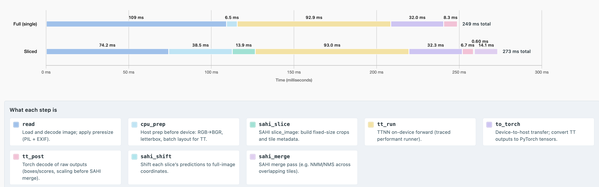
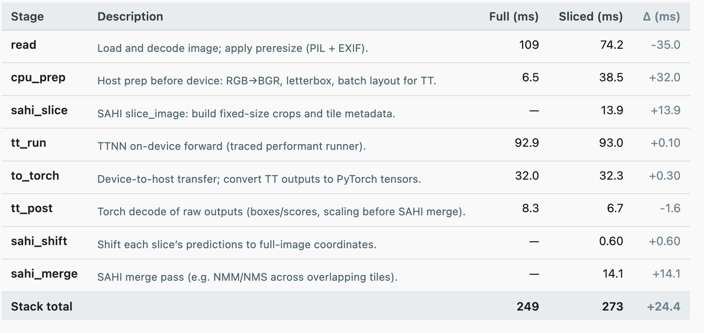

# 4K Image Slicing on 24 Wormhole Chips on a Galaxy

This note documents a **Tenstorrent** run of `sahi_ultralytics_eval.py` on a **3840×2160** frame, **SAHI-tiled** into **24** crops, with **one distinct 640×640 slice per chip** per forward (`--tt-slice-parallel-devices 24`). It matches the workflow described in [README_SAHI.md](README_SAHI.md) (UHD example) and the artifacts under `sample_images_output/`.

1. 4k Image Slicing into 24 Slices of 640x640, running Yolov8s model, graph and visualization with stage description, along with the example image.

Full Image (Non-Sliced)

Sliced Image Grid

Sliced Image

Full vs Sliced

Batch Size = 32, Data Parallel on WH Galaxy

