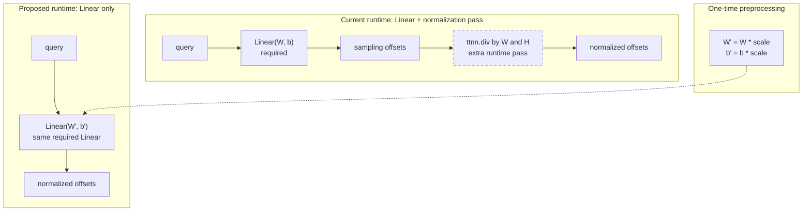

## Context

MSDA predicts sampling offsets from the current query with a Linear layer, so that Linear is required and cannot be precomputed away. Its output is then divided by the `[W,H]` of each feature level. That normalizer is derived from the feature-pyramid configuration and is constant at runtime.

Scaling the output of an affine layer by a per-output-channel constant is equivalent to scaling its weight and bias, so the required Linear can be made to emit normalized offsets directly:

```
scale = 1 / normalizer

Linear(x, W, b) / normalizer
  = x(W * scale) + b * scale

W' = W * scale
b' = b * scale
```

The benefit is not a smaller Linear — it processes the same queries and produces the same output either way. It is that the `ttnn.div` following it disappears from every forward, with its dispatch, its read of the Linear output, the normalizer broadcast and the intermediate it materializes.

The prototype removes the divide for approximately 6.7% of post-fusion layer kernel time; that describes the prototype branch, not the current implementation. This ticket removes the standalone `1/[W,H]` normalization; #55204 later folds the remaining coordinate transformation into sampling-grid construction.



## Problem

- [`spatial_shapes` is uploaded and `offset_normalizer` is derived during `forward`](https://github.com/tenstorrent/tt-metal/blob/main/models/experimental/bevformer/tt/tt_ms_deformable_attention.py#L282-L294), although both are fixed by the feature-pyramid configuration.
- [A separate `ttnn.div` normalizes the complete Linear output on every MSDA call](https://github.com/tenstorrent/tt-metal/blob/main/models/experimental/bevformer/tt/tt_ms_deformable_attention.py#L289-L294).
- That pass is avoidable: the same transformation is representable in the parameters of the Linear that already has to execute.

## Proposed direction

- Build the per-output-channel scale: X channels take `1/W`, Y channels take `1/H`, with the per-level values repeating across heads and sampling points in the Linear's output-channel order.
- Fold the scale into `sampling_offsets` weight and bias during [model preprocessing](https://github.com/tenstorrent/tt-metal/blob/main/models/experimental/bevformer/tt/model_preprocessing.py#L133-L145) or initialization, once per model load.
- Generalize the [existing one-level VADv2 helper](https://github.com/tenstorrent/tt-metal/blob/main/models/experimental/vadv2/tt/tt_utils.py#L9-L41) to SCA's multi-level layout.
- Remove the runtime divide while preserving the sampling-coordinate convention.

## Acceptance criteria

- [ ] The runtime offset-normalizer divide is absent from the profile, and no equivalent post-Linear scaling operation is introduced in its place.
- [ ] The sampling-offset Linear produces normalized offsets directly.
- [ ] Weight and bias are folded once per model load, not per forward.
- [ ] TSA and multi-level SCA use the correct `1/W` and `1/H` scale for every feature level and coordinate axis.
- [ ] Existing MSDA, TSA, SCA, layer, and encoder PCC suites pass at their configured thresholds, including PCC >= 0.997 for the base encoder.
- [ ] Same-configuration profiling reports device time, operation count, and cold-/steady-state behavior.

## References

- [MSDA PCC tests](https://github.com/tenstorrent/tt-metal/blob/main/models/experimental/bevformer/tests/pcc/test_ms_deformable_attention.py)
- [Prototype implementation](https://github.com/tenstorrent/tt-metal/commit/d86d2f722fbecdd210e96c2927a9b9648211ebf5)
