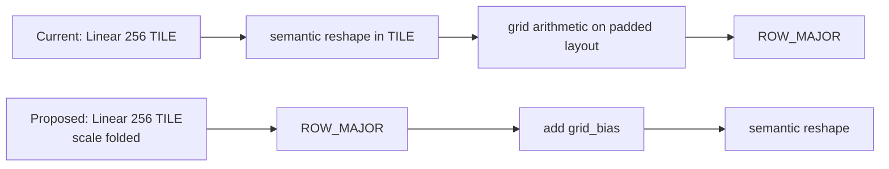

## Context

The sampling-offset Linear already emits every `(head, level, point, xy)` value flattened as a dense `(bs, Q, 256)` tensor, which is exactly what TILE layout is efficient at. The current implementation reshapes it into `(..., heads, levels, points, 2)` immediately, and with `points=4` the resulting `(4,2)` tail occupies padded `32x32` tile regions. All grid arithmetic and the later ROW_MAJOR conversion then run on that padded representation.

The goal is to keep the 256 channels flattened for as long as the tensor is tiled, convert the dense `(bs, Q, 256)` tensor to ROW_MAJOR first, and materialize the small semantic dimensions only afterwards.

Prototype profiling shows that this reduces layer kernel time by 18.8%, improves PCC by removing two bfloat16 rounding steps, and removes the padded allocation behind the 200x200 SCA OOM.

## Problem

- [The dense `(bs, Q, 256)` Linear output is reshaped straight into `(..., levels, points, 2)`](https://github.com/tenstorrent/tt-metal/blob/main/models/experimental/bevformer/tt/tt_ms_deformable_attention.py#L251-L256), before any grid arithmetic runs.
- [Reference points are added on those padded dimensions](https://github.com/tenstorrent/tt-metal/blob/main/models/experimental/bevformer/tt/tt_ms_deformable_attention.py#L303-L309), after a further reshape that splits out the depth dimension.
- [Grid scaling and shifting then run as two separate elementwise operations](https://github.com/tenstorrent/tt-metal/blob/main/models/experimental/bevformer/tt/tt_ms_deformable_attention.py#L74-L75) on the same padded representation.
- [Conversion to ROW_MAJOR happens per level inside the sampling loop](https://github.com/tenstorrent/tt-metal/blob/main/models/experimental/bevformer/tt/tt_ms_deformable_attention.py#L85), so it reads the padded TILE data instead of the dense Linear output.

## Proposed direction

The grid expression

`grid = 2 * (reference_points + offsets / [W,H]) - 1`

can be rewritten as

`grid = (2 * reference_points - 1) + (2 * offsets / [W,H])`

which separates the per-channel scale from the per-query bias and makes both foldable:

- Fold `2/[W,H]` into the sampling-offset Linear weight and bias, so it directly emits scaled, normalized offsets.
- Precompute `grid_bias = 2*reference_points-1` as a flattened tensor in the same 256-channel order.
- Runtime grid construction becomes one add on dense ROW_MAJOR `(bs, Q, 256)` data, followed by the semantic reshape.

The point of the rewrite is not only that it removes elementwise operations: it is what allows the grid to be constructed *before* the small `(levels, points, 2)` dimensions are materialized. The two expressions are mathematically equivalent; only the bfloat16 rounding schedule changes.

## Acceptance criteria

- [ ] Sampling-grid arithmetic does not run on TILE-padded `(levels, points, 2)` dimensions.
- [ ] The dense Linear output is converted to ROW_MAJOR before the small semantic dimensions are materialized.
- [ ] Runtime grid construction uses one add, with normalization and scaling folded into Linear parameters and `grid_bias`.
- [ ] The 200x200 SCA PCC case completes without the existing large intermediate allocation.
- [ ] Same-configuration profiling reports the percentage change in layout, BinaryNg, and total layer time, and existing PCC suites pass at their configured thresholds, including PCC >= 0.997 for the base encoder.

## References

- [Prototype implementation](https://github.com/tenstorrent/tt-metal/commit/a32ddae6c62363ba9ad45844a8d08e8655d564b4)
- [MSDA PCC tests](https://github.com/tenstorrent/tt-metal/blob/main/models/experimental/bevformer/tests/pcc/test_ms_deformable_attention.py)
- [SCA PCC tests](https://github.com/tenstorrent/tt-metal/blob/main/models/experimental/bevformer/tests/pcc/test_spatial_cross_attention.py)
