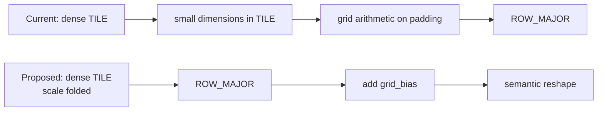

## Context

The sampling-offset Linear produces a dense `(bs, Q, 256)` tensor that is efficient in TILE layout. The current implementation reshapes it too early into semantic dimensions ending in `(num_points, 2)=(4,2)`, which occupy padded `32x32` TILE regions before grid arithmetic runs.

Prototype profiling shows that this reduces layer kernel time by 18.8%, improves PCC by removing two bfloat16 rounding steps, and removes the padded allocation behind the 200x200 SCA OOM.

## Problem

- [Sampling offsets are reshaped from the dense Linear output into small TILE-padded dimensions before reference points are added](https://github.com/tenstorrent/tt-metal/blob/main/models/experimental/bevformer/tt/tt_ms_deformable_attention.py#L282-L307).
- [Grid scaling and shifting then run as separate elementwise operations](https://github.com/tenstorrent/tt-metal/blob/main/models/experimental/bevformer/tt/tt_ms_deformable_attention.py#L70-L75) on that inefficient representation.
- Conversion to ROW_MAJOR happens after the reshape and arithmetic, so it must read the padded TILE data.

## Proposed direction

`grid = 2 * (reference_points + offsets / [W,H]) - 1`

`grid = (2 * reference_points - 1) + normalized_offsets`

- Fold `2/[W,H]` into the sampling-offset Linear weight and bias so it emits `normalized_offsets`.
- Precompute `grid_bias = 2*reference_points-1` in the Linear's channel order.
- Convert the dense Linear output to ROW_MAJOR before creating `(heads, levels, points, 2)`, then construct the runtime grid with one add.

The expressions are mathematically equivalent; only the bfloat16 rounding schedule changes.

## Acceptance criteria

- [ ] Sampling-grid arithmetic does not run on TILE-padded `(levels, points, 2)` dimensions.
- [ ] The dense Linear output is converted to ROW_MAJOR before the small semantic dimensions are materialized.
- [ ] Runtime grid construction uses one add, with normalization and scaling folded into Linear parameters and `grid_bias`.
- [ ] The 200x200 SCA PCC case completes without the existing large intermediate allocation.
- [ ] Same-configuration profiling reports the percentage change in layout, BinaryNg, and total layer time, and existing PCC suites pass at their configured thresholds, including PCC >= 0.997 for the base encoder.

## References

- [Prototype implementation](https://github.com/tenstorrent/tt-metal/commit/a32ddae6c62363ba9ad45844a8d08e8655d564b4)
- [MSDA PCC tests](https://github.com/tenstorrent/tt-metal/blob/main/models/experimental/bevformer/tests/pcc/test_ms_deformable_attention.py)
- [SCA PCC tests](https://github.com/tenstorrent/tt-metal/blob/main/models/experimental/bevformer/tests/pcc/test_spatial_cross_attention.py)
