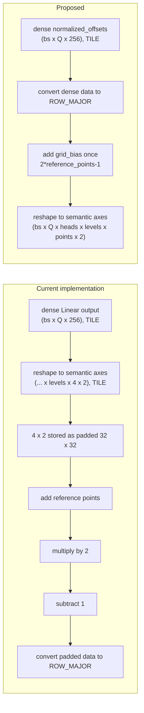

## Context

The sampling-offset Linear produces a dense `(bs, Q, 256)` tensor. This is a good TILE-layout shape: the 256-channel row is fully occupied.

The current implementation reshapes that tensor too early into semantic dimensions ending in `(num_levels, num_points, 2)`. With `num_points=4`, the logical `(4, 2)` tail occupies only 8 values, but TILE layout represents it with a padded `32 x 32` region containing 1024 values. Subsequent elementwise operations therefore process 127 padding values for every useful sampling coordinate.

Converting to ROW_MAJOR after this reshape is also expensive because the conversion must read the padded TILE representation before writing the compact logical data. The optimization is therefore not simply to use ROW_MAJOR: it is to keep `(bs, Q, 256)` dense while tiled, convert that representation to ROW_MAJOR, and only then expose the small head, level, point, and XY dimensions.

Prototype profiling shows that keeping the arithmetic on unpadded ROW_MAJOR rows reduces layer kernel time by 18.8%, improves PCC by removing two bfloat16 rounding steps, and removes the large padded allocation behind the 200x200 SCA out-of-memory case.

## Problem

- [Sampling offsets are reshaped from the dense Linear output into small tiled dimensions before reference points are added](https://github.com/tenstorrent/tt-metal/blob/main/models/experimental/bevformer/tt/tt_ms_deformable_attention.py#L282-L307).
- The trailing logical `(4, 2)` dimensions are padded to `32 x 32` in TILE layout, so reference-point addition and normalization operate on 128 times more storage than useful coordinate data.
- [Grid normalization launches separate multiply-by-2 and subtract-1 operations](https://github.com/tenstorrent/tt-metal/blob/main/models/experimental/bevformer/tt/tt_ms_deformable_attention.py#L70-L75) after the padded representation has been created.
- The later TILE-to-ROW_MAJOR conversion must read this padded representation before producing compact rows.

## Proposed direction

Keep the dense Linear output until after conversion to ROW_MAJOR and rewrite:

`grid = 2 * (reference_points + offsets / [W,H]) - 1`

as:

`grid = (2 * reference_points - 1) + normalized_offsets`

- Fold the `2/[W,H]` scale into both the sampling-offset Linear weight and bias so it emits `normalized_offsets`.
- Precompute `2*reference_points-1` as `grid_bias` in the Linear's channel order.
- Convert the dense `(bs, Q, 256)` Linear output to ROW_MAJOR before reshaping it to `(bs, Q, heads, levels, points, 2)`.
- Construct the runtime grid with one elementwise add between `normalized_offsets` and `grid_bias`.
- Preserve the mathematical result; only the bfloat16 rounding schedule changes because intermediate divide, multiply, and subtract results are no longer materialized.

## Acceptance criteria

- [ ] Sampling-grid elementwise arithmetic does not run after `(levels, points, 2)` has been materialized in TILE layout.
- [ ] The dense `(bs, Q, 256)` Linear output is converted to ROW_MAJOR before the head, level, point, and XY dimensions are created.
- [ ] Runtime grid construction uses one add, with no separate offset-normalizer divide, multiply-by-2, or subtract-1.
- [ ] The `2/[W,H]` scale is folded into both Linear weight and bias, and `grid_bias` matches the Linear's channel order.
- [ ] The 200x200 SCA PCC case completes without the existing large intermediate allocation.
- [ ] A same-configuration profile reports the percentage change in total layer and BinaryNg time.
- [ ] Existing MSDA, TSA, SCA, layer, and encoder PCC suites pass at their configured thresholds, including PCC >= 0.997 for the base encoder.

## References

- [Prototype implementation](https://github.com/tenstorrent/tt-metal/commit/a32ddae6c62363ba9ad45844a8d08e8655d564b4)
- [MSDA PCC tests](https://github.com/tenstorrent/tt-metal/blob/main/models/experimental/bevformer/tests/pcc/test_ms_deformable_attention.py)
- [SCA PCC tests](https://github.com/tenstorrent/tt-metal/blob/main/models/experimental/bevformer/tests/pcc/test_spatial_cross_attention.py)
