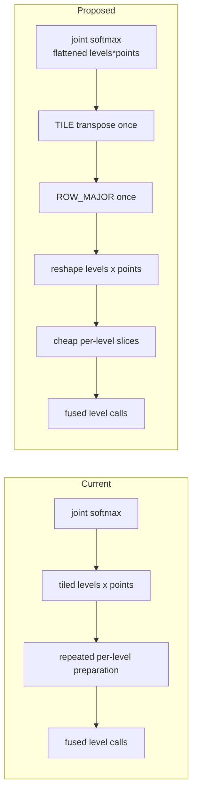

## Context

Attention weights are produced and softmaxed over a dense `levels*points` dimension. In the base configuration, `levels=4` and `points=4`, so each head has 16 jointly normalized weights.

Prototype profiling shows that moving preparation outside the level loop reduces layer kernel time by 12.6% while preserving PCC.

## Problem

- [The current path reshapes the jointly softmaxed `levels*points` dimension into `(levels, points)` while the tensor is still tiled](https://github.com/tenstorrent/tt-metal/blob/main/models/experimental/bevformer/tt/tt_ms_deformable_attention.py#L261-L272).
- A fused call needs one level slice, but slicing small, tile-padded `(4,4)` dimensions can require an untilize/slice/re-tilize preparation path.
- Fused MSDA runs once per FPN level, so this layout work can be repeated for slices of the same source tensor.

## Proposed direction

- Keep `levels*points` flattened while tiled and move heads with one TILE transpose, which is cheaper than the equivalent ROW_MAJOR permutation.
- Convert the complete attention tensor to ROW_MAJOR once, then reshape `levels*points` into `(levels, points)`.
- Inside the level loop, only slice the already-prepared tensor and pass the slice to fused MSDA.
- Preserve joint softmax normalization over all `levels*points`; only layout and preparation order change.

## Acceptance criteria

- [ ] Head-major preparation and ROW_MAJOR conversion run once per MSDA call, outside the level loop.
- [ ] `levels*points` remains flattened while tiled and is split into `(levels, points)` only after conversion to ROW_MAJOR.
- [ ] Each fused level call consumes only a slice of the prepared tensor, without repeated re-tilize preparation.
- [ ] Softmax still normalizes jointly over every level and sampling point.
- [ ] A same-configuration profile reports the percentage change in layout-preparation time and total layer kernel time.
- [ ] Existing MSDA, SCA, TSA, layer, and encoder PCC suites pass at their configured thresholds, including PCC >= 0.997 for the base encoder.

## References

- [Prototype implementation](https://github.com/tenstorrent/tt-metal/commit/c649b46fee237ebc5b17e838b80354aa2c337144)
- [MSDA PCC tests](https://github.com/tenstorrent/tt-metal/blob/main/models/experimental/bevformer/tests/pcc/test_ms_deformable_attention.py)
