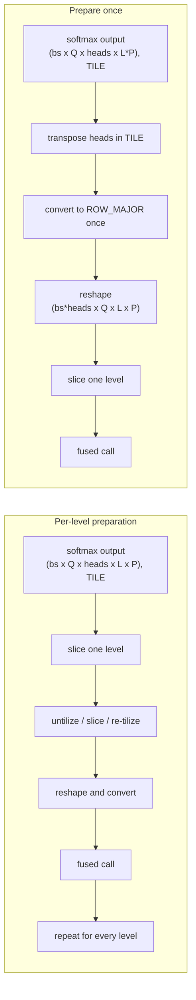

## Context

Multi-level SCA needs one attention tensor sliced by level. Preparing the complete tensor once is cheaper than repeatedly converting small, tile-padded level slices.

Prototype profiling shows that moving preparation outside the level loop reduces layer kernel time by 12.6% while preserving PCC.

## Problem

- [The current decomposed implementation prepares attention weights once after all levels have been sampled](https://github.com/tenstorrent/tt-metal/blob/main/models/experimental/bevformer/tt/tt_ms_deformable_attention.py#L108-L121).
- A one-fused-call-per-level implementation can instead slice a tiled `(num_levels, num_points)` tail before layout conversion.
- Non-aligned level slices require repeated untilize, slice, and re-tilize work even though every level consumes the same source tensor.

## Proposed direction

- Move the head axis while attention weights are still tiled.
- Convert the complete `levels*points` tensor to ROW_MAJOR once.
- Split levels in ROW_MAJOR and pass one slice to each fused call.
- Keep softmax over the joint level-and-point dimension unchanged.

## Acceptance criteria

- [ ] Attention weights are transposed and converted to ROW_MAJOR once per MSDA call, outside the level loop.
- [ ] Each level requires only a slice from the prepared tensor.
- [ ] No repeated re-tilize path is introduced for non-aligned level slices.
- [ ] Softmax still normalizes jointly over every level and sampling point.
- [ ] A same-configuration profile reports the percentage reduction in layout time and total layer kernel time.
- [ ] Existing MSDA, SCA, TSA, layer, and encoder PCC suites pass at their configured thresholds, including PCC >= 0.997 for the base encoder.

## References

- [Prototype implementation](https://github.com/tenstorrent/tt-metal/commit/c649b46fee237ebc5b17e838b80354aa2c337144)
- [MSDA PCC tests](https://github.com/tenstorrent/tt-metal/blob/main/models/experimental/bevformer/tests/pcc/test_ms_deformable_attention.py)
