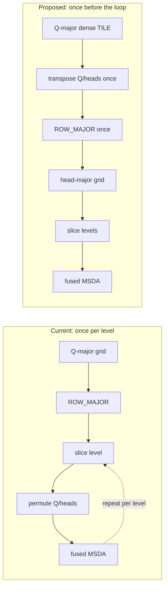

## Context

The sampling-offset Linear produces `(bs, Q, 256)` with `256 = heads*levels*points*2 = 8*4*4*2`, and [#55204](https://github.com/tenstorrent/tt-metal/issues/55204) keeps that representation dense while the tensor is TILE. Fused MSDA, however, consumes each level with batch and heads ahead of queries, effectively `(bs*heads, Q, points, 2)`. The ordering must therefore change from query-major `(bs, Q, heads, ...)` to head-major `(bs, heads, Q, ...)` somewhere along the path.

Prototype profiling shows that a single TILE transpose can remove all per-level grid permutes and reduce layer kernel time by 7.9% without changing PCC.

## Problem

- [The current grid path slices each level, converts it to ROW_MAJOR, and only then permutes heads before queries](https://github.com/tenstorrent/tt-metal/blob/main/models/experimental/bevformer/tt/tt_ms_deformable_attention.py#L84-L91).
- That permutation is real ROW_MAJOR data movement on short rows, and it rebuilds the same head-major ordering once per FPN level — four times for the base configuration.
- The head split is available much earlier: separating `heads` leaves a flattened width of `levels*points*2 = 32`, so the grid can be viewed as `(bs, Q, heads, 32)` while still tiled, where the Q/head swap is a tile-level transpose done once.

Central intuition: if fused MSDA needs head-major data anyway, establish head-major ordering once while the complete grid is still TILE, instead of rebuilding it independently for every ROW_MAJOR level slice.

## Proposed direction

[#55204](https://github.com/tenstorrent/tt-metal/issues/55204) keeps the sampling payload flattened while tiled and delays the small `(levels, points, 2)` dimensions until ROW_MAJOR. This issue uses that same dense representation to move `heads` before `Q` before leaving TILE:

```
(bs, Q, 256) TILE -> (bs, Q, heads, 32) TILE -> transpose Q/heads once
  -> (bs, heads, Q, 32) TILE -> ROW_MAJOR once -> add broadcast grid_bias
  -> expose/slice levels -> fused MSDA
```

- Reshape and transpose the head axis while the Linear output is still tiled.
- Convert the complete head-major grid to ROW_MAJOR once.
- Keep `grid_bias` with a singleton head axis and broadcast it after the tensor is head-major; reference-point bias is shared across heads, so it never needs per-head copies.
- Slice levels only after the head-major layout has been established, so each fused call costs one slice.



## Acceptance criteria

- [ ] SCA and TSA sampling grids become head-major before leaving TILE layout.
- [ ] Per-level ROW_MAJOR grid permutes are absent from the profile.
- [ ] Level slicing and final fused-op reshapes preserve constant row width.
- [ ] A same-configuration profile reports the percentage change in grid-layout and total layer time.
- [ ] Existing MSDA, TSA, SCA, layer, and encoder PCC suites pass at their configured thresholds, including PCC >= 0.997 for the base encoder.

## References

- [Prototype implementation](https://github.com/tenstorrent/tt-metal/commit/e6b4ce53fe163df02964a3655d55222a0a3ed5e0)
- [MSDA PCC tests](https://github.com/tenstorrent/tt-metal/blob/main/models/experimental/bevformer/tests/pcc/test_ms_deformable_attention.py)
