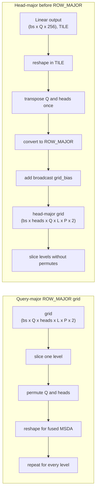

## Context

The fused MSDA contract places batch and attention heads before the query axis. Moving the head axis while the grid is tiled can swap whole tiles; repeating the move on ROW_MAJOR level slices copies short rows.

Prototype profiling shows that a single TILE transpose can remove all per-level grid permutes and reduce layer kernel time by 7.9% without changing PCC.

## Problem

- [The current grid path slices each level and then permutes heads before queries](https://github.com/tenstorrent/tt-metal/blob/main/models/experimental/bevformer/tt/tt_ms_deformable_attention.py#L84-L91).
- Moving the axis separately for every level repeats the same layout work.
- A ROW_MAJOR reshape is not a free view when it changes row width, so reshaping from a wide Linear output directly to an XY-width tensor still materializes data.

## Proposed direction

- Reshape and transpose the head axis while the Linear output is still tiled.
- Convert the complete head-major grid to ROW_MAJOR once.
- Apply the reference-point bias with a singleton head axis and broadcast it across heads.
- Slice levels only after the head-major layout has been established.

## Acceptance criteria

- [ ] SCA and TSA sampling grids become head-major before leaving TILE layout.
- [ ] Per-level ROW_MAJOR grid permutes are absent from the profile.
- [ ] Level slicing and final fused-op reshapes preserve constant row width.
- [ ] A same-configuration profile reports the percentage change in grid-layout and total layer time.
- [ ] Existing MSDA, TSA, SCA, layer, and encoder PCC suites pass at their configured thresholds, including PCC >= 0.997 for the base encoder.

## References

- [Prototype implementation](https://github.com/tenstorrent/tt-metal/commit/e6b4ce53fe163df02964a3655d55222a0a3ed5e0)
- [MSDA PCC tests](https://github.com/tenstorrent/tt-metal/blob/main/models/experimental/bevformer/tests/pcc/test_ms_deformable_attention.py)
