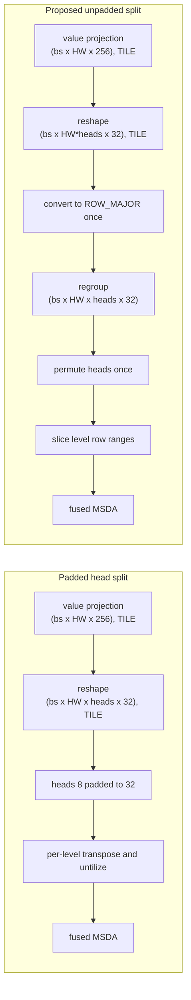

## Context

The value projection emits 256-wide tiled rows, while fused MSDA consumes one 32-channel row per attention head. Placing the eight-head axis in a tiled dimension pads it to 32 and expands layout work fourfold.

Prototype benchmarking selected an unpadded row-axis split that is bit-identical to the padded route and reduces total layer kernel time by 2.3%.

## Problem

- [The current value path splits feature levels, converts each level to ROW_MAJOR, moves the head axis, and reshapes for sampling](https://github.com/tenstorrent/tt-metal/blob/main/models/experimental/bevformer/tt/tt_ms_deformable_attention.py#L70-L82).
- A fused integration that first reshapes tiled `value` to `(batch, rows, heads, head_dim)` materializes a head dimension padded from 8 to 32.
- Removing one padded reshape can introduce a large ROW_MAJOR permute, so the complete conversion chain must be benchmarked rather than individual operations.

## Proposed direction

- Fold heads into the row axis while preserving the 32-wide `head_dim`.
- Untilize once, regroup rows at constant width, and move the head axis once in ROW_MAJOR.
- Slice feature-level row ranges only after the unpadded head split.
- Benchmark the complete old and new chains at the real feature-pyramid shapes before changing the model.

## Acceptance criteria

- [ ] The selected value-layout path is benchmarked end to end, including all reshapes, layout conversions, permutes, and slices.
- [ ] The head split does not create a tiled dimension padded from 8 to 32.
- [ ] Old and new conversion chains produce bit-identical tensors before fused MSDA.
- [ ] A same-configuration profile reports the percentage change for the conversion group and complete layer.
- [ ] Existing MSDA, TSA, SCA, layer, and encoder PCC suites pass at their configured thresholds, including PCC >= 0.997 for the base encoder.

## References

- [Prototype implementation](https://github.com/tenstorrent/tt-metal/commit/7820f325bd86cbca8dfcbe27cf460204c8d9773c)
- [MSDA PCC tests](https://github.com/tenstorrent/tt-metal/blob/main/models/experimental/bevformer/tests/pcc/test_ms_deformable_attention.py)
