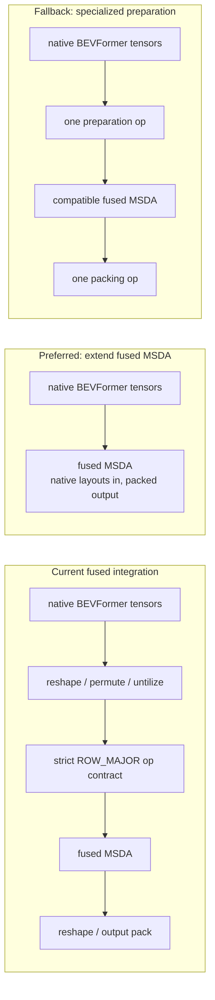

## Context

The fused MSDA operation accepts a strict head-batched ROW_MAJOR contract. Even after the model-side layout optimizations under ticket `03`, BEVFormer must still move the value head axis, untilize the value tensor, reshape operands to the op contract, and repack the output.

On the prototype branch, this remaining preparation is approximately 14% of layer kernel time. This is not a measurement of the current implementation; it is the residual expected after the prerequisite fusion and layout changes.

## Problem

- [The current MSDA path moves value and grid axes and repacks the sampled output around each level](https://github.com/tenstorrent/tt-metal/blob/main/models/experimental/bevformer/tt/tt_ms_deformable_attention.py#L70-L124).
- [Sampling-location preparation adds another layout-sensitive path before the MSDA core](https://github.com/tenstorrent/tt-metal/blob/main/models/experimental/bevformer/tt/tt_ms_deformable_attention.py#L282-L307).
- A static Linear-weight reorder cannot move a channel axis across the row axis required by the fused operation, so the remaining transforms cannot be eliminated in preprocessing.
- Any unavoidable remainder may still require multiple launches and intermediate DRAM tensors.

## Proposed direction

- Start from the measured remainder after the model-side changes under ticket `03`.
- Prefer extending the [fused MSDA input contract](https://github.com/tenstorrent/tt-metal/blob/main/ttnn/cpp/ttnn/operations/experimental/multi_scale_deformable_attn/device/multi_scale_deformable_attn_device_operation.cpp#L27-L55) to accept native BEVFormer layouts and perform address remapping inside the existing kernel.
- If compatibility prevents that contract extension, benchmark one specialized preparation/packing operation against the current sequence.
- Preserve the existing API as a compatible path for [callers such as VADv2](https://github.com/tenstorrent/tt-metal/blob/main/models/experimental/vadv2/tt/tt_utils.py#L45-L107).
- Coordinate the layout-contract proposal with ticket `05.03`, which extends the same operation to multiple feature levels.

## Acceptance criteria

- [ ] The scope contains only transformations that remain after tickets `03.02` through `03.05`.
- [ ] Native-layout fusion and a specialized preparation operation are compared with the unchanged path at TSA and SCA shapes.
- [ ] The selected approach produces a repeatable net reduction in layout time, launches, and intermediate memory.
- [ ] PCC is checked against both the existing fused path and the Torch reference so a layout-only change cannot hide a numerical change.
- [ ] Fused-op, VADv2, and BEVFormer MSDA/layer/encoder tests pass, including PCC >= 0.997 for the base encoder.

## References

- [MSDA PCC tests](https://github.com/tenstorrent/tt-metal/blob/main/models/experimental/bevformer/tests/pcc/test_ms_deformable_attention.py)
- [Prototype layout sequence through sampling-grid preparation](https://github.com/tenstorrent/tt-metal/commit/e6b4ce53fe163df02964a3655d55222a0a3ed5e0)
- [Prototype value-layout preparation](https://github.com/tenstorrent/tt-metal/commit/7820f325bd86cbca8dfcbe27cf460204c8d9773c)
