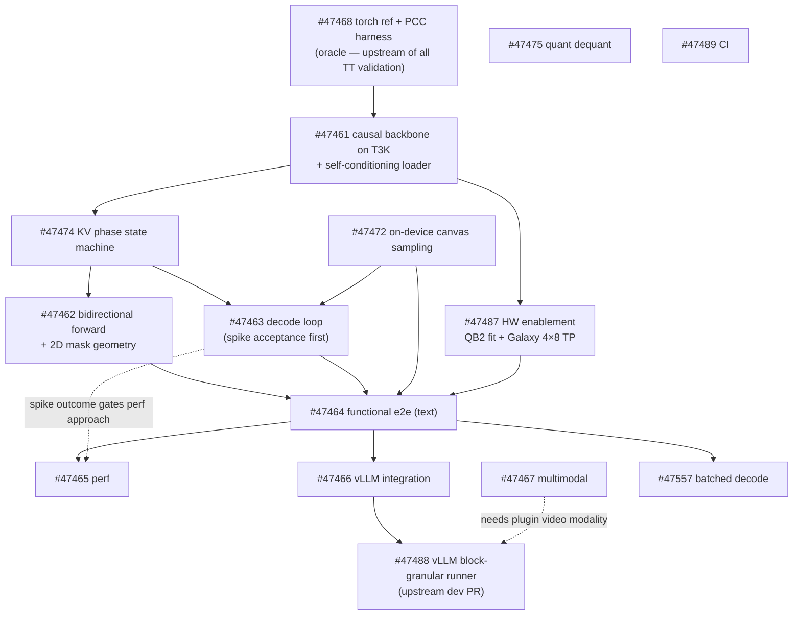

# DiffusionGemma 26B-A4B-it — tt-metal bring-up plan

Implementation plan for bringing up **Google DiffusionGemma 26B-A4B-it** on Tenstorrent hardware.

- **Tracking issue:** [tenstorrent/tt-metal#47452](https://github.com/tenstorrent/tt-metal/issues/47452) (label `DiffusionGemma`)
- **Work branch:** `zni/diffusion-gemma-bringup`
- **New module root:** `models/experimental/diffusion_gemma/`
- **Companion doc:** [`AGENTS.md`](./AGENTS.md) — terse working context for agents. This file is the executable plan: milestones, per-issue workstreams, dependencies, risks, and acceptance gates.

> **TL;DR.** The text backbone is identical to the in-repo **Gemma-4 26B-A4B MoE** (`models/demos/gemma4/`). The real work is the **generation procedure**, not the backbone: a block-autoregressive multi-canvas *text-diffusion* loop with **bidirectional canvas attention**, a **three-phase KV-cache state machine**, **entropy-budget acceptance sampling**, and **self-conditioning**. Bring up text-first on T3K (correctness) → QB2 (product).

---

## 1. Goals & success criteria

From the parent issue §4. Each criterion is mapped to an owning workstream in §6.

| # | Success criterion | Owner(s) | Milestone |
|---|---|---|---|
| 1 | Near-term **QB2 only**; BHG (Galaxy) later, then broader HW | #47487 | Functional / Functional+ |
| 2 | **Max context 256K** (256 × 1024) | #47474, #47462, #47463, #47464 | Functional |
| 3 | Inputs: text · T+I · T+V | text=Functional; T+I/T+V=#47467 | Functional / Functional+ |
| 4 | **Max possible batch** given context | #47557 (canvas batch) + #47487 (budget/ceiling) | Functional+ |
| 5 | All input resolutions | #47467 | Functional+ |
| 6 | **On-device sampling** | #47472 | Functional |
| 7 | **vLLM** integration (tenstorrent/vllm TT plugin) | #47466, #47488 | Functional |
| 8 | Automatic Prefix Caching (APC) | best-effort — **not a Functional gate** (see §9, R-APC) | — |
| 9 | _Optional:_ quantized ckpt loading (FP8 / NVFP4) | #47475 | Infra/optional |

---

## 2. Model summary

**Text backbone (identical to Gemma-4 26B-A4B MoE):** 30 layers · hidden 2816 · 16 heads / 8 KV · head_dim 256 · MoE 128 experts top-8 + 1 shared MLP · `moe_intermediate` 704 · sliding-window 1024 interleaved with full-attention · dual RoPE (θ = 1e6 full / 1e4 sliding) · final logit softcap 30 · vocab 262144 · `canvas_length` 256. _(All verified against `config.json` / HF card / vLLM blog.)_

**Vision tower (Functional+):** `gemma4_vision`, 27 layers · hidden 1152 · `patch_size` 16 · `vision_soft_tokens_per_image` 280 — all confirmed in `config.json`. _("SigLIP" is an author-applied family label, **not** a primary-source name (config = `gemma4_vision`)._ For variable resolutions use the token budgets 70/140/280/560/1120 from #47467.)

### 2.1 How it generates — block-autoregressive multi-canvas diffusion

The **same backbone, shared weights**, runs in three phases per 256-token block, selected by attention mode:

1. **Prefill (encoder, causal)** — encode the prompt; write KV.
2. **Denoise (decoder, bidirectional)** — iteratively denoise a 256-token *canvas*. Cross-attends to the prompt by **concatenating encoder K/V in front of canvas K/V** (prefix-style, no separate cross-attn module). **Read-only** on the prompt/committed KV; the canvas's own K/V is **recomputed every step** (a 256-token mini-prefill against the frozen prefix) and is **never written into the frozen cache until commit**.
3. **Commit (encoder, causal)** — re-encode the finished canvas, append its KV, emit 256 tokens. Then the next block.

**Noise = RANDOM tokens, not `[MASK]`.** The canvas is initialized to random token ids; rejected positions are re-noised to random tokens (uniform discrete diffusion, not absorbing-mask).

**Per denoise step** (≤ 48 steps; `12–16` typical-halt is anecdotal, not a design constant): temperature-scale (linear 0.8 → 0.4) → **Gumbel-max** `argmax(logits/T + gumbel)` → **entropy-budget acceptance** (accept most→least confident until accumulated entropy exceeds a budget) → re-noise the rest → stop when the argmax canvas is stable AND mean entropy < threshold, or step cap. **Commit = clean argmax**, not the noisy sampled values.

**Self-conditioning** (extra weights beyond the backbone): previous-step softmax → probability-weighted average of token embeddings → small **gated MLP** → added to canvas embeddings. Active only in denoise; **zeroed on encoder passes**.

> Algorithm reference: transformers `modeling_diffusion_gemma.py` (`DiffusionGemmaForBlockDiffusion`); vLLM blog <https://vllm-project.github.io/2026/06/10/diffusion-gemma.html>.

---

## 3. Reuse vs build

### Reuse — the backbone is already in-repo
`models/demos/gemma4/` is a near-complete, trace-compatible on-device Gemma-4 26B-A4B MoE: `tt/model.py`, `tt/moe.py`, `tt/router.py`, `tt/experts/`, `tt/shared_mlp.py`, `tt/attention/`, weight loading, CCL/TP. MoE / softcap / dual-RoPE / weight-loading match the target. On-device sampling reference: `models/common/sampling/generator.py` (AR/last-token-shaped — a canvas/per-position variant is net-new).

**Already present — do NOT rebuild:**
- **K=V tying for full-attn (global) layers only** — flag `attention_k_eq_v` (`tt/model_config.py:45`), gated `… and not self.is_sliding` (`tt/attention/__init__.py:34`), impl `v_w = k_w` (`tt/attention/weights.py:73`). **Sliding/local layers keep a real separate V** — this matters for the bidirectional local-window path (#47462).
- Scaleless V-norm (`tt/attention/prefill.py:61` and `:214`, `decode.py:84`).
- Bounded-sliding hybrid KV cache; tokenizer / chat-template.

### Net-new — the real work
| # | Item | Owner | Notes |
|---|---|---|---|
| N1 | Bidirectional canvas attention + 2D mask geometry + non-causal long-context path | #47462 | gemma4 SDPA is hardcoded `is_causal=True` |
| N2 | Three-phase KV-cache state machine | #47474 | prereq → #47462/#47463 |
| N3 | Discrete-diffusion decode loop (entropy / Gumbel-max / renoise / accept / commit) | #47463 | **spike acceptance first** |
| N4 | Self-conditioning gated MLP — **loader → #47461**, **runtime (denoise-only) → #47463** | #47461 / #47463 | the one net-new weight module |
| N5 | On-device canvas sampling (per-position over 256) | #47472 | keep logits/probs on device |

---

## 4. Milestones & exit criteria

| Milestone | HW | Scope | Exit criteria | Perf |
|---|---|---|---|---|
| **Foundation** | T3K | Correctness gate (not a product target) | Causal 26B-A4B backbone PCC vs HF on **T3K** (#47461) on the DiffusionGemma ckpt; torch ref + PCC harness (#47468) live | — |
| **Functional** | **QB2** (gated on #47487) | text-only · batch 1 · max ctx 256K · on-device sampling · vLLM | E2E text generation matches torch ref at 256K on QB2; served via TT plugin | TTFT ~50%, t/s/u ~100% |
| **Functional +** | + BHG, then broader HW | + T+I / T+V · all resolutions · batch>1 | Multimodal e2e; batched decode at PCC parity to batch=1 | t/s/u ~200% |
| **Complete** | all | everything | — | — |

**QB2/Galaxy HW enablement (#47487) is a hard prereq of the *Functional* milestone, NOT of Foundation.** Foundation validates correctness on T3K (the only HW 26B-A4B runs on today).

---

## 5. Critical path & dependencies

**Dependency notes (verified against sub-issue bodies):**
- **#47468 (oracle) is upstream of all TT validation.** The torch reference + harness scaffolding has *no* dependency on the TT-side loader and should be built first. Only the **self-conditioning module-level PCC** within #47468 needs the #47461 loader to exist — captured by the N4 ownership tag, not by a "loader gates harness" edge.
- **#47474 is a hard prereq** of #47462 and #47463 (both structurally depend on the three-storage-class KV contract).
- **#47463's acceptance spike outcome gates #47465's perf approach** — see R1.
- **#47488 depends on #47466** (promoted out of it) and **lives in tenstorrent/vllm `dev`** (separate repo, lands via PR).
- **#47557 (batch>1) depends on the #47464 batch-1 baseline**; interacts with #47488 (block-granular) and #47474 (per-request KV).
- **#47487 budget must include #47474 canvas scratch + #47462 non-causal mask** — see R3.

**Critical path to Functional.** The backbone/loop spine converges on #47464, which then forks into a perf tail and a serving tail, alongside a co-critical HW track:

`#47468 → #47461 → #47474 → {#47462, #47463 (spike first), #47472} → #47464 → { #47465 perf ; #47466 → #47488 serving }`

- **#47487 is a co-critical parallel track, not ordinary parallel** — it `→ #47464` (a hard prereq, see §6). A slow QB2 fit / Galaxy 4×8 TP enablement directly delays #47464 and becomes shared critical path.
- **The serving tail is real and the least-controllable.** vLLM is a hard Functional criterion (criterion 7); #47466 → #47488 depends on #47464 and extends **past** #47465. **#47488 is an upstream tenstorrent/vllm `dev` PR** (separate repo / review — R6) — the least-controllable tail.
- **#47472** has no upstream dependency but is consumed by #47463/#47464 (must land before they complete).

---

## 6. Workstreams

Each workstream lists **scope**, **depends-on**, **key code anchors**, **approach**, and **acceptance**.

### Foundation

#### #47468 — Torch reference model + PCC harness
- **Scope:** Vendor the HF `DiffusionGemmaForBlockDiffusion` torch reference with **deterministic** `generate` (fixed seed + fixed schedule) as the PCC oracle. Build a harness validating per-op / per-module / full-denoising-trajectory fidelity — including **entropy values** and **Gumbel-max argmax agreement** — by injecting the torch run's exact noise into the TT path.
- **Depends-on:** none (build first).
- **Anchors:** `tests/ttnn/utils_for_testing.py` (`assert_with_pcc`); `tech_reports/ttnn/comparison-mode.md` (auto per-op PCC).
- **Approach:** Stand up the oracle independent of any TT code. Add hooks to inject the torch run's Gumbel noise + random-renoise token ids (on-device RNG won't bit-match — see R5). The harness must validate **diffusion decisions**, not just logits (bfp8 small-probability drift can flip accept/renoise).
- **Acceptance:** Deterministic torch trajectory reproducible; harness can PCC any TT module against the oracle and diff entropy/argmax decisions per step.

#### #47461 — Causal Gemma-4 26B-A4B backbone on T3K
- **Scope:** Bring up the existing causal backbone on the **DiffusionGemma checkpoint**; validate it reproduces HF logits (PCC + coherent greedy generation) on **T3K**. Implement the **net-new self-conditioning gated MLP loader** (no such module in `gemma4/tt/`).
- **Depends-on:** #47468 oracle (to validate against).
- **Approach — two stages, do not conflate:** (1) bring up the unchanged gemma4 path and PCC vs HF on the **gemma4 ckpt**; (2) repoint to the **DiffusionGemma ckpt** and validate text weight mapping + causal-pass PCC — catch missing/renamed weight keys, the extra self-conditioning weights, and config diffs (per-layer q/k/v-norm + K=V reconciliation vs `modeling_diffusion_gemma.py`, `canvas_length`, …) — **before** any diffusion delta.
- **De-risk surface:** MoE-128/top-8 sparse routing, shared MLP, final softcap, dual-θ RoPE, 256K ctx, multi-device TP.
- **Acceptance:** Causal backbone logits PCC vs HF on T3K on the DiffusionGemma ckpt; self-cond loader lands so #47468's self-cond module PCC can run.

#### #47487 — HW enablement: QB2 fit + Galaxy 4×8 TP
- **Scope:** Fit/run the causal backbone on **QB2** (1×4 Blackhole) with a **documented memory budget + batch ceiling**, and wire a **4×8 TP/EP/SP mesh** for Galaxy/BHG. Validate backbone logits PCC on both.
- **Depends-on:** #47461 (validated backbone).
- **Facts:** 26B-A4B is T3K-only today (`models/demos/gemma4/README.md`); `is_galaxy` is currently used only for sampling args (`tt/model.py:407`) — no 4×8 mesh wired in `tt/`. Weight memory ≈ bf16 51.7 GB / bfp8 26 GB.
- **Approach:** Reuse `gemma4/tt/{config.py,ccl.py}`. **The QB2 budget must additionally account for the per-step canvas K/V scratch (#47474 storage class ii) and the non-causal long-context mask buffers (#47462)** — neither is exercised by the T3K causal run (R3). Size the batch ceiling against weights + 256K KV + canvas scratch + mask.
- **Acceptance:** Documented QB2 memory budget + batch ceiling at 256K; backbone PCC on QB2 and (later) Galaxy.

### Functional core

#### #47474 — KV-cache phase state machine *(prereq)*
- **Scope:** Per-phase KV state machine — prefill writes prompt KV; denoise **reads the frozen prefix without writing**; commit appends the finished 256-token block — with cache zones preventing the bounded sliding-window circular buffer from wrapping/corrupting the live window, on both full-attention and sliding layers, paged across the mesh.
- **Depends-on:** #47461 backbone.
- **Anchors:** `decode.py:119-224,76`; `prefill.py:91-96,77-90`; `kv_cache_hybrid.py:53-98`; `model.py:162-177,609`. Note: the existing `is_kv_shared` flag is architectural cross-layer KV-sharing (E2B/E4B), **not** a per-phase freeze. Circular sizing = `ceil(sliding_window / block_size)`.
- **Approach:** Define **three storage classes** — (i) frozen prompt/committed KV (paged, read-only); (ii) **per-step canvas K/V** recomputed each denoise step (ephemeral activations or a dedicated scratch zone — **must NOT be written into the cache during denoise** or it corrupts the frozen prompt KV); (iii) commit-append (write the finished canvas's KV once). Specify the page / circular-buffer mapping for local and full-attention layers.
- **Acceptance:** Encode-once + multi-block commit-append; PCC vs HF over **≥ 2 committed blocks**.

#### #47462 — Bidirectional encoder-decoder forward
- **Scope:** Non-causal SDPA + symmetric sliding-window (baked mask) + encoder-decoder K/V concat + K=V reuse + long-context (>32768) non-causal path + random-token canvas state + an **explicit 2D mask geometry contract**.
- **Depends-on:** #47474.
- **Anchors:** gemma4 SDPA hardcoded `is_causal=True` (`prefill.py:126,264`, `operations.py:333`). Non-causal refs: `models/experimental/pi0/tt/ttnn_gemma.py:320` (`scaled_dot_product_attention(attn_mask=…, is_causal=False)`), `models/tt_dit/encoders/gemma/model_gemma.py:253`. SDPA guard: `sliding_window_size` and `attn_mask` are **mutually exclusive** (`sdpa_device_operation.cpp:67-68`) ⇒ **bake the symmetric window into the mask**. Causal-only chunked long-context path: `operations.py:25-29`, `prefill.py:106-130`.
- **Approach:** Define the `[256, prompt_len+256]` mask geometry explicitly: canvas↔canvas bidirectional (local layers symmetric 2W+1 — resolve window units: vLLM `|q−k|<W` vs ttnn centered); canvas→prompt visibility per layer type; canvas absolute/RoPE positions offset by `prompt_len`; and how the mask is **chunked for long prompts**. Build a **non-causal chunked long-context path** (the existing one is causal-only and silently returns wrong results for seq>32768). Remember sliding/local layers keep a real separate V.
- **Acceptance:** Per-layer + final-logits PCC vs HF; correctness at >32768 up to 256K.

#### #47463 — Discrete-diffusion decode loop
- **Scope:** Temperature-scale → Gumbel-max → **entropy-budget acceptance** → random-token renoise → convergence/stop → **clean-argmax commit**, plus self-conditioning **runtime** (denoise-only, zeroed on encoder passes). The **entire loop runs inside the tt-metal model's `prefill_forward`/`decode_forward`**.
- **Depends-on:** #47474; uses #47472 sampling; acceptance gate needs #47468 noise injection.
- **Primitives:** entropy = softmax+log+mul+sum; Gumbel-max; renoise = where+scatter. `ttnn.sort` (values **and** indices), `ttnn.cumsum`, `ttnn.topk`, `ttnn.scatter` all exist.
- **⚠️ Spike first.** Entropy-budget acceptance = sort-by-confidence + cumulative-entropy threshold + scatter-back. The **unproven** parts: (a) scatter-back / inverse-permutation mapping accept decisions to original canvas positions; (b) the **data-dependent cutoff** under **static Metal Trace**; (c) trace-ability + perf of the whole sort→cumsum→scatter chain over the 256-position axis. The spike may conclude a new op/kernel or a small host fallback (256-element readback) is needed. **Treat "no new kernels" as a hypothesis.** The spike outcome **gates #47465** (R1).
- **Acceptance:** Multi-step trajectory PCC vs torch (entropy values + per-step argmax agreement) under injected noise; commit emits the clean argmax of all 256 positions.

#### #47472 — On-device canvas sampling
- **Scope:** User-facing sampling primitives — temperature schedule, Gumbel-max, seed/reproducibility, (forward-looking) top-k/top-p — across **all 256 canvas positions per step**, keeping logits/probs on device. Plumb through the TT plugin via `model_capabilities["supports_sample_on_device"]` + `TTSamplingParams`.
- **Depends-on:** no upstream dependency, but **consumed by #47463 and #47464** (must land before they can complete). Boundary with #47463: that issue owns the *control flow*; this owns the sampling *primitives*.
- **Anchors:** `models/common/sampling/generator.py` `SamplingGenerator` is AR/last-token-shaped (reference only) — a canvas/per-position variant is net-new. `TTSamplingParams` lives in the vLLM plugin.
- **Note:** top-k/top-p is **NOT shipped** in the reference (transformers defers it; vLLM PR #45429 open/unmerged) — ship temperature + Gumbel-max + entropy-budget first; treat top-k/p as forward-looking, not a gate.
- **Acceptance:** Matches HF reference distribution under fixed seed; temperature honored; **no per-step host readback of `[256, vocab]`**.

#### #47464 — Functional text-only e2e
- **Scope:** Integrate backbone + bidirectional forward + decode loop + on-device sampling into an e2e **text-only, batch-1, on-device-sampling** demo under `demo/`, validated at the **full 256K context** on {QB2, BHG}, with quality matching the torch reference. This is the block-autoregressive multi-canvas loop end-to-end (denoise → encode/commit → append → next canvas).
- **Depends-on:** #47462, #47463, #47472, **#47487 (HW — co-critical, see §5)**.
- **Anchors:** reuse `gemma4/tt/ccl.py`. The existing 256K demo (`text_demo_v2.py`) is validated only for the **12B** ckpt — the net-new gap is **full-256K canvas decode for 26B-A4B** (batched portion deferred to #47557).
- **Acceptance:** Coherent text output at 256K on QB2 matching torch-ref quality.

#### #47465 — Functional perf
- **Scope:** Optimize the functional text-only path to **TTFT ~50%, t/s/u ~100%** via Metal Trace of the per-step decoder, 2 command queues, and op-level tuning (bfloat8_b / LoFi / sharding / dealloc).
- **Depends-on:** #47464; **#47463 spike outcome** (R1).
- **Central tension:** adaptive early-stop (#47463) vs static-trace fixed shapes. Resolve as **fixed-max-steps + masked no-op** (traceable) vs an **untraced adaptive** path. If acceptance needs per-step host readback, the host sync defeats trace and puts this gate at risk.
- **Anchors:** reuse `gemma4` `generator_trace.py`; `tech_reports/.../AdvancedPerformanceOptimizationsForModels.md`; `tools/tracy/profile_this.py`.
- **Acceptance:** Perf targets met on QB2; trace strategy documented.

#### #47466 — vLLM integration (TT plugin)
- **Scope:** Serve via the [tenstorrent/vllm](https://github.com/tenstorrent/vllm) TT plugin (`dev`). Implement a registered TT model class (`DiffusionGemmaForCausalLM`, copyable from the gemma4 bridge) that **owns its forward + attention + KV**; document which serving features end up enabled.
- **Depends-on:** #47464 (working model).
- **Anchors:** `initialize_vllm_model` (`loader.py:39`), `prefill_forward` (`model_runner.py:1999`), `decode_forward` (`async_decode.py:473`), `allocate_kv_cache_per_layer`, `model_capabilities`; register in `register_tt_models()` (`platform.py`; HF arch auto-prefixed `TT`). Copy `Gemma4ForCausalLM` (registered as `TTGemma4ForCausalLM`).
- **Plugin constraints (verified on `dev`):** spec-decode hard-blocked (`platform.py:342`); chunked prefill unsupported (`platform.py:339-341`); phase-based continuous batching (a step is all-prefill OR all-decode); APC force-disabled for sliding-window models (`platform.py:512-521`); multimodal is image+text only today.
- **Approach:** The bidirectional attention + the whole denoise loop live **inside** the model's `prefill_forward`/`decode_forward` (loop internally, commit a 256-block, advance `start_pos`). vLLM's GPU `model_states` / per-request causal tensor / `DiffusionSampler` do **not** run here.
- **Acceptance:** Served e2e through the plugin; serving-feature matrix documented.

#### #47488 — vLLM block-granular runner/scheduler
- **Scope:** Define and land (on tenstorrent/vllm `dev`) the runner/scheduler contract so a decode step advances `start_pos` / page-tables / token-accounting by a **committed 256-token block** instead of one token, and serves coherent multi-block generation. Includes token-streaming semantics (whole-block vs incremental) and `num_computed_tokens` accounting.
- **Depends-on:** **#47466** (promoted out of it). **Different repo — lands via PR on `dev` (separate review cycle).** Blocker for serving.
- **Acceptance:** Multi-block generation served e2e via the plugin.

#### #47557 — Batched canvas decode
- **Scope:** Batch the diffusion canvas decode across requests — per-request canvas state (incl. self-conditioning + accept/freeze), batched bidirectional attention + MoE, paged/per-request KV + commit-append. **Batch=1 first, then batch=4**, with a **documented max-batch-given-context ceiling**.
- **Depends-on:** #47464 baseline; interacts with #47488, #47474.
- **Anchors:** gemma4 decode is currently single-user (batch>1 silently uses only user 0; `demos/gemma4/demo/text_demo.py:266-267,483`).
- **Acceptance:** PCC parity to batch=1; documented batch ceiling.

### Functional +

#### #47467 — Multimodal (image + video)
- **Scope:** Wire the `gemma4_vision` tower into the encoder prefix for **T+I** and **T+V** at all resolutions (variable 70/140/280/560/1120 token budgets; video ≤ 60s). Functional+ perf target t/s/u ~200%.
- **Depends-on:** **T+V needs plugin-side modality support** (the TT plugin is image+text only today — cross-ref #47466/#47488).
- **Anchors:** reuse `models/demos/multimodal/gemma3/tt/` vision encoder + projector; `llama_vision_model.py` for variable-res tiling.
- **Acceptance:** Coherent text output for T+I and T+V at all resolutions.

### Infra / optional

#### #47475 — Quantized checkpoint dequant converter
- **Scope:** Offline DeepSeek-style **dequant** converter turning RedHatAI FP8 / NVFP4 (compressed-tensors) checkpoints into bf16/bfp8 so they load and run PCC-matching the bf16 reference. **On-device FP8/NVFP4 arithmetic is explicitly deferred.**
- **Anchors:** `gemma4/tt/precision.py` `_DTYPE_BY_NAME` supports only bf16/bfp8/fp32; no dequant-on-load today (cf. DeepSeek `dequantize_hf_checkpoint.py`).
- **Note:** **NOT a load blocker** — the bf16 26B-A4B (~51.7 GB) loads directly. Optional / serving-perf.

#### #47489 — CI & perf-regression pipelines
- **Scope:** Wire into CI like gemma4 — per-module unit tests + diffusion-specific tests (bidirectional forward, denoise loop, self-conditioning), an e2e accuracy (PCC / denoise-trajectory) test, a perf-regression entry (TTFT + t/s/u), pipeline/threshold config gated on {QB2, BHG} runner availability.
- **Depends-on:** #47468 (oracle), #47465 (perf targets), #47487 (runners).
- **Anchors:** reuse gemma4 scaffolding (unit suite, `pcc_thresholds.json`, `vllm_harness.py`, `test_vllm_parity.py`); add `tests/pipeline_reorg/models_{unit,e2e}_tests.yaml` + a `pcc_thresholds.json`.

---

## 7. Validation / PCC strategy

Layered, oracle-driven (all via #47468):

1. **gemma4 ckpt, causal:** unchanged gemma4 path PCC vs HF — proves the backbone import is sound.
2. **DiffusionGemma ckpt, causal:** validate text weight mapping + causal-pass PCC (renamed keys, self-cond weights, config diffs) **before any diffusion delta**.
3. **Per-module (diffusion):** bidirectional forward (per-layer + final logits), self-conditioning module, sampling decisions — under **injected** torch noise.
4. **Full denoise trajectory:** entropy values + Gumbel-max argmax agreement across all ≤48 steps over ≥2 committed blocks.
5. **E2E quality:** generation matches torch ref at 256K on QB2.

**Determinism:** token-for-token PCC requires injecting the torch run's exact Gumbel noise + random-renoise token ids (on-device RNG won't bit-match). Reserve regenerated noise for distributional checks. Validate **decisions**, not just logits — bfp8 small-probability drift can flip accept/renoise.

---

## 8. Risk register

| ID | Risk | Impact | Mitigation |
|---|---|---|---|
| **R1** | Entropy-budget acceptance (data-dependent cutoff + scatter-back) may not be trace-able under static Metal Trace | Could force per-step host readback → defeats trace → **Functional perf gate (#47465) at risk** | **Spike #47463 acceptance before committing the loop.** Fallback: fixed-max-steps + masked no-op (traceable) or bounded host readback. Spike outcome is a hard input to #47465. |
| **R2** | Canvas K/V written into the frozen cache during denoise corrupts prompt KV | Silent correctness failure | #47474 three storage classes; per-step canvas K/V never written until commit; PCC over ≥2 committed blocks. |
| **R3** | QB2 memory fit — weights + 256K KV + **canvas scratch + non-causal mask** | OOM / reduced batch ceiling | #47487 budget must include #47474 scratch + #47462 mask; **T3K causal PCC does not de-risk this.** |
| **R4** | Long-context (>32768) non-causal path — existing chunked path is **causal-only** and silently wrong above 32768 | Wrong results at long ctx | Build a net-new non-causal chunked path in #47462; do not reuse the causal chunked op. |
| **R5** | On-device RNG won't bit-match torch | Can't do token-for-token PCC | Inject torch's exact Gumbel + renoise ids (#47468); validate decisions. |
| **R6** | vLLM block-granular emission is an **upstream `dev` PR** in a separate repo | Serving blocked on external review | #47488 depends on #47466; plan the upstream PR early; separate review cycle. |
| **R7** | Sliding/local layers keep a **real separate V** (K=V tying is global-only) | Bidirectional symmetric-window path gets V wrong if assumed tied | Reconcile per-layer in #47462; do not assume K=V on local layers. |

---

## 9. Serving notes (tenstorrent/vllm TT plugin)

- **R-APC.** APC is force-disabled for sliding-window models (`platform.py:512-521`) and Gemma uses sliding-window layers. The parent #47452 lists APC under success criteria, but it is **best-effort / outside the Functional gate** unless the plugin's sliding-window gating changes (matches the issue's 2026-06-19 review follow-up).
- The TT model owns its forward + attention + KV; the runner passes only tokens / page_table / kv_cache / start_pos / prompt_lens / sampling.
- spec-decode and chunked prefill are unsupported; continuous batching is phase-based (`docs/SCHEDULING.md`).

---

## 10. Open questions

- **2D mask geometry (#47462):** does the local symmetric window extend over the prompt prefix, or is the prompt fully visible to the canvas? Per-layer-type canvas→prompt visibility?
- **Acceptance cutoff (#47463):** fixed-max-steps + masked no-op vs untraced adaptive — decided by the spike (R1).
- **Galaxy 4×8 mesh (#47487):** TP/EP/SP split for 26B-A4B (none wired today).
- **Self-conditioning weight keys:** exact key names / shapes in the DiffusionGemma ckpt (reconciled during #47461 stage 2).

---

## 11. References & conventions

- Methodology: `tech_reports/ttnn/TTNN-model-bringup.md` · `models/docs/model_bring_up.md` · `tech_reports/LLMs/llms.md` · `tech_reports/ttnn/comparison-mode.md`.
- PCC: `tests/ttnn/utils_for_testing.py`. Profiling: `tools/tracy/profile_this.py`.
- Algorithm: transformers `modeling_diffusion_gemma.py`; vLLM blog <https://vllm-project.github.io/2026/06/10/diffusion-gemma.html>.
- **Convention:** commit messages must NOT include a `Co-Authored-By` trailer.
