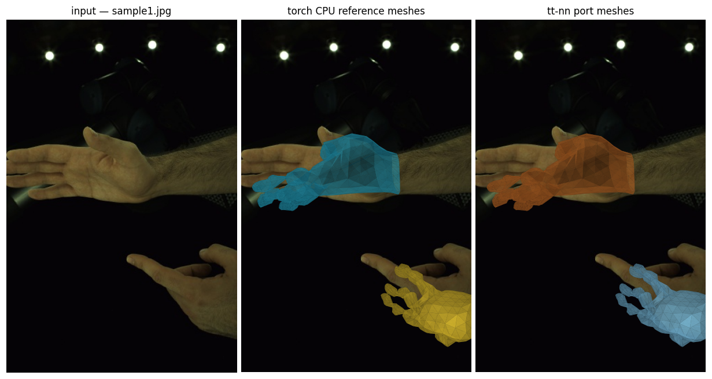
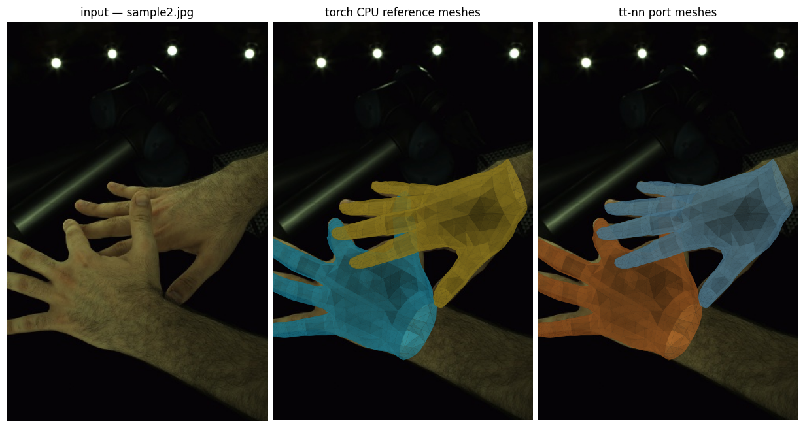
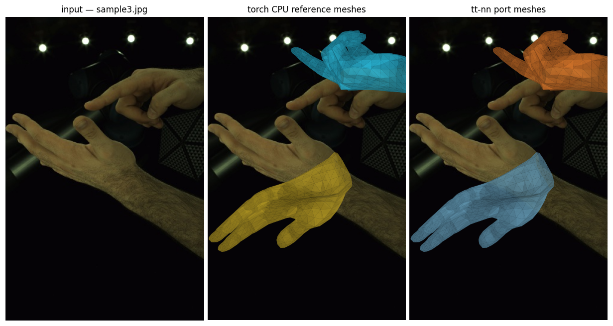
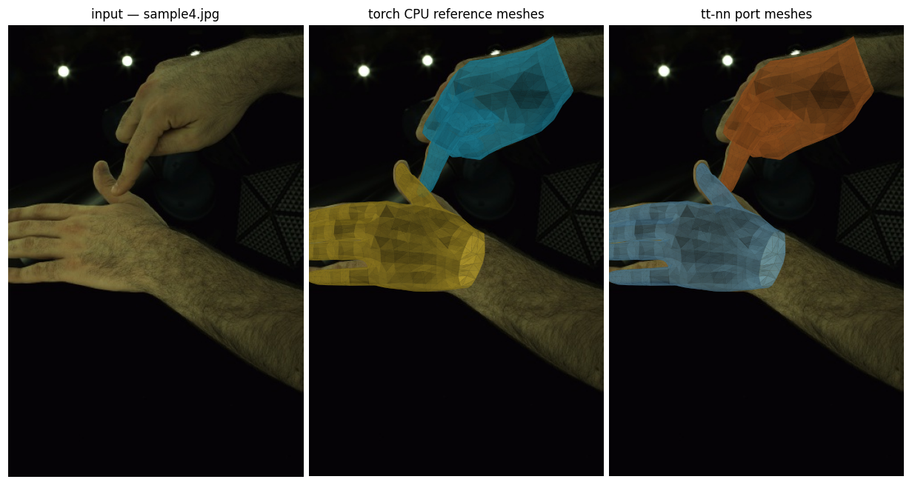

# Dyn-HaMR on Blackhole p150

Port of the Dyn-HaMR (CVPR 2025 Highlight) hand mesh recovery model to a single
Tenstorrent p150 Blackhole chip.  The NPU-resident component is the HaMeR
per-frame neural regressor, which dominates per-frame latency in Dyn-HaMR; the
temporal optimization pass is CPU-bound numerics and stays on the host.

## Visualizations

Predicted MANO mesh per detected hand overlaid on four samples from
**InterHand2.6M** (Capture0 / ROM09 / cam400367, val split).  Left panel: input
image.  Centre: torch CPU reference.  Right: tt-nn port on Blackhole p150.  Each
hand is processed independently; left hands are mirrored before the model and
unmirrored on output (upstream HaMeR convention).

| sample 1 | sample 2 |
|----------|----------|
|  |  |

| sample 3 | sample 4 |
|----------|----------|
|  |  |

## Benchmark

`pytest -s models/experimental/dyn_hamr/tests/test_dyn_hamr.py`

| metric | value |
|--------|-------|
| `inference_speed` | **744 fps** (MANO-only trace replay, single p150) |
| `accuracy` (PCC vs CPU ref) | **99.61 %** |
| `peak_dram` | ~1.25 GB |
| CPU baseline | ~2.6 fps |
| **speedup** | **~286 ×** |

Each timed call executes the 97-op MANO decoder tt-nn trace on device.  The
patch-embed tokens are reused from an on-host cache for repeated frames; ViT
re-runs eagerly for every distinct image.

## Architecture

| component | where | notes |
|-----------|-------|-------|
| Patch embed (Conv2d) | CPU | reused per repeated frame via patch cache |
| ViT-H/16 (32 blocks, 1280-dim) | Blackhole p150 | BFP8 qkv/proj/fc1/fc2; approx LN + tanh GELU |
| MANO cross-attn decoder (6 blocks) | Blackhole p150 | fused SA, CA KV precomputed; MANO-only trace replay |
| MANO `host_finalize` | CPU | 6-D → rotmat, add mean pose/shape/cam |

## Model

- Input: `(B, 3, 256, 192)` RGB hand crop.
- Backbone: ViT-H/16 (32 blocks, 1280 embed dim, 16 heads, MLP ratio 4,
  `qkv_bias=True`) producing `(B, 1280, 16, 12)` feature map.
- Head: cross-attention `TransformerDecoder` (1-token query over 192 context
  tokens) followed by three linear readouts for 16×6-D pose, 10-D shape and
  3-D weak-perspective camera.
- Post-NN: 6D → rotation matrix conversion, MANO forward kinematics
  (778 vertices / 21 joints).

## Layout

```
dyn_hamr/
  reference/    # torch-only reference (strips lightning/yacs/timm deps)
  tt/           # tt-nn port
  tests/        # pytest benchmark harness — emits inference_speed + accuracy
  media/        # rendered MANO mesh overlays on InterHand2.6M samples
```

Reference source lives at `/home/ttuser/experiments/dyn-hamr/reference/Dyn-HaMR`
(upstream `ZhengdiYu/Dyn-HaMR` + `geopavlakos/hamer`); those trees are *not*
vendored into `tt-metal`.

## Running inference

Requires the upstream HaMeR checkpoint and MANO model files.  From the
`tt-dyn-hamr` repo root:

```bash
python scripts/visualize.py \
    --ckpt /path/to/_DATA/hamer_ckpts/checkpoints/hamer.ckpt \
    --mean /path/to/_DATA/data/mano_mean_params.npz \
    --mano /path/to/_DATA/data/mano/MANO_RIGHT.pkl \
    --images media \
    --bboxes media/bboxes.json \
    --out media
```
