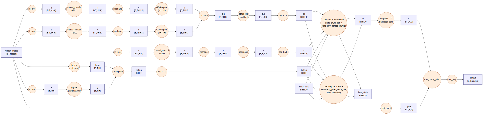

<!-- SPDX-FileCopyrightText: © 2026 Tenstorrent AI ULC -->
<!-- SPDX-License-Identifier: Apache-2.0 -->

# Gated DeltaNet — Layer Dataflow (PyTorch Reference)

Source: [`torch_functional/gated_deltanet.py`](../torch_functional/gated_deltanet.py) (full layer),
[`torch_functional/delta_rule_ops.py`](../torch_functional/delta_rule_ops.py) (`chunk_gated_delta_rule`,
`recurrent_gated_delta_rule`) — extracted from [FLA](https://github.com/fla-org/flash-linear-attention/blob/main/fla/ops/gated_delta_rule/naive.py).

Each box is one op with its tensor input(s)/output shown, including reshape/transpose/pad/GQA-repeat.
`nH`=`num_heads` (Q/K), `H`=`num_v_heads` (V; GQA repeats Q/K from `nH`→`H`), `K`=`head_k_dim`,
`V`=`head_v_dim`, `L`=`T` padded to a chunk-size multiple.

The two delta-rule kernels are mutually exclusive per call (`mode` picks one — the wrapper
auto-falls back to `recurrent` whenever `T<=64`, so plain decode, T=1, is the same kernel). Each is
collapsed to one box: internally it's chunk-/step-parallel with `final_state` carried sequentially
across chunks or timesteps — that internal recurrence is the kernel's own implementation detail,
not further expanded here.

```mermaid
flowchart LR
    classDef tensor fill:#eef,stroke:#448,color:#000;
    classDef op fill:#fed,stroke:#a52,color:#000;

    hidden["hidden_states\n[B,T,hidden]"]:::tensor

    hidden --> qproj(("q_proj")):::op --> q["q\n[B,T,nH·K]"]:::tensor
    hidden --> kproj(("k_proj")):::op --> k["k\n[B,T,nH·K]"]:::tensor
    hidden --> vproj(("v_proj")):::op --> v["v\n[B,T,H·V]"]:::tensor
    hidden --> bproj(("b_proj\n+sigmoid")):::op --> beta["beta\n[B,T,H]"]:::tensor
    hidden --> aproj(("a_proj")):::op --> a["a\n[B,T,H]"]:::tensor
    a --> gcalc(("g-gate\n(softplus,exp)")):::op --> g["g\n[B,T,H]"]:::tensor
    hidden --> gproj(("gate_proj")):::op --> gate["gate\n[B,T,H,V]"]:::tensor

    q --> qconv(("causal_conv1d\n+SiLU")):::op --> qc["q\n[B,T,nH·K]"]:::tensor
    k --> kconv(("causal_conv1d\n+SiLU")):::op --> kc["k\n[B,T,nH·K]"]:::tensor
    v --> vconv(("causal_conv1d\n+SiLU")):::op --> vc["v\n[B,T,H·V]"]:::tensor

    qc --> qresh(("reshape")):::op --> qh["q\n[B,T,nH,K]"]:::tensor
    kc --> kresh(("reshape")):::op --> kh["k\n[B,T,nH,K]"]:::tensor
    vc --> vresh(("reshape")):::op --> vh["v\n[B,T,H,V]"]:::tensor

    qh --> qgqa(("GQA repeat\n(nH&rarr;H)")):::op --> qg["q\n[B,T,H,K]"]:::tensor
    kh --> kgqa(("GQA repeat\n(nH&rarr;H)")):::op --> kg["k\n[B,T,H,K]"]:::tensor

    qg --> l2(("L2-norm")):::op --> qn["q,k\n[B,T,H,K]"]:::tensor
    kg --> l2

    qn --> tr(("transpose\nhead-first")):::op --> qt["q,k\n[B,H,T,K]"]:::tensor
    vh --> tr2(("transpose")):::op --> vt["v\n[B,H,T,V]"]:::tensor
    beta --> tr3(("transpose")):::op
    g --> tr3
    tr3 --> bgt["beta,g\n[B,H,T]"]:::tensor

    qt --> pad(("pad T&rarr;L")):::op --> qL["q,k\n[B,H,L,K]"]:::tensor
    vt --> pad2(("pad T&rarr;L")):::op --> vL["v\n[B,H,L,V]"]:::tensor
    bgt --> pad3(("pad T&rarr;L")):::op --> bgL["beta,g\n[B,H,L]"]:::tensor

    state0["initial_state\n[B,H,K,V]"]:::tensor

    qL & vL & bgL & state0 --> chunkloop(("per-chunk recurrence\n(intra-chunk attn +\nstate carry across chunks)")):::op
    qL & vL & bgL & state0 --> recloop(("per-step recurrence\n(recurrent_gated_delta_rule,\nT&le;64 / decode)")):::op

    chunkloop --> ounp["o\n[B,H,L,V]"]:::tensor
    chunkloop --> fstate["final_state\n[B,H,K,V]"]:::tensor
    recloop --> ounp
    recloop --> fstate

    ounp --> unpad(("un-pad L&rarr;T,\ntranspose back")):::op --> o["o\n[B,T,H,V]"]:::tensor

    o --> onorm(("rms_norm_gated")):::op
    gate --> onorm
    onorm --> oproj(("out_proj")):::op --> out["output\n[B,T,hidden]"]:::tensor
```

mermaid source

## Config constants

| Constant | Value | Where |
|---|---|---|
| `chunk_size` (function default) | 64 | `delta_rule_ops.py` |
| `long_prefill_chunk_size` (production) | 128 | `qwen36/tt/gdn/config.py` |
| `gdn_nk` / `gdn_nv` (K/V heads) | 16 / 32 | `qwen36/tt/model_config.py` |
| `gdn_dk` / `gdn_dv` (head dims) | 128 / 128 | `qwen36/tt/model_config.py` |
| `gdn_conv_kernel_size` | 4 | `qwen36/tt/model_config.py` |
| test defaults | `hidden=512, heads=4, K=128, V=256, conv_k=4, T=64, B=2` | `tests/test_gated_deltanet.py` |
