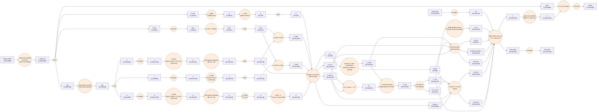
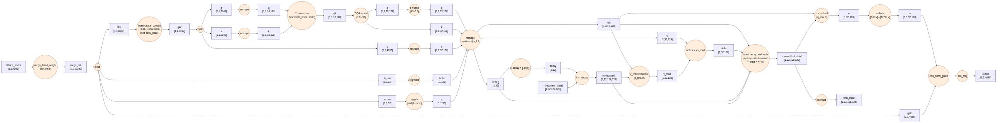

<!-- SPDX-FileCopyrightText: © 2026 Tenstorrent AI ULC -->
<!-- SPDX-License-Identifier: Apache-2.0 -->

# Gated DeltaNet — Layer Dataflow

Every box is one op/kernel with concrete tensor shapes (Qwen3.5-9B production config: `hidden=4096`,
`num_heads(Q/K)=16`, `num_v_heads=32`, `head_k_dim=head_v_dim=128`, `conv_kernel_size=4`,
`chunk_size=128`; example batch `B=1`, one 128-token prefill chunk, `vocab_size=248320`).
Memory-layout ops (reshape, transpose, pad, layout-convert) are shown as their own boxes since they
map to real op calls, but sequential loops (per-chunk / per-timestep recurrence) are collapsed to
one box each — that's kernel-internal control flow, not a new op.

## 1. PyTorch reference

Source: [`torch_functional/gated_deltanet.py`](../torch_functional/gated_deltanet.py) (full layer),
[`torch_functional/delta_rule_ops.py`](../torch_functional/delta_rule_ops.py) (`chunk_gated_delta_rule`,
`recurrent_gated_delta_rule`) — extracted from [FLA](https://github.com/fla-org/flash-linear-attention/blob/main/fla/ops/gated_delta_rule/naive.py).

Both delta-rule kernels are mutually exclusive per call (`mode` picks one — the wrapper
auto-falls back to `recurrent` whenever `T<=64`, so plain decode, `T=1`, is the same kernel).

```mermaid
flowchart LR
    classDef tensor fill:#eef,stroke:#448,color:#000;
    classDef op fill:#fed,stroke:#a52,color:#000;

    hidden["hidden_states\n[1,128,4096]"]:::tensor

    hidden --> qproj(("q_proj")):::op --> q["q\n[1,128,2048]"]:::tensor
    hidden --> kproj(("k_proj")):::op --> k["k\n[1,128,2048]"]:::tensor
    hidden --> vproj(("v_proj")):::op --> v["v\n[1,128,4096]"]:::tensor
    hidden --> bproj(("b_proj\n+sigmoid")):::op --> beta["beta\n[1,128,32]"]:::tensor
    hidden --> aproj(("a_proj")):::op --> a["a\n[1,128,32]"]:::tensor
    a --> gcalc(("g-gate\n(softplus,exp)")):::op --> g["g\n[1,128,32]"]:::tensor
    hidden --> gproj(("gate_proj")):::op --> gate["gate\n[1,128,4096]"]:::tensor

    q --> qconv(("causal_conv1d\n+SiLU")):::op --> qc["q\n[1,128,2048]"]:::tensor
    k --> kconv(("causal_conv1d\n+SiLU")):::op --> kc["k\n[1,128,2048]"]:::tensor
    v --> vconv(("causal_conv1d\n+SiLU")):::op --> vc["v\n[1,128,4096]"]:::tensor

    qc --> qresh(("reshape")):::op --> qh["q\n[1,128,16,128]"]:::tensor
    kc --> kresh(("reshape")):::op --> kh["k\n[1,128,16,128]"]:::tensor
    vc --> vresh(("reshape")):::op --> vh["v\n[1,128,32,128]"]:::tensor

    qh --> qgqa(("GQA repeat\n(16&rarr;32)")):::op --> qg["q\n[1,128,32,128]"]:::tensor
    kh --> kgqa(("GQA repeat\n(16&rarr;32)")):::op --> kg["k\n[1,128,32,128]"]:::tensor

    qg --> l2(("L2-norm")):::op --> qn["q,k\n[1,128,32,128]"]:::tensor
    kg --> l2

    qn --> tr(("transpose\nhead-first")):::op --> qt["q,k\n[1,32,128,128]"]:::tensor
    vh --> tr2(("transpose")):::op --> vt["v\n[1,32,128,128]"]:::tensor
    beta --> tr3(("transpose")):::op
    g --> tr3
    tr3 --> bgt["beta,g\n[1,32,128]"]:::tensor

    qt --> pad(("pad T&rarr;L\n(no-op, T=128)")):::op --> qL["q,k\n[1,32,128,128]"]:::tensor
    vt --> pad2(("pad T&rarr;L")):::op --> vL["v\n[1,32,128,128]"]:::tensor
    bgt --> pad3(("pad T&rarr;L")):::op --> bgL["beta,g\n[1,32,128]"]:::tensor

    state0["initial_state\n[1,32,128,128]"]:::tensor

    qL & vL & bgL & state0 --> chunkloop(("per-chunk recurrence\n(1 chunk here: NC=1)")):::op
    qL & vL & bgL & state0 --> recloop(("per-step recurrence\n(recurrent_gated_delta_rule,\nT=1 / decode)")):::op

    chunkloop --> ounp["o\n[1,32,128,128]"]:::tensor
    chunkloop --> fstate["final_state\n[1,32,128,128]"]:::tensor
    recloop --> ounp
    recloop --> fstate

    ounp --> unpad(("un-pad L&rarr;T,\ntranspose back")):::op --> o["o\n[1,128,32,128]"]:::tensor

    o --> onorm(("rms_norm_gated")):::op
    gate --> onorm
    onorm --> oproj(("out_proj")):::op --> out["output\n[1,128,4096]"]:::tensor
```

mermaid source

## 2. TTNN implementation (fused ops) — prefill

Source: [`tt/ttnn_gated_deltanet.py`](../tt/ttnn_gated_deltanet.py) (`gated_deltanet_forward_ttnn`,
mega-fused tier: `mega_fused_weight` combines q/k/v/a/b/gate into one matmul), dispatching to
[`tt/ttnn_delta_rule_seq.py`](../tt/ttnn_delta_rule_seq.py) (`chunk_gated_delta_rule_seq_adapter` +
`chunk_gated_delta_rule_seq`) for the chunked-prefill kernel.

Notable fusions vs. the PyTorch reference:
- **One matmul** replaces 6 separate projections (q/k/v/a/b/gate → `mega_fused_weight`).
- **One depthwise conv1d call** replaces 3 separate per-stream convolutions (fused over the
  concatenated `qkv` channel dim).
- **L2-norm runs before GQA-repeat**, on the un-duplicated `Hq=16` heads (`BH=16`, not 32) — cheaper
  than the reference's "repeat then normalize," and equivalent since normalizing a vector commutes
  with duplicating it.
- The reference's per-chunk decay/`L_mask`/Woodbury-inverse math (a Python loop + several tensor
  ops per chunk) becomes **~6 fused ttnn op calls** (decay/`L_mask` construction, `L_mat`
  diagonal-damped construction, unit-diagonal normalization, `v_beta`/`k_bd` scaling, intra-chunk
  attention preprocessing, Horner-form block inverse) plus **one C++ custom op**
  (`ttnn.transformer.gated_delta_attn_seq`) that runs the actual sequential chunk-to-chunk state
  recurrence — the reference's explicit `for i in range(num_chunks)` Python loop has no equivalent
  box here; it's inside that single kernel call.
- `L_mat` construction includes a **diagonal-damping term** (`QWEN_GDN_DIAG_ALPHA`, default 0.25)
  absent from the reference's exact math — a numerical-stability addition for long-context chunked
  prefill (`alpha=0` recovers the exact reference formula but is unstable at long ISL; see the
  kernel's own comments for the empirical justification).

## 3. TTNN implementation (fused ops) — decode (T=1)

Source: same wrapper, dispatching to
[`tt/ttnn_delta_rule_ops.py`](../tt/ttnn_delta_rule_ops.py) (`recurrent_gated_delta_rule_decode_ttnn`)
for the single-token decode step.

The reference's 5-line-per-step recurrent loop (decay, read, delta, outer-product write, query)
becomes 4 fused ttnn ops per step here, with `fused_decay_and_write` folding the outer-product
write, beta-scale, and state accumulate into one call; everything stays L1-resident (no
DRAM round-trip) since each tensor is one head-row wide.

## Config constants

| Constant | Value | Where |
|---|---|---|
| `hidden_size` (dim) | 4096 | HF `text_config.hidden_size` |
| `num_heads` (Q/K, `nH`) | 16 | HF / `GDNConfig.num_heads` |
| `num_v_heads` (V, `H`) | 32 | HF / `GDNConfig.num_v_heads` |
| `head_k_dim` / `head_v_dim` (`K`/`V`) | 128 / 128 | HF / `GDNConfig` |
| `conv_kernel_size` | 4 | HF / `GDNConfig.conv_kernel_size` |
| `chunk_size` (production, `gdn_chunk_size`) | 128 | `model_config.py` — required by `gated_delta_attn_seq` |
| `chunk_size` (function default, standalone) | 64 | `delta_rule_ops.py` |
| `norm_eps` | 1e-6 | HF `rms_norm_eps` |
| `vocab_size` | 248320 | HF `text_config.vocab_size` |
| `QWEN_GDN_DIAG_ALPHA` (default) | 0.25 | `ttnn_delta_rule_seq.py` |
| test defaults (standalone unit tests) | `hidden=512, heads=4, K=128, V=256, conv_k=4, T=64, B=2` | `tests/test_gated_deltanet.py` |
