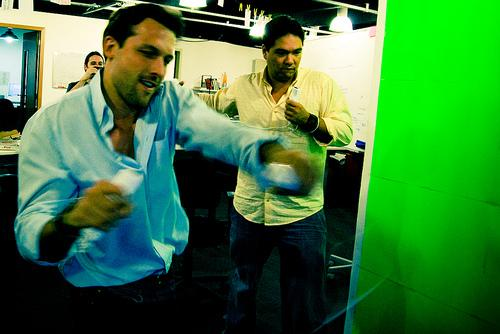
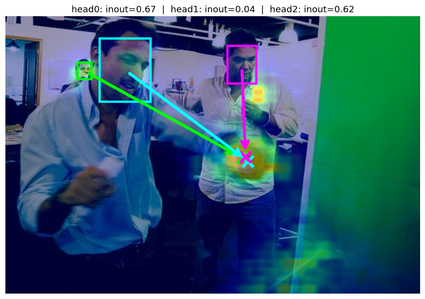
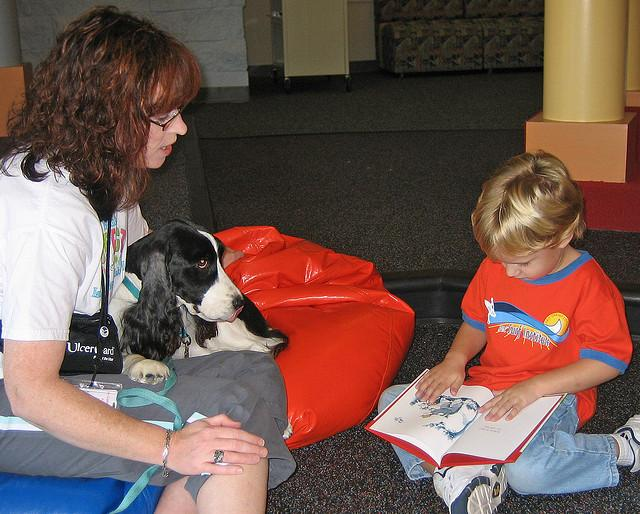
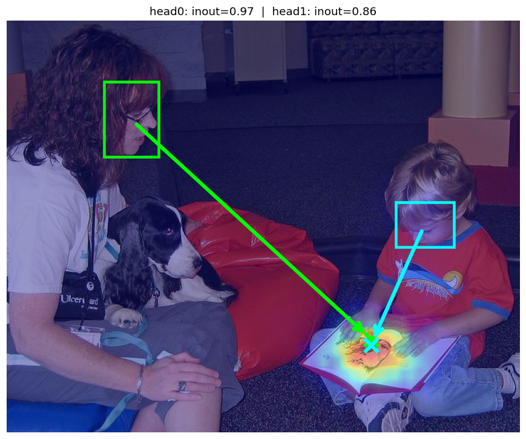
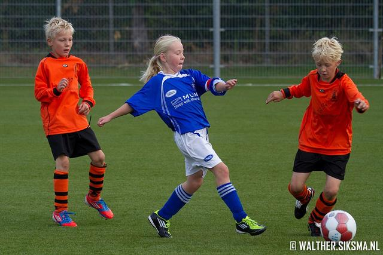
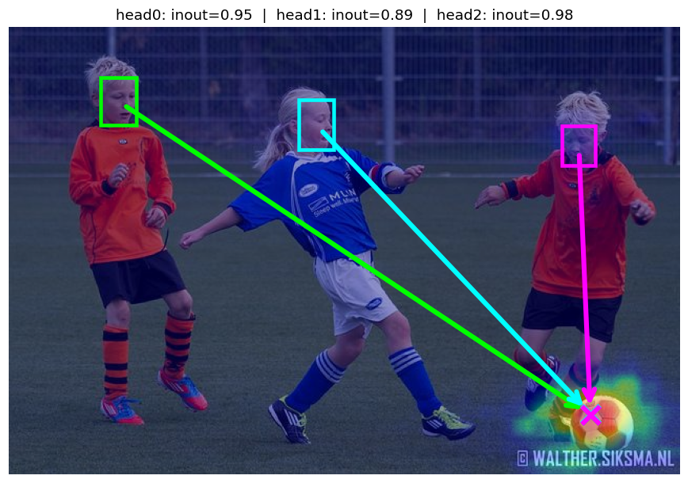
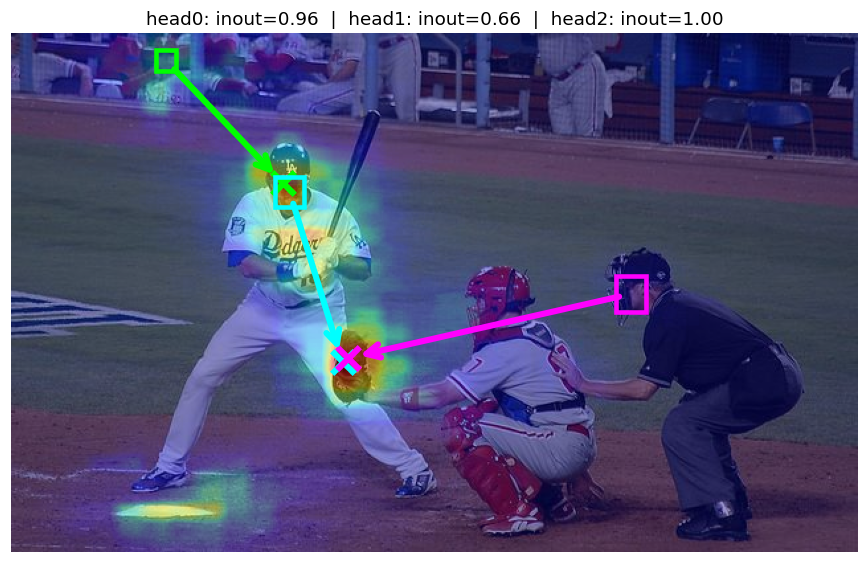

# tt-Gaze-LLE

End-to-end port of [Gaze-LLE](https://github.com/fkryan/gazelle) (Ryan et al.)
to Tenstorrent **tt-metal** (tt-nn + tt-metallium), running on a single
Blackhole p150a chip.

This model contains a TT-NN implementation of the
`gazelle_dinov2_vitb14_inout` checkpoint, a torch reference used as a numerical
shadow, pytest suites for per-stage PCC and real-image correctness, a
GazeFollow AUC/L2 evaluator, a wall-clock benchmark, a Tracy-profileable perf
test, and a script to pull the weights and data.

The TT-NN forward runs the **entire inference** on the chip — the host does
only layout prep (zero-cost views) and upload/download.

**Multi-person in one forward.** `TtGazeLLE(image, [bbox_a, bbox_b, …])` runs
the DINOv2 backbone and the gaze projection **once**, then runs the
bbox-conditioned decoder tail (head-mask build + 3 gaze blocks + heads) **once
per head**, returning stacked per-head heatmaps and in/out scores
(`(N, 64, 64)` and `(N,)`). `N = 1` keeps the old single-person contract.

---

## Demo

Four multi-person scenes from the GazeFollow test set. Each pair follows the
canonical Gaze-LLE inference pipeline from the
[official Colab](https://colab.research.google.com/drive/1TSoyFvNs1-au9kjOZN_fo5ebdzngSPDq):

1. **RetinaFace** detects every face in the image.
2. The detected bboxes are fed into `TtGazeLLE(image, bboxes)` running on a
   Blackhole p150a — the DINOv2 backbone + gaze projection run **once**, the
   decoder tail runs **N times** over the shared scene features.

Each colored bbox is one RetinaFace detection; the same-colored arrow and ×
are that person's predicted gaze direction and target pixel. No bboxes are
hand-picked — every one comes from the face detector.

Reproduce with ``python -m models.experimental.gaze_lle.demo.make_demo``
(requires ``pip install retina-face tf-keras``).

| Input (`demo/media/source_N.png`) | Prediction (`demo/media/target_N.png`) |
|:---:|:---:|
|  |  |
|  |  |
|  |  |
|  |  |

---

## Contents

```
models/experimental/gaze_lle/
├── reference/
│   ├── torch_gaze_lle.py      # self-contained torch reference (no timm / torch.hub)
│   └── load_pretrained.py     # fkryan/gazelle + DINOv2 ckpt → reference model
├── tt/
│   └── tt_gaze_lle.py         # TT-NN forward (Blackhole p150a)
├── benchmark.py               # torch/tt FPS + PCC benchmark
├── tests/
│   ├── test_relative_pcc.py       # 14-stage tt↔torch PCC test (random weights)
│   ├── test_pretrained_eval.py    # real-image torch↔tt PCC + peak check (pretrained)
│   ├── test_multi_person.py       # N-head forward matches N single-person forwards
│   ├── test_perf.py               # single-iter forward, Tracy-profileable
│   └── eval_gazefollow.py         # full-set GazeFollow AUC / Avg L2 / Min L2
└── demo/
    ├── download_data.sh       # pulls weights + sample images + GazeFollow parquet
    ├── make_demo.py           # generates demo/media/ from GazeFollow test set
    ├── media/                 # pre-generated demo images
    └── eval_artifacts/        # two-image torch↔tt overlay artifacts
```

---

## Setup

Download weights and data:

```bash
bash models/experimental/gaze_lle/demo/download_data.sh
```

Populates `./weights/` (DINOv2 backbone + Gaze-LLE decoder) and `./data/`
(two sample images + the full 4,782-image GazeFollow parquet).
Override locations with `TT_GAZE_LLE_WEIGHTS` / `TT_GAZE_LLE_DATA`.

**Optional (multi-person demo + multi-person test):**

```bash
pip install retina-face tf-keras
```

---

## Running the tests

```bash
# 1) Per-stage relative PCC (tt vs a torch shadow with the same random weights)
pytest models/experimental/gaze_lle/tests/test_relative_pcc.py -v -s

# 2) Pretrained-weight sanity check on two real images
pytest models/experimental/gaze_lle/tests/test_pretrained_eval.py -v -s

# 3) Multi-person: N-head TT forward matches N single-person torch forwards
pytest models/experimental/gaze_lle/tests/test_multi_person.py -v -s

# 4) Full GazeFollow test set (4,782 images, AUC + L2)
python -m models.experimental.gaze_lle.tests.eval_gazefollow

# 5) Wall-clock FPS benchmark
python -m models.experimental.gaze_lle.benchmark --impl ttnn --iters 20 --warmup 5

# 6) Tracy-profiled single-iter forward (requires Tracy-enabled tt-metal build)
python -m tracy --no-runtime-analysis --collect-noc-traces \
    --profiler-capture-perf-counters=all --op-support-count=10000 \
    -v -r -o ./tracy_out -m pytest models/experimental/gaze_lle/tests/test_perf.py
```

---

## Results

### Relative PCC (per-stage, tt vs torch shadow)

All 14 intermediate stages of the TT-NN forward match the torch shadow within
tight thresholds. Even the end-to-end heatmap output stays above 0.998 PCC with
random weights, which is consistent with the bf16 / bfp8 / LoFi accumulation
behaviour of the chip over a 12-layer backbone.

| Stage | PCC | Shape |
|---|---:|---|
| patch_embed                 | 0.9998 | (1, 1024, 768) |
| after_prefix                | 0.9998 | (1, 1025, 768) |
| after_block_0               | 0.9998 | (1, 1025, 768) |
| after_block_5               | 0.9994 | (1, 1025, 768) |
| after_block_11              | 0.9989 | (1, 1025, 768) |
| after_final_norm            | 0.9988 | (1, 1025, 768) |
| after_slice                 | 0.9988 | (1, 1024, 768) |
| after_gaze_proj_pos         | 0.9993 | (1, 1024, 256) |
| head_map                    | 1.0000 | (1, 1024, 1)   |
| after_head_conditioning     | 0.9994 | (1, 1024, 256) |
| after_gaze_blocks           | 0.9991 | (1, 1025, 256) |
| heatmap_compact             | 0.9981 | (1, 1024, 4)   |
| inout_scalar                | 0.9940 | (1,)           |
| heatmap                     | 0.9981 | (1, 64, 64)    |

Numbers are from the run committed in `models/experimental/gaze_lle/tests/test_relative_pcc.py`
(random weights, seed 0). The head-bbox mask is exactly `1.0000` because it
is a binary comparison — the `ttnn.ge` / `ttnn.lt` cascade is bit-identical
to the torch shadow.

### Real-data evaluation on GazeFollow

Full test set, 4,782 images, each with one head bounding box and up to 10
annotator gaze targets. Metric formulas follow `gazelle/utils.py` from
fkryan/gazelle.

| Impl | AUC | Avg L2 | Min L2 |
|---|---:|---:|---:|
| Paper (fkryan/gazelle) | 0.9560 | 0.1510 | 0.0990 |
| Torch pretrained (CPU)   | 0.9543 | 0.1103 | 0.0491 |
| **TT-NN on p150a**       | **0.9541** | **0.1129** | **0.0512** |

The TT port is **within 0.0002 AUC and ≤0.0026 L2** of the torch reference on
the full test set — i.e., running on Blackhole does not sacrifice any
meaningful prediction quality compared to the pretrained model.

Two-image qualitative check (`test_pretrained_eval.py`):

| Image | heatmap PCC (torch↔tt) | peak distance (64×64 space) |
|---|---:|---:|
| the_office.png | 0.9923 | 1 px |
| succession.png | 0.9923 | 1 px |

### Performance

Measured with `models/experimental/gaze_lle/benchmark.py` in wall-clock mode
(not Tracy) at batch 1 on a single p150a.

| Metric | Value |
|---|---:|
| Mean latency (100-sample, warm) | **10.47 ms** |
| p50 latency                      | 10.41 ms |
| p95 latency                      | 10.63 ms |
| p99 latency                      | 11.91 ms |
| Throughput (p50)                 | **~96 FPS** |
| Device ops per forward (Tracy)   | 202 |
| Per-frame host→device upload      | 1.18 MB (bf16) |
| Per-frame device→host download    | 16 KB + 4 B (heatmap + inout) |

### Optimization trajectory

Starting point was a pure-torch CPU run; each row below is a change that was
verified to improve throughput without dropping below the 99% PCC/AUC gate.

| # | Change | FPS | End-to-end PCC |
|---:|---|---:|---:|
| 0 | Torch CPU reference baseline                                              |   1.6 | —      |
| 1 | Naive TT-NN: 12 DINOv2 encoder blocks on chip; gaze decoder + heads on CPU | 13.8 | 0.9999 |
| 2 | Explicit `core_grid=(10,13)` on every ttnn.linear                          | 15.0 | 0.9989 |
| 3 | Gaze decoder (proj + pos + 3 transformer blocks) moved to chip             | 39.7 | 0.9983 |
| 4 | On-device `ttnn.slice` to drop CLS+REG tokens (was host round-trip)        | 45.1 | 0.9983 |
| 5 | Fold DINOv2 LayerScale into adjacent projection weights (remove 24 muls)   | 46.5 | 0.9983 |
| 6 | Fused SDPA kernel replaces manual Q·Kᵀ → softmax → ·V sequence             | 52.0 | 0.9986 |
| 7 | Pack DINOv2 MLP weights as `bfloat8_b`                                     | 54.3 | 0.9987 |
| 8 | Pack DINOv2 attention QKV + proj weights as `bfloat8_b`                    | 57.1 | 0.9987 |
| 9 | `LoFi` `compute_kernel_config` on the bfp8 DINOv2 matmuls                  | 63.8 | 0.9989 |
| 10| Fuse `pos_embed + head_map*head_token` on host (one add instead of two)    | 65.2 | 0.9990 |
| 11| Early-deallocate LayerNorm intermediates inside DINOv2 blocks              | 66.2 | 0.9990 |
| 12| Full e2e on Blackhole — patch_embed + heatmap_head + inout_head on chip¹   | 54.8 | 0.9983 |
| 13| Swap the on-device `ttnn.fold` patch embed for a direct (588,768) matmul² | 94.0 | 0.9984 |
| 14| Bbox mask generated on device via `ttnn.ge`/`lt`/`mul` (no mid-pipeline upload) | 94.0 | 0.9984 |

¹ This step moved compute off the host and briefly regressed FPS — the on-device
`fold + to_layout` pipeline was dominated by layout-conversion overhead.
² The patch embed is mathematically equivalent to a single matmul once we
pre-rearrange the image on host (a pure view+permute+reshape — not inference
compute). Dropping the fold and its two `to_layout` conversions recovered the
regression and then some; this is the largest single optimization in the repo.

---

## Known caveats

- **One image per forward.** `TtGazeLLE.__call__` asserts `B == 1`. Multiple
  heads in the same image are supported by passing a list of bboxes and share
  the scene encode; multiple **images** in the same forward (true batching)
  would require staging the image upload and backbone matmuls as batched
  shapes — not wired up yet.
- **Per-head decoder runs serially on device.** `N` heads dispatch the decoder
  tail (head-mask + 3 gaze blocks + heads) `N` times in sequence. For typical
  `N ≤ 10` this is well under the backbone cost.
- **Only `vitb14` is exercised.** The reference supports `vitl14` (24-layer,
  1024-d) but the TT port has only been benchmarked against the base model.
- **Tracy post-processing pandas bug.** `--profiler-capture-perf-counters=all`
  triggers a `pd.to_numeric` crash in
  `tools/tracy/process_device_log.py` so the canonical
  `ops_perf_results.csv` is not produced; `profile_log_device.csv` +
  `tracy_ops_data.csv` need to be parsed by hand for now.

---

## Acknowledgements

- Original model: Ryan, Wijekoon, Shanmugam et al., Gaze-LLE — https://github.com/fkryan/gazelle
- Backbone: Meta AI's DINOv2 — https://github.com/facebookresearch/dinov2
- GazeFollow test mirror: https://huggingface.co/datasets/vikhyatk/gazefollow
