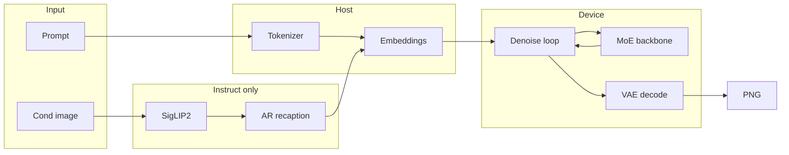

# HunyuanImage-3.0 (tt-metal)

Experimental TTNN port of [Tencent HunyuanImage-3.0](https://huggingface.co/tencent/HunyuanImage-3.0).

## About the Model

**HunyuanImage 3.0** is Tencent's **open-source multimodal image generation model** designed to produce high-quality images from natural-language prompts. Its **unified autoregressive architecture** and **Mixture-of-Experts (MoE)** design combine text understanding and image generation in one framework, enabling strong prompt comprehension and detailed image synthesis.

The model is available in **Base**, **Instruct**, and **Instruct-Distil** variants:

- **Base:** Text-to-image generation.
- **Instruct:** Image-to-image generation and enhanced prompt understanding through reasoning-based prompt rewriting.
- **Instruct-Distil:** A distilled Instruct variant.

This repository provides a **Tenstorrent TTNN implementation** of HunyuanImage 3.0, including the **core inference pipeline**, **TTNN model components**, **end-to-end demos**, **PCC validation tests**, and **performance benchmarks** optimized for Tenstorrent hardware.

## Model Diagram



The backbone repeats the following layer **32 times**: RMSNorm → Attention (GQA + RoPE) → MoE → residual.

## Supported Devices

The implementation has been validated on the following Tenstorrent Blackhole platforms:

| Device | Configuration |
|---------|---------------|
| **TT-QuietBox 2** | 2 × Blackhole P300 boards (4 Blackhole ASICs) |

## Repository Layout

```
hunyuan_image_3_0/
├── demo/         # Runnable end-to-end demos (demo.py T2I, demo_i2i.py I2I / Distil)
├── ref/          # PyTorch reference, mirrored block-for-block against tt/
│   ├── attention/    # RMSNorm, RoPE, attention, mask (reference)
│   ├── image_gen/    # Patch embed, timestep embedder, sequence scatter (reference)
│   ├── moe/          # Router/gate, expert MLP, MoE block (reference)
│   ├── tokenizer/    # Host tokenizer (HunyuanTokenizer) + assets
│   ├── vae/          # VAE encoder/decoder Conv3D blocks (reference)
│   └── vision/       # SigLIP2 encoder + image preprocess (reference)
├── tt/           # TTNN device port (see Model Modules below)
│   ├── attention/    # RMSNorm, RoPE, attention, mask
│   ├── image_gen/    # Patch embed, timestep embedder, sequence scatter
│   ├── moe/          # Router/gate, expert MLP, MoE block, tensor-parallel
│   ├── vae/          # VAE encoder/decoder + spatial-parallel decode
│   └── vision/       # SigLIP2 encoder, cond-vision injection, I2I pipeline
├── tests/        # PCC / parity / perf gates for every block
│   ├── pcc/          # Per-block PCC tests vs ref/
│   ├── perf/         # Performance benchmarks
│   ├── tokenizer/    # Tokenizer parity tests
│   ├── vae/          # VAE decode pipeline tests
│   └── vision/       # Vision / injection tests
└── scripts/      # Helper / utility scripts
```

## Model Modules

The device port lives under `tt/`. Each block mirrors the PyTorch reference under `ref/`
and is gated by a PCC test under `tests/`.

### Transformer backbone

| Module | File path | Description |
|--------|-----------|-------------|
| RMSNorm | `tt/attention/rms_norm.py` | Root-mean-square layer normalization |
| 2D RoPE | `tt/attention/rope_2d.py` | 2D rotary position embedding for image tokens |
| Attention (GQA, qk-norm) | `tt/attention/attention.py` | Grouped-query attention with q/k normalization |
| Attention mask | `tt/attention/mask.py` | Causal text + bidirectional image-span mask |
| MoE router / gate | `tt/moe/gate.py` | Top-8 expert routing / gating over 64 experts |
| MoE expert MLP | `tt/moe/mlp.py` | Per-expert feed-forward network |
| MoE block | `tt/moe/moe.py` | Mixture-of-Experts block (dense/sparse routing) |
| MoE tensor-parallel helpers | `tt/moe/moe_parallel.py` | Expert sharding across the mesh |
| Decoder layer | `tt/transformer_layer.py` | One transformer block (attention + MoE) |
| Full backbone | `tt/model.py` | Full 32-layer MoE transformer stack |
| Word-token embedding (WTE) | `tt/wte.py` | Token-id → hidden embedding lookup |
| LM head | `tt/lm_head.py` | Hidden state → vocabulary logits projection |
| KV cache | `tt/kv_cache.py`, `tt/cache.py` | Incremental key/value cache for decode |

The **transformer decoder** (backbone + attention/MoE layers) is shared by **AR recaption**
(prefill and decode) and **denoise**. AR prefill and the decoder path are **optimized for
full sequence length**, targeting the default **1024×1024** image size (production layout:
~4K image tokens in a ~4K–8K+ total sequence, up to the HF max context of 22,800).

### Image generation (DiT / flow-matching)

| Module | File path | Description |
|--------|-----------|-------------|
| Patch embed / final layer | `tt/image_gen/patch_embed.py` | `UNetDown` patchify / `UNetUp` unpatchify |
| Patch-embed conv configs | `tt/image_gen/patch_embed_conv_configs.py` | Conv program configs for patch embed |
| Timestep embedder | `tt/image_gen/timestep_embedder.py` | Diffusion timestep → embedding |
| Sequence scatter | `tt/image_gen/sequence_scatter.py` | Scatter image latent into the token sequence |
| Input / cond instantiation | `tt/image_gen/input_instantiate.py`, `tt/image_gen/cond_instantiate.py` | Build gen-image / cond input tensors |
| Flow-matching scheduler | `tt/scheduler.py` | Euler flow-matching denoise scheduler |
| Init-noise sampling | `tt/noise.py` | On-device `ttnn.randn` initial latent noise |
| Denoise pipeline | `tt/pipeline.py` | Single denoise step + multi-step `denoise_loop` |

### VAE

| Module | File path | Description |
|--------|-----------|-------------|
| Conv3D primitive | `tt/vae/conv3d.py`, `tt/vae/conv3d_blockings.py` | 3D convolution + blocking/tiling configs |
| Encoder | `tt/vae/encoder.py`, `tt/vae/encoder_weights.py` | VAE encoder blocks + weight loading |
| Decoder | `tt/vae/decoder.py`, `tt/vae/decoder_weights.py` | VAE decoder blocks + weight loading |
| ResNet conv / pointwise | `tt/vae/resnet_conv.py`, `tt/vae/pointwise.py` | ResNet conv and pointwise conv helpers |
| Spatial-parallel decode | `tt/vae/spatial.py` | Full-res H/W-spatial-parallel decode across mesh |
| Cond posterior | `tt/vae/cond_posterior.py` | I2I conditioning latent encode (posterior) |

### Vision (Instruct I2I)

| Module | File path | Description |
|--------|-----------|-------------|
| SigLIP2 vision encoder | `tt/vision/siglip2.py` | SigLIP2 encoder + vision→4096 aligner |
| Cond-vision injection | `tt/vision/inject.py` | Scatter vision embeddings into the sequence |
| Image preprocess / bridge | `tt/vision/preprocess.py` | Device bridge + `` span lookup |
| I2I pipeline assembly | `tt/vision/i2i.py`, `tt/vision/i2i_bundle.py` | Assemble image→encode→inject→forward |

### Generation, sampling & recaption

| Module | File path | Description |
|--------|-----------|-------------|
| AR sampling loop | `tt/generate.py` | Token sampling loop + stage forcing |
| Device sampling | `tt/device_sampling.py` | On-device `topk` / `sampling` ops |
| AR prefill | `tt/ar_prefill.py` | Chunked KV prefill for long prefixes |
| Recaption orchestration | `tt/recaption.py` | Host recaption/think orchestration |

### Trace, dual-CQ & parallelism

| Module | File path | Description |
|--------|-----------|-------------|
| Stage trace | `tt/stage_trace.py`, `tt/trace_config.py` | CQ0 `execute_trace` for denoise / VAE + config |
| Denoise dual-CQ | `tt/denoise_dual_cq.py` | 2CQ async latent D2H for denoise |
| VAE dual-CQ | `tt/vae_dual_cq.py` | 2CQ async RGB D2H for VAE decode |
| AR dual-CQ / trace | `tt/ar_dual_cq.py`, `tt/ar_trace.py` | 2CQ async logits D2H + AR decode trace |
| Cond-encode trace | `tt/cond_encode_trace.py` | Trace for I2I cond VAE + ViT encode |
| Mesh / parallel utilities | `tt/parallel_utils.py`, `tt/matmul_utils.py` | Mesh sharding + matmul program-config helpers |

## Tokenizer

Host-side tokenizer code and assets live under `ref/tokenizer/`:

| Path | Description |
|------|-------------|
| `ref/tokenizer/hunyuan_tokenizer.py` | Public API (`HunyuanTokenizer`) |
| `ref/tokenizer/gen_image_inputs.py` | Host preprocess bundle for device upload |
| `ref/tokenizer/assets/config.json` | Model config used by the tokenizer stack |
| `ref/tokenizer/assets/tokenizer_config.json` | HF tokenizer config |
| `ref/tokenizer/assets/tokenizer.json` | BPE vocab (~24 MB; not in git) |

## Test Cases

Every block has a test under `tests/`. PCC tests compare the TT device path against the
PyTorch `ref/` path; perf tests profile device timing via tracy.

### PCC / correctness (`tests/pcc/`)

| Test file | Detail |
|-----------|--------|
| `test_attention_modules.py` | RMSNorm / RoPE / attention / mask PCC, incl. batch + max-context |
| `test_transformer.py` | Decoder-layer + backbone PCC (single, large-ISL, mesh) |
| `test_embeddings.py` | Patch embed (`UNetDown`/`UNetUp`) + WTE embedding PCC |
| `test_moe.py` | MoE router/gate, expert MLP, and MoE block PCC |
| `test_full_dim_moe_denoise.py` | MoE router/module at max-context (S≈22784) |
| `test_lm_head.py` | LM-head hidden→logits PCC (full + last-token) |
| `test_logit_stack.py` | 32L teacher-forced / chained last-token logit PCC |
| `test_pipeline.py` | Single denoise step + e2e latent/RGB pipeline PCC |
| `test_denoise.py` | Multi-step `denoise_loop` PCC (timestep, Euler, CFG) |
| `test_scheduler.py` | Flow-matching scheduler deterministic ref match |
| `test_noise.py` | On-device `ttnn.randn` init-noise parity |
| `test_teacher_forced.py` | Teacher-forced final PCC + per-layer bf16/bf8 precision audit |
| `test_kv_cache_prefill.py` | KV-cache prefill correctness |
| `test_kv_cache_decode.py` | KV-cache incremental single-token decode |
| `test_prefill_sp2_pcc.py` | Prefill under sequence-parallel (`sp=2`) |
| `test_generate.py` | Host sampling loop + stage-forcing unit tests (mock logits) |
| `test_generate_device.py` | Device-backed AR generation path |
| `test_device_sampling.py` | On-device `topk` / `sampling` op parity |
| `test_recaption.py` | Recaption/think AR orchestration (greedy token parity) |

### VAE (`tests/vae/`)

| Test file | Detail |
|-----------|--------|
| `test_encoder.py` | VAE encoder block PCC |
| `test_decoder.py` | VAE decoder block PCC |
| `test_decode_pipeline.py` | Full `decode_latent` glue + spatial decode vs fp32 ref |
| `test_spatial_hw.py` | H/W-spatial-parallel decode across the 2×2 mesh |
| `test_conv3d_chunk.py` | Chunked Conv3D correctness |
| `test_conv3d_sharded.py` | Sharded Conv3D correctness |
| `test_resnet_conv_pair.py` | ResNet conv-pair PCC |
| `test_group_mean_pcc.py` | Fused channel group-mean used by DCAE shortcuts |
| `test_d2s_chunk.py` | Depth-to-space chunk equivalence |

### Vision / I2I (`tests/vision/`)

| Test file | Detail |
|-----------|--------|
| `test_siglip2_ttnn.py` | SigLIP2 encoder + aligner PCC |
| `test_siglip2_full_dim.py` | Full 27L vision @ S=1024 (32×32 patches) vs fp32 ref |
| `test_image_processor.py` | Image processor (`vit_process_image`, gen-image info) |
| `test_cond_image_preprocess.py` | Cond-image preprocess bitwise-equal to upstream |
| `test_cond_vision_inject.py` | Cond-vision sequence injection (contiguous / multi / host scatter) |

### Tokenizer / inputs (`tests/tokenizer/`)

| Test file | Detail |
|-----------|--------|
| `test_model_inputs.py` | T2I/I2I `prepare_model_inputs` build + tokenizer parity, attention layout, CFG |
| `test_cond_vae_encode.py` | I2I cond-image VAE/ViT encode + image-token instantiation + distill scatter |
| `test_recaption_inputs.py` | Recaption/think AR bundle build, stage params, CoT decode/sanitize |

### Performance (`tests/perf/`)

| Test file | Detail |
|-----------|--------|
| `test_denoise_perf_tracy.py` | End-to-end denoise-step device profile |
| `test_denoise_scatter_perf.py` | Sequence-scatter op timing |
| `test_encoder_perf_tracy.py` / `test_vae_decode_perf.py` | VAE encode / decode device profile |
| `test_siglip2_perf_tracy.py` | SigLIP2 vision device profile |
| `test_recaption_*_perf.py` | Recaption AR / prefill / decode timing |
| `*_sweep.py` | Matmul / expert / gate / RMSNorm / conv3d / lm-head config sweeps |

## PCC Results

The following PCCs were measured against the PyTorch reference implementation.
| File Name | Test Case | PCC |
|-----------|-----------|----:|
| `test_attention_modules.py` | RMSNorm ISL decode S=1 | 0.99999349 |
| | RMSNorm ISL one tile S=32 | 0.99998552 |
| | RMSNorm ISL image grid S=4096 | 0.99998385 |
| | RMSNorm ISL production S=4160 | 0.99998382 |
| | RMSNorm ISL batch=2 S=32 | 0.99998517 |
| | RoPE | |
| | Attention | |
| | Attention Mask | |
| `test_transformer.py` | Decoder Layer text decode S=1 | 0.99999725 |
| | Decoder Layer text prefill S=32 | 0.99999727 |
| | Decoder Layer ISL text S=4096 | 0.99999824 |
| | Decoder Layer ISL text S=4160 | 0.99999824 |
| | Decoder Layer ISL image S=4096 | 0.99999785 |
| | Decoder Layer ISL image S=4160 | 0.99999798 |
| | Decoder Layer max context S=22784 | 0.99999847 |
| | Transformer Backbone | |
| | Cache Helpers | n/a (PASSED) |
| `test_embeddings.py` | Patch Embed smoke GRID=8 UNetDown | 0.99994029 |
| | Patch Embed smoke GRID=8 UNetUp | 0.99991914 |
| | Patch Embed production GRID=64 UNetDown | 0.99994233 |
| | Patch Embed production GRID=64 UNetUp | 0.99992708 |
| | Timestep Embedder `timestep_emb` | 0.99999864 |
| | Timestep Embedder `time_embed` | 0.99999794 |
| | Timestep Embedder `time_embed_2` | 0.99999832 |
| | Timestep Embedder full schedule `timestep_emb` (S=50) | 0.99999840 |
| | Timestep Embedder full schedule `time_embed` (S=50) | 0.99999597 |
| | Timestep Embedder full schedule `time_embed_2` (S=50) | 0.99999629 |
| | WTE | 1.00000000 |
| | WTE production | 1.00000000 |
| `test_moe.py` | MoE Router | |
| | MoE Gate | |
| | Expert MLP | |
| | MoE Block | |
| `test_full_dim_moe_denoise.py` | Expert FFN max-context S=22784 | 0.99972073 |
| | MoE Layer max-context S=22784 | 0.99967112 |
| | Denoise Loop production 32L S=4160 (step=1) | 0.95866893 |
| `test_lm_head.py` | LM Head full-sequence S=32 | 0.99996616 |
| | LM Head last-token S=32 | 0.99996201 |
| | LM Head production last-token S=4160 | 0.99995974 |
| `test_logit_stack.py` | Logit Stack | |
| `test_pipeline.py` | Single Denoise Step | |
| | End-to-End Pipeline | |
| `test_denoise.py` | Host-routed Denoise Step (fast) | 0.99993799 |
| | Host-routed Denoise Step (production) | PASSED |
| | Denoise Loop (fast) | 0.99989697 |
| | Denoise Loop resident mesh | 0.999900 |
| | I2I Denoise Step | 0.99994084 |
| | I2I Denoise Loop CFG | 0.99821097 |
| `test_scheduler.py` | Schedule Match | exact (1e-6 / 1e-3) |
| | Denoising Loop smoke 8×8 | ≥0.99 |
| | CFG Combine smoke 8×8 | ≥0.99 |
| | Denoising Loop full latent 64×64 | 1.00000000 |
| | CFG Combine full latent 64×64 | 1.00000000 |
| `test_noise.py` | Initial Noise | |
| `test_teacher_forced.py` | All-layers production decode S=1 (32L, worst) | 0.979821 |
| | All-layers production prefill S=4160 (32L, worst) | 0.999790 |
| | Final production decode S=1 (32L) | 0.99995817 |
| | Final production prefill S=4160 (32L) | 0.99989751 |
| `test_kv_cache_prefill.py` | Prefill sanity ISL=128 (32L) | 0.971850 / 0.973826 |
| | Prefill sanity ISL=22800 (32L) | 0.947658 / 0.951536 |
| `test_kv_cache_decode.py` | Decode ISL=512 (step 8) | 0.999782 / 0.999713 |
| | Decode ISL=22800 (step 1) | 0.995632 / 0.997369 |
| `test_prefill_sp2_pcc.py` | Sequence Parallel Prefill | |
| `test_generate.py` | Host Sampling | |
| | Stage Forcing | |
| `test_generate_device.py` | Device AR Generation | |
| `test_device_sampling.py` | Device Top-k Sampling | |
| `test_recaption.py` | Recaption / Think | |
| `test_encoder.py` | VAE Encoder | |
| `test_decoder.py` | VAE Decoder | |
| `test_decode_pipeline.py` | VAE Decode Pipeline | |
| `test_spatial_hw.py` | Spatial HW Decode | |
| `test_conv3d_chunk.py` | Chunked Conv3D | |
| `test_conv3d_sharded.py` | Sharded Conv3D | |
| `test_resnet_conv_pair.py` | ResNet Conv Pair | |
| `test_group_mean_pcc.py` | Group Mean | |
| `test_d2s_chunk.py` | Depth-to-Space Chunk | |
| `test_siglip2_ttnn.py` | SigLIP2 Encoder | |
| | Vision Aligner | |
| `test_siglip2_full_dim.py` | Full-Dimension SigLIP2 | |
| `test_image_processor.py` | Image Processor | |
| `test_cond_image_preprocess.py` | Conditioning Image Preprocess | |
| `test_cond_vision_inject.py` | Conditioning Vision Injection | |
| `test_model_inputs.py` | Model Input Preparation | |
| | Tokenizer Parity | |
| `test_cond_vae_encode.py` | Conditioning VAE Encode | |
| `test_recaption_inputs.py` | Recaption Input Builder | |
## Performance Summary

### Base (Text-to-Image, 50 Steps)

| Sequence Length *(text + output image tokens)* | Denoise (50 steps) | VAE Decode | Avg. Step Latency | End-to-End Latency | Throughput |
|-----------------------------------------------:|-------------------:|-----------:|------------------:|-------------------:|-----------:|
| 4,226  | 232.42 s | 17.48 s | 4.65 s/step | 263.06 s | 13.69 images/hr |
| 8,748  | 429.75 s | 17.60 s | 8.60 s/step | 463.17 s | 7.77 images/hr |
| 13,424 | 651.28 s | 17.63 s | 13.03 s/step | 684.99 s | 5.26 images/hr |
| 18,100 | 959.26 s | 17.58 s | 19.19 s/step | 993.50 s | 3.62 images/hr |
| 22,777 | 1146.31 s | 18.01 s | 22.93 s/step | 1181.33 s | 3.05 images/hr |

---

### Instruct (Image-to-Image, 50 Steps)

| Sequence Length *(4096 input + text + 4096 output tokens)* | Recaption | Denoise (50 steps) | VAE Decode | Avg. Step Latency | TTFT | Text Gen | End-to-End Latency | Throughput |
|------------------------------------------------------------:|----------:|-------------------:|-----------:|------------------:|-----:|---------:|-------------------:|-----------:|
| 10,700 | 205.50 s | 556.69 s | 35.87 s | 11.13 s/step | 20.29 s | 3.70 tok/s | 800.94 s | 4.49 images/hr |
| 13,915 | 282.00 s | 758.66 s | 37.32 s | 15.17 s/step | 57.50 s | 1.03 tok/s | 1081.98 s | 3.33 images/hr |
| 17,323 | 314.00 s | 984.54 s | 38.20 s | 19.69 s/step | 50.74 s | 0.97 tok/s | 1341.94 s | 2.68 images/hr |
| 20,415 | 372.00 s | 1218.30 s | 38.37 s | 24.37 s/step | 24.03 s | 0.93 tok/s | 1633.89 s | 2.20 images/hr |
| 22,773 | 542.00 s | 1382.90 s | 38.27 s | 27.66 s/step | 38.85 s | 1.18 tok/s | 1968.80 s | 1.83 images/hr |

---

### Instruct-Distill (Image-to-Image, 8 Steps)

| Sequence Length *(4096 input + text + 4096 output tokens)* | Recaption | Denoise (8 steps) | VAE Decode | Avg. Step Latency | TTFT | Text Gen | End-to-End Latency | Throughput |
|------------------------------------------------------------:|----------:|------------------:|-----------:|------------------:|-----:|---------:|-------------------:|-----------:|
| 10,700 | 241.20 s | 52.54 s | 34.46 s | 6.57 s/step | 37.22 s | 3.48 tok/s | 331.70 s | 10.85 images/hr |
| 13,915 | 279.20 s | 69.28 s | 35.40 s | 8.66 s/step | 34.71 s | 2.77 tok/s | 388.20 s | 9.27 images/hr |
| 17,323 | 308.70 s | 91.75 s | 35.83 s | 11.47 s/step | 35.37 s | 2.46 tok/s | 440.73 s | 8.17 images/hr |
| 20,415 | 361.50 s | 110.50 s | 36.46 s | 13.82 s/step | 39.09 s | 2.03 tok/s | 514.12 s | 7.00 images/hr |
| 22,773 | 372.40 s | 111.30 s | 36.01 s | 13.91 s/step | 42.31 s | 1.95 tok/s | 524.87 s | 6.86 images/hr |

## Requirements

Download `tokenizer.json` (and refresh `tokenizer_config.json`) from Hugging Face:

```bash
cd /path/to/tt-metal
mkdir -p models/experimental/hunyuan_image_3_0/ref/tokenizer/assets

hf download tencent/HunyuanImage-3.0 \
  tokenizer.json tokenizer_config.json \
  --local-dir models/experimental/hunyuan_image_3_0/ref/tokenizer/assets
```

If `hf` is not installed, use `huggingface-cli download` with the same arguments.

Verify:

```bash
ls -lh models/experimental/hunyuan_image_3_0/ref/tokenizer/assets/tokenizer.json
```

Load check:

```bash
python3 -c "from models.experimental.hunyuan_image_3_0.ref.tokenizer import HunyuanTokenizer; HunyuanTokenizer.from_pretrained(); print('OK')"
```

Sanity validation:

```bash
python3 -m models.experimental.hunyuan_image_3_0.ref.tokenizer.hunyuan_tokenizer
```

## Running Demos

Run from the `tt-metal` repository root (`cd /path/to/tt-metal`). All three use the 2×2 mesh
and default to 32 backbone layers (`HY_NUM_LAYERS=32`).

| Variant | Demo | Steps | CFG | Checkpoint env / default path |
|---|---|---:|---|---|
| **Base** T2I | `demo/demo.py` | 50 | yes (`HY_GUIDANCE=5.0`) | `HUNYUAN_MODEL_DIR` (or HF `tencent/HunyuanImage-3.0`) |
| **Instruct** I2I | `demo/demo_i2i.py` | 50 | yes (`HY_GUIDANCE=2.5`) | `HUNYUAN_INSTRUCT_MODEL_DIR` (or HF `tencent/HunyuanImage-3.0-Instruct`) |
| **Instruct-Distil** I2I | `demo/demo_i2i.py --distil` | 8 | no (distilled) | `HUNYUAN_INSTRUCT_DISTIL_MODEL_DIR` (HF `tencent/HunyuanImage-3.0-Instruct-Distil`) |

### Base text-to-image

```bash
python_env/bin/python models/experimental/hunyuan_image_3_0/demo/demo.py \
  $'A cinematic medium shot captures a single Asian woman seated on a chair within a dimly lit room, creating an intimate and theatrical atmosphere. The composition is focused on the subject, rendered with rich colors and intricate textures that evoke a nostalgic and moody feeling.\n\nThe primary subject is a young Asian woman with a thoughtful and expressive countenance, her gaze directed slightly away from the camera. She is seated in a relaxed yet elegant posture on an ornate, vintage armchair. The chair is upholstered in a deep red velvet, its fabric showing detailed, intricate textures and slight signs of wear. She wears a simple, elegant dress in a dark teal hue, the material catching the light in a way that reveals its fine-woven texture. Her skin has a soft, matte quality, and the light delicately models the contours of her face and arms.\n\nThe surrounding room is characterized by its vintage decor, which contributes to the historic and evocative mood. In the immediate background, partially blurred due to a shallow depth of field consistent with a f/2.8 aperture, the wall is covered with wallpaper featuring a subtle, damask pattern. The overall color palette is a carefully balanced interplay of deep teal and rich red hues, creating a visually compelling and cohesive environment. The entire scene is detailed, from the fibers of the upholstery to the subtle patterns on the wall.\n\nThe lighting is highly dramatic and artistic, defined by high contrast and pronounced shadow play. A single key light source, positioned off-camera, projects gobo lighting patterns onto the scene, casting intricate shapes of light and shadow across the woman and the back wall. These dramatic shadows create a strong sense of depth and a theatrical quality. While some shadows are deep and defined, others remain soft, gently wrapping around the subject and preventing the loss of detail in darker areas. The soft focus on the background enhances the intimate feeling, drawing all attention to the expressive subject. The overall image presents a cinematic, photorealistic photography style.'
```

**Expected output:** a PNG image at the default resolution **1024×1024**, written to
`models/experimental/hunyuan_image_3_0/output.png` (override with `HY_OUT` / `HY_IMAGE_SIZE`).

Base T2I defaults to **50 denoise steps** and **CFG 5.0**, matching HF
`tencent/HunyuanImage-3.0` `generation_config.json` (`diff_infer_steps=50`,
`diff_guidance_scale=5.0`). Override with `HY_STEPS` / `HY_GUIDANCE`. Matches upstream
`generate_image` with `bot_task=image`: **no recaption** by default (prompt used verbatim).
Optional AR recaption (`HY_RECAPTION=1`) rewrites the prompt via the text-sampling loop
(`ref/generate.py`, re-exported by `tt/generate.py`) before the gen-image block.

All demo/runtime environment variables are documented in the [Flags](#flags) section below.

### Instruct image-to-image (50-step CFG)

Replace `/path/to/input.png` with your cond image. `--bot-task image` skips the AR
recaption stage; use `think_recaption` for the full upstream flow.

Trace defaults match `demo.py`: `HY_TRACE=1` for recaption AR; denoise
`execute_trace` when steps > 8 (50-step Instruct keeps trace on). VAE decode and cond
VAE/ViT encode trace off unless `HY_VAE_DECODE_TRACE=1` / `HY_COND_ENCODE_TRACE=1`.

```bash
HY_STEPS=50 HY_NUM_LAYERS=32 HY_GUIDANCE=2.5 python_env/bin/python \
  models/experimental/hunyuan_image_3_0/demo/demo_i2i.py \
  --prompt "make the sky more dramatic" \
  --cond /path/to/input.png \
  --bot-task image \
  --out hy_instruct.png
```

**Expected output:** a PNG image at the default resolution **1024×1024**, written to
`hy_instruct.png` (override with `--out` / `HY_OUT` or `--image-size` / `HY_IMAGE_SIZE`).

### Instruct-Distil image-to-image (8-step MeanFlow)

Denoise `execute_trace` is **off by default** (8 steps ≤ `HY_DENOISE_TRACE_MIN_STEPS`);
recaption AR trace (if used) and 2CQ mesh stay on under `HY_TRACE=1`.

```bash
HY_DISTIL=1 HY_NUM_LAYERS=32 HY_GUIDANCE=2.5 python_env/bin/python \
  models/experimental/hunyuan_image_3_0/demo/demo_i2i.py \
  --distil \
  --prompt "make the sky sunset orange" \
  --cond /path/to/input.png \
  --bot-task image \
  --out hy_instruct_distil.png
```

**Expected output:** a PNG image at the default resolution **1024×1024**, written to
`hy_instruct_distil.png` (override with `--out` / `HY_OUT` or `--image-size` / `HY_IMAGE_SIZE`).

Without `HY_STEPS`, Instruct defaults to 50 steps and Distil to 8 (from each checkpoint's
`generation_config.json` when present).

---

## Flags

All runtime behavior is controlled by `HY_*` / `HUNYUAN_*` environment variables. Tables
below cover the demo/runtime flags grouped by area, followed by advanced/debug knobs and
the test/benchmark-only knobs. Defaults are read from the code; where a flag has an alias,
both names are listed.

### Prompt & I/O (demos)

| Env | Default | Meaning |
|---|---|---|
| `HY_PROMPT` | Built-in Base prompt | Prompt (also positional `argv[1]`); I2I default `"make the sky more dramatic"` |
| `HY_PROMPT_FILE` | — | Read prompt from a file instead |
| `HY_COND` | — | I2I cond image path(s), comma-separated (also `--cond`) |
| `HY_IMAGE_SIZE` | base size | Output image size (also `--image-size`) |
| `HY_OUT` | per-demo | Output PNG path (also `--out`) |
| `HY_OUT_LATENT` | `real_latent_<size>.pt` | Output latent dump path |
| `HY_LATENT` | — | Load a precomputed latent instead of denoising |
| `HY_SAVE_LATENT` | — | Optional `.pt` path to dump the denoised latent |
| `HY_MODEL` | `base` | Variant selector in `test_e2e` (`base` / `instruct` / …) |

### Model, layers & precision

| Env | Default | Meaning |
|---|---|---|
| `HY_NUM_LAYERS` | `32` | Backbone transformer layers |
| `HY_WEIGHT_DTYPE` | `bf8` (demo) / `bf16` (e2e) | Backbone weight dtype (`bf8` \| `bf16`) |
| `HY_BF16_LAYERS` | — | Comma-separated layer indices forced to bf16 |
| `HY_MOE_DTYPE` | `bf16` | MoE parallel matmul dtype (`bf16` \| `bf8`) |
| `HY_STREAM_EXPERTS` | `1` if layers > 8 | Stream expert weights from host (vs resident) |
| `HY_CAP` | `1024` | Tile-aligned token capacity per expert |
| `HY_EPD` | `16` | Local experts per device |
| `HY_MAX_ISL` | `512` | Max input sequence length (capped at HF max) |
| `HY_SKIP_WEIGHT_DOWNLOAD` | `0` | `1` skips HF auto-download |

### Denoise & scheduler

| Env | Default | Meaning |
|---|---|---|
| `HY_STEPS` | `50` (Base/Instruct) / `8` (Distil) | Denoise steps |
| `HY_GUIDANCE` | `5.0` (base) / `2.5` (instruct) | Classifier-free guidance scale |
| `HY_BASE_GUIDANCE` | `1` (32L e2e) | Guidance for densify-fair e2e comparison |
| `HY_CFG` | `1` | CFG doubling factor |
| `HY_SEED` | `0` (T2I) / `42` (I2I) | Seed for `ttnn.randn` init noise + AR sampling |
| `HY_DISTIL` | `0` | `1` = 8-step MeanFlow Distil path (also `--distil`) |
| `HY_LATENT_RESIDENT` | `1` | Keep DiT latent on device across steps (`0` = legacy host hops) |
| `HY_DIT_HOST` / `HY_TORCH_BACKBONE` | `0` | Run the DiT/backbone on host torch (debug) |
| `HY_GRID` | — | Latent grid size for tests/e2e |
| `HY_TEXT_PRE` / `HY_TEXT_POST` | — | Text-span lengths before/after the image span (e2e) |

### Generation & sampling (AR)

| Env | Default | Meaning |
|---|---|---|
| `HY_RECAPTION` | `0` | `1` enables optional recaption/think before image gen |
| `HY_BOT_TASK` | `recaption` | `recaption` / `think` / `think_recaption` |
| `HY_MAX_NEW_TOKENS` | `512` | AR token budget — caps recaption latency |
| `HY_TEMPERATURE` | `0.6` | Sampling temperature |
| `HY_TOP_K` / `HY_TOPK` | `1024` | Top-k filter (0 disables); `=32` enables `ttnn.topk` path |
| `HY_TOP_P` | `0.95` | Nucleus top-p (1.0 disables) |
| `HY_REP_PENALTY` | `1.0` | Repetition penalty (1.0 disables) |
| `HY_DO_SAMPLE` | `1` | `0` = greedy argmax |
| `HY_DEVICE_SAMPLING` / `HY_SAMPLE_DEVICE` | `0` | `1` = device-logits AR (D2H full-V → host topk → shortlist multinomial) |
| `HY_TTNN_SAMPLING_OP` | `0` | `1` = pure `ttnn.topk` + `ttnn.sampling` (k≤32) |

### Recaption / AR orchestration (I2I)

| Env | Default | Meaning |
|---|---|---|
| `HY_RECAPTION_LAYERS` | `= HY_NUM_LAYERS` | Backbone layers for the recaption pass |
| `HY_RECAPTION_KV` | `1` | KV incremental decode (required for recaption trace) |
| `HY_RECAPTION_PREFILL_CHUNK` | `1024` | Chunk size for long-prefix KV prefill (`0` = one shot) |
| `HY_RECAPTION_DEVICE` | `1` | Run recaption on device (`0` = host) |
| `HY_RECAPTION_INSTRUCT` | `1` | Use the Instruct recaption template |
| `HY_RECAPTION_TRACE` | `1` | CQ0 decode-trace replay in the recaption loop (`0` disables) |
| `HY_RECAPTION_TRACE_PREFILL` | `0` | `1` also traces the prefill step |
| `HY_RECAPTION_HOST_RETRY` | `0` | `1` retries on host when device sampling stalls |
| `HY_RECAPTION_CUDA_FALLBACK` | `0` | `1` falls back to CUDA reference if available |
| `HY_RECAPTION_VERBOSE` | `1` | Recaption progress logging |
| `HY_KEEP_BACKBONE` | `1` | Reuse resident backbone for denoise (skip ~140s reload) |

### Trace & command queues

| Env | Default | Meaning |
|---|---|---|
| `HY_TRACE` | `1` | **Master switch:** 2CQ mesh + recaption AR trace + denoise trace (steps > min). `0` = eager 1CQ |
| `HY_DENOISE_TRACE` | auto | Force denoise `execute_trace` on/off (auto-off when steps ≤ min) |
| `HY_DENOISE_TRACE_MIN_STEPS` | `8` | Auto-disable denoise trace at/below this step count |
| `HY_VAE_DECODE_TRACE` | `0` | CQ0 `execute_trace` for final RGB VAE decode (opt-in) |
| `HY_COND_ENCODE_TRACE` | `0` | CQ0 `execute_trace` for I2I cond VAE encoder + ViT/aligner (opt-in) |
| `HY_TRACE_REGION_MB` | auto | Trace region MiB (scales with `HY_NUM_LAYERS`, 128–512) |

> **`HY_TRACE=1`** (default): recaption AR uses CQ0 `execute_trace`; denoise CFG trace is
> auto-enabled only when steps > 8 (capture + warmup does not amortize on an 8-step Distil
> loop). With `HY_LATENT_RESIDENT=1`, only VAE RGB transfers use CQ1 async I/O.
> **`HY_TRACE=0`**: single command queue, no trace replay, no async I/O overlap.
> VAE / cond-encode traces are opt-in because capture often costs more than eager on a
> single image. Prefill cannot be trace-captured (KV `replace()` writes are illegal in a trace).

### Attention / SDPA & sharding (advanced)

| Env | Default | Meaning |
|---|---|---|
| `HY_SDPA_Q_CHUNK` / `HY_SDPA_K_CHUNK` | `256` | SDPA prefill query / key chunk size |
| `HY_SDPA_CAUSAL_Q_CHUNK` | `512` | SDPA causal query chunk size |
| `HY_SHARDED_MASK` | `1` | Sharded attention mask when denoise `sp > 1` |
| `HY_SHARD_NORM` | `1` | Sharded LayerNorm/RMSNorm |
| `HY_L1_SHARDED_MATMUL` | `1` | L1-sharded matmul path |
| `HY_SPARSE_MOE_CF` | `3` | Sparse-MoE compaction factor |
| `HY_GN_MODE` | `dist` | VAE GroupNorm mode |
| `HY_GN_STATS` | `split` | VAE GroupNorm stats mode |
| `HY_PATCH_EMBED_SHARDED` | `1` | Sharded patch-embed conv |
| `HY_FINAL_LAYER_EMB_GRID` | — | Override final-layer embedding grid |
| `HY_ENCODER_W_SPATIAL` | `0` | Width-spatial VAE encoder path |
| `HY_VERBOSE` | `1` | Runtime progress logging |

### Vision / ViT (I2I, advanced)

| Env | Default | Meaning |
|---|---|---|
| `HY_VIT_LAYERS` / `HY_VIT_NUM_LAYERS` | ViT config | SigLIP2 vision layers to run |
| `HY_VIT_SDPA_Q_CHUNK` / `HY_VIT_SDPA_K_CHUNK` | `256` | ViT SDPA query / key chunk size |
| `HY_VIT_LOFI` | `0` | Low-fidelity ViT matmuls |
| `HY_VIT_MLP_BF8` | `0` | bf8 ViT MLP weights |
| `HY_INFER_ALIGN` | `0` | Inference alignment mode (also `--infer-align`) |

### Checkpoint paths

| Env | Meaning |
|---|---|
| `HUNYUAN_MODEL_DIR` | Base checkpoint dir (else HF `tencent/HunyuanImage-3.0`) |
| `HUNYUAN_INSTRUCT_MODEL_DIR` | Instruct checkpoint dir (else HF `…-Instruct`) |
| `HUNYUAN_INSTRUCT_DISTIL_MODEL_DIR` | Distil checkpoint dir (else HF `…-Instruct-Distil`) |
| `HUNYUAN_UPSTREAM` / `HUNYUAN_SRC` | Local clone of the `hunyuan_image_3` package (parity tests) |
| `HUNYUAN_VOCAB` | Override tokenizer vocab path |
| `HUNYUAN_EXACT_BLOCKINGS` / `HUNYUAN_DECODER_EXACT_BLOCKINGS` / `HUNYUAN_CHANNEL_BLOCKINGS` | Conv3D blocking overrides |

### Test / benchmark-only knobs

Used only by `tests/` (not the demos). PCC gates: `HY_LATENT_PCC`, `HY_RGB_PCC`,
`HY_DENOISE_LOOP_PCC`, `HY_VIT_PCC_THR`, `HY_RUN_E2E_RANDOM`, `HY_NUM_LAYERS_MAXSEQ`,
`HY_PCC_CSV`, `HY_PCC_CSV_DIR`. Perf sweeps: `HY_ITERS`, `HY_S`, `HY_DECODE_STEPS`,
`HY_PREFILL_ISL`, `HY_PERF_TOKEN_POS`, `HY_DENOISE_PERF_ITERS`, `HY_DENOISE_PERF_WARMUP`,
`HY_DENOISE_GRID`, `HY_DENOISE_TEXT_PRE`, `HY_DENOISE_TEXT_POST`, `HY_DENOISE_RESIDENT_TEMB`,
`HY_ENCODER_PERF_*`, `HY_CONV3D_SWEEP_*`, `HY_PATCH_EMBED_CONV_*`, `HY_VIT_SEQ`.

---

## Sequence Length Limits and Measured Results

### Maximum validated sequence length

The implementation supports total sequence lengths up to the model's max_position_embeddings of 22,800 tokens (tile-aligned to 22,784). For a given image resolution, the image token count is fixed; only the text prompt length (along with a small number of special tokens) changes the final sequence length. The full pipeline has been validated end-to-end at this maximum supported context.

The shared transformer decoder used by **AR (prefill + decode) and denoise** is optimized
for **full sequence length** at the default **1024×1024** output resolution.

Image *quality*, however, is only correct up to approximately **8K** sequence length.
Beyond ~8K, the generated images become increasingly noisy. The same behavior is observed
with the Hugging Face reference implementation, so this is a property of the model rather
than of this port.


### Limitations

#### KV-cache prefill / decode PCC at long ISL

Long-context KV-cache PCC is gated at **≥ 0.95** (2 layers) / **≥ 0.85** (deeper stacks).
At **32 layers** and `ISL=22800`, chained prefill lands near **~0.95**; **teacher-forced**
checks recover to **~0.99** (see `test_teacher_forced.py` in [PCC Results](#pcc-results)).

**Decode** (default `HY_NUM_LAYERS=2`; `HY_MAX_ISL` is the prefill ISL):

```bash
HY_MAX_ISL=22800 HY_DECODE_STEPS=1 python_env/bin/python -m pytest \
  models/experimental/hunyuan_image_3_0/tests/pcc/test_kv_cache_decode.py -v -s
```

| ISL | Step | hidden_pcc | logits_pcc |
|----:|-----:|-----------:|-----------:|
| 512 | 8 | 0.999782 | 0.999713 |
| 22800 | 1 | 0.995632 | 0.997369 |

**Prefill sanity** (`-k sanity` runs ISL=128 and `HY_MAX_ISL`):

```bash
# 2-layer default (fast gate)
HY_MAX_ISL=22800 python_env/bin/python -m pytest \
  models/experimental/hunyuan_image_3_0/tests/pcc/test_kv_cache_prefill.py -k sanity -v -s

# Full 32-layer stack
HY_NUM_LAYERS=32 HY_MAX_ISL=22800 python_env/bin/python -m pytest \
  models/experimental/hunyuan_image_3_0/tests/pcc/test_kv_cache_prefill.py -k sanity -v -s
```

| ISL | Layers | hidden_pcc | logits_pcc | Notes |
|----:|-------:|-----------:|-----------:|-------|
| 22800 | 2 (default) | 0.999451 | 0.999318 | ≥ 0.95 |
| 128 | 32 | 0.971850 | 0.973826 | |
| 22800 | 32 | 0.947658 | 0.951536 | ~0.95 floor; teacher-forced → ~0.99 |

#### Device Sampling (`ttnn.sampling`)

By default, HunyuanImage-3.0 uses **Torch sampling** for prompt rewriting because the official model is configured with a much larger `top_k` than is currently supported by the TTNN device sampling kernel.

| Component | Value |
|----------|------:|
| HunyuanImage-3.0 default `top_k` | 1024 |
| TTNN device sampling `top_k` | ≤ 32 |

As a result:

- **Default behavior:** Prompt rewriting falls back to the **Torch sampler**, preserving the official sampling behavior and prompt quality.
- **Experimental mode:** Setting `HY_TOPK=32` enables **TTNN device sampling** for the recaption model.

```bash
export HY_TOPK=32
```

**Current limitation**

Although device-side sampling works with `HY_TOPK=32`, the rewritten prompts are currently of noticeably lower quality than the default Torch implementation. This is expected because reducing the candidate set from **1024** to **32** changes the sampling distribution and limits token diversity.

Device sampling with `HY_TOPK=32` is therefore considered **experimental**. Improving prompt quality while using TTNN device sampling is planned for future work.


#### Mixed-Precision Execution

To balance performance, memory usage, and hardware efficiency, the model uses a mixed-precision weight configuration across its 32 transformer layers:

- **Layers 0–3:** BF16
- **Layers 4–27:** BF8
- **Layers 28–31:** BF16

Using BF8 for the middle transformer layers reduces memory bandwidth and improves performance. However, the lower numerical precision introduces quantization error that can accumulate across layers, leading to small numerical differences compared to full BF16 execution. As a result, model outputs may not exactly match the reference PyTorch implementation.
