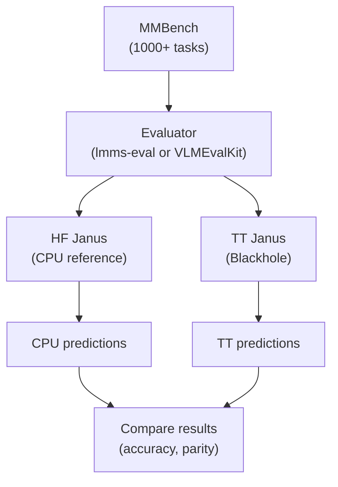

# Janus-Pro-7B Research and Benchmark Plan

Research and benchmark plan for validating **Janus-Pro-7B** on Tenstorrent hardware.

This is the **Phase 1** deliverable for GitHub issue [#47743](https://github.com/tenstorrent/tt-metal/issues/47743): research to inform how Janus-Pro-7B should be benchmarked on Tenstorrent hardware. Terms used throughout are defined in [`GLOSSARY.md`](GLOSSARY.md).

## Guiding principle

This is an **accuracy** benchmark. Its job is **not** to reproduce any published number: it runs **the same benchmark, with the same precisely-defined parameters, on both a CPU reference (the HF model) and Tenstorrent**, then compares them. The acceptance target is **parity (reference ≈ TT)**, not the paper's score. Accuracy is a property of the *model*, not the backend, so a faithful TT port should reproduce the reference score; any residual gap is bounded backend numeric noise, not a hardware difference to measure. Pinning the run parameters (Section 2) is what puts the two runs on equal footing.

We do **not** run a GPU reference — task accuracy is valid on CPU, so the HF model on CPU is the apples-to-apples reference. Upstream results matter only as the **source of the run parameters** and a loose **sanity anchor** (the reproducible community score, not the paper's). Throughput and latency are a separate *performance* benchmark, out of scope here but the agreed next phase ([Section 4](#4-stakeholder-decisions)); its reference is the published **Nvidia A10** number, again not a GPU run of our own.

## Scope

This plan covers the **multimodal understanding** flow only: the vision encoder (image → vision tower → aligner) feeding the language decoder to produce text. That is the path implemented on TT and the one MMBench exercises. Janus-Pro's **image-generation** path is **not** implemented and is out of scope.

The TT implementation is based on the transformers-native [`deepseek-community/Janus-Pro-7B`](https://huggingface.co/deepseek-community/Janus-Pro-7B). Decoding parameters are taken from the original [`deepseek-ai/Janus`](https://github.com/deepseek-ai/Janus#multimodal-understanding) example (same values, different code path).

## Document sections

| # | Section | What it covers |
|---|---------|----------------|
| 1 | Upstream Evaluation Protocol | How Janus-Pro-7B is evaluated in public, and the run parameters proposed from it. |
| 2 | Evaluation Protocol Constraints | What must stay identical across the reference and TT, what cannot be matched, and how to read the residual. |
| 3 | Benchmark Suite Selection | The dataset(s) and implementation path chosen for the benchmark. |
| 4 | Stakeholder Decisions | The agreed decisions (path order, suite, run parameters, tolerance, references), the confirmed run configuration, and the validation protocol. |
| 5 | Reference Baseline | The CPU reference run (and published anchors) TT is compared against. |

---

## 1. Upstream Evaluation Protocol

**Goal:** find how Janus-Pro-7B is evaluated in public, and extract the **run parameters** we will reuse identically on both backends.

### Summary

- The [Janus-Pro paper](https://arxiv.org/abs/2501.17811) reports **MMBench = 79.2** but does not publish the evaluation protocol used to obtain it.
- A public report ([Janus issue #205](https://github.com/deepseek-ai/Janus/issues/205)) states that this score could not be reproduced with [`lmms-eval`](https://github.com/EvolvingLMMs-Lab/lmms-eval), obtaining `mmbench_en_dev` = **65.81** and `mmbench_en_test` = **65.98**; the same report notes that the [MMBench](https://mmbench.opencompass.org.cn/leaderboard) and OpenCompass leaderboards place Janus-Pro-7B near that lower range.
- The paper's number is therefore **not reproducible from public information**, and the cause of the discrepancy is **not established**. Reproducing it is a non-goal (see [Guiding principle](#guiding-principle)).
- We derive **proposed run parameters** from documented public sources ([Proposed run parameters](#proposed-run-parameters)), submit them for sign-off in [Section 4](#4-stakeholder-decisions), and judge TT against a **CPU reference** (the HF model) executed under those same parameters.

### Decoding parameters (HF `generate()`)

These parameters of the HuggingFace [`generate()`](https://huggingface.co/docs/transformers/main/en/main_classes/text_generation) API govern the autoregressive *text-decode* stage (how each next token is chosen) and directly affect outputs. The tt-metal equivalents are covered in [Section 2](#2-evaluation-protocol-constraints).

| Parameter | Description |
|-----------|-------------|
| `do_sample` | Decoding strategy. `False` = **greedy** (always pick the highest-probability token; deterministic). `True` = **sampling** (draw at random, shaped by `temperature`/`top_p`/`top_k`). Benchmarks use `do_sample=False`. |
| `temperature` / `top_p` / `top_k` | Shape random sampling. Ignored under greedy. |
| `num_beams` | Beams for beam search (`1` = off). |
| `max_new_tokens` | Cap on generated tokens. |
| `use_cache` | KV-cache toggle. Affects **only performance**, not the output. |
| `eos_token_id` | Token that ends generation. |

### Proposed run parameters

Each parameter below is drawn from a cited public source and is **proposed** as the benchmark's run configuration, subject to stakeholder sign-off ([Section 4](#4-stakeholder-decisions)). Whatever is agreed must then be applied **identically on the reference (CPU) and TT**; Section 2 enforces that.

- **Dataset / split.** MMBench, `mmbench_en_dev`, evaluated with `lmms-eval` ([Janus issue #205](https://github.com/deepseek-ai/Janus/issues/205)). The `dev` split ships public answers, so scoring is local; `test` requires the official server.
- **Image preprocessing.** The Janus image processor at **384 × 384**, `image_mean`/`image_std` = `[0.5, 0.5, 0.5]`, `rescale_factor` = `1/255`, padding color `[127, 127, 127]` (source: [`preprocessor_config.json`](https://huggingface.co/deepseek-community/Janus-Pro-7B/blob/main/preprocessor_config.json)).
- **Decoding.** Greedy (`do_sample=False`), `use_cache=True`, `max_new_tokens=512`, from the official Janus multimodal-understanding example ([Janus README](https://github.com/deepseek-ai/Janus#multimodal-understanding)). For MMBench letter answers `max_new_tokens` does not bind.
- **Scoring.** MMBench multiple-choice: extract an answer letter from the raw output, then compare with ground truth (`raw prediction → extract answer → compare → accuracy`), as implemented by the evaluator (`lmms-eval`). The *same* extraction code is applied to both backends' outputs.
- **Prompt.** The canonical MMBench multiple-choice format, wrapped in the Janus conversation format with the model's image placeholder. The block below is **illustrative** of that structure; the exact template is defined by the evaluator (`lmms-eval` / VLMEvalKit) and is not reproduced verbatim here:

  ```text
  <image>

  Question

  A.
  B.
  C.
  D.

  Answer with the option's letter.
  ```

### Related benchmark suites

The paper also reports these (candidates for Section 3), each with its own dataset and scoring:

| Benchmark | Measures |
|-----------|----------|
| **MME** | Visual perception and cognition. |
| **SEED-Bench** | Broad multiple-choice vision-language tasks. |
| **GQA** | VQA with short textual answers. |
| **POPE** | Object hallucination. |
| **MMMU** | University-level multimodal reasoning. |
| **MM-Vet** | Complex reasoning, free-form answers, judge-based scoring. |

---

## 2. Evaluation Protocol Constraints

**Goal:** make the CPU reference run and the Tenstorrent run **identical in every parameter that affects the score**, so any residual difference is isolated to backend numerics rather than to how the benchmark was set up. This section lists what must stay constant, what cannot be matched exactly, and how to read the residual.

### Decoding parity: HF `generate()` ↔ tt-metal `SamplingParams`

On device, decoding is driven by [`SamplingParams`](https://github.com/tenstorrent/tt-metal/blob/main/models/common/sampling/sampling_params.py) (or greedy when none are passed). The two APIs do not share the same fields:

| HF `generate()` | tt-metal | Note |
|-----------------|----------|------|
| `do_sample=False` (greedy) | `sampling_params=None` → host **argmax** | Different mechanism, identical result. **The benchmark setting.** |
| `temperature` / `top_p` / `top_k` | same fields on `SamplingParams` | **Inert under greedy.** |
| `num_beams` | *(none)* | No beam search on TT; upstream uses `1`, so no gap. |
| `max_new_tokens` / `eos_token_id` | generator decode loop | Must match upstream. |
| `use_cache` | *(always on)* | Matches upstream `use_cache=True`. |
| `presence`/`frequency`/`repetition_penalty`, `seed`, `enable_log_probs` | *(TT-only)* | Set neutral (`0/0/1`), off; irrelevant under greedy. |

**Takeaway:** running **greedy on both sides** makes every sampling parameter inert, so the APIs' differing fields do not affect the result. The only real decoding constraints are: force greedy, match `max_new_tokens`, match the stop token.

### Precision

TT runs the model in **mixed precision by stage**, and the reference must match it stage by stage so precision is not a confound.

| Stage | TT precision | Why |
|-------|--------------|-----|
| Vision tower | `bf16` | Gives better vision PCC than `bf8`, and the tower fits at `bf16`. |
| Language decoder | `bf8` (`bfloat8_b`) | The 7B decoder must fit in memory; `bf8` uses about half the memory of `bf16`. |

Even with precision matched per stage, kernel and reduction ordering still differ across backends, and the decoder precision differs under the choice above. Matching narrows the gap; the residual is bounded by the tolerance.

### Execution determinism

The reference (CPU) and TT run the same model and parameters, so any score gap can only be **backend numeric variance**, not a real model difference. Determinism control keeps that variance stable and small, so it is not also polluted by run-to-run noise. Two independent kinds of nondeterminism, controlled differently:

1. **Sampling nondeterminism.** Eliminated: the benchmark runs greedy, so there is no random token selection. (If we ever sample, a fixed seed on both backends becomes mandatory.)
2. **Numeric / backend nondeterminism.** Cannot be eliminated, only bounded. On TT it is **fixed by the program config**: the op→kernel mapping, math fidelity, and memory layout are pinned in the model definition (e.g. [`janus_pro_conv2d_patch.py`](https://github.com/tenstorrent/tt-metal/blob/main/models/experimental/janus_pro/tt/janus_pro_conv2d_patch.py) sets `MathFidelity.HiFi2`, `fp32_dest_acc_en`, `packer_l1_acc`); unlike cuDNN there is no per-run kernel auto-tuning. On the same device, build, config, and input, the TT forward pass is expected to be deterministic. This is treated as a property to **verify, not assume** (confirmed by the N-run check in the [validation protocol](#4-stakeholder-decisions)). What legitimately changes the result is a **config axis** (device, build, mesh shape, dtype/fidelity), not run-to-run noise.

The torch reference runs on **CPU** for both PCC and the accuracy benchmark, in `model.eval()`, which disables training-only behavior (dropout, batchnorm batch-stats) so the forward pass is deterministic. This is standard in the repo's reference setup (e.g. `generate_reference_outputs.py`). Choosing CPU (over GPU) *simplifies* determinism: CPU torch has no cuDNN kernel autotuning and no TF32, so the GPU pinning stack (`torch.use_deterministic_algorithms(True)`, `cudnn.deterministic`/`benchmark=False`, pinned TF32, `CUBLAS_WORKSPACE_CONFIG`) is unnecessary. The only knobs to pin are the reference dtype and thread count; fixed with the Section 5 flow.

**What PCC checks.** PCC is a *fidelity* gate, not an accuracy metric: it confirms TT's tensors match the reference model's tensors, not that the answers are correct. A faithfully ported model (PCC ≈ 1.0) can still answer a question wrong, so a high PCC does not imply high accuracy. The ordered sequence that uses this gate (PCC, then determinism, then the benchmark) is the [validation protocol in Section 4](#4-stakeholder-decisions).

#### PCC validation coverage

Per-stage PCC tests under `models/experimental/janus_pro/tests/` (branch `ctr-mmicic/janus_pro_benchmark_impl`) compare each TT stage against a CPU HuggingFace reference (precision matched per stage), with a fixed seed (`reset_seeds` in the repo-root `conftest.py` → `torch.manual_seed(213919)`). These compare a single forward pass, with no token generation, so greedy vs. sampling does not apply here. Thresholds below are the `pcc_required` values asserted in each test.

| Group | Test | Required PCC |
|-------|------|:-----------:|
| Vision | `test_patch_embedding`, `test_vision_embedding`, `test_vision_aligner` | 0.9999 |
| Vision | `test_vision_layernorm`, `test_vision_attention`, `test_vision_mlp`, `test_vision_transformer_block`, `test_vision_transformer` | 0.99 |
| Vision | `test_vision_model` (full tower), `test_vision_pipeline` | 0.95 |
| Language | `test_lang_decoder_rms` | 0.9999 |
| Language | `test_lang_decoder_rope` | 0.999 |
| Language | `test_lang_decoder_block`, `test_lang_decoder` (all layers) | 0.99 |
| End-to-end | `test_e2e`, `test_e2e_hybrid` | 0.95 |

The bar tightens per stage: near-lossless ops (embeddings, RMSNorm, aligner) need `0.9999`; matmul-accumulating blocks `0.99`; whole-tower and end-to-end `0.95`, as errors compound through the LM head. Caveats: the `test_e2e` threshold is annotated in-code as a *starting point to tune*, and one secondary `0.99` check in `test_vision_pipeline` is currently not asserted.

### Acceptance tolerance

Given a healthy port (PCC and determinism already passed), the reference-vs-TT score delta *is* backend noise expressed at the accuracy level, something PCC cannot predict in advance. It is bounded by the acceptance tolerance, which is **derived, not guessed**: set from the observed delta on a run under matched parameters, with the target being **parity (reference ≈ TT)**, not the paper's 79.2. The run-and-compare procedure that produces the delta, and the sign-off on the tolerance, are the [validation protocol in Section 4](#4-stakeholder-decisions).

### Constraints summary

| Factor | Must stay constant | Cannot be matched exactly | How to interpret |
|--------|--------------------|---------------------------|------------------|
| Decoding mode | Greedy on both sides | n/a | No sampling variance. |
| Sampling params | Neutral / unused under greedy | n/a | Inert. |
| `max_new_tokens`, stop token | Identical | n/a | Comparable length/truncation. |
| Prompt / preprocessing / tokenizer | Identical | n/a | Required for validity. |
| Precision | Per-stage matched (`bf16` vision; decoder `bf8` TT / `bf16` ref) | Decoder precision; kernel/reduction ordering | Narrowed, not bit-exact; residual bounded by tolerance. |
| TT run-to-run determinism | Fixed device/build/config + seed | n/a | Verified by the N-run check (TT-vs-TT); deterministic under fixed program config. |
| TT numeric correctness | Precision-matched reference + seed | Cross-backend ordering | Gated by per-layer PCC ([epic #47041](https://github.com/tenstorrent/tt-metal/issues/47041)). |
| Reference (CPU) determinism | `model.eval()`, pinned dtype + thread count | n/a | CPU needs no cuDNN/TF32 pinning; recorded in Section 5. |
| Acceptance tolerance | Reference-vs-TT delta on the full run; sign-off in Section 4 | n/a | Given a healthy port, the delta is backend noise; target is parity with the CPU reference, not 79.2. |

---

## 3. Benchmark Suite Selection

**Goal:** pick the implementation path. Each path is rated on **effort** (how much new code versus reuse) and **reliability** (how trustworthy its accuracy signal is for reference-vs-TT parity).

### Path A: external reference-aligned (off-CI)

Run the standard `lmms-eval` MMBench task twice, once against the HF model on **CPU** and once against TT, then compare. This runs **manually, off-CI**, so there is no automated-CI burden. That is already how `lmms-eval` Tenstorrent evals are meant to run.



The single evaluator drives both sides with identical prompts and scoring; only the model backend differs (CPU reference vs. TT). That shared evaluator is what makes the reference-vs-TT delta a clean parity signal.

How it plugs into TT (most pieces already exist):

1. **TT generation exists.** `JanusMultimodalGenerator` (in `tt/janus_pro_e2e_model.py`, a subclass of the tt_transformers `Generator`), driven by the greedy prefill/decode loop in `demo/vision_demo.py` (branch `ctr-mmicic/janus_pro_benchmark_impl`), already turns image + prompt into generated text on Blackhole.
2. **The TT adapter is a thin shim.** `lmms-eval` runs any model that subclasses its `lmms` base and implements `generate_until`. There is a Tenstorrent precedent to copy: [`whisper_tt.py`](https://github.com/EvolvingLMMs-Lab/lmms-eval/blob/main/lmms_eval/models/whisper_tt.py) (`@register_model("whisper_tt")`, direct ttnn execution, built to run outside docker). A `janus_tt` class follows the same shape and calls the generator from step 1 inside `generate_until`.
3. **Reference (CPU) side.** Current `lmms-eval` `main` has no Janus model class, so the CPU reference needs a small model class too (wrapping HF `JanusForConditionalGeneration`), unless an existing community Janus integration is used.

- **Reuses:** the full `lmms-eval` MMBench task and scoring, the existing TT generator, and the `whisper_tt` adapter template. The evaluation logic itself is not reimplemented.
- **Effort: medium (off-CI).** Two thin `lmms-eval` model classes (`janus_tt` plus a CPU-reference Janus class) and manual run plumbing. No CI wiring and no in-repo scoring to build.
- **Reliability: highest.** The *same* upstream evaluator scores both sides, so results are comparable to public numbers and the reference-vs-TT comparison uses identical scoring by construction.

### Path B: in-repo MMBench subset

A curated `mmbench_en_dev` slice with reproducible prompt formatting and multiple-choice / exact-match scoring, inside a pytest/demo flow.

- **Reuses:** the existing Janus test harness (`models/experimental/janus_pro/tests/`, `conftest.py`, e2e model) plus the Gemma3 demo/test harness and [`PERF.md`](https://github.com/tenstorrent/tt-metal/blob/main/models/demos/multimodal/gemma3/PERF.md) layout. Note: Gemma3's `token-matching` (Top-1/Top-5) is a *text-decoder* next-token parity metric against a `.refpt` reference (see the note below Path C), **not** MMBench scoring. Path B reuses Gemma3's harness and PERF.md shape; the multiple-choice exact-match scoring itself is new.
- **Effort: medium.** New work is the curated dataset slice, prompt formatting, answer-letter extraction, and exact-match scoring. The runner and reporting patterns already exist.
- **Reliability: high.** Real MMBench data, and multiple-choice exact-match collapses to a single answer letter, which is robust to the backend numeric noise of [Section 2](#execution-determinism).

### Path C: interim lightweight

BERTScore / token-match on a fixed multimodal prompt set, following the existing qwen/gemma pattern, until a fuller MMBench path is ready.

- **Reuses:** directly. Qwen2.5-VL and Qwen3-VL already ship this: `bert_score` F1 over demo output versus expected text, driven by a `sample_prompts/test_bert_score.json` set with an `assert F1 > threshold` (see [`qwen25_vl/demo/demo.py`](https://github.com/tenstorrent/tt-metal/blob/main/models/demos/qwen25_vl/demo/demo.py)).
- **Effort: low.** Point the existing scoring at Janus e2e outputs and author a fixed prompt set. Almost no new machinery.
- **Reliability: low for accuracy parity.** BERTScore on free-form text is fuzzy and, being continuous, is the most sensitive to backend numeric noise. It is a functional cross-check, not a trustworthy accuracy number.

> **Related but separate: the `.refpt` token-parity check.** tt-metal's `token-matching` accuracy (used by Gemma3) compares each TT next-token prediction against a reference model's top-1/top-5, teacher-forced over a fixed text (generated by [`generate_reference_outputs.py`](https://github.com/tenstorrent/tt-metal/blob/main/models/tt_transformers/tests/generate_reference_outputs.py) into a `<model>.refpt`). It is **text-decoder only** (no image) and measures TT-vs-reference *parity*, not task accuracy. For Janus it could cheaply validate the language decoder, but it does **not** cover the multimodal MMBench task, so it complements Path A/B rather than replacing them.

### Path D: tt-inference-server (downstream serving layer)

Register Janus in [`tt-inference-server`](https://github.com/tenstorrent/tt-inference-server) and run its built-in `evals` / `benchmarking` workflows. This is a **separate, heavier home**, not a variant of Path B: it is a client-side orchestration layer that drives models **over a running vLLM OpenAI-compatible HTTP endpoint**, never through tt-metal pytest. It is documented here because the meeting explicitly asked whether reusable benchmark support already exists there.

- **Hard prerequisites (not yet met for Janus).** A tt-metal Janus impl **plus a Tenstorrent vLLM-fork generator** must exist; the server only talks HTTP to a vLLM/tt-media endpoint. The current TT path is direct-ttnn (`JanusMultimodalGenerator`, off-server), so there is no vLLM backend to serve yet. Integration also needs a model spec (`workflows/model_specs/prod/vlm.yaml`, `supported_modalities: [text, image]`, pinned `tt_metal_commit`/`vllm_commit`), an `EvalConfig`, a `BENCHMARK_CONFIGS` entry, and per-model CI config.
- **Accuracy fit is poor for this plan's goal.** Its VLM eval registry (`evals/eval_config.py`) supports `chartqa` / `docvqa_val` / `mmmu_val` via an `openai_compatible` class — **not MMBench, and not lmms-eval for VLMs**. It therefore does **not** produce the MMBench reference-vs-TT parity number this document targets.
- **Performance fit is strong — but for the D3 next phase, not accuracy.** `benchmarking/` (vLLM `benchmark_serving.py`, AIPerf, GenAI-Perf, GuideLLM) measures TTFT / TPOT / throughput against `benchmark_targets/model_performance_reference.json`. This is the natural home for the [Section 4 D3](#decisions) performance work **once a vLLM backend exists** — not for the Phase 1 accuracy benchmark.
- **Reuses:** the server's `evals`/`benchmarking` orchestration and its model registry — but none of it for MMBench accuracy.
- **Effort: high.** Requires a vLLM-fork generator that does not exist yet, plus registry/CI wiring; the largest scope of any path.
- **Reliability (for MMBench parity): n/a.** It does not run MMBench; its accuracy signal is a different task set.

### Comparison

| Path | Reuses | Effort | Reliability | Main con |
|------|--------|:------:|:-----------:|----------|
| A. External (`lmms-eval`), off-CI | lmms-eval scoring + TT generator + `whisper_tt` template | Medium (off-CI) | Highest | External dependency; needs CPU-reference + TT adapter classes; run manually. |
| B. In-repo MMBench subset | Janus tests + Gemma3 demo/PERF pattern | Medium | High | Must curate the dataset slice and scoring. |
| C. Lightweight BERTScore/token-match | qwen/gemma demo, directly | Low | Low | Fuzzy metric, noise-sensitive; not a real accuracy signal. |
| D. tt-inference-server (vLLM-served) | server `evals`/`benchmarking` + model registry | High | n/a for MMBench (different tasks) | Needs a vLLM-fork backend that does not exist yet; no MMBench; a serving layer, not a suite. |

### Conclusion and proposed approach

A staged approach, so we get an immediate signal cheaply and the authoritative number soon after. The agreed order is **C → A → D** (see [Section 4](#decisions)); **Path B is dropped**.

1. **Now, Path C as an interim gate (low effort).** Reuse the qwen/gemma BERTScore/token-match harness for a same-day cross-backend functional check. Its low reliability is acceptable *only* as a smoke test, not as the reported accuracy.
2. **Authoritative measurement, Path A off-CI (medium effort, highest reliability).** The TT generator already exists, `whisper_tt` is a ready adapter template, and off-CI execution removes the only real objection (CI integration). It produces the predictions JSON and the `PERF.md` accuracy table.
3. **Later, Path D — performance phase only.** A downstream serving layer, not an accuracy path: it lacks a Janus vLLM backend and does not run MMBench (see [Path D](#path-d-tt-inference-server-downstream-serving-layer)). Its value is the [D3](#decisions) **performance** work once that backend exists.

**Path B is dropped:** its only edge was in-CI scoring, which the local-first decision ([D1](#decisions)) makes moot; Path A off-CI already covers the parity goal with upstream scoring.

---

## 4. Stakeholder Decisions

The stakeholder review is complete. This section records what was agreed; the still-open threads and immediate follow-ups are folded into the relevant decisions below. The decisions confirm the [Section 3 recommendation](#conclusion-and-proposed-approach) and the [Section 1 reference framing](#summary).

### Decisions

- **[D1] Local/manual benchmark first, in the order C → A → D; Path B is dropped** (staging and drop rationale in [Section 3](#conclusion-and-proposed-approach)). Local-first because the Metal/API surface moves fast: a benchmark idle in CI would break and demand active ownership, whereas a local run delivers the first numbers without that maintenance burden. *Immediate next step:* run the Path A benchmark locally and produce initial accuracy numbers. *Open:* whether Janus-Pro eventually merges to `main` — business focus has shifted from DeepSeek toward Gemma and GLM coding-model work, so absent stronger demand the near-term deliverable is a good demo plus first-pass optimization, which does not by itself justify the merge cost — and the long-term home of the fuller flow (local tooling, in-repo CI, or tt-inference-server per [Path D](#path-d-tt-inference-server-downstream-serving-layer)); both deferred to internal alignment.
- **[D2] Accuracy reference is the HF model on CPU, plus published leaderboards — no GPU run.** Accuracy is a model property that is valid on CPU, so the apples-to-apples reference is the HF model **run on CPU** under the same parameters, and TT is compared against that. We do **not** run a GPU reference. The sanity anchor is the reproducible community score (`mmbench_en_dev` ≈ **66**, [Section 1](#summary)), read off public leaderboards — primarily [OpenCompass multimodal](https://rank.opencompass.org.cn/leaderboard-multimodal) and the [HF Open VLM Leaderboard](https://huggingface.co/spaces/opencompass/open_vlm_leaderboard); the paper's **79.2** is not reproducible and is not a target. *Open:* how to measure **vision-side** accuracy specifically — the current stack supports text-side checks (top-1/top-5 token parity against a reference, see the `.refpt` note under [Path C](#path-c-interim-lightweight)) better than full multimodal accuracy; MMBench via Path A is the intended multimodal-accuracy path.
- **[D3] Performance is the immediate next phase; its reference is the published Nvidia A10, not a GPU run.** After the accuracy push, prioritize a performance investigation: profile the critical operators, estimate achievable N150 speed, and compare against published **Nvidia A10** numbers (tokens/sec and time-to-first-token) as an *approximate* target. We do **not** run performance on GPU ourselves. Out of scope for this Phase 1 accuracy plan, but the agreed follow-on, not a someday-maybe. *First step:* research and collect the published A10 tokens/sec and TTFT figures for Janus-Pro or a comparable setup. *Open:* how far current N150 performance sits from a realistic ceiling — a small uplift or a multi-x opportunity — is exactly what this phase resolves.
- **[D4] Accuracy and performance are separate benchmarks — different runs, data needs, and tools.** The accuracy benchmark (`lmms-eval` on labeled MMBench, greedy, scored for correctness) and the performance benchmark (throughput / TTFT / TPOT / latency, measured against representative sequence lengths, correctness irrelevant) are **two distinct runs**. A single `lmms-eval` run yields **accuracy only**, not a controlled performance number. The dataset need not be shared: accuracy *must* use labeled MMBench; performance only needs representative input/output lengths (it may reuse MMBench prompts for convenience, but the number depends on ISL/OSL and concurrency, not on the data being MMBench). Performance uses a separate harness (tt-metal demo perf path, or the [Path D](#path-d-tt-inference-server-downstream-serving-layer) vLLM `benchmark_serving.py`).

### Confirmed run configuration

- **Suite:** MMBench, `mmbench_en_dev`, scored with `lmms-eval` ([proposed run parameters](#proposed-run-parameters)).
- **Path:** C (smoke) → A off-CI (authoritative) → D (performance phase); B dropped ([Section 3](#conclusion-and-proposed-approach)).
- **Run parameters:** the [Section 1 proposal](#proposed-run-parameters) — greedy, `max_new_tokens=512`, Janus 384×384 preprocessing.
- **Acceptance:** parity (reference ≈ TT); tolerance derived from the observed delta ([Acceptance tolerance](#acceptance-tolerance)), not the paper's 79.2.
- **Accuracy reference:** the HF model on **CPU** (precision recorded), plus public leaderboards (~66) as the sanity anchor; **no GPU run** ([Section 5](#5-reference-baseline)).
- **Performance reference:** published **Nvidia A10** numbers (tokens/sec, TTFT) as an approximate target — D3 phase, not run here.

### Validation protocol

Each step gates the next; PCC and determinism prove the port is faithful and stable before any accuracy number is trusted.

1. **PCC gate.** Confirm every stage passes its per-stage PCC threshold ([Section 2](#pcc-validation-coverage)). Proves the port computes the right numbers.
2. **Determinism (N-run).** Run the TT path ≥ 3× on the same machine/config with the same input; confirm TT-vs-TT outputs are identical (ideally bit-exact; PCC `= 1.0`). Proves the run is idempotent, so the benchmark inherits stable behavior.
3. **Full benchmark.** Run the agreed benchmark on the **CPU reference** and TT under identical parameters; report both scores and the reference-vs-TT delta. The CPU reference score should land near the ~66 range from [Section 1](#summary) (cross-checked against the public leaderboards); if not, the setup is broken. (Optional: a small `dev` subset first as an early-warning.)
4. **Sign-off.** A delta within tolerance passes; a larger delta is investigated. The target is parity with the CPU reference, not the paper's 79.2.

Step 3 exists because PCC and determinism never produce a task-accuracy number on real data (they compare tensors, on dummy weights); only the full benchmark does, and it is the Phase 1 deliverable (`PERF.md`).

---

## 5. Reference Baseline

Defines what TT is compared against. Per [D2](#decisions)/[D3](#decisions), **we do not run any GPU reference.** Accuracy uses an in-house CPU reference plus published anchors; performance uses a published Nvidia A10 target.

### Accuracy reference — HF model on CPU

The reference run is the HF `JanusForConditionalGeneration` executed on **CPU** under the exact parameters (Section 1), the per-stage precision (Section 2), `model.eval()`, with the per-sample predictions recorded. TT accuracy is judged against this single recorded run.

**Why CPU is sufficient.** Task accuracy is a model property; the device contributes only a *second-order* numeric difference ([Section 2](#execution-determinism)), so for multiple-choice scoring only borderline samples can flip. CPU is the deliberate choice — more reproducible than GPU and needing none of the GPU determinism pinning (Section 2). Consequently:

- **Pin and record the reference** (device = CPU, plus precision). `fp32` vs `bf16` still gives slightly different reference numbers, so the precision is recorded; precision matters more than the device and is already fixed per stage (Section 2).
- CPU running a 7B model over `mmbench_en_dev` is **slow but one-time**; answers are short letters under greedy, so wall-clock is the only cost, not correctness.

### Sanity anchor — published leaderboards

The CPU score is cross-checked against reproducible community numbers (`mmbench_en_dev` ≈ **66**), read off public sources — not to be reproduced, only to confirm the setup is not broken:

- [OpenCompass multimodal leaderboard](https://rank.opencompass.org.cn/leaderboard-multimodal) — the most relevant for Janus-Pro (MMBench, MMMU, MME, SEED-Bench, OCRBench, …).
- [HF Open VLM Leaderboard](https://huggingface.co/spaces/opencompass/open_vlm_leaderboard) — broad open-source VLM coverage.
- [Artificial Analysis](https://artificialanalysis.ai/evaluations) — good for commercial comparison, but no detailed Janus-Pro MMBench figure.
- [Janus-Pro technical report](https://arxiv.org/abs/2501.17811) — MMBench 79.2, GenEval 0.80, DPG-Bench 84.19; **not reproducible**, kept only as historical context, not a target.

### Performance reference — Nvidia A10 (D3 phase)

Out of scope for this Phase 1 plan (see [D3](#decisions)). When that phase runs, the reference is **published Nvidia A10** numbers (tokens/sec, TTFT) as an *approximate* orientation point. Note that tt-metal's `PERF.md` files conventionally compare TT devices against each other, not TT versus GPU speed — so the A10 figure is external orientation, not an in-repo parity gate.
