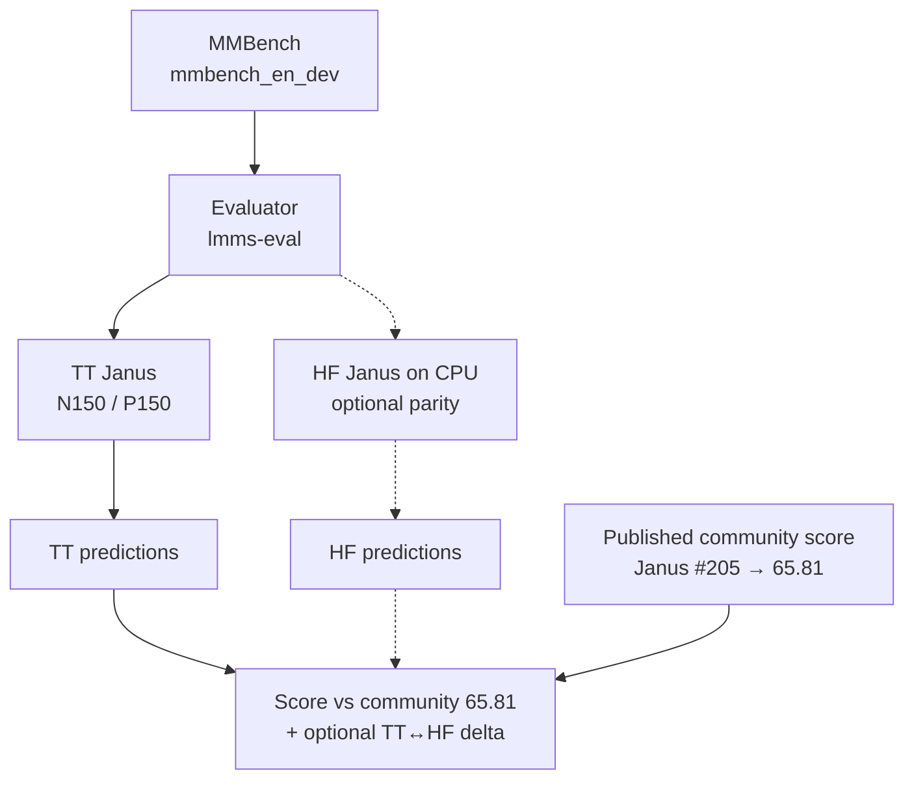
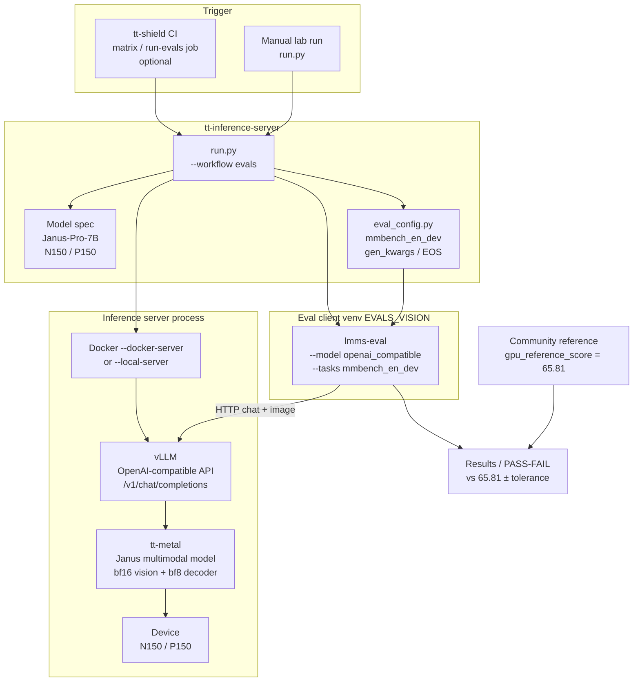
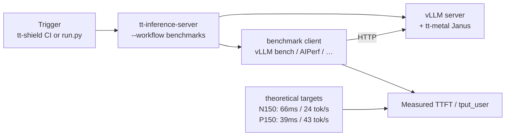

# Janus-Pro-7B Benchmark Plan

Plan for accuracy and performance benchmarking of Janus-Pro-7B on Tenstorrent.
Phase 1 deliverable for [#47743](https://github.com/tenstorrent/tt-metal/issues/47743).
Terms: [`GLOSSARY.md`](GLOSSARY.md).

**Scope:** multimodal understanding only (image → text). Image generation is out of scope.
Implementation: [`deepseek-community/Janus-Pro-7B`](https://huggingface.co/deepseek-community/Janus-Pro-7B).

---

## 1. Two benchmarks, two jobs

| | Accuracy | Performance |
|---|---|---|
| **Question** | Does TT match the community MMBench protocol score? | How fast is TT vs its theoretical ceiling (and vs a comparable GPU)? |
| **Metric** | MMBench letter accuracy | TTFT, decode tok/s/user |
| **Dataset** | Labeled `mmbench_en_dev` (required) | Representative ISL/OSL + image size; labels irrelevant |
| **Decoding** | Greedy | Decoding mode does not affect the metric (timing only) |
| **Reference** | Community **65.81** ([#205](https://github.com/deepseek-ai/Janus/issues/205)); OpenCompass sanity | Theoretical N150/P150 targets; GPU peer = A10 (no solid published Janus tok/s) |
| **Run** | Separate from perf | Separate from accuracy |

A single `lmms-eval` run does **not** produce a controlled perf number. Dataset choice matters for accuracy; for perf only sequence lengths, image resolution, and concurrency matter.

---

## 2. Accuracy

### Goal

TT MMBench score comparable to the **reproducible community `lmms-eval` result** under the same task and generation settings. Not the paper's 79.2.

### What counts as the reference (and what does not)

| Layer | What it is | Role |
|---|---|---|
| **MMBench reference** | Community `lmms-eval` `mmbench_en_dev` = **65.81** ([Janus #205](https://github.com/deepseek-ai/Janus/issues/205)) | **Authoritative.** Same task the paper claims; only public number that reproduces. Wired as `gpu_reference_score` in tt-inference-server. |
| **Local text Top-1/Top-5** | `text_demo.py` vs `.refpt` | **Decoder-only smoke.** No vision tower, not MMBench. Useful bring-up signal, not the accuracy reference. |
| **Local vision demo** | `vision_demo.py` image→text | **Functional check** (output looks image-conditioned). No scored accuracy. |
| **HF-on-CPU parity run** | Same `lmms-eval` `mmbench_en_dev` task, but the model is HF Janus on **CPU** (not TT) | Optional: measures TT↔HF score/answer gap under identical params. **Not done** for multimodal yet. Does **not** replace the community **65.81** reference. |

### Published accuracy score links

| Source | Score / note | Methodology | Link |
|---|---|---|---|
| **Community `lmms-eval` (gate)** | `mmbench_en_dev` **65.81**, `mmbench_en_test` **65.98** | [`lmms-eval`](https://github.com/EvolvingLMMs-Lab/lmms-eval) task `mmbench_en_dev`: **single-pass** MCQ (not CircularEval); letter extract via rule-based `can_infer_*` + optional GPT fallback. Model adapter / chat template **not published** in #205. | [Janus#205](https://github.com/deepseek-ai/Janus/issues/205) |
| **Janus-Pro paper** | MMBench **79.2** (not a target) | **Unpublished.** No split, CircularEval on/off, prompt, or toolkit stated in the paper. | [arXiv:2501.17811](https://arxiv.org/abs/2501.17811) (Table 3) |
| **OpenCompass multimodal** | Leaderboard (Janus-Pro near ~66, not 79.2) | Official OpenCompass stack: typically [`VLMEvalKit`](https://github.com/open-compass/VLMEvalKit); MMBench column uses OpenCompass protocol (often **CircularEval** + LLM choice extractor). **Not** the same as plain `lmms-eval` single-pass. | [leaderboard-multimodal](https://rank.opencompass.org.cn/leaderboard-multimodal/) |
| **MMBench leaderboard** | Official MMBench board (tabs: v1.1 Test, Test, CN, …) | Same family as above: **VLMEvalKit** + **CircularEval** (N circular shifts; must get all passes right) + LLM (e.g. GPT) choice extractor; `test` scores via [server submission](https://mmbench.opencompass.org.cn/mmbench-submission). Overall + L-2 abilities (LR/AR/RR/FP-S/FP-C/CP). | [mmbench leaderboard](https://mmbench.opencompass.org.cn/leaderboard) |
| **HF Open VLM Leaderboard** | Broad open VLM rankings | OpenCompass-backed space; VLMEvalKit-style multimodal suite (sanity check, not our gate). | [HF space](https://huggingface.co/spaces/opencompass/open_vlm_leaderboard) |

**Comparability note:** our gate matches **community `lmms-eval` single-pass** (~66). OpenCompass / MMBench boards are a **different protocol** (CircularEval + VLMEvalKit) — useful sanity that Janus is not ~79 in public runs, but not an apples-to-apples number vs our TT eval. Paper 79.2 remains unreproducible.

### Locked run parameters (MMBench)

| Parameter | Value | Source |
|---|---|---|
| Suite / split | MMBench `mmbench_en_dev` via `lmms-eval` | [Janus #205](https://github.com/deepseek-ai/Janus/issues/205) |
| Image preprocess | 384×384, mean/std `[0.5,0.5,0.5]`, pad `[127,127,127]` | [`deepseek-community` `preprocessor_config.json`](https://huggingface.co/deepseek-community/Janus-Pro-7B/blob/main/preprocessor_config.json) |
| Decoding | Greedy (`do_sample=False`), `max_new_tokens=512` | Upstream demo: [deepseek-ai/Janus README — Multimodal Understanding](https://github.com/deepseek-ai/Janus#multimodal-understanding) (`max_new_tokens=512`, `do_sample=False`). Our eval pin: [tt-inference-server `eval_config.py` Janus `gen_kwargs`](https://github.com/tenstorrent/tt-inference-server/blob/main/reference_config/evals/eval_config.py) (`max_new_tokens=512`). |
| EOS / stop | `<｜end▁of▁sentence｜>` (id 100001); also stop on `<\|User\|>` in chat | Tokenizer: [`deepseek-community` `special_tokens_map.json`](https://huggingface.co/deepseek-community/Janus-Pro-7B/blob/main/special_tokens_map.json) / [`generation_config.json`](https://huggingface.co/deepseek-community/Janus-Pro-7B/blob/main/generation_config.json). Chat stop list: [deepseek-ai/Janus `conversation.py`](https://github.com/deepseek-ai/Janus/blob/main/janus/utils/conversation.py) (`deepseek` template). |
| Scoring | `lmms-eval` letter extract (`can_infer_*`, GPT fallback) | Same evaluator as community ([#205](https://github.com/deepseek-ai/Janus/issues/205)) |
| Precision | Vision `bf16`, decoder `bf8` on TT | Model config |

### Comparability checklist (accuracy vs community / reference)

What must match so a TT (or server) score is comparable to **65.81**. Impact = how much a mismatch typically moves the number.

| Factor | Must match? | Impact | Our status |
|---|---|---|---|
| Task / split (`mmbench_en_dev`) | **Yes** | **Critical** — different split = different score | OK — same `lmms-eval` task |
| MCQ option format + post-prompt | **Yes** | **Critical** — comes from task YAML (`Answer with the option's letter…`) | OK — task-owned, not our code |
| Scoring path (rule-based ± GPT fallback) | **Yes** | **High** — without GPT key, unparsable answers become random letters | OK if same `gpt_eval_score` path; set `OPENAI_API_KEY` for fallback parity |
| CircularEval on/off | **Yes** | **High** — CircularEval scores are not comparable to single-pass | OK — `mmbench_en_dev` is single-pass |
| Greedy decoding (`temperature=0`) | **Yes** | **High** — sampling changes answers | OK — task default + our intent |
| Chat / conversation template (Janus roles, image placeholder) | **Yes** | **High** — changes what the model actually sees | **Risk** — we serve via `openai_compatible` chat API; community #205 did not publish their adapter. Need Janus chat template on the server. |
| Image preprocessing (384², mean/std, pad) | **Yes** | **Medium–High** | OK if processor matches HF config |
| EOS / stop tokens | **Yes** | **Medium** — wrong stop (e.g. Llama `<\|eot_id\|>`) can truncate or over-generate | **Fixed in eval config** → `<｜end▁of▁sentence｜>` (was Llama copy-paste) |
| `max_new_tokens` | Prefer match | **Low** for MCQ letters (512 vs task default 1024) | 512 in server config — fine for letter answers |
| Model weights revision | Prefer match | **Medium** if checkpoints differ | Use `deepseek-community/Janus-Pro-7B` |
| lmms-eval version | Prefer close | **Low–Medium** — task YAML drift | Pin EVALS_VISION venv |
| Backend numerics (GPU vs TT bf8) | Cannot match exactly | **Expected residual** — bounded by tolerance | TT vs community gap = this + any template mismatch |

Community [#205](https://github.com/deepseek-ai/Janus/issues/205) did **not** publish `--model` / adapter / template, so **65.81 is same-task, not bit-exact protocol**. Closest we can get: same `lmms-eval` task + Janus chat template + correct EOS + greedy + same scoring.

### How we run it

#### Accuracy scaffold (logical flow)

Same evaluator drives scoring; the gate is community **65.81**, not a GPU run of our own. Optional HF-CPU branch is parity only.

Local bring-up (not the scored multimodal gate):

| What | How | Covers vision? |
|---|---|---|
| Text Top-1/Top-5 | `text_demo.py` `-k notrace` vs `.refpt` | No |
| Vision functional / perf | `vision_demo.py` | Yes (unscored) |
| Launch | `.vscode/launch.json` → `[janus_pro][demo] *` | — |

Details: [`demo/README.md`](../../demo/README.md), numbers in [`PERF.md`](../../PERF.md).

#### Authoritative path — tt-inference-server orchestration

Target: `python run.py --model … --tt-device n150|p150 --workflow evals --docker-server` (or `--local-server`). Janus is registered for `mmbench_en_dev` (+ `mmmu_val`); gate = **65.81**. Needs a Janus vLLM backend (in progress).

Stack roles in one line:

| Layer | Role |
|---|---|
| **tt-shield** | Optional CI owner: schedules device runners, dispatches eval/benchmark jobs that call into tt-inference-server. |
| **tt-inference-server** | Orchestrator: model spec, eval/benchmark configs, venv bootstrap, server lifecycle, scoring vs reference. |
| **vLLM (TT fork)** | Serving layer: OpenAI HTTP API that `lmms-eval` talks to. |
| **tt-metal Janus** | Device model: vision + decoder kernels on N150/P150. |
| **lmms-eval** | Task runner + letter scoring (same task family as community #205). |

Direct `lmms-eval` against a TT generator (no server) is a fallback if the vLLM path is blocked; still score against **65.81**.

### Validation order

1. **PCC** — per-stage tests (including vision). Fidelity gate, not task accuracy.
2. **Determinism** — ≥3 identical TT runs, same machine/config/input.
3. **MMBench** — TT via `lmms-eval` / tt-inference-server; compare to **65.81**.
4. **Sign-off** — score within agreed tolerance of the community reference = pass.

Optional later: HF CPU (or GPU) parity under the same `lmms-eval` task, if we want TT↔HF delta in addition to TT↔community.

---

## 3. Performance

### Goal

1. Measure TTFT + decode tok/s/user on **N150** and **P150**.
2. Compare against **theoretical** targets for those devices.
3. Orient against a **comparable published GPU** number (approximate, not a pass/fail gate).

### Methodology (what is comparable)

Perf is **not** dataset-bound. What must match for a fair comparison:

| Must pin | Why |
|---|---|
| ISL / OSL | Dominates TTFT and decode length |
| Image H×W, images/prompt | Dominates vision + prefill cost |
| Concurrency | tok/s/user vs aggregate throughput |
| Precision | bf16 vision / bf8 decoder |
| Build | **Release** only — Debug timings are invalid |

Community Janus “perf” posts (CSDN, blogs) publish **wall-clock** image-Q&A or image-generation seconds, not controlled ISL/OSL tok/s. Those are **not** comparable to our metrics.

### How we measure

| Path | Role |
|---|---|
| **Local demos (now)** | `vision_demo.py` `-k "trace and single"` (Release) → TTFT + decode tok/s/user. Launch: `[janus_pro][demo] vision perf benchmark`. |
| **tt-inference-server (target)** | `--workflow benchmarks` (vLLM `benchmark_serving` / AIPerf / …) against pinned ISL/OSL/image points in `model_performance_reference.json`. Same methodology used for other VLMs — **comparable across TT models**. |

Server targets already defined for Janus (`task_type: vlm`, 384×384, ISL/OSL 128, concurrency 1):

| Device | Theoretical TTFT | Theoretical tput_user |
|---|---:|---:|
| N150 | 66 ms | 24 tok/s/user |
| P150 | 39 ms | 43 tok/s/user |

Source: [`model_performance_reference.json`](https://github.com/tenstorrent/tt-inference-server/blob/main/reference_config/benchmarking/benchmark_targets/model_performance_reference.json) (`Janus-Pro-7B`). Same N150 numbers as Qwen2.5-VL-7B (same-size VLM placeholder class) — treat as the ceiling we optimize toward, not a measured result.

Observed N150 Release vision demo (bring-up, unoptimized): ~15–18 tok/s/user, TTFT ~550–760 ms — see [`PERF.md`](../PERF.md). Large gap to theoretical, especially TTFT.

### Hardware orientation (GPU peer)

| Card | Memory | Bandwidth | TDP | Notes |
|---|---|---:|---:|---|
| **N150** (Wormhole) | 12 GB GDDR6 | 288 GB/s | 160 W | Smaller than A10 class |
| **P150** (Blackhole) | 32 GB GDDR6 | 512 GB/s | 300 W | Closest TT peer to A10 on bandwidth |
| **NVIDIA A10** | 24 GB GDDR6 | 600 GB/s | 150 W | Best single-GPU orientation target for P150 |
| NVIDIA A10G | 24 GB GDDR6 | 600 GB/s | 300 W | Same memory as A10; AWS variant |

**Chosen GPU orientation: A10** (bandwidth-nearest datacenter card to P150; N150 is a step below).

### Published GPU perf score links

No measured Janus-Pro **understanding** tok/s at pinned ISL/OSL on A10/A10G was found. Closest public links:

| Source | Claimed number | Usable as peer? | Link |
|---|---|---|---|
| **InferenceBench — Janus-Pro 7B** | A10G ~**231 tok/s** (BF16, vLLM) | **No** — labeled estimate (“Est. TTFT”), not a measured multimodal run | [inferencebench.io/models/deepseek/janus-pro-7b](https://inferencebench.io/models/deepseek/janus-pro-7b/) |
| NVIDIA A10 datasheet | Hardware specs only (24 GB, 600 GB/s) — no Janus score | Specs for orientation only | [NVIDIA A10](https://www.nvidia.com/en-us/data-center/products/a10-gpu/) |
| Blog / CSDN “RTX 4090 / A100 实测” | Wall-clock image Q&A or **generation** seconds | **No** — wrong metric / often wrong task | various; not linked as a gate |

Until a real measured A10 (or A10G) Janus understanding tok/s at known ISL/OSL exists, GPU comparison stays qualitative: hardware class peer = A10; numeric peer = TBD or measure via tt-inference-server `--tt-device gpu` + BYO vLLM.

Rough memory-bound decode ceiling (7B bf8 weights only, ignore KV): N150 ~41, P150 ~73, A10 ~86 tok/s. Server theoreticals (24 / 43) are more conservative and include real workload shape.

---

## 4. Decisions (agreed)

| ID | Decision |
|---|---|
| D1 | **Local first** for smoke/perf demos. Path B (in-repo MMBench subset) dropped. |
| D2 | **MMBench reference = community `lmms-eval` 65.81** (same task/params as tt-inference-server evals). Local Top-1/Top-5 is decoder-only smoke, not that reference. Paper 79.2 is not a target. |
| D3 | **Perf is separate** — theoretical N150/P150 targets; GPU orientation = A10-class when a real measurement exists. |
| D4 | Accuracy and perf are **separate runs** with different tools and data needs. |

---

## 5. Immediate next steps

1. Keep collecting Release vision/text demo numbers on N150 and P150 → `PERF.md`.
2. Finish tt-inference-server / direct `lmms-eval` `mmbench_en_dev` on TT; gate against **65.81**; set tolerance. Confirm Janus chat template + EOS on the serving path (see checklist).
3. Use tt-inference-server benchmarks once the Janus vLLM path is up; gate against the theoretical table in §3.
4. For GPU orientation: find a measured A10 Janus understanding tok/s at known ISL/OSL, or measure via BYO vLLM + `--tt-device gpu`.
