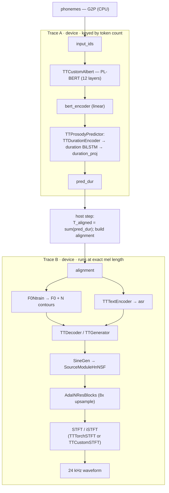

# Kokoro TTS: Summary and Key Information

## Overview

Kokoro-82M is [hexgrad](https://huggingface.co/hexgrad/Kokoro-82M)'s open-weights text-to-speech
model — an 82 M-parameter StyleTTS2 / ISTFTNet architecture producing 24 kHz speech. The
Tenstorrent TTNN implementation consists of four main components: a **PL-BERT text/prosody
backbone**, a **prosody predictor** (duration + F0/energy), an **ASR-style text encoder**, and an
**ISTFTNet decoder/vocoder** that turns aligned features into waveform samples.

The repo holds the HF reference under `reference/` and the TTNN port under `tt/`, wired together by
`TTKModel` (`tt/tt_kmodel.py`). The full forward runs on-device with no host torch vocoder; two
opt-in CPU float32 fallbacks are available for maximum numerical parity (see
[Numerical accuracy & CPU fallbacks](#numerical-accuracy--cpu-fallbacks)).

### Model configuration

Configuration is taken from the checkpoint's `config.json` (not hardcoded); repo-level constants live
in `KokoroConfig` (`tt/tt_kmodel.py`). Key values for Kokoro-82M:

| parameter | value | notes |
|-----------|:-----:|-------|
| `repo_id` | `hexgrad/Kokoro-82M` | HF weights source |
| sample rate | 24 000 Hz | output waveform |
| `n_token` (vocab) | 178 | phoneme symbols |
| `hidden_dim` | 512 | text/prosody hidden |
| `style_dim` | 128 | style/ref embedding |
| PLBERT hidden | 768 | 12 layers, 12 heads, intermediate 2048 |
| `context_length` (`max_position_embeddings`) | **512** | hard cap on phonemes per chunk (≤ 510 after BOS/EOS) |

## Architecture Pipeline



**Stages:**
1. **PL-BERT backbone** (`TTCustomAlbert`) — contextual token features; `bert_encoder` linear projects into duration space.
2. **Prosody predictor** (`TTProsodyPredictor`) — duration BiLSTM + projection → per-phoneme frame counts (`pred_dur`); alignment matrix expands to mel length; `F0Ntrain` predicts F0 (pitch) and N (energy).
3. **ASR text encoder** (`TTTextEncoder`) — CNN + BiLSTM → `asr` features, aligned to mel length.
4. **ISTFTNet decoder** (`TTDecoder` / `TTGenerator`) — AdaIN-conditioned upsampling generator with a harmonic-plus-noise source (`SineGen` → `SourceModuleHnNSF`) and an STFT/iSTFT head → 24 kHz waveform.

A single **host step** sits between stages 2 and 3: `T_aligned = sum(pred_dur)` (the output length) is
data-dependent and only known after reading `pred_dur` back to the host to build the alignment
matrix. This splits the traceable device graph into **Trace A** (input → `pred_dur`) and **Trace B**
(alignment → audio). See [Notable implementation details](#notable-implementation-details).

## Repository layout

All implementation lives under `models/experimental/kokoro/`. Each TTNN module is a separate class
in `tt/` with a matching reference in `reference/` and a PCC test in `tests/`.

```
models/experimental/kokoro/
├── requirements.txt                 # demo/test deps (kokoro, soundfile, librosa, transformers)
├── README.md
├── m_source_rng.py                  # deterministic SineGen/source RNG upload helpers
├── demo/
│   └── ttnn_kokoro_full_demo.py     # full TT demo: text → 24 kHz WAV (trace + mel-PCC vs reference)
├── reference/                       # CPU-only PyTorch reference (parity target)
│   ├── model.py                     #   KModel — full reference forward
│   ├── istftnet.py                  #   prosody predictor, decoder/generator, SineGen, source, STFT
│   ├── custom_stft.py               #   CustomSTFT (conv-based STFT / iSTFT)
│   ├── models.py                    #   text encoder + shared modules
│   ├── modules.py                   #   misc reference layers
│   └── pipeline.py                  #   KPipeline glue
├── tt/                              # TTNN on-device implementations (one class per file)
│   ├── tt_kmodel.py                 #   TTKModel — top-level; wires Trace A / host step / Trace B
│   ├── tt_custom_albert.py          #   TTCustomAlbert (PL-BERT backbone)
│   ├── tt_prosody_predictor.py      #   TTProsodyPredictor (duration BiLSTM + F0Ntrain)
│   ├── tt_duration_encoder.py       #   TTDurationEncoder
│   ├── tt_lstm.py                   #   tt_bilstm_nlc (BiLSTM)
│   ├── tt_text_encoder.py           #   TTTextEncoder (ASR features)
│   ├── tt_decoder.py                #   TTDecoder
│   ├── tt_generator.py              #   TTGenerator (ISTFTNet vocoder)
│   ├── tt_adain_1d.py               #   TTAdaIN1d / TTInstanceNorm1d
│   ├── tt_adain_resblk_1d.py        #   TTAdainResBlk1d
│   ├── tt_adain_resblock1.py        #   TTAdaINResBlock1
│   ├── tt_ada_layer_norm.py         #   TTAdaLayerNorm
│   ├── tt_linear_norm.py            #   TTLinearNorm
│   ├── tt_upsample_1d.py            #   TTUpSample1d
│   ├── tt_sinegen.py                #   TTSineGen (harmonic phase generator)
│   ├── tt_source_module_hn_nsf.py   #   TTSourceModuleHnNSF (harmonic-plus-noise source)
│   ├── tt_torch_stft.py             #   TTTorchSTFT (torch-formulation STFT / dense iSTFT)
│   ├── tt_custom_stft.py            #   TTCustomSTFT (on-device conv STFT, no fallback)
│   ├── tt_conv.py                   #   conv1d/conv2d helpers (shard + double-buffer)
│   ├── tt_trace_manager.py          #   TraceManager (metal-trace capture / replay)
│   ├── tt_trace_prep.py             #   trace-safe weight-prep caching
│   ├── tt_matmul_memory.py          #   matmul program/memory configs
│   └── tt_pipeline.py               #   pipeline glue
└── tests/
    ├── conftest.py                  #   device / mesh_device fixtures
    ├── kokoro_checkpoint.py         #   shared helpers (checkpoint load, prosody refs, config-E kwargs)
    ├── test_tt_<module>_pcc.py      #   per-module PCC tests (real weights, full HF config)
    ├── test_tt_kmodel_pcc.py        #   full-pipeline audio PCC (fallback matrix)
    ├── test_tt_kmodel_mel_pcc.py    #   E2E spectral parity (log-mel PCC)
    ├── test_tt_kmodel_asr_wer.py    #   E2E intelligibility (Whisper WER)
    ├── test_tt_kmodel_speaker_cosine.py   # E2E speaker parity (SECS)
    ├── test_tt_kmodel_cfw2vd.py            # E2E perceptual parity (cFW2VD)
    ├── test_tt_kmodel_prosody_injection_pcc.py  # teacher-forced waveform PCC
    ├── test_tt_kmodel_two_trace_*.py  # metal-trace capture/replay + E2E
    ├── test_tt_trace_manager.py     #   TraceManager capture-once / replay-new-inputs
    └── test_*_proof.py              #   numerical-failure isolation proofs (SineGen phase, atan2, BF16)

```

Reference mapping for the four stages: PL-BERT/prosody/text-encoder → `reference/model.py` +
`reference/models.py` + `reference/istftnet.py`; decoder/generator/source/STFT → `reference/istftnet.py`
(+ `reference/custom_stft.py`). Every `tt/tt_<x>.py` has a `tests/test_tt_<x>_pcc.py` counterpart.

## Supported Devices

| device | status | notes |
|--------|:------:|-------|
| **Blackhole (BH)** single device | ✅ supported (target) | P150-class; all PCC/perf numbers below are BH |

- PL-BERT / predictor tests use the `mesh_device` fixture; vocoder PCC tests use the root `device`
  fixture (`tests/conftest.py`).


## Dependencies & versions

Validated with:

| dependency | version / commit |
|------------|------------------|
| TT-Metal / TTNN | `v0.73.0-dev20260612-1477-ge61fe04efc4` (this repo checkout) |
| Python | 3.10.19 |
| torch | 2.11.0+cpu |
| kokoro (upstream G2P + pipeline) | 0.9.4 (`pip install "kokoro>=0.9.2"`) |
| transformers | 5.10.2 |
| soundfile | 0.14.0 |
| librosa | 0.10.0 (demo mel-PCC + perceptual metric tests) |
| numpy | 1.26.4 |
| HF weights | `hexgrad/Kokoro-82M`, snapshot `f3ff3571791e39611d31c381e3a41a3af07b4987` (`kokoro-v1_0.pth`) |
| system | `espeak-ng` on PATH (G2P) |

## Installation

From the **tt-metal** repo root, using the venv that matches your Metal build:

```bash
export PYTHONPATH=$(pwd)
source python_env/bin/activate

pip install -r models/experimental/kokoro/requirements.txt
# espeak-ng must be on PATH for grapheme-to-phoneme (G2P)
```

Place a local `kokoro-v1_0.pth` checkpoint or let `KModel` download from HuggingFace; override
auto-detection with `--checkpoint /path/to/kokoro-v1_0.pth`.

## Sequence-length support

| aspect | value |
|--------|-------|
| Max phonemes per chunk | **510** (`context_length` 512 − BOS/EOS); enforced by an assert in `TTKModel.forward` |
| Longer text | auto-chunked by upstream `KPipeline` at sentence boundaries, synthesized per chunk, concatenated |
| Optimized range | **short/medium chunks (≈ 20–150 phonemes)** — the demo default and all quality gates are measured here |

## Performance

The full forward is **dispatch-bound**, not compute-bound (device time ≪ wall-clock), so metal
**tracing** is the primary wall-clock lever. The demo (`--trace`, on by default) captures Trace B
(and optionally Trace A under `KOKORO_TRACE_A=1`) in a warmup pass and replays it in the measured
loop; the program cache (`device.enable_program_cache()`) removes cold host-side program build.

**Reported metrics (per the demo's summary):**

| metric | definition |
|--------|------------|
| latency (s) | wall-clock per chunk forward |
| time-to-first-audio (s) | wall from loop start to first chunk's audio |
| real-time factor (RTF) | `infer_s / audio_s` (< 1 = faster than real time) |
| throughput (char/s) | input characters synthesized per second |

### ISL sweep (Blackhole, `af_heart`, seed 0, deterministic)

Measured by `perf/isl_sweep.py` (`KOKORO_ISL_TRACE=1`, capture→release per length). **`warm (s)`** is the
metal-trace **replay** latency — the steady-state per-chunk cost once the trace is captured; **`cold (s)`**
is the one-time first-forward capture (kernel compile + eager warmup + host prosody loop).

| phonemes | audio (s) | warm-replay (s) | RTF (warm) | cold-capture (s) | trace speedup |
|:--------:|:---------:|:---------------:|:----------:|:----------------:|:-------------:|
| 44 | 2.95 | **1.68** | **0.571** | 506.8 | 301× |
| 195 | 11.70 | **4.85** | **0.415** | 359.3 | 74× |
| 293 | 17.15 | **8.21** | **0.479** | 750.0 | 91× |
| 440 | 24.65 | **13.54** | **0.549** | 1525.5 | 113× |
| 489 (≈max) | 26.93 | **15.18** | **0.564** | 2348.4 | 155× |

**Warm-replay RTF stays 0.42–0.57 across all lengths that fit — i.e. faster than real time — and the
trace replay is 74–301× faster than the un-traced (eager) forward.** Warm latency scales ~linearly with
audio length (≈ 0.55 s of compute per second of audio).

## Quality / PCC validation (Blackhole)

Sample-wise waveform PCC is a poor free-run gate for a TTS vocoder (a tiny phase/source drift
collapses it while speech is perceptually identical), so the pipeline is scored with four perceptual
/ intelligibility metrics. All generate audio on BH and compare against the matched torch CPU
reference `KModel` for the same text/voice/seed:

| metric | measures | gate | test |
|--------|----------|------|------|
| **ASR WER** ↓ | intelligibility (Whisper-small transcribes TT audio) | < 30% | `test_tt_kmodel_asr_wer.py` |
| **mel PCC** ↑ | spectral parity (80-band log-mel, phase-invariant) | > 0.95 | `test_tt_kmodel_mel_pcc.py` |
| **speaker cosine (SECS)** ↑ | speaker-identity parity (x-vector cosine) | > 0.95 | `test_tt_kmodel_speaker_cosine.py` |
| **cFW2VD** ↓ | perceptual parity (Fréchet wav2vec2 distance) | < 8.0 | `test_tt_kmodel_cfw2vd.py` |

Measured on `af_heart`, `"Hello world this is a speech synthesis test."`, seed 0, deterministic
(2.95 s audio, 44 phonemes):

| config | disable_complex | stft fb | phase fb | ASR WER ↓ | mel PCC ↑ | SECS ↑ | cFW2VD ↓ |
|--------|:---:|:---:|:---:|:---:|:---:|:---:|:---:|
| `phase_fallback` | False | off | on | 0.00% | 0.9929 | 0.9922 | 1.54 |
| `stft_and_phase_fallback` (config E) | False | on | on | 0.00% | 0.9928 | 0.9892 | 2.06 |
| `no_fallback` | False | off | off | 0.00% | 0.9722 | 0.9571 | 3.64 |
| `dc_phase_fallback` | True | off | on | 0.00% | 0.9932 | 0.9960 | 0.91 |
| `dc_no_fallback` | True | off | off | 0.00% | 0.9724 | 0.9686 | 4.84 |

Every config PASSES every gate. WER is 0.00% for all configs — speech stays intelligible even on the
degraded `no_fallback` path. Component-level module PCC tests hold **> 0.999** against the float32 reference.

### Full-pipeline audio PCC by fallback config (`test_tt_kmodel_pcc.py`)

| config | audio PCC | test floor |
|--------|:---------:|:----------:|
| `none` (all on-device) | ≈ 0.28 | > 0.25 |
| `stft_only` | ≈ 0.29 | — |
| `phase_only` | ≈ 0.84 | — |
| `stft + phase` (config E) | ≈ 0.88 | > 0.84 |
| teacher-forced prosody (`prosody_injection`) | ≈ 0.94 | > 0.80 |

## Test coverage

All modules have a PCC test at **full HF configuration** (real Kokoro-82M weights, not random),
runnable independently. The suite is 145 tests; **the module PCC tests all hold their PCC gates**.
Known exceptions (documented, not regressions) are listed under [Limitations](#limitations-caveats--wip).

| test file | one-line detail | gate |
|-----------|-----------------|------|
| `test_tt_kmodel_pcc.py` | TTKModel vs reference KModel — full on-device pipeline, real weights | see table above |
| `test_tt_kmodel_mel_pcc.py` | E2E spectral parity via log-mel PCC | > 0.95 |
| `test_tt_kmodel_asr_wer.py` | E2E intelligibility via Whisper ASR WER | < 30% |
| `test_tt_kmodel_speaker_cosine.py` | E2E speaker-identity parity (SECS) | > 0.95 |
| `test_tt_kmodel_cfw2vd.py` | E2E perceptual parity (cFW2VD) | < 8.0 |
| `test_tt_kmodel_prosody_injection_pcc.py` | teacher-forced waveform PCC | > 0.80 |
| `test_tt_custom_albert_pcc.py` | PL-BERT encoder vs Albert (small / padding / kokoro config) | > 0.99 |
| `test_tt_prosody_predictor_pcc.py` | prosody predictor vs reference | > 0.99 |
| `test_tt_duration_encoder_pcc.py` | duration encoder (full & variable length) | > 0.99 |
| `test_tt_lstm_pcc.py` | BiLSTM vs torch `nn.LSTM` | > 0.99 |
| `test_tt_text_encoder_pcc.py` | ASR text encoder | > 0.99 |
| `test_tt_decoder_pcc.py` | decoder (encode / F0-N conv / decode / full forward) | > 0.99 (sub-blocks) |
| `test_tt_generator_pcc.py` | generator + per-stage isolation (m_source, ups, resblocks, conv_post, stft) | > 0.99 (sub-blocks) |
| `test_tt_adain_1d_pcc.py` / `_resblk_1d` / `_resblock1` | AdaIN norm / resblock configs | > 0.99 |
| `test_tt_ada_layer_norm_pcc.py` | AdaLayerNorm | > 0.99 |
| `test_tt_linear_norm_pcc.py` | LinearNorm | > 0.99 |
| `test_tt_upsample_1d_pcc.py` | UpSample1d vs `F.interpolate` | > 0.99 |
| `test_tt_sinegen_pcc.py` | SineGen | > 0.99 (with phase fallback) |
| `test_tt_source_module_hn_nsf_pcc.py` | harmonic-plus-noise source | see caveats |
| `test_tt_torch_stft_pcc.py` | STFT (torch formulation) fwd/inverse/round-trip | > 0.99 (recon) |
| `test_tt_custom_stft_pcc.py` | on-device CustomSTFT (conv2d/conv_transpose2d) | > 0.99 (recon) |
| `test_tt_kokoro_reference_math_pcc.py` | math-decomposed ops with Kokoro weights | > 0.99 |
| `test_tt_kmodel_trace_e2e.py` / `_two_trace_e2e.py` / `_two_trace_faithful.py` | E2E trace orchestration & eager parity | equal |
| `test_tt_trace_manager.py` | TraceManager capture-once / replay-new-inputs | equal |
| `test_tt_kmodel_pcc_degradation.py` | proof: deficit needs CPU fallbacks (phase dominant) | assertions |
| `test_sinegen_phase_fallback_proof.py` | proof: phase fallback required at Kokoro scale | assertions |
| `test_sinegen_voicing_input_not_op_proof.py` | proof: low `rad_frac` PCC is F0 input, not the op | assertions |
| `test_stft_atan2_sensitivity_proof.py` | proof: STFT phase = atan2 near-zero-bin sensitivity | assertions |
| `test_bf16_accumulation_hardware_limit_proof.py` | proof: SineGen collapse is a BF16 hardware limit | assertions |

### Running tests

```bash
export PYTHONPATH=$(pwd)

# Entire suite
pytest models/experimental/kokoro/tests/ -v --timeout=900

# Full-pipeline PCC — recommended config E
pytest -s models/experimental/kokoro/tests/test_tt_kmodel_pcc.py \
  -k test_tt_kmodel_stft_and_phase_fallback_pcc -v --timeout=600

# Perceptual metric matrix (all configs)
pytest -s models/experimental/kokoro/tests/test_tt_kmodel_asr_wer.py        --timeout=3600
pytest -s models/experimental/kokoro/tests/test_tt_kmodel_mel_pcc.py        --timeout=3600
pytest -s models/experimental/kokoro/tests/test_tt_kmodel_speaker_cosine.py --timeout=3600
pytest -s models/experimental/kokoro/tests/test_tt_kmodel_cfw2vd.py         --timeout=3600

# Fallback proof suite (per-stage PCC tables)
pytest -s \
  models/experimental/kokoro/tests/test_sinegen_phase_fallback_proof.py \
  models/experimental/kokoro/tests/test_tt_kmodel_pcc_degradation.py \
  models/experimental/kokoro/tests/test_sinegen_voicing_input_not_op_proof.py \
  models/experimental/kokoro/tests/test_stft_atan2_sensitivity_proof.py
```

## Demo

```bash
export PYTHONPATH=$(pwd)
source python_env/bin/activate

# Full TTNN pipeline (default: trace on, on-device SineGen + STFT, PCC check on)
python models/experimental/kokoro/demo/ttnn_kokoro_full_demo.py \
  --text "Hello from Tenstorrent." --voice af_heart --output out_ttnn.wav

# Recommended production parity (both CPU fallbacks — config E)
python models/experimental/kokoro/demo/ttnn_kokoro_full_demo.py \
  --text "Hello from Tenstorrent." --voice af_heart \
  --torch-stft-fallback --torch-phase-fallback --output out_ttnn_config_e.wav
```

**Example input:** `--text "Hello from Tenstorrent." --voice af_heart --lang-code a`
**Expected output:** a 24 kHz `.wav` (`out_ttnn.wav`); with `--pcc-check` (default on) the demo also
runs the reference `KModel` on CPU, prints per-chunk and mean/min **mel-PCC** vs the TT audio, and
writes the reference audio to `out_ttnn_ref.wav` for A/B validation. On short text the mel PCC lands
in the ~0.97–0.99 band (matching the quality table).

**Parameters:**

| flag | default | effect |
|------|:---:|--------|
| `--text` / `--voice` / `--lang-code` / `--speed` | — / `af_heart` / `a` / `1.0` | input text, voice pack, language, speed |
| `--trace` / `--no-trace` | on | metal-trace the decoder; warmup captures, measured loop replays |
| `--torch-stft-fallback` | off | CPU `torch.stft` for higher STFT parity |
| `--torch-phase-fallback` | off | CPU float32 SineGen phase for higher parity |
| `--disable-complex` | off | on-device CustomSTFT formulation (conv2d/conv_transpose2d, no fallback) |
| `--l1-activations` | off | keep generator loop activations L1-resident (faster short utterances; may OOM long) |
| `--pcc-check` / `--no-pcc-check` | on | run reference `KModel`, report mel PCC, save `*_ref.wav` |
| `--checkpoint` | auto | path to `kokoro-v1_0.pth` |
| `--trace-region-size` | 200 MB | DRAM trace region when tracing |

## Notable implementation details

- **Reference fidelity.** The TTNN modules follow the reference forward exactly (verified by the
  per-module PCC tests > 0.999). Deviations are documented: (1) the two CPU fallbacks below;
  (2) the decoder runs at a *bucketed* mel length under trace (inputs zero-padded, audio trimmed) so
  one trace is reused across nearby lengths; (3) minor perf-driven reorderings that stay bit-close.
- **Independent execution.** Every module has a standalone PCC test constructing it from real weights
  — modules can be exercised in isolation without the full pipeline.
- **Metal trace (A + B).** Split at the data-dependent alignment step: Trace A (prosody + ASR, keyed
  by token count) and Trace B (decoder, keyed by bucketed mel length). `TraceManager`
  (`tt/tt_trace_manager.py`) captures on first call, replays after; the demo warmup primes them.
  `KOKORO_TRACE_A=1` enables the two-CQ two-trace path.
- **Program cache** — `device.enable_program_cache()` removes cold program build.
- **On-device STFT** — `--disable-complex` / `use_custom_stft` runs a pure conv2d/conv_transpose2d
  STFT (`tt/tt_custom_stft.py`) with no fallback anywhere.
- **Deterministic RNG** — tracing forces the deterministic source-noise path so replays are exact.

## Numerical accuracy & CPU fallbacks

On Blackhole, MAC ops round `float32 → bfloat16`. Harmless across the prosody stack (PCC > 0.998) but
ill-conditioned in **two spots** on the vocoder harmonic-source path:

| failure point | mechanism | symptom without fallback |
|---------------|-----------|--------------------------|
| **SineGen phase chain** | tiny cumsum (~3×10⁻⁵ cycles) × `2π × upsample_scale` (≈ 1885) amplifies BF16 rounding into ~0.06–0.25 rad phase error per frame; `sin()` worsens it nonlinearly | `sine_wavs` PCC → ~0.31; full audio PCC ≈ 0.28 |
| **STFT magnitude/phase** | near-zero off-frequency bins (~1e-5) get sign-flipped by BF16 `atan2` | `cos(phase)` PCC ≈ 0.6–0.8 |

Two opt-in CPU fallbacks recover these (both default **OFF**), settable on `TTKModel` or via demo flags:

- `use_torch_phase_fallback` (`--torch-phase-fallback`) — SineGen phase accumulation on CPU float32. **The dominant lever** (recovers ~0.55 PCC alone).
- `use_torch_stft_fallback` (`--torch-stft-fallback`) — STFT via CPU `torch.stft` (adds ~+0.04 on top).

The iSTFT reconstruction itself is exact on-device (PCC 0.999997); the residual gap is the harmonic
source / F0 path at full sequence length, which is **not fixable purely on-device** at Kokoro scale.

## Limitations, caveats

- **On-device full-forward PCC ceiling** — without fallbacks, waveform PCC ≈ 0.28 (BH BF16
  harmonic-source ceiling); config E reaches ≈ 0.88. Speech stays fully intelligible (WER 0%) at all
  configs. This is the documented exception to a blanket ">0.99 PCC" rule.
- **CPU fallbacks** — SineGen phase and STFT optionally run on CPU float32 for parity. Impact:
  device→host→host round-trips that break the decoder trace when enabled (so trace + fallbacks are
  mutually exclusive on that segment) and add host time. Default-off; on-device is the shipped path.
- **Max-length pred_dur drift** — for single chunks ≳ 500 phonemes, on-device duration
  prediction diverges (rel. error up to ~0.45 at T=512), warping the audio length/timeline. Mitigation
  today is chunking; a CPU prosody fallback is a possible future lever. Covered by the (currently
  failing-by-design) `test_tt_kmodel_max_input_length_*` cases.
- **Cold trace-capture cost** — capturing a trace re-runs the full eager forward once (minutes at long
  lengths — 2348 s at 489 phonemes). One-time per distinct length, amortised by replay; the demo warmup
  pays it up front. Not a per-inference cost.

## Detailed proof tests

The four proof tests isolate each numerical failure mode. Run with `-s` to read the printed PCC tables.

### Proof 1 — SineGen phase fallback (`test_sinegen_phase_fallback_proof.py`)

At Kokoro scale (`upsample_scale=300`, `T=48600`) the TTNN phase chain degrades on-device;
`use_torch_phase_fallback=True` restores it. The collapse appears **only at `sin`** (phase_up keeps
PCC ≈ 1.0 with MAE ~1.3 rad — PCC is scale-invariant; the nonlinear `sin()` turns error into
decorrelation). Moving only the phase **accumulation** to CPU float32 restores sine PCC 0.307 → 0.999.

### Proof 2 — Full-pipeline degradation (`test_tt_kmodel_pcc_degradation.py`)

```
config          audio PCC    what it shows
none            0.275        BH-BF16 harmonic-source ceiling
stft_only       0.286        STFT fix alone does NOT recover — SineGen phase still broken
phase_only      0.842        phase fallback alone recovers the bulk
stft+phase      0.880        both fallbacks clear the production floor (> 0.84)
```
Phase is the dominant lever (+0.556 over stft-only); STFT on top of phase adds +0.038.

### Proof 3 — Low `rad_frac` PCC is the F0 input, not any op (`test_sinegen_voicing_input_not_op_proof.py`)

`rad_frac`/`uv` show low PCC (~0.54/0.57) end-to-end. Both ops are bit-faithful at Kokoro values
(shared-input `rad_frac` PCC = 1.0000; `ttnn.gt` vs torch `>` differ by +0.000000). The drop is a
sub-Hz disagreement in the input `f0` from the BF16 prosody predictor — a torch fallback around
`uv`/`rad_frac` recovers nothing.

### Proof 4 — STFT atan2 sensitivity (`test_stft_atan2_sensitivity_proof.py`)

| metric | PCC | notes |
|--------|-----|-------|
| `X_real` / `X_imag` (conv bins) | ≈ 1.0 | strided-conv STFT agrees with `torch.stft` |
| `magnitude` | > 0.99 | faithful |
| `phase` (`atan2`) | ≈ 0.6–0.8 | decorrelates despite tight xy bins |
| `atan2` on identical fp32 inputs | > 0.99 | geometric sensitivity, not an SFPU bug |
| audio round-trip | > 0.999 | bad phase on ~zero-energy bins never reaches the audio |

Near-origin bins (`|z| < 0.05`) are the majority and drag phase PCC to ≈ 0.79, but carry negligible
energy, so round-trip audio stays at 0.999998 — reconstruction PCC, not raw phase PCC, is what matters.

---

See also `docs/generator_perf_optimizations.md` and
`Kokoro_Architecture_and_TextEncoder_Optimizations.md`. Shared test helpers live in
`tests/kokoro_checkpoint.py`; config E kwargs are `STFT_PHASE_FALLBACK_KWARGS`.
