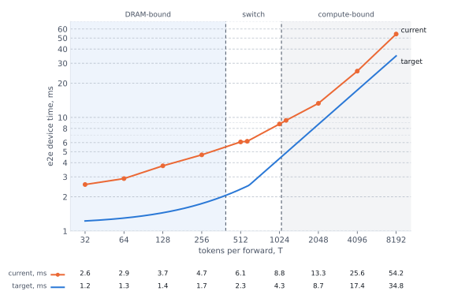

# Roofline: nomic-embed-text-v2-moe on one Blackhole chip

One p300c chip, the code of #59455 (small-input optimizations), against its target at 70% compute
utilization (60% for SDPA) and 60% DRAM bandwidth.

| symbol | meaning |
|---|---|
| B | sequences per forward (batch size) |
| S | tokens per sequence |
| T | total token count, B x S; 8x512 is B = 8, S = 512, T = 4096 |
| H | hidden size, 768 |
| A | attention heads, 12 |
| F | FFN and expert intermediate size, 3072 |
| E | experts per MoE layer, 8; the router picks 2 per token (top-2), the code runs all 8 |

## Target and current across T

## Layers and e2e
**Utilization:** ideal time / time taken. Compute is FPU + SFPU work (overlapped for fc1 and w1,
  counter-measured for ops without FLOPs), DRAM the bytes the code moves at 512 GB/s.
### 1x128: DRAM-bound

Bound by DRAM, reading the weights. Target: 60% DRAM bandwidth
| 1x128 | compute | DRAM | bound | target, ms | current, ms |
|---|---|---|---|---|---|
| Dense layer | 8% | 20% | DRAM | 0.05 | 0.14 |
| MoE layer | 15% | 28% | DRAM | 0.19 | 0.33 |
| **e2e** | 13% | 25% | DRAM | 1.44 | 2.85 |

### 2x288: the switch

Some parts compute, others DRAM bound

| 2x288 | compute | DRAM | bound | target, ms | current, ms |
|---|---|---|---|---|---|
| Dense layer | 24% | 18% | compute | 0.08 | 0.22 |
| MoE layer | 31% | 29% | DRAM | 0.34 | 0.71 |
| **e2e** | 30% | 26% | DRAM | 2.45 | 5.62 |

### 8x256: compute-bound

Bound by compute. Target: 70% compute utilization (60% for SDPA)
| 8x256 | compute | DRAM | bound | target, ms | current, ms |
|---|---|---|---|---|---|
| Dense layer | 39% | 13% | compute | 0.27 | 0.49 |
| MoE layer | 47% | 30% | compute | 1.14 | 1.70 |
| **e2e** | 45% | 26% | compute | 8.48 | 13.14 |

## Per op

Every op as the code runs it: the ttnn call and its device time, per layer averaged over the 6 layers
of that type, with its share of the layer. Up to 320 tokens a MoE pass runs its
experts stacked (1x128): every expert's weights side by side in one matmul, the routing weights
applied before w2. Larger passes run transposed (2x288, 8x256): the tokens as columns, the routing
weights applied after w2.

### Embedding, once a forward

| op | ttnn call | 1x128 us | % of forward | 2x288 us | % of forward | 8x256 us | % of forward |
|---|---|---|---|---|---|---|---|
| token embedding lookup | `ttnn.embedding` | 6.2 | 0.2 | 11.6 | 0.2 | 18.4 | 0.1 |
| embedding norm | `ttnn.layer_norm` | 15.9 | 0.6 | 16.5 | 0.3 | 24.1 | 0.2 |

### Dense layer

| op | ttnn call | 1x128 us | % | 2x288 us | % | 8x256 us | % |
|---|---|---|---|---|---|---|---|
| QKV projection | `ttnn.linear`; `ttnn.experimental.minimal_matmul` above 1024 tokens | 13.3 | 9.3 | 25.1 | 11.4 | 67.4 | 13.8 |
| head split | `ttnn.experimental.nlp_create_qkv_heads` | 13.2 | 9.2 | 15.6 | 7.1 | 22.7 | 4.7 |
| rotary on q and k | `ttnn.experimental.rotary_embedding_hf` x2 | 8.3 | 5.8 | 14.4 | 6.6 | 42.2 | 8.7 |
| attention | `ttnn.transformer.scaled_dot_product_attention` | 7.3 | 5.1 | 19.6 | 8.9 | 33.0 | 6.8 |
| head concat | `ttnn.experimental.nlp_concat_heads` | 5.2 | 3.6 | 5.6 | 2.6 | 7.1 | 1.5 |
| attention output projection | `ttnn.linear`; `minimal_matmul` above 1024 tokens | 8.6 | 6.0 | 11.0 | 5.0 | 31.0 | 6.4 |
| residual add + norm1 | `ttnn.layer_norm` | 19.3 | 13.5 | 20.8 | 9.5 | 27.6 | 5.7 |
| fc1 + GELU (FFN up-projection) | `ttnn.linear` + `ttnn.gelu`; one `ttnn.matmul` with the GELU fused above 1024 tokens | 22.8 | 15.9 | 54.8 | 25.0 | 140.0 | 28.8 |
| fc2 (FFN down-projection) | `ttnn.linear`; `minimal_matmul` above 1024 tokens | 25.5 | 17.8 | 31.5 | 14.4 | 87.9 | 18.1 |
| residual add + norm2 | `ttnn.layer_norm` | 19.6 | 13.7 | 20.8 | 9.5 | 27.8 | 5.7 |
| **layer total** | | 143.0 | **100** | 219.3 | **100** | 486.7 | **100** |

### MoE layer

| op | ttnn call | 1x128 us | % | 2x288 us | % | 8x256 us | % |
|---|---|---|---|---|---|---|---|
| QKV projection | `ttnn.linear`; `ttnn.experimental.minimal_matmul` above 1024 tokens | 13.2 | 4.0 | 25.0 | 3.5 | 67.9 | 4.0 |
| head split | `ttnn.experimental.nlp_create_qkv_heads` | 13.2 | 4.0 | 15.4 | 2.2 | 22.6 | 1.3 |
| rotary on q and k | `ttnn.experimental.rotary_embedding_hf` x2 | 8.8 | 2.7 | 14.5 | 2.0 | 42.4 | 2.5 |
| attention | `ttnn.transformer.scaled_dot_product_attention` | 7.3 | 2.2 | 19.3 | 2.7 | 32.9 | 1.9 |
| head concat | `ttnn.experimental.nlp_concat_heads` | 5.2 | 1.6 | 5.8 | 0.8 | 7.2 | 0.4 |
| attention output projection | `ttnn.linear`; `minimal_matmul` above 1024 tokens | 8.6 | 2.6 | 11.1 | 1.6 | 30.8 | 1.8 |
| residual add + norm1 | `ttnn.layer_norm` | 19.3 | 5.9 | 21.0 | 2.9 | 27.5 | 1.6 |
| router scores | `ttnn.linear` + `ttnn.add` | 9.0 | 2.8 | 14.3 | 2.0 | 24.4 | 1.4 |
| router softmax + top-2 | `ttnn.softmax` + `ttnn.topk` | 21.9 | 6.7 | 22.3 | 3.1 | 23.3 | 1.4 |
| routing weights from the top-2 | `ttnn.slice`, `ttnn.typecast`, `ttnn.matmul`, `ttnn.eq`, `ttnn.matmul`, `ttnn.multiply` | 11.5 | 3.5 | 12.8 | 1.8 | 15.8 | 0.9 |
| x transposed (transposed pass) | `ttnn.transpose` | - | - | 5.4 | 0.8 | 16.4 | 1.0 |
| expert w1 + GELU, all 8 experts | `ttnn.matmul`, GELU fused | 101.0 | 30.8 | 315.6 | 44.3 | 838.5 | 49.5 |
| apply the routing weights | stacked: `ttnn.matmul`, `ttnn.multiply_`, `ttnn.reshard`; transposed: `ttnn.permute`, `ttnn.typecast`, `ttnn.multiply` | 18.4 | 5.6 | 37.1 | 5.2 | 113.1 | 6.7 |
| expert w2 | `ttnn.linear` with the bias, stacked; `ttnn.matmul` transposed | 71.9 | 21.9 | 140.6 | 19.7 | 316.4 | 18.7 |
| sum over experts + bias (transposed pass) | `ttnn.experimental.fast_reduce_nc`, `ttnn.transpose`, `ttnn.add` | - | - | 31.8 | 4.5 | 83.8 | 4.9 |
| residual add + norm2 | `ttnn.layer_norm` | 19.0 | 5.8 | 21.3 | 3.0 | 32.6 | 1.9 |
| **layer total** | | 328.4 | **100** | 713.1 | **100** | 1,695.6 | **100** |
