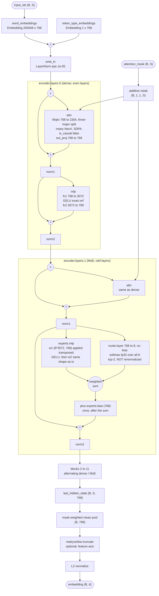

# Reference Model Analysis

Step 1 of the porting workflow: operators, shapes, parameters, module hierarchy and the
model graph. Architecture facts and the TTNN operator mapping live in
[`ARCHITECTURE.md`](ARCHITECTURE.md); this file is the mechanical inventory the port is
built against.

Generated by `reference/analysis.py`. Regenerate with:

```bash
python -m models.experimental.nomic_embed_text_v2_moe.reference.analysis
```

Sample input: `input_ids [2, 16]` with ragged padding [0, 5], synthetic weights at the real dimensions.

## 1. Model graph

Module-level, not autograd-level: `make_dot` on 475M parameters yields thousands of
unreadable nodes. `reference/analysis.py --dot out.dot` emits the same graph in DOT for
rendering to PDF or PNG with `dot -Tpdf`.



## 2. Module hierarchy

Encoder layers 2 to 11 repeat the layer 0 (dense) and layer 1
(MoE) pattern and are elided.

```
embeddings: NomicBertEmbeddings
  word_embeddings: Embedding
  token_type_embeddings: Embedding
emb_ln: LayerNorm
encoder: NomicBertEncoder
  layers: ModuleList
    0: NomicBertBlock
      attn: NomicBertAttention
        Wqkv: Linear
        out_proj: Linear
        rotary_emb: NomicBertRotaryEmbedding
      mlp: NomicBertMLP
        fc1: Linear
        activation: GELU
        fc2: Linear
      norm1: LayerNorm
      norm2: LayerNorm
    1: NomicBertBlock
      attn: NomicBertAttention
        Wqkv: Linear
        out_proj: Linear
        rotary_emb: NomicBertRotaryEmbedding
      mlp: NomicMoELayer
        router: NomicRouter
          layer: Linear
        experts: NomicExperts
          mlp: NomicExpertMLP
            activation_fn: GELU
      norm1: LayerNorm
      norm2: LayerNorm
```

Module types in use:

- `Embedding`
- `GELU`
- `LayerNorm`
- `Linear`
- `ModuleList`
- `NomicBertAttention`
- `NomicBertBlock`
- `NomicBertEmbeddings`
- `NomicBertEncoder`
- `NomicBertMLP`
- `NomicBertModel`
- `NomicBertRotaryEmbedding`
- `NomicExpertMLP`
- `NomicExperts`
- `NomicMoELayer`
- `NomicRouter`

## 3. Operator inventory

36 distinct aten operators, captured with `TorchDispatchMode` on a real
forward pass. Counts are for the sample input above; shapes are one representative call.

`torch.fx.symbolic_trace` cannot produce this: it raises
`TypeError: torch.finfo() requires a floating point input type` on the Proxy dtype in
`build_extended_attention_mask`, and the MoE expert loop branches on tensor values.

| operator | calls | input shapes (representative) | output shape |
|---|---|---|---|
| `aten.view.default` | 196 | `[2, 16, 768]` | `[32, 768]` |
| `aten.select.int` | 190 | `[2, 16, 3, 12, 64]` | `[2, 16, 12, 64]` |
| `aten.mul.Tensor` | 96 | `[2, 1, 1, 16]` | `[2, 1, 1, 16]` |
| `aten.slice.Tensor` | 96 | `[16, 32]` | `[16, 32]` |
| `aten.unsqueeze.default` | 91 | `[2, 16]` | `[2, 1, 16]` |
| `aten.t.default` | 77 | `[2304, 768]` | `[768, 2304]` |
| `aten.mm.default` | 76 | `[32, 768], [768, 8]` | `[32, 8]` |
| `aten.cat.default` | 72 | `-` | `[16, 64]` |
| `aten.index.Tensor` | 70 | `[32, 768]` | `[16, 768]` |
| `aten.add.Tensor` | 55 | `[2, 16, 768], [16, 768]` | `[2, 16, 768]` |
| `aten.permute.default` | 54 | `[2, 16, 12, 64]` | `[2, 12, 16, 64]` |
| `aten.alias.default` | 48 | `[2, 16, 12, 64]` | `[2, 16, 12, 64]` |
| `aten.nonzero.default` | 48 | `[2, 32]` | `[16, 2]` |
| `aten.unbind.int` | 48 | `[16, 2]` | `[16]` |
| `aten.gelu.default` | 41 | `[2, 16, 3072]` | `[2, 16, 3072]` |
| `aten.addmm.default` | 36 | `[2304], [32, 768], [768, 2304]` | `[32, 2304]` |
| `aten.index_add_.default` | 35 | `[32, 768], [16], [16, 768]` | `[32, 768]` |
| `aten.native_layer_norm.default` | 25 | `[2, 16, 768], [768], [768]` | `[2, 16, 768]` |
| `aten.neg.default` | 24 | `[2, 16, 12, 32]` | `[2, 16, 12, 32]` |
| `aten.split.Tensor` | 24 | `[2, 16, 12, 64]` | `[2, 16, 12, 32]` |
| `aten._local_scalar_dense.default` | 12 | `[]` | `-` |
| `aten._scaled_dot_product_flash_attention_for_cpu.default` | 12 | `[2, 12, 16, 64], [2, 12, 16, 64], [2, 12, 16, 64]` | `[2, 12, 16, 64]` |
| `aten.arange.default` | 12 | `-` | `[16]` |
| `aten.cos.default` | 12 | `[16, 32]` | `[16, 32]` |
| `aten.sin.default` | 12 | `[16, 32]` | `[16, 32]` |
| `aten.stack.default` | 12 | `-` | `[2, 16, 3, 12, 64]` |
| `aten.zeros.default` | 7 | `-` | `[16]` |
| `aten._softmax.default` | 6 | `[32, 8]` | `[32, 8]` |
| `aten.max.default` | 6 | `[32, 2]` | `[]` |
| `aten.min.default` | 6 | `[32, 2]` | `[]` |
| `aten.scatter_.value` | 6 | `[32, 2, 8], [32, 2, 1]` | `[32, 2, 8]` |
| `aten.topk.default` | 6 | `[32, 8]` | `[32, 2]` |
| `aten.zeros_like.default` | 6 | `[32, 768]` | `[32, 768]` |
| `aten.embedding.default` | 2 | `[250048, 768], [2, 16]` | `[2, 16, 768]` |
| `aten._to_copy.default` | 1 | `[2, 1, 1, 16]` | `[2, 1, 1, 16]` |
| `aten.rsub.Scalar` | 1 | `[2, 1, 1, 16]` | `[2, 1, 1, 16]` |

### Operators the dense MoE formulation removes

`aten.nonzero`, `aten.index`, `aten.index_add_` and `aten._local_scalar_dense` come from
the upstream ragged expert loop, which gathers each expert's tokens by value. They are
data-dependent, which is why this model is not `torch.fx`-traceable and why the loop has
no direct device equivalent. `NomicExperts.dense_forward` replaces all of them with two
broadcast-batch matmuls, a multiply and a reduce, and is asserted equal to the loop in
`tests/pcc/test_reference_modules.py`. That is the formulation the TTNN port uses.

## 4. Per-module tensor shapes

One row per module invocation, in execution order, for the sample input. Sequence-length
axes scale with S; here S = 16. Encoder layers 2 to 11 repeat the layer 0 and layer 1 rows verbatim and are
elided.

| module | type | input shapes | output shape |
|---|---|---|---|
| `embeddings.word_embeddings` | Embedding | `[2, 16]` | `[2, 16, 768]` |
| `embeddings.token_type_embeddings` | Embedding | `[16]` | `[16, 768]` |
| `embeddings` | NomicBertEmbeddings | `[2, 16]` | `[2, 16, 768]` |
| `emb_ln` | LayerNorm | `[2, 16, 768]` | `[2, 16, 768]` |
| `encoder.layers.0.attn.Wqkv` | Linear | `[2, 16, 768]` | `[2, 16, 2304]` |
| `encoder.layers.0.attn.rotary_emb` | NomicBertRotaryEmbedding | `[2, 16, 3, 12, 64]` | `[2, 16, 3, 12, 64]` |
| `encoder.layers.0.attn.out_proj` | Linear | `[2, 16, 768]` | `[2, 16, 768]` |
| `encoder.layers.0.attn` | NomicBertAttention | `[2, 16, 768]` | `[2, 16, 768]` |
| `encoder.layers.0.norm1` | LayerNorm | `[2, 16, 768]` | `[2, 16, 768]` |
| `encoder.layers.0.mlp.fc1` | Linear | `[2, 16, 768]` | `[2, 16, 3072]` |
| `encoder.layers.0.mlp.activation` | GELU | `[2, 16, 3072]` | `[2, 16, 3072]` |
| `encoder.layers.0.mlp.fc2` | Linear | `[2, 16, 3072]` | `[2, 16, 768]` |
| `encoder.layers.0.mlp` | NomicBertMLP | `[2, 16, 768]` | `[2, 16, 768]` |
| `encoder.layers.0.norm2` | LayerNorm | `[2, 16, 768]` | `[2, 16, 768]` |
| `encoder.layers.0` | NomicBertBlock | `[2, 16, 768]` | `[2, 16, 768]` |
| `encoder.layers.1.attn.Wqkv` | Linear | `[2, 16, 768]` | `[2, 16, 2304]` |
| `encoder.layers.1.attn.rotary_emb` | NomicBertRotaryEmbedding | `[2, 16, 3, 12, 64]` | `[2, 16, 3, 12, 64]` |
| `encoder.layers.1.attn.out_proj` | Linear | `[2, 16, 768]` | `[2, 16, 768]` |
| `encoder.layers.1.attn` | NomicBertAttention | `[2, 16, 768]` | `[2, 16, 768]` |
| `encoder.layers.1.norm1` | LayerNorm | `[2, 16, 768]` | `[2, 16, 768]` |
| `encoder.layers.1.mlp.router.layer` | Linear | `[32, 768]` | `[32, 8]` |
| `encoder.layers.1.mlp.router` | NomicRouter | `[2, 16, 768]` | `[32, 8]` |
| `encoder.layers.1.mlp.experts.mlp.activation_fn` | GELU | `[16, 3072]` | `[16, 3072]` |
| `encoder.layers.1.mlp.experts.mlp` | NomicExpertMLP | `[16, 768]` | `[16, 768]` |
| `encoder.layers.1.mlp.experts.mlp.activation_fn` | GELU | `[1, 3072]` | `[1, 3072]` |
| `encoder.layers.1.mlp.experts.mlp` | NomicExpertMLP | `[1, 768]` | `[1, 768]` |
| `encoder.layers.1.mlp.experts.mlp.activation_fn` | GELU | `[6, 3072]` | `[6, 3072]` |
| `encoder.layers.1.mlp.experts.mlp` | NomicExpertMLP | `[6, 768]` | `[6, 768]` |
| `encoder.layers.1.mlp.experts.mlp.activation_fn` | GELU | `[27, 3072]` | `[27, 3072]` |
| `encoder.layers.1.mlp.experts.mlp` | NomicExpertMLP | `[27, 768]` | `[27, 768]` |
| `encoder.layers.1.mlp.experts.mlp.activation_fn` | GELU | `[4, 3072]` | `[4, 3072]` |
| `encoder.layers.1.mlp.experts.mlp` | NomicExpertMLP | `[4, 768]` | `[4, 768]` |
| `encoder.layers.1.mlp.experts.mlp.activation_fn` | GELU | `[4, 3072]` | `[4, 3072]` |
| `encoder.layers.1.mlp.experts.mlp` | NomicExpertMLP | `[4, 768]` | `[4, 768]` |
| `encoder.layers.1.mlp.experts.mlp.activation_fn` | GELU | `[6, 3072]` | `[6, 3072]` |
| `encoder.layers.1.mlp.experts.mlp` | NomicExpertMLP | `[6, 768]` | `[6, 768]` |
| `encoder.layers.1.mlp.experts` | NomicExperts | `[2, 16, 768], [32, 2], [32, 2]` | `[2, 16, 768]` |
| `encoder.layers.1.mlp` | NomicMoELayer | `[2, 16, 768]` | `[2, 16, 768]` |
| `encoder.layers.1.norm2` | LayerNorm | `[2, 16, 768]` | `[2, 16, 768]` |
| `encoder.layers.1` | NomicBertBlock | `[2, 16, 768]` | `[2, 16, 768]` |
| `encoder` | NomicBertEncoder | `[2, 16, 768]` | `[2, 16, 768]` |

## 5. Parameters and memory

| group | parameters | fp32 (MB) | bf16 (MB) |
|---|---|---|---|
| `encoder.layers.* (MoE block)` | 240,726,528 | 962.9 | 481.5 |
| `embeddings.word_embeddings` | 192,036,864 | 768.1 | 384.1 |
| `encoder.layers.* (dense block)` | 42,527,232 | 170.1 | 85.1 |
| `emb_ln` | 1,536 | 0.0 | 0.0 |
| `embeddings.token_type_embeddings` | 768 | 0.0 | 0.0 |
| **total** | 475,292,928 | 1901.2 | 950.6 |

Resident weights dominate: 475,292,928 parameters, 1901 MB at fp32 and 951 MB at bf16.
Activations are small by comparison: one hidden-state tensor at the sample shape is 0.10 MB at
fp32.

The MoE layers are the exception. The dense all-experts formulation materialises `(num_experts,
tokens, ffn_hidden)` intermediates, which at B*S = 32 is 1.57 MB at bf16 and scales linearly
with token count. At the 512-token maximum sequence length it is 25 MB per MoE layer, which is
what the Phase 1 memory budget has to account for.
