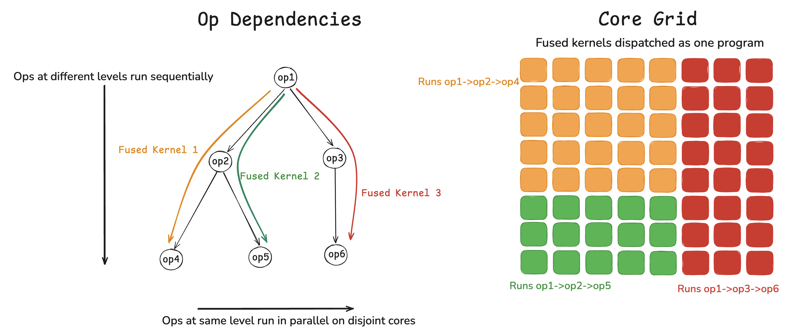

# Parallel and Sequential Fusion Architecture

## TL;DR
This document details the implementation of `Sequential` and `Parallel`, two building blocks for creating fused ops from arbitrary `ProgramDescriptor` objects. This allows for combined temporal (`Sequential`) and spatial (`Parallel`) fusion of complex dependencies from generic, reusable ops using a simple, expressive Python interface:



The above dependency graph is expressed in Python as (using concrete descriptors):

```python
import models.experimental.ops.descriptors as descriptors
from models.experimental.ops.descriptors.fusion import Sequential, Parallel

# Compute config — all fused phases must agree on fp32, approx mode, and fidelity
compute_cfg = ttnn.WormholeComputeKernelConfig(
    math_fidelity=ttnn.MathFidelity.HiFi4,
    math_approx_mode=False,
    fp32_dest_acc_en=True,
)

# Core grids — single row of 8 cores, split left/right then top/bottom
full_cores  = ttnn.CoreRangeSet({ttnn.CoreRange(ttnn.CoreCoord(0, 0), ttnn.CoreCoord(7, 0))})  # 8 cores
left_cores  = ttnn.CoreRangeSet({ttnn.CoreRange(ttnn.CoreCoord(0, 0), ttnn.CoreCoord(3, 0))})  # 4 cores (left)
right_cores = ttnn.CoreRangeSet({ttnn.CoreRange(ttnn.CoreCoord(4, 0), ttnn.CoreCoord(7, 0))})  # 4 cores (right)
left_top    = ttnn.CoreRangeSet({ttnn.CoreRange(ttnn.CoreCoord(0, 0), ttnn.CoreCoord(1, 0))})  # 2 cores (left-top)
left_bot    = ttnn.CoreRangeSet({ttnn.CoreRange(ttnn.CoreCoord(2, 0), ttnn.CoreCoord(3, 0))})  # 2 cores (left-bottom)

# Each descriptor function returns an OpDescriptor — a thin wrapper
# around ProgramDescriptor with input/output tensors.
op1 = descriptors.matmul(act, weights, core_range_set=full_cores,
                         compute_kernel_config=compute_cfg)
op2 = descriptors.slice(op1.output_tensors[0], [0, 0, 0, 0], [1, 1, H, W // 2],
                        core_range_set=left_cores)
op3 = descriptors.slice(op1.output_tensors[0], [0, 0, 0, W // 2], [1, 1, H, W],
                        core_range_set=right_cores)
op4 = descriptors.matmul(op2.output_tensors[0], proj, core_range_set=left_top,
                         compute_kernel_config=compute_cfg)
op5 = descriptors.layer_norm(op2.output_tensors[0], core_range_set=left_bot,
                             weight=ln_w, bias=ln_b, epsilon=1e-5,
                             compute_kernel_config=compute_cfg)
op6 = descriptors.rms_norm(op3.output_tensors[0], core_range_set=right_cores,
                           weight=rms_w, epsilon=1e-5,
                           compute_kernel_config=compute_cfg)

fused = Sequential(
    op1,                          # matmul on all 8 cores
    Parallel(
        Sequential(               # left half (4 cores)
            op2,                  # slice left
            Parallel(op4, op5),   # matmul (top 2) + LN (bottom 2)
        ),
        Sequential(op3, op6),     # right half: slice → RMS (4 cores)
    ),
).build()

fused.launch()
ttnn.synchronize_device(device)

# Read leaf outputs
result_op4 = ttnn.to_torch(op4.output_tensors[0])
result_op5 = ttnn.to_torch(op5.output_tensors[0])
result_op6 = ttnn.to_torch(op6.output_tensors[0])
```

The compositional framework both encourages op genericity and reuse and reduces the need to write single-use custom fused ops for cases where the performance of existing ops is satisfactory.

The temporal fusion is a strict stitching-together of the underlying kernels - there are no optimizations made to keep things in registers or L1, overlap dataflow with compute, etc. It simply constructs a composite kernel for each core type and implements the logic of each in turn with appropriate synchronization, CB reassignment, and state cleanup between ops.

The rest of this document provides implementation details for the various components of the fusion infrastructure.

## Table of Contents

- [Overview](#overview)
- [Public API](#public-api)
  - [`Sequential`](#sequential) | [`Parallel`](#parallel)
- [Glossary](#glossary)
  - [Node (`OpNode`)](#node-opnode) | [Root](#root) | [Leaf](#leaf) | [Internal Node](#internal-node) | [Segment](#segment)
- [Opt-In Requirements](#opt-in-requirements)
- [Representing Fused Op Structure](#representing-fused-op-structure)
  - [Composing with Sequential and Parallel](#composing-with-sequential-and-parallel) | [Conversion to OpNode Tree](#conversion-to-opnode-tree) | [Topology Rules](#topology-rules) | [Spatial Independence](#spatial-independence) | [Narrow→Wide Topology](#narrowwide-topology-and-no-op-phases) | [Core Groups](#core-groups) | [Fused Kernel Structure](#fused-kernel-structure)
- [Synchronization Protocol](#synchronization-protocol)
  - [Key Concepts](#key-concepts) | [MultiBarrierSpec](#multibarrierspec) | [Segment Cache](#segment-cache) | [Two-Level Barrier](#two-level-barrier) | [Cross-Core NOC Barrier](#cross-core-noc-barrier)
- [CB Pool Allocator](#cb-pool-allocator)
  - [The Problem](#the-problem) | [Compatibility Key (`CBPoolKey`)](#compatibility-key-cbpoolkey) | [Phantom CBs](#phantom-cbs) | [Allocation Algorithm](#allocation-algorithm) | [Alias Groups](#alias-groups) | [GlobalCB Remote Indices](#globalcb-remote-indices) | [Global Pool + Projection](#global-pool--projection-cross-group-consistency) | [Merged CB Descriptors](#merged-cb-descriptors) | [CB Address Rebinding](#cb-address-rebinding) | [CB State Save/Restore](#cb-state-saverestore)
- [Circular Buffer Management](#circular-buffer-management)
  - [CB State Reset Between Phases](#cb-state-reset-between-phases) | [CB Rebinding Between Phases](#cb-rebinding-between-phases)
- [Code Generation](#code-generation)
  - [Namespace Isolation](#approach-namespace-isolation) | [Source Parsing](#source-parsing-cpp_parser-module) | [Preprocessor Define Handling](#preprocessor-define-handling) | [CT Arg Redirection](#compile-time-arg-redirection) | [RT Arg Redirection](#runtime-arg-redirection) | [Generated File Structure](#generated-file-structure) | [Barrier Namespace](#barrier-namespace-namespace-barrier) | [Pipeline Summary](#code-generation-pipeline-summary)
- [Argument Concatenation](#argument-concatenation)
  - [Runtime Args](#runtime-args) | [Compile-Time Args](#compile-time-args)
- [Build Cache](#build-cache)
  - [Cache Key](#cache-key) | [Cache Hit](#cache-hit-fast-path) | [Cache Miss](#cache-miss-full-build) | [What Gets Cached](#what-gets-cached) | [Cache Invalidation](#cache-invalidation)
- [Constraints and Limitations](#constraints-and-limitations)
- [File Map](#file-map)


Sequential fusion combines multiple operations into a single fused kernel that
runs as one program dispatch. Instead of launching each op as a separate
host-to-device round-trip, all ops execute back-to-back within a single
long-running kernel on each core. Each phase runs independently — it reads its
own input tensors and writes its own output tensors, with CB state fully reset
between phases.

The fusion tree is a standard tree of `OpNode` objects. Each node holds one
operation (`OpDescriptor`). Parent-to-child edges encode sequential ordering
(parent runs before child). Sibling nodes run in parallel on disjoint core
subsets. A linear chain is a tree with branching factor 1.


## Public API

### `Sequential`

Chains ops in temporal order. Items can be `OpDescriptor`, `Sequential`, or
`Parallel` objects. Nested `Sequential` items are flattened.

`build()` returns a `FusedOp`. Call `fused.launch()` to dispatch. Device is
auto-extracted from input tensors (or pass explicitly to `build(device=...)`).

```python
# Linear chain
fused = Sequential(op0, op1, op2).build()
fused.launch()

# Incremental construction
s = Sequential(op0)
s.add(op1).add(op2)
fused = s.build()

# Composition via nesting (flattened automatically)
stem = Sequential(op0, op1)
full = Sequential(stem, op2).build()  # equivalent to op0 -> op1 -> op2
```

### `Parallel`

Groups items that run concurrently on disjoint core subsets. Requires at least
2 items. Items can be `OpDescriptor`, `Sequential`, or `Parallel`.

```python
# Branching tree: stem runs first, then two branches in parallel
fused = Sequential(stem_op, Parallel(branch_a, branch_b)).build()
fused.launch()

# Standalone: independent ops merged into one dispatch
fused = Parallel(op_a, op_b).build()
fused.launch()

# Nested: Parallel items can contain Sequential chains with further splits
fused = Sequential(
    stem,
    Parallel(
        Sequential(op_a, Parallel(op_a1, op_a2)),
        op_b,
    ),
).build()
```

Items after a `Parallel` in a `Sequential` are not allowed — the tree
diverges and cannot rejoin. Place trailing items inside each branch instead.


## Glossary

### Node (`OpNode`)

An `OpNode` holds a single `OpDescriptor` and an optional list of children.
The node's core range is derived from its op's `ProgramDescriptor` kernels
(no separate `core_range` field). Every node in the tree -- root, internal,
and leaf -- has exactly one op.

### Root

The root is the topmost node of the tree. It is a regular `OpNode` like any
other -- no special treatment. The root's op runs first, before any children.

### Leaf

A leaf is a terminal node with no children. Leaves are the endpoints of the
tree. Each root-to-leaf path produces one fused kernel binary.

### Internal Node

An internal node has one or more children. Its op runs before its children's
ops. When an internal node has multiple children, those children run in
parallel on disjoint core subsets.

### Segment

A segment is a contiguous portion of a root-to-leaf path where the barrier
scope (set of participating cores) remains constant. Consecutive nodes with
the same core range are grouped into one segment. Each segment has its own
`arrive`/`release` `GlobalSemaphore` pair for cross-core synchronization.

For example, in a tree where the root and one intermediate node share the same
core range (0-7), but the leaf uses cores 0-3, the path has two segments:
segment 0 covers cores 0-7 (root + intermediate phases), segment 1 covers
cores 0-3 (leaf phase).

## Opt-In Requirements

An op must satisfy the following requirements before it can participate in
kernel fusion.  Each requirement exists to protect a specific invariant in
the fusion pipeline — violating any of them will produce silent
mis-compilation or a device hang.

1. **Use `get_compile_time_arg_val()` for all compile-time argument access.**
   Kernel sources must never index the raw `kernel_compile_time_args[]` array
   directly.  The fusion system offsets literal indices in
   `get_compile_time_arg_val(N)` calls via regex so that each phase reads
   from its own slice of the concatenated CT arg array.  Direct array access
   (e.g., `kernel_compile_time_args[13]`) bypasses this offset and reads the
   wrong phase's values.  Prefer named compile-time args
   (`get_named_compile_time_arg_val("name")`) where possible — named args
   are handled via a phase-prefix mechanism that is immune to index
   arithmetic issues.

2. **Use named compile-time args (`cb_` prefix) for all CB indices.**
   Every circular-buffer index must be passed as a named compile-time arg
   whose name starts with `cb_` (e.g., `"cb_in"`, `"cb_ex_partial"`).  The
   CB pool allocator remaps hardware CB slots across phases; the `cb_`
   prefix tells the allocator which named args to update.  Hard-coded CB
   indices (e.g., `constexpr uint32_t cb = tt::CBIndex::c_0`) or positional
   CT args for CB indices will read stale slot numbers after remapping.

3. **Use the standard RT arg API — `get_arg_val()` / `get_arg_addr()` —
   for all runtime argument access.**  The fusion system concatenates
   per-phase runtime args into a single flat array and emits `#define`
   redirects (`get_arg_val` → `phase_N_get_arg_val`, `get_arg_addr` →
   `phase_N_get_arg_addr`) that add the correct per-phase offset.  Any
   code that bypasses these functions (e.g., direct `rta_l1_base[]` access)
   will read the wrong phase's arguments.  The same applies to common
   runtime args (`get_common_arg_val` / `get_common_arg_addr`).

4. **All phases must use the same compute config.**
   `fp32_dest_acc_en`, `math_approx_mode`, `math_fidelity`,
   `dst_full_sync_en`, and `bfp8_pack_precise` are compile-time constants
   generated once per kernel binary — they cannot change between phases.
   The builder validates that all five fields match across phases and
   raises an error on any mismatch.  Pass an explicit
   compute config to every op descriptor to ensure
   consistency (defaults differ by op type).

5. **Each op's core range must be expressible as a `CoreRangeSet`.**
   Non-contiguous grids (e.g., rows 0-1 + row 3 + row 5, skipping rows
   2 and 4) are supported — topology validation, barrier release, and CB
   allocation all operate on coordinate sets, not rectangular bounding
   boxes.  The barrier coordinator unicasts the release signal to each
   core individually, so gaps in the grid are handled naturally.


## Representing Fused Op Structure

The fusion system has two layers: a user-facing composition API (`Sequential`,
`Parallel`) and an internal graph representation (`OpNode` tree). Users compose
operations; `_resolve()` converts the composition into an `OpNode` tree that
the builder processes. This section covers how that conversion works and how
the builder partitions the tree into independently-built kernel binaries.

### Composing with Sequential and Parallel

`Sequential` chains ops in temporal order — each op runs after the previous one
finishes. `Parallel` groups ops that run concurrently on disjoint cores. They
nest freely to express any tree topology:

```python
# Linear chain: LN → GeLU → RMS  (all on same 4×4 grid)
fused = Sequential(ln, gelu, rms).build()

# Branching: LN on 4×4, then split into two 4×2 branches
fused = Sequential(ln, Parallel(gelu_a, gelu_b)).build()

# Deep branching: LN → [GeLU_A → RMS_A | GeLU_B → RMS_B]
fused = Sequential(
    ln,
    Parallel(
        Sequential(gelu_a, rms_a),
        Sequential(gelu_b, rms_b),
    ),
).build()
```

`Sequential` auto-flattens nested `Sequential` items, so
`Sequential(Sequential(a, b), c)` is equivalent to `Sequential(a, b, c)`.

### Conversion to OpNode Tree

`_resolve()` (`fusion.py`) recursively converts composition objects into an
`OpNode` tree (see Glossary for `OpNode` definition):

- `OpDescriptor` → `OpNode(op)` (single node)
- `Sequential(a, b, c)` → chain:
  `OpNode(a, children=[OpNode(b, children=[OpNode(c)])])`
- `Parallel(x, y)` → flat list `[OpNode(x), OpNode(y)]`, attached as sibling
  children of the preceding node in the enclosing `Sequential`

The deep branching example above produces:

```
OpNode(ln)
├── OpNode(gelu_a)
│   └── OpNode(rms_a)
└── OpNode(gelu_b)
    └── OpNode(rms_b)
```

`Sequential._build_internal()` calls `_resolve()`, then passes the root to
`OpGraphBuilder`, which handles all topologies uniformly — a linear chain is
just a tree with branching factor 1.

### Topology Rules

- **No items after a `Parallel`**: Once a `Sequential` diverges via
  `Parallel`, no further items can follow in that `Sequential`.
  `_resolve()` enforces this — items after a `Parallel` raise an error
  at build time:

  ```python
  # ERROR: RMS follows a Parallel
  Sequential(LN, Parallel(GeLU_A, GeLU_B), RMS)
  # OK: place the trailing op inside each branch instead
  Sequential(LN, Parallel(Sequential(GeLU_A, RMS), Sequential(GeLU_B, RMS)))
  ```

  This is an implementation constraint, not a fundamental one.  Since
  each phase independently reads its own input tensors (no inter-phase
  dataflow), reconvergence is conceptually possible — it would just
  require changing the graph from a tree to a DAG and updating core
  group computation and barrier generation to handle it.  The current
  `_resolve()` builds a tree, so a post-`Parallel` node would need two
  parents, which trees don't support.
- **Sibling disjointness**: Children of the same parent must have
  non-overlapping core ranges. Each core runs exactly one kernel binary.
- **Widening and narrowing allowed**: A child's core range can be a subset
  (wide→narrow), superset (narrow→wide), or equal to its parent's range.
  See [Narrow→Wide Topology](#narrowwide-topology-and-no-op-phases) for
  how the infrastructure handles widening.
- **Partial coverage allowed**: Children don't need to fully tile their parent.
  Uncovered cores don't participate in child phases.

Topology is validated by `_validate_topology()` before any device allocation.
The only structural check is sibling disjointness.

### Spatial Independence

Each node's core range comes from its op's `ProgramDescriptor` kernels. The
topology rules above require siblings to occupy disjoint core ranges. This
spatial disjointness is what makes parallel execution safe — sibling branches
never share a core.

#### What "disjoint" means

Topology validation enforces **kernel-disjointness**: sibling branches cannot
run kernels on the same core.  Each core runs exactly one kernel binary, and
the barrier coordinator must know which phase program a core is executing.
This is what `_validate_topology()` checks — it compares coordinate sets
derived from kernel core ranges.

This does **not** cover L1 data access.  Some ops perform NOC reads/writes to
L1 on cores outside their kernel range.  For example, DRAM-sharded matmul
places kernels on scattered cores adjacent to DRAM banks but reads activation
data from other worker cores' L1.  If a sibling branch's kernels run on those
data-source cores, the NOC traffic could collide with the sibling's kernel
execution.  This is the user's responsibility to avoid when constructing the
topology — the infrastructure does not detect or prevent it.

**DRAM-interleaved access is not a concern.**  DRAM banks are shared, stateless
global memory.  Any number of ops can read the same DRAM tensor concurrently
without conflict.  L1-access conflicts only arise with ops that do cross-core
L1 reads/writes (e.g., DRAM-sharded matmul, multicast senders).

#### Non-contiguous core grids

The topology validation, barrier release, and CB allocation are all based on
coordinate sets (`Set[Tuple[int, int]]`), not rectangular bounding boxes.  A
`CoreRangeSet` with gaps (e.g., rows 0-1 + row 3 + row 5, skipping rows 2 and 4)
works identically to a contiguous grid.  The barrier coordinator unicasts the
release signal to each core individually, skipping gaps.

#### Narrow→Wide Topology and No-Op Phases

A child node can run on **more** cores than its parent. For example, an
interleaved LayerNorm on 3 cores can feed into a matmul on 32 cores. This is
called **narrow→wide** topology.

The challenge: every core in a fused kernel must execute the same number of
phases so that barrier counts stay aligned. If the parent runs on 3 cores and
the child runs on 32, the 29 extra cores have no work during the parent's
phase — but they still need a phase entry so their barrier counter increments
in lockstep with the 3 cores that do real work.

**`_NOOP_OP`** (`common.py`) solves this. It is a singleton `OpDescriptor`
with an empty `ProgramDescriptor` (no kernels, no CBs, no semaphores):

```python
class _NoOpProgramDescriptor:
    kernels = []
    cbs = []
    semaphores = []

_NOOP_OP = OpDescriptor(
    descriptor=_NoOpProgramDescriptor(),
    input_tensors=[],
    output_tensors=[],
    name="noop",
)
```

During the tree walk in `_compute_core_groups()`, each node's op is recorded
for the cores in its kernel range. For cores in the node's
`_all_descendant_coords()` but **not** in its kernel range, a `_NOOP_OP` entry
is recorded instead:

```python
def _walk(node):
    desc_coords = self._all_descendant_coords(node)  # ALL descendant cores (not just leaves)
    scope = _coords_to_core_range_set(desc_coords)   # barrier scope for this transition
    node_coords = _core_range_set_to_coords(...)      # this node's kernel cores

    for coord in node_coords:
        per_core[coord].append((node.op, scope))           # real phase

    for coord in desc_coords - node_coords:
        per_core[coord].append((_NOOP_OP, scope))          # no-op phase
```

**Why all descendants, not just leaves?** The barrier scope after a node must
cover every core that **continues past that node** — i.e., every core in any
descendant's kernel range. For shrinking core ranges (e.g., matmul(16) →
slice(8) → rms(4)), the leaf-only union would be 4 cores, but 10 cores
actually continue past the matmul (8 slice cores + 2 noop-padded rms-only
cores that aren't in slice's range). The barrier must cover all 10 so the
coordinator waits for all of them before releasing.

**Early-exit cores.** Cores in a node's range but not in any descendant's
range have only one phase and no barrier. They run their op and exit. This is
safe because: (a) the per-core dispatcher ensures local phase ordering, and
(b) there is no cross-core data dependency from exiting cores to continuing
cores in later phases.

**Core ranges come from factories, not users.** `_get_node_core_range()`
reads `kernel.core_ranges` from the `ProgramDescriptor` — these are the
**actual** ranges the op factory chose, not the user's `core_range_set`.
Factories can (and do) pick fewer cores than requested. The barrier scope
is computed from these factory-chosen ranges.

**Example**: Parent on cores 0-1, child on cores 0-3:

| Core | Phase 0 | Phase 1 |
|------|---------|---------|
| 0 | Parent (real) | Child (real) |
| 1 | Parent (real) | Child (real) |
| 2 | `_NOOP_OP` | Child (real) |
| 3 | `_NOOP_OP` | Child (real) |

Cores 0-1 form one group (phase sequence = `[Parent, Child]`). Cores 2-3 form
another group (phase sequence = `[_NOOP_OP, Child]`). Both groups have 2 phases
and 1 barrier transition, so barrier counts align.

**How no-op phases propagate through the stack:**

- **CB pool**: No-op phases use `NOOP_PHASE_INDEX = None` in `phase_op_indices`.
  The global pool skips them during slot computation. The projected pool inserts
  empty remaps `{}` at no-op positions so the builder's positional indexing works.
- **PhaseInfo**: No-op phases get `PhaseInfo(cb_info={})` — no CBs to allocate,
  reset, or rebind.
- **Source gen**: Phases without a kernel for a given RISC get an empty namespace:
  `namespace phase_N { void run() {} }`. The dispatcher calls `phase_N::run()`
  unconditionally, which compiles to nothing.
- **Barrier**: No-op phases produce empty CB reset arrays
  (`std::array<uint32_t, 0>`). `reset_cbs<0>(...)` is a valid no-op. The barrier
  `sync()` call still executes normally, incrementing counters to stay aligned.

**Cycle cost tradeoff.**  No-op cores still participate in the barrier protocol:
they execute `local::sync()` (3-RISC semaphore signaling) and spin on the
release semaphore.  This burns some cycles on cores with no real work, but
the cost is limited to a tight `while (*release < N) {}` poll.

This is an inherent tradeoff of single-dispatch fusion on hardware without
interrupts.  The extra cores must learn when the narrow phase completes before
starting their real phase.  Without an interrupt or device-side dependent
launch mechanism, polling a memory location (spinning on a semaphore) is the
only option.  Not dispatching a kernel to those cores would eliminate the
spinning, but would require a separate host-to-device dispatch for the wide
phase — reintroducing the round-trip latency that fusion exists to eliminate.

**Asymmetric barriers** reduce the overhead: no-op cores skip the arrive step
(`noc_semaphore_inc`) and only spinwait on the release semaphore.  This
removes the arrive serialization that scales linearly with extra cores (each
arrive is an atomic NOC write serialized at core 0).  The barrier segment's
`sync()` is templated on `SyncMode`:
- `SyncMode::Full` — arrive + wait + release (cores that completed real work).
- `SyncMode::WaitOnly` — skip arrive, only spinwait on release (no-op cores).

The arrive threshold uses `num_arrive_cores` (only cores with real work), while
the release unicast goes to all `num_release_cores`.  Each barrier segment has
both counts as named compile-time args (`seg{N}_num_arrive_cores`,
`seg{N}_num_release_cores`).

### Core Groups

`_compute_core_groups()` walks the tree and records each core's **phase
sequence** — the root-to-leaf ops that core executes. Cores with identical
phase sequences are grouped into a `CoreGroup`. Each group becomes one fused
kernel binary.

**Kernel variant keying.**  Some ops produce multiple kernels for the same
RISC type on disjoint core subsets — e.g., a block-sharded LayerNorm has a
multicast *sender* on row 0 and a *receiver* on row 1, both on riscv_0.
`_kernel_variant_key(node, coord)` returns the tuple of kernel indices whose
core ranges contain `coord`, distinguishing sender cores from receiver cores.
The grouping key includes both the op identity *and* its variant key, so cores
seeing different kernel subsets never land in the same group.

In the deep branching example (assuming LN runs on a 4×4 grid, each branch
on a 4×2 half):

| Group | Cores | Phase Sequence |
|-------|-------|---------------|
| A | left 4×2 (8 cores) | `[LN, GeLU_A, RMS_A]` |
| B | right 4×2 (8 cores) | `[LN, GeLU_B, RMS_B]` |

Each group also records its **barrier scopes** — the `_all_descendant_coords()`
at each phase transition.  This function unions the core coordinates of **all**
descendant nodes (not just leaves).  The result determines which cores must
synchronize at that transition — every core that continues past the current
node participates.  For Group A:

- Transition 0 (after LN): `_all_descendant_coords(LN)` = all 16 cores —
  both branches must finish LN before either can proceed.
- Transition 1 (after GeLU_A): `_all_descendant_coords(GeLU_A)` = left 8 cores —
  only the left branch participates.

For shrinking core ranges (e.g., stem(16) → mid(8) → leaf(4)), the barrier
scope after the stem is 8+4=10 unique cores (all descendants), not just the
4 leaf cores.  This ensures the barrier coordinator waits for all 10 cores
that continue, and unicasts the release signal to all of them.

These barrier scopes feed directly into the synchronization protocol's segment
model (see next section).

### Fused Kernel Structure

Each op's kernels are originally created with whatever core range the op
needs — LN's reader might cover a 4×4 grid, GeLU_A's reader might cover
the left 4×2.  We call this the kernel's **original core range**.  When
building a group's fused binary, the builder narrows all kernels to the
group's core range, since that binary will only run on those cores.

**Role keys.**  The builder identifies each kernel by its **role key** —
a `(risc_type, core_ranges)` pair.  LN's reader (originally 4×4) and
GeLU_A's reader (originally 4×2 left) have different original ranges, but
when narrowed to Group A's 4×2 left cores they collapse into a single role:
both become "the reader for these 8 cores."

**Core-range filtering.**  When an op has multiple kernels for the same RISC
type (e.g., block-sharded sender on row 0 + receiver on row 1), only kernels
whose original core range overlaps the group's cores are included.  This
prevents a receiver kernel on row 1 from being merged into the row-0 group's
binary.

Each group's fused kernel binary contains three RISC-specific source files:

- **RISCV_1 (Reader/NCRISC)**: Reads data from DRAM/L1 into input CBs.
  Coordinates all inter-phase barrier logic (CB reset, rebind, cross-core
  sync).
- **Compute (TRISC)**: Processes tiles from input CBs, writes to output CBs.
- **RISCV_0 (Writer/BRISC)**: Writes output CB data to DRAM/L1.

All three run concurrently on each core. Each contains all phases for the
group, with barrier synchronization between phases:

```c++
// Example: fused reader kernel for a 2-phase group
void kernel_main() {
    barrier::init();

    phase_0::run();           // first op

    barrier::sync();          // local RISC sync + CB reset + rebind + cross-core barrier

    phase_1::run();           // second op
}
```

The builder merges all groups' `ProgramDescriptor`s internally via
`merge_program_descriptors()` and returns a single self-contained `FusedOp`.
Calling `fused.launch()` dispatches all groups as one program — there is no
way to accidentally dispatch a subset.


## Synchronization Protocol

A fused kernel executes multiple ops (phases) sequentially within a single
kernel launch. Between phases, all cores must synchronize so that no core
begins phase N+1 while another is still finishing phase N. The barrier
infrastructure manages this.

### Key Concepts

A **phase** is one op's execution within the fused kernel. A 3-op linear chain
has phases 0, 1, 2.

A **segment** is a group of consecutive phases that share the same set of
participating cores. The barrier scope of a segment is the set of cores that
must synchronize at each phase transition within it. In a linear chain (all
ops on the same core range), there is a single segment covering all
transitions. In a branching tree, different parts of the tree may run on
different core subsets, creating multiple segments.

Example — a tree with a stem op on a 4×4 grid that branches into two leaf ops
on disjoint 4×2 halves:

```
        stem (4×4)
       /          \
  leaf_a (4×2)   leaf_b (4×2)
```

This produces three segments:
- **segment 0** (16 cores): the transition after the stem, before branching.
  All 16 cores must synchronize here.
- **segment 1** (8 cores): transitions within the left branch. Only the left
  8 cores participate.
- **segment 2** (8 cores): transitions within the right branch. Only the right
  8 cores participate.

Each segment has its own `arrive`/`release` GlobalSemaphore pair.

The simple stem/leaf example above only has one transition per group (stem →
leaf), so each kernel binary has just one segment. A deeper tree creates
multiple segments per kernel.

Continuing the deep branching example from Core Groups — Groups A and B each
have two transitions with barrier scopes derived from `_all_descendant_coords()`:

| Group | Transition | After | Barrier Scope | Cores |
|-------|-----------|-------|---------------|-------|
| A | 0 | LN | all leaves | 16 |
| A | 1 | GeLU_A | left leaves | 8 |
| B | 0 | LN | all leaves | 16 |
| B | 1 | GeLU_B | right leaves | 8 |

Three distinct scopes → three barrier segments (16-core, 8-left, 8-right).
Each group's kernel binary has two `segment_N` namespaces — one per distinct
scope in its transition sequence.

### MultiBarrierSpec

`MultiBarrierSpec` (`common.py`) packages the segment list and transition
routing for one fused kernel binary:

```python
@dataclass
class MultiBarrierSpec:
    segments: List[BarrierSegment]       # ordered segment list for this kernel
    compute_done_addr: int               # shared GlobalSemaphore L1 address
    writer_done_addr: int                # shared GlobalSemaphore L1 address
    reset_done_addr: int                 # shared GlobalSemaphore L1 address
    transition_map: Dict[int, Tuple[int, int]]  # transition_idx → (seg_idx, call_idx)
    _sem_refs: List[Any]                 # prevent GC of GlobalSemaphore objects
```

Each `BarrierSegment` holds a `BarrierConfig` with the physical core geometry
(`core0_phys_x/y`, `other_core_phys_coords`, `num_release_cores`,
`num_arrive_cores`) and the
`arrive`/`release` GlobalSemaphore L1 addresses for that scope.

`_build_group_barriers()` (`graph.py`) converts a group's barrier scopes into
the `MultiBarrierSpec`. It walks the scopes in order, creating a new segment
each time the scope changes, and maps each transition to its segment index.

`transition_map[T] = (seg_idx, call_idx)` means: "at transition T (after
phase T completes), call `segment_{seg_idx}::sync()`.  `call_idx` is the
number of times that segment has already been called — it tells the segment
which monotonic threshold to wait for."  A segment reused at two different
transitions would have `call_idx` 0 at the first and 1 at the second.

For **Group A** (barrier scopes = `[16-core, 8-left]`):
- Transition 0: scope = 16 cores → new segment (seg_idx=0).
  `transition_map[0] = (0, 0)` — first call to segment 0
- Transition 1: scope = 8-left cores → new segment (seg_idx=1).
  `transition_map[1] = (1, 0)` — first call to segment 1

```python
MultiBarrierSpec(
    segments=[
        BarrierSegment(config=cfg_16, arrive_addr=0x1000, release_addr=0x1004),
        BarrierSegment(config=cfg_8L, arrive_addr=0x2000, release_addr=0x2004),
    ],
    transition_map={0: (0, 0), 1: (1, 0)},
    ...
)
```

The generated C++ for Group A's kernel has two `seg_N` namespaces inside
`namespace group`:

```c++
namespace barrier {
    namespace local {
        void sync() {
            done++;
            // NCRISC (coordinator): drain NOC, wait followers, reset op sems, reset_cbs, rebind
            // Followers: signal done, wait for coordinator reset_done
            *reset_done = done;  // coordinator only
        }
    }
    namespace group {
        namespace seg_0 { /* 16 cores, arrive=0x1000, release=0x1004 */ }
        namespace seg_1 { /* 8 left cores, arrive=0x2000, release=0x2004 */ }
        void sync() {
            if (done == 1) { seg_0::sync(); resync_cbs(phase_0_cbs); }  // LN→GeLU
            if (done == 2) { seg_1::sync(); resync_cbs(phase_1_cbs); }  // GeLU→RMS
        }
    }
    void sync() { local::sync(); group::sync(); }
}
```

Each `seg_N` namespace contains its own `num_release_cores`, `num_arrive_cores`, `core0_phys_x/y`,
`other_core_phys` array (all `constexpr` from named compile-time args), plus
mutable `call_count`, `arrive`, and `release` pointers. The namespace provides
compile-time isolation — the segment geometry is resolved to constants, not
looked up from arrays at runtime.

### Segment Cache

Groups A and B both need a 16-core barrier at transition 0. If each group
independently allocated its own 16-core GlobalSemaphores, they would get
different L1 addresses and never synchronize — group A's cores would wait on
one semaphore while group B's cores signal a different one.

`OpGraphBuilder._build_internal()` solves this with a `segment_cache` keyed
on `frozenset(core_ranges)`. Before building any group, it pre-scans all
barrier scopes across all groups and allocates one `BarrierConfig` per unique
scope:

```python
segment_cache: Dict[frozenset, BarrierConfig] = {}
for group in groups:
    for scope in group.barrier_scopes:
        key = _core_ranges_key(scope)       # frozenset of (start_x, start_y, end_x, end_y)
        if key not in segment_cache:
            segment_cache[key] = _create_barrier_segment_config(device, scope)
```

`_create_barrier_segment_config()` (`builder.py`) allocates a pair of
GlobalSemaphores (`arrive`, `release`) on the given core range and computes
the physical core coordinates for NOC unicast release.

For the example tree, the cache ends up with three entries:

| Cache Key | Scope | Semaphores |
|-----------|-------|------------|
| `frozenset(16 cores)` | All cores | arrive=0x1000, release=0x1004 |
| `frozenset(8-left)` | Left branch | arrive=0x2000, release=0x2004 |
| `frozenset(8-right)` | Right branch | arrive=0x3000, release=0x3004 |

When `_build_group_barriers()` runs for each group, it looks up the cache
rather than allocating new semaphores. Both groups' seg_0 resolves to the
same `BarrierConfig` (the 16-core entry), so both kernel binaries emit
`seg_0::sync()` calls that target the same L1 addresses. The 16 cores
converge on a single barrier despite running two different kernel binaries.

### Two-Level Barrier

Phase synchronization uses a two-level protocol:

1. **Local RISC sync** (per-core, L1 flags): Coordinator (NCRISC/Reader) waits
   for compute and writer to finish the current phase before resetting CBs.
2. **Cross-core NOC barrier** (across cores, GlobalSemaphore): All cores in the
   barrier scope must complete before any core proceeds to the next phase.

Both levels use monotonically increasing counters — never reset during kernel
execution.

State variables live at `namespace barrier` scope, accessible by both
`local` and `group` sub-namespaces:

```c++
namespace barrier {
    uint32_t done;                                  // monotonic counter, incremented each transition
    volatile tt_l1_ptr uint32_t* compute_done;      // L1 ptr (GlobalSemaphore) — coordinator + compute
    volatile tt_l1_ptr uint32_t* writer_done;       // L1 ptr (GlobalSemaphore) — coordinator + writer
    volatile tt_l1_ptr uint32_t* reset_done;        // L1 ptr (GlobalSemaphore) — all RISCs
    ...
}
```

**NCRISC `local::sync()` (coordinator)** — drain NOC, wait followers, reset op
sems + CBs, rebind, then signal `*reset_done = done` so followers know it's
safe to proceed:

```c++
namespace local {
    void sync() {
        done++;
        noc_async_full_barrier();                   // drain all outstanding NOC writes
        noc_semaphore_wait_min(compute_done, done); // spin until compute signals
        noc_semaphore_wait_min(writer_done, done);  // spin until writer signals
        // Reset op semaphores (unconditional across all transitions)
        // Per-done dispatch: reset_cbs(phase_K_cbs) + rebind_cbs(...)
        *reset_done = done;                         // signal followers: reset complete
    }
}
```

**NCRISC `group::sync()` (coordinator)** — per-transition cross-core segment barrier:

```c++
namespace group {
    namespace seg_0 { ... }                         // unicast barrier per segment
    void sync() {
        if (done == 1) { seg_0::sync(); }           // cross-core NOC barrier
    }
}
```

**Compute `local::sync()`** — signal `compute_done`, wait for coordinator reset:

```c++
namespace local {
    void sync() {
        done++;
        *compute_done = done;                       // signal coordinator
        while (*reset_done < done) {}               // wait for coordinator to finish reset
    }
}
```

**Compute `group::sync()`** — segment spinwait, resync CBs, rebind:

```c++
namespace group {
    namespace seg_0 { ... }                         // spinwait template per segment
    void sync() {
        if (done == 1) {
            seg_0::sync();                          // wait for cross-core barrier
            resync_cbs(phase_0_cbs);                // TRISC0: sync tiles_acked via reg_read
                                                    // TRISC2: sync tiles_received via reg_read
            rebind_cbs(rebind_slots_1, offset);     // update L1 addresses for sharded CBs
        }
    }
}
```

**Writer (BRISC)** — same structure as compute, but drains NOC writes
before signaling `writer_done`:

```c++
namespace local {
    void sync() {
        done++;
        noc_async_write_barrier();                  // drain outstanding writes first
        *writer_done = done;                        // signal coordinator
        while (*reset_done < done) {}               // wait for coordinator to finish reset
    }
}
```

**Top-level `barrier::sync()`** — called from the dispatcher between phases:

```c++
void sync() { local::sync(); group::sync(); }
```

The `reset_done` semaphore is critical for correctness: without it, a fast
follower can start the next phase's NOC multicast while a slow core's
coordinator hasn't finished resetting op semaphores, clobbering in-flight
`noc_semaphore_inc` operations.

### Cross-Core NOC Barrier

After local RISC sync and CB reset, the reader executes a cross-core barrier.
One designated core ("core 0") acts as the coordinator. `arrive` and `release`
are `GlobalSemaphore` L1 words. `arrive` accumulates on core 0 via NOC atomic
increments. `release` is unicast from core 0 to each other core individually.
Both are **monotonic** — `call_count` tracks invocations so each `sync()`
waits for a strictly increasing threshold, preventing stale semaphore values
from a previous dispatch from being mistaken for the current one.

Unicast (rather than multicast) removes the rectangular grid constraint —
non-contiguous core grids (e.g., DRAM-sharded matmul's scattered cores)
work because each core receives its release signal individually. The
performance cost is negligible: the release loop is N-1 writes of 4 bytes
each (~tens of nanoseconds), while the barrier is dominated by the arrive
phase (N atomic increments serialized at core 0) and spin-wait polling.
Measured barrier latency is ~1.5 us regardless of release method.

```c++
// barrier::segment_N — NCRISC side (coordinator)
namespace segment_N {
    uint32_t call_count;
    volatile tt_l1_ptr uint32_t* arrive;    // L1 on core 0, atomically incremented
    volatile tt_l1_ptr uint32_t* release;   // L1, unicast to each core

    template <SyncMode mode>
    void sync() {
        if constexpr (mode != SyncMode::WaitOnly) {
            noc_semaphore_inc(core0_arrive_noc_addr, 1);    // arrive cores increment
        }
        if (is_core_0 && mode != SyncMode::WaitOnly) {
            noc_semaphore_wait_min(arrive, num_arrive_cores * (call_count + 1));
            *release = call_count + 1;
            // Unicast release to each other core
            for (uint32_t i = 0; i < other_core_phys.size(); i += 2) {
                uint64_t noc_addr = get_noc_addr(other_core_phys[i], other_core_phys[i+1], release);
                noc_async_write(release, noc_addr, 4);
            }
            noc_async_write_barrier();
        } else {
            noc_semaphore_wait_min(release, call_count + 1); // spin until released
        }
        call_count++;
    }
}
```

Writer and compute RISCs see only the `release` semaphore — they spin on it
in `segment_N::sync()` without participating in the arrive/unicast protocol.


## CB Pool Allocator

The CB pool allocator (`CBPoolAllocator` in `cb_allocator.py`) is responsible
for mapping each fused phase's original CB indices to a shared set of hardware
CB slots (0-31). Without remapping, two phases that both use CB 0 for different
purposes (different data formats, page sizes) would corrupt each other's data.
With remapping, compatible CBs share a slot and incompatible CBs get separate
slots.


### The Problem

Each unfused op uses its own set of CB indices, assigned by its C++ factory.
A LayerNorm might use CBs `{0, 1, 2, 3, 4, 5, 24, 25}`. A matmul might use
CBs `{0, 1, 4, 5}`. When fused into a two-phase kernel:

- CB 0 in the LN (BFloat16, page_size=2048) and CB 0 in the matmul
  (BFloat16, page_size=2048) are compatible — same format, same page size.
  They can share hardware slot 0.
- CB 5 in the LN (BFloat16, page_size=2048) and CB 5 in the matmul
  (Float32, page_size=4096) are incompatible — different format and page
  size. They need separate hardware slots.

The allocator produces a **remap table** per phase: `{orig_cb_index: hw_slot}`.
The remap is applied to named compile-time args (so kernel code references
the correct slot) and to the merged `CBDescriptor` list (so hardware is
configured correctly).

The device has exactly 32 CB hardware slots. Exceeding this is a hard error.


### Compatibility Key (`CBPoolKey`)

Two CBs can share a hardware slot if and only if they have the same
`CBPoolKey`:

```python
@dataclass(frozen=True)
class CBPoolKey:
    data_format: Any    # tt::DataFormat (BFloat16, Float32, etc.)
    page_size: int      # Bytes per tile page
    has_buffer: bool    # True if backed by an L1 Buffer allocation
    unpack_to_dest_mode: Any  # Default or UnpackToDestFp32
```

**Why `has_buffer` matters**: Some CBs are backed by pre-allocated L1 buffers
(e.g., sharded input tensors). Their L1 address is fixed by the tensor
allocation, not by the CB configuration. Sharing a buffer-backed CB slot with
a non-buffer CB would cause the non-buffer phase to read/write at the buffer's
fixed address instead of the CB's normal FIFO address. Keeping `has_buffer` in
the key prevents this.

**Why `unpack_to_dest_mode` matters**: The unpack hardware mode
(`UnpackToDestMode`) is configured per CB slot in the compute kernel's
`unpack_to_dest_mode` vector (32 entries, one per slot). If two phases share a
slot but disagree on the mode, one phase gets the wrong unpack behavior. The
allocator avoids this by making the mode part of the compatibility key.


### Phantom CBs

C++ op factories sometimes create named compile-time args for CB indices
(e.g., `("cb_bias", 18)`) even when no `CBDescriptor` exists for that index.
This happens when the op's configuration doesn't use a particular code path
(e.g., bias is absent), but the factory still emits the named arg. These are
called **phantom CBs** — they exist in the kernel's compile-time arg table but
have no corresponding hardware CB configuration.

**The risk**: Without knowledge of phantom index 18, the allocator might
assign a real CB to slot 18. The kernel code would then have two CBs at the
same hardware slot — one real (allocated by the pool) and one phantom
(referenced in a dead code path). If the dead code path isn't perfectly dead
(e.g., a branch that reads the CB index but doesn't access it), the collision
could cause incorrect behavior.

**Detection**: The fusion system identifies CB indices by scanning named
compile-time args for entries whose name starts with `cb_` (e.g., `cb_bias`,
`cb_out`, `cb_intermed0`) and whose value is a non-negative integer. Any such
entry whose value doesn't appear in the phase's `cb_info` is a phantom. This
convention is brittle — it relies on op factories consistently using the `cb_`
prefix, and there is no mechanism to enforce it. A named compile-time arg
carrying a CB index but using a non-`cb_` name (or an unnamed positional arg)
would be invisible to the detector. The root issue is that compile-time args
are untyped: they are `(name, int)` pairs with no semantic tag distinguishing
"this is a CB index" from "this is a tile count." A proper fix would be typed
compile-time args in the descriptor (e.g., a `CBIndex` type), but that
requires changes to the C++ descriptor infrastructure.

Before allocating a phase, `_get_phantom_cb_indices` scans all kernel named
compile-time args:

```python
def _get_phantom_cb_indices(phase):
    real_cb_indices = set(phase.cb_info.keys())
    phantom = set()
    for kernel_desc in phase.op_descriptor.descriptor.kernels:
        for name, value in kernel_desc.named_compile_time_args:
            if _is_cb_named_arg(name, value) and value not in real_cb_indices:
                phantom.add(value)
    return phantom
```

**Impact on allocation**: Phantom indices get identity-mapped reservations
(`remap[18] = 18`) and are added to `_allocated_indices`, preventing the pool
from assigning that slot to a new real CB. However, they are NOT added to
`slots_used_this_phase` — so an existing slot at that index can still be
reused by a real CB in the same phase. This is safe because the phantom's code
path is dead at runtime.

Phantom CBs are also NOT added to `_slots`, which means they are excluded from
per-phase CB reset arrays, `build_merged_cb_descriptors`, and the
`unpack_to_dest_mode` vector. No hardware configuration is emitted for them.


### Allocation Algorithm

#### Phase-by-Phase Processing

The allocator processes phases sequentially. For each phase, it allocates
slots for that phase's CBs. The key invariant:

- **Within a phase**: Every CB gets its own slot, even if two CBs in the
  same phase have identical `CBPoolKey`s. They hold different data
  concurrently.
- **Across phases**: CBs with matching keys can share a slot. Only one
  phase runs at a time, so the slot is reused.

```python
def allocate_phase(self, phase_idx, cb_info, phantom_cb_indices):
    remap = {}
    slots_used_this_phase = set()

    # 1. Reserve phantom CBs (identity mapping)
    # 2. Allocate non-aliased CBs (two-pass: identity first, then remaining)
    # 3. Allocate aliased CBs (reuse existing alias group or fresh slots)

    self.phase_remaps.append(remap)
```

#### Two-Pass Allocation (Non-Aliased CBs)

Non-aliased CBs (the common case — one `CBFormatDescriptor` per
`CBDescriptor`) are allocated in two passes:

**Pass 1 — Identity matches**: CBs whose original index already has a
compatible slot from a prior phase, where that slot was created from the same
original index. These are allocated first to maximize index stability:

```python
def _partition_by_identity(self, cb_info):
    identity_cbs = []
    remaining_cbs = []
    for orig_idx, info in sorted(cb_info.items()):
        key = info.pool_key
        has_identity = False
        if key in self._config_to_slots:
            for candidate_idx in self._config_to_slots[key]:
                if self._slot_to_orig_index.get(candidate_idx) == orig_idx:
                    has_identity = True
                    break
        if has_identity:
            identity_cbs.append((orig_idx, info, key))
        else:
            remaining_cbs.append((orig_idx, info, key))
    return identity_cbs, remaining_cbs
```

**Pass 2 — Remaining CBs**: For each CB, search for any compatible slot not
yet used this phase. If found, reuse it. If not, allocate a fresh slot.

**Why identity-first matters**: Without this ordering, a non-identity-matched
CB could claim a slot that another CB needs for identity matching, forcing the
second CB to a new slot unnecessarily. This wastes slots and increases the risk
of hitting the 32-slot limit. More importantly, identity mapping keeps CB
indices stable across phases, which matters for cross-group consistency in
branching trees (see Forced Remaps below).

#### Slot Reuse vs. Fresh Allocation

When searching for a reusable slot, the allocator prefers identity matches:

```python
def _find_reusable_slot(self, key, orig_idx, slots_used_this_phase):
    if key not in self._config_to_slots:
        return None
    # First: identity match (same original CB index created this slot)
    for candidate_idx in self._config_to_slots[key]:
        if candidate_idx not in slots_used_this_phase:
            if self._slot_to_orig_index.get(candidate_idx) == orig_idx:
                return candidate_idx
    # Second: any compatible slot not used this phase
    for candidate_idx in self._config_to_slots[key]:
        if candidate_idx not in slots_used_this_phase:
            return candidate_idx
    return None
```

When allocating a fresh slot, the allocator prefers identity mapping (placing
the CB at its original hardware index):

```python
def _allocate_new_slot(self, key, info, orig_idx, phase_idx):
    if orig_idx not in self._allocated_indices:
        slot_idx = orig_idx      # Prefer: CB 5 → slot 5
    else:
        slot_idx = self._alloc_index()  # Fallback: next free slot
    ...
```

When reusing a slot, only `total_size` is updated (to the max across phases).
The `source_cb` and `source_fmt` references are kept from the first allocating
phase — this is important for `build_merged_cb_descriptors`, which uses these
references to construct the merged CB descriptor.


### Alias Groups

Some ops use **aliased CBs** — a single `CBDescriptor` with multiple
`CBFormatDescriptor` entries. For example, matmul's output uses one
`CBDescriptor` with two format descriptors at indices 4 and 5 (`c_out` and
`c_intermed0`). These share the same L1 allocation; the hardware uses the
same memory region but interprets it differently depending on which CB index
is referenced.

The allocator must preserve this aliasing relationship. If phase 0's matmul
has CB 4 and CB 5 aliased, and phase 1 reuses slot 4 for one purpose and
slot 5 for another (independently), the merged CBDescriptor would force both
slots into a single L1 allocation — corrupting the phase that expected them
to be independent.

**Detection**: Each `CBInfo` carries an `alias_group` field set to the
`CBDescriptor`'s position in the program's `cbs` list. CBs with the same
`alias_group` share a `CBDescriptor` and thus share L1.

**Allocation rules**:

1. Aliased CBs are allocated separately from non-aliased CBs.
2. The allocator first tries to reuse an **existing alias group** from a prior
   phase — a set of slots that were previously allocated together as an alias
   group. Reuse requires: same number of members, each member slot compatible
   with a current CB, no member slot used this phase.
3. Matching uses permutation search (trying all orderings of the existing
   group's slots against the current phase's aliased CBs), since the CBs may
   appear in a different order:

```python
def _match_alias_members(self, members, group_slots, cb_info):
    member_keys = [(orig_idx, cb_info[orig_idx].pool_key) for orig_idx in members]
    for perm in itertools.permutations(group_slots):
        result = []
        valid = True
        for (orig_idx, key), slot_idx in zip(member_keys, perm):
            slot = self._slots.get(slot_idx)
            if slot is None or slot.config != key:
                valid = False
                break
            result.append((orig_idx, slot_idx))
        if valid:
            return result
    return None
```

4. If no existing group matches, all members get fresh slots, and the new
   group is recorded for future phases to reuse.

**Why permutation search is safe**: Alias groups have 2-3 members in practice
(e.g., matmul's `c_out`/`c_intermed0`). The permutation count is trivial
(2! = 2, 3! = 6).


### GlobalCB Remote Indices

`GlobalCircularBuffer`-backed CBs have a dual-index model: a local
`format_descriptor` (pool-allocated normally) and a `remote_format_descriptor`
(managed by the GlobalCB firmware, not by stream registers).

Remote indices must be **reserved** to prevent collisions but must NOT be:
- Pool-allocated (no `CBSlot` created)
- Remapped (no entry in `phase_remaps`)
- Included in inter-phase CB reset (remote CBs use L1-based tracking,
  not stream registers — resetting them would corrupt the GlobalCB state)

```python
def reserve_index(self, index):
    self._allocated_indices.add(index)
```

This is called before phase allocation:

```python
for phase in phases:
    for remote_idx in _extract_remote_cb_indices(phase.op_descriptor.descriptor):
        pool.reserve_index(remote_idx)
```


### Global Pool + Projection (Cross-Group Consistency)

In branching trees, a stem op may appear in multiple groups (e.g.,
block-sharded LN where the mcast sender is in group 0 and the receiver is in
group 1). If the stem's CBs get different slot assignments or different L1
layouts in each group, multicast writes from one group's cores would hit the
wrong L1 address on the other group's cores.

Two things must match across groups for multicast correctness:

1. **CB slot indices**: The same original CB must land at the same hardware
   slot in every group.
2. **L1 addresses**: Even with matching slot indices, slots are laid out
   sequentially in L1 by index. If group A has a non-shared slot between two
   shared slots but group B doesn't, the higher shared slot's L1 address
   differs between groups.

**Solution: allocate globally, then project per-group.** A single
`CBPoolAllocator` sees *all* unique ops in the tree, producing consistent slot
assignments by construction. Each group receives a **projection** of the
global pool — a subset of its slots plus padding — rather than building its
own pool from scratch.

#### Step 1: Build the Global Pool

`_build_global_cb_pool()` in `graph.py` creates one `CBPoolAllocator` and
calls `allocate_phase()` for every unique op in the tree (deduped by `id()`
during the tree walk, assigned sequential indices). The allocator itself
imposes no slot limit — it is purely an allocation engine.

```python
def _build_global_cb_pool(unique_ops):
    pool = CBPoolAllocator()
    phase_infos = [_create_phase_info(op, i) for i, op in enumerate(unique_ops)]
    for pi in phase_infos:
        for remote_idx in _extract_remote_cb_indices(pi.op_descriptor.descriptor):
            pool.reserve_index(remote_idx)
    for phase_idx, pi in enumerate(phase_infos):
        phantom_indices = _get_phantom_cb_indices(pi)
        pool.allocate_phase(phase_idx, pi.cb_info, phantom_indices)
    return pool
```

Because the same allocator processes all ops in one pass, shared ops (ops
that appear in multiple groups) naturally get the same slot assignments
everywhere. No forced remaps are needed.

#### Step 2: Compute Padding

`_project_pools_for_groups()` identifies **shared slots** (slots referenced
by two or more groups) and computes `M = max(shared slot indices)`. The
**padding set** is every global pool slot with index ≤ M. Including these in
every group ensures that all groups have identical CB entries for indices
0..M, which produces identical sequential L1 layout up through index M.

```python
# Identify shared slots
slot_group_count = defaultdict(int)
for group_slots in per_group_slots:
    for s in group_slots:
        slot_group_count[s] += 1
shared_slots = {s for s, count in slot_group_count.items() if count > 1}

# Padding = all global slots with index ≤ max(shared)
M = max(shared_slots)
padding_slots = {s for s in global_pool.get_all_slot_indices() if s <= M}
```

#### Step 3: Project Per-Group

`project_to_group(group_global_indices, padding_slots)` creates a new
`CBPoolAllocator` containing:

- `phase_remaps` re-indexed to local 0..K from the global pool's remaps
  (using the group's `phase_op_indices` to look up the right global phases)
- `_slots` containing the union of the group's referenced slots and the
  padding slots (with max `total_size` from the global pool)
- All internal bookkeeping (`_config_to_slots`, `_slot_to_orig_index`,
  alias groups) filtered to included slots

The projected pool validates the 32-slot hardware limit. The builder calls
`build_merged_cb_descriptors`, `build_unpack_to_dest_mode`, `get_remap`, and
`phase_remaps` on this projected pool — all work unchanged because the
projection has the same structure as a normally-built pool.

#### Walk-Through: Branching LN → RMS_A / RMS_B

Consider a tree with a shared stem and two branches:

```
Stem: LN (cores 0-3)      CBs: {0, 1, 2, 3, 4, 5}
  Branch A: RMS (cores 0-1)  CBs: {0, 1, 2, 3}
  Branch B: RMS (cores 2-3)  CBs: {0, 1, 2, 3, 7}
```

All CBs are BF16/2048 except CB 5 in LN which is FP32/4096, and CB 7 in
RMS_B which is BF16/2048 with a different purpose than CBs 0-3. No phantoms,
no aliases, no GlobalCBs in this example.

**Step 1: `extract_cb_info()` for each op**

```python
# LN
cb_info_LN = {
    0: CBInfo(pool_key=CBPoolKey(BF16, 2048, False, Default), total_size=4096),
    1: CBInfo(pool_key=CBPoolKey(BF16, 2048, False, Default), total_size=4096),
    2: CBInfo(pool_key=CBPoolKey(BF16, 2048, False, Default), total_size=2048),
    3: CBInfo(pool_key=CBPoolKey(BF16, 2048, False, Default), total_size=2048),
    4: CBInfo(pool_key=CBPoolKey(BF16, 2048, False, Default), total_size=4096),
    5: CBInfo(pool_key=CBPoolKey(FP32, 4096, False, Fp32),    total_size=8192),
}
# RMS_A
cb_info_A = {
    0: CBInfo(pool_key=CBPoolKey(BF16, 2048, False, Default), total_size=4096),
    1: CBInfo(pool_key=CBPoolKey(BF16, 2048, False, Default), total_size=4096),
    2: CBInfo(pool_key=CBPoolKey(BF16, 2048, False, Default), total_size=2048),
    3: CBInfo(pool_key=CBPoolKey(BF16, 2048, False, Default), total_size=2048),
}
# RMS_B
cb_info_B = {
    0: CBInfo(pool_key=CBPoolKey(BF16, 2048, False, Default), total_size=4096),
    1: CBInfo(pool_key=CBPoolKey(BF16, 2048, False, Default), total_size=4096),
    2: CBInfo(pool_key=CBPoolKey(BF16, 2048, False, Default), total_size=2048),
    3: CBInfo(pool_key=CBPoolKey(BF16, 2048, False, Default), total_size=2048),
    7: CBInfo(pool_key=CBPoolKey(BF16, 2048, False, Default), total_size=2048),
}
```

**Step 2: `_build_global_cb_pool()` — allocate all ops into one pool**

The tree walk produces `unique_ops = [LN, RMS_A, RMS_B]`. The global pool
calls `allocate_phase()` for each in order.

*Phase 0 (LN)*: Pool is empty. `_partition_by_identity()` returns no
identity matches (no prior slots), all go to remaining. `_find_reusable_slot()`
returns None for each (empty pool). `_allocate_new_slot()` uses identity
mapping (orig_idx == slot_idx) for all six:

```python
# After phase 0:
pool._slots = {
    0: CBSlot(config=CBPoolKey(BF16, 2048, False, Default), total_size=4096),
    1: CBSlot(config=CBPoolKey(BF16, 2048, False, Default), total_size=4096),
    2: CBSlot(config=CBPoolKey(BF16, 2048, False, Default), total_size=2048),
    3: CBSlot(config=CBPoolKey(BF16, 2048, False, Default), total_size=2048),
    4: CBSlot(config=CBPoolKey(BF16, 2048, False, Default), total_size=4096),
    5: CBSlot(config=CBPoolKey(FP32, 4096, False, Fp32),    total_size=8192),
}
pool.phase_remaps[0] = {0:0, 1:1, 2:2, 3:3, 4:4, 5:5}
```

*Phase 1 (RMS_A)*: `_partition_by_identity()` finds identity matches for
CBs 0, 1, 2, 3 (each has a prior slot at the same index with matching key).
`_find_reusable_slot()` returns the identity-matched slot for each.
`_reuse_slot()` updates `total_size = max(existing, new)` (no change here —
sizes match):

```python
pool.phase_remaps[1] = {0:0, 1:1, 2:2, 3:3}
# pool._slots unchanged (sizes already at max)
```

*Phase 2 (RMS_B)*: Same as RMS_A for CBs 0-3 (identity reuse). CB 7 is new:
`_find_reusable_slot()` finds compatible slots (BF16/2048/Default) at
indices 0-4, but 0-3 are already `slots_used_this_phase`. Slot 4 is free
and compatible — but `_find_reusable_slot()` tries identity match first
(slot 7 doesn't exist), then tries any compatible slot: **slot 4 is reused**:

```python
pool.phase_remaps[2] = {0:0, 1:1, 2:2, 3:3, 7:4}
#                                              ↑ CB 7 → slot 4 (reused from LN's CB 4)
# pool._slots unchanged (slot 4 total_size stays 4096 ≥ 2048)
```

Final global pool state:

```python
pool._slots = {0, 1, 2, 3, 4, 5}   # 6 slots
pool.phase_remaps = [
    {0:0, 1:1, 2:2, 3:3, 4:4, 5:5},  # LN
    {0:0, 1:1, 2:2, 3:3},              # RMS_A
    {0:0, 1:1, 2:2, 3:3, 7:4},         # RMS_B (CB 7 → slot 4)
]
```

**Step 3: `_project_pools_for_groups()` — compute padding + project**

Groups are determined by the tree's leaf core ranges:
- Group A (cores 0-1): runs global phases [0, 1] (LN, RMS_A)
- Group B (cores 2-3): runs global phases [0, 2] (LN, RMS_B)

```python
# Compute per-group referenced slots
per_group_slots = [
    {0,1,2,3,4,5},    # Group A: union of remaps[0].values() ∪ remaps[1].values()
    {0,1,2,3,4,5},    # Group B: union of remaps[0].values() ∪ remaps[2].values()
]

# Identify shared slots (in ≥2 groups)
shared_slots = {0, 1, 2, 3, 4, 5}   # all slots appear in both groups
M = max(shared_slots)                # M = 5

# Padding = all global slots with index ≤ M
padding_slots = {0, 1, 2, 3, 4, 5}  # same as all slots (slot 5 ≤ 5)
```

**Step 4: `project_to_group()` — create per-group pools**

```python
# Group A: project_to_group(group_global_indices=[0, 1], padding_slots={0..5})
group_a_pool.phase_remaps = [
    {0:0, 1:1, 2:2, 3:3, 4:4, 5:5},  # local phase 0 = global phase 0 (LN)
    {0:0, 1:1, 2:2, 3:3},              # local phase 1 = global phase 1 (RMS_A)
]
group_a_pool._slots = {0, 1, 2, 3, 4, 5}  # referenced ∪ padding = 6 slots

# Group B: project_to_group(group_global_indices=[0, 2], padding_slots={0..5})
group_b_pool.phase_remaps = [
    {0:0, 1:1, 2:2, 3:3, 4:4, 5:5},  # local phase 0 = global phase 0 (LN)
    {0:0, 1:1, 2:2, 3:3, 7:4},         # local phase 1 = global phase 2 (RMS_B)
]
group_b_pool._slots = {0, 1, 2, 3, 4, 5}  # referenced ∪ padding = 6 slots
```

Both groups have identical slot sets {0..5} with the same `total_size` per
slot. L1 layout is identical through index 5.

**Step 5: `build_merged_cb_descriptors()` — create hardware CB config**

For each group, emits one `CBDescriptor` per slot (no alias groups here),
sorted by slot index. Both groups produce 6 CBDescriptors at indices 0-5
with the same sizes, ensuring identical L1 layout.

**Step 6: `_compute_rebind_info()` — determine per-phase address updates**

For Group B, slot 4 was LN's CB 4 in phase 0 and becomes RMS_B's CB 7 in
phase 1. If either has a buffer-backed allocation (sharded tensor), the
buffer address at slot 4 changes between phases:

```python
# Group B rebind_info
rebind_info = {
    1: [(4, new_addr, new_size)]  # slot 4 needs rebinding at phase 1
}
```

This tells the barrier's `rebind_cbs()` to update slot 4's FIFO pointers
between phases.

#### Walk-Through: Why Padding Matters

**Background: groups are not fully independent.** Each group compiles its
own fused kernel binary and runs on disjoint cores, but groups can share a
stem phase whose kernels **multicast across group boundaries**.  The
canonical example is block-sharded LayerNorm: `_kernel_variant_key()` puts
the mcast sender kernel (e.g. row 0) in Group A and the receiver kernel
(e.g. row 1) in Group B.  The sender multicasts partial results to receiver
cores using CB L1 addresses.  If the two groups compiled with different CB
L1 layouts, the sender would write to the wrong address on receiver cores.

**Concrete example.** Consider a tree where the stem (Op_S) and branches
(Op_A, Op_B) produce different slot sets per group:

```
Op_S (all cores)  →  Op_A (Group A: cores 0-1)
                  →  Op_B (Group B: cores 2-3)
```

Global pool allocation:

```
Phase 0 (Op_S): cb0 → slot 0 (BF16/2048), cb1 → slot 1 (BF16/2048)
Phase 1 (Op_A): cb0 → reuses slot 0, cb1 → slot 2 (INT32, new config)
Phase 2 (Op_B): cb0 → reuses slot 0, cb1 → reuses slot 1 (same config as Op_S)
```

Per-group referenced slots:

```
Group A (phases 0,1): {0, 1, 2}   (Op_S uses 0,1; Op_A uses 0,2)
Group B (phases 0,2): {0, 1}      (Op_S uses 0,1; Op_B uses 0,1)
shared_slots = {0, 1},  M = 1
```

**Without padding**, Group A has slots {0, 1, 2} and Group B has slots
{0, 1}.  Both groups have identical layout for slots 0 and 1, so L1
addresses match for the shared stem.  Padding adds nothing here because no
non-shared slot sits between shared slots.

Now suppose Op_A's cb1 gets a compatible config and reuses slot 1 instead,
but Op_A also has a cb2 that lands at a new **slot 2**, and Op_B has a cb2
that also needs a new slot — but with a *different* config, landing at
**slot 3**:

```
Phase 0 (Op_S): cb0 → slot 0, cb1 → slot 1, cb4 → slot 4 (FP32/4096)
Phase 1 (Op_A): cb0 → slot 0, cb1 → slot 1, cb2 → slot 2 (new)
Phase 2 (Op_B): cb0 → slot 0, cb1 → slot 1, cb2 → slot 3 (new, different config)
```

```
Group A refs: {0, 1, 2, 4}    Group B refs: {0, 1, 3, 4}
shared_slots = {0, 1, 4},  M = 4
```

**Without padding**, Group A's CB L1 layout is:

```
slot 0: offset 0x0000 (2048 bytes)
slot 1: offset 0x0800 (2048 bytes)
slot 2: offset 0x1000 (2048 bytes)   ← Group A only
slot 4: offset 0x1800 (4096 bytes)
```

Group B's CB L1 layout (missing slot 2):

```
slot 0: offset 0x0000 (2048 bytes)
slot 1: offset 0x0800 (2048 bytes)
slot 3: offset 0x1000 (2048 bytes)   ← Group B only
slot 4: offset 0x1800 (4096 bytes)   ← same offset by luck here
```

In this case the addresses happen to align because slots 2 and 3 have the
same size.  But if slot 2 were larger (say 4096 bytes):

```
Group A:  slot 4 at offset 0x2000    (after 4096-byte slot 2)
Group B:  slot 4 at offset 0x1800    (after 2048-byte slot 3)
```

During the stem phase, Op_S's sender kernel on a Group A core multicasts
CB data for slot 4 targeting a Group B receiver core.  The sender uses its
own L1 address (0x2000) — but the receiver's binary expects slot 4 at
0x1800.  **The data lands at the wrong address → silent corruption.**

**With padding** (all slots ≤ M=4 included in every group):

```
Group A: {0, 1, 2, 3, 4}   ← slot 3 added as padding
Group B: {0, 1, 2, 3, 4}   ← slot 2 added as padding
```

Both groups now have identical slot sets through index 4.  The padding
slots get CBDescriptors with the global pool's `total_size`, so the L1
layout is identical on all cores:

```
slot 0: offset 0x0000
slot 1: offset 0x0800
slot 2: offset 0x1000   (padding in Group B — unused but reserves space)
slot 3: offset 0x2000   (padding in Group A — unused but reserves space)
slot 4: offset 0x2800   ← identical across groups ✓
```

Multicast addresses are now consistent regardless of which group compiled
the kernel binary running on each core.

#### Gotcha: CB State Save/Restore Scope

`build_merged_cb_descriptors()` mutates `source_fmt.buffer_index` on
original C++ `CBFormatDescriptor` objects (see Mutation Contract in Merged CB
Descriptors). Padding slots carry `source_fmt` references from whichever op
first allocated that slot in the global pool — which may be an op that
*isn't* in the current group's phases.

If save/restore only covers the group's own phases, mutations on padding
slots' `source_fmt` persist and corrupt later groups. The fix:
`_build_internal()` saves ALL unique ops' descriptors once before any group
builds, and restores them before each subsequent group build. This ensures
every group starts from pristine descriptor state.

```python
# Save ALL unique ops (not just per-group) — padding slot mutations
# on other ops' source_fmt would otherwise corrupt later groups.
all_prog_descs = [op.descriptor for op in unique_ops]
saved = _save_cb_state(all_prog_descs)

for g_idx, group in enumerate(groups):
    if g_idx > 0:
        _restore_cb_state(saved)  # pristine state for each group
    result = self._build_group(..., cb_pool=per_group_pools[g_idx])
    results.append(result)

_restore_cb_state(saved)  # final restore
```

#### Walk-Through: Alias Groups Through Projection

Alias groups (see Alias Groups above) are preserved through projection. Consider
a matmul whose output uses an aliased CBDescriptor with two format descriptors
at original indices 4 (`c_out`) and 5 (`c_intermed0`):

```
Global pool after allocating matmul (phase 0) + eltwise (phase 1):

Slot 0: key=(BF16, 2048, True, 0)    ← matmul in0
Slot 1: key=(BF16, 2048, True, 0)    ← matmul in1
Slot 4: key=(BF16, 2048, False, 0)   ← matmul out (alias group [4,5])
Slot 5: key=(FP32, 4096, False, 1)   ← matmul intermed (alias group [4,5])
Slot 2: key=(BF16, 2048, False, 0)   ← eltwise out (reuses nothing — different purpose)

Alias groups: {(4, 5)}
Phase 0 remap: {0:0, 1:1, 4:4, 5:5}
Phase 1 remap: {0:0, 2:2}  (eltwise reuses slot 0 for its input)
```

When projecting to a group that includes both phases, `project_to_group` copies
the alias group `{(4, 5)}` into the projected pool because both slots 4 and 5
are in the included set. `build_merged_cb_descriptors()` then emits slot 4 and
slot 5 as a single `CBDescriptor` with two `format_descriptors` — preserving
the shared L1 allocation.

If a different group only uses phase 1 (eltwise), slots 4 and 5 might still be
included as padding (if they fall ≤ M). In that case the alias group is still
copied, and the padding `CBDescriptor` carries both format descriptors. This is
harmless — the eltwise kernel never references indices 4 or 5, but their
presence in L1 ensures address alignment for any shared slots above them.

**Key invariant**: `project_to_group` filters `_slot_alias_groups` to only
include groups where ALL members are in the included slot set. Since padding
includes every slot ≤ M, alias groups whose members all fall ≤ M are always
fully included (never partially split).


### Merged CB Descriptors

After allocation, `build_merged_cb_descriptors()` constructs the final
`CBDescriptor` list for the fused kernel. This is non-trivial because:

1. **Alias groups must be preserved**: Slots that share an L1 allocation
   (from aliased CBs) must be emitted as a single `CBDescriptor` with
   multiple `format_descriptors`. The method uses `_compute_slot_alias_groups`
   to determine which slots belong together.

2. **New CBDescriptors are constructed**: The method never emits original
   CBDescriptor objects directly. It creates new `ttnn.CBDescriptor()` objects
   per alias group, setting `total_size` to the max across all member slots,
   `core_ranges` from the representative slot, and `format_descriptors` from
   each member's `source_fmt`.

3. **Buffer-backed slots**: If any member of an alias group is buffer-backed
   (has an L1 Buffer allocation), the merged CBDescriptor inherits the buffer
   via `set_buffer_from_cb()`. The buffer source is taken from the earliest
   phase that has a buffer-backed CB in the group, matching the rebind logic
   which computes address diffs relative to phase 0.

4. **Mutation contract**: The method mutates `source_fmt.buffer_index` on the
   original `CBFormatDescriptor` C++ objects (setting them to the remapped
   slot index). Callers must bracket the build with `_save_cb_state()` /
   `_restore_cb_state()` to revert these mutations when building multiple
   groups from the same ops.


### CB Address Rebinding

When a buffer-backed CB is remapped to a slot that had a different buffer
address in the previous phase, the CB's L1 FIFO pointers must be updated
at runtime. `_compute_rebind_info()` compares each phase's buffer addresses
against the previous phase's and emits `(slot_idx, address, size)` tuples
for slots that changed.

At runtime, the barrier's `reset()` function applies rebinds between phases:

```cpp
template <size_t N>
void rebind_cbs(const std::array<uint32_t, N>& slots, uint32_t rt_start) {
    for (uint32_t i = 0; i < N; i++) {
        uint32_t slot = slots[i];
        uint32_t addr = get_arg_val<uint32_t>(rebind_rt_offset + rt_start + i * 2);
        uint32_t size = get_arg_val<uint32_t>(rebind_rt_offset + rt_start + i * 2 + 1);
        get_local_cb_interface(slot).fifo_rd_ptr = addr >> cb_addr_shift;
        get_local_cb_interface(slot).fifo_wr_ptr = addr >> cb_addr_shift;
        get_local_cb_interface(slot).fifo_size = size >> cb_addr_shift;
        get_local_cb_interface(slot).fifo_limit = (addr + size) >> cb_addr_shift;
    }
}
```

The addresses and sizes are passed as runtime args (not compile-time args)
because buffer addresses are determined by tensor allocation, which varies
across executions.


### CB State Save/Restore

`build_merged_cb_descriptors()` mutates `buffer_index`, `total_size`, and
`core_ranges` on original C++ `CBDescriptor` objects. Python's `deepcopy`
cannot pickle these C++ bindings, so the only option is in-place mutation
with save/restore:

```python
saved = _save_cb_state(program_descriptors)
try:
    # ... build fused descriptor (mutates CBDescriptors) ...
finally:
    _restore_cb_state(saved)
    _verify_cb_restore(saved)
```

This is critical for branching trees where the same stem op's CBDescriptors
are used by multiple group builds. Without restore, the second group would
see the first group's mutated `buffer_index` values.


## Circular Buffer Management

### CB State Reset Between Phases
After each phase, all CB state must be reset to empty before the next phase can
use them. This is complex because four RISC processors independently track CB
state:

| RISC | Role | Tracks | Reset Action |
|------|------|--------|-------------|
| NCRISC (riscv_1) | Coordinator | `tiles_acked`, `tiles_received` (via stream registers), `fifo_rd_ptr`, `fifo_wr_ptr` | Direct-assign `acked = received` (guarded by `if received != acked`), reset pointers to CB start |
| TRISC0 (unpack) | Follower | `tiles_acked` (local copy), `fifo_rd_ptr` | Sync from stream register via `reg_read`, reset pointer |
| TRISC2 (pack) | Follower | `tiles_received` (local copy), `fifo_wr_ptr`, `fifo_wr_tile_ptr` | Sync from stream register via `reg_read`, reset pointer and tile pointer |
| BRISC (riscv_0) | Follower | `fifo_rd_ptr`, `fifo_wr_ptr` | Reset pointers to CB start |

**Ordering**: Coordinator (NCRISC) reset runs first (equalizes stream registers
and resets FIFO pointers). Then the cross-core barrier fires. After the barrier,
compute and writer resync their local copies from the (now-equalized) stream
registers.

**Stream register writes**: The coordinator equalizes by directly assigning
`*acked_ptr = received`. The write is guarded by `if (received != acked)` — writing the same
value back to a stream register (a no-op write) causes hardware side-effects
that hang the device. Only `acked` is written toward `received` (not the
reverse), because after a completed phase the consumer has acked all tiles the
producer pushed.

### CB Rebinding Between Phases

When consecutive phases use sharded tensors at different L1 addresses, the CB's
FIFO pointers must be redirected to the new buffer location before the next
phase starts. This is **rebinding** — updating a CB slot's `fifo_rd_ptr`,
`fifo_wr_ptr`, `fifo_size`, and `fifo_limit` to point at a different L1
region. DRAM-interleaved CBs don't need rebinding (no L1 buffer).

`_compute_rebind_info()` (see CB Address Rebinding in CB Pool Allocator)
determines which slots need rebinding at each transition by comparing buffer
addresses between consecutive phases. The actual L1 addresses are passed as
runtime args because they depend on tensor allocation.

Every RISC that accesses CB memory must rebind — each maintains its own local
copy of the CB interface. Rebinding always runs **last** in the reset sequence,
after CB state reset/resync, so it overwrites the pointers that reset just
set to the old CB start. The per-RISC ordering across `barrier::local::sync()`
and `barrier::group::sync()` is:

| Step | Coordinator (NCRISC) `local::sync()` | Follower `local::sync()` |
|------|--------------------------------------|--------------------------|
| 1 | `reset_cbs()` — equalize stream registers, reset FIFO ptrs | signal `*done_signal = done` |
| 2 | `rebind_cbs()` — overwrite FIFO ptrs with new L1 address | wait `*reset_done >= done` |
| 3 | `*reset_done = done` — signal followers | *(proceed to `group::sync()`)* |

| Step | Coordinator (NCRISC) `group::sync()` | Follower `group::sync()` |
|------|--------------------------------------|--------------------------|
| 1 | `seg_N::sync()` — cross-core barrier | `seg_N::sync()` — wait for cross-core barrier |
| 2 | *(done)* | `resync_cbs()` — sync local copies from stream registers |
| 3 | *(done)* | `rebind_cbs()` — overwrite FIFO ptrs with new L1 address |

The coordinator prepares everything (reset + rebind) in `local::sync()` before
signaling `reset_done`. Followers wait for `reset_done`, then cross-core sync in
`group::sync()`, resync their local CB state, and rebind.
On compute, rebinding is guarded by `#ifndef TRISC_MATH` — only TRISC0
(unpack) and TRISC2 (pack) access CB memory; TRISC1 (math) does not.


## Code Generation

Fusion generates one C++ source file per RISC type (reader, compute, writer)
per fused kernel binary. A unified generator (`_generate_fused_source`) handles
all three RISC types. Each generated file has the same overall structure: file
preamble, per-phase namespace blocks, barrier infrastructure, and a dispatcher
`kernel_main()`.


### Approach: Namespace Isolation

Each phase's **entire original source** is pasted into a C++ namespace
(`namespace phase_N { ... }`) with minimal transformations:

1. `#include` lines stripped (collected separately at file scope)
2. `kernel_main()` renamed to `run()` (simple regex)
3. `run()` marked `__attribute__((noinline))` (reduces binary size)
4. Compile-time arg indices offset (regex on literal integers)

**No body extraction or name prefixing is needed.** C++ namespaces provide
complete symbol isolation — helper functions, globals, `constexpr` values,
and inner namespaces defined in one phase cannot collide with another phase's
identifiers.


### Source Parsing (`cpp_parser` Module)

The `cpp_parser` module uses **regex and brace-matching** (no tree-sitter).

#### `extract_kernel_body(source)`

Finds `kernel_main()` via regex, then uses `_find_matching_brace()` (a
brace-counting scanner that skips comments, strings, raw strings, and char
literals) to extract the body text between the opening and closing braces.

#### `inline_local_includes(source, kernel_dir)`

Resolves `#include "local.h"` (quoted, not angle-bracket) by reading the
referenced file relative to `kernel_dir`. Returns
`([(resolved_path, content), ...], remaining_source)` — header content is
separated for file-scope placement, and the `#include` line is removed from
the remaining source. Strips `#pragma once` from inlined content. Nested
local includes that resolve to local files are also removed (their content
is already inlined by the parent).

This separation is necessary because fused kernels are emitted as
`SOURCE_CODE` type (source string, not file path). The JIT compiler doesn't
know the original op's kernel directory, so local includes would fail to
resolve.

#### `collect_includes(sources)` / `collect_defines(sources)`

Collect and deduplicate `#include` and `#define` lines across multiple source
strings. `collect_defines` only collects defines that appear before
`kernel_main()`.


### Preprocessor Define Handling

Preprocessor defines injected by the C++ build system (not from source files)
are classified by `_collect_phase_defines()`:

**MUST_MATCH defines**: `REDUCE_OP`, `REDUCE_DIM`, `BCAST_LLKOP`,
`BCAST_DIM`. The LLK system headers read these at `#include` time to select
template specializations and inline code paths. Because `#include` lines are
deduplicated and emitted once at file scope (before any phase namespace), the
headers are parsed exactly once — so these defines can only have one value.
If two phases disagree on `REDUCE_OP`, there is no way to give the header
both values. `_collect_phase_defines()` validates that all phases agree and
raises an error on mismatch. The validated defines are emitted once at file
scope before the `#include` block and passed to the compiler as `-D` flags.

**Varying defines**: Present in only some phases, or with different values
across phases. Emitted as `#define`/`#undef` pairs wrapping each phase's
namespace block. The C++ preprocessor resolves `#ifdef` blocks within each
phase's scope according to that phase's define state:

```c++
// Phase 0: SOME_FLAG=1
#define SOME_FLAG 1
namespace phase_0 {
    // ... entire source: #ifdef SOME_FLAG is true here ...
} // namespace phase_0
#undef SOME_FLAG

// Phase 1: SOME_FLAG absent
namespace phase_1 {
    // ... entire source: #ifdef SOME_FLAG is false here ...
} // namespace phase_1
```


### Compile-Time Arg Redirection

Each phase's compile-time args are concatenated into a single flat array.
Two kinds of redirects ensure each phase reads from its own slice:

#### Positional CT args (regex offsetting)

Literal `get_compile_time_arg_val(N)` and `TensorAccessorArgs<N>` indices
are offset by the cumulative count of prior phases' CT args:

```
// Phase 0: offset = 0
get_compile_time_arg_val(2)   →  get_compile_time_arg_val(2)

// Phase 1: offset = 10
get_compile_time_arg_val(2)   →  get_compile_time_arg_val(12)
TensorAccessorArgs<0>         →  TensorAccessorArgs<10>
```

This is done via regex before the source is pasted into the namespace. Only
literal integer arguments are offset — non-literal indices (e.g.
`method.next_compile_time_args_offset()`) are already correct after
`TensorAccessorArgs<N>` offsetting.

#### Named CT args (`#define` redirect)

Phase 0 keeps original names. Phase N > 0 gets a `#define` that prepends
`phase_N_` to the string argument:

```c++
#define get_named_compile_time_arg_val(name) get_named_ct_arg("phase_1_" name)
namespace phase_1 {
    // get_named_compile_time_arg_val("blk")
    //   → get_named_ct_arg("phase_1_" "blk")
    //   → get_named_ct_arg("phase_1_blk")    (C string concatenation)
}
#undef get_named_compile_time_arg_val
```


### Runtime Arg Redirection

Each phase's runtime args are concatenated per-core into a single flat array.
Redirecting uses a **wrapper function + `#define`** pattern:

**Step 1**: Wrappers emitted at file scope (before any `#define` redirect is
active), so their bodies reference the real `get_arg_val` / `get_arg_addr`:

```c++
template <typename T>
FORCE_INLINE T phase_1_get_arg_val(int arg_idx) {
    return get_arg_val<T>(arg_idx + 5);
}
FORCE_INLINE uint32_t phase_1_get_arg_addr(int arg_idx) {
    return get_arg_addr(arg_idx + 5);
}
```

**Step 2**: `#define` scoped around the phase namespace block:

```c++
#define get_arg_val phase_1_get_arg_val
#define get_arg_addr phase_1_get_arg_addr
namespace phase_1 {
    // get_arg_val<uint32_t>(0)  →  phase_1_get_arg_val<uint32_t>(0)
    //                           →  reads arg[5]
    // get_arg_addr(3)           →  phase_1_get_arg_addr(3)
    //                           →  returns L1 pointer to arg[8]
}
#undef get_arg_val
#undef get_arg_addr
```

This catches ALL `get_arg_val` / `get_arg_addr` calls in scope — helper
functions, inlined header code, variable indices like
`get_arg_val<uint32_t>(idx++)`, and macro expansions. The wrappers are
`FORCE_INLINE` with a constant offset, so they compile to a single
add-immediate instruction.

`get_arg_addr` is critical for kernels that use `get_arg_addr(N)` to obtain
L1 pointers into the runtime arg array (e.g., LayerNorm's NOC coordinate
arrays).  Without the redirect, a later phase's `get_arg_addr(N)` would
return a pointer into phase 0's arg slice.

ALL phases get wrappers (including phase 0) for uniform treatment.

The same pattern applies to `get_common_arg_val` and `get_common_arg_addr`
when any phase uses common runtime args.


### Generated File Structure

Below is the layout for a 3-phase fused reader kernel.

```c++
// =====================================================================
// 1. License Header
// =====================================================================
// SPDX-FileCopyrightText: ...
// Auto-generated fused reader kernel - 3 phases


// =====================================================================
// 2. File-Scope Defines + Includes
// =====================================================================
// MUST_MATCH defines (identical across all phases)
#define REDUCE_OP 0
#define REDUCE_DIM 0

// Source-embedded defines (collected from original source files)
#define BIT_SET(x, b) ((x) | (1 << (b)))

// Deduplicated includes from all phases
#include <cstdint>
#include "dataflow_api.h"
#include "tools/profiler/kernel_profiler.hpp"
#include <array>


// =====================================================================
// 3. Inlined Header Content
// =====================================================================
// Content from local #include "..." files, deduplicated by resolved path.
// Placed at file scope because it may contain namespace definitions.
namespace some_shared_ns {
    // ...
}


// =====================================================================
// 4. RT Arg Wrapper Functions
// =====================================================================
// Emitted at file scope BEFORE any #define redirect.
template <typename T>
FORCE_INLINE T phase_0_get_arg_val(int arg_idx) {
    return get_arg_val<T>(arg_idx + 0);
}
FORCE_INLINE uint32_t phase_0_get_arg_addr(int arg_idx) {
    return get_arg_addr(arg_idx + 0);
}
template <typename T>
FORCE_INLINE T phase_1_get_arg_val(int arg_idx) {
    return get_arg_val<T>(arg_idx + 5);
}
FORCE_INLINE uint32_t phase_1_get_arg_addr(int arg_idx) {
    return get_arg_addr(arg_idx + 5);
}
template <typename T>
FORCE_INLINE T phase_2_get_arg_val(int arg_idx) {
    return get_arg_val<T>(arg_idx + 11);
}
FORCE_INLINE uint32_t phase_2_get_arg_addr(int arg_idx) {
    return get_arg_addr(arg_idx + 11);
}


// =====================================================================
// 5. Phase Namespace Blocks
// =====================================================================
// Each phase: #define redirects → namespace { entire source } → #undef

// ============ Phase 0: LayerNorm ============
#define SOME_FLAG 1                              // varying define
#define get_arg_val phase_0_get_arg_val          // RT arg redirect
#define get_arg_addr phase_0_get_arg_addr
namespace phase_0 {

// (entire original source, minus #include lines, with kernel_main → run)
// Positional CT arg indices already offset (0 for phase 0).
constexpr uint32_t TILE_SIZE = 2048;

FORCE_INLINE void read_tiles(uint32_t addr) {
    uint32_t n = get_arg_val<uint32_t>(3);       // → reads arg[3]
    // ...
}

__attribute__((noinline)) void run() {
    uint32_t addr = get_arg_val<uint32_t>(0);    // → reads arg[0]
    read_tiles(addr);
}

} // namespace phase_0
#undef get_arg_val
#undef get_arg_addr
#undef SOME_FLAG

// ============ Phase 1: Slice ============
#define get_arg_val phase_1_get_arg_val
#define get_arg_addr phase_1_get_arg_addr
#define get_named_compile_time_arg_val(name) \
    get_named_ct_arg("phase_1_" name)
namespace phase_1 {

__attribute__((noinline)) void run() {
    uint32_t addr = get_arg_val<uint32_t>(0);    // → reads arg[5]
    // get_named_compile_time_arg_val("cb_in")
    //   → get_named_ct_arg("phase_1_cb_in")
}

} // namespace phase_1
#undef get_named_compile_time_arg_val
#undef get_arg_val
#undef get_arg_addr

// ============ Phase 2: Matmul ============
// (same pattern)


// =====================================================================
// 6. Barrier Infrastructure
// =====================================================================
namespace barrier {
    // (described below — CB reset, segment sync, phase wait/reset, init)
}


// =====================================================================
// 7. Dispatcher
// =====================================================================
void kernel_main() {
    barrier::init();

    // Phase 0: LayerNorm
    {
        DeviceZoneScopedN("LayerNorm");
        phase_0::run();
    }
    barrier::sync();

    // Phase 1: Slice
    {
        DeviceZoneScopedN("Slice");
        phase_1::run();
    }
    barrier::sync();

    // Phase 2: Matmul
    {
        DeviceZoneScopedN("Matmul");
        phase_2::run();
    }
}
```


### Barrier Namespace (`namespace barrier`)

All barrier infrastructure lives in a unified `namespace barrier { }` block
generated by `_generate_barrier_namespace()` for any RISC type. The structure
is the same across RISC types; only the CB reset/resync function and the
phase wait/reset bodies differ.

#### Structure

```c++
namespace barrier {
constexpr uint32_t rt_offset =
    get_named_compile_time_arg_val("barrier_rt_offset");
constexpr uint32_t rebind_rt_offset =      // only if rebinds exist
    get_named_compile_time_arg_val("rebind_rt_offset");

// CB reset/resync function (RISC-specific, see below)
template <size_t N>
__attribute__((noinline)) void reset_cbs(const std::array<uint32_t, N>& cbs);

// CB rebind function (only if rebinds exist)
template <size_t N>
__attribute__((noinline)) void rebind_cbs(
    const std::array<uint32_t, N>& slots, uint32_t rt_start);

// Per-phase CB index arrays (for targeted reset)
constexpr std::array<uint32_t, 3> phase_0_cbs = {0, 1, 4};
constexpr std::array<uint32_t, 2> phase_1_cbs = {2, 4};

// State variables (done counter, semaphore pointers)
uint32_t done;
volatile tt_l1_ptr uint32_t* compute_done;  // coordinator + compute
volatile tt_l1_ptr uint32_t* writer_done;   // coordinator + writer
volatile tt_l1_ptr uint32_t* reset_done;    // all RISCs

// namespace local { void sync(); }   — per-core phase sync
namespace local { ... }

// namespace group { seg namespaces + void sync(); }  — cross-core segment sync
namespace group {
    namespace seg_0 { ... }
    void sync() { ... }
}

// Top-level sync: local + group
void sync() { local::sync(); group::sync(); }

// init() — reads semaphore addresses from RT args, resets state
void init();

} // namespace barrier
```

The barrier body — CB reset/resync, segment sync, local/group sync — is
described in the **Circular Buffer Management** and **Synchronization
Protocol** sections. The code generation details specific to the barrier
namespace are:

- **`reset_cbs` / `resync_cbs`**: Templated on `size_t N` (not `uint32_t` —
  they differ on RISC-V 32-bit) with `__attribute__((noinline))` to prevent
  loop unrolling that overflows NCRISC's 16KB code limit. Only CBs from the
  just-completed phase are touched — per-phase `constexpr std::array`
  (`phase_K_cbs`) computed from the pool's remap tables.
- **`rebind_cbs`**: Reads addresses from runtime args (not CT args, to avoid
  JIT cache busting). On compute, guarded with `#ifndef TRISC_MATH`.
  See **CB Pool Allocator — CB Address Rebinding** for the concept.
- **`init()`**: Called once at the top of `kernel_main()`. Reads semaphore
  L1 addresses from runtime args. Each RISC resets only **its own**
  semaphore — the coordinator does NOT reset `compute_done` or `writer_done`
  because a fast compute/writer could signal before the coordinator's init runs.


### Code Generation Pipeline Summary

For each fused kernel binary (one per root-to-leaf path), `_generate_fused_source`
runs independently for each RISC type:

```
1. Read + inline         Read each phase's .cpp file. inline_local_includes()
                         separates (header_content, remaining_source).

2. Collect + dedup       Gather #include and source #define lines from all
                         phases. Deduplicate.

3. Classify defines      _collect_phase_defines() splits build-system defines
                         into MUST_MATCH (validated identical, file scope) vs
                         varying (per-phase #define/#undef).

4. Transform sources     For each phase: strip includes, strip file-scope
                         defines, rename kernel_main → run, mark noinline,
                         offset positional CT args + TensorAccessorArgs.

5. Emit file preamble    License, MUST_MATCH defines, source defines, includes,
                         inlined header content, RT arg wrappers.

6. Emit phase blocks     _generate_phase_block() per phase: varying #define →
                         RT arg redirect → named CT arg redirect →
                         namespace { source } → #undef all.

7. Emit barrier          _generate_barrier_namespace(): CB reset/resync,
                         per-phase CB arrays, state vars, local::sync(),
                         group { seg namespaces + sync() }, top-level sync(),
                         init.

8. Emit dispatcher       kernel_main(): barrier::init(), then for each phase:
                         phase_N::run() with DeviceZoneScopedN profiling,
                         followed by barrier::sync().
```


## Argument Concatenation

Each source op has its own runtime args (per-core) and compile-time args
(positional and named).  The builder concatenates these into single flat
arrays for the fused kernel, tracking cumulative offsets so the
[redirection mechanisms](#runtime-arg-redirection) in Code Generation can
route each phase's accesses to the correct slice.

### Runtime Args

Runtime args are **per-core** — each core can have a different number of args
for a given kernel.  Concatenation pads each phase to its cross-core maximum
so that all cores share the same offset table:

```
Phase 0:  core(0,0) has 3 args, core(1,0) has 2 args  →  max = 3
Phase 1:  core(0,0) has 4 args, core(1,0) has 4 args  →  max = 4

core(0,0):  [a0 a1 a2 | b0 b1 b2 b3]      offset_0 = 0, offset_1 = 3
core(1,0):  [c0 c1  0 | d0 d1 d2 d3]      (c padded to 3 with a zero)
```

This guarantees that `get_arg_val(i + offset_N)` reads the correct value on
every core, regardless of per-core arg count variation within a phase.

After phase concatenation, two suffixes are appended uniformly to every core:

**Barrier suffix.**  The L1 addresses of the phase-sync semaphores, selected
by RISC type:

| RISC     | Role        | Barrier args appended                                                     |
|----------|-------------|---------------------------------------------------------------------------|
| riscv_1  | Coordinator | `[compute_done, writer_done, reset_done]` + per-segment `[arrive, release]` |
| riscv_0  | Follower    | `[writer_done, reset_done]` + per-segment `[release]`                      |
| compute  | Follower    | `[compute_done, reset_done]` + per-segment `[release]`                     |

NCRISC (riscv_1) is the coordinator — it receives all local semaphore
addresses plus the full `arrive`/`release` pair for each segment, since it
runs the unicast release protocol.  Followers only need their own signaling
semaphore, `reset_done` to spin on, and each segment's `release` address.
The starting index of the barrier suffix is recorded as the named CT arg
`barrier_rt_offset`.

**Rebind suffix.**  For sharded CBs whose L1 buffer addresses change between
phases, the builder appends `[addr, size]` pairs in sorted phase order.  The
barrier's `rebind_cbs()` function reads these at the index given by the named
CT arg `rebind_rt_offset`.  When no sharded CBs need rebinding, this suffix
is omitted.

The final per-core layout:

```
[phase_0 args (padded)] [phase_1 args (padded)] ... [barrier addrs] [rebind pairs]
 ↑ offset_0              ↑ offset_1                 ↑ barrier_rt_offset  ↑ rebind_rt_offset
```

**Common runtime args.**  Some kernels have `common_runtime_args` — values
shared identically across all cores (as opposed to per-core args above).
These are concatenated separately with their own cumulative offsets and
redirected via `get_common_arg_val` / `get_common_arg_addr` wrappers, using
the same wrapper + `#define` pattern as per-core args.

### Compile-Time Args

**Positional args** are concatenated in phase order.  The cumulative offset
for each phase drives the regex transform described in
[CT Arg Redirection](#compile-time-arg-redirection):

```
Phase 0: [a b c]          offset_0 = 0
Phase 1: [d e]             offset_1 = 3
Phase 2: [f g h i]         offset_2 = 5
Merged:  [a b c d e f g h i]
```

**Named args** use string prefixing instead of numeric offsets.  Phase 0
keeps its original names; phase N > 0 gets `phase_N_` prepended.  CB-reference
names (those starting with `cb_`) are remapped through the CB pool so the
fused kernel sees pool-allocated slot indices rather than original CB indices:

```
Phase 0: ("cb_in", 0), ("blk", 4)         →  ("cb_in", 2), ("blk", 4)
Phase 1: ("cb_in", 0), ("cb_out", 16)     →  ("phase_1_cb_in", 0), ("phase_1_cb_out", 3)
```

(Here CB 0 in phase 0 was pooled to slot 2; CB 0 and 16 in phase 1 were
pooled to slots 0 and 3.)

The builder also injects infrastructure offsets as named CT args:

| Named CT arg         | Value                | Used by                     |
|----------------------|----------------------|-----------------------------|
| `barrier_rt_offset`  | start of barrier suffix in RT args | `barrier::init()`  |
| `rebind_rt_offset`   | start of rebind suffix in RT args  | `barrier::rebind_cbs()` |

These are compile-time constants (stable across rebuilds with the same
structure) that let the barrier code locate its data in the RT arg array
without any runtime search.


## Build Cache

Building a fused kernel is expensive: codegen, CB allocation, barrier setup,
and C++ source generation are orders of magnitude slower than simply patching
runtime args.  Since `FusedOp`s are designed to be rebuilt on every call (the
source ops have new tensors with new buffer addresses each time), an
**in-memory build cache** avoids repeating this work.  The cache lives in a
process-global dict and does not persist to disk — it is lost on process exit.

### Cache Key

The cache key is the **structural hash** of the input ops — a tuple of
per-op hashes that capture the compile-time shape of each op (kernel sources,
compile-time args, CB layouts, core ranges):

```python
ops = _flatten_ops(items)  # Sequential/Parallel → ordered op list
key = tuple(ttnn.compute_program_descriptor_hash(op.descriptor) for op in ops)
```

Two builds with the same key have identical fused kernel source, CB layout,
barrier configuration, and semaphore addresses.  Only **runtime args** (which
encode tensor buffer addresses) and **CB buffer pointers** (for sharded
tensors) change between calls.

### Cache Hit: Fast Path

On a cache hit, `_update_cached_descriptor` patches the cached
`ProgramDescriptor` in-place:

```
1. Per fused kernel: clear RT args, re-append from fresh source ops,
   append barrier suffix (constant), append rebind values (recomputed)
2. Per fused kernel: rebuild common_runtime_args from source ops
3. Per sharded CB: copy new buffer address from source op's CB
4. Rebuild input/output tensor lists from fresh ops
```

The barrier suffix (GlobalSemaphore L1 addresses) is **constant** across
builds because `FusedOp.semaphores` keeps the semaphore objects alive.
Sharded CB rebind values are recomputed from the new ops' CB buffer
addresses.

When `generic_op` dispatches the cached `FusedOp`, it calls
`override_runtime_arguments` on the underlying cached `Program`, which copies
the patched RT args and CB buffer pointers into the program's device-side
buffers.

### Cache Miss: Full Build

On a cache miss, the full build pipeline runs (codegen → CB allocation →
barrier setup → fused source generation → `KernelDescriptor` construction).
After building, the result is recorded for future hits:

```python
entry = _BUILD_CACHE.get(key)
if entry is not None:
    return _update_cached_descriptor(entry, ops)   # fast: patch RT args only

fused = self._build_internal(device)               # slow: full codegen pipeline
_BUILD_CACHE[key] = _cache_build_result(fused, ops, kernel_phase_map)
```

### What Gets Cached

`_CacheEntry` stores everything needed to patch fresh ops into the cached
`FusedOp` without rebuilding:

| Field | Purpose |
|-------|---------|
| `fused_op` | The built `FusedOp` (updated in-place on hit) |
| `origin_kernel_map` | Per fused kernel: which source op kernels' RT args to concatenate |
| `barrier_suffix` | Per fused kernel: fixed barrier RT arg values (semaphore addresses) |
| `rebind_spec` | Per fused kernel: `(op_idx, cb_idx, total_size)` for sharded CB rebind args |
| `sharded_cb_map` | `(merged_cb_idx, op_idx, orig_cb_idx)` for descriptor-level CB pointer updates |
| `output_sources` | Which source ops produce the `FusedOp`'s output tensors |

The cache works for all topologies — linear chains (`Sequential`), parallel
branches (`Parallel`), and branching trees (`Sequential` + `Parallel`).

### Cache Invalidation

The cache uses `compute_program_descriptor_hash` which is sensitive to
compile-time structure (kernel sources, CT args, core ranges, CB formats).
If any of these change, the hash changes and a full rebuild occurs.

`clear_build_cache()` manually clears all entries.  This is useful during
development or when switching between different device configurations.


## Constraints and Limitations

- **No items after a `Parallel`**: Once a `Sequential` diverges via
  `Parallel`, no further items can follow. This is an implementation
  constraint (tree, not DAG) — see [Topology Rules](#topology-rules).
- **Compute config must match across all phases**: `fp32_dest_acc_en`,
  `math_approx_mode`, `math_fidelity`, `dst_full_sync_en`, and
  `bfp8_pack_precise` are compile-time constants that cannot change
  mid-kernel.
- **32 CB slot limit**: Multi-phase fusion with many phantom CBs may exhaust
  the 32-slot hardware limit.
- **C++ binding objects cannot be deepcopied**: The save/restore mechanism
  works around this by saving individual field values.
- **MUST_MATCH defines must be consistent**: `REDUCE_OP`, `REDUCE_DIM`,
  `BCAST_LLKOP`, `BCAST_DIM` must have identical values across all fused
  phases.
- **Build cache is in-memory only**: The fusion build cache does not persist
  to disk.  The first `build()` call after process start always pays the full
  codegen cost.  (The JIT compiler has its own on-disk cache for compiled
  binaries, so recompilation is still avoided.)


## File Map

| File | Purpose |
|------|---------|
| `models/experimental/ops/descriptors/fusion/common.py` | Shared data classes + geometry utilities (leaf module) |
| `models/experimental/ops/descriptors/fusion/cb_allocator.py` | CB pool allocation + analysis + phantom/rebind helpers |
| `models/experimental/ops/descriptors/fusion/fusion.py` | `Sequential`, `Parallel`, `FusedOp` (high-level API) |
| `models/experimental/ops/descriptors/fusion/graph.py` | `OpNode`, `OpGraphBuilder`, `build_op_graph`, global pool + projection |
| `models/experimental/ops/descriptors/fusion/codegen/cpp_parser.py` | C++ lexer, body extraction, include inlining |
| `models/experimental/ops/descriptors/fusion/codegen/barrier.py` | C++ templates + unified barrier generator |
| `models/experimental/ops/descriptors/fusion/codegen/source_gen.py` | Source utils, transforms, phase NS, fused source gen |
| `models/experimental/ops/descriptors/fusion/codegen/args.py` | RT/CT/named arg merging + define handling + fp32 validation |
| `models/experimental/ops/descriptors/fusion/codegen/builder.py` | Validation, barrier config, build orchestration |
| `models/experimental/ops/descriptors/op_descriptor.py` | `OpDescriptor` namedtuple |
| `models/experimental/ops/descriptors/fusion/fusion.py` | `Sequential`, `Parallel`, `FusedOp` high-level API |
| `tests/ttnn/unit_tests/operations/fused/test_sequential.py` | Device tests (require hardware) |
| `tests/ttnn/unit_tests/operations/fused/test_sequential_standalone.py` | Standalone tests (mock ttnn, no hardware) |
