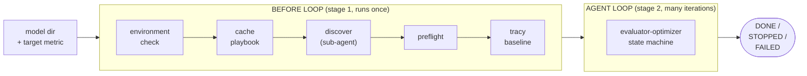
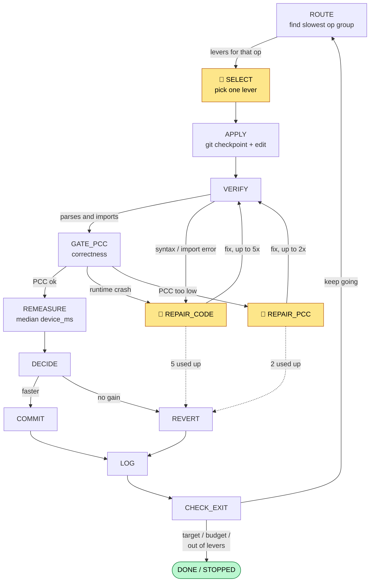

# Agentic performance-optimization workflow

Point this at a Tenstorrent model and a target metric, and an LLM-driven harness
optimizes it for you: it profiles a baseline, reads a playbook of known TT-NN
tricks, edits the model, checks the math still holds (PCC), re-measures, and
keeps only the changes that actually made it faster — looping until it hits your
target or runs out of budget.

The clever decisions are made by an agent. The profiling, correctness gates, and
bookkeeping around it are plain deterministic Python. That split is the whole
design philosophy, and it's why the thing is reproducible and crash-resumable.

```bash
# run in tmux, with your tt-metal env active (see §4):
python -m agent.before_loop \
    /localdev/gtobar/tt-metal/models/demos/wormhole/bge_m3 \
    --metric device_ms --input 128                 # 1. build a baseline
python -m agent.loop --until DECIDE                # 2. optimize it (one lap)
```

---

## 1. The big picture



There are two stages. The **Before Loop** runs once: it reads the hardware,
indexes the optimization playbook, sends a sub-agent into the model directory to
discover its perf test, PCC correctness gate, and source files, and captures a
clean Tracy profile. All of that lands in a `runs/<id>/` directory. The **Agent
Loop** then takes that baseline and runs many short iterations against it,
improving the metric one change at a time.

## 2. How the optimization loop thinks

This is the heart of it — one lap of the state machine, repeated until it exits:



> The 🤖 boxes (shaded yellow on GitHub) are the only steps where the LLM
> decides anything. Everything else is deterministic Python.

Walking the lap:

- **ROUTE** looks at the profiled buckets (matmul, attention, reduction, …),
  picks the slowest, and asks the playbook router which levers are tagged for
  that kind of op.
- **SELECT** is the agent's one judgment call: given the candidate levers and
  what's already been tried, pick one.
- **APPLY** records a clean git SHA (so any change is undoable), then an edit
  sub-agent makes that single change to the model file.
- **VERIFY** parses and imports the edit — cheap, no hardware. **GATE_PCC** runs
  the end-to-end correctness test and compares PCC to the model's threshold.
- When something breaks, the **REPAIR** loop hands the captured error back to the
  agent to fix: a broken edit gets up to **5** tries (mechanical — bad syntax,
  bad import, a crash), a correctness regression gets up to **2** (re-apply more
  conservatively). Out of tries → give up on that lever and revert.
- **REMEASURE** re-profiles (median of N runs, with a noise floor), **DECIDE**
  keeps the change only if it's genuinely faster, **COMMIT**/**REVERT** acts on
  that verdict, **LOG** writes the experiment to the ledger, and **CHECK_EXIT**
  decides whether to go around again.

Because every transition checkpoints to disk, killing the process mid-run and
restarting picks up at the exact same state — no lost work, no re-running the
expensive stages.

## 3. A concrete lap on BGE-M3

Here's what the machine actually sees. The real baseline we captured was **12.09
ms** of device time, and the profiler tagged the work like this:

| bucket | device ms | share | calls | what the router sees |
|---|---|---|---|---|
| **matmul** | 6.74 | 55.7% | 96 | `op_class=matmul, fidelity=hifi2` |
| reduction | 2.05 | 16.9% | 50 | `op_class=reduction, grid=tiny` |
| attention | 1.63 | 13.5% | 48 | `op_class=attention, fidelity=hifi2` |
| eltwise | 1.02 | 8.5% | 78 | `op_class=eltwise, fidelity=hifi4` |

Iteration 1 reads almost like a sentence: **ROUTE** picks `matmul` — it's 56% of
the time and running at `HiFi2`, so there's headroom. The router returns the
matmul-tagged levers from the playbook, one of which is the fidelity walk.
**SELECT** picks `mlp-fidelity-walk`. **APPLY** bumps the matmul's program config
to HiFi3. **GATE_PCC** runs the BGE-M3 end-to-end test and confirms PCC is still
≥ 0.99. **REMEASURE** re-profiles; matmul dropped and correctness held, so
**DECIDE** keeps it and the ledger records the reasoning — *"matmul was
fidelity-bound at HiFi2; one step to HiFi3 bought N ms with PCC intact."* After that change is committed, the loop **re-profiles the optimized model** —
so the next lap ROUTE works from the *new* profile, where matmul has shrunk and
reduction is now the biggest bucket. (The original baseline is kept untouched as
the reference for total speedup.)

## 4. Running it

LiteLLM credentials and the model roles are read **only** from
`perf_automation/.env.agent` (never the shell env): `LITELLM_BASE_URL`,
`LITELLM_API_KEY`, and `AGENT_MODEL_LEAD` (sonnet) / `AGENT_MODEL_SUB` (haiku) /
`AGENT_MODEL_EDIT` (haiku — the editor is mechanical).

**Run in tmux.** The Claude Agent SDK spawns a CLI subprocess that gets SIGHUP'd
(exit 129) if its parent shell hangs up; a tmux session keeps it alive:

```bash
tmux new-session -s perf
cd /localdev/gtobar/tt-metal/models/experimental/perf_automation

# Stage 1 - profile a baseline + discover the model (writes runs/<id>/, sets runs/latest).
python -m agent.before_loop \
    /localdev/gtobar/tt-metal/models/demos/wormhole/bge_m3 \
    --metric device_ms --input 128 --devices single

# Stage 2 - optimize, picking up from runs/latest. --until DECIDE = one full lap.
python -m agent.loop --until DECIDE
```

| command | what it does |
|---|---|
| `python -m agent.before_loop <model_dir> --metric device_ms --input 128` | profile a baseline + discover the model (7 stages, incl. signpost resolution) |
| `python -m agent.loop` | run the loop from `runs/latest` until DONE / budget / max-iter |
| `python -m agent.loop --until DECIDE` | stop after the first keep/discard (one lap; runs the slow hardware stages) |
| `python -m agent.loop --until ROUTE` | just build the route brief — no API key, no device |
| `python -m agent.before_loop --help` | full flag reference (`--input`, `--devices`, `--target`, …) |

Two gotchas:
- **The loop consumes `runs/latest`** — it ends parked at `COMMIT`/`REVERT`, not
  `BEFORE_LOOP_DONE`, so re-run `before_loop` before each fresh lap.
- **COMMIT/REVERT are still mock** (§6), so a kept/discarded edit is left in the
  model tree. Reset between runs:
  `git -C /localdev/gtobar/tt-metal checkout -- models/demos/wormhole/bge_m3/`.

`--input` is human-friendly: `--input 128` matches the seq-len-128 case; an image
model takes `--input 224x224`. No exact match → it stops rather than run the wrong case.

> **Status:** the loop runs **real, end to end on hardware** — ROUTE → SELECT →
> PLAN → APPLY → VERIFY → GATE_PCC → REMEASURE → DECIDE all live. Still mock (§6):
> **COMMIT, REVERT, REPAIR_CODE, REPAIR_PCC**.

## 5. What's an agent, and what isn't

The harness is deliberately mostly **not** an LLM. Profiling, routing, the PCC
gate, the keep/revert decision, every bit of state and bookkeeping — all
deterministic functions, all unit-tested, all free. The model is invoked at
exactly these steps:

- the **discovery sub-agent** in the Before Loop (explore the model dir, report
  what it found),
- **SELECT** (which lever to try this iteration),
- **PLAN** (turn the chosen lever into a localized `{file, location, change}` spec),
- **APPLY** (the editor applies that spec to the model source),
- **REPAIR** (fix a broken or correctness-failing edit).

The lead model (sonnet) does the reasoning in SELECT/PLAN; the editor runs on the
cheaper sub tier (haiku) because APPLY is mechanical transcription of the spec.
Keeping the agent on the edges and the machinery in the middle is what makes runs
reproducible, resumable, and cheap to test.

## 6. Extending it — claim a stage

The loop runs **real, end to end on hardware** today. The remaining work is
swapping the last few **mock** handlers for real ones, one at a time, watching the
test stay green — never a big-bang merge.

Each stage is a handler: a function `handler(ctx) -> "NEXT_STATE"`. The engine
(`agent/engine.py`) just calls the current state's handler and goes wherever it
returns. **Real today:** ROUTE, SELECT, PLAN, APPLY, VERIFY, GATE_PCC, REMEASURE,
DECIDE, LOG, CHECK_EXIT. **Still mock — the open tasks:**

| stage | new file | what the leaf should do |
|---|---|---|
| `COMMIT` | `handlers/commit.py` | persist a KEPT edit: path-scoped `git commit` of the model dir; promote `iter_<N>_profile.json` to `state.current_profile` |
| `REVERT` | `handlers/revert.py` | roll back a discarded/failed edit: `git checkout` scoped to the model dir, back to `state.git_sha_clean` |
| `REPAIR_CODE` | `handlers/repair_code.py` | re-invoke the editor with the error to self-heal a failed edit (≤5; budget `state.code_fix_attempts`) |
| `REPAIR_PCC` | `handlers/repair_pcc.py` | re-edit to recover a PCC drop (≤2; budget `state.pcc_fix_attempts`) |

**To make a stage real** — say `COMMIT`:

1. In `handlers/mocks.py`, find `commit`. The routing (the `return states.X` lines)
   is already correct; only the leaf is fake.
2. Write the real handler in your own file `handlers/commit.py`. Use `ctx` for all
   state, and `agent/gitio.py` for git (`head_sha`, `reset_hard`, `changed_files` —
   all path-scopeable to the model dir via a pathspec).
3. Swap one line in `handlers/__init__.py`: `states.COMMIT: commit.commit`.
4. `pytest tests/ -q -o addopts=` — still green, now with your real stage in the path.

Four rules keep parallel work painless: **(1)** handler signature is always
`handler(ctx) -> next_state`; **(2)** fill the leaf, never the routing; **(3)**
one file per stage (the only shared files are `states.py` and the registry);
**(4)** read and write run state only through `ctx`. The full per-stage
contracts, fixtures for working offline, and open questions live in
`PLAN_AGENT_WORKFLOW.md` (§8).

## 7. What a run writes (the JSON files)

Everything a run produces lives under `runs/<id>/`, in four lifecycles that are
never mixed — that separation is deliberate.

| file | lifecycle | what it holds |
|---|---|---|
| `manifest.json` | write-once, immutable | the run's fixed context: hardware (`env` — card, grid, DRAM bandwidth), the discovered `pathmap` (perf test + case, PCC gate path **and its threshold**, components, model files), the lead agent's discovery-review verdict, and the config (metric, target, budget). Written at the start, never touched again. |
| `state.json` | mutable checkpoint (atomic) | the single live file, and the one resume reads. Current `state`, `iteration`, the `metric` block (name / unit / direction / baseline / current / target), counters (`cost_usd`, tokens, `code_fix_attempts`, `pcc_fix_attempts`), and the working set (`candidates`, `tried`, `selected_lever`, `git_sha_clean`). Rewritten atomically after every transition. |
| `ledger.jsonl` | append-only | one row per experiment — the **story**: which lever, before/after, delta, PCC, kept or discarded and why, plus the agent's `hypothesis`. This is what a human (or a warm restart days later) reads to understand the run. |
| `events.jsonl` | append-only | one row per stage entry/exit — the **execution trace**, one unified schema for both phases: `ts` (UTC ISO-8601 Z), `phase` (before_loop/loop), `stage`, `event` (start/done/info/warn), `detail`, `seconds`, `iteration`. |
| `agent_calls.jsonl` | append-only | one row per LLM call — the **bill**: stage, role (discovery / select / repair), model, tokens in/out, cached tokens, cost, latency. Feeds the budget gate. |
| `profiles/baseline_profile.json` | write-once | the tagged op buckets (op_class, fidelity, grid, rank, …) + device_ms / wall_ms of the **original** model. The fixed reference for total speedup — NOT what ROUTE routes on after iteration 0. |
| `profiles/iter_<N>_profile.json` | write-once per iteration | the re-bucketed profile of the model as edited in iteration N. When DECIDE keeps the change, COMMIT promotes this to the *current* profile (`state.current_profile`), and the next ROUTE routes on it. |
| `profiles/*.csv` | write-once | the raw Tracy ops CSV and the tt-perf-report output, kept as evidence. |
| `.cache/playbook_index.json` | derived cache (shared) | the routing index built from the `GUIDELINES/` tags. Content-hashed and rebuilt when the playbook changes; **not** tied to any single run. |

Rule of thumb: **manifest** is what we started with (read-only), **state** is where
we are now (the one file resume needs), and the **`.jsonl`** files are append-only
logs you can `tail` live — story (ledger), trace (events), cost (agent_calls).
ROUTE always routes on the **current** profile (the last committed iteration),
falling back to the baseline only on iteration 0.

## 8. When something looks wrong

| you see… | it usually means… |
|---|---|
| `EngineError: no handler registered for state 'X'` | renamed a state, or forgot to register it in `handlers/__init__.py` |
| `EngineError: returned unknown state 'X'` | a handler returned a typo — use the `states.*` constant, not a string |
| `EngineError: exceeded N steps` | handlers cycle with no counter to break out — check your `return` |
| `ValueError: invalid value '...' for dimension` | a bucket tag isn't in `router.VOCABULARY` (e.g. compute-bound is `flop`, not `compute`) |
| loop ends `STOPPED` right away | every candidate already tried, or budget / max-iter hit — read `runs/latest/state.json` |

## 9. Where things live

```
agent/
  before_loop.py   stage 1 driver (environment, discovery, baseline)
  engine.py        the dispatcher that walks the state machine
  states.py        state names + transition contract + repair budgets
  loop_context.py  the ctx seam: state, manifest, ledger, telemetry
  loop.py          `python -m agent.loop` entry point
  router.py        playbook index + tag-based lever routing
  tracy_tool.py    profile -> tt-perf-report -> tagged buckets
  handlers/        one file per loop stage (most real; COMMIT/REVERT/REPAIR_* still mock)
runs/<id>/         one run: state.json, manifest.json, ledger.jsonl, profiles/
GUIDELINES/        the optimization playbook (tagged sections the router reads)
tests/             unit tests + the walking-skeleton engine test
PLAN_AGENT_WORKFLOW.md   the full design & build plan
```
