# TT-Symbiote

PyTorch-to-TTNN acceleration framework for transparent hardware acceleration of neural networks on Tenstorrent devices.

## Overview

TT-Symbiote enables TTNN acceleration of pretrained PyTorch models by replacing standard PyTorch modules (e.g., `nn.Linear`, `nn.LayerNorm`) with TTNN-optimized equivalents. The framework automatically handles:
- Module replacement and weight conversion
- Device management and memory allocation
- Fallback to PyTorch when TTNN operations fail

## Flow Diagram



## Run Modes

TT-Symbiote supports multiple execution modes via the `TT_SYMBIOTE_RUN_MODE` environment variable:

- **NORMAL** - Default TTNN execution mode
- **NORMAL_WITH_FALLBACK** - TTNN with automatic PyTorch fallback on errors
- **SEL** - Segment Each Layer mode. Pytorch takes TTNN tensors as input, compares outputs with PCC.
- **DPL** - Debug Per Layer. runs both TTNN and PyTorch separately, compares outputs with PCC.
- **DPL_NO_ERROR_PROP** - DPL but TTNN takes Pytorch tensors as input to avoid error propagation.
- **CPU** - CPU-only execution mode

```bash
# Set execution mode before running
export TT_SYMBIOTE_RUN_MODE=NORMAL && pytest tests/test_resnet50.py

# Or use DPL mode for debugging
export TT_SYMBIOTE_RUN_MODE=DPL && pytest tests/test_vit.py
```

## Dispatcher Configuration

TT-Symbiote supports multiple dispatcher implementations via the `TT_SYMBIOTE_DISPATCHER` environment variable:

- **DEFAULT** - Standard TTNN operation dispatcher (Not set by default. CPU set by default)
- **DEBUG** - Verbose logging dispatcher for debugging
- **CPU** - CPU-only dispatcher for testing

```bash
# Use default dispatcher
export TT_SYMBIOTE_DISPATCHER=DEFAULT

# Use debug dispatcher for verbose operation logging
export TT_SYMBIOTE_DISPATCHER=DEBUG

# Use CPU dispatcher
export TT_SYMBIOTE_DISPATCHER=CPU

# Combine with run mode for advanced debugging
export TT_SYMBIOTE_DISPATCHER=CPU && export TT_SYMBIOTE_RUN_MODE=DPL_NO_ERROR_PROP && pytest tests/test_speech_t5.py
```

## Quick Start

```python
import torch
from torch import nn
from transformers import AutoModelForImageClassification
from models.experimental.tt_symbiote.utils.module_replacement import register_module_replacement_dict
from models.experimental.tt_symbiote.utils.device_management import set_device
from models.experimental.tt_symbiote.modules.linear import TTNNLinear
from models.experimental.tt_symbiote.modules.normalization import TTNNLayerNorm

# Load model
model = AutoModelForImageClassification.from_pretrained("google/vit-base-patch16-224")

# Define module replacement mapping
nn_to_ttnn = {
    nn.Linear: TTNNLinear,
    nn.LayerNorm: TTNNLayerNorm,
}

# Replace modules and set device
register_module_replacement_dict(model, nn_to_ttnn, model_config=None)

#####
# Get TTNN device
ttnn_device = # Obtain TTNN device (e.g., through pytest fixture or ttnn.CreateDevice)
#####

set_device(model, ttnn_device)

# Run inference
model.eval()
torch.set_grad_enabled(False)
result = model(torch.randn(1, 3, 224, 224))


```

## Selective Module Replacement

You can selectively exclude specific modules from replacement using the `exclude_replacement` parameter:

```python
# Replace all Bottleneck modules except layer1.0
register_module_replacement_dict(
    model,
    nn_to_ttnn,
    model_config={"program_config_ffn": {}},
    exclude_replacement=set(["layer1.0"])
)
```

**How it works:**

1. **Initial replacement** - First, run without exclusions to see the module names:
```python
register_module_replacement_dict(model, nn_to_ttnn, exclude_replacement=set([]))
```

2. **Identify module names** - Check the model structure. TTNN modules show their `module_name`:
```python
# layer1.0 is now a TTNNBottleneck with module_name=layer1.0
(0): TTNNBottleneck(module_name=layer1.0
  (conv1): TTNNConv2dBNActivationNHWC(...)
  (conv2): TTNNConv2dBNActivationNHWC(...)
  ...
)
(1): TTNNBottleneck(module_name=layer1.1
  (conv1): TTNNConv2dBNActivationNHWC(...)
  ...
)
```

3. **Re-run with exclusions** - Use the module names to exclude specific modules:
```python
# Exclude layer1.0 from replacement - it stays as PyTorch Bottleneck
register_module_replacement_dict(
    model,
    nn_to_ttnn,
    exclude_replacement=set(["layer1.0"])
)
```

**Result:**
```python
# layer1.0 remains as original PyTorch Bottleneck
(0): Bottleneck(
  (conv1): Conv2d(64, 64, kernel_size=(1, 1), ...)
  (bn1): BatchNorm2d(64, ...)
  ...
)
# layer1.1 is replaced with TTNN
(1): TTNNBottleneck(module_name=layer1.1
  (conv1): TTNNConv2dBNActivationNHWC(...)
  ...
)
```

This is useful for:
- **Debugging** - Isolate problematic modules
- **Performance tuning** - Compare PyTorch vs TTNN for specific layers
- **Mixed execution** - Run certain layers on CPU/PyTorch while others use TTNN

## Creating a New TTNN Module

All TTNN modules inherit from `TTNNModule` and implement:

```python
from models.experimental.tt_symbiote.core.module import TTNNModule
import ttnn
from torch import nn

class TTNNCustomLayer(TTNNModule):
    def __init__(self, param1, param2):
        super().__init__()
        self.param1 = param1
        self.param2 = param2

    @classmethod
    def from_torch(cls, torch_layer):
        """Create TTNN module from PyTorch equivalent."""
        new_layer = TTNNCustomLayer(torch_layer.param1, torch_layer.param2)
        new_layer._fallback_torch_layer = torch_layer
        return new_layer

    def preprocess_weights_impl(self):
        """Convert PyTorch weights to TTNN format (called once)."""
        self.tt_weight_host = ttnn.from_torch(
            self.torch_layer.weight,
            dtype=ttnn.bfloat16,
            layout=ttnn.TILE_LAYOUT
        )

    def move_weights_to_device_impl(self):
        """Move preprocessed weights to device."""
        self.tt_weight = ttnn.to_device(self.tt_weight_host, self.device)

    def deallocate_weights_impl(self):
        """Deallocate device memory."""
        ttnn.deallocate(self.tt_weight)

    def forward(self, input_tensor):
        """TTNN forward implementation."""
        output = ttnn.custom_op(input_tensor, self.tt_weight)
        return output
```

**Key Methods:**
- `from_torch()`: Factory method to create from PyTorch module
- `preprocess_weights_impl()`: Convert weights to TTNN format (runs once)
- `move_weights_to_device_impl()`: Transfer weights to device
- `forward()`: TTNN implementation of the operation
- `deallocate_weights_impl()`: Free device memory

The base class handles:
- Automatic fallback to PyTorch on errors
- Tensor wrapping/unwrapping
- Weight lifecycle management
- Device placement

## Weight Management

The framework provides sophisticated weight lifecycle management:

```python
# Automatic weight preprocessing and device placement
module.preprocess_weights()           # Convert PyTorch → TTNN format (once)
module.move_weights_to_device()       # Transfer to device
module.deallocate_weights()           # Free device memory

# Auto-deallocation decorator for memory-constrained scenarios
from models.experimental.tt_symbiote.core.module import deallocate_weights_after

class TTNNLinearLLama(TTNNLinear):
    @deallocate_weights_after
    def forward(self, input_tensor):
        # Weights automatically deallocated after forward pass
        return super().forward(input_tensor)
```

## TorchTTNNTensor

The framework uses a custom tensor wrapper that enables transparent operation dispatch:

```python
from models.experimental.tt_symbiote.core.tensor import TorchTTNNTensor

# Wrap PyTorch tensor for TTNN dispatch
tensor = TorchTTNNTensor(torch.randn(10, 20))

# Access underlying representations
tensor.to_torch    # Get PyTorch tensor
tensor.to_ttnn     # Get TTNN tensor

# Supports standard operations with automatic dispatch
result = tensor * 2.0 + 3.0  # Dispatched to TTNN backend
```

## Running Tests

Tests work with pytest fixtures for device management:

```bash
pytest tests/test_vit.py           # ViT with TTNN Linear and LayerNorm
pytest tests/test_llama.py         # LLaMA-3.2-1B-Instruct
pytest tests/test_owl_vit.py       # OWL-ViT object detection
pytest tests/test_speech_t5.py     # SpeechT5 speech synthesis
pytest tests/test_whisper3.py      # Whisper-large-v3 automatic speech recognition
pytest tests/test_resnet50.py      # ResNet50 with Conv and Bottleneck
pytest tests/test_conv.py          # Standalone Conv2d, Conv+BN, Conv+BN+Activation
pytest tests/test_attention.py     # Self-attention module tests
pytest tests/test_yunet.py         # YUNet face detection
pytest tests/test_hunyuan_video.py # HunyuanVideo 1.5 text-to-video generation
pytest tests/test_glm.py           # GLM-4.5-Air with mesh device support
pytest tests/test_gptoss.py        # GPT-OSS-20B model
pytest tests/test_openvla.py       # OpenVLA-7B vision-language-action model
pytest tests/test_dpl.py           # Debug Per Layer mode test
```

## Architecture

```
core/
├── module.py            # TTNNModule base class with auto-fallback
├── tensor.py            # TorchTTNNTensor wrapper for PyTorch dispatch
├── dispatcher.py        # TTNN operation dispatch handlers
├── torch_dispatcher.py  # PyTorch operation dispatch handlers
├── run_config.py        # Runtime configuration and mode management
├── utils.py             # Utility functions for dtype conversion
└── dispatchers/         # Dispatcher implementations
    ├── default_dispatcher.py  # Default operation dispatcher
    ├── debug_dispatcher.py    # Debug operation dispatcher
    ├── cpu_dispatcher.py    # CPU-only operation dispatcher
    └── dispatcher_config.py   # Dispatcher configuration

modules/                 # TTNN implementations
├── linear.py            # TTNNLinear, TTNNLinearLLama, TTNNLinearLLamaBFloat16
├── attention.py         # TTNNViTSelfAttention
├── normalization.py     # TTNNLayerNorm
├── activation.py        # TTNNSilu, TTNNReLU
├── conv.py              # TTNNConv2dNHWC, TTNNConv2dBNNHWC, TTNNBottleneck
└── tensor.py            # TTNNPermute, TTNNReshape

utils/
├── module_replacement.py  # Recursive module swapping
└── device_management.py   # Device configuration
```

## Available TTNN Modules

**Linear Layers:**
- `TTNNLinear` - Standard linear layer (bfloat16)
- `TTNNLinearLLama` - Optimized for LLaMA (bfloat8_b, auto-deallocates weights)
- `TTNNLinearLLamaBFloat16` - LLaMA variant with bfloat16
- `TTNNLinearGelu` - Linear layer with fused GELU activation

**Activation Functions:**
- `TTNNSilu` - SiLU/Swish activation
- `TTNNReLU` - ReLU activation
- `TTNNGelu` - GELU activation

**Normalization:**
- `TTNNLayerNorm` - Layer normalization

**Attention:**
- `TTNNViTSelfAttention` - Vision Transformer self-attention (deprecated, use TTNNSelfAttention)
- `TTNNSDPAAttention` - Scaled Dot-Product Attention
- `TTNNFusedQKVSelfAttention` - Self-attention with fused QKV projections
- `TTNNSelfAttention` - General self-attention module
- `TTNNWhisperAttention` - Whisper-specific attention implementation

**Convolution:**
- `TTNNConv2dNHWC` - 2D convolution with NHWC layout
- `TTNNConv2dBNNHWC` - Conv2d fused with BatchNorm
- `TTNNConv2dBNActivationNHWC` - Conv2d + BatchNorm + Activation
- `TTNNBottleneck` - ResNet bottleneck block
- `TTNNMaxPool2dNHWC` - 2D max pooling with NHWC layout
- `TTNNUpsampleNHWC` - Upsampling with NHWC layout
- `TTNNPatchEmbedding` - Vision Transformer patch embedding
- `TTNNViTEmbeddings` - Complete ViT embedding layer (patch + position)

**Tensor Operations:**
- `TTNNPermute` - Tensor permutation
- `TTNNReshape` - Tensor reshaping
- `TTNNAdd` - Element-wise addition

## Examples

See [tests/](tests/) directory:
- [test_vit.py](tests/test_vit.py) - Vision Transformer with TTNN Linear and LayerNorm
- [test_llama.py](tests/test_llama.py) - LLaMA-3.2-1B-Instruct with bfloat8 optimizations
- [test_owl_vit.py](tests/test_owl_vit.py) - OWL-ViT object detection model
- [test_speech_t5.py](tests/test_speech_t5.py) - SpeechT5 speech synthesis model
- [test_whisper3.py](tests/test_whisper3.py) - Whisper-large-v3 automatic speech recognition
- [test_resnet50.py](tests/test_resnet50.py) - ResNet50 with Conv and Bottleneck blocks
- [test_conv.py](tests/test_conv.py) - Standalone Conv2d, Conv+BN, and Conv+BN+Activation tests
- [test_attention.py](tests/test_attention.py) - Self-attention module tests
- [test_yunet.py](tests/test_yunet.py) - YUNet face detection model
- [test_hunyuan_video.py](tests/test_hunyuan_video.py) - HunyuanVideo 1.5 text-to-video generation
- [test_glm.py](tests/test_glm.py) - GLM-4.5-Air with mesh device support
- [test_gptoss.py](tests/test_gptoss.py) - GPT-OSS-20B model
- [test_openvla.py](tests/test_openvla.py) - OpenVLA-7B vision-language-action model
- [test_dpl.py](tests/test_dpl.py) - Debug Per Layer mode test
