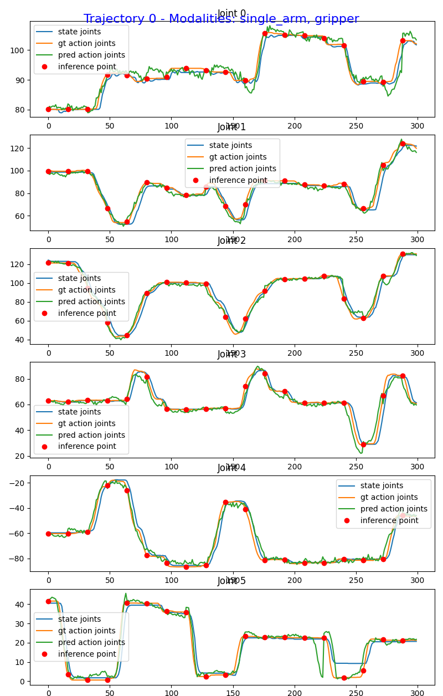

# Finetuning SO100 Model

This guide shows how to finetune dataset collected from [SO100](https://huggingface.co/docs/lerobot/en/so101) robot, and evaluate the model on the real robot.


## Dataset

To collect the dataset via teleoperation, please refer to the official documentation in lerobot: https://huggingface.co/docs/lerobot/il_robots?teleoperate_so101=Command

**Dataset Path:** [izuluaga/finish_sandwich](https://huggingface.co/datasets/izuluaga/finish_sandwich)

Visualize it with this [link](https://huggingface.co/spaces/lerobot/visualize_dataset?path=%2Fizuluaga%2Ffinish_sandwich%2Fepisode_0)

## Handling the dataset

```bash
uv run python scripts/lerobot_conversion/convert_v3_to_v2.py --repo-id izuluaga/finish_sandwich \
  --root examples/SO100/finish_sandwich_lerobot
```

Then move the `modality.json` file to the root of the dataset.
```bash
cp modality.json examples/SO100/finish_sandwich_lerobot/meta/modality.json
```

## Finetuning

Run the finetuning script using absolute joint positions (feel free to experiment with relative positions):
```bash
uv run bash examples/SO100/finetune_so100.sh
```

## Open-Loop Evaluation

Evaluate the finetuned model with the following command:
```bash
uv run python gr00t/eval/open_loop_eval.py \
  --dataset-path examples/SO100/finish_sandwich_lerobot \
  --embodiment-tag NEW_EMBODIMENT \
  --model-path /tmp/so100_finetune/checkpoint-10000 \
  --traj-ids 0 \
  --action-horizon 16 \
  --steps 400
```

### Evaluation Results

The evaluation produces visualizations comparing predicted actions against ground truth trajectories:



## Closed-Loop Evaluation

Please refer to [eval_so100.py](../../gr00t/eval/real_robot/SO100/eval_so100.py) for how to write SO100 deployment code using Policy API.

1. set up client side deps

```bash
cd gr00t/eval/real_robot/SO100
uv venv
source .venv/bin/activate
uv pip install -e . --verbose
uv pip install --no-deps -e ../../../../
```

2. Start policy server
```bash
uv run python gr00t/eval/run_gr00t_server.py \
  --model-path /tmp/so100_finetune/checkpoint-10000 \
  --embodiment-tag NEW_EMBODIMENT
```

3. Run the eval script, as client.
```bash
uv run python gr00t/eval/real_robot/SO100/eval_so100.py
  --robot.type=so101_follower --robot.port=/dev/ttyACM2 \
  --robot.id=orange_follower \
  --robot.cameras="{ wrist: {type: opencv, index_or_path: 2, width: 640, height: 480, fps: 30}, front: {type: opencv, index_or_path: 6, width: 640, height: 480, fps: 30}}" --policy_host=localhost --policy_port=5555 --lang_instruction="cube into green bowl"
```
