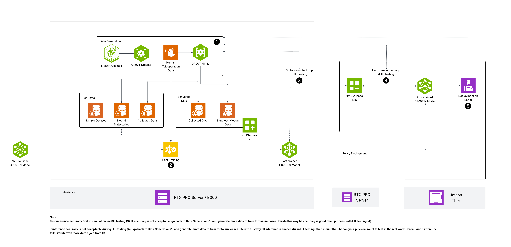

# Isaac GR00T N Model Post-Training and Deployment

GR00T N models are the open foundation models for generalized humanoid reasoning and skills. These models take multi-modal input, including language and images, to perform manipulation tasks in diverse environments. These models are adaptable through post-training for specific embodiments, tasks and environments. To address the challenge of data scarcity for training, synthetic data generation frameworks like Isaac GR00T-Mimic and GR00T-Dreams provide blueprints for creating rich training datasets that augment limited human-collected data. This approach enhances the post-training process, enabling GR00T N models to achieve improved performance on downstream tasks.
This reference architecture outlines the comprehensive workflow for post-training GR00T N Models using NVIDIA RTX PRO Servers, followed by optimized deployment on the NVIDIA Jetson AGX Thor Developer Kit.
  

 

## Bill of Materials
### Recommended Starter Kit:
**System Specifications for RTX Pro Server**
| **Component** | **Specification** |
|---|---|
| **RTX PRO SERVER** | 8x RTX PRO 6000 Blackwell Server Edition GPUs; 800 GB GPU Memory |
| **Virtualization** | VMware RedHat |
| **Containerization** | Kubernetes |
| **Storage** | Scalable; Interoperable; Secure |

 **System Specifications for Jetson**

| **Platform** | **Specification** |
|---|---|
| **Jetson AGX Thor Developer Kit** | Blackwell GPU with 2560 CUDA cores; 14-core Arm® Neoverse®-V3AE CPU; 128GB LP5 memory |

 

### Center of Excellence:
**System Specifications for DGX B300 Server**
| **Component** | **Specification** |
|---|---|
| **NVIDIA DGX B300** | NVIDIA Blackwell Ultra GPUs; 2.3 TB GPU Memory |
| **Virtualization** | VMware RedHat |
| **Containerization** | Kubernetes |
| **Storage** | Scalable; Interoperable; Secure |

 **System Specifications for Jetson Thor**

| **Platform** | **Specification** |
|---|---|
| **Jetson AGX Thor Developer Kit** | Blackwell GPU with 2560 CUDA cores; 14-core Arm® Neoverse®-V3AE CPU; 128GB LP5 memory |
