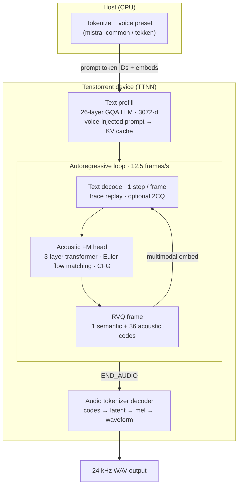

# Voxtral TTS — Documentation

## 1. Introduction

Voxtral TTS (`mistralai/Voxtral-4B-TTS-2603`) is Mistral AI's open-weights text-to-speech model for production voice agents. It produces realistic, expressive speech in nine languages (English, French, Spanish, Portuguese, Italian, Dutch, German, Arabic, and Hindi) at 24 kHz.

This directory contains the Tenstorrent TTNN bring-up of Voxtral TTS. The main neural-network stages have TTNN device implementations:

- **Text backbone** — 26-layer, 3072-dim LLM that decodes interleaved text and acoustic tokens (GQA: 32 heads / 8 KV heads, vocab 131072)
- **Acoustic transformer (Flow Matching head)** — 3-layer flow-matching refinement, same hidden size, produces continuous latents at 12.5 frames/s
- **Audio tokenizer decoder** — 1024-dim transformer that maps latents to 24 kHz waveform samples (8 heads, 36-codebook residual VQ output)

The host handles tokenization, voice-embedding preparation, and lightweight generation control/staging. The autoregressive decode path uses TTNN execution, with trace and 2-CQ async dispatch available for the text/acoustic loop.

### 1.1 Architecture

Voxtral TTS is a three-stage pipeline: a **text backbone** autoregressively predicts discrete acoustic codes frame-by-frame; an **acoustic flow-matching head** refines each frame; an **audio tokenizer decoder** turns the full code sequence into a 24 kHz waveform. On Tenstorrent hardware the text backbone, acoustic head, and audio decoder all run on-device via TTNN; only tokenization and voice-preset setup stay on the host.



| Stage | Model | Role |
|-------|-------|------|
| **Text backbone** | 26-layer Ministral-style LLM (GQA 32/8, vocab 131072) | Prefills the speech prompt, then decodes one multimodal token per acoustic frame; hidden states drive the acoustic head |
| **Acoustic FM head** | 3-layer flow-matching transformer (3072-d) | Maps text hidden + noise → continuous latent; quantizes to 37 RVQ codes per frame (1 semantic + 36 acoustic) |
| **Audio tokenizer decoder** | 1024-d transformer + conv pretransform | Decodes the full `[1, 37, T]` code tensor to 24 kHz audio after generation completes |

Entry point: `tt/voxtral_tts.py` (`VoxtralTTSPipeline`). Demo CLI: `demo/demo.py`.

---

## 2. Installation

### Step 1 — Activate environment

Run these commands at the start of every session, from the repo root:

```bash
source python_env/bin/activate
export TT_METAL_HOME=$(pwd)
export PYTHONPATH=$(pwd)
export ARCH_NAME=blackhole_140_arch_eth_dispatch.yaml
```

> `TT_METAL_HOME` and `PYTHONPATH` must point to the repo root. Without them, `import ttnn` fails and all tests fail with confusing import errors.

### Step 2 — Install Python packages

Use `python_env/bin/python -m pip install` for all installs. The system `pip` does not install into the project virtualenv.

**Core and quality-metric packages** — single install from the repo root:

```bash
python_env/bin/python -m pip install -r models/experimental/voxtraltts/requirements.txt
```

That file includes `speechbrain` (ECAPA-TDNN speaker similarity), `utmosv2` (UTMOS-v2 MOS), `librosa`, and `transformers` (Whisper WER) for `tests/pcc/test_voxtral_e2e_quality_metrics.py`. If those optional imports are missing, the quality test is skipped rather than crashing the rest of the suite.

### Step 3 — Set model weights path

**Option A — HuggingFace repo ID (auto-download):**

```bash
export HF_MODEL=mistralai/Voxtral-4B-TTS-2603
```

Weights are downloaded on first use and cached in `~/.cache/huggingface/`.

**Option B — Local directory:**

```bash
export HF_MODEL=/path/to/local/weights
```

The directory must contain the `.safetensors` files. No download occurs.

---

## 3. Supported Devices

| Device | Status | Notes |
|--------|--------|-------|
| **P150** | Fully supported | PCIe single-card; primary perf target |
| **Blackhole Quiet Box 2 (BH QB2)** | Fully supported | Chassis with 4 × P150 chips; same arch as single P150 |

---

## 4. File Structure

```
models/experimental/voxtraltts/
├── requirements.txt             #   Core Python deps (Step 2 install)
├── demo/
│   ├── decode_trace_2cq.py      #   Trace + 2-CQ decode helpers
│   └── demo.py                  #   Full TT demo: text → WAV (device-resident)
├── reference/                   # CPU-only PyTorch reference
│   ├── audio_tokenizer_ops.py   #   Audio tokenizer decode ops (CPU reference)
│   ├── cpu_flow_matching_acoustic.py  #   CPU reference for the acoustic FM transformer
│   ├── cpu_reference.py         #   Full CPU inference pipeline (VoxtralCPUReference)
│   ├── demo_reference.py        #   CPU reference demo CLI
│   ├── functional.py            #   Layer-level functions (RMSNorm, attention, MLP, …)
│   ├── generate_golden.py       #   Generates golden tensors for unit tests
│   ├── golden/                  #   Committed golden tensors for unit tests
│   │   ├── acoustic_attention_golden.pt
│   │   ├── acoustic_layer_golden.pt
│   │   ├── rms_norm_golden.pt
│   │   ├── swiglu_mlp_golden.pt
│   │   ├── text_attention_golden.pt
│   │   └── text_decoder_layer_golden.pt
│   ├── voxtral_config.py        #   Model config dataclasses + weight loading
│   ├── voxtral_request.py       #   Tokenizer + SpeechRequest construction (mistral-common)
│   └── reference_outputs/       #   Golden codes fixture + generator script
│       ├── generate_voxtral_golden_codes.py
│       └── voxtral_golden_codes.refpt
├── conftest.py                  #   Pytest fixtures (device mesh, trace reset)
├── tests/                       # Test modules only (unit, PCC, perf)
│   ├── audio_tokenizer_workload.py       #   Audio tokenizer test workload helpers
│   ├── pcc/                     #   E2E waveform PCC + quality-metric tests
│   │   ├── test_ttnn_voxtral_unittest.py        #   TTNN-level unit tests
│   │   ├── test_voxtral_e2e_pcc.py              #   Teacher-forced + free-run waveform PCC
│   │   └── test_voxtral_e2e_quality_metrics.py  #   UTMOS / WER / speaker similarity
│   ├── perf/                    #   Wall-clock and device-perf tests
│   │   ├── test_e2e_isl_sweep_perf.py                   #   E2E ISL sweep + KV budget
│   │   ├── test_e2e_performant.py                       #   E2E wall-clock (trace-enabled)
│   │   ├── test_profile_single_layer_prefill_decode.py  #   Text layer 0: 128 prefill + 1 decode (Tracy)
│   │   ├── test_voxtral_tts_device_perf.py              #   Full model device perf
│   │   ├── test_voxtral_tts_perf_inference.py           #   Inference throughput perf
│   │   ├── test_voxtral_tts_stage_device_perf.py        #   Per-stage device perf
│   │   └── test_voxtral_tts_stage_perf_run.py           #   Per-stage perf run
│   ├── test_acoustic_model.py                      #   Acoustic FM module PCC (forward + Euler)
│   ├── test_audio_tokenizer_decoder_stack.py       #   Audio tokenizer decoder stack PCC
│   ├── test_audio_tokenizer_full_decode.py         #   Audio tokenizer codes → waveform PCC
│   ├── test_audio_tokenizer_opt.py                 #   Full tokenizer decode perf harness
│   ├── test_text_model.py                          #   Text backbone prefill/decode logit PCC
│   └── test_voxtral_tts_pipeline_component_pcc.py #   Pipeline component PCC
├── tt/                          # TTNN on-device implementations
│   ├── acoustic_model.py        #   Acoustic flow-matching head
│   ├── attention.py             #   GQA attention (acoustic / audio tokenizer paths)
│   ├── audio_tokenizer/         #   Audio tokenizer decode (encoder + decoder stack)
│   │   ├── conv.py
│   │   ├── embedding.py
│   │   ├── model.py
│   │   ├── quantizer.py
│   │   └── transformer.py
│   ├── mlp.py                   #   SwiGLU MLP (acoustic / shared primitives)
│   ├── rmsnorm.py               #   RMSNorm (acoustic path)
│   ├── text_attention.py        #   Voxtral text attention (extends text_backbone; interleaved-wo decode opt)
│   ├── text_backbone/           #   Vendored text transformer framework (no tt_transformers runtime dep)
│   │   ├── attention.py         #   Base GQA attention (prefill + decode)
│   │   ├── ccl.py               #   Collective comms helpers (all-gather / all-reduce)
│   │   ├── common.py            #   Mode, mesh helpers, paged-attention config
│   │   ├── decoder.py           #   Transformer decoder block
│   │   ├── distributed_norm.py  #   TP-aware norm wrappers
│   │   ├── embedding.py         #   Token embeddings
│   │   ├── lm_head.py           #   LM head + sampling logits
│   │   ├── load_checkpoints.py  #   HF checkpoint key remapping / load
│   │   ├── mlp.py               #   SwiGLU MLP
│   │   ├── mixtral_mlp.py       #   Mixtral MoE MLP (unused on Voxtral dense text)
│   │   ├── mixtral_moe.py       #   Mixtral MoE router (unused on Voxtral dense text)
│   │   ├── model.py             #   Full text Transformer (prefill + decode)
│   │   ├── model_config.py      #   Program configs, mem configs, optimisation hooks
│   │   ├── prefetcher.py        #   Weight prefetch for decode
│   │   ├── prefetcher/          #   Prefetcher YAML config
│   │   ├── rmsnorm.py           #   RMSNorm
│   │   └── rope.py              #   RoPE setup + rotation mats
│   ├── text_decoder_layer.py    #   HF/Voxtral checkpoint key remapping for text weights
│   ├── text_layer_trace.py      #   Text-decode trace capture helpers
│   ├── text_mlp.py              #   Voxtral text MLP (extends text_backbone; fused-SiLU decode opt)
│   ├── text_model.py            #   VoxtralTTTextModel wrapper over text_backbone Transformer
│   ├── text_rmsnorm.py          #   FP32-promoting RMSNorm for text stack (HF-faithful)
│   ├── voxtral_tt_args.py       #   Model args, program configs, optimisation presets
│   └── voxtral_tts.py           #   VoxtralTTSPipeline (top-level inference entry point)
└── utils/
    ├── audio_tokenizer_optimizations.py  #   Optimisation preset factories
    ├── config_helpers.py                 #   Compute kernel configs (acoustic, semantic, …)
    ├── debug_trace.py                    #   Debug and trace utilities
    └── common.py                         #   Shared test/demo helpers (prompt text, mesh, model loaders)
```

---

## 5. Tests

All tests require the environment from [Section 2](#2-installation) and `HF_MODEL` set (same convention as other models in `tests/pipeline_reorg/`).

### 5.1 Unit tests

Single-module correctness checks (no op-level matmul/conv/attention bring-up tests). Full-stack load and config: demo and e2e ISL sweep.

```bash
# Text backbone logit PCC (prefill + decode)
pytest models/experimental/voxtraltts/tests/test_text_model.py -sv

# Full pipeline smoke / perf
python models/experimental/voxtraltts/demo/demo.py
pytest models/experimental/voxtraltts/tests/perf/test_e2e_isl_sweep_perf.py -q -s

# Audio tokenizer module PCC
pytest models/experimental/voxtraltts/tests/test_audio_tokenizer_full_decode.py -sv
pytest models/experimental/voxtraltts/tests/test_audio_tokenizer_decoder_stack.py -sv

# Acoustic FM module PCC
pytest models/experimental/voxtraltts/tests/test_acoustic_model.py -sv

# Pipeline component PCC
pytest models/experimental/voxtraltts/tests/test_voxtral_tts_pipeline_component_pcc.py -sv

# Run all unit tests at once
pytest models/experimental/voxtraltts/tests/ \
    --ignore=models/experimental/voxtraltts/tests/pcc \
    --ignore=models/experimental/voxtraltts/tests/perf -sv
```

### 5.2 PCC / accuracy tests

These tests compare TT hardware output against a float32 CPU reference and assert that Pearson Correlation Coefficient (PCC) is above a threshold. PCC of 1.0 means perfect numerical match; ≥ 0.99 is the standard pass threshold.

#### Prerequisites

From the repo root, after [Section 2](#2-installation):

```bash
export HF_MODEL=mistralai/Voxtral-4B-TTS-2603
export TT_CACHE_PATH=/mnt/MLPerf/huggingface/tt_cache/mistralai--Voxtral-4B-TTS-2603
export ARCH_NAME=blackhole_140_arch_eth_dispatch.yaml
```

Optional mesh selection via ``MESH_DEVICE`` (default is **1×1** when unset; set **P150x4** on BH QB2 for tensor-parallel text):

```bash
export MESH_DEVICE=P150    # 1×1 single-device compute (default)
export MESH_DEVICE=P150x4  # QB2 only — TP text on full 1×4 chassis mesh
```

Trace is **on by default** for PCC and demo (via `configure_decode_trace()` in `demo.py`; `--no-decode-trace` to disable). **2CQ is also on by default** on 1×1 and multi-device (`--no-decode-trace-2cq` to disable).

#### CI (GitHub Actions)

Voxtral jobs use the canonical Blackhole demo cache layout (`HF_HOME`, `HF_MODEL`, `TT_CACHE_PATH` — see header in `tests/pipeline_reorg/blackhole_demo_tests.yaml`).

| Pipeline | Job | Hardware |
|----------|-----|----------|
| `models_unit_tests.yaml` | Voxtral TTS unit tests | P150 (`bh_p150b_civ2`) |
| `models_unit_tests.yaml` | Demo smoke WAV (1×4 TP text) | QB2 (`bh_quietbox_2`) — `MESH_DEVICE=P150x4`, `demo.py` with defaults |
| `models_e2e_tests.yaml` | Teacher-forced E2E PCC (golden codes / acoustic / golden acoustic) | P150 |
| `models_e2e_tests.yaml` | Demo smoke WAV (1×4 TP text) | QB2 (`bh_quietbox_2`) — `MESH_DEVICE=P150x4`, `demo.py` with defaults |
| `blackhole_demo_tests.yaml` | Demo smoke WAV | P150 CIv2 (1×1) — `demo.py` with defaults |
| `blackhole_demo_tests.yaml` | Demo smoke WAV (1×4 TP text) | QB2 — `MESH_DEVICE=P150x4`, `demo.py` with defaults |

Local dry-run of the gated unit suite (excludes `tests/perf`):

```bash
export HF_MODEL=mistralai/Voxtral-4B-TTS-2603
export TT_CACHE_PATH=/mnt/MLPerf/huggingface/tt_cache/mistralai--Voxtral-4B-TTS-2603
export CI=true
pytest models/experimental/voxtraltts/tests/ \
  --ignore=models/experimental/voxtraltts/tests/perf \
  -q --timeout=3600
```

#### E2E waveform PCC (recommended)

Run all four end-to-end tests (~1–2 h cold cache):

```bash
pytest models/experimental/voxtraltts/tests/pcc/test_voxtral_e2e_pcc.py -sv --timeout=0
```

Or run individually:

| Test | What it validates | Pass threshold | Measured (P150 1×1) |
|------|-------------------|----------------|---------------------|
| `test_ttnn_voxtral_tts_golden_codes_pcc` | Audio tokenizer only | PCC ≥ 0.99 | **0.9989** |
| `test_ttnn_voxtral_tts_acoustic_pcc` | Acoustic FM only (isolated) | PCC ≥ 0.97 | **0.98** |
| `test_ttnn_voxtral_tts_golden_acoustic_pcc` | Text + acoustic + tokenizer (teacher-forced) | PCC ≥ 0.97 | **0.979** |
| `test_ttnn_voxtral_tts_staged_pcc` | Free-run diagnostic (full AR, no golden feedback) | informational | — |

**`test_ttnn_voxtral_tts_golden_codes_pcc`** — Audio tokenizer in isolation. Same as a teacher-forced run, except the golden-truth acoustic codes are saved offline in `reference/reference_outputs/voxtral_golden_codes.refpt`. At test time those fixed `[1, 37, T]` codes are fed to both the CPU reference tokenizer and the TT audio tokenizer; the final waveforms are compared with PCC. No text model or acoustic model runs — this gates only the audio decoder path.

**`test_ttnn_voxtral_tts_acoustic_pcc`** — Acoustic model in isolation. Precomputed golden text hidden states from the reference fixture are fed directly as input to both CPU and TT acoustic models each step, with the same FM noise seed and no text model or code feedback. Each side produces its own acoustic codes; both code streams are decoded through the **same reference tokenizer** (held constant so only the acoustic implementation differs). The resulting waveforms are compared with PCC.

**`test_ttnn_voxtral_tts_golden_acoustic_pcc`** — Full pipeline teacher-forced. Validates the text model, acoustic model, and tokenizer together. CPU and TT are both prefilled on the same prompt and run live each step (text decode → acoustic FM → codes). To prevent autoregressive divergence from accumulating, **golden codes are fed back into both text models at every step** instead of each side's own output. Each side still produces its own acoustic codes from its own hidden states; CPU codes go through the reference tokenizer and TT codes through the TT tokenizer. The two waveforms are compared with PCC.

**`test_ttnn_voxtral_tts_staged_pcc`** — Free-run diagnostic. TT runs the full autoregressive loop without golden feedback and is compared against CPU; results are logged only and not gated in CI.

```bash
pytest models/experimental/voxtraltts/tests/pcc/test_voxtral_e2e_pcc.py::test_ttnn_voxtral_tts_golden_codes_pcc -sv --timeout=0
pytest models/experimental/voxtraltts/tests/pcc/test_voxtral_e2e_pcc.py::test_ttnn_voxtral_tts_acoustic_pcc -sv --timeout=0
pytest models/experimental/voxtraltts/tests/pcc/test_voxtral_e2e_pcc.py::test_ttnn_voxtral_tts_golden_acoustic_pcc -sv --timeout=0
pytest models/experimental/voxtraltts/tests/pcc/test_voxtral_e2e_pcc.py::test_ttnn_voxtral_tts_staged_pcc -sv --timeout=0
```

E2E tests use the standard ~500-character prompt (`VOXTRAL_STANDARD_CHAR_TEXT` in `utils/common.py`) and `voxtral_text_hf_aligned_optimizations` for numerical fidelity.

**PCC environment overrides**

| Variable | Default | Description |
|----------|---------|-------------|
| `VOXTRAL_GOLDEN_CODES_PT` | `reference/reference_outputs/voxtral_golden_codes.refpt` | Path to golden codes + text hiddens fixture |
| `VOXTRAL_ACOUSTIC_PCC` | `0.97` | Minimum waveform PCC for `test_ttnn_voxtral_tts_acoustic_pcc` |
| `VOXTRAL_PIPELINE_TF_PCC` | `0.97` | Minimum waveform PCC for `test_ttnn_voxtral_tts_golden_acoustic_pcc` |
| `VOXTRAL_DECODE_TRACE` | `1` | Enable traced text-decode replay (set `0` to disable) |
| `VOXTRAL_DECODE_TRACE_2CQ` | — | Not read at runtime; use `--no-decode-trace-2cq` or `configure_decode_trace(decode_trace_2cq=False)` |
| `VOXTRAL_TRACE_REGION_SIZE` | `200000000` | Trace capture region size (bytes) passed to device open |

Regenerate the golden fixture (one-time, then commit):

```bash
python models/experimental/voxtraltts/reference/reference_outputs/generate_voxtral_golden_codes.py
```

#### Component / module PCC

```bash
# Text backbone — prefill last-token logits PCC (128…65504)
pytest models/experimental/voxtraltts/tests/test_text_model.py::test_text_model_prefill_logit_pcc -sv

# Text backbone — teacher-forced decode logits PCC (32-step CI + tail rows)
pytest models/experimental/voxtraltts/tests/test_text_model.py::test_text_model_decode_multistep_logit_pcc -sv

# Acoustic FM — full forward + Euler stepwise PCC vs CPU
pytest models/experimental/voxtraltts/tests/test_acoustic_model.py -sv

# Pipeline component — prefill hidden + decode step (no full AR)
pytest models/experimental/voxtraltts/tests/test_voxtral_tts_pipeline_component_pcc.py -sv
```

#### E2E quality metrics (UTMOS, WER, speaker similarity)

These metrics are adopted from the Voxtral paper's evaluation protocol:
- **UTMOS** (MOS predictor) — measures perceived naturalness of the generated speech without needing human listeners.
- **WER** (Word Error Rate via Whisper) — verifies that the synthesised speech is intelligible and the correct words were produced. Whisper is used instead of Voxtral's own transcription because Voxtral transcribe requires a Mistral API key, whereas Whisper is open-source and requires no API key.
- **Speaker similarity** (SpeechBrain ECAPA-TDNN cosine score) — checks that the output voice matches the requested speaker embedding, confirming voice identity is preserved end-to-end.

Requires `utmosv2`, `speechbrain`, and `transformers` with Whisper. If these packages are not installed, the individual sub-tests are skipped automatically.

```bash
pytest models/experimental/voxtraltts/tests/pcc/test_voxtral_e2e_quality_metrics.py -sv --timeout=0
```

### 5.3 Performance tests

#### Wall-clock E2E (frames/s, TTFA) — trace-enabled; 2CQ opt-in

```bash
pytest models/experimental/voxtraltts/tests/perf/test_e2e_performant.py -sv --timeout=0
```

Reports: per-frame decode time (ms/frame), throughput (frames/s), and time-to-first-audio (TTFA ms).

#### full model device perf

```bash
pytest models/experimental/voxtraltts/tests/perf/test_voxtral_tts_device_perf.py -sv --timeout=0
```


#### Modulewise perf test (per-stage device profiling)

```bash
# Modulewise device perf test
pytest models/experimental/voxtraltts/tests/perf/test_voxtral_tts_stage_device_perf.py -sv -k <model test name>
e.g : text_prefill, text_decode, acoustic_forward, audio_decode


### 5.4 Demo

Full TT inference demo: text (or pre-computed codes/latents) → `.wav` on device. Trace replay is **on by default** on P150 and BH QB2.

With no CLI flags, the demo uses the shared ~500-character standard prompt (`VOXTRAL_STANDARD_CHAR_TEXT` in `utils/common.py`), voice `casual_male`, `text_max_seq_len=65536`, paged KV attention (on by default), and `max_speech_tokens=5000` (auto-raised from word count when needed). CI jobs run the same default path with `warmup_iters=1` so the timed `run` pass uses trace replay (compile/capture happen on the untimed warmup pass).

#### Prerequisites

Same as [Section 2](#2-installation). Minimal session setup:

```bash
source python_env/bin/activate
export TT_METAL_HOME=$(pwd)
export PYTHONPATH=$(pwd)
export ARCH_NAME=blackhole_140_arch_eth_dispatch.yaml
export HF_MODEL=mistralai/Voxtral-4B-TTS-2603
python_env/bin/python -m pip install -r models/experimental/voxtraltts/requirements.txt
```

#### P150 (1×1) — recommended starting point

```bash
export MESH_DEVICE=P150
python models/experimental/voxtraltts/demo/demo.py
```

Output: `generated/voxtraltts_demo/run_item0.wav` (and `.codes.pt` debug sidecar when generated).

#### BH QB2 (1×4 tensor-parallel text)

```bash
export MESH_DEVICE=P150x4
python models/experimental/voxtraltts/demo/demo.py
```

All text prompts run as a **single AR pass** on both P150 (1×1) and P150x4 (1×4) — no sentence chunking.

#### Customizing a local run

Override any default on the command line — CI uses the defaults above with no extra flags:

```bash
python models/experimental/voxtraltts/demo/demo.py \
    --text "Paris is a beautiful city in the heart of Europe." \
    --voice casual_female \
    --output-dir /tmp/voxtral_out \
    --text-max-seq-len 4096 \
    --max-speech-tokens 5000 \
    --warmup-iters 1
```

Quick smoke (short text, few acoustic frames):

```bash
python models/experimental/voxtraltts/demo/demo.py \
    --text "Hello from Voxtral." \
    --max-speech-tokens 256
```

#### Demo CLI parameters

Run `python models/experimental/voxtraltts/demo/demo.py --help` for the live list. All flags below are defined in `demo/demo.py`.

**Text generation (`--mode text`)**

| Parameter | Default | Description |
|-----------|---------|-------------|
| `--text` | `VOXTRAL_STANDARD_CHAR_TEXT` (~500 chars) | Prompt text; omit to use the shared standard prompt (same as PCC / perf tests) |
| `--default-voice NAME` | `casual_male` | Voice used when `--voice` is omitted |
| `--text-max-seq-len` | `65536` | Maximum text tokens for prefill / KV cache length (text + speech timeline) |
| `--max-speech-tokens` | `5000` | Upper bound on autoregressive acoustic frames. The demo **auto-raises** this from word count (~8 tokens/word). Set `64` for smoke tests; set `0` to use the auto-estimate only |
| `--seed` | `0` | RNG seed for flow-matching noise (reproducible acoustic sampling) |
| `--warmup-iters` | `1` | Untimed warmup passes before the measured run (compile + trace capture; set `0` to skip). Skipped when trace is disabled via `--no-decode-trace` |

**KV cache / long prompts (`--mode text`)**

| Parameter | Default | Description |
|-----------|---------|-------------|
| *(paged KV)* | **on** | Paged attention is enabled by default at all sequence lengths |
| `--no-paged-kv-cache` | off (flag) | Disable paged KV; use default (non-paged) attention instead |
| `--paged-block-size` | `32` | KV block size for paged attention (must be a multiple of 32) |

**Audio decode quality (`--mode text`, `codes`, `latents`)**

| Parameter | Default | Description |
|-----------|---------|-------------|
| *(default)* | dense ALiBi SDPA | Production default — full causal + sliding-window ALiBi mask; cleanest waveform |
| `--native-sdpa` | off (flag) | Use native sliding-window SDPA for the audio tokenizer decode path (faster; may add audible hiss) |

**Text backbone fidelity (`--mode text`)**

| Parameter | Default | Description |
|-----------|---------|-------------|
| *(default)* | production opts | BFP8 weights + HiFi2 decode matmuls + fused paths (best RTF) |
| `--hf-aligned-text` | off (flag) | HF-aligned text decode: BF16/HiFi4 settings (slower; higher PCC — use for accuracy debugging) |

**Trace (`--mode text`)**

| Parameter | Default | Description |
|-----------|---------|-------------|
| *(default)* | trace **on** | `VOXTRAL_DECODE_TRACE=1` — traced AR text-decode replay (best RTF). On 1×1, 2CQ stays off unless env sets it |
| `--no-decode-trace` | off (flag) | Disable trace replay and 2CQ; slower direct forward per AR step |

#### CPU reference demo (no TT hardware)

Host-only PyTorch reference — useful for golden outputs and PCC baselines without a Tenstorrent device:

```bash
python -m models.experimental.voxtraltts.reference.demo_reference \
    --model mistralai/Voxtral-4B-TTS-2603 \
    --text "Paris is a beautiful city in the heart of Europe." \
    --voice casual_male \
    --write-audio \
    --output-dir output_audio
```

#### Demo environment variables

These are read by `demo.py` / the pipeline in addition to the CLI flags above. Session variables from [Section 2](#2-installation) (`TT_METAL_HOME`, `PYTHONPATH`, `ARCH_NAME`) are also required.

| Variable | Default | Description |
|----------|---------|-------------|
| `HF_MODEL` | `mistralai/Voxtral-4B-TTS-2603` | Model weights path or HF repo ID (used when `--model` is omitted; same as other models pipelines) |
| `VOXTRAL_TTS_MODEL` | — | Optional override if `HF_MODEL` is set to a different model in a shared shell |
| `MESH_DEVICE` | unset → `P150` (1×1) | Compute mesh: `P150` (1×1 submesh on QB2) or `P150x4` (QB2 tensor-parallel text) |
| `CI` | unset | Set by CI pipelines for other model paths (e.g. `local_files_only` weight load); does not change demo warmup |
| `VOXTRAL_DECODE_TRACE` | `1` | Traced AR text-decode replay. Set `0` or pass `--no-decode-trace` to disable |
| `VOXTRAL_DECODE_TRACE_2CQ` | — | Not read at runtime; use `--no-decode-trace-2cq` or `configure_decode_trace(decode_trace_2cq=False)` |
| `VOXTRAL_TRACE_REGION_SIZE` | `200000000` | Trace capture region size in bytes (passed to device open) |
| `VOXTRAL_OUTPUT_HPF_HZ` | `80` | High-pass filter cutoff (Hz) applied to saved `.wav` to remove sub-speech rumble. Set `0` to disable |

---

## 6. Performance and Accuracy

### 6.1 PCC targets (accuracy)

| Test | Target | Measured | Notes |
|:-----|:------:|:--------:|:------|
| Text prefill logits | ≥ 0.99 | | BF16 weights + HiFi4 |
| Text decode (1 step) | ≥ 0.99 | | prompt_len clamped to ≤ 384 (L1 limit) |
| Text decode (26 steps) | ≥ 0.98 | | ~1–2% BF16 drift accumulates at step 19+ |
| `test_ttnn_voxtral_tts_golden_codes_pcc` (audio tokenizer) | ≥ 0.99 | **0.9989** | Fixed golden `[1,37,T]` codes → CPU ref vs TT tokenizer waveform |
| `test_ttnn_voxtral_tts_acoustic_pcc` (acoustic FM isolation) | ≥ 0.97 | **0.98** | Same golden text hiddens + noise; ref tokenizer held constant |
| `test_ttnn_voxtral_tts_golden_acoustic_pcc` (pipeline teacher-forced) | ≥ 0.97 | **0.979** | Live text + acoustic; golden codes fed to both text models each step |
| Pipeline component (prefill hidden) | ≥ 0.99 | | |
| Pipeline component (decode step) | ≥ 0.99 | | |
| E2E waveform (free-run) | ~0.957 | | North-star metric; logged only, not gated |

### 6.2 Quality metrics

| Metric | Tool | Target | Measured | Notes |
|:-------|:----:|:------:|:--------:|:------|
| MOS (naturalness) | UTMOS-v2 | ≥ 3.0 | 3.215 | Override: `VOXTRAL_TTS_UTMOS_V2_MIN_SCORE` |
| Word Error Rate | Whisper Small | < 10% | 1.39% | Override: `VOXTRAL_TTS_WER_TARGET`; `openai/whisper-small` is used (Voxtral transcribe requires Mistral API key) |
| Speaker similarity | SpeechBrain ECAPA-TDNN | ≥ 0.55 cosine | 0.7187 | Verified against reference voice embedding |

> Audio is produced at 12.5 acoustic frames/s at 24 kHz. Real-time factor = `frames_per_s / 12.5`. A value > 1.0 means faster than real time.

### 6.3 Accuracy Verification

| ISL (text tokens / audio tokens) | PCC (teacher-forced) | PCC (free-run — single /multi layer decoder) | WER | UTMOS | Speaker Similarity |
|:----------------------------------|:--------------------:|:-------------------------------:|:---:|:-----:|:-----------------:|
| | | | | | |

### 6.4 Performance Verification

Verified using `demo/demo.py`

#### P150 (1×1)

##### Trace enabled + 2CQ

###### `casual_male`

| text_max_seq_len | ISL (text chars / audio tokens) | Latency (ms) | RTF    | Throughput (char/s) |
|:-----------------|:--------------------------------|-------------:|-------:|--------------------:|
| 512              | 255 chars / 209 audio tokens    | 13649.12     | 0.8163 | 18.68               |
| 1024             | 514 chars / 392 audio tokens    | 21914.94     | 0.6988 | 23.45               |
| 4096             | 514 chars / 392 audio tokens    | 22015.82     | 0.7020 | 23.35               |
| 16384            | 514 chars / 392 audio tokens    | 22416.36     | 0.7148 | 22.93               |
| 64000            | 514 chars / 392 audio tokens    | 22037.20     | 0.7027 | 23.32               |
| 65536            | 514 chars / 392 audio tokens    | 21793.18     | 0.6949 | 23.59               |

###### `cheerful_female`

| text_max_seq_len | ISL (text chars / audio tokens) | Latency (ms) | RTF    | Throughput (char/s) |
|:-----------------|:--------------------------------|-------------:|-------:|--------------------:|
| 512              | 255 chars / 299 audio tokens    | 16818.59     | 0.7031 | 15.16               |
| 1024             | 514 chars / 458 audio tokens    | 24115.93     | 0.6582 | 21.31               |
| 4096             | 514 chars / 458 audio tokens    | 24585.80     | 0.6710 | 20.91               |
| 16384            | 514 chars / 458 audio tokens    | 24200.32     | 0.6605 | 21.24               |
| 64000            | 514 chars / 458 audio tokens    | 24301.64     | 0.6633 | 21.15               |
| 65536            | 514 chars / 458 audio tokens    | 23972.96     | 0.6543 | 21.44               |

##### Trace disabled (`--no-decode-trace`)

###### `casual_male`

| text_max_seq_len | ISL (text chars / audio tokens) | Latency (ms) | RTF    | Throughput (char/s) |
|:-----------------|:--------------------------------|-------------:|-------:|--------------------:|
| 512              | 255 chars / 209 audio tokens    | 49246.43     | 2.2884 | 5.18                |
| 1024             | 514 chars / 392 audio tokens    | 93779.61     | 1.8231 | 5.48                |
| 4096             | 514 chars / 392 audio tokens    | 93246.17     | 1.8127 | 5.51                |
| 16384            | 514 chars / 392 audio tokens    | 92940.25     | 1.8068 | 5.53                |
| 64000            | 514 chars / 392 audio tokens    | 92422.65     | 1.7967 | 5.56                |
| 65536            | 514 chars / 392 audio tokens    | 93695.71     | 1.8215 | 5.49                |

###### `cheerful_female`

| text_max_seq_len | ISL (text chars / audio tokens) | Latency (ms) | RTF    | Throughput (char/s) |
|:-----------------|:--------------------------------|-------------:|-------:|--------------------:|
| 512              | 255 chars / 299 audio tokens    | 52755.37     | 1.7968 | 4.83                |
| 1024             | 514 chars / 458 audio tokens    | 93998.24     | 1.6030 | 5.47                |
| 4096             | 514 chars / 458 audio tokens    | 96404.77     | 1.6440 | 5.33                |
| 16384            | 514 chars / 458 audio tokens    | 94806.01     | 1.6167 | 5.42                |
| 64000            | 514 chars / 458 audio tokens    | 92893.81     | 1.5841 | 5.53                |
| 65536            | 514 chars / 458 audio tokens    | 94664.92     | 1.6143 | 5.43                |

#### BH QB2 (1×4)

| ISL (text tokens / audio tokens) | Latency (ms) | RTF | Throughput (char/s) |
|:----------------------------------|-------------:|----:|--------------------:|
| | | | |

#### Sizing `--text-max-seq-len` (why too small produces no output)

`--text-max-seq-len` sizes the whole text KV cache. That cache must hold the full prompt **and** every token generated during decode, so it sets a hard ceiling: `decode budget = text-max-seq-len − prompt_seq_len`.

The prompt is more than your `--text`. The tokenized speech request also prepends the voice-preset audio placeholder tokens and the protocol/special tokens, and these dominate the count. Example with `casual_male` and the text `"Voxtral is a "`:

| Prompt part | Tokens |
|---|---:|
| Voice preset slots (`casual_male`) | ~147 |
| Protocol / special tokens | ~8 |
| Text (`"Voxtral is a "`) | ~3 |
| **Total `prompt_seq_len`** | **~158** |

Here `prompt_seq_len ≈ 158 > 128`, so with `--text-max-seq-len 128` the prompt does not even fit. `_max_decode_tokens()` raises *"Prompt token length (158) exceeds text KV cache (text_max_seq_len=128)"* before any acoustic frame is decoded, and **no `.wav` is written**.

The 128 limit is not special — any value at or below `prompt_seq_len` fails the same way, and `prompt_seq_len` grows with longer text and varies by voice. Set `--text-max-seq-len` above `prompt_seq_len` plus the frames you expect (~8 tokens/word). The default `65536` uses paged KV and supports long prompts plus full decode budget.

### 6.5 Demo verification

See [Section 5.4](#54-demo) for full CLI and environment-variable reference.

#### Default voice

`casual_male` — best general-purpose output for English text.

#### Supported built-in voices (HF `.pt` presets)

These files ship inside `voice_embedding/` in the model weights and are loaded automatically by name.

| Voice name | Language / style |
|---|---|
| `casual_male` | English — casual male *(default)*|
| `casual_female` | English — casual female |
| `neutral_male` | English — neutral male |
| `neutral_female` | English — neutral female |
| `cheerful_female` | English — cheerful female |
| `fr_male` / `fr_female` | French |
| `de_male` / `de_female` | German |
| `es_male` / `es_female` | Spanish |
| `it_male` / `it_female` | Italian |
| `pt_male` / `pt_female` | Portuguese |
| `nl_male` / `nl_female` | Dutch |
| `hi_male` / `hi_female` | Hindi |
| `ar_male` | Arabic |

> Using an English voice for non-English text (or vice-versa) works but may reduce naturalness.

---

## 7. Optimizations

> **Device scope:** All optimizations below are validated on **P150 (1×1) only**. Multi-card P150×4 (BH QB2) optimization is pending.

### Text backbone (P150)

| Optimization | Default | Description |
|---|---|---|
| **BFP8 weights** | On (production) | FF1/FF3/FF2/WQKV/WO/KV-cache stored as BFP8; reduces DRAM bandwidth vs BF16 |
| **HiFi2 decode matmuls** | On (production) | Lower-fidelity matmul for decode MLP/attention; BF16 activations preserved |
| **HiFi4 prefill matmuls** | Always | Full precision for prefill SDPA and matmuls |
| **1D mcast DRAM-sharded MLP** | On | W1/W3 with 1D multicast DRAM-sharded matmul; ~1.36× faster vs 2D on Blackhole |
| **1D mcast DRAM-sharded Wo** | On | Attention output projection; ~1.32× faster vs 2D on Blackhole |
| **Traced AR decode + 2CQ** | On | Autoregressive loop captured as a single TT trace; dispatched over two command queues |

Disable individual optimizations:

```bash
export VOXTRAL_MLP_1D=0        # disable 1D MLP matmul
export VOXTRAL_ATTN_WO_1D=0   # disable 1D Wo matmul
```

Accuracy preset (`voxtral_text_high_accuracy_optimizations`): BF16 weights + HiFi4 everywhere — used in all PCC tests.

### Acoustic model / FM transformer (P150)

| Optimization | Default | Description |
|---|---|---|
| **1D mcast program configs** | On | All FM matmuls (W1/W3, W2, WQKV, WO, projections, velocity head) use 1D multicast on 8×6 = 48-core grid |
| **BFP8 weights** | On | Attention + MLP weights stored as BFP8; override with `VOXTRAL_ACOUSTIC_WEIGHT_DTYPE=bf16` |
| **BFP8 compute kernel** | On | Lower-fidelity matmul for FM attention + MLP; BF16 activations preserved |
| **Width-sharded RMSNorm** | On | Layer norms sharded across 32 cores (8×4); baseline was 2-core L1-interleaved at ~47 µs/call |
| **Batched CFG** | Always | Cond + uncond packed as bsz=2 in a single FM forward pass per Euler step; avoids two separate transformer runs |

### Audio tokenizer decoder (P150)

| Optimization | Default | Description |
|---|---|---|
| **Dense ALiBi SDPA** | On | Full causal + sliding-window ALiBi attention mask; production accuracy |
| **Matmul Tier 1 program configs** | On | Explicit 2D multicast configs per decoder layer; auto-disabled for `T > 6400` to avoid L1 OOM |

```bash
export VOXTRAL_AUDIO_TOKENIZER_MATMUL_PROGCFG_OFF=1   # disable Tier 1 configs
```

---

## 8. Caveats

### Teacher-forced vs free-run evaluation

Two methodologies are used to validate the autoregressive pipeline, and they answer different questions:

- **Teacher-forced** (gated in CI) — at every decode step the same **golden** acoustic codes are fed into *both* the CPU reference and the TT model, instead of each side consuming its own previous output. Each side still produces its own codes/hidden states from its own compute, but because both are conditioned on the identical history, the two rollouts cannot drift apart. The resulting PCC therefore measures the **per-step numerical fidelity** of the TT implementation in isolation. It is deterministic, reproducible run-to-run, and the value is attributable to the kernels/dtypes — which is exactly what an accuracy gate needs. This is why all gated accuracy tests (`test_ttnn_voxtral_tts_golden_acoustic_pcc`, `_acoustic_pcc`, `_golden_codes_pcc`) are teacher-forced.

- **Free-run** (`test_ttnn_voxtral_tts_staged_pcc`, logged-only / not gated) — TT runs the full autoregressive loop and feeds **its own** predicted codes back to itself, the same as production inference. The CPU reference does its own independent rollout. This is the realistic end-to-end "north-star" metric, but it conflates implementation fidelity with *trajectory agreement* between two independent rollouts, so it is unstable and not suitable as a pass/fail gate (see below). It is kept as an informational signal alongside the quality metrics (WER, UTMOS, speaker similarity), which are the better measures of free-run output goodness because they don't require the TT and CPU token trajectories to match.

### Why free-run PCC decreases with larger token generation

The text backbone emits **discrete** acoustic codes via FSQ (finite scalar) quantization. A code is the index of the quantization bin a continuous value lands in. Tiny per-step BF16 numerical differences between TT and CPU are normally harmless — but when a value sits near a quantization boundary, that small difference can push it into the *adjacent* bin and flip the emitted code.

Once TT and CPU emit a different discrete code at some step *k*, each side feeds its **own** code back as input, so from step *k* onward the two rollouts are conditioned on different histories and diverge — even if every subsequent per-step computation is itself accurate. Waveform PCC then reflects how far the two trajectories have walked apart, not the quality of the TT kernels.

This compounds with sequence length: the probability that at least one boundary flip has occurred grows with the number of steps, and every step *after* the first flip contributes additional divergence. So the longer the generation, the lower the free-run PCC — this is an inherent property of autoregressive discrete-code sampling, not a per-step accuracy regression in the TT implementation. Teacher-forcing exists precisely to factor this trajectory divergence out of the accuracy measurement.

### ASR model choice and WER number-formatting limitation

Whisper (`openai/whisper-small`) is used as the ASR model for the WER comparison because it is the open-source transcription model available without a paid API key — Voxtral's own transcription requires a Mistral API key — and it is also supported in TTNN. The WER is computed by transcribing the synthesized speech with Whisper and comparing the transcription against the input reference text.

A known limitation of this setup is **number formatting**. When the input reference text spells numbers out as words (for example, "twenty" rather than "20"), Whisper transcribes the spoken audio back into numeric digit form ("20"). The WER normalizer does not reconcile word-form and digit-form numbers, so each such number is counted as a word error even though the speech is correct. This inflates the reported WER percentage and means the metric can read worse than the actual intelligibility of the output. It is a known limitation of using Whisper as the WER reference ASR, not a defect in the generated speech.

---


## 8. Implementation Update

- Added full support for the model on **P150**, including performance optimizations.
- Enabled **BH QB2** support, allowing the model to run in a **1×4** mesh configuration.

## 9. Work in progress

- Optimization for **BH QB2** is still in progress.
- During QB2 testing on 1×4, very long single-pass prompts may hit END_AUDIO early if TP text decode drifts; root-cause analysis is underway.

## 10. References

- **Model card**: [mistralai/Voxtral-4B-TTS-2603](https://huggingface.co/mistralai/Voxtral-4B-TTS-2603)
- **Voxtral tts paper**: [arxiv:2603.25551](https://arxiv.org/pdf/2603.25551)
- **Voxtral paper**: [arxiv:2507.13264](https://arxiv.org/pdf/2507.13264)
- **Flow Matching for Generative Modeling   paper**: [arxiv:2210.02747](https://arxiv.org/abs/2210.02747)
- **Classifier-Free Diffusion Guidance  paper**: [arxiv:2207.12598](https://arxiv.org/abs/2207.12598)

---
