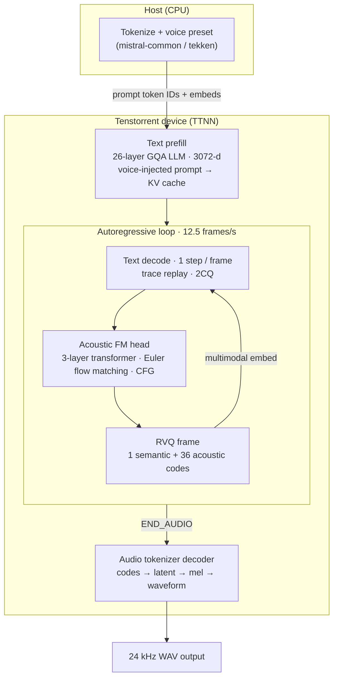

# Voxtral TTS

## 1. Introduction

Voxtral TTS (`mistralai/Voxtral-4B-TTS-2603`) is Mistral AI's open-weights text-to-speech model. It supports nine languages (English, French, Spanish, Portuguese, Italian, Dutch, German, Arabic, and Hindi) at 24 kHz.

This directory contains the Tenstorrent TTNN implementation of Voxtral TTS. Device implementations:

- **Text backbone** — 26-layer, 3072-dim LLM that decodes interleaved text and acoustic tokens (GQA: 32 heads / 8 KV heads, vocab 131072)
- **Acoustic transformer (Flow Matching head)** — 3-layer flow-matching refinement, same hidden size, produces continuous latents at 12.5 frames/s
- **Audio tokenizer decoder** — 1024-dim transformer that maps latents to 24 kHz waveform samples (8 heads, 36-codebook residual VQ output)

The host handles tokenization, voice-embedding preparation, and lightweight generation control/staging. The autoregressive decode path uses TTNN execution, with trace and 2-CQ async dispatch available for the text/acoustic loop.

### 1.1 Architecture

Voxtral TTS is a three-stage pipeline: a **text backbone** autoregressively predicts discrete acoustic codes frame-by-frame; an **acoustic flow-matching head** refines each frame; an **audio tokenizer decoder** turns the full code sequence into a 24 kHz waveform. On Tenstorrent hardware the text backbone, acoustic head, and audio decoder all run on-device via TTNN; only tokenization and voice-preset setup stay on the host.



| Stage | Model | Role |
|-------|-------|------|
| **Text backbone** | 26-layer Ministral-style LLM (GQA 32/8, vocab 131072) | Prefills the speech prompt, then decodes one multimodal token per acoustic frame; hidden states drive the acoustic head |
| **Acoustic FM head** | 3-layer flow-matching transformer (3072-d) | Maps text hidden + noise → continuous latent; quantizes to 37 RVQ codes per frame (1 semantic + 36 acoustic) |
| **Audio tokenizer decoder** | 1024-d transformer + conv pretransform | Decodes the full `[1, 37, T]` code tensor to 24 kHz audio after generation completes |

Entry point: `tt/voxtral_tts.py` (`VoxtralTTSPipeline`). Demo CLI: `demo/demo.py`.

---

## 2. Installation

### Step 1 — Activate environment

Run these commands at the start of every session, from the repo root:

```bash
source python_env/bin/activate
export TT_METAL_HOME=$(pwd)
export PYTHONPATH=$(pwd)
export ARCH_NAME=blackhole_140_arch_eth_dispatch.yaml
```

> `TT_METAL_HOME` and `PYTHONPATH` must point to the repo root. Without them, `import ttnn` fails and all tests fail with confusing import errors.

### Step 2 — Install Python packages

Use `python_env/bin/python -m pip install` for all installs. The system `pip` does not install into the project virtualenv.

**Core and quality-metric packages** — single install from the repo root:

```bash
python_env/bin/python -m pip install -r models/experimental/voxtraltts/requirements.txt
```

That file adds quality-metric deps for `tests/pcc/test_voxtral_e2e_quality_metrics.py`: `speechbrain` (ECAPA-TDNN), `utmosv2` (UTMOS-v2), and `librosa`. Whisper WER uses `transformers` already in the tt-metal dev env (`requirements-dev.txt`), not a separate pin in this file. If any import is missing, the quality test is skipped rather than crashing the rest of the suite.

### Step 3 — Set model weights path

**Option A — HuggingFace repo ID (auto-download):**

```bash
export HF_MODEL=mistralai/Voxtral-4B-TTS-2603
```

Weights are downloaded on first use and cached in `~/.cache/huggingface/`.

**Option B — Local directory:**

```bash
export HF_MODEL=/path/to/local/weights
```

The directory must contain the `.safetensors` files. No download occurs.

---

## 3. Supported Devices

| Device | Mesh |
|--------|------|
| **P150** | 1×1 |
| **Blackhole Quiet Box 2 (BH QB2)** | 1×4 |

---

## 4. File Structure

```
models/experimental/voxtraltts/
├── requirements.txt             #   Core Python deps (Step 2 install)
├── demo/
│   ├── decode_trace_2cq.py      #   Trace + 2-CQ decode helpers
│   └── demo.py                  #   Full TT demo: text → WAV (device-resident)
├── reference/                   # CPU-only PyTorch reference
│   ├── audio_tokenizer_ops.py   #   Audio tokenizer decode ops (CPU reference)
│   ├── cpu_flow_matching_acoustic.py  #   CPU reference for the acoustic FM transformer
│   ├── cpu_reference.py         #   Full CPU inference pipeline (VoxtralCPUReference)
│   ├── demo_reference.py        #   CPU reference demo CLI
│   ├── functional.py            #   Layer-level functions (RMSNorm, attention, MLP, …)
│   ├── generate_golden.py       #   Generates golden tensors for unit tests
│   ├── golden/                  #   Committed golden tensors for unit tests
│   │   ├── acoustic_attention_golden.pt
│   │   ├── acoustic_layer_golden.pt
│   │   ├── rms_norm_golden.pt
│   │   ├── swiglu_mlp_golden.pt
│   │   ├── text_attention_golden.pt
│   │   └── text_decoder_layer_golden.pt
│   ├── voxtral_config.py        #   Model config dataclasses + weight loading
│   ├── voxtral_request.py       #   Tokenizer + SpeechRequest construction (mistral-common)
│   └── reference_outputs/       #   Golden codes fixture + generator script
│       ├── generate_voxtral_golden_codes.py
│       └── voxtral_golden_codes.refpt
├── conftest.py                  #   Pytest fixtures (device mesh, trace reset)
├── tests/                       # Test modules only (unit, PCC, perf)
│   ├── audio_tokenizer_workload.py       #   Audio tokenizer test workload helpers
│   ├── pcc/                     #   E2E waveform PCC + quality-metric tests
│   │   ├── test_voxtral_e2e_pcc.py              #   E2E PCC: teacher-forced + free-run
│   │   └── test_voxtral_e2e_quality_metrics.py  #   UTMOS / WER / speaker similarity
│   ├── perf/                    #   Wall-clock and device-perf tests
│   │   ├── test_e2e_performant.py               #   E2E wall-clock (trace-enabled)
│   │   └── test_voxtral_tts_device_perf.py      #   Full model device perf
│   ├── test_acoustic_model.py                      #   Acoustic FM module PCC (forward + Euler)
│   ├── test_audio_tokenizer_decoder_stack.py       #   Audio tokenizer decoder stack PCC
│   ├── test_audio_tokenizer_full_decode.py         #   Audio tokenizer codes → waveform PCC
│   ├── test_audio_tokenizer_opt.py                 #   Full tokenizer decode perf harness
│   └── test_text_model.py                          #   Text backbone prefill/decode logit PCC
├── tt/                          # TTNN on-device implementations
│   ├── acoustic_model.py        #   Acoustic flow-matching head
│   ├── attention.py             #   GQA attention (acoustic / audio tokenizer paths)
│   ├── audio_tokenizer/         #   Audio tokenizer decode (encoder + decoder stack)
│   │   ├── conv.py
│   │   ├── embedding.py
│   │   ├── model.py
│   │   ├── quantizer.py
│   │   └── transformer.py
│   ├── mlp.py                   #   SwiGLU MLP (acoustic / shared primitives)
│   ├── rmsnorm.py               #   RMSNorm (acoustic path)
│   ├── text_attention.py        #   Voxtral text attention (extends text_backbone; interleaved-wo decode opt)
│   ├── text_backbone/           #   Vendored text transformer framework (no tt_transformers runtime dep)
│   │   ├── attention.py         #   Base GQA attention (prefill + decode)
│   │   ├── ccl.py               #   Collective comms helpers (all-gather / all-reduce)
│   │   ├── common.py            #   Mode, mesh helpers, paged-attention config
│   │   ├── decoder.py           #   Transformer decoder block
│   │   ├── distributed_norm.py  #   TP-aware norm wrappers
│   │   ├── embedding.py         #   Token embeddings
│   │   ├── lm_head.py           #   LM head + sampling logits
│   │   ├── load_checkpoints.py  #   HF checkpoint key remapping / load
│   │   ├── mlp.py               #   SwiGLU MLP
│   │   ├── mixtral_mlp.py       #   Mixtral MoE MLP (unused on Voxtral dense text)
│   │   ├── mixtral_moe.py       #   Mixtral MoE router (unused on Voxtral dense text)
│   │   ├── model.py             #   Full text Transformer (prefill + decode)
│   │   ├── model_config.py      #   Program configs, mem configs, optimisation hooks
│   │   ├── prefetcher.py        #   Weight prefetch for decode
│   │   ├── prefetcher/          #   Prefetcher YAML config
│   │   ├── rmsnorm.py           #   RMSNorm
│   │   └── rope.py              #   RoPE setup + rotation mats
│   ├── text_decoder_layer.py    #   HF/Voxtral checkpoint key remapping for text weights
│   ├── text_mlp.py              #   Voxtral text MLP (extends text_backbone; fused-SiLU decode opt)
│   ├── text_model.py            #   VoxtralTTTextModel wrapper over text_backbone Transformer
│   ├── text_rmsnorm.py          #   FP32-promoting RMSNorm for text stack (HF-faithful)
│   ├── voxtral_tt_args.py       #   Model args, program configs, optimisation presets
│   └── voxtral_tts.py           #   VoxtralTTSPipeline (top-level inference entry point)
└── utils/
    ├── audio_tokenizer_optimizations.py  #   Optimisation preset factories
    ├── config_helpers.py                 #   Compute kernel configs (acoustic, semantic, …)
    ├── debug_trace.py                    #   Debug and trace utilities
    ├── mesh.py                           #   MESH_DEVICE topology, replicate/TP upload, mesh readback
    └── common.py                         #   Shared test/demo helpers (prompt text, mesh open, model loaders)
```

---

## 5. Tests

All tests require the environment from [Section 2](#2-installation) and `HF_MODEL` set (same convention as other models in `tests/pipeline_reorg/`).

### 5.0 Test taxonomy

| Layer | Location | Teacher-forced | Free-run |
|-------|----------|----------------|----------|
| **Unit** | `test_text_model.py`, `test_acoustic_model.py`, `test_audio_tokenizer_*.py` | Text logits (HF + fixed tokens), acoustic, tokenizer | — |
| **E2E PCC** | `tests/pcc/test_voxtral_e2e_pcc.py` | `golden_codes_pcc`, `acoustic_pcc`, `pipeline_teacher_forced_pcc` | `staged_pcc` (diagnostic) |
| **E2E quality** | `tests/pcc/test_voxtral_e2e_quality_metrics.py` | — | MOS / WER / speaker sim |
| **E2E perf** | `tests/perf/test_e2e_performant.py` | — | Wall-clock RTF / TTFA |
| **Demo** | `demo/demo.py` | — | Full generate |

With `CI=true`, text unit tests cap prompt ISL at **4096** (prefill rows above 4096 and tail decode rows at 65504 / 65280 are skipped). E2E free-run uses **`VOXTRAL_E2E_FREE_RUN_STEPS=32`** (override locally with the same env var).

Local-only text tail rows in `test_text_model.py` (not run under `CI=true`):

| Test | Prompt ISL | Decode steps | Notes |
|------|------------|--------------|-------|
| `test_text_model_prefill_logit_pcc` | 65504 | — | Last-token prefill at max KV budget |
| `test_text_model_decode_multistep_logit_pcc` | 65504 | 32 | Tail prompt + short decode |
| `test_text_model_decode_multistep_logit_pcc` | 65280 | 256 | Full KV timeline (`VOXTRAL_DECODE_256STEP=0` to skip) |

### 5.1 Unit tests

Single-module correctness checks (no op-level matmul/conv/attention bring-up tests).

```bash
# Text backbone logit PCC (prefill + decode); long ISL sweeps on P150 (1×1)
export MESH_DEVICE=P150
pytest models/experimental/voxtraltts/tests/test_text_model.py -sv

# Audio tokenizer module PCC
pytest models/experimental/voxtraltts/tests/test_audio_tokenizer_full_decode.py -sv
pytest models/experimental/voxtraltts/tests/test_audio_tokenizer_decoder_stack.py -sv

# Acoustic FM module PCC
pytest models/experimental/voxtraltts/tests/test_acoustic_model.py -sv

# Run all unit tests at once (excludes E2E PCC and perf)
pytest models/experimental/voxtraltts/tests/ \
    --ignore=models/experimental/voxtraltts/tests/pcc \
    --ignore=models/experimental/voxtraltts/tests/perf -sv

# QB2 tensor-parallel text (same unit files as P150)
export MESH_DEVICE=P150x4
pytest models/experimental/voxtraltts/tests/test_text_model.py \
    models/experimental/voxtraltts/tests/test_acoustic_model.py \
    models/experimental/voxtraltts/tests/test_audio_tokenizer_decoder_stack.py \
    models/experimental/voxtraltts/tests/test_audio_tokenizer_full_decode.py \
    models/experimental/voxtraltts/tests/test_audio_tokenizer_opt.py -sv
```

### 5.2 PCC / accuracy tests

These tests compare TT hardware output against a float32 CPU reference and assert that Pearson Correlation Coefficient (PCC) is above a threshold. PCC of 1.0 means perfect numerical match; ≥ 0.99 is the standard pass threshold.

#### Prerequisites

From the repo root, after [Section 2](#2-installation):

```bash
export HF_MODEL=mistralai/Voxtral-4B-TTS-2603
export TT_CACHE_PATH=/mnt/MLPerf/huggingface/tt_cache/mistralai--Voxtral-4B-TTS-2603
export ARCH_NAME=blackhole_140_arch_eth_dispatch.yaml
```

Optional mesh selection via ``MESH_DEVICE`` (default is **1×1** when unset; set **P150x4** on BH QB2 for tensor-parallel text):

```bash
export MESH_DEVICE=P150    # 1×1 single-device compute (default)
export MESH_DEVICE=P150x4  # QB2 only — TP text on full 1×4 chassis mesh
```

Trace is **on by default** for the demo and for tests that call `configure_decode_trace()` (see `demo/decode_trace_2cq.py`; disable with `--no-decode-trace`). **2CQ is also on by default** (`decode_trace_2cq=True`; disable with `--no-decode-trace-2cq`). These flags are set in code/CLI, not via `VOXTRAL_DECODE_TRACE*` environment variables.

#### CI (GitHub Actions)

Voxtral jobs use the canonical Blackhole cache layout (`HF_HOME`, `HF_MODEL`, `TT_CACHE_PATH` — see headers in `tests/pipeline_reorg/*.yaml`).

| Pipeline | Job | Hardware | Tier |
|----------|-----|----------|------|
| `models_unit_tests.yaml` | Voxtral TTS component unit tests | P150 (`bh_p150`) | T2 |
| `models_unit_tests.yaml` | Voxtral TTS component unit tests (TP text) | QB2 (`bh_quietbox_2`, `MESH_DEVICE=P150x4`) | T2 |
| `models_e2e_tests.yaml` | E2E PCC (teacher-forced + free-run diagnostic) | P150 only | T3 |
| `models_e2e_tests.yaml` | E2E quality metrics (free-run; `hit_end` gate) | P150 only | T3 |
| `models_e2e_tests.yaml` | E2E perf (`test_e2e_performant.py -k F128`) | P150 only | T2 |
| `models_device_perf_tests.yaml` | Device perf | P150 | — |
| `blackhole_demo_tests.yaml` | Demo smoke WAV | P150 + QB2 (`MESH_DEVICE=P150x4`) | T1 |

E2E PCC command (teacher-forced subset plus free-run diagnostic):

```bash
export CI=true
export VOXTRAL_E2E_FREE_RUN_STEPS=32
pytest models/experimental/voxtraltts/tests/pcc/test_voxtral_e2e_pcc.py \
  -k "golden_codes_pcc or pipeline_teacher_forced_pcc or acoustic_pcc or staged_pcc" \
  -sv --timeout=3600
```

Local dry-run of the unit suite (excludes `tests/pcc` and `tests/perf`):

```bash
export HF_MODEL=mistralai/Voxtral-4B-TTS-2603
export TT_CACHE_PATH=/mnt/MLPerf/huggingface/tt_cache/mistralai--Voxtral-4B-TTS-2603
export CI=true
pytest models/experimental/voxtraltts/tests/ \
  --ignore=models/experimental/voxtraltts/tests/pcc \
  --ignore=models/experimental/voxtraltts/tests/perf \
  -q --timeout=3600
```

#### E2E waveform PCC (P150 1×1 and QB2 1×4)

Default CI runs on **P150 (1×1)**. For QB2, set `MESH_DEVICE=P150x4`; measured results are in [§6.1](#61-pcc-targets-accuracy).

Run all four end-to-end tests (~1–2 h cold cache):

```bash
pytest models/experimental/voxtraltts/tests/pcc/test_voxtral_e2e_pcc.py -sv --timeout=0
```

Or run individually:

| Test | What it validates | Pass threshold | Measured (P150 1×1) | QB2 (1×4) |
|------|-------------------|----------------|---------------------|-----------|
| `test_ttnn_voxtral_tts_golden_codes_pcc` | Audio tokenizer only | PCC ≥ 0.99 | **0.9989** | Pass (≥ 0.99) |
| `test_ttnn_voxtral_tts_acoustic_pcc` | Acoustic FM only (isolated) | PCC ≥ 0.97 | **0.98** | Pass (≥ 0.97) |
| `test_ttnn_voxtral_tts_pipeline_teacher_forced_pcc` | Text + acoustic + tokenizer (teacher-forced) | PCC ≥ 0.97 | **0.979** | **0.988** |
| `test_ttnn_voxtral_tts_staged_pcc` | Free-run diagnostic | diagnostic | ~0.957 | TBD |

**`test_ttnn_voxtral_tts_golden_codes_pcc`** — Audio tokenizer in isolation. Fixed `[1, 37, T]` codes from `reference/reference_outputs/voxtral_golden_codes.refpt` are fed to both the CPU reference tokenizer and the TT audio tokenizer; waveforms are compared with PCC. No text model or acoustic model runs.

**`test_ttnn_voxtral_tts_acoustic_pcc`** — Acoustic model in isolation. Precomputed golden text hidden states from the reference fixture are fed directly as input to both CPU and TT acoustic models each step, with the same FM noise seed and no text model or code feedback. Each side produces its own acoustic codes; both code streams are decoded through the **same reference tokenizer** (held constant so only the acoustic implementation differs). The resulting waveforms are compared with PCC.

**`test_ttnn_voxtral_tts_pipeline_teacher_forced_pcc`** — Full pipeline teacher-forced. Validates the text model, acoustic model, and tokenizer together. CPU and TT are both prefilled on the same prompt and run live each step (text decode → acoustic FM → codes). To prevent autoregressive divergence from accumulating, **golden codes are fed back into both text models at every step** instead of each side's own output. Each side still produces its own acoustic codes from its own hidden states; CPU codes go through the reference tokenizer and TT codes through the TT tokenizer. The two waveforms are compared with PCC.

**`test_ttnn_voxtral_tts_staged_pcc`** — Free-run diagnostic. TT runs the full autoregressive loop without golden feedback and is compared against CPU; results are logged for analysis.

```bash
pytest models/experimental/voxtraltts/tests/pcc/test_voxtral_e2e_pcc.py::test_ttnn_voxtral_tts_golden_codes_pcc -sv --timeout=0
pytest models/experimental/voxtraltts/tests/pcc/test_voxtral_e2e_pcc.py::test_ttnn_voxtral_tts_acoustic_pcc -sv --timeout=0
pytest models/experimental/voxtraltts/tests/pcc/test_voxtral_e2e_pcc.py::test_ttnn_voxtral_tts_pipeline_teacher_forced_pcc -sv --timeout=0
pytest models/experimental/voxtraltts/tests/pcc/test_voxtral_e2e_pcc.py::test_ttnn_voxtral_tts_staged_pcc -sv --timeout=0
```

E2E tests use the standard ~500-character prompt (`VOXTRAL_STANDARD_CHAR_TEXT` in `utils/common.py`) and `voxtral_text_hf_aligned_optimizations` for numerical fidelity.

**PCC environment overrides**

| Variable | Default | Description |
|----------|---------|-------------|
| `VOXTRAL_GOLDEN_CODES_PT` | `reference/reference_outputs/voxtral_golden_codes.refpt` | Path to golden codes + text hiddens fixture |
| `VOXTRAL_ACOUSTIC_PCC` | `0.97` | Minimum waveform PCC for `test_ttnn_voxtral_tts_acoustic_pcc` |
| `VOXTRAL_PIPELINE_TF_PCC` | `0.97` | Minimum waveform PCC for `test_ttnn_voxtral_tts_pipeline_teacher_forced_pcc` |
| `VOXTRAL_E2E_FREE_RUN_STEPS` | `32` in CI, `1` locally | Free-run steps for `test_ttnn_voxtral_tts_staged_pcc` |
| `VOXTRAL_TRACE_REGION_SIZE` | `200000000` | Trace capture region size (bytes) for pytest device open |

Regenerate the golden fixture (one-time, then commit):

```bash
python models/experimental/voxtraltts/reference/reference_outputs/generate_voxtral_golden_codes.py
```

#### Component / module PCC

```bash
# Text backbone — prefill last-token logits PCC (128…65504); P150 (1×1)
export MESH_DEVICE=P150
pytest models/experimental/voxtraltts/tests/test_text_model.py::test_text_model_prefill_logit_pcc -sv

# Text backbone — teacher-forced decode logits PCC (32-step CI + tail rows)
pytest models/experimental/voxtraltts/tests/test_text_model.py::test_text_model_decode_multistep_logit_pcc -sv

# Acoustic FM — full forward + Euler stepwise PCC vs CPU
pytest models/experimental/voxtraltts/tests/test_acoustic_model.py -sv
```

#### E2E quality metrics (UTMOS, WER, speaker similarity)

These metrics are adopted from the Voxtral paper's evaluation protocol:
- **UTMOS** (MOS predictor) — measures perceived naturalness of the generated speech without needing human listeners.
- **WER** (Word Error Rate via Whisper) — verifies that the synthesised speech is intelligible and the correct words were produced. Whisper is used instead of Voxtral's own transcription because Voxtral transcribe requires a Mistral API key, whereas Whisper is open-source and requires no API key.
- **Speaker similarity** (SpeechBrain ECAPA-TDNN cosine score) — checks that the output voice matches the requested speaker embedding, confirming voice identity is preserved end-to-end.

Requires packages from `requirements.txt` (`utmosv2`, `speechbrain`, `librosa`) plus `transformers` from the tt-metal dev environment (Whisper WER). If these imports are missing, the test is skipped.

CI runs this as a **separate job** from E2E PCC (see [§5.2 CI](#ci-github-actions)): different test file, voice (`cheerful_female`), free-run setup (`text_max_seq_len=2048`, up to 1500 speech tokens), and heavier optional deps. **CI gate:** generation must reach `END_AUDIO` (`hit_end`); UTMOS, WER, and ECAPA are logged against the targets below but not asserted.

```bash
pytest models/experimental/voxtraltts/tests/pcc/test_voxtral_e2e_quality_metrics.py -sv --timeout=0
```

### 5.3 Performance tests

#### Wall-clock E2E (frames/s, TTFA) — trace + 2CQ on by default

```bash
pytest models/experimental/voxtraltts/tests/perf/test_e2e_performant.py -sv --timeout=0
```

Reports: per-frame decode time (ms/frame), throughput (frames/s), and time-to-first-audio (TTFA ms).

#### Full-pipeline ISL sweep (Tale of Two Cities)

```bash
export MESH_DEVICE=P150
pytest models/experimental/voxtraltts/tests/perf/test_e2e_isl_sweep_perf.py -sv --timeout=0
```

See [§6.3](#63-e2e-perf-test-trace--2cq) for `test_e2e_performant.py` throughput (P150 and QB2) and [§6.4](#64-performance-verification) for demo sweep perf (RTF, latency, throughput).

#### Full model device perf

```bash
pytest models/experimental/voxtraltts/tests/perf/test_voxtral_tts_device_perf.py -sv --timeout=0
```

### 5.4 Demo

Full TT inference demo: text (or pre-computed codes/latents) → `.wav` on device. Trace replay is **on by default** on P150 and BH QB2.

With no CLI flags, the demo uses the shared ~500-character standard prompt (`VOXTRAL_STANDARD_CHAR_TEXT` in `utils/common.py`), voice `cheerful_female` (`DEMO_DEFAULT_VOICE` in `demo/demo.py`), `text_max_seq_len=65536`, paged KV (on by default), and `max_speech_tokens=0` (use the full decode budget after the prompt). CI jobs run the same default path with `warmup_iters=1` so the timed `run` pass uses trace replay (compile/capture happen on the untimed warmup pass).

After the device opens, the demo logs a **KV memory budget** check using actual device DRAM (`ttnn.get_memory_view`) and Voxtral-specific layer count (26 text layers) — not a hardcoded P150 32 GB assumption.

#### Prerequisites

Same as [Section 2](#2-installation). Minimal session setup:

```bash
source python_env/bin/activate
export TT_METAL_HOME=$(pwd)
export PYTHONPATH=$(pwd)
export ARCH_NAME=blackhole_140_arch_eth_dispatch.yaml
export HF_MODEL=mistralai/Voxtral-4B-TTS-2603
python_env/bin/python -m pip install -r models/experimental/voxtraltts/requirements.txt
```

#### P150 (1×1)

```bash
export MESH_DEVICE=P150
python models/experimental/voxtraltts/demo/demo.py
```

Output: `models/experimental/voxtraltts/voxtraltts_demo_output/run_item0.wav` (and `.codes.pt` sidecar when generated).

#### BH QB2 (1×4 tensor-parallel text)

```bash
export MESH_DEVICE=P150x4
python models/experimental/voxtraltts/demo/demo.py
```

#### Prompt length and chunking

By default, prompts with **≤180 words** (`--single-pass-max-words`, see `DEMO_DEFAULT_SINGLE_PASS_MAX_WORDS` in `demo/demo.py`) run as **one autoregressive pass**. Above that limit, the demo **splits on sentence boundaries**, generates each chunk separately, then trims, level-matches, brightness-matches, and crossfades the waveforms.

#### Customizing a local run

Override any default on the command line — CI uses the defaults above with no extra flags:

```bash
python models/experimental/voxtraltts/demo/demo.py \
    --text "Paris is a beautiful city in the heart of Europe." \
    --output-dir /tmp/voxtral_out \
    --text-max-seq-len 4096 \
    --max-speech-tokens 5000 \
    --warmup-iters 1
```

Quick smoke (short text, few acoustic frames):

```bash
python models/experimental/voxtraltts/demo/demo.py \
    --text "Hello from Voxtral." \
    --max-speech-tokens 256
```

#### Demo CLI parameters

Run `python models/experimental/voxtraltts/demo/demo.py --help` for the live list. All flags below are defined in `demo/demo.py`.

**Text generation (`--mode text`)**

| Parameter | Default | Description |
|-----------|---------|-------------|
| `--text` | `VOXTRAL_STANDARD_CHAR_TEXT` (~500 chars) | Prompt text; omit to use the shared standard prompt (same as PCC / perf tests) |
| `--default-voice NAME` | `cheerful_female` | Voice when neither `--voice` nor a JSONL `voice` field is set |
| `--text-max-seq-len` | `65536` | Maximum text tokens for prefill / KV cache length (text + speech timeline) |
| `--max-speech-tokens` | `0` | Max autoregressive acoustic frames; `0` uses the full decode budget (`text_max_seq_len − prompt_seq_len`). Set an explicit cap (e.g. `64` for smoke) or a lower bound as needed |
| `--single-pass-max-words` | `180` | Prompts with at most this many words use one AR pass; longer prompts are sentence-chunked and crossfaded |
| `--seed` | `0` | RNG seed for flow-matching noise (reproducible acoustic sampling) |
| `--warmup-iters` | `1` | Untimed warmup passes before the measured run (compile + trace capture; set `0` to skip). Skipped when trace is disabled via `--no-decode-trace` |

**KV cache / long prompts (`--mode text`)**

| Parameter | Default | Description |
|-----------|---------|-------------|
| *(paged KV)* | **on** | Paged attention is enabled by default at all sequence lengths |
| `--no-paged-kv-cache` | off (flag) | Disable paged KV; use default (non-paged) attention instead |
| `--paged-block-size` | `32` | KV block size for paged attention (must be a multiple of 32) |

**Audio decode quality (`--mode text`, `codes`, `latents`)**

| Parameter | Default | Description |
|-----------|---------|-------------|
| *(default)* | dense ALiBi SDPA | Default — full causal + sliding-window ALiBi mask; cleanest waveform |
| `--native-sdpa` | off (flag) | Use native sliding-window SDPA for the audio tokenizer decode path (faster; may add audible hiss) |

**Text backbone fidelity (`--mode text`)**

| Parameter | Default | Description |
|-----------|---------|-------------|
| *(default)* | default opts | BFP8 weights + HiFi2 decode matmuls + fused paths |
| `--hf-aligned-text` | off (flag) | HF-aligned text decode: BF16/HiFi4 settings (slower; higher PCC — use for accuracy debugging) |

**Trace (`--mode text`)**

| Parameter | Default | Description |
|-----------|---------|-------------|
| *(default)* | trace **on** | Traced AR text-decode replay (`--no-decode-trace` to disable) |
| *(default)* | 2CQ **on** | Second command queue for overlapped decode input staging (`--no-decode-trace-2cq` to disable) |
| `--no-decode-trace` | off (flag) | Disable trace replay; slower direct forward per AR step |

#### CPU reference demo (no TT hardware)

Host-only PyTorch reference — useful for golden outputs and PCC baselines without a Tenstorrent device:

```bash
python -m models.experimental.voxtraltts.reference.demo_reference \
    --model mistralai/Voxtral-4B-TTS-2603 \
    --text "Paris is a beautiful city in the heart of Europe." \
    --voice casual_male \
    --write-audio \
    --output-dir output_audio
```

#### Demo environment variables

These are read by `demo.py` / the pipeline in addition to the CLI flags above. Session variables from [Section 2](#2-installation) (`TT_METAL_HOME`, `PYTHONPATH`, `ARCH_NAME`) are also required.

| Variable | Default | Description |
|----------|---------|-------------|
| `HF_MODEL` | `mistralai/Voxtral-4B-TTS-2603` | Model weights path or HF repo ID (used when `--model` is omitted; same as other models pipelines) |
| `MESH_DEVICE` | unset → `P150` (1×1) | Compute mesh: `P150` (1×1 submesh on QB2) or `P150x4` (QB2 tensor-parallel text) |

---

## 6. Performance and Accuracy

### 6.1 PCC targets (accuracy)

| Test | Target | Measured (P150) |
|:-----|:------:|:--------:|
| Text prefill logits | ≥ 0.99 (≤4096) | **0.996–0.999** |
| Text decode multistep (32 steps) | ≥ 0.98 | **≥ 0.998** |
| `test_ttnn_voxtral_tts_golden_codes_pcc` (audio tokenizer) | ≥ 0.99 | **0.9989** |
| `test_ttnn_voxtral_tts_acoustic_pcc` (acoustic FM isolation) | ≥ 0.97 | **0.98** |
| `test_ttnn_voxtral_tts_pipeline_teacher_forced_pcc` (pipeline teacher-forced) | ≥ 0.97 | **0.979**|

#### 6.1.1 Text logit PCC (P150 1×1)

Measured on **P150 (1×1)** with `MESH_DEVICE=P150`, Tale of Two Cities prompt tokens, paged KV (`max_seq_len=65536`), and `voxtral_text_logits_pcc_optimizations` (BF16 weights + HiFi4). Long ISL prefill PCC is below 0.99; thresholds in `test_text_model.py` are tiered accordingly.

**Prefill — last-token logit PCC vs HF**

| Prompt ISL | Measured PCC |
|:-----------|:------------:|
| 128 | 0.996 |
| 256 | 0.999 |
| 512 | 0.999 |
| 1024 | 0.998 |
| 2048 | 0.998 |
| 4096 | 0.998 |
| 8192 | 0.960 |
| 16384 | 0.943 |
| 32768 | 0.972 |

**Decode multistep — min per-step logit PCC over 32 teacher-forced steps**

| Prompt ISL | Min step PCC |
|:-----------|:------------:|
| 8192 | 0.998 |
| 16384 | 0.998 |

### 6.2 Quality metrics

Logged by `test_ttnn_voxtral_tts_500_char_quality_and_perf` (free-run, voice `cheerful_female`). CI asserts `hit_end` only; other columns are reference targets and measured values.

| Metric | Tool | Reference target | P150 | QB2 (1×4) |
|:-------|:----:|:----------------:|:----:|:---------:|
| MOS (naturalness) | UTMOS-v2 | ≥ 3.0 | **3.215** | **3.285** |
| Word Error Rate | Whisper Small | < 10% | **1.39%** | **1.39%** |
| Speaker similarity | SpeechBrain ECAPA-TDNN | ≥ 0.55 cosine | **0.7187** | **0.6848** |

> Audio is produced at 12.5 acoustic frames/s at 24 kHz. Real-time factor = `frames_per_s / 12.5`. A value > 1.0 means faster than real time.

### 6.3 E2E perf test (trace + 2CQ)

From `tests/perf/test_e2e_performant.py` with trace + 2CQ enabled, voice `casual_male`, and `fixed_step_count=True`. Throughput is measured on the fixed decode step count (not the trimmed audio frames kept before `END_AUDIO`).

| Decode steps | P150 ms/frame | P150 frames/s | P150 RTF | QB2 ms/frame | QB2 frames/s | QB2 RTF |
|:-------------|-------------:|--------------:|---------:|-------------:|-------------:|--------:|
| F128 (128)   | **65.0**     | **15.39**     | **1.23** | **102.3**    | **9.78**     | **0.78** |
| F589 (589)   | **41.6**     | **24.04**     | **1.92** | **42.3**     | **23.62**    | **1.89** |

### 6.4 Performance Verification

Verified using `demo/demo.py`

#### P150 (1×1)

##### Trace enabled + 2CQ

###### `casual_male`

| text_max_seq_len | ISL (text chars / audio tokens) | Latency (ms) | RTF    | Throughput (char/s) |
|:-----------------|:--------------------------------|-------------:|-------:|--------------------:|
| 512              | 255 chars / 209 audio tokens    | 13649.12     | 0.8163 | 18.68               |
| 1024             | 514 chars / 392 audio tokens    | 21914.94     | 0.6988 | 23.45               |
| 4096             | 514 chars / 392 audio tokens    | 22015.82     | 0.7020 | 23.35               |
| 16384            | 514 chars / 392 audio tokens    | 22416.36     | 0.7148 | 22.93               |
| 64000            | 514 chars / 392 audio tokens    | 22037.20     | 0.7027 | 23.32               |
| 65536            | 514 chars / 392 audio tokens    | 21793.18     | 0.6949 | 23.59               |

###### `cheerful_female`

| text_max_seq_len | ISL (text chars / audio tokens) | Latency (ms) | RTF    | Throughput (char/s) |
|:-----------------|:--------------------------------|-------------:|-------:|--------------------:|
| 512              | 255 chars / 299 audio tokens    | 16818.59     | 0.7031 | 15.16               |
| 1024             | 514 chars / 458 audio tokens    | 24115.93     | 0.6582 | 21.31               |
| 4096             | 514 chars / 458 audio tokens    | 24585.80     | 0.6710 | 20.91               |
| 16384            | 514 chars / 458 audio tokens    | 24200.32     | 0.6605 | 21.24               |
| 64000            | 514 chars / 458 audio tokens    | 24301.64     | 0.6633 | 21.15               |
| 65536            | 514 chars / 458 audio tokens    | 23972.96     | 0.6543 | 21.44               |

##### Trace disabled (`--no-decode-trace`)

###### `casual_male`

| text_max_seq_len | ISL (text chars / audio tokens) | Latency (ms) | RTF    | Throughput (char/s) |
|:-----------------|:--------------------------------|-------------:|-------:|--------------------:|
| 512              | 255 chars / 209 audio tokens    | 49246.43     | 2.2884 | 5.18                |
| 1024             | 514 chars / 392 audio tokens    | 93779.61     | 1.8231 | 5.48                |
| 4096             | 514 chars / 392 audio tokens    | 93246.17     | 1.8127 | 5.51                |
| 16384            | 514 chars / 392 audio tokens    | 92940.25     | 1.8068 | 5.53                |
| 64000            | 514 chars / 392 audio tokens    | 92422.65     | 1.7967 | 5.56                |
| 65536            | 514 chars / 392 audio tokens    | 93695.71     | 1.8215 | 5.49                |

###### `cheerful_female`

| text_max_seq_len | ISL (text chars / audio tokens) | Latency (ms) | RTF    | Throughput (char/s) |
|:-----------------|:--------------------------------|-------------:|-------:|--------------------:|
| 512              | 255 chars / 299 audio tokens    | 52755.37     | 1.7968 | 4.83                |
| 1024             | 514 chars / 458 audio tokens    | 93998.24     | 1.6030 | 5.47                |
| 4096             | 514 chars / 458 audio tokens    | 96404.77     | 1.6440 | 5.33                |
| 16384            | 514 chars / 458 audio tokens    | 94806.01     | 1.6167 | 5.42                |
| 64000            | 514 chars / 458 audio tokens    | 92893.81     | 1.5841 | 5.53                |
| 65536            | 514 chars / 458 audio tokens    | 94664.92     | 1.6143 | 5.43                |

#### BH QB2 (1×4)

Verified using `demo/demo.py` with `MESH_DEVICE=P150x4`.

##### Trace enabled + 2CQ

###### `casual_male`

| text_max_seq_len | text chars | RTF | Latency (ms) | Throughput (char/s) | Bitrate (Kbps) | First audio latency (ms) | frames/s |
|:-----------------|:-----------|----:|-------------:|--------------------:|---------------:|-------------------------:|---------:|
| 512 | 255 | 0.6864 | 13838.47 | 18.43 | 2.14 | 3361.48 | 18.21 |
| 1024 | 514 | 0.6297 | 22720.97 | 22.62 | 2.14 | 3957.86 | 19.85 |
| 4096 | 514 | 0.6306 | 22751.16 | 22.59 | 2.14 | 3969.72 | 19.82 |
| 16384 | 514 | 0.6253 | 22560.82 | 22.78 | 2.14 | 3984.97 | 19.99 |
| 64000 | 514 | 0.6292 | 22703.27 | 22.64 | 2.14 | 3947.68 | 19.86 |
| 65536 | 514 | 0.6238 | 22506.11 | 22.84 | 2.14 | 3949.11 | 20.04 |

###### `cheerful_female`

| text_max_seq_len | text chars | RTF | Latency (ms) | Throughput (char/s) | Bitrate (Kbps) | First audio latency (ms) | frames/s |
|:-----------------|:-----------|----:|-------------:|--------------------:|---------------:|-------------------------:|---------:|
| 512 | 255 | 0.6483 | 15144.32 | 16.84 | 2.14 | 3173.47 | 19.28 |
| 1024 | 514 | 0.6078 | 27275.86 | 18.84 | 2.14 | 3871.41 | 20.57 |
| 4096 | 514 | 0.6097 | 27364.54 | 18.78 | 2.14 | 3839.54 | 20.50 |
| 16384 | 514 | 0.6084 | 27306.31 | 18.82 | 2.14 | 3787.14 | 20.54 |
| 64000 | 514 | 0.6125 | 27490.72 | 18.70 | 2.14 | 3814.19 | 20.41 |
| 65536 | 514 | 0.6107 | 27410.13 | 18.75 | 2.14 | 3769.66 | 20.47 |

##### Trace disabled (`--no-decode-trace`)

###### `casual_male`

| text_max_seq_len | text chars | RTF | Latency (ms) | Throughput (char/s) | Bitrate (Kbps) | First audio latency (ms) | frames/s |
|:-----------------|:-----------|----:|-------------:|--------------------:|---------------:|-------------------------:|---------:|
| 512 | 255 | 1.6221 | 29328.21 | 8.69 | 2.14 | 9174.75 | 7.71 |
| 1024 | 514 | 1.6648 | 55405.64 | 9.28 | 2.14 | 10115.94 | 7.51 |
| 4096 | 514 | 1.4468 | 42476.71 | 12.10 | 2.14 | 10361.80 | 8.64 |
| 16384 | 514 | 1.6400 | 58122.28 | 8.84 | 2.14 | 10324.05 | 7.62 |
| 64000 | 514 | 1.3723 | 47975.48 | 10.71 | 2.14 | 10261.56 | 9.11 |
| 65536 | 514 | 1.4174 | 42862.95 | 11.99 | 2.14 | 10238.91 | 8.82 |

###### `cheerful_female`

| text_max_seq_len | text chars | RTF | Latency (ms) | Throughput (char/s) | Bitrate (Kbps) | First audio latency (ms) | frames/s |
|:-----------------|:-----------|----:|-------------:|--------------------:|---------------:|-------------------------:|---------:|
| 512 | 255 | 1.4068 | 33875.56 | 7.53 | 2.14 | 8124.37 | 8.89 |
| 1024 | 514 | 1.2364 | 54203.44 | 9.48 | 2.14 | 9689.78 | 10.11 |
| 4096 | 514 | 1.2706 | 51841.80 | 9.91 | 2.14 | 9716.55 | 9.84 |
| 16384 | 514 | 1.2427 | 62431.87 | 8.23 | 2.14 | 9802.60 | 10.06 |
| 64000 | 514 | 1.5847 | 66432.52 | 7.74 | 2.14 | 9894.93 | 7.89 |
| 65536 | 514 | 1.2308 | 54649.37 | 9.41 | 2.14 | 9932.85 | 10.16 |


#### Sizing `--text-max-seq-len` (why too small produces no output)

`--text-max-seq-len` sizes the whole text KV cache. That cache must hold the full prompt **and** every token generated during decode, so it sets a hard ceiling: `decode budget = text-max-seq-len − prompt_seq_len`.

The prompt is more than your `--text`. The tokenized speech request also prepends the voice-preset audio placeholder tokens and the protocol/special tokens, and these dominate the count. Example with `casual_male` (counts vary by voice) and the text `"Voxtral is a "`:

| Prompt part | Tokens |
|---|---:|
| Voice preset slots (`casual_male`) | ~147 |
| Protocol / special tokens | ~8 |
| Text (`"Voxtral is a "`) | ~3 |
| **Total `prompt_seq_len`** | **~158** |

Here `prompt_seq_len ≈ 158 > 128`, so with `--text-max-seq-len 128` the prompt does not even fit. `_max_decode_tokens()` raises *"Prompt token length (158) exceeds text KV cache (text_max_seq_len=128)"* before any acoustic frame is decoded, and **no `.wav` is written**.

The 128 limit is not special — any value at or below `prompt_seq_len` fails the same way, and `prompt_seq_len` grows with longer text and varies by voice. Set `--text-max-seq-len` above `prompt_seq_len` plus the frames you expect (~8 tokens/word). The default `65536` uses paged KV and supports long prompts plus full decode budget.

### 6.5 Demo verification

See [Section 5.4](#54-demo) for full CLI and environment-variable reference.

#### Default voice

`cheerful_female` — default for `demo/demo.py` (`DEMO_DEFAULT_VOICE`). E2E PCC tests in `tests/pcc/test_voxtral_e2e_pcc.py` use `casual_male`; quality metrics use `cheerful_female`.

#### Supported built-in voices (HF `.pt` presets)

These files ship inside `voice_embedding/` in the model weights and are loaded automatically by name.

| Voice name | Language / style |
|---|---|
| `cheerful_female` | English — cheerful female *(demo default)* |
| `casual_male` | English — casual male |
| `casual_female` | English — casual female |
| `neutral_male` | English — neutral male |
| `neutral_female` | English — neutral female |
| `fr_male` / `fr_female` | French |
| `de_male` / `de_female` | German |
| `es_male` / `es_female` | Spanish |
| `it_male` / `it_female` | Italian |
| `pt_male` / `pt_female` | Portuguese |
| `nl_male` / `nl_female` | Dutch |
| `hi_male` / `hi_female` | Hindi |
| `ar_male` | Arabic |

> Using an English voice for non-English text (or vice-versa) works but may reduce naturalness.

---

## 7. Caveats

### Long prompts and sentence chunking

The demo runs **one autoregressive pass** when the prompt has at most **180 words** (`DEMO_DEFAULT_SINGLE_PASS_MAX_WORDS` in `demo/demo.py`, overridable with `--single-pass-max-words`). Longer text is split on **sentence boundaries** into chunks of up to that word count; each chunk is synthesized separately, then waveforms are trimmed, level- and brightness-matched, and crossfaded. Chunking is demo-layer behavior only — it is not part of the core `VoxtralTTSPipeline` API. The default standard prompt (~500 characters) and CI demo stay under the single-pass limit.

### Teacher-forced vs free-run evaluation

Two methodologies are used to validate the autoregressive pipeline, and they answer different questions:

- **Teacher-forced** — at every decode step the same **golden** acoustic codes are fed into *both* the CPU reference and the TT model, instead of each side consuming its own previous output. Each side still produces its own codes/hidden states from its own compute, but because both are conditioned on the identical history, the two rollouts cannot drift apart. The resulting PCC measures per-step numerical fidelity. Teacher-forced PCC tests: `test_ttnn_voxtral_tts_pipeline_teacher_forced_pcc`, `_acoustic_pcc`, `_golden_codes_pcc`.

- **Free-run** (`test_ttnn_voxtral_tts_staged_pcc`, diagnostic) — TT runs the full autoregressive loop and feeds **its own** predicted codes back to itself, the same as live inference. The CPU reference does its own independent rollout.

### Why free-run PCC decreases with larger token generation

The text backbone emits **discrete** acoustic codes via FSQ (finite scalar) quantization. A code is the index of the quantization bin a continuous value lands in. Tiny per-step BF16 numerical differences between TT and CPU are normally harmless — but when a value sits near a quantization boundary, that small difference can push it into the *adjacent* bin and flip the emitted code.

Once TT and CPU emit a different discrete code at some step *k*, each side feeds its **own** code back as input, so from step *k* onward the two rollouts are conditioned on different histories and diverge — even if every subsequent per-step computation is itself accurate. Waveform PCC then reflects how far the two trajectories have walked apart, not the quality of the TT kernels.

This compounds with sequence length: the probability that at least one boundary flip has occurred grows with the number of steps, and every step *after* the first flip contributes additional divergence. So the longer the generation, the lower the free-run PCC — this is an inherent property of autoregressive discrete-code sampling, not a per-step accuracy regression in the TT implementation. Teacher-forcing exists precisely to factor this trajectory divergence out of the accuracy measurement.

### ASR model choice and WER number-formatting limitation

Whisper (`openai/whisper-small`) is used as the ASR model for the WER comparison because it is the open-source transcription model available without a paid API key — Voxtral's own transcription requires a Mistral API key — and it is also supported in TTNN. The WER is computed by transcribing the synthesized speech with Whisper and comparing the transcription against the input reference text.

A known limitation of this setup is **number formatting**. When the input reference text spells numbers out as words (for example, "twenty" rather than "20"), Whisper transcribes the spoken audio back into numeric digit form ("20"). The WER normalizer does not reconcile word-form and digit-form numbers, so each such number is counted as a word error even though the speech is correct. This inflates the reported WER percentage and means the metric can read worse than the actual intelligibility of the output. It is a known limitation of using Whisper as the WER reference ASR, not a defect in the generated speech.

### TTNN in-loop staging
On P150 free-run inference, moving in-loop steps fully to TTNN i.e device code→MM embedding, device FM noise (`VOXTRAL_ACOUSTIC_NOISE_RNG=ttnn`), and device-side code accumulation, has been observed to degrade audio quality or produce noise-only output. Host/torch fallbacks remain in use for audio quality.

---

## 8. Work in progress

1. **Text logit PCC** — tail prefill/decode rows at max KV length(64k)(see [§6.1.1](#611-text-logit-pcc-p150-11)). Also, for decode, verify results for 128/256/512/1024/2048/4096/32k ISL.
2. **BH QB2 optimizations** — kernel and memory-config tuning for 1×4 tensor-parallel text.
3. **Chunked-demo audio quality** — Prompts **>180 words** use sentence chunking + crossfade in `demo/demo.py`. Analyse and tune chunk-boundary smoothness (seams, level/timbre continuity, pacing); extend quality metrics (UTMOS / WER / listening tests) to multi-chunk stitched output.


## 9. References

- **Model card**: [mistralai/Voxtral-4B-TTS-2603](https://huggingface.co/mistralai/Voxtral-4B-TTS-2603)
- **Voxtral tts paper**: [arxiv:2603.25551](https://arxiv.org/pdf/2603.25551)
- **Voxtral paper**: [arxiv:2507.13264](https://arxiv.org/pdf/2507.13264)
- **Flow Matching for Generative Modeling   paper**: [arxiv:2210.02747](https://arxiv.org/abs/2210.02747)
- **Classifier-Free Diffusion Guidance  paper**: [arxiv:2207.12598](https://arxiv.org/abs/2207.12598)

---
