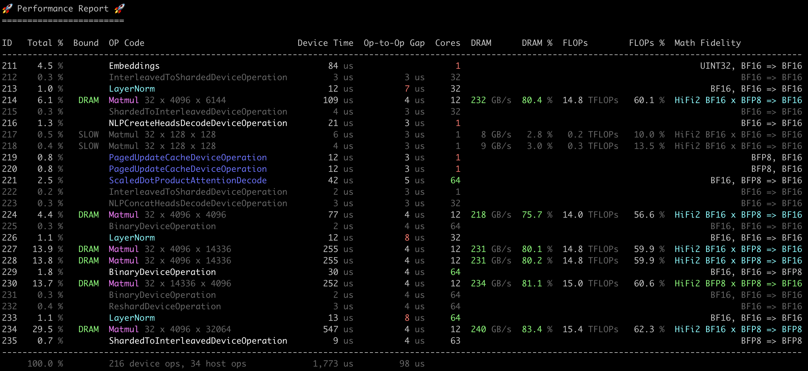

# Performance Report Analysis Tool



This has been moved to [tt-perf-report](https://github.com/tenstorrent/tt-perf-report). Short instructions:

```bash
pip install tt-perf-report
tt-perf-report your_metal_op_perf_report.csv
```

Contribute changes directly to [tt-perf-report](https://github.com/tenstorrent/tt-perf-report). If you don't have access, ping Mark on slack. Changes made in main there will automatically be rolled out to pip after a few minutes.
