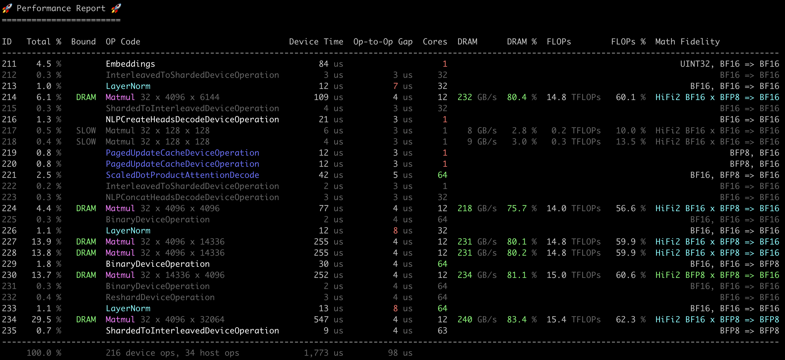

# Performance Report Analysis Tool



This has been moved to [tt-perf-report](https://github.com/tenstorrent/tt-perf-report). Short instructions:

```bash
pip install tt-perf-report
tt-perf-report your_metal_op_perf_report.csv
```

Contribute changes directly to [tt-perf-report](https://github.com/tenstorrent/tt-perf-report). If you don't have access, ping Mark on slack. Changes made in main there will automatically be rolled out to pip after a few minutes.

For wide `ops_perf_results_*.csv` files under `generated/profiler/reports/` (raw Tracy export), an in-repo text table helper lives at `tools/tracy/ops_perf_csv_to_report.py` (signpost trimming, matmul `M x K x N`, optional `--id global-call-count`). Example:

```bash
python3 tools/tracy/ops_perf_csv_to_report.py generated/profiler/reports/<date>/ops_perf_results_<date>.csv -o e2e_perf_report.txt
```
