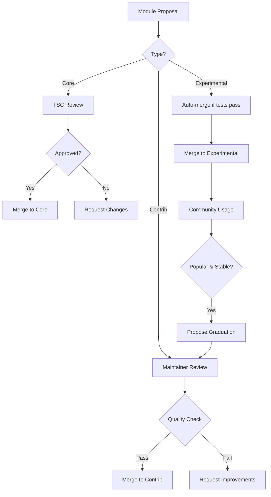

# TTTv2 Community Governance Design

## Overview

Community governance is critical for TTTv2's success in supporting 100+ models. Poor governance leads to fragmentation, quality issues, and maintenance nightmares. Good governance enables sustainable growth while maintaining quality and compatibility.

## Key Considerations That Impact TTTv2 Design

### 1. **API Stability vs Innovation**

**Challenge**: How to allow innovation while maintaining backward compatibility?

**Design Impact**:
- Strict semantic versioning enforcement
- Experimental API namespaces
- Deprecation policies

**Implementation**:
```python
# tt_transformers_v2/__init__.py
__all__ = [
    # Stable API
    "attention",
    "ffn",
    "normalization",

    # Experimental namespace for community innovations
    "experimental",  # Not covered by stability guarantees
]

# tt_transformers_v2/experimental/__init__.py
"""
Experimental features. APIs here may change without notice.
Graduate to stable API through governance process.
"""
```

### 2. **Quality Control vs Accessibility**

**Challenge**: How to maintain quality without creating barriers to contribution?

**Design Impact**:
- Tiered module system (core → contrib → community)
- Automated quality checks
- Clear contribution guidelines

**Implementation**:
```python
# Module tiers with different guarantees
class ModuleTier(Enum):
    CORE = "core"          # Maintained by TTT team, highest quality
    CONTRIB = "contrib"    # Community maintained, reviewed
    COMMUNITY = "community"  # Community maintained, minimal review
    EXPERIMENTAL = "experimental"  # No guarantees

@register_module(
    name="flash-attention-v3",
    category="attention",
    tier=ModuleTier.CONTRIB,  # Indicates quality level
    maintainers=["@researcher1", "@researcher2"],
    min_ttt_version="2.1.0",
    max_ttt_version="3.0.0"
)
```

### 3. **Naming Conflicts and Namespacing**

**Challenge**: How to handle naming conflicts as community grows?

**Design Impact**:
- Hierarchical namespacing
- Organization prefixes
- Conflict resolution rules

**Implementation**:
```python
# Namespaced registration
@register_module(
    name="attention/efficient/linear-v2",  # Hierarchical name
    organization="stanford-nlp",  # Optional org prefix
    conflicts_with=["attention/linear-v1"],  # Explicit conflicts
)

# Usage with namespaces
model = ModelFactory.from_spec(
    attention="stanford-nlp/attention/efficient/linear-v2"
)

# Or with import-like syntax
from tt_transformers_v2.registry import use_namespace
use_namespace("stanford-nlp")
model = ModelFactory.from_spec(
    attention="attention/efficient/linear-v2"  # Org prefix implicit
)
```

### 4. **Dependency Management**

**Challenge**: How to handle when community modules depend on external packages?

**Design Impact**:
- Explicit dependency declaration
- Optional dependency groups
- Dependency conflict resolution

**Implementation**:
```python
@register_module(
    name="triton-flash-attention",
    dependencies={
        "required": ["triton>=2.0.0"],
        "optional": {
            "cuda": ["cuda-toolkit>=11.8"],
            "benchmarking": ["pytest-benchmark>=3.4.0"]
        }
    },
    conflicts=["flash-attention<2.0.0"]  # Version conflicts
)

# Dependency checking
class ModuleLoader:
    @staticmethod
    def load_module(name: str, check_deps: bool = True):
        metadata = ModuleRegistry.get_metadata(name)

        if check_deps:
            missing = check_dependencies(metadata.dependencies["required"])
            if missing:
                raise ImportError(f"Missing dependencies: {missing}")

        return metadata.module_class
```

### 5. **Testing and Certification**

**Challenge**: How to ensure community modules work correctly across versions?

**Design Impact**:
- Standardized test interfaces
- Certification levels
- Continuous compatibility testing

**Implementation**:
```python
class ModuleCertification:
    """Certification levels for community modules"""

    UNCERTIFIED = "uncertified"
    FUNCTIONALLY_TESTED = "functionally_tested"
    PERFORMANCE_VERIFIED = "performance_verified"
    HARDWARE_VALIDATED = "hardware_validated"
    PRODUCTION_CERTIFIED = "production_certified"

@dataclass
class CertificationRecord:
    module: str
    level: str
    ttt_version: str
    test_results: Dict[str, Any]
    certified_date: datetime
    expires: datetime

class CertificationProcess:
    @staticmethod
    def certify_module(module_name: str, level: str) -> CertificationRecord:
        """Run certification tests for a module"""
        test_suite = {
            ModuleCertification.FUNCTIONALLY_TESTED: [
                test_forward_pass,
                test_backward_pass,
                test_shape_inference
            ],
            ModuleCertification.PERFORMANCE_VERIFIED: [
                test_latency_bounds,
                test_memory_usage,
                test_scaling_behavior
            ],
            ModuleCertification.HARDWARE_VALIDATED: [
                test_ttnn_compatibility,
                test_precision_modes,
                test_sharding_strategies
            ]
        }

        # Run appropriate tests
        results = run_test_suite(test_suite[level], module_name)

        return CertificationRecord(
            module=module_name,
            level=level,
            ttt_version=__version__,
            test_results=results,
            certified_date=datetime.now(),
            expires=datetime.now() + timedelta(days=90)
        )
```

### 6. **Breaking Change Management**

**Challenge**: How to evolve APIs without breaking community modules?

**Design Impact**:
- Migration guides and tools
- Compatibility layers
- Graceful degradation

**Implementation**:
```python
# Compatibility decorator for smooth transitions
def compatibility_wrapper(old_name: str, new_func: Callable,
                        deprecated_in: str, removed_in: str):
    """Wrap new API to support old calling conventions"""
    def wrapper(*args, **kwargs):
        warnings.warn(
            f"{old_name} is deprecated since {deprecated_in} "
            f"and will be removed in {removed_in}",
            DeprecationWarning,
            stacklevel=2
        )

        # Transform old API calls to new API
        new_args, new_kwargs = transform_api(args, kwargs)
        return new_func(*new_args, **new_kwargs)

    return wrapper

# Version-specific behavior
class MultiHeadAttention(BaseAttention):
    def __init__(self, *args, **kwargs):
        # Handle version differences
        if TTT_VERSION < Version("3.0.0"):
            # Old parameter names
            if "hidden_size" in kwargs:
                kwargs["hidden_dim"] = kwargs.pop("hidden_size")

        super().__init__(*args, **kwargs)
```

### 7. **Performance Regression Prevention**

**Challenge**: How to prevent community contributions from degrading performance?

**Design Impact**:
- Performance benchmarks in CI
- Performance contracts
- Regression alerts

**Implementation**:
```python
@performance_contract(
    latency_ms={"T3K": 5.0, "GH200": 3.0},
    memory_mb={"T3K": 512, "GH200": 256},
    accuracy_threshold=0.999
)
class FlashAttentionV3(BaseAttention):
    """Performance contract enforced in CI"""
    pass

class PerformanceMonitor:
    @staticmethod
    def check_regression(module_name: str, baseline: str = "stable"):
        current = benchmark_module(module_name)
        baseline_perf = load_baseline_performance(baseline)

        regressions = []
        for metric, value in current.items():
            baseline_value = baseline_perf.get(metric, float('inf'))
            if value > baseline_value * 1.1:  # 10% regression threshold
                regressions.append({
                    'metric': metric,
                    'current': value,
                    'baseline': baseline_value,
                    'regression': (value - baseline_value) / baseline_value
                })

        return regressions
```

## Governance Structure

### 1. **Technical Steering Committee (TSC)**

**Responsibilities**:
- API design decisions
- Breaking change approvals
- Graduation from experimental → stable
- Conflict resolution

**Composition**:
- 3-5 core maintainers
- 2-3 community representatives
- 1-2 hardware vendor representatives

### 2. **Module Maintainers**

**Responsibilities**:
- Module quality and updates
- Responding to issues
- Compatibility testing
- Documentation

**Requirements**:
```python
@dataclass
class ModuleMaintainer:
    github_username: str
    email: str
    modules: List[str]
    active_since: datetime
    contributions: int

    def is_active(self) -> bool:
        """Maintainer must have activity in last 90 days"""
        last_activity = get_last_github_activity(self.github_username)
        return (datetime.now() - last_activity).days < 90
```

### 3. **Review Process**

**Core Module Additions** (TSC Review Required):
```yaml
# .github/CODEOWNERS
/tt_transformers_v2/src/building_blocks/ @ttt-core-team
/tt_transformers_v2/src/patterns/ @ttt-core-team @tsc-members

# Community modules
/tt_transformers_v2/contrib/ @module-maintainers
/tt_transformers_v2/experimental/ @community
```

**Review Criteria**:
1. **Code Quality**: Passes linting, typing, tests
2. **Documentation**: Complete docstrings, examples
3. **Performance**: Meets tier-appropriate benchmarks
4. **Compatibility**: Works with current stable version
5. **Maintenance**: Has active maintainer commitment

### 4. **Decision Making Process**



### 5. **Communication Channels**

```python
# tt_transformers_v2/governance.py
class CommunityChannels:
    DISCUSSION_FORUM = "https://discuss.tenstorrent.com/c/ttt"
    SLACK_WORKSPACE = "tenstorrent-community.slack.com"

    CHANNELS = {
        "#ttt-general": "General discussion",
        "#ttt-help": "Usage questions",
        "#ttt-dev": "Development discussion",
        "#ttt-governance": "Governance topics"
    }

    MEETINGS = {
        "tsc": {
            "frequency": "biweekly",
            "day": "Tuesday",
            "time": "10am PT",
            "open_to": "public"
        },
        "maintainers": {
            "frequency": "monthly",
            "day": "First Thursday",
            "time": "2pm PT",
            "open_to": "maintainers"
        }
    }
```

## Automated Governance Tools

### 1. **Stale Module Detection**

```python
class GovernanceBot:
    def check_abandoned_modules(self):
        """Identify modules that may need new maintainers"""
        abandoned = []

        for module in ModuleRegistry.list_all():
            maintainer_active = any(
                m.is_active() for m in module.maintainers
            )
            last_update = get_last_module_update(module.name)
            has_open_issues = count_open_issues(module.name) > 0

            if not maintainer_active and has_open_issues:
                abandoned.append({
                    'module': module.name,
                    'last_update': last_update,
                    'open_issues': has_open_issues,
                    'action': 'needs_maintainer'
                })

        return abandoned
```

### 2. **Compatibility Matrix**

```python
class CompatibilityTracker:
    def generate_matrix(self):
        """Generate compatibility matrix for all modules"""
        matrix = {}

        for module in ModuleRegistry.list_all():
            matrix[module.name] = {
                'ttt_versions': self.test_version_compatibility(module),
                'python_versions': self.test_python_compatibility(module),
                'hardware': self.test_hardware_compatibility(module),
                'dependencies': self.check_dependency_conflicts(module)
            }

        return matrix
```

## Impact on TTTv2 Design

### 1. **Stable Core, Extensible Periphery**

```python
# Clear separation in package structure
tt_transformers_v2/
├── src/              # Stable core (TSC governed)
├── contrib/          # Reviewed community contributions
├── experimental/     # Experimental features
└── _internal/        # Private implementation details
```

### 2. **Versioned Module Specifications**

```python
@register_module(
    name="attention-v2",
    spec_version="1.0",  # Module spec version
    implements=[         # Interface contracts
        "tt_transformers_v2.interfaces.AttentionV2",
        "tt_transformers_v2.interfaces.Checkpointable"
    ]
)
```

### 3. **Policy as Code**

```python
# tt_transformers_v2/governance/policies.py
class MergePolicy:
    CORE_REQUIREMENTS = {
        'min_reviews': 2,
        'tsc_approval': True,
        'test_coverage': 0.95,
        'benchmark_regression': 0.1,
        'documentation': 'complete'
    }

    CONTRIB_REQUIREMENTS = {
        'min_reviews': 1,
        'maintainer_approval': True,
        'test_coverage': 0.80,
        'benchmark_regression': 0.2,
        'documentation': 'basic'
    }
```

## Conclusion

Good governance ensures TTTv2 can scale to 100+ models while maintaining quality. Key principles:

1. **Clear Boundaries**: Core vs contrib vs experimental
2. **Automated Enforcement**: Policy as code
3. **Transparent Process**: Public decision making
4. **Low Barriers**: Easy to contribute, hard to break
5. **Community First**: Empower maintainers and users
