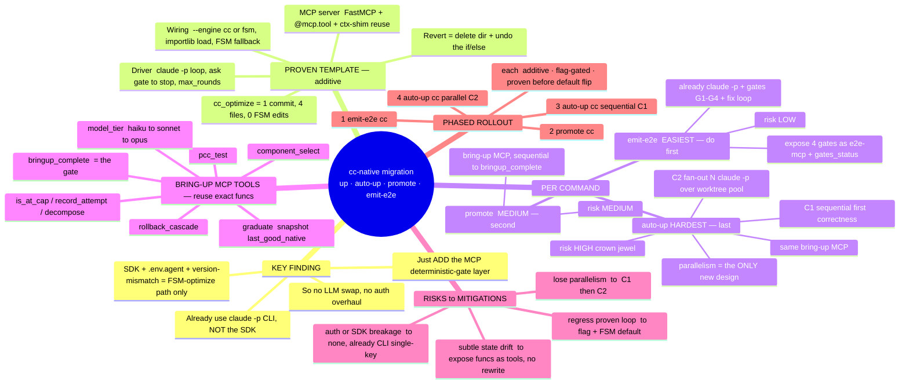

# Making `up` / `auto-up` / `promote` / `emit-e2e` Claude-Code-native (like `optimize`) — without breaking anything

Research synthesis. Goal: convert the bring-up + e2e commands to the **`claude -p` + deterministic-MCP-gate** architecture that `optimize --engine cc` now uses, **additively** (FSM/old path untouched, flag-gated, proven per-command before any default flip).

## 0. The reframing finding (changes the risk picture)

**`auto-up` / `promote` / `emit-e2e` ALREADY invoke the LLM via the `claude -p` CLI subprocess — not the `claude-agent-sdk`.**
- bring-up agent: `_cli_helpers/agent.py:_invoke_agent` (≈165–257) → `claude -p … --output-format stream-json`.
- emit-e2e: `commands/emit_e2e.py:_run_agent` (299–376) → `claude -p … --stream-json`.
- The **SDK** (with the pinned-version "error result: success" risk + `.env.agent`/LiteLLM auth) is used **only by the perf_automation FSM** (`agent/edit_agent.py`, `strategist.py`, …) — i.e. the *optimize-FSM* path that `cc_optimize` already replaced.

**Implication:** these commands don't need an LLM-invocation swap or an auth overhaul — they already use the CLI and single-key/`claude login` auth. "Make them cc-like" = **add the MCP-deterministic-gate layer** (expose the must-be-guaranteed ops as MCP tools + a `can_stop`-style gate the agent must satisfy), exactly like `perf-mcp`. Lower risk than expected.

## 1. The proven additive template (replicate verbatim)

`cc_optimize` was added in ONE commit, **4 new files, ZERO edits to the FSM** (`agent/*` untouched). Structure to copy per command:

1. **MCP server** (`cc_<cmd>/<cmd>_mcp.py`): `FastMCP`, tools via `@mcp.tool()`, **reuse existing deterministic functions** via a thin ctx-shim (don't reimplement), config from env vars, and a deterministic **gate** tool (the `termination_check` analog).
2. **Driver** (`cc_<cmd>/run.py`): discover → per-item loop → write `.mcp.json` (env per item) → `claude -p --mcp-config --strict-mcp-config --allowedTools … --output-format stream-json` → after each round ask the **gate itself** (subprocess) whether to stop → repeat up to `max_rounds`. Inherit ambient env (single-key); do NOT read `.env.agent`.
3. **Additive wiring** (`commands/<cmd>.py`): `--engine cc|fsm` flag, load the cc driver via `importlib.util.spec_from_file_location` (path-load, returns None ⇒ graceful FSM fallback), `if engine=='cc': run_cc(...) else <existing FSM, unchanged>`.

**Non-breaking guarantee:** delete the `cc_<cmd>/` dir + revert the `if/else` in `commands/<cmd>.py` ⇒ original behavior restored exactly.

## 2. Per-command plan

### A. `emit-e2e` — EASIEST (do first)
Already `claude -p` + tool-enforced gates (`emit_e2e.py:_run_deterministic_gates` G1 no-torch / G2 all-invoked / G3 PCC / G4 structure) + builder→fix loop + immutable verdict. It's ~80% cc-shaped already.
- **MCP (`e2e-mcp`):** `run_e2e_pcc`, `check_no_torch_fallback`, `check_all_graduated_invoked`, `check_structure`, `git_*`, and `gates_status()` (the `can_stop` analog — returns pass/fail + which gate + reason).
- **Driver:** `claude -p` (builder) → `gates_status` → if fail, `claude -p` (fixer with the failing-gate reasons) → repeat ≤ N rounds. (Mirror of optimize's round loop.)
- **Reuse:** `_run_deterministic_gates` logic moves into MCP tools verbatim; `demo_wiring.py`, `e2e_emitter.py` unchanged.
- **Risk: LOW** — mostly relocating existing gate code behind MCP tools + formalizing the loop. Single-key already.

### B. `promote` — MEDIUM (do second)
Resume bring-up of the remaining components. Needs the bring-up MCP (below), then a simple per-component loop until `bringup_complete`.
- Reuses auto-up's deterministic ops; no parallelism required (can go sequential first).
- **Risk: MEDIUM.**

### C. `auto-up` / `up` — HARDEST (do last; two sub-phases)
Same **bring-up MCP** as promote, plus the hard part: **parallelism**.
- **bring-up MCP tools** (reuse the exact `auto_iterate.py`/`agent.py` functions — identical behavior):
  `component_select` (`_pick_target`), `pcc_test` (`_run_focused_pytest`), `graduate` (snapshot `.last_good_native`), `rollback_cascade` (`_skip_component_to_fallback`), `compute_split`, `record_attempt`, `is_at_cap`/`effective_cap`, `model_tier` (`_pick_agent_model_for_iter` → `claude -p --model`), `decompose` (subprocess), `git_*`, and **`bringup_complete()`** gate (all components graduated/locked — the `termination_check` analog).
- **C1 (sequential, simpler/safer):** cc auto-up works one component at a time (like cc-optimize does pipelines). Loses the 4× parallel speedup but ports cleanly; prove correctness here.
- **C2 (preserve parallelism — the real design work):** the cc **driver** fans out N `claude -p` sessions across the existing worktree pool (`agent_worktree_pool.py`) + adaptive scheduler (`adaptive_scheduler.py`), each agent handed one component + the bring-up MCP. Orchestration moves into the Python driver; agents stay isolated. This is the only genuinely new design — everything else is reuse.
- **Risk: HIGH** (crown jewel, heavily proven). Keep FSM default until C2 is proven on a real model.

## 3. Risks → mitigations

| Risk | Mitigation |
|---|---|
| Regressing the proven bring-up loop | **Additive + `--engine` flag + FSM default** until each cc command is proven; FSM never edited. |
| Re-deriving subtle state logic (caps/strikes/decompose/snapshots) wrong | **Expose existing functions AS MCP tools** (ctx-shim reuse, like perf-mcp reused `measure_runs`/`run_pcc`) — identical behavior, no reimplementation. |
| Losing auto-up parallelism | Phase C1 (sequential) first for correctness; C2 (driver fans out N `claude -p` + worktree pool) to restore the speedup. |
| Auth/SDK breakage | **None for these commands** — they already use `claude -p` CLI + single-key/`claude login`. The SDK/`.env.agent` risk is FSM-optimize-only and already bypassed by cc. |

## 4. Recommended phased rollout (each phase: additive, flag-gated, proven on a real model before default flip)
1. **emit-e2e cc** (lowest risk, closest) — prove on seamless/nemotron.
2. **promote cc** (bring-up MCP, sequential) — prove on a partially-graduated model.
3. **auto-up cc sequential (C1)** — reuse promote's MCP; prove correctness vs FSM.
4. **auto-up cc parallel (C2)** — driver orchestrates N `claude -p` + worktree pool; prove speedup + no regression.

## 5. Key file references
- Template: `models/experimental/perf_automation/cc_optimize/{perf_mcp.py, run.py}`, `scripts/tt_hw_planner/commands/optimize.py` (`--engine`, `_load_cc_runner`).
- Bring-up loop: `_cli_helpers/auto_iterate.py:_run_auto_iterate_loop`, `agent.py:_invoke_agent`/`_pick_agent_model_for_iter`, `parallel_iterate.py`, `agent_worktree_pool.py`, `adaptive_scheduler.py`.
- emit-e2e: `commands/emit_e2e.py` (`cmd_emit_e2e`, `_run_deterministic_gates`, `_run_agent`), `demo_wiring.py`, `e2e_emitter.py`, `e2e_harness.py`.
- promote/learning: `agent/promote.py`, `agent/handlers/commit.py`, `agent/router.py`.

## 6. Mind map

