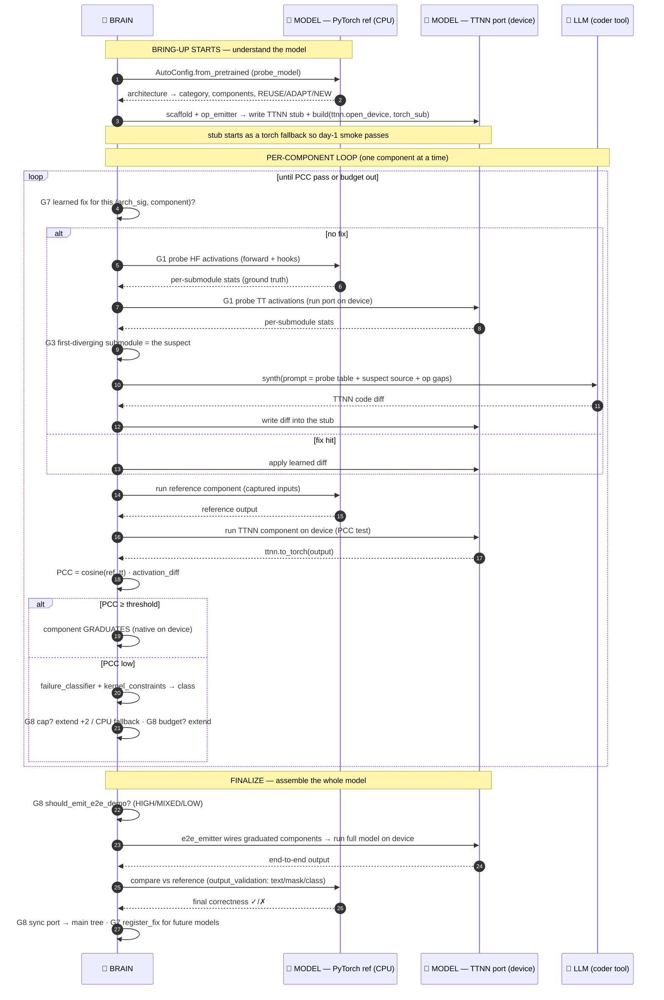

# tt_hw_planner — Brain ↔ Tools Flow

Two actors:
- **🧠 BRAIN** — orchestrator. Decides *what to do next*. Owns all policy/thresholds.
  Pure-Python, **no LLM inside it**.
- **🔧 TOOLS** — deterministic capabilities. Do the work, return data. One tool
  (`llm_synth`/`agent`) wraps an actual LLM; the rest are plain code.

The brain never does work itself: it **decides → calls a tool → reads the
result → decides again**.

---

## Flow diagram

```mermaid
flowchart TD
    START([up model_id --auto]):::cli --> SET

    subgraph SET["SETUP"]
        direction LR
        Bs["🧠 plan the bring-up"]:::br -->|call| Ts["🔧 probe · compat · bringup_plan<br/>scaffold · op_emitter · smoke"]:::tl
        Ts -.->|"components REUSE/ADAPT/NEW<br/>stubs + PCC tests"| Bs
    end

    SET --> LOOP

    subgraph LOOP["AUTO-ITERATE LOOP  (brain drives, repeats)"]
        direction TB
        P{"🧠 ① pick target<br/>ungraduated & under cap"}:::br
        G7{"🧠 ② G7 learned fix?"}:::br
        FIX["🔧 learnings.apply_fix"]:::tl
        SY["🔧 ③ llm_synth → agent (LLM)<br/>iter_prompt · error_patterns"]:::tl
        TST["🔧 ④ PCC pytest<br/>activation_diff · output_validation"]:::tl
        CL["🔧 classify<br/>failure_classifier · kernel_constraints"]:::tl
        CAP{"🧠 ⑤ G8 at cap?<br/>should_extend_component_cap"}:::br
        FB["🔧 → CPU fallback"]:::tl
        PH{"🧠 ⑥ G8 phantom test?<br/>stale_tests"}:::br
        AR["🔧 archive + re-pytest"]:::tl
        BUD{"🧠 ⑦ G8 budget out?<br/>should_extend_budget"}:::br

        P --> G7
        G7 -->|hit| FIX --> TST
        G7 -->|miss| SY --> TST
        TST --> CL --> CAP
        CAP -->|"extend +2 (PCC≥0.5 & trending)"| PH
        CAP -->|no| FB --> PH
        PH -->|yes| AR --> BUD
        PH -->|no| BUD
        BUD -->|"extend (≤1/run, ≤2 pending)"| P
    end

    BUD -->|done| FIN

    subgraph FIN["FINALIZE"]
        direction TB
        EM{"🧠 ⑧ G8 emit demo?<br/>HIGH / MIXED / LOW"}:::br
        DM["🔧 e2e_emitter · demo_wiring<br/>write + run demo.py"]:::tl
        RC{"🧠 ⑨ G8 demo failed?<br/>decide_demo_recovery"}:::br
        RCX["🔧 archive&retry / give up"]:::tl
        SYN["🧠 ⑩ G8 sync_graduated_to_main_tree"]:::br
        T7["🔧 persistence: worktree → main"]:::tl
        RG["🧠 ⑪ G7 register_fix<br/>(arch_sig, first_div_qn, diff)"]:::br

        EM -->|HIGH/MIXED| DM --> RC
        EM -->|LOW| SYN
        RC -->|recover| RCX --> SYN
        RC -->|ok| SYN
        SYN -->|call| T7 --> RG
    end

    RG --> DONE([rc=0 if none pending else 1]):::cli

    classDef br fill:#5b2a86,stroke:#d0a3ff,color:#fff,stroke-width:2px;
    classDef tl fill:#1f3a5f,stroke:#7fb3ff,color:#fff;
    classDef cli fill:#222,stroke:#888,color:#fff;
```

Solid arrow = brain calls a tool. Dashed arrow = tool returns data (sensors like
`failure_classifier`/`activation_diff` feed decisions but never decide). Every
brain step logs `[brain G8]` / `[agentic:G7]`.

---

## Full bring-up flow — how the BRAIN and the MODEL interact

Three participants:
- **🧠 BRAIN** — orchestrator (deterministic policy).
- **🎯 MODEL** — the target. Two faces of the *same* model: the **PyTorch/HF
  reference** (ground truth, runs on CPU) and its **TTNN port** (the stub, runs
  on the Tenstorrent device). Bring-up = making the TTNN port match the reference.
- **🤖 LLM** — the coder tool (`llm_synth`/`agent`) the brain calls to write TTNN code.

The brain never touches the device directly. It interacts with the model in two
ways: it **probes** it (run both faces, compare activations) and it **gates** it
(per-component PCC test). Everything the LLM writes is judged against the
reference model's numbers.

### The interaction in one paragraph
The brain first **reads** the model (HF config → what components exist and which
need work). For each component it **runs both faces of the model** — the PyTorch
reference on CPU and the TTNN port on device — and **compares their activations**
(PCC). The gap between them is the entire signal: the first place they diverge is
the suspect (G3), the brain hands that suspect to the LLM to rewrite, writes the
new TTNN code into the port, and re-runs both faces again. That observe-compare-
fix cycle repeats per component until the port's numbers match the reference
(graduation) or the brain decides to fall back to CPU. When enough components
match, the brain assembles them into the full model and validates the
**end-to-end output** against the reference one last time. So the model is never
"converted" in one shot — it is **pulled onto the device component-by-component,
each one proven equal to the PyTorch reference before it counts.**

## Is it agentic?

**Yes — but in the control-loop sense, not the "an LLM is in charge" sense.**
It is a hybrid, and the distinction matters:

### The BRAIN is an *agentic control loop* — but deterministic, not an LLM
The brain exhibits the four hallmarks of an agent:

| Agent property | How the brain has it |
|---|---|
| **Goal-directed** | Drives every component to graduate (native PCC pass) or a justified CPU fallback |
| **Perceive → decide → act loop** | reads PCC/failure-class (sensors) → decides cap/budget/emit → calls a tool → re-observes |
| **Autonomy** | Runs unattended; extends budgets, caps, recovers demos, falls back — no human in the loop |
| **Persistent memory** | G7 `learnings.py` keys fixes by `(arch_signature, first_diverging_qn)` and replays them across *future runs and different models* |

But crucially, **the brain's decisions are pure-Python policy, not LLM calls.**
Verified: `agentic/{convergence,e2e,demo_recovery,stale_tests}.py` contain **zero**
LLM/agent/API calls. `should_extend_budget` is a linear fit on PCC history plus
fixed thresholds (`BUDGET_EXTEND_MAX_PENDING=2`, `≤1 extension/run`,
`CAP_EXTEND_MIN_PCC=0.5`, `STAGNANT_DELTA=0.02`). It is a **deterministic,
auditable state machine** — reproducible and tunable in one place.

### The LLM agency is *delegated to one tool*
The actual generative-agent behavior — read the failing stub + probe table +
op gaps, then write TTNN code — lives in the **`llm_synth` / `_cli_helpers.agent`**
tool (step ③), which invokes claude/cursor. The brain treats that LLM exactly
like any other tool: call it, get a diff, test the result, decide what's next.

### Why built this way
This is the deliberate design noted in `agentic/__init__.py`: the legacy loop
baked category-specific knowledge into the policy; the rewrite makes the **brain
a generic, category-agnostic, deterministic orchestrator (G1–G9)** and pushes all
the open-ended reasoning into a replaceable LLM *tool*. So:

- **Decisions are reproducible & cheap** (no token cost, no nondeterminism) and
  tune in one module.
- **Open-ended code synthesis is where the LLM earns its keep**, sandboxed as a
  tool whose output is always gated by a deterministic PCC test.

> **Verdict:** Agentic *architecture* (autonomous perceive-decide-act loop with
> cross-run memory), with a **deterministic brain** orchestrating **tools**, one
> of which is an **LLM agent**. The intelligence is in the loop design and the
> sensor feedback, not in an LLM making the control decisions.
