# Getting Started with tt_hw_planner

New here? Start with this. For every internal stage, flag, and design detail, see **`README.md`** next to this file.

## What this tool does
You have an AI model on HuggingFace. You want it to **run on Tenstorrent hardware, correctly and fast**. Normally an engineer would rewrite the whole model by hand for the chip — weeks of work. This tool does that automatically: it rewrites the model piece by piece, checks each piece gives the same answers as the original, and then tunes it for speed. You mostly just start it and wait.

## The short version
If you read nothing else:

1. **Set up once** — build `ttnn`, install the agent dependencies, log into Claude. *(→ Before you start)*
2. **Bring it up** — `auto-up <model> --box <B> --mesh <M>` rewrites the model into native TTNN and verifies every piece on the device. *(→ Section 1)*
3. **Make it fast** — `optimize <model> --devices all` tunes it toward the hardware limit, keeping only verified speedups. *(→ Section 2)*

That's the whole path. The rest of this guide is detail and troubleshooting. The diagram below shows the same flow, in full.

## The flow at a glance

```mermaid
%%{init: {'theme':'base','themeVariables':{'primaryColor':'#ffffff','primaryTextColor':'#111111','primaryBorderColor':'#94a3b8','lineColor':'#475569','fontFamily':'Segoe UI, Arial, sans-serif','fontSize':'13px'}}}%%
flowchart TD
  subgraph BG[" "]
  direction TB
    IN(["auto-up &lt;model&gt; · --box T3K · --mesh 2x2"]) --> S1["STEP 1 · scaffold — clone closest demo family"]
    S1 --> S2["STEP 2 · prepare-plan — REUSE / ADAPT / NEW split"]
    S2 --> S3["STEP 3 · auto-onboard NEW family — unknown arch"]
    S3 --> S4["STEP 4 · phase-1 autofill — CPU fallbacks + aliases"]
    S4 --> S5["STEP 5 · build  ·  STEP 6 · iterate-loop engine"]
    S5 --> CAP["capture real inputs — per-component HF I/O"]
    CAP --> OVL1["load overlays — replay prior bring-up"]
    OVL1 --> PRE["pre-flight PCC · ttnn import check"]
    PRE --> RECON

    subgraph ITER["AUTO-ITERATE · per component (N/24) · haiku → sonnet → opus"]
    direction TB
      RECON["loop-start reconciliation"] --> PICK["pick TARGET component"]
      PICK --> AG["🤖 spawn 4 parallel claude agents<br/>isolated worktrees · memory-aware"]
      AG --> APP["apply responses + ttnn-import"]
      APP --> PCC{"PCC ≥ 0.99<br/>on device?"}
      PCC -->|pass| GRAD["graduate ✓ · .last_good_native"]
      GRAD --> OVL2["overlays index + patch"]
      OVL2 --> SW["regression + validation sweep<br/>compute split X / N on device"]
      PCC -->|fail| RB["rollback .last_good_native<br/>reset · 5-attempt budget"]
      RB --> WJ{"budget left?<br/>(waste-judge)"}
      WJ -->|retry| PICK
      WJ -->|exhausted| DEC["decompose parent → children<br/>or no_emit + lock module"]
      DEC --> PICK
    end
    SW --> MORE{"more components<br/>left?"}
    MORE -->|"yes · budget left"| RECON
    MORE -->|"leftovers · iter budget capped"| PROM["promote — resume bring-up of the<br/>REMAINING components (fresh session · replays overlays)"]
    PROM --> RECON
    MORE -->|"all graduated"| FC["final categorization — REUSE / ADAPT / NEW / SKIP"]

    FC -. "optional · separate" .-> OVL3["overlays — apply (replay) · or dispose / drop"]

    subgraph E2E["EMIT-E2E — build the end-to-end pipeline"]
    direction TB
      BLD["🤖 BUILDER wires graduated stubs → pipeline"] --> GR{"GRADER<br/>verdict?"}
      GR -->|FAIL| FIX["🤖 FIXER closes holes"]
      FIX --> GR
    end
    FC --> BLD
    GR -->|PASS| PROF

    subgraph OPT["OPTIMIZE · reuse-first · deterministic gate + kernel ladder · learns across runs · every pipeline"]
    direction TB
      PROF["discover pipeline(s) from demos + auto-generate missing perf test<br/>profile on device (tracy)"] --> OTC{"termination_check<br/>next_target = {op, op_class, rung}"}
      OTC -->|"blocking op · gate names next_target.rung"| RECALL["🤖 recall_knobs(op_class, grid, bound)<br/>read THIS op's catalog slice FIRST — tuned levers ranked first"]
      RECALL --> L1["🤖 rung 1 · knob:grid<br/>occupy the full core grid"]
      L1 -->|"else"| L2["🤖 rung 2 · knob:dtype<br/>weights bf16 → bf8_b → bf4_b"]
      L2 -->|"else"| L3["🤖 rung 3 · tt-lang kernel<br/>custom kernel via Python DSL"]
      L3 -->|"else"| L4["🤖 rung 4 · C++ Metalium kernel<br/>raw generic_op kernel"]
      L4 -->|"else · matmul still memory-bound on a mesh"| L5["🤖 rung 5 · tp-fracture · tensor-parallel<br/>tp_pick_degree → shard weight across chips + CCL → verify_tp_fracture"]
      L5 -->|"else"| L6["🤖 rung 6 · structural<br/>investigate arch for reducible work"]
      L6 --> OG{"PCC ok ·<br/>faster · honest?"}
      OG -->|no| RV["revert / discard"]
      OG -->|yes| CMT["COMMIT speedup ✓ — scoped git"]
      CMT --> DIST["🤖 distill_knob — write the IMPROVISED win back<br/>+ graduate a reused provisional → trusted"]
      RV --> REC["record_kernel_attempt (win or lose)"]
      DIST --> REC["record_kernel_attempt (win or lose)"]
      REC --> PROF
      CAT[("knob catalog<br/>GUIDELINES + LEARNED_* / GRADUATED_*")] -. "reuse known knob" .-> RECALL
      DIST -. "provisional · graduates on a different model" .-> CAT
    end
    OTC -->|"can_stop · every op at floor or ladder exhausted"| DONE(["model runs natively on device — correct AND fast"])
  end

  classDef agent fill:#fde68a,stroke:#b45309,color:#111;
  classDef gate  fill:#fef3c7,stroke:#a16207,color:#111;
  classDef ovl   fill:#dcfce7,stroke:#15803d,color:#111;
  classDef good  fill:#bbf7d0,stroke:#15803d,color:#111;
  classDef warn  fill:#fecaca,stroke:#b91c1c,color:#111;
  classDef term  fill:#dbeafe,stroke:#1d4ed8,color:#111;
  classDef build fill:#e0e7ff,stroke:#6366f1,color:#111;
  classDef prep  fill:#cffafe,stroke:#0891b2,color:#111;
  classDef iter  fill:#ede9fe,stroke:#7c3aed,color:#111;
  classDef post  fill:#fae8ff,stroke:#a21caf,color:#111;
  classDef opt   fill:#ffedd5,stroke:#ea580c,color:#111;
  class AG,BLD,FIX,PROM,L1,L2,L3,L4,L5,L6,RECALL,DIST agent;
  class PCC,WJ,MORE,GR,OG,OTC gate;
  class OVL1,OVL2,OVL3,CAT ovl;
  class GRAD,CMT good;
  class RB,DEC,RV warn;
  class IN,DONE term;
  class S1,S2,S3,S4,S5 build;
  class CAP,PRE prep;
  class RECON,PICK,APP,SW iter;
  class FC post;
  class PROF,REC opt;
  style BG fill:#ffffff,stroke:#ffffff;
  style ITER fill:#f1f5f9,stroke:#cbd5e1,color:#334155;
  style E2E fill:#f1f5f9,stroke:#cbd5e1,color:#334155;
  style OPT fill:#f1f5f9,stroke:#cbd5e1,color:#334155;
```



Each speed lever is only tried when the cheaper one above it is used up, and every change is kept **only** if it's faster *and* still gives the right answers. You don't pick these — the tool does. (TP, step 5, only kicks in for a big matrix-multiply that's still slow after the earlier steps.)

## Before you start — prerequisites
Do these once, in order, in a **fresh standalone clone** (not a linked git worktree). Following the commands literally works — the known traps are baked in. If something is still missing, the tool stops and prints the exact fix.

### Machine prerequisites (before cloning)
- A Tenstorrent board is visible: `ls /dev/tenstorrent` shows device nodes.
- SSH access to GitHub works.
- The **`claude` CLI is installed and logged in** — `cc` uses native Anthropic auth, so there is **no `.env.agent`**:
  ```bash
  curl -fsSL https://claude.ai/install.sh | bash   # only if not already installed
  claude                                            # log in once
  ```
  (Or instead `export ANTHROPIC_API_KEY=…`.)

### Build the environment (run in order)

**1. Clone from your home dir** — NOT inside an existing repo:
```bash
cd ~ && git clone git@github.com:apande-TT/tt-metal.git tt-metal-xtts && cd tt-metal-xtts
```

**2–3. Check out the tool branch, then make your model branch from it:**
```bash
git checkout feature/tt-hw-planner
git checkout -b xtts-v2-bringup
```

**4. Init submodules** — required for the build (the clone does NOT do this):
```bash
git submodule update --init --recursive
```

**5. Create the venv — `--skip-compat-check` is REQUIRED.** A harmless `fiftyone`/`sse-starlette` version clash otherwise makes the script exit 1 even though the venv is fine:
```bash
./create_venv.sh --skip-compat-check
```

**6. Build tt-metal and verify** (compiles the C++ side):
```bash
./build_metal.sh
source python_env/bin/activate
python -c "import ttnn; print('ttnn ok')"     # must print: ttnn ok
```
> **Re-run this every time you update the branch** (`git pull` / `git merge`). Pulling new code changes the *source* but does **not** recompile it — running on a stale build causes silent wrong answers (tests quietly read as "OTHER").

**7. Install `tt-smi` in its OWN venv** — **never** into the tt-metal venv (it drags in an older `tt-umd` that corrupts the device layer). The tool auto-discovers `~/.tenstorrent-venv/bin/tt-smi`:
```bash
python3 -m venv ~/.tenstorrent-venv
~/.tenstorrent-venv/bin/pip install -U pip tt-smi
export PATH="$HOME/.tenstorrent-venv/bin:$PATH"   # add this line to your ~/.bashrc too
tt-smi -s | head                                   # must show your board
```

**8. Confirm transformers is 5.10.2** (the repo pin). If bring-up ever offers to install `transformers==5.8.1`, decline it or pass `--no-env-fix`:
```bash
python -c "import transformers; print(transformers.__version__)"   # expect 5.10.2
```

**9. Clear any stale kernel cache:**
```bash
rm -rf ~/.cache/tt-metal-cache "$TT_METAL_HOME/.cache/tt-metal-cache"
```

**10. Verify the whole environment in one shot.** You must **`source`** it (do not execute it — it needs to set env vars in your shell):
```bash
source models/experimental/perf_automation/setup_env.sh    # must print: environment ready
```
It self-detects the checkout, installs any missing agent deps, and checks ttnn/torch, the `claude` CLI + auth, `tt-smi`, `transformers 5.10.2`, and tt-lang. If any line says **FAIL**, fix it before continuing. Safe to re-run anytime.

**11. Now run the tool** — bring-up → emit-e2e → optimize, all on this branch (→ Section 1 & 2 below).

### tt-lang kernel rung — know this before `optimize`
`tt-lang` (`ttl`, the optimize **rung-3** custom-kernel lever) ships **`cp312` wheels only**, but this venv is **Python 3.10** — so it cannot install, and the tool silently skips that rung.
- **Bring-up does not need tt-lang at all**, and optimize still has the grid / dtype / C++ rungs. Staying on 3.10 is fine.
- Only if you specifically want tt-lang kernels during optimize: rebuild the venv on **Python 3.12** (`~/.local/bin/python3.12`) — after confirming tt-metal supports 3.12.

### Extra prerequisites before `optimize` (not needed for bring-up)
- You are in a **standalone clone** (this is one) — never run `optimize` from a linked git worktree (kernel JIT mixes worktree `.cpp` with main-tree `.hpp` → no trace).
- **Commit the model dir to git first** — optimize's REVERT needs a clean baseline.
- Pass the right `--devices` for your board (e.g. `0,1`); a wrong partial spec trips a fabric error.
- `TT_PERF_NUM_CQ` defaults to `2` (2-CQ trace lever on). Set to `1` to disable for a single-queue baseline comparison.

### Handled automatically (don't chase these)
profiler orphan-marker heal + `libtt_metal.so` rebuild, marker-buffer drain, CSV extraction, device reset (`tt-smi -r`), crash/hang/stale-CSV guards, git checkpoint/revert, fabric-wedge avoidance, the tt-lang auto-install attempt, and CPU stubs for GPU-only packages (`flash_attn`, `mamba_ssm`, …).

Run everything from the `tt-metal-xtts/` folder.

## Section 1 · Bring up any model

Get a model running correctly on the chip. Three commands, run in order.

> Optional first look (changes nothing): `python -m scripts.tt_hw_planner plan <org>/<model>` — prints the memory-fit verdict and what's already supported vs. needs porting.

**Step 1 · `auto-up` — the one-command bring-up (always start here)**
```bash
python -m scripts.tt_hw_planner auto-up <org>/<model> --box QB2 --mesh 2,2
```
Plans, scaffolds a demo, captures real inputs, then iterates an LLM agent to port each component to native TTNN — PCC-testing every piece on the device and graduating the ones that pass. **When to use:** the first step for any new model. Only `--box` and `--mesh` are required; it auto-picks the agent model ladder (haiku → sonnet → opus) and iteration budget. It runs a while — use `tmux`/`nohup`.
- `--box` = one of `N150 N300 T3K QB2 Galaxy GalaxyBH`
- `--mesh` = chip layout, e.g. `2,2` (4 chips in a square) or `1,4` (4 in a row); `2,2` and `2x2` are equivalent.

**Step 2 · `promote` — resume if bring-up didn't finish**
```bash
python -m scripts.tt_hw_planner promote <org>/<model> --box QB2 --mesh 2,2
```
`auto-up` caps at 24 iterations. If some components didn't graduate, `promote` re-runs the loop **only on the leftovers** (already-graduated components keep their snapshots and aren't re-attempted). **When to use:** after `auto-up` if not everything graduated — run it repeatedly, progress accumulates each pass. Same required `--box`/`--mesh`.

**Step 3 · `emit-e2e` — wire the pieces into the full pipeline**
```bash
python -m scripts.tt_hw_planner emit-e2e <org>/<model>
```
Once all components are graduated, a BUILDER agent wires them into the end-to-end task pipeline and an independent GRADER re-verifies it on device (a FIXER closes any gaps). **When to use:** after everything is graduated, to produce a working end-to-end model. Handy flags: `--task <t>` / `--all-tasks` (multi-task models), `--max-iter`, `--pcc-target`.
- **`--mesh`** — pass the SAME value you used for bring-up (e.g. `--mesh 2,2`) if any component was tensor-parallel sharded. Without it, the builder plans for a single chip and won't be told to open a mesh or preserve sharding, even though the graduated `_stubs/` already contain the sharded code.

### Overlays — save & replay a model's graduated work
An **overlay** is the captured set of file changes a bring-up produced — the per-component `_stubs/` (the graduated native-TTNN code) plus any patches. When a run is worktree-isolated the tool **auto-captures** them, so a model can be **replayed later without re-running the LLM**.
```bash
python -m scripts.tt_hw_planner overlay-list   <org>/<model>   # what's stored (omit model = all)
python -m scripts.tt_hw_planner overlay-apply  <org>/<model>   # replay the graduated modules onto a clean tree
python -m scripts.tt_hw_planner overlay-revert <org>/<model>   # undo an apply
python -m scripts.tt_hw_planner overlay-drop   <org>/<model>   # discard the stored overlays (omit model = wipe all)
```
Use **apply** to restore a previously brought-up model's graduated modules; **drop** only loses the replay shortcut, never the tool itself.

## Section 2 · Optimize

Once a model runs correctly, `optimize` profiles it on the device and climbs the speed ladder (grid → dtype → tt-lang → C++ → tensor-parallel → structural), committing **only** PCC-verified, genuinely faster changes.

> **Important — one-time precondition for `optimize`.** For an existing model, `optimize` runs in a throwaway git **worktree**, which is a *clean checkout of your current branch* — it only sees **committed** files. So before you run it:
> 1. Be on the branch that has the **`tt_hw_planner` tool committed** (`scripts/tt_hw_planner/` **and** `models/experimental/perf_automation/`) — e.g. check out the tool's branch.
> 2. Make sure the **model's code is committed on that same branch** — bring the modelbaseline profile.
>
> If the tool or the model is only *uncommitted/untracked* on the branch you run from, the worktree won't contain it and the run fails before profiling. (This doesn't apply to `--in-place`, or to a model this tool brought up — those edit in place.)

**A · a model this tool brought up — just give the model id:**
```bash
python -m scripts.tt_hw_planner optimize <org>/<model> --devices all
```

**B · an existing tt-metal model — point at its code + PCC test:**
```bash
# code + tests in ONE folder — just give the folder:
python -m scripts.tt_hw_planner optimize models/demos/wormhole/bge_m3 --devices all

# code and tests in DIFFERENT folders — give both (the perf test is auto-generated from the PCC gate):
python -m scripts.tt_hw_planner optimize \
  --model-dir models/demos/bge_large_en \
  --pcc-test  models/demos/wormhole/bge_large_en/tests/pcc/test_ttnn_bge_model.py::test_ttnn_bge_model \
  --devices all
```

Options:
- `--devices single | 0,1 | all` — which chip(s). Default `0,1`; use **`all`** on a multi-chip board (a *partial* subset can trip a fabric error); use `single` on a one-chip machine.
- `--metric device_ms | wall_ms | auto` — what to optimize for (on-device time is the usual choice).
- `--in-place` — edit an existing demo's source directly instead of in a throwaway worktree (a tool-brought-up model is always in place).
- `--max-rounds N` — cc engine: max `claude -p` optimization rounds per pipeline (default `20`). Use `1` for a single pass; the deterministic gate can still stop earlier once each op is at its floor.
- `--e2e-only` — cc engine: skip all optimization and just measure + print the full-model end-to-end time. Use to recover the before/after number if a prior run was stopped or killed before its final measurement.

> **Where edits land:** for an existing tt-metal demo, `optimize` runs in a **throwaway git worktree on a new branch** and leaves your files untouched — it prints how to `diff`/`merge` the kept speedups.

### Make the tool remember what it learned
Every verified speedup the agent improvises is **distilled back into a knob catalog** under `models/experimental/perf_automation/GUIDELINES/` — first as `LEARNED_*.md`, then promoted to `GRADUATED_*.md` once the same knob wins on a **second, different** model. On later runs the tool **recalls that catalog first** and reuses proven levers before improvising, so it gets faster across runs on its own. These catalog files ship with the tool, so **committing them is what makes the learning stick** — don't discard them.

To share learning across machines or teammates, opt into the shared catalog:
```bash
python -m scripts.tt_hw_planner optimize <org>/<model> --devices all --sync-catalog
```
`--sync-catalog` **pulls** the shared `GRADUATED_*` knobs from a catalog branch before the run and **pushes** newly-graduated ones after (`--catalog-remote`, default `origin`; `--catalog-branch`, default `perf-catalog`). Off by default — learning stays local unless you pass it.

## How to read what it prints
During bring-up you'll see lines like:
```
AUTO-ITERATE 6/24: `encoder_layer` GRADUATED  (test PASSED)
  operations: 34/2862 on device (1%) ... on CPU (98%)
```
- **"graduated"** = that piece now runs on the chip and gives the right answers.
- **"on device vs on CPU"** = how much of the model is running on the Tenstorrent chip yet. This climbs toward 100% as it works.

You don't need to babysit it — just check back.

## If it stops with a message
The tool is designed to **stop and tell you the fix** rather than fail silently:

| Message says… | What to do |
|---|---|
| `import ttnn` failed | Run `./build_metal.sh` (step 2 above) |
| Not logged in / no API key | Do the `claude` login or set `ANTHROPIC_API_KEY` |
| Model is **gated** / 403 | Open the model page on HuggingFace, click "Request access", then `huggingface-cli login` |
| Can't **download weights** | Download on a machine with internet, copy them over, set `export HF_HOME=/your/copy` |
| Ran out of iterations, some pieces unfinished | Run `promote` (Section 1, Step 2) — it resumes only the leftovers |

## Glossary — terms you'll see
- **Component** = one piece of the model (like one layer).
- **Graduated** = that piece works correctly on the chip.
- **PCC** = the score that says "the chip's answer matches the original." Higher = better; it needs ~0.99 to pass.
- **Mesh / box** = your chip setup.
- **Optimize** = the speed-tuning stage (after the model already works).

## Where your results live
- The generated model: `models/demos/.../<model>/`
- Logs: inside that model's `_handoff/` folder.
- Speed-tuning results: `models/experimental/perf_automation/runs/<timestamp>/`

## Tips
- Long runs: use `tmux` or `nohup` so they survive an SSH disconnect.
- Want to watch everything live on screen? Prefix any command with `TT_HW_PLANNER_VERBOSE=1`.
