# tt_hw_planner: automated TTNN model bring-up and optimization

> One command takes a HuggingFace model and brings it up on Tenstorrent hardware: it plans the port, scaffolds the demo, drives an LLM agent to rewrite each module in native TTNN, and verifies every piece numerically against the HuggingFace reference — iterating until the model runs on device. A final `optimize` stage then drives the working pipeline's **performance** toward the hardware limit, committing only PCC-verified speedups.

Path in the repo: **`scripts/tt_hw_planner/`**

## 1. Overview

Porting a model from PyTorch/HuggingFace to Tenstorrent's TTNN normally means a human reads the model, hand-writes each layer in TTNN ops, and checks the numbers match. `tt_hw_planner` automates that loop. You give it a HuggingFace model id; it figures out the hardware fit, breaks the model into components, generates a runnable demo skeleton, and then runs an **iterate loop** where an LLM agent rewrites one component at a time into native TTNN. After each attempt it runs a real **PCC correlation test** against the HuggingFace reference on the actual device. A component is **"graduated"** only when its native TTNN output matches the reference at PCC ≥ threshold. The loop repeats — escalating to stronger models when stuck — until the whole model runs on device.

It is **agent-driven, not template-driven**: the porting decisions are made by an LLM — Claude — inside a deterministic harness that handles capture, testing, roll-back, and convergence.

Bring-up gets the model *correct on device*; the `optimize` stage then makes it *fast*. Optimization reuses the same agent-in-a-harness pattern: a deterministic loop profiles the model, picks the bottleneck, and lets an LLM choose or invent the fix, while the harness gates every change on correctness (PCC) and measurement integrity before committing it.

## 2. Capabilities

- **Plan** — given a model id, report memory fit, mesh shape, and which building blocks already exist in tt-metal vs. need porting.
- **Scaffold** — generate a runnable demo folder — `demo/`, `tt/`, `tests/` — cloned from the closest existing demo "family", e.g. Whisper for speech.
- **Capture** — run the HF model once and record each submodule's real input/output tensors, so correctness tests use genuine activations, not fabricated ones.
- **Iterate — the core** — an LLM agent rewrites each component into native TTNN; the harness PCC-tests it on device, graduates it on pass, rolls it back on regression, and re-queues it on fail. Uses a model ladder **haiku → sonnet → opus** that escalates as a component gets stuck.
- **End-to-end — `emit-e2e`** — once components are graduated, an LLM **builder** wires them into a full task pipeline, then an independent LLM **grader** adversarially re-verifies it; a **fixer** closes any holes.
- **Optimize — `optimize`** — once the pipeline runs correctly, drive its **performance** to the hardware limit. Discovery auto-detects the pipeline(s) and auto-generates any missing perf test; then for each op it **reuses a proven knob from the catalog if one fits** (else improvises), and a **deterministic gate** drives it up a fixed ladder — **knob → dtype → tt-lang kernel → C++ kernel** — committing only PCC-verified, measurement-honest speedups, on **every** pipeline, until each op is at its floor. Verified improvised wins are **distilled back into the catalog** and graduate to trusted once they win on a *different* model, so the tool gets faster across runs. Works on a planner-emitted pipeline or any existing tt-metal demo (by dir or model id). See **Step 5** for the flow.
- **Verify** — reports a **compute split**: how much of the model runs natively on the TT device vs. still on CPU via torch fallback, at both the component level and the operation level.
- **Remember** — learned capture drivers, per-model overlays, and a learned-fix log let knowledge from one bring-up be reused on the next.

## 3. Repository layout

```
scripts/tt_hw_planner/                      THE TOOL
│
├── __init__.py  __main__.py                # `python -m scripts.tt_hw_planner` entry
├── cli.py                                  # argparse + all command dispatch
│
├── top-level pipeline stages
│   ├── probe.py  hardware.py  parallelism.py  architecture.py
│   ├── compatibility.py
│   ├── kernel_constraints.py  kernel_missing.py
│   ├── op_classifier.py  op_emitter.py
│   ├── discovery.py  reuse_registry.py  family_backends.py
│   ├── module_tree.py  component_decomposer.py  decomposition_consumer.py
│   ├── meta_plan.py
│   ├── bringup.py  bringup_plan.py  bringup_loop.py
│   ├── scaffold.py  scaffold_demo_folder.py
│   ├── capture_inputs.py  capture_drivers.py  auto_capture_driver_onboard.py
│   ├── llm_synth.py  runtime_repair.py  failure_classifier.py  learning.py
│   ├── demo_wiring.py  output_validation.py  e2e_emitter.py  e2e_harness.py
│   ├── instrumentation.py  overlay_manager.py  worktree.py
│   ├── final_categorization.py  auto_onboard.py
│   └── report.py  run_report.py  verdict.py  activation_diff.py
│
├── commands/                               # one module per CLI subcommand
│   ├── emit_e2e.py     ← end-to-end pipeline builder + grader
│   ├── optimize.py     ← perf-optimization bridge → runs perf_automation
│   ├── plan.py  compat.py  scaffold.py  prepare.py  bringup.py  promote.py
│   ├── op_synth.py  capture_inputs.py  decompose.py  auto_onboard.py
│   ├── tackle_skipped.py  view_state.py  list_meshes.py  commit_tool.py
│   ├── worktree_list.py  worktree_cleanup.py
│   └── overlay_*.py     ← apply · revert · drop · list · promote · extract
│
├── _cli_helpers/                           # iterate-loop internals
│   ├── agent.py            # spawns the LLM agent, monitors progress
│   ├── auto_iterate.py     # the main bring-up loop
│   ├── adaptive_scheduler.py  agent_worktree_pool.py   # memory-aware parallel agents
│   ├── ttnn_preflight.py   # ensures `import ttnn` works before any device test
│   ├── parallel_iterate.py  runtime_repair.py  iter_prompt.py
│   ├── error_patterns.py  llm_verify.py  skip_diagnoser.py
│   ├── setup_step_recovery.py  late_discovery_classifier.py  env_fix.py
│   ├── kernel_findings.py  test_scaffold_reviewer.py  sweep_cache.py
│   └── family_template_registry.py  template_promotion.py
│
├── agentic/                                # the convergence brain · G7/G8
│   ├── executor.py  actions.py  convergence.py  diverge.py  resolve.py
│   ├── learnings.py        # learned-fix lookup/register
│   ├── probe.py  tt_probe.py  demo_recovery.py  stale_tests.py  persistence.py  e2e.py
│
├── correctness/                            # per-category PCC / behavioral graders
│   ├── engine.py  base.py  registry.py  evidence.py
│   └── audio_asr.py  classification.py  detection.py  diffusion.py
│       embedding.py  segmentation.py  text.py
│
├── constraints/                            # model-independent TTNN quirk knowledge
│   └── catalog.py  checker.py  recipes.py  prompt_injection.py
│
├── learned_drivers/                        # auto-onboarded per-model capture drivers — code
├── learned_invokers/
├── plans/                                  # helper script + generated per-model plans
└── tests/                                  # contract test suite
```

> **Not part of the code — gitignored, rebuilt as the tool runs:** `overlays/` captured per-model git patches, `learned_bringups.json`, `learned_chained_templates.json`, `agentic/learned_fixes.json`.

## 4. How it works

The whole tool as a single top-down flow — five phases, bring-up (1–4) then `optimize` (5):

```mermaid
%%{init: {'theme':'base','themeVariables':{'primaryColor':'#ffffff','primaryTextColor':'#111111','primaryBorderColor':'#94a3b8','lineColor':'#475569','fontFamily':'Segoe UI, Arial, sans-serif','fontSize':'13px'}}}%%
flowchart TD
  subgraph BG[" "]
  direction TB
    IN(["auto-up &lt;model&gt; · --box T3K · --mesh 2x2"]) --> S1["STEP 1 · scaffold — clone closest demo family"]
    S1 --> S2["STEP 2 · prepare-plan — REUSE / ADAPT / NEW split"]
    S2 --> S3["STEP 3 · auto-onboard NEW family — unknown arch"]
    S3 --> S4["STEP 4 · phase-1 autofill — CPU fallbacks + aliases"]
    S4 --> S5["STEP 5 · build  ·  STEP 6 · iterate-loop engine"]
    S5 --> CAP["capture real inputs — per-component HF I/O"]
    CAP --> OVL1["load overlays — replay prior bring-up"]
    OVL1 --> PRE["pre-flight PCC · ttnn import check"]
    PRE --> RECON

    subgraph ITER["AUTO-ITERATE · per component (N/24) · haiku → sonnet → opus"]
    direction TB
      RECON["loop-start reconciliation"] --> PICK["pick TARGET component"]
      PICK --> AG["🤖 spawn 4 parallel claude agents<br/>isolated worktrees · memory-aware"]
      AG --> APP["apply responses + ttnn-import"]
      APP --> PCC{"PCC ≥ 0.99<br/>on device?"}
      PCC -->|pass| GRAD["graduate ✓ · .last_good_native"]
      GRAD --> OVL2["overlays index + patch"]
      OVL2 --> SW["regression + validation sweep<br/>compute split X / N on device"]
      PCC -->|fail| RB["rollback .last_good_native<br/>reset · 5-attempt budget"]
      RB --> WJ{"budget left?<br/>(waste-judge)"}
      WJ -->|retry| PICK
      WJ -->|exhausted| DEC["decompose parent → children<br/>or no_emit + lock module"]
      DEC --> PICK
    end
    SW --> MORE{"more components<br/>left?"}
    MORE -->|"yes · budget left"| RECON
    MORE -->|"leftovers · iter budget capped"| PROM["promote — resume bring-up of the<br/>REMAINING components (fresh session · replays overlays)"]
    PROM --> RECON
    MORE -->|"all graduated"| FC["final categorization — REUSE / ADAPT / NEW / SKIP"]

    FC -. "optional · separate" .-> OVL3["overlays — apply (replay) · or dispose / drop"]

    subgraph E2E["EMIT-E2E — build the end-to-end pipeline"]
    direction TB
      BLD["🤖 BUILDER wires graduated stubs → pipeline"] --> GR{"GRADER<br/>verdict?"}
      GR -->|FAIL| FIX["🤖 FIXER closes holes"]
      FIX --> GR
    end
    FC --> BLD
    GR -->|PASS| PROF

    subgraph OPT["OPTIMIZE · reuse-first · deterministic gate + kernel ladder · learns across runs · every pipeline"]
    direction TB
      PROF["discover pipeline(s) from demos + auto-generate missing perf test<br/>profile on device (tracy)"] --> OTC{"termination_check<br/>next_target = {op, op_class, rung}"}
      OTC -->|"blocking op"| RECALL["🤖 recall_knobs(op_class, grid, bound)<br/>read THIS op's catalog slice FIRST — tuned levers ranked first"]
      RECALL --> RUNG["🤖 apply/adapt a known knob — else improvise<br/>do the rung IN ORDER: knob:grid → knob:dtype → tt-lang → C++ kernel"]
      RUNG --> OG{"PCC ok ·<br/>faster · honest?"}
      OG -->|no| RV["revert / discard"]
      OG -->|yes| CMT["COMMIT speedup ✓ — scoped git"]
      CMT --> DIST["🤖 distill_knob — write the IMPROVISED win back<br/>+ graduate a reused provisional → trusted"]
      RV --> REC["record_kernel_attempt (win or lose)"]
      DIST --> REC["record_kernel_attempt (win or lose)"]
      REC --> PROF
      CAT[("knob catalog<br/>GUIDELINES + LEARNED_* / GRADUATED_*")] -. "reuse known knob" .-> RECALL
      DIST -. "provisional · graduates on a different model" .-> CAT
    end
    OTC -->|"can_stop · every op at floor or ladder exhausted"| DONE(["model runs natively on device — correct AND fast"])
  end

  classDef agent fill:#fde68a,stroke:#b45309,color:#111;
  classDef gate  fill:#fef3c7,stroke:#a16207,color:#111;
  classDef ovl   fill:#dcfce7,stroke:#15803d,color:#111;
  classDef good  fill:#bbf7d0,stroke:#15803d,color:#111;
  classDef warn  fill:#fecaca,stroke:#b91c1c,color:#111;
  classDef term  fill:#dbeafe,stroke:#1d4ed8,color:#111;
  classDef build fill:#e0e7ff,stroke:#6366f1,color:#111;
  classDef prep  fill:#cffafe,stroke:#0891b2,color:#111;
  classDef iter  fill:#ede9fe,stroke:#7c3aed,color:#111;
  classDef post  fill:#fae8ff,stroke:#a21caf,color:#111;
  classDef opt   fill:#ffedd5,stroke:#ea580c,color:#111;
  class AG,BLD,FIX,PROM,RUNG,RECALL,DIST agent;
  class PCC,WJ,MORE,GR,OG,OTC gate;
  class OVL1,OVL2,OVL3,CAT ovl;
  class GRAD,CMT good;
  class RB,DEC,RV warn;
  class IN,DONE term;
  class S1,S2,S3,S4,S5 build;
  class CAP,PRE prep;
  class RECON,PICK,APP,SW iter;
  class FC post;
  class PROF,REC opt;
  style BG fill:#ffffff,stroke:#ffffff;
  style ITER fill:#f1f5f9,stroke:#cbd5e1,color:#334155;
  style E2E fill:#f1f5f9,stroke:#cbd5e1,color:#334155;
  style OPT fill:#f1f5f9,stroke:#cbd5e1,color:#334155;
```



**Reading it:** first figure out the port, then scaffold the demo and capture real data, then loop until every component graduates to native TTNN — on-device PCC, escalating the model tier when stuck, and **resuming with `promote`** if a run's iteration budget caps before all components graduate (captured bring-up state can be replayed or disposed via **overlays** as a separate step). Once everything is graduated, `emit-e2e` wires the graduated pieces into the full pipeline and an independent grader/fixer loop proves it on device. Finally, `optimize` discovers the pipeline(s), auto-generates any missing perf test, and for every op first **recalls the bucket's catalog** to reuse a proven knob (improvising only when none fits), then climbs a deterministic ladder — **knob → dtype → tt-lang → C++ kernel** — under a gate that commits only faster, PCC-clean, trustworthy measurements and won't stop until each op is at its floor; each improvised win is **distilled back into the catalog** (graduating to trusted on a second model) so later runs reuse it (the OPTIMIZE box above).

## 5. Setup and prerequisites

Three things must be in place before any bring-up can work: the right machine/env, a built ttnn, and Claude credentials. The HF and exhausted-iteration items are the common run-time snags — handle them the same way.

**Machine & env**
- You're on a Tenstorrent machine with the device visible, e.g. a QuietBox or T3K.
- The repo's Python env is active — `source python_env/bin/activate`, so `python` is the tt-metal env.
- Run everything from the repo root, `tt-metal/`.

### 5.1 Build ttnn for your checkout
`ttnn` is a compiled C++ extension (`_ttnn.so`) that git does **not** carry — only source is pushed/pulled. After any `git clone`, `git pull`, or hardware change you must rebuild, or `import ttnn` fails and every on-device PCC test dies at collection → 0 components graduate. The tool pre-flights this for every device command: if `import ttnn` fails it **prints a clean diagnosis of what's missing and the exact commands to fix it, then stops** — it does not auto-rebuild. Run:
```bash
cd ~/tt-metal
git submodule update --init --recursive
./build_metal.sh
python -c "import ttnn; print('ok')"     # must print ok before bring-up can graduate anything
```

### 5.2 Claude credentials
**Every** command — the bring-up loop, `emit-e2e`, and `optimize` — uses Claude for its LLM steps, and they all authenticate the **same two ways** (pick one):
```bash
# Option A — subscription / interactive (Pro/Max/Team)
claude            # then complete /login once

# Option B — API key (recommended for headless / long runs)
export ANTHROPIC_API_KEY=<your-key>
```
**Precedence:** if `ANTHROPIC_API_KEY` is exported it is used; otherwise the `claude` login credentials are used. Put the `export` in your `~/.bashrc` so every shell and agent subprocess inherits it. The tool prints a clear "credentials confirmed" / "set ANTHROPIC_API_KEY" line at pre-flight. **These are the only two ways to authenticate — there is no `.env.agent` or LiteLLM/proxy path.** Every command — `auto-up`, `up`, `promote`, `emit-e2e`, **and `optimize`** — uses this same auth (`optimize` is no longer an exception).

### 5.3 Gated HuggingFace models
If the model is gated, HF returns 403 / "Access to model is restricted" and the tool stops with a GATED message. To unblock:
```bash
# 1. Approve access in a browser:
#    open  https://huggingface.co/<org>/<model>  → sign in → "Request access"
# 2. Authenticate with a read token (https://huggingface.co/settings/tokens):
huggingface-cli login                 # paste a read token
#    OR, headless:
export HF_TOKEN=hf_xxx
# 3. Re-run the same command.
```
A 401 / "invalid token" is the AUTH case — same fix: `huggingface-cli login` or `export HF_TOKEN=hf_xxx`.

### 5.4 HuggingFace weight download failures
The tool detects HF weight-download failures and bails early with remediation instead of burning iterations. If the box can't pull weights — no network, proxy, rate-limit, air-gapped — pre-download the weights on a connected machine, copy them over, and point the tool at them:
```bash
# on a machine WITH network:
huggingface-cli download <org>/<model> --local-dir /data/<model>

# copy /data/<model> to the offline box, then point HF at the local cache and re-run:
export HF_HOME=/data/hf-cache          # or the dir you copied the weights into
export HF_HUB_OFFLINE=1
python -m scripts.tt_hw_planner auto-up <org>/<model> --box QB2 --mesh 2,2
```

### 5.5 Resuming a partial bring-up
`auto-up` caps at `--auto-max-iters` (default 24). If it ends with some components still not graduated, you do **not** restart from scratch — the graduated stubs and captured inputs are preserved in the model's demo dir. Resume with `promote`, which re-runs the iterate loop only on the **remaining** components:
```bash
python -m scripts.tt_hw_planner promote <org>/<model> --box QB2 --mesh 2,2
```
- `promote` picks up where `auto-up` left off — already-graduated components keep their `.last_good_native` snapshots and are not re-attempted; it focuses the budget on what's still failing.
- It has its own iteration cap (`--auto-max-iters`, promote default 24) and the same `--auto-model-tiered` ladder, so stuck components escalate haiku → sonnet → opus.
- Run `promote` repeatedly if needed — each pass only works the still-ungraduated set, so progress accumulates across passes.

## 6. Usage

> Run everything from the repo root, `tt-metal/` (after completing §5 Setup).

### Step 1: Plan (read-only)
```bash
python -m scripts.tt_hw_planner plan facebook/hf-seamless-m4t-medium
```
Shows the memory-fit verdict, recommended mesh, and a block-by-block report of what already exists vs. what needs porting. **Nothing is modified.** Good first step to understand the model.

### Step 2: Bring up the model
```bash
python -m scripts.tt_hw_planner auto-up facebook/hf-seamless-m4t-medium --box QB2 --mesh 2,2
```
This is the main entry. You pass the target hardware — `--box` and `--mesh` are both **required** — and it locks in the remaining defaults (auto-agent, model ladder, iter budget, per-component cap) and runs the whole flow: plan → scaffold → capture → iterate loop. It will:
- target the box and mesh you specified,
- create the demo folder under `models/demos/.../<model>/`,
- launch LLM agents to port each component,
- PCC-test each on the device and graduate the ones that pass,
- print progress per iteration and a **compute split** of device vs CPU.

It runs for a while — each component is an LLM attempt plus a device test. Leave it running. **Tip:** for long runs use `tmux` or `nohup` so it survives a dropped SSH session.

If `auto-up` hits its `--auto-max-iters` cap with some components still not graduated, you do **not** restart — resume with `promote`, which re-runs the loop only on the **remaining** components (graduated ones keep their snapshots and are not re-attempted):
```bash
python -m scripts.tt_hw_planner promote facebook/hf-seamless-m4t-medium --box QB2 --mesh 2,2
```
Run it repeatedly if needed — each pass only works the still-ungraduated set, so progress accumulates (see §5.5).

> **Parallel agents:** when more than one component is worked at once, each agent runs in its **own isolated git worktree** (no shared-tree contention) and concurrency is **memory-aware** — the scheduler scales the number of parallel agents *down* under host-RAM pressure and *up* when there's headroom.

### Step 3: Read the progress output
Each iteration prints a banner like:
```
AUTO-ITERATE 6/24: `<component>` GRADUATED to native TTNN (PCC test PASSED)
...
Iter 6 compute split (after pytest):
  components : 12/32 on device (37%), 20/32 on CPU (62%)
  operations  : 34/2862 on device (1%), 2828/2862 on CPU (98%)
```
- **components** = how many *modules* are native — a simple headcount.
- **operations** = how many *TTNN ops* are native — work-weighted, the real "how much of the model runs on device" number. These differ because a few small modules can graduate early while the big compute-heavy ones are still on CPU.

### Step 4: Build and verify the end-to-end pipeline
Once components are graduated, wire them into a full task pipeline and have an independent agent grade it:
```bash
python -m scripts.tt_hw_planner emit-e2e facebook/hf-seamless-m4t-medium
```
You'll see a **BUILDER** phase, then a **GRADER** phase that re-runs everything fresh on device and prints a clean report:
```
GRADER REPORT — hf_seamless_m4t_medium
  Call   Re-run  Final PCC                          Audit
  s2tt   pass    0.999894 / 0.999863 / 0.999039     clean
  t2t    pass    0.999879 / 0.999716 / 0.999669     clean
  t2s    pass    0.999879 / 0.999854 / 0.999931     clean
  Structure   pass
  No-waste    pass — 23/23 graduated invoked
  Verdict     PASS

  compute split (TT device vs CPU): 25/25 on device (100%)
  operations: 1679/1679 on device (100%)
```

### Step 5: Optimize performance
Once the pipeline runs correctly, make it fast. `optimize` discovers the pipeline(s), profiles on device, and drives a **deterministic optimization ladder** — committing only PCC-verified, measurement-honest speedups, on every pipeline, until each op is at its floor.

`optimize` uses the **same credentials as every other command** (§5.2) — `ANTHROPIC_API_KEY` if exported, otherwise `claude` login. No separate setup and no `.env.agent`.

```bash
# a planner-emitted model (resolved by model_id via bringup_status.json):
python -m scripts.tt_hw_planner optimize facebook/hf-seamless-m4t-medium --devices all

# OR any existing tt-metal demo — code + tests co-located under one dir (just point at it):
python -m scripts.tt_hw_planner optimize models/demos/wormhole/bge_m3 --devices all

# OR an existing model whose code and tests live in DIFFERENT dirs (--model-dir + --pcc-test;
# perf test is auto-generated from the pcc gate):
python -m scripts.tt_hw_planner optimize \
  --model-dir models/demos/bge_large_en \
  --pcc-test  models/demos/wormhole/bge_large_en/tests/pcc/test_ttnn_bge_model.py::test_ttnn_bge_model \
  --devices all
```

The same command serves both — it resolves a **directory** or a **model id** (`_resolve_target`) and detects whether the target is planner-emitted or an existing demo. Then **discovery is self-sufficient**: it finds the pipeline(s) and **always auto-generates the perf test** — from `demo/demo_<task>.py` for a planner-emitted model, or from the `--pcc-test` gate for an existing model — pairs each with its PCC gate, and optimizes **every** pipeline. (You never pass a perf test; there is no flag for one.) For each op it climbs a fixed ladder and a deterministic gate refuses to stop until the whole ladder is exhausted or the op is at its floor — this is the **OPTIMIZE** box in the §4 architecture diagram (`profile → termination_check → do next_target.rung in order → commit-or-revert → record → re-profile`, exiting only on `can_stop`).

**Where the edits land** — the two target kinds are treated differently *on purpose*. A **planner-emitted** demo is a tool-owned scaffold, so it's optimized **in place** (commits land on your current branch). An **existing tt-metal demo** is *your* real source, so the cc engine **never mutates it in place**: it runs the whole loop in a throwaway git worktree on a fresh `opt/<demo>-<ts>` branch (with `python_env`/`build` symlinked in so the perf test runs), commits every kept win there, and leaves your working tree and current branch **untouched** — then prints how to `diff`/`merge`/discard. Pass `--in-place` to opt out and edit the existing source directly.

> **Prerequisite for an existing-model run (worktree isolation):** the worktree is a *clean git checkout of your current branch*, so it contains only **committed** files. Two consequences: **(a)** the tool itself (`scripts/tt_hw_planner` + `models/experimental/perf_automation`) must be **committed on the branch you run from** — if it's untracked there, the worktree won't include it and the run fails before profiling; **(b)** the branch's tt-metal source must **match your built `build/`** (same version) or the model hits missing-kernel errors at the baseline. In short: **run from a branch that has both the tool committed and a tt-metal version matching your build.** Planner-emitted (in-place) runs don't isolate, so they're exempt.

The gate is the **sole stop authority**: a later rung never clears an op while a cheaper one is untried, and a measured kernel that loses still counts as *tried* (the empirical proof).

Useful options (the **cc** engine is the default):
- `--devices single|all|0,1,…` — which chip(s) to run on (default `0,1`). Use `all` (or every id) on a multi-chip board — a *partial* subset of a larger board can trip a CUSTOM-cluster fabric error.
- `--model-dir <dir>` + `--pcc-test <path::fn>` — for an **existing tt-metal model whose code and tests live in *different* directories**: `--model-dir` is the code to optimize, `--pcc-test` is the e2e correctness gate; the perf test is auto-generated from that gate. Co-located models don't need these — just pass the directory.
- `-k,--case` — pin the perf test's pytest case. (The perf test itself is **always auto-generated** — there is no flag to pass one.)
- `--metric device_ms|wall_ms|auto` — the optimization axis.
- `--in-place` — for an **existing** demo, edit its source on the current branch instead of isolating in a worktree+branch (planner-emitted demos are always in-place).
- `--engine cc|fsm` — `cc` (default) is the Claude-Code-native engine; `fsm` is the legacy state-machine fallback.
- **FSM-only (ignored by cc):** `--box`/`--mesh` (roofline calibration — cc auto-detects the box) and `--max-iter`/`--budget-usd` (cc stops on `can_stop`, not on caps).

It's device- and budget-heavy and runs to natural exhaustion — use `tmux`/`nohup`. Trust the **ledger**, not raw before→after numbers: the loop marks crashed/partial captures as discards (it never banks a fake win).

### Step 6: Verbose output (optional)
By default an interactive run keeps the screen clean and writes the full transcript to one log file. To see everything live on screen:
```bash
TT_HW_PLANNER_VERBOSE=1 python -m scripts.tt_hw_planner auto-up <model> --box QB2 --mesh 2,2
```
Full per-agent logs are always written under the model's `_handoff/` directory regardless of verbosity.

## 7. Command reference

**Main flow**

| Command | What it does |
|---|---|
| `plan <model>` | memory-fit + block availability report, read-only |
| `auto-up <model> --box <B> --mesh <M>` | the one-command full bring-up — recommended entry (box + mesh required) |
| `up <model>` | same pipeline with manual `--auto-*` flags |
| `bringup <model>` | brain-orchestrated bring-up |
| `promote <model> --box <B> --mesh <M>` | resume/continue bring-up of remaining components (box + mesh required) |
| `emit-e2e <model>` | build + independently grade the end-to-end pipeline |
| `optimize <model\|demo_dir> --devices <D> [--engine cc\|fsm]` | profile + optimize the pipeline's device performance; **cc** engine by default (Claude-Code-native deterministic gate), `fsm` fallback; PCC-gated, commits only verified speedups |

**Pipeline stages — usually run for you by `auto-up`**

| Command | What it does |
|---|---|
| `compat <model>` | detailed TTNN compatibility analysis |
| `scaffold <model>` | create the demo folder skeleton |
| `prepare <model>` | build the runnable pytest invocation |
| `capture-inputs <model>` | record real per-component HF I/O |
| `op-synth <model>` | generate op-level stub plans |
| `decompose <model>` | break a component into children |
| `auto-onboard <model>` | onboard a brand-new model family |

**Utilities**

| Command | What it does |
|---|---|
| `list-meshes` | print canonical mesh topologies |
| `view-skips` / `tackle-skipped` | inspect / retry skipped components |
| `overlay-list/apply/revert/drop/promote/extract` | manage captured per-model patches |
| `template-list/promote/demote` | manage demo family templates |
| `worktree-list/cleanup` | manage isolated bring-up worktrees |
| `commit-tool` | commit helper for tool changes |

> **Mesh format:** `--mesh` accepts either `rows,cols` or `rowsxcols` — `--mesh 2,2` and `--mesh 2x2` are equivalent (so are `1,4` / `1x4`).

## 8. Key terms

- **Component** — one module of the model, e.g. an encoder layer. The unit the loop graduates one at a time.
- **REUSE / ADAPT / NEW** — a component either reuses an existing tt module, adapts a sibling's, or is brand-new and needs a full port.
- **Graduated** — a NEW component whose native TTNN output passed the PCC test; a `.last_good_native` snapshot is saved.
- **PCC** — Pearson correlation between the TTNN output and the HF reference output. The pass gate — default ≥ 0.99 per component, ≥ 0.95 for e2e.
- **Compute split** — device-vs-CPU breakdown, by component count and by op count.
- **Gates — in `emit-e2e`** — Gate 1: runs native with no torch fallback; Gate 2: every graduated module is actually invoked; Gate 3: final PCC ≥ threshold.
- **Mesh** — the chip topology used, e.g. `1,4` = 4 chips in a row.
- **Overlay** — a captured set of git patches recording a model's bring-up state, so it can be re-applied / reused later.

Optimization terms (the `optimize` stage):
- **Bucket** — device ops grouped by op-class (matmul, attention, datamove, eltwise, …). The loop attacks the slowest bucket first.
- **Rung / lever** — one optimization applied to an op, climbed in fixed ladder order: a **knob** (weight dtype bf16→bf8_b→bf4_b, full core grid, fusion), then a **tt-lang kernel**, then a **C++ Metalium kernel**.
- **Gate (`termination_check`)** — the deterministic stop authority: per op it returns the `next_target` rung and refuses `can_stop` until every op's full ladder is exhausted or it's at its floor; a losing kernel still counts as *tried*.
- **Roofline** — the hardware-limit target (peak flops / bandwidth) the loop chases; the gap-to-roofline ranks which bucket has the most attainable speedup.
- **Measurement integrity** — a guard that rejects a crashed/partial profile capture (structural op counts dropped) instead of banking it as a fake win; only full, PCC-clean, faster captures are committed.

## 9. Output locations

- The model's demo folder: `models/demos/.../<model>/` — `demo/`, `tt/`, `tests/pcc/`, plus `bringup_status.json`, the source of truth for what's graduated, and `_stubs/`, the per-component TTNN code + `.last_good_native` snapshots.
- Agent logs: `<model>/_handoff/`.
- `emit-e2e` logs: `<model>/_handoff/emit_e2e_*.log`; report: `<model>/grader_report.{json,md}`.
- `optimize` runs: `models/experimental/perf_automation/runs/<timestamp>/` — `ledger.jsonl` (per-iteration lever / bucket / before→after / PCC, the source of truth for what landed) and `residual_report.json` (distance from the roofline floor). Kept speedups are scoped git commits on the model dir.

## 10. Overlays

An **overlay** is the captured set of file changes — git-style patches — a model's bring-up produced: its `_stubs/`, tests, and any edits to shared repo files. When you run with worktree isolation — the default — the tool **auto-captures** the worktree's deltas into `overlays/<model>/` at the end of a run. This keeps your working tree clean while preserving everything, so a model can be **replayed later without redoing the LLM work**.

Typical operations:

```bash
# see what's stored — one model or all
python -m scripts.tt_hw_planner overlay-list facebook/hf-seamless-m4t-medium

# re-apply a model's captured changes onto a clean working tree — replay
python -m scripts.tt_hw_planner overlay-apply facebook/hf-seamless-m4t-medium

# undo an apply — counter to overlay-apply
python -m scripts.tt_hw_planner overlay-revert facebook/hf-seamless-m4t-medium

# ── disposing ──
# permanently delete a model's stored overlays. Omit the path to wipe ALL.
python -m scripts.tt_hw_planner overlay-drop facebook/hf-seamless-m4t-medium
```

Two advanced ones:
- `overlay-promote` — apply an overlay's change to the **shared** repo file and remove the overlay, so you can PR that diff normally. Graduates a shared-file tweak from a per-model overlay into the real codebase.
- `overlay-extract` — the reverse migration: pull uncommitted shared-file edits out of your working tree **into** an overlay, then revert the file, keeping the shared file clean.

> Overlays are **learned data** — gitignored and rebuilt as you run. Disposing them with `overlay-drop` only loses the replay shortcut, never the tool itself.

## 11. How the tool learns

When `up --auto` successfully brings up a brand-new model, the tool writes what it learned back so the **next similar model is faster** — all best-effort and idempotent, and a failure to persist never fails the bring-up:

1. **`family_backends.py`** — the matched backend's `model_type_keys` is extended with the new `model_type`, so the next model of that architecture gets an **exact** backend match instead of a category-default guess.
2. **`compatibility.py`** — `closest_supported_model()`'s candidate map gains `new_model_type → new_model_id`, so the **scaffold** step finds a sibling immediately instead of cold-starting.
3. **`learned_bringups.json`** — an append-only history record: timestamp, PCC details, and a "what changed" diff. Auditable/replay-friendly; never read back by the tool.

Alongside those, three other learned stores accumulate as you use the tool:
- **`learned_drivers/`** — auto-onboarded per-model capture drivers; this **is** code (committed, not gitignored).
- **`agentic/learned_fixes.json`** — reusable fixes keyed by failure shape, so a fix discovered once can be reapplied on a sibling model.
- **`learned_chained_templates.json`** — learned multi-component template chains.

**Net effect:** the first bring-up of a new architecture does the full LLM loop; the next model in the same family scaffolds from an exact sibling, may reuse learned fixes/drivers, and converges with far fewer iterations.

## 12. Notes

- An interactive run keeps the screen clean and writes the full transcript to one log file; set `TT_HW_PLANNER_VERBOSE=1` to see everything live on screen.
- Long runs should use `tmux`/`nohup` so they survive SSH disconnects.
- Multi-component bring-up runs its agents in **isolated git worktrees** with **memory-aware adaptive concurrency** (scales parallel-agent count to host-RAM headroom).
- Learned data — `overlays/`, `learned_*.json` — is gitignored and rebuilt as the tool runs, so it is intentionally not part of the committed tool. The exceptions are `learned_drivers/`, which is code, and the in-source registry edits to `family_backends.py` / `compatibility.py`, which DO get committed.
