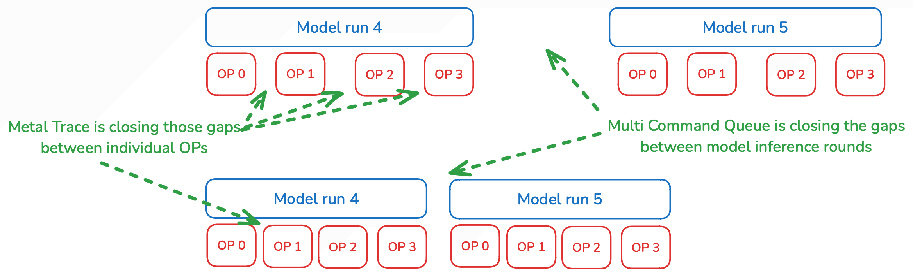
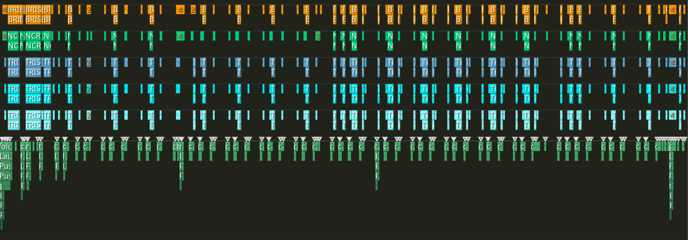
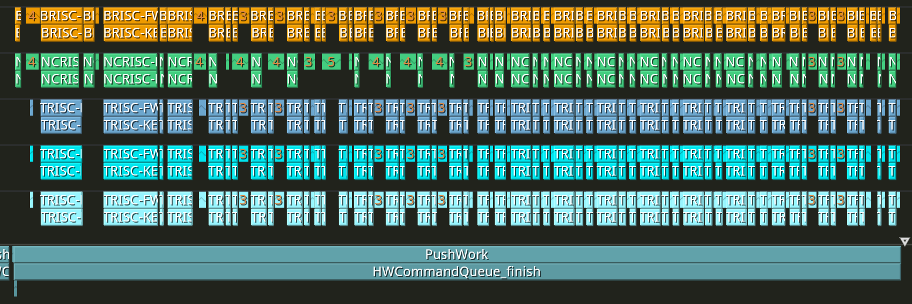
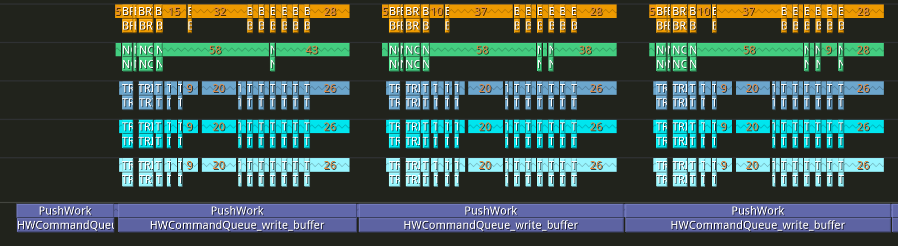
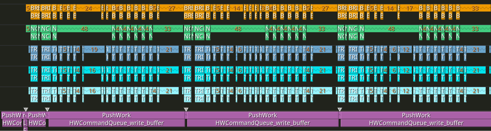
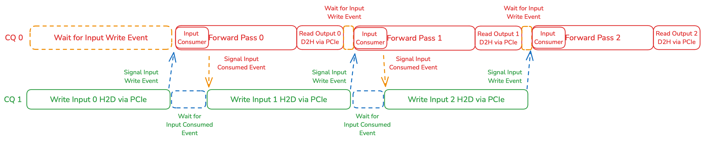
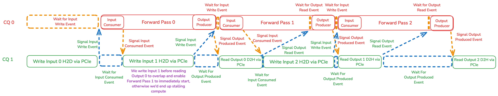
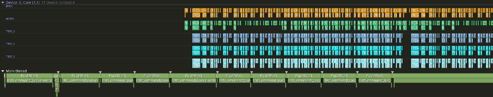

# Advanced Performance Optimizations for Models

## Contents

- [Introduction](#introduction)
- [1. Metal Trace](#1-metal-trace)
  - [1.1 Overview](#11-overview)
  - [1.2 APIs](#12-apis)
  - [1.3 Programming Examples](#13-programming-examples)
    - [1.3.1 Trace with Persistent DRAM Input](#131-trace-with-persistent-dram-input)
    - [1.3.2 Trace with Non-Persistent L1 Input](#132-trace-with-non-persistent-l1-input)
- [2. Multiple Command Queues](#2-multiple-command-queues)
  - [2.1 Overview](#21-overview)
  - [2.2 APIs](#22-apis)
  - [2.3 Programming Examples](#23-programming-examples)
    - [2.3.1 Opening and Configuring a Mesh Device](#231-opening-and-configuring-a-mesh-device)
    - [2.3.2 Ops and Output Readback on CQ0, Input Writes on CQ1](#232-ops-and-output-readback-on-cq0-input-writes-on-cq1)
    - [2.3.3 Ops on CQ0, Input Writes and Output Readback on CQ1](#233-ops-on-cq0-input-writes-and-output-readback-on-cq1)
- [3. Combining Trace and Multiple Command Queues](#3-combining-trace-and-multiple-command-queues)
  - [3.1 Overview](#31-overview)
  - [3.2 APIs](#32-apis)
  - [3.3 Programming Examples](#33-programming-examples)
    - [3.3.1 Trace with Persistent DRAM Input](#331-trace-with-persistent-dram-input)
      - [3.3.1.1 Ops and Output Readback on CQ0, Input Writes on CQ1](#3311-ops-and-output-readback-on-cq0-input-writes-on-cq1)
      - [3.3.1.2 Ops on CQ0, Input Writes and Output Readback on CQ1](#3312-ops-on-cq0-input-writes-and-output-readback-on-cq1)

## Introduction

This document describes different techniques for optimizing model performance, specifically how to reduce the overhead between individual operations and between model forward pass invocations. Specifically, [Metal Trace](#1-metal-trace) can be used to remove the host overhead of executing ops, reducing the gap between op invocations, whereas [Multiple Command Queues](#2-multiple-command-queues) can be used to reduce the overhead between model forward passes by overlapping the cost of IO transfers with operation execution, as illustrated in the following figure.
<!-- {width=15 height=15} -->


## 1. Metal Trace

### 1.1 Overview

Metal Trace is a performance optimization feature that aims to remove the host overhead of constructing and dispatching operations for models, and will show benefits when the host time to execute/dispatch a model exceeds the device time needed to run the operations.

This feature works by recording the commands for dispatching operations into a DRAM buffer, and replaying these commands when executing a trace. This means that all of the operation’s parameters are statically saved, the input/output tensor shapes, addresses, etc. do not change. This makes using trace for entire generative models more difficult since these models have a changing sequence length, but statically sized inputs/outputs such as for image or sequence classification work well with metal trace. Tracing generative models can still be done using a variety of different techniques, such as using multiple traces, but is not currently covered in this document.

The following figure shows the runtime of a model execution that is host-bound. We see that the host is not able to run and dispatch commands to the device ahead of time, and the device is stuck stalling waiting for the host in order to receive commands to run operations, which is why there are large gaps between operations on the device.
<!-- {width=15 height=15} -->


With trace, we can eliminate a large portion of these gaps. In the figure below we now execute the model using trace. We see that the host finishes dispatching the model almost immediately and is just waiting for the device to finish for most of the time. On the device, we see that the gaps between ops is much smaller
<!-- {width=15 height=15} -->


>[!NOTE]
>For information about full model deployment see the [Deploying LLMs Guide](https://github.com/tenstorrent/tenstorrent.github.io/blob/main/core/getting-started/vLLM-servers.md).
>
>For the full install procedure see the [Installation Guide](https://github.com/tenstorrent/tt-metal/blob/main/INSTALLING.md).

### 1.2 APIs
In order to use trace, we need to use the following trace APIs:

* `trace_region_size`

  This is a parameter to the device creation api, and this determines the size of the memory region we remove from the regular DRAM buffer space and where we can allocate our trace buffers on device. Since this is preallocating the region, there is currently no automated infrastructure in order to determine the size needed. To determine what size should be used, we can try capturing the operations we want to trace, and when this fails this will report the required size to use.

  `Always | FATAL    | Creating trace buffers of size 751616B on device 0, but only 0B is allocated for trace region.`

  In pytest, we can pass the `trace_region_size` using the `device_params` fixture:

  `@pytest.mark.parametrize("device_params", [{"l1_small_size": 24576, "trace_region_size": 800768}], indirect=True)`
* `tid = ttnn.begin_trace_capture(device, cq_id=0)`

  This marks the beginning of a trace. The commands for dispatching operations after this is called will be recorded and associated with the returned trace id.
* `ttnn.end_trace_capture(device, tid, cq_id=0)`

  This marks the end of the trace. All operations that were run between beginning and end will be recorded and associated with the trace id.
* `ttnn.execute_trace(device, tid, cq_id=0, blocking=False)`

  This will execute the captured trace with the specified trace id, and is equivalent to running all the operations that were captured between begin and end

In addition, since trace requires the addresses of the used tensors to be the same, we need to statically preallocate our input tensor, and reuse this tensor instead of recreating our input tensor each iteration using the following APIs:

* `device_tensor = ttnn.allocate_tensor_on_device(tensor_spec, device)`

  This will allocate a tensor with the specified parameters on the device. The tensor data will be uninitialized
* `ttnn.copy_host_to_device_tensor(host_tensor, device_tensor, cq_id=0)`

  This will copy data from the input host tensor to the allocated on device tensor

### 1.3 Programming Examples

#### 1.3.1 Trace With Persistent DRAM Input

Normally for performance we try to allocate tensors in L1, but many models are not able to fit in L1 if we keep the input tensor in L1 memory. The easiest way to work around this is that we can allocate our input in DRAM so that we can keep the tensor persistent in memory, then run an operation to move it to L1. For performance, we’d expect to allocate the input as DRAM sharded and move it to L1 sharded using the reshard operation. A more complex technique that allows us to still run with our input in L1 is to allow the input tensor to be deallocated, and then reallocating and ensuring it is allocated at the same address at the end of the trace. Both techniques will be demonstrated below.

Trace only supports capturing and executing operations, and not other commands such as reading/writing tensors. This also means that to capture the trace of a sequence of operations, we must run with program cache and have already compiled the target operations before we capture them.

Putting this together, we can capture and execute the trace of a model using the following basic structure where we allocate our persistent input in DRAM for simplicity:

```py
# Allocate our persistent input tensor
input_dram_tensor = ttnn.allocate_tensor_on_device(shape, dtype, layout, device, sharded_dram_mem_config)

# First run to compile the model
ttnn.copy_host_to_device_tensor(host_tensor, input_dram_tensor, cq_id=0)
input_l1_tensor = ttnn.to_memory_config(input_dram_tensor, sharded_l1_mem_config)
output_tensor = run_model(input_l1_tensor)

# Capture the trace of the model
ttnn.copy_host_to_device_tensor(host_tensor, input_dram_tensor, cq_id=0)
tid = ttnn.begin_trace_capture(device, cq_id=0)
input_l1_tensor = ttnn.to_memory_config(input_dram_tensor, sharded_l1_mem_config)
# It is important that we keep the output tensor on device returned here, so that we have the output tensor and associated address to read from after executing trace
output_tensor = run_model(input_l1_tensor)
ttnn.end_trace_capture(device, tid, cq_id=0)

# Execute the trace
ttnn.copy_host_to_device_tensor(host_tensor, input_dram_tensor, cq_id=0)
ttnn.execute_trace(device, tid, cq_id=0, blocking=False)
host_output_tensor = output_tensor.cpu(blocking=False)

# Final synchronize to wait for all outputs to be read to host since we used non-blocking reads
ttnn.synchronize_device(device)
```

#### 1.3.2 Trace with Non-Persistent L1 Input

Below is a more advanced example where our input tensor is in L1 and we allow it to be deallocated since the model doesn't fit in L1 if it was persistent, but we will reallocate it at the same address at the end of trace capture to enable having the input in L1 for the trace.

```py

# First run to compile the model
input_l1_tensor = host_tensor.to(device, sharded_l1_mem_config)
output_tensor = run_model(input_l1_tensor)

# Capture the trace of the model
# Record the address of the input tensor to trace so that we can validate we allocated our input tensor at the right address
input_l1_tensor = host_tensor.to(device, sharded_l1_mem_config)
input_trace_addr = input_l1_tensor.buffer_address()
spec = input_l1_tensor.spec
# Deallocate the previous output tensor here so that we will allocate our input tensor at the right address afterwards
output_tensor.deallocate(force=True)
tid = ttnn.begin_trace_capture(device, cq_id=0)
# It is important that we keep the output tensor on device returned here, so that we have the output tensor and associated address to read from after executing trace
output_tensor = run_model(input_l1_tensor)

# Try allocating our persistent input tensor here and verifying it matches the address that trace captured
input_l1_tensor = ttnn.allocate_tensor_on_device(spec, device)
assert input_trace_addr == input_l1_tensor.buffer_address()

ttnn.end_trace_capture(device, tid, cq_id=0)

# Execute the trace
ttnn.copy_host_to_device_tensor(host_tensor, input_l1_tensor, cq_id=0)
ttnn.execute_trace(device, tid, cq_id=0, blocking=False)
host_output_tensor = output_tensor.cpu(blocking=False)

# Final synchronize to wait for all outputs to be read to host since we used non-blocking reads
ttnn.synchronize_device(device)
```

## 2. Multiple Command Queues

### 2.1 Overview

Metal supports multiple command queues for fast dispatch, up to two queues. These command queues are independent of each other and allow for us to dispatch commands on a device in parallel. Both command queues support any dispatch command, so we use either for I/O data transfers or launching programs on either command queue. As these queues are independent of each other, to coordinate and guarantee command order such as having one queue be used to write the input and the other queue be used to run operations on that input, we need to use events to synchronize between the queues. A common setup for multiple command queues is to have one only responsible for writing inputs, while the other command queue is used for dispatching programs and reading back the output, which is what will be described in this document. This is useful where we are device bound and our input tensor takes a long time to write, and allows us to overlap dispatching of the next input tensor with the execution of the previous model run. Other setups are also possible, such as having one command queue for both writes and reads, while the other is used for only dispatching programs, or potentially having both command queues running different programs concurrently.

The figure below shows an example of where we can see the benefits of using an independent queue for writing inputs. We see a large gap between each run of the model, as well as the host being stalled waiting to be able to finish writing the next tensor.
<!-- {width=15 height=15} -->


Using a second command queue only for writes enables us to eliminate the gap between model executions, and allows the host to go ahead of the device and enqueue commands for subsequent models runs before we have finished executing our current run.
<!-- {width=15 height=15} -->


### 2.2 APIs

Configuring multiple command queues requires the following APIs:

* `num_command_queues`

  This parameter sets the number of command queues to create. Default number of queues is one, two maximum. Configure in pytest by using the `device_params` fixture:

  `@pytest.mark.parametrize("device_params", [{"l1_small_size": 24576, "trace_region_size": 800768, "num_command_queues": 2}], indirect=True)`
* `event = ttnn.record_event(device, cq_id = 0)`

  This event is recorded on the device after all commands in the queue are finished. This event is visible to all command queues.
* `ttnn.wait_for_event(cq_id = 0, event = event)`

  A command is enqueued to the specified command queue to stall until the specified event has been recorded on the device. No commands sent to the command queue after the wait for event command are executed until the event occurs.

For a single command queue only used for writing inputs, preallocate the input tensor and store it in memory. This static location is required for write inputs as operations execute in parallel, creating intermediate tensors. Overlapping data regions cannot be used for write inputs and operation execution. Use the following APIs to configure this single command queue:

* `device_tensor = ttnn.allocate_tensor_on_device(shape, dtype, layout, device, input_mem_config)`

  Allocate a tensor with specific parameters on the device. The tensor data is uninitialized.
* `ttnn.copy_host_to_device_tensor(host_tensor, device_tensor, cq_id=0)`

  Data is copied from the input host tensor to the allocated on device tensor.

### 2.3 Programming Examples

#### 2.3.1 Opening and Configuring a Mesh Device

The following code sample shows how to open a mesh device and configure memory allocation and command queues:

```
namespace ttnn {

namespace device {

using IDevice = ttnn::IDevice;
using MeshDevice = tt::tt_metal::distributed::MeshDevice;

std::shared_ptr<MeshDevice> open_mesh_device(
    int device_id,
    size_t l1_small_size = DEFAULT_L1_SMALL_SIZE,
    size_t trace_region_size = DEFAULT_TRACE_REGION_SIZE,
    size_t num_command_queues = 1,
    const tt::tt_metal::DispatchCoreConfig& dispatch_core_config = tt::tt_metal::DispatchCoreConfig{},
    size_t worker_l1_size = DEFAULT_WORKER_L1_SIZE);
void close_device(IDevice& device);
void enable_program_cache(IDevice& device);
void disable_and_clear_program_cache(IDevice& device);
bool is_wormhole_or_blackhole(tt::ARCH arch);
void deallocate_buffers(IDevice* device);

}  // namespace device

using namespace device;

}  // namespace ttnn
```

#### 2.3.2 Ops and Output Readback on CQ0, Input Writes on CQ1

To optimize performance allocate tensors to L1 memory. Many models do not have sufficient memory to fit in L1 memory if input tensors are also stored in L1 memory. Instead allocate the input tensors to DRAM to keep the tensor persistent in memory. Run an operation to move the tensor to L1 memory. Allocate the input as DRAM sharded and move it to L1 sharded memory with the reshard operation to optimize performance.

To configure multiple command queues (one for writes, the other for running programs and reading) create two events:
1. Create an event to signal writes are completed on CQ1. CQ0 waits for this event so that it executes operations after the write is complete.
2. Create an event to signal that CQ0 has read the input tensor, and that CQ1 can overwrite with new data. CQ1 waits for this event before writing the next input.

<!-- {width=15 height=15} -->


```py
# This example uses CQ1 for input writes, and CQ0 for executing programs/reading back the output.

# `op_event` signals when the first operation is complete. It reads the input tensor and issues the next write once complete.

# `write_event` signals when an input write is complete. It signals that the input tensor can be read.

# Allocate the persistent input tensor:
input_dram_tensor = ttnn.allocate_tensor_on_device(shape, dtype, layout, device, sharded_dram_mem_config)

# Dummy record an operation event on CQ0 while waiting on the first in the loop:
op_event = ttnn.record_event(device, 0)

outputs = []

for iter in range(0, 2):
    # Stall CQ 1 for the input tensor consumer (CQ0) to signal it has finished so we can start overwriting the previous input tensor with the new one
    ttnn.wait_for_event(1, op_event)
    # Write the next input tensor on CQ1
    ttnn.copy_host_to_device_tensor(host_tensor, input_dram_tensor, cq_id=1)
    # Signal that the write has finished on CQ1
    write_event = ttnn.record_event(device, 1)
    # Make CQ 0 stall until CQ 1 has signalled that the write has finished
    ttnn.wait_for_event(0, write_event)
    # Run the first operation of the model on CQ0
    input_l1_tensor = ttnn.to_memory_config(input_dram_tensor, sharded_l1_mem_config)
    # Signal to the producer (CQ 1) that CQ0 is finished with the input and it can be overwritten
    op_event = ttnn.record_event(device, 0)
    # Run the rest of the model and issue output readback on the default CQ (CQ0)
    output_tensor = run_model(input_l1_tensor)
    outputs.append(output_tensor.cpu(blocking=False))

# Final synchronize to wait for all outputs to be read to host since we used non-blocking reads
ttnn.synchronize_device(device)
```

#### 2.3.3 Ops on CQ0, Input Writes and Output Readback on CQ1

This example describes how to configure two command queues, CQ0 for operation executions, and CQ1 for reads and writes. Two persistent tensors are required for input and output.

Four events must be created for this configuration:
1. The first event signals that a write is complete on CQ1. CQ0 waits on this event and executes after the write is complete.
2. The second event signals that CQ0 has read the input tensor. CQ1 waits for this event before it writes the next input.
3. The third event signals that CQ0 is finished executing operations and CQ1 can read the data.
4. The fourth event signals that CQ1 has read the output and CQ0 can overwrite data in CQ1.

These events help with overlap reads and writes in operation execution.

When reads and writes are on the same CQ, do not write an input tensor.  The system can stall waiting for the output if CQ1 is blocked while the model finishes running. Instead restructure the loop so that first input writes outside the loop. The model can then be run in the loop, enqueuing the next write before we enqueue the readback of the current output. CQ1 should always finish writing the next input. CQ1 should allow reads to overlap the current output with the next iteration of the model.

<!-- {width=15 height=15} -->


```py
# This example uses 1 CQ for writing inputs and reading outputs (CQ 1), and one CQ for executing programs (CQ0)

# `first_op_event` signals when the first operation is completed. This is the consumer of the input tensor so once this is completed, we can issue the next write

# `write_event` signals when input write is completed. This is used to signal that the input tensor can be read/consumed

# `last_op_event` signals when the last operation is completed. This is the producer of the otuput tensor so once this is completed, we can issue the next read

# `read_event` signals when output read is completed. This is used to signal that the output tensor can be overwritten

# Allocate our persistent input tensor
input_dram_tensor = ttnn.allocate_tensor_on_device(input_shape, input_dtype, input_layout, device, input_sharded_dram_mem_config)
# Allocate our persistent output tensor
output_dram_tensor = ttnn.allocate_tensor_on_device(output_shape, output_dtype, output_layout, device, output_sharded_dram_mem_config)

# Dummy record an op event on CQ0 since we wait on this first in the loop
first_op_event = ttnn.record_event(device, 0)
# Dummy record a read event on CQ1 since we wait on this first in the loop
read_event = ttnn.record_event(device, 1)

outputs = []

# Stall CQ 1 for the input tensor consumer (CQ0) to signal it has finished so we can start overwriting the previous input tensor with the new one
ttnn.wait_for_event(1, first_op_event)
# Write the next input tensor on CQ1
ttnn.copy_host_to_device_tensor(host_tensor, input_dram_tensor, cq_id=1)
# Signal that the write has finished on CQ1
write_event = ttnn.record_event(device, 1)

for iter in range(0, 2):
    # Make CQ 0 stall until CQ1 has signalled that the write has finished
    ttnn.wait_for_event(0, write_event)
    # Run the first operation of the model on CQ0
    input_l1_tensor = ttnn.to_memory_config(input_dram_tensor, sharded_l1_mem_config)
    # Signal to the producer (CQ 1) that CQ0 is finished with the input and it can be overwritten
    first_op_event = ttnn.record_event(device, 0)
    # Run the rest of the model and issue output readback on the default CQ (CQ0)
    output_tensor = run_model(input_l1_tensor)
    # Make CQ0 stall until CQ1 has signalled that the read has finished
    ttnn.wait_for_event(0, read_event)
    # Run the last operation of the model on CQ0
    output_dram_tensor = ttnn.reshard(output_tensor, output_sharded_dram_mem_config, output_dram_tensor)
    # Signal that the model has finished on CQ0
    last_op_event = ttnn.record_event(device, 0)

    # Stall CQ1 for the input tensor consumer (CQ0) to signal it has finished so we can start overwriting the previous input tensor with the new one
    ttnn.wait_for_event(1, first_op_event)
    # Write the next input tensor on CQ1
    ttnn.copy_host_to_device_tensor(host_tensor, input_dram_tensor, cq_id=1)
    # Signal that the write has finished on CQ1
    write_event = ttnn.record_event(device, 1)

    # Make CQ1 stall until CQ0 has signalled that the model has finished
    ttnn.wait_for_event(1, last_op_event)
    outputs.append(output_dram_tensor.cpu(blocking=False, cq_id=1))
    # Signal that the read has finished on CQ1
    read_event = ttnn.record_event(device, 1)

# Make CQ0 stall until CQ1 has signalled that the write has finished
ttnn.wait_for_event(0, write_event)
# Run the first operation of the model on CQ0
input_l1_tensor = ttnn.to_memory_config(input_dram_tensor, sharded_l1_mem_config)
# Signal to the producer (CQ 1) that CQ0 is finished with the input and it can be overwritten
first_op_event = ttnn.record_event(device, 0)
# Run the rest of the model and issue output readback on the default CQ (CQ0)
output_tensor = run_model(input_l1_tensor)
# Make CQ0 stall until CQ 1 has signalled that the read has finished
ttnn.wait_for_event(0, read_event)
# Run the last operation of the model on CQ0
output_dram_tensor = ttnn.reshard(output_tensor, output_sharded_dram_mem_config, output_dram_tensor)
# Signal that the model has finished on CQ0
last_op_event = ttnn.record_event(device, 0)

# Make CQ1 stall until CQ0 has signalled that the model has finished
ttnn.wait_for_event(1, last_op_event)
outputs.append(output_dram_tensor.cpu(blocking=False, cq_id=1))
# Signal that the read has finished on CQ1
read_event = ttnn.record_event(device, 1)

# Final synchronize to wait for all outputs to be read to host since we used non-blocking reads
ttnn.synchronize_device(device)
```

## 3. Combining Trace and Multiple Command Queues

### 3.1 Overview

This section assumes that you are familiar with the contents and apis described in [Metal Trace](#metal-trace) and [Multiple Command Queues](#multiple-command-queues).

By combining these optimizations, we can achieve higher end-to-end performance where host is running well ahead of device and enqueuing for many subsequent iterations ahead, and device is continuously executing operations with little to no latency between them. This can be seen in the following figure where host has enqueued 10 iterations before device has finished an iteration, and there is little to no gap between the device operations and model execution iterations.
<!-- {width=15 height=15} -->


When combining these two optimizations, there are a few things we need to be aware of / change:

* Trace cannot capture events, so we do not capture the events or the consumer ops of the input tensor since we need to enqueue event commands right after
* Because the input to trace is from the output of an operation, and we want the output to be in L1 we need to be ensure and assert that the location this output gets written to is a constant address when executing the trace

### 3.2 APIs

Refer to [1.2 Metal Trace APIs](#12-apis) and [2.2 Multiple Command Queues APIs](#22-apis) for the required APIs.

### 3.3 Programming Examples

#### 3.3.1 Trace with Persistent DRAM Input

##### 3.3.1.1 Ops and Output Readback on CQ0, Input Writes on CQ1

The following example shows using two CQs with trace, where we use CQ1 only for writing inputs, and CQ0 for running programs/reading outputs.
We use a persistent DRAM tensor to write our input, and we make the input to our trace as an L1 tensor which is the output of the first op.

```py
# This example uses one CQ for only writing inputs (CQ1), and one CQ for executing programs/reading back the output (CQ0)

# `op_event` signals when the first operation is completed. This is the consumer of the input tensor so once this is completed, we can issue the next write

# `write_event` signals when input write is completed. This is used to signal that the input tensor can be read/consumed

# Allocate our persistent input tensor
input_dram_tensor = ttnn.allocate_tensor_on_device(shape, dtype, layout, device, sharded_dram_mem_config)

# Dummy record an op event on CQ0 since we wait on this first in the loop
op_event = ttnn.record_event(device, 0)

# First run to compile the model
# Stall CQ1 for the input tensor consumer (CQ0) to signal it has finished so we can start overwriting the previous input tensor with the new one
ttnn.wait_for_event(1, op_event)
# Write the next input tensor on CQ1
ttnn.copy_host_to_device_tensor(host_tensor, input_dram_tensor, cq_id=1)
# Signal that the write has finished on CQ1
write_event = ttnn.record_event(device, 1)
# Make CQ0 stall until CQ1 has signalled that the write has finished
ttnn.wait_for_event(0, write_event)
# Run the first operation of the model on CQ0
input_l1_tensor = ttnn.to_memory_config(input_dram_tensor, sharded_l1_mem_config)
# Signal to the producer (CQ 1) that CQ0 is finished with the input and it can be overwritten
op_event = ttnn.record_event(device, 0)
# Run the rest of the model and issue output readback on the default CQ (CQ0)
output_tensor = run_model(input_l1_tensor)

# Capture the trace of the model
ttnn.wait_for_event(1, op_event)
ttnn.copy_host_to_device_tensor(host_tensor, input_dram_tensor, cq_id=1)
write_event = ttnn.record_event(device, 1)
ttnn.wait_for_event(0, write_event)
input_l1_tensor = ttnn.to_memory_config(input_dram_tensor, sharded_l1_mem_config)
op_event = ttnn.record_event(device, 0)
# Record the address of the input tensor to trace so that we can validate we allocated our input tensor at the right address
input_trace_addr = input_l1_tensor.buffer_address()
spec = input_l1_tensor.spec
# Deallocate the previous output tensor here so that we will allocate our input tensor at the right address afterwards
output_tensor.deallocate(force=True)
tid = ttnn.begin_trace_capture(device, cq_id=0)
# It is important that we keep the output tensor on device returned here, so that we have the output tensor and associated address to read from after executing trace
output_tensor = run_model(input_l1_tensor)

# Try allocating our persistent input tensor here and verifying it matches the address that trace captured
input_l1_tensor = ttnn.allocate_tensor_on_device(spec, device)
assert input_trace_addr == input_l1_tensor.buffer_address()

ttnn.end_trace_capture(device, tid, cq_id=0)

outputs = []

for iter in range(0, 2):
    # Stall CQ1 for the input tensor consumer (CQ0) to signal it has finished so we can start overwriting the previous input tensor with the new one
    ttnn.wait_for_event(1, op_event)
    # Write the next input tensor on CQ1
    ttnn.copy_host_to_device_tensor(host_tensor, input_dram_tensor, cq_id=1)
    # Signal that the write has finished on CQ1
    write_event = ttnn.record_event(device, 1)
    # Make CQ0 stall until CQ1 has signalled that the write has finished
    ttnn.wait_for_event(0, write_event)
    # Run the first operation of the model on CQ0
    # Note here that we are writing to our persisent input tensor in place to reuse the address
    input_l1_tensor = ttnn.reshard(input_dram_tensor, sharded_l1_mem_config, input_l1_tensor)
    # Signal to the producer (CQ1) that CQ0 is finished with the input and it can be overwritten
    op_event = ttnn.record_event(device, 0)
    # Run the rest of the model and issue output readback on the default CQ (CQ0)
    ttnn.execute_trace(device, tid, cq_id=0, blocking=False)
    outputs.append(output_tensor.cpu(blocking=False))

# Final synchronize to wait for all outputs to be read to host since we used non-blocking reads
ttnn.synchronize_device(device)
```

##### 3.3.1.2 Ops on CQ0, Input Writes and Output Readback on CQ1

The following example shows using two CQs with trace, where we use CQ1 for writing inputs and reading outputs, and CQ0 only for running programs.
We use a persistent DRAM tensor to write our input, and we make the input to our trace as an L1 tensor which is the output of the first op.
We also use a persistent DRAM tensor to write/read our output.

```py
# This example uses 1 CQ for writing inputs and reading outputs (CQ 1), and one CQ for executing programs (CQ 0)

# `first_op_event` signals when the first operation is completed. This is the consumer of the input tensor so once this is completed, we can issue the next write

# `write_event` signals when input write is completed. This is used to signal that the input tensor can be read/consumed

# `last_op_event` signals when the last operation is completed. This is the producer of the otuput tensor so once this is completed, we can issue the next read

# `read_event` signals when output read is completed. This is used to signal that the output tensor can be overwritten

# Allocate our persistent input tensor
input_dram_tensor = ttnn.allocate_tensor_on_device(shape, dtype, layout, device, sharded_dram_mem_config)

# Dummy record an op event on CQ 0 since we wait on this first in the loop
first_op_event = ttnn.record_event(device, 0)
# Dummy record a read event on CQ 1 since we wait on this first in the loop
read_event = ttnn.record_event(device, 1)

# First run to compile the model
# Stall CQ1 for the input tensor consumer (CQ0) to signal it has finished so we can start overwriting the previous input tensor with the new one
ttnn.wait_for_event(1, first_op_event)
# Write the next input tensor on CQ1
ttnn.copy_host_to_device_tensor(host_tensor, input_dram_tensor, cq_id=1)
# Signal that the write has finished on CQ
write_event = ttnn.record_event(device, 1)
# Make CQ0 stall until CQ1 has signalled that the write has finished
ttnn.wait_for_event(0, write_event)
# Run the first operation of the model on CQ0
input_l1_tensor = ttnn.to_memory_config(input_dram_tensor, input_sharded_l1_mem_config)
# Signal to the producer (CQ1) that CQ0 is finished with the input and it can be overwritten
first_op_event = ttnn.record_event(device, 0)
# Run the rest of the model on the default CQ (CQ0)
output_tensor = run_model(input_l1_tensor)
# Make CQ 0 stall until CQ 1 has signalled that the read has finished
ttnn.wait_for_event(0, read_event)
# Run the last operation of the model on CQ0
output_dram_tensor = ttnn.reshard(output_tensor, output_sharded_dram_mem_config)
# Signal that the model has finished on CQ0
last_op_event = ttnn.record_event(device, 0)

# Capture the trace of the model
ttnn.wait_for_event(1, op_event)
ttnn.copy_host_to_device_tensor(host_tensor, input_dram_tensor, cq_id=1)
write_event = ttnn.record_event(device, 1)
ttnn.wait_for_event(0, write_event)
input_l1_tensor = ttnn.to_memory_config(input_dram_tensor, sharded_l1_mem_config)
op_event = ttnn.record_event(device, 0)
# Record the address of the input tensor to trace so that we can validate we allocated our input tensor at the right address
input_trace_addr = input_l1_tensor.buffer_address()
spec = input_l1_tensor.spec
# Deallocate the previous output tensor here so that we will allocate our input tensor at the right address afterwards
output_tensor.deallocate(force=True)
tid = ttnn.begin_trace_capture(device, cq_id=0)
# It is important that we keep the output tensor on device returned here, so that we have the output tensor and associated address to read from after executing trace
output_tensor = run_model(input_l1_tensor)

# Try allocating our persistent input tensor here and verifying it matches the address that trace captured
input_l1_tensor = ttnn.allocate_tensor_on_device(spec, device)
assert input_trace_addr == input_l1_tensor.buffer_address()

ttnn.end_trace_capture(device, tid, cq_id=0)

outputs = []

# Stall CQ1 for the input tensor consumer (CQ0) to signal it has finished so we can start overwriting the previous input tensor with the new one
ttnn.wait_for_event(1, first_op_event)
# Write the next input tensor on CQ1
ttnn.copy_host_to_device_tensor(host_tensor, input_dram_tensor, cq_id=1)
# Signal that the write has finished on CQ1
write_event = ttnn.record_event(device, 1)

for iter in range(0, 2):
    # Make CQ0 stall until CQ1 has signalled that the write has finished
    ttnn.wait_for_event(0, write_event)
    # Run the first operation of the model on CQ0
    # Note here that we are writing to our persisent input tensor in place to reuse the address
    input_l1_tensor = ttnn.reshard(input_dram_tensor, sharded_l1_mem_config, input_l1_tensor)
    # Signal to the producer (CQ1) that CQ0 is finished with the input and it can be overwritten
    first_op_event = ttnn.record_event(device, 0)
    # Run the rest of the model on the default CQ (CQ0)
    ttnn.execute_trace(device, tid, cq_id=0, blocking=False)
    # Make CQ0 stall until CQ1 has signalled that the read has finished
    ttnn.wait_for_event(0, read_event)
    # Run the last operation of the model on CQ0
    output_dram_tensor = ttnn.reshard(output_tensor, output_sharded_dram_mem_config, output_dram_tensor)
    # Signal that the model has finished on CQ0
    last_op_event = ttnn.record_event(device, 0)

    # Stall CQ1 for the input tensor consumer (CQ0) to signal it has finished so we can start overwriting the previous input tensor with the new one
    ttnn.wait_for_event(1, first_op_event)
    # Write the next input tensor on CQ1
    ttnn.copy_host_to_device_tensor(host_tensor, input_dram_tensor, cq_id=1)
    # Signal that the write has finished on CQ1
    write_event = ttnn.record_event(device, 1)

    # Make CQ1 stall until CQ0 has signalled that the model has finished
    ttnn.wait_for_event(1, last_op_event)
    outputs.append(output_dram_tensor.cpu(blocking=False, cq_id=1))
    # Signal that the read has finished on CQ1
    read_event = ttnn.record_event(device, 1)

# Make CQ0 stall until CQ1 has signalled that the write has finished
ttnn.wait_for_event(0, write_event)
# Run the first operation of the model on CQ0
# Note here that we are writing to our persisent input tensor in place to reuse the address
input_l1_tensor = ttnn.reshard(input_dram_tensor, sharded_l1_mem_config, input_l1_tensor)
# Signal to the producer (CQ1) that CQ0 is finished with the input and it can be overwritten
first_op_event = ttnn.record_event(device, 0)
# Run the rest of the model on the default CQ (CQ0)
ttnn.execute_trace(device, tid, cq_id=0, blocking=False)
# Make CQ0 stall until CQ1 has signalled that the read has finished
ttnn.wait_for_event(0, read_event)
# Run the last operation of the model on CQ0
output_dram_tensor = ttnn.reshard(output_tensor, output_sharded_dram_mem_config, output_dram_tensor)
# Signal that the model has finished on CQ0
last_op_event = ttnn.record_event(device, 0)

# Make CQ1 stall until CQ0 has signalled that the model has finished
ttnn.wait_for_event(1, last_op_event)
outputs.append(output_dram_tensor.cpu(blocking=False, cq_id=1))
# Signal that the read has finished on CQ1
read_event = ttnn.record_event(device, 1)

# Final synchronize to wait for all outputs to be read to host since we used non-blocking reads
ttnn.synchronize_device(device)
```
