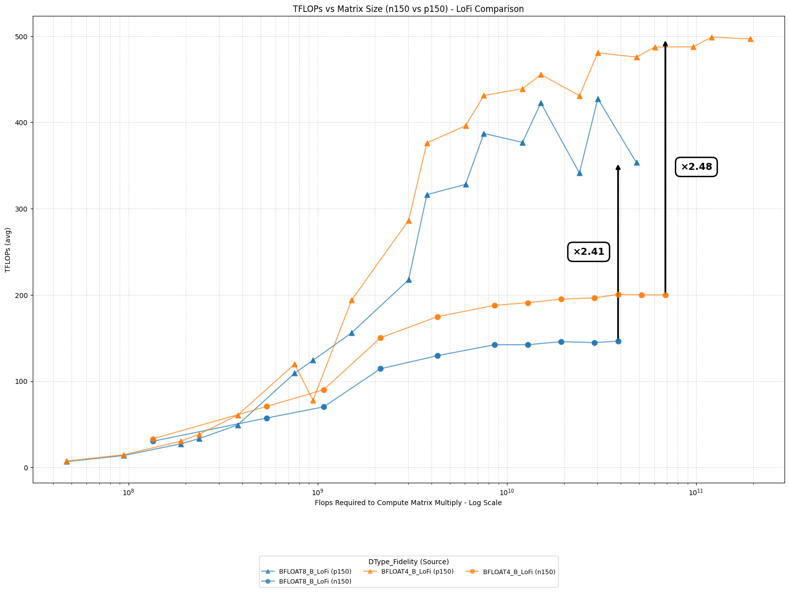
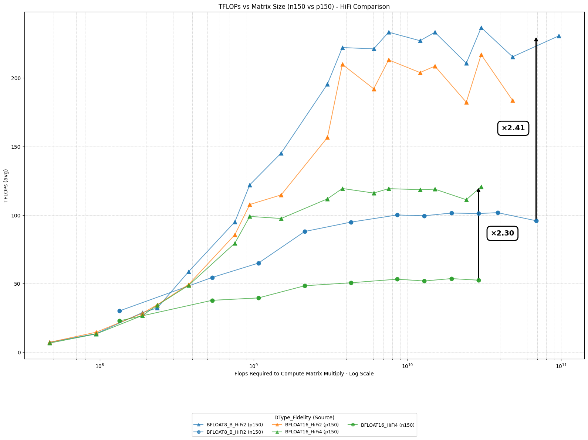
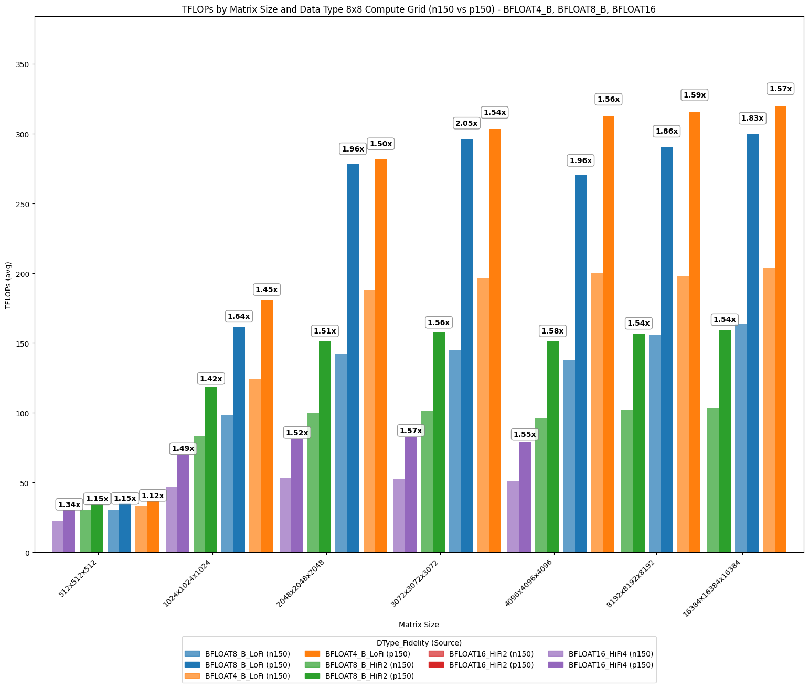
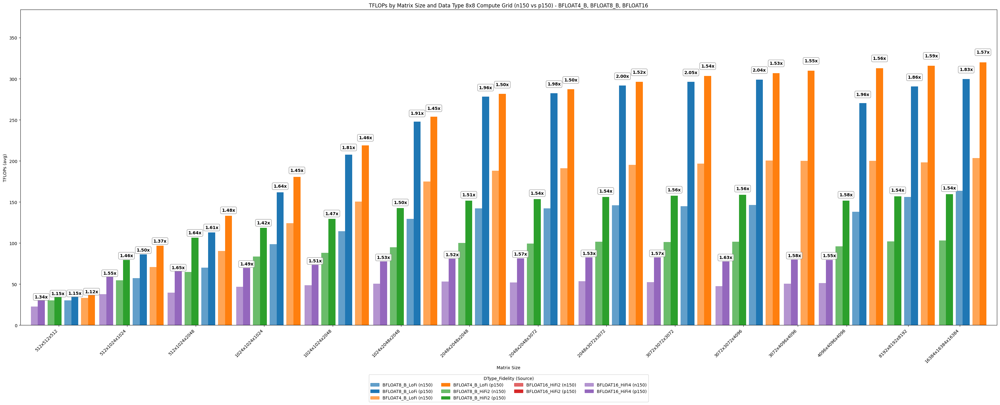
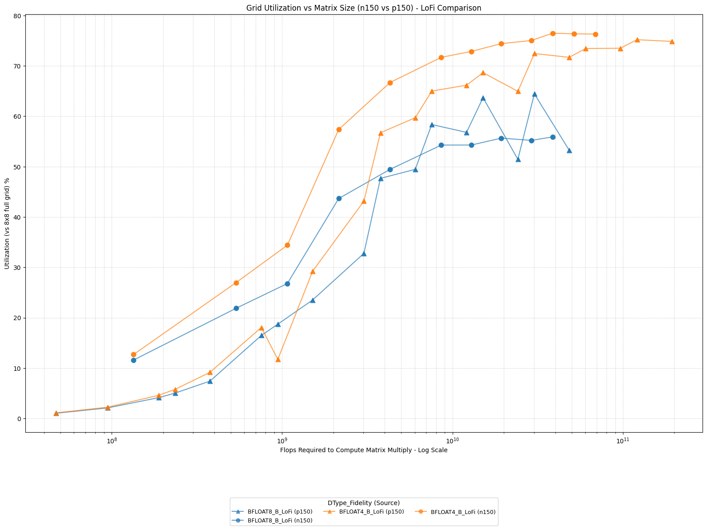
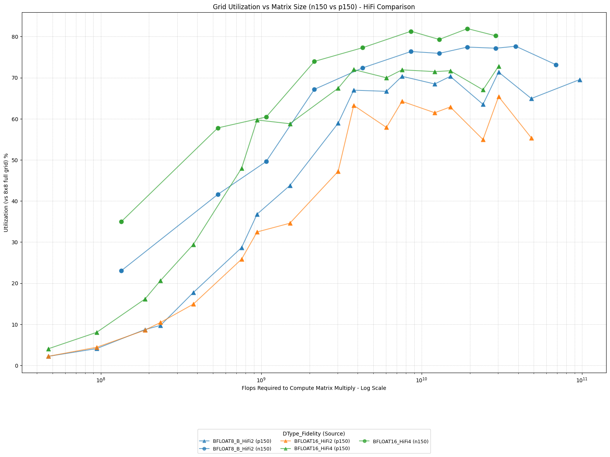

# Matrix Multiply FLOPS


## Introduction

Machine learning computation, especially neural networks, relies heavily on linear algebra operations. One of these crucial and particularly computationally intensive operations is matrix multiplication. General Matrix Multiplication (GEMM), despite being extremely optimized in software, is still extremely time and compute intensive, and having fast matrix multiplication is key to efficient and fast inference of modern neural networks. Many core operations, such as fully connected layers, convolutions, and attention mechanisms in transformers, can be reduced to and represented as one or many GEMMs.


| Machine Learning Component      | How GEMM/matmul is used                               |
|---------------------------------|------------------------------------------------------|
| Dense Layer (MLP)               | Input × Weight matrix                                |
| Convolution       | Input patches × Filter matrix                        |
| RNN/GRU/LSTM Cell               | Input/State vector × Weight matrix                   |
| Attention (Transformers)        | Q, K, V projections; Attention scores computation    |
| Output Projection               | Hidden activations × Output weight matrix            |


In February 2025, Tenstorrent released the new Blackhole architecture cards. Through this tech report, we will show you the performance uplift that can be gained with this new silicon.


## Test it yourself!

The matrix multiply TFLOPS results can be tested on N150 and P150 card using:

```bash
TT_METAL_DEVICE_PROFILER=1 pytest tests/ttnn/unit_tests/benchmarks/test_benchmark.py::test_matmul_2d_host_perf
```

## Design of Experiments

We will vary three different parameters for this experiment
1. Dimensions: The sizes of the matrices along each axis, denoted as m , n , and k . (m ,k ) represents the size of the input tensor, while (k ,n ) is the size of the activation tensor. Larger tensors require more computation since the number of operations needed to perform matrix multiplication increases as O(m*k*n).
2. Computation Fidelity: Referred to as LoFi, HiFi2, HiFi3, and HiFi4. Internally, the matrix engine can adjust the number of bits being processed, which affects both the precision of the results and the computation speed.
3. Input/Output Datatype: Larger datatypes require more memory for storage. As a result, more precise datatypes can become bottlenecked if stored in DRAM.

For more details please refer to the tech reports [Matrix Engine](../matrix_engine/matrix_engine.md) and [Data Formats](../data_formats/data_formats.md)

Tenstorrent accelerators consist of a grid of Tensix cores, each capable of performing matrix operations. These cores are interconnected through the NOC (Network on Chip), which enables data transfer between different Tensix cores and facilitates communication with dedicated DRAM interface cores.


## MicroBenchmarks

### Matrix Multiplication TFLOPS on Wormhole and Blackhole

The wormhole and blackhole matrix engines performs 8x16 x 16x16 = 8x16 in a single cycle.
- This is 2*8\*16\*16 = 4096 muladds in a single cycle.
- At 1GHz, this is 4 TFLOPS per matrix engine.
- The 8x16 is the smallest matrix that can be fed into in0, and 16x16 is the smallest matrix that can be fed into in1.

If the input matrices fed into the engine are "shorter" than 8x16, for example 1x16, the engine will still perform 8x16 x 16x16 = 8x16, but the effective throughput will be 1/8.
Thus, for 1x16 x 16x16 matrices, the effective throughput is 0.5 TFLOPS per matrix engine.

MATH_FIDELITY is used for higher precision, and TFLOPS are calculated by dividing by the MATH_FIDELITY value.
- LoFi ->  ~4 TFLOPS
- HiFi2 -> ~2 TFLOPS
- HiFi3 -> ~1.33 TFLOPS
- HiFi4 -> ~1 TFLOPS


### Utilization derivation formula

```
Utilization = ideal cycles / actual cycles.
Ideal cycles = (m * k * n) / (tile_height * tile_width * tile_height) * (cycle_per_tile / num_cores)
```
- Cycle_per_tile is the ideal compute cycle for each tile, which depends on math fidelity (LoFi: 16, HiFi2: 32, HiFi3: 48, HiFi4: 64).
- For utilization of user-specified grid size, num_cores is the user-specified number of cores.
- For utilization of full grid size, num_cores is the maximum number of cores available for compute. Currently the max available is 8x8 for Wormhole cards, but can be up to 12x10 for Blackhole cards.

### Results

First, we show the maximum matrix multiplication performance that can be achieved on each of the cards, starting with LoFi performance. We observe a 2.4× to 2.5× increase in performance on the Blackhole cards, reaching approximately 500 TFLOPs of throughput.




When operating on higher fidelity math modes and with higher datatypes, maximum throughput is reduced, but the inprovements remain in the 2.3x-2.4x region.


Below are the results generated by running the benchmark script, showcasing the performance of matrix multiplication (matmul) operations using square matrices with sizes ranging from 512×512×512 to 16,384×16,384×16,384. Due to the constraints of memory sharding, only an 8×8 compute grid can be used, even on Blackhole.



Once the matrix sizes reach approximately 2048×2048×2048, we observe that the Blackhole cards are about 1.5× faster for most datatypes. However, the Tensix cores achieve a 2× speedup when executing BFLOAT8_B operations in low-fidelity mode.




Even when operating on non-square matrices, we observe a similar trend: once the matrix size becomes sufficiently large, performance begins to level off. Testing with the same compute grid also makes it easier to port code from Wormhole to Blackhole, as no changes to compute grid assignment or L1 sharding are required.


#### Utilization

Depending on the fidelity, datatype, and matrix shape chosen, different peak teraflop values can be achieved. However, achieving full utilization of all cores can reveal the presence of memory bottlenecks. We first plot the utilization for the fixed 8×8 compute grid.


As expected, since the Blackhole card has a larger available compute grid, utilization is significantly lower than on the Wormhole cards. However, by using different matrix sizes, we can obtain a better estimate of the maximum performance achievable on the Blackhole processor.





As observed, utilization on the Blackhole cards is similar to, if not slightly lower than, previous generations. This is expected, as the larger NOC grid may introduce additional data transfer delays due to the need to move data across more Tensix cores.


### Understanding device scaling: SRAM vs DRAM

When a Tensix core executes an operation, it does so by reading data from SRAM, forwarding it to a register, performing the computation, and then writing the result back to SRAM. Each Tensix core on a WH ASIC has approximately 1.5MB of SRAM. When data fits within this SRAM, each Tensix can operate without contention. However, some problems require more working memory than SRAM can provide. In these cases, the Tensix core will instead map data to device memory or DRAM. Accessing data from DRAM is slower than SRAM, both in terms of bandwidth and latency.

In this report, the developed Python scripts evaluate three separate configurations: (1) all matrices stored on L1 (SRAM), (2) one matrix on L1 and one on DRAM, and (3) both matrices on DRAM. In most cases, if possible, storing all matrices on L1 is ideal, as it completely avoids accessing the slower DRAM. The configuration with one matrix on L1 and one on DRAM incurs a small performance penalty, typically in the single-digit percentage range at worst. DRAM-only performance is highly variable: small matrices suffer the largest performance penalty when stored in DRAM, while larger tensors achieve performance closer to an L1-only configuration.

Additionally, due to the interconnected nature of the WH ASIC, a clever programmer may observe that the output of one Tensix core is often needed as the input for another. Instead of writing this data back to device memory, it can be forwarded directly over the NOC, enabling more efficient data movement between cores.
