# Collective Communication Library (CCL)

Contact for questions/comments: [Sean Nijjar](mailto:snijjar@tenstorrent.com)

# Summary {#summary}

This documentation is intended to be used as a guide for a new developer, looking to understand the multichip capabilities and programming model for Tenstorrent scaleout and multi-chip. This document aims to assist a reader in understanding several key categories of information:

* the underlying programming interfaces to implement multichip programs and data movement  
  key differences between programming single chip and multichip workloads  
* recommendations and best practices for writing custom multichip workloads  
* the CCL op library: what ops are available and how are they implemented

The document describes the multichip software stack bottom-up in the following sequence:

1. How cores and ethernet are connected to build multi-chip clusters  
2. Sending data between chips and the APIs to accomplish those tasks  
3. How multichip workloads interact with the kernel dispatcher and the new challenges this brings  
4. Writing kernels to send data over ethernet  
5. A library of software components that can be used to build higher level (CCL) operations  
6. Incorporating the above to build CCL operations, such as *all-gather*

Prior to reading this document, it is recommended the reader is familiar with Tenstorrent single chip programming concepts. This foundational information can be found here in the [TT-Metallium developer guide](https://tenstorrent.github.io/tt-metal/latest/tt-metalium/tt_metal/apis/index.html).

It is recommended to the reader to be familiar with the following concepts before reading this document:

* Device architecture files  
* How to write a single-chip kernel and instantiate it from host, including:  
  * Passing arguments  
  * Familiarity with the dataflow_api  
  * Creating semaphores and allocating buffers  
* Fast dispatch

Additionally, unless otherwise stated, any specifics with respect to details such as performance numbers, specifications, or resource counts, are specific to the Wormhole architecture. Performance numbers for CCL operations are expected to improve over time as optimizations are incrementally applied.

[Summary](#summary)

[Multichip Topologies and Connectivity](#multichip-topologies-and-connectivity)

[Ethernet And ERISCs](#ethernet-core-and-eriscs)

[Moving Data Between Chips](#moving-data-between-chips)

[Microbenchmarks](#microbenchmarks)

[Operating Environment](#operating-environment)

[Writing Ethernet Kernels](#writing-ethernet-kernels)

[Example Multi-Chip Program Implementation Walkthrough](#example-multi-chip-program-implementation-walkthrough)

[CCL Higher Level Building Blocks](#ccl-higher-level-building-blocks)

[ERISC Data Mover (EDM) Engine](#erisc-data-mover-(edm)-engine)

[Host CCL Op Builder Components](#host-ccl-op-builder-components)

[Orchestrating (From Host)](#calling-multichip-ops-from-host-(ttnn))

[Op List](#op-list)

[Measuring Op Performance](#measuring-op-performance)

[(Ring/Line) All Gather](#(ring/line)-all-gather)

[(Ring) Reduce Scatter](#(ring)-reduce-scatter)

[Testing](#testing)

[Lower Level Debug Guide](#lower-level-debug-guide)

# CCL Software Stack Overview

CCL operations are implemented on top of multiple software API layers; both single and multi-chip APIs. To ease programming burden and to reduce test and optimization surface area and improve reusability, CCL operations reuse higher level programming APIs, in particular the Erisc Data Mover (EDM). Developers are free to program at their desired level of abstraction.

The current stacks look like the following:

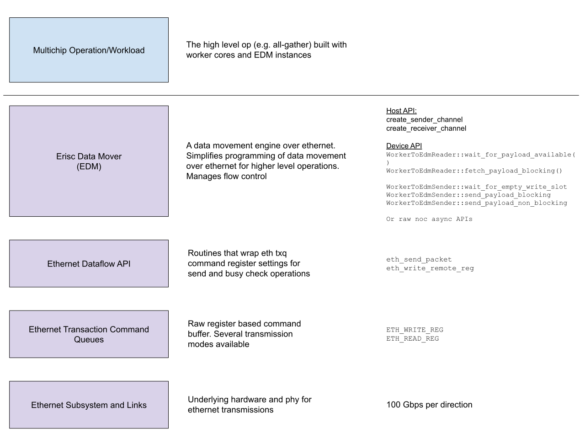
<p align="center"><i>CCL multichip abstraction layers</i></p>

The Ethernet subsystem, including the link and phy are at the lowest level.

Above thise are APIs to direct write to Ethernet command queue registers, which can be used to initiate ethernet transactions and change message modes (raw vs packet for example).

The third level is the ethernet dataflow API which lets the user initiate writes over the ethernet link. These APIs are similar to the noc async APIs in that commands are issued to command buffers and dispatched at some later, unknown time.

The fourth level is the Erisc datamover which encapsulates many common pieces of functionality that are required by multichip operations: startup/teardown synchronization, flow constrol, virtual channels, and multi-buffering.

Finally, higher level operations are implemented.

# Multichip Topologies and Connectivity {#multichip-topologies-and-connectivity}

Starting with the Wormhole architecture, Tenstorrent offers multi-chip functionality where two or more Wormhole chips can be connected together. Tenstorrent’s scaleout strategy enables Wormhole and later chips to communicate directly with each other,  
It doesn’t require:

1)  a host CPU as an intermediary   
2) or a switch (such as NVSwitch)  
3) or a network card (such as Infiniband NIC)  
   

Currently, device chips are connected directly to each other via a number of Ethernet links. Several multi-chip topologies are possible and can be assembled together to build larger systems, in accordance with user needs.

# Ethernet core and ERISCs {#ethernet-core-and-eriscs}

To achieve Ethernet scale-out capabilities, the Wormhole architecture adds a new core type. Like worker cores, DRAM, PCIe, ARC, and routing cores that are present in Grayskull, the new core type (called an Ethernet core), is also accessed as a NoC endpoint. Every Wormhole part contains 16 total Ethernet cores on the NoC. Depending on the particular part, all 16 Ethernet cores may be connected to active links. This provides a large space for cluster topology design.

## Ethernet Core Type: Ethernet

Ethernet cores contains:

1) single RISC-V processor  
2) 256KB of L1 space   
3) Ethernet subsystem for sending data over the Ethernet link.   
   

Note that there are no Tensix compute units.

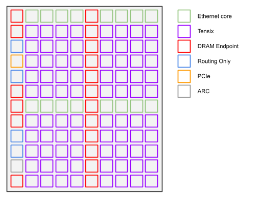
<p align="center"><i>Wormhole NoC 0 view</i></p>

## Ethernet Core (ERISC)

Some features and specifications of the Ethernet core are listed below.

Architecture file label:”eth”  
Core Features:  
Instruction cache (Icache): enabled  
Instruction RAM (IRAM): disabled  
L1 (total): 256K  
L1 (for kernel): ~150KB (from [eth_l1_mem::address_map::ERISC_L1_UNRESERVED_BASE](https://github.com/tenstorrent/tt-metal/blob/97b21652e1a00579882427a21e95db318bc0c079/tt_metal/hw/inc/wormhole/eth_l1_address_map.h#L72) to end of L1)

Each Ethernet core can be connected to 0 or 1 ethernet links. If a core is not connected to a link, the core can still be used for other tasks, but it is not able to directly send data to another chip. 

## Ethernet Link

Every Wormhole Ethernet core is uniform in performance, all capable of sending and receiving a theoretical 100Gbps per direction. This includes overheads such as the Ethernet packet header, which is inserted automatically by the Ethernet subsystem. This overhead affects the achievable workload bandwidth, although the effect is marginal for larger packets. For Wormhole, the specifications for packet sizes and headers are as follows:

Minimum Packet Size: 16 B  
Maximum Packet Size: 1500 B  
Packet Overheads: 50+B
- 14B Raw Packet header
- 16 Byte Packet header
- 16B MAC header
- some bytes for FEC header
- 4B CRC

The numbers above lead to a workload bandwidth utilization curve which is shown below. For any reasonably sized payload (as small as a single bfp4 tile) leads to minimal overheads. For small packets, ~91% utilization is possible and for typical packets - tiles of bfp8, fp16 - there are overheads of  less than 5% . Payloads larger than 1KB are in the roughly 6% to 3% packet header + CRC overhead range. 

Note: The payload sent can be larger than the maximum packet size. The Ethernet subsystem will break the larger payload into smaller packets.  

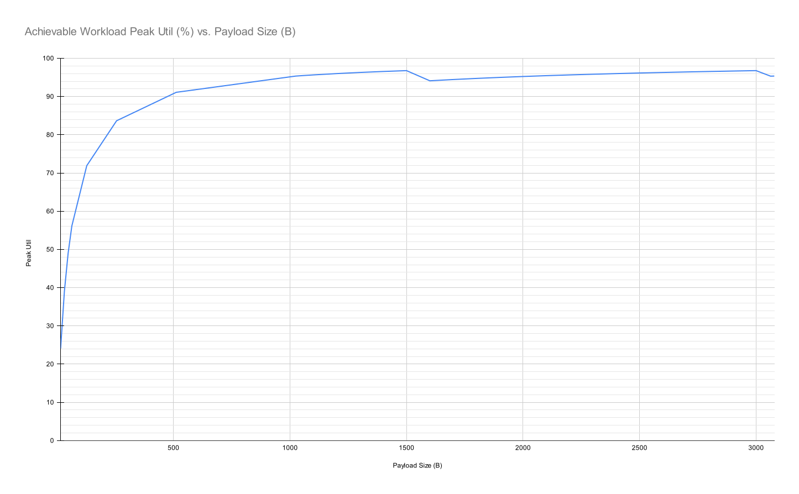 

In aggregate, when all 16 Ethernet links are active, a single Wormhole chip provides 1600Gbps of ethernet bandwidth in each direction, for a total of 3200 Gbps (400 GB/s) bi-directional bandwidth. 

### Link Health and Retraining

Ethernet links may occasionally go down from time to time. Although rare in isolation, the events may become common in very large scale systems. In such events, the ethernet links can be retrained to re-establish a connection between the two ends of the links. However, retraining requires the assistance of the ERISC to execute retraining routines in software. Therefore it is important to allow any user written kernels to be written with an eventual code path to the lower level ethernet firmware. This can be accomplished by calling the [`run_routing()`](https://github.com/tenstorrent/tt-metal/blob/97b21652e1a00579882427a21e95db318bc0c079/tt_metal/hw/inc/ethernet/tunneling.h#L107) function.

When writing ERISC kernels, it is important to use the dataflow API calls in [`eth/dataflow_api.hpp`](https://github.com/tenstorrent/tt-metal/blob/97b21652e1a00579882427a21e95db318bc0c079/tt_metal/hw/inc/ethernet/dataflow_api.h) instead of [`dataflow_api.hpp`](https://github.com/tenstorrent/tt-metal/blob/97b21652e1a00579882427a21e95db318bc0c079/tt_metal/hw/inc/dataflow_api.h) because of the embedded calls to `run_routing()`.

By default, with the current data flow APIs, it is currently not possible to avoid calling of the `run_routing()` function unless the kernel has an infinite loops that does not call any of the ethernet data flow API functions under [`eth/dataflow_api.hpp`](https://github.com/tenstorrent/tt-metal/blob/97b21652e1a00579882427a21e95db318bc0c079/tt_metal/hw/inc/ethernet/dataflow_api.h).

TODO: Track link retraining counts

## Ethernet and Cluster Connectivity

The Tenstorrent’s Wormhole and future architectures provide cluster configurability with the same underlying hardware and programming model. For example, one system could be configured as a 2D mesh while another may be deployed as a 3D torus. Standard configurations are provided in the N300, T3000, and Galaxy products, which can be used as building blocks for larger deployments. This subsection describes cluster topology and connectivity from NoC to cluster level.

### Topology and connectivity

The Tenstorrent architecture, starting from Wormhole, is scalable to many chips via Ethernet. As such there are several predefined multichip configurations, which are usable as building blocks for larger systems. For each configuration, Ethernet links are connected to one Ethernet core on each chip on either end of the link. Each Ethernet core has only one connection available, and therefore, can only communicate with at most one other Ethernet core over an Ethernet link.

Multichip clusters are configurable with different topologies. A file, called a “cluster description file” is used to describe this (potentially custom) connectivity to the software stack. The cluster description file contains:

* Chip IDs and the location of each chip  
  * Locations are a 4-tuple of [x,y,rack,shelf]  
* Chips connected directly to (a) host via PCIe and memory mapped  
* Chip-to-chip connections by chip and Ethernet channel pairs

Here is a sample, contrived cluster description file where two chip chips are connected with a single link.

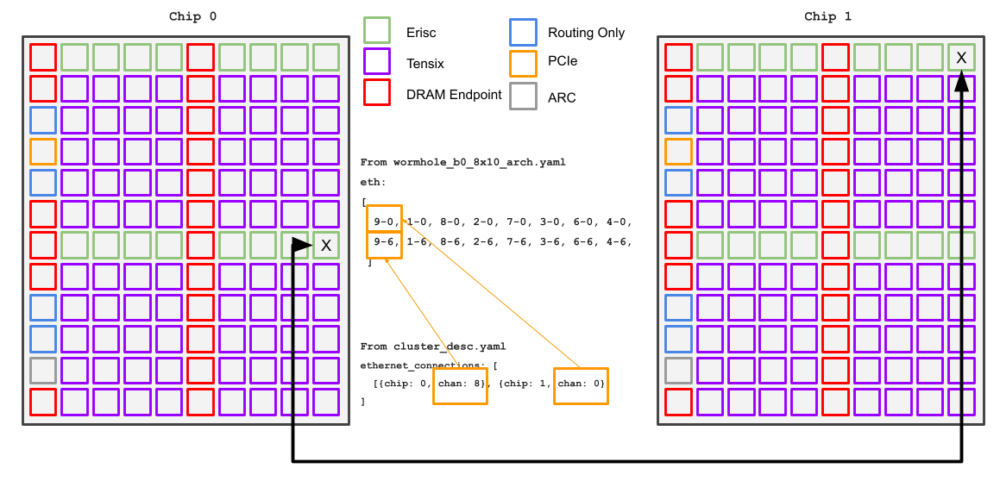

<p align="center"><i>Example of two Wormholes connected over ethernet</i></p>

#### N300

The N300 is a single board part with 2 chips, the simplest supported multichip configuration. One of the two chips has a PCIe connection and is able to communicate directly with the host. This first chip is sometimes called the local/left, or “L” chip. The second is not directly accessible through PCIe and is only accessible through ethernet via the first, local chip. This second chip is sometimes called the remote/right, or “R” chip. 

To manage this limitation where the remote chip is not directly accessible by the host, the Dispatcher datapath reserves one of the links for its own use to send program data to the remote chip.

In total, there are 200 Gbps of bandwidth, in each direction, between the local and remote chips. The board provides six additional ports to enable Ethernet connectivity to external boards/devices. With the reserved Dispatcher link taken into account, 100 Gbps of bandwidth is available per direction for user kernels.

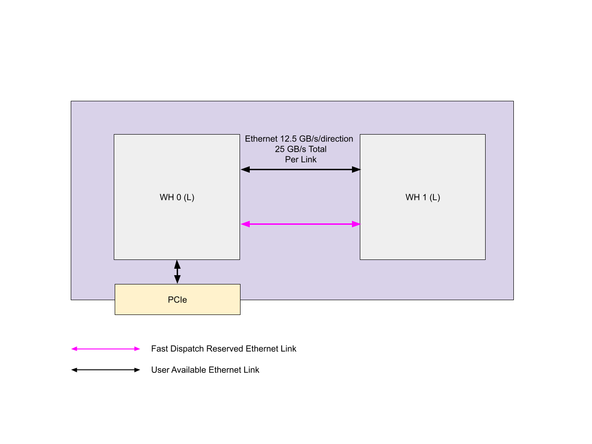
<p align="center"><i>N300 Board</i></p>

#### T3000

The T3000 part is a desktop form factor machine which contains a total of eight Wormhole chips in a 2x4 mesh configuration. The part is assembled from four N300 parts, implementing the mesh using the external ports; previously mentioned. In this configuration, each N300’s local chip is directly addressable by the host CPU: chips 0,1,2, and 3 are accessible directly through PCIe but the others are not.  As with the N300 part, one link from the local to the remote chip is still reserved for Dispatcher datapath’s use. Ethernet link speeds remain the same as with N300.


<p align="center"><i>T3000 Boards</i></p>

#### Galaxy

The Galaxy part is larger compared to the prior two parts, and is intended to be used as a building block for large scaleout systems. Each Galaxy part contains 32 Wormhole chips assembled in a 4x8 2D mesh. In this configuration, all non-edge and non-corner chips utilize all 16 of their Ethernet links. The corner and edge chips use fewer links. However, They have unconnected Ethernet cores which can be connected to Ethernet links which can be used to connect multiple Galaxies to each other in a larger mesh, or they can be used to convert this mesh into a torus. As with all other scaleout Wormhole parts, Ethernet link speeds are the same at 12.5 GB/s per direction per link with a total of 25 GB/s bidirectional.


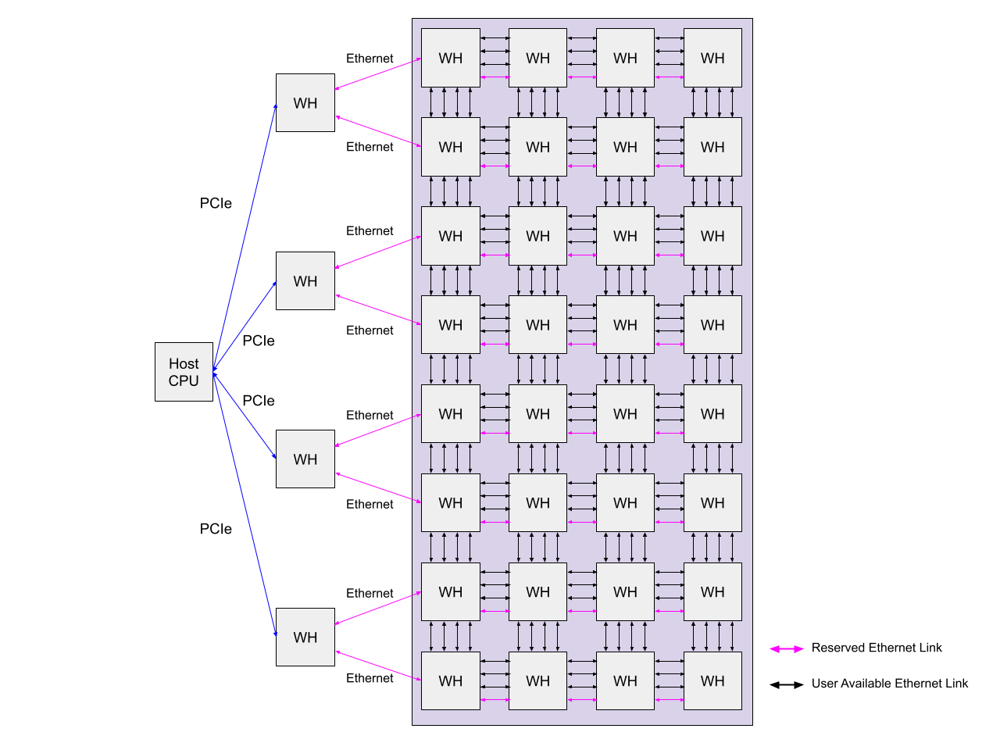

### Ethernet routing firmware

Given that Ethernet scale-out enables multichip systems where only a subset of the chips are directly addressable by the host CPU, it was essential to provide a mechanism for the host CPU to move data into and out of remote chips. For this reason, every ERISC is programmed with a routing fabric, implemented in firmware.

This base level firmware implements multi-chip routing for moving data to non-memory-mapped/PCIe connected chips, from the host. This firmware is saved onto the SPI-ROM and is loaded at board startup. This routing layer is used by the “Slow Dispatch” dispatcher path and is further used to bootstrap more higher level components, such as Fast Dispatch.

# Moving Data Between Chips {#moving-data-between-chips}

This section outlines the basic commands and APIs for sending data over Ethernet, between chips. It describes the basics of how commands are queued up and how they complete. It also briefly discusses topics such as flow control over Ethernet and comparisons with single chip datalow_api commands such as noc_async_write.

In a multichip system, there is no concept of shared memory or global addressability across chips for Wormhole or Blackhole. To perform communication between chips, packet transmissions must be performed by Ethernet cores. At the most fundamental, data movement from chip to chip is explicit. Only Ethernet cores are capable of sending data over ethernet links and they are only able to write into the L1 of the Ethernet core on the other end of the ethernet link. The basic operation to move data from one chip to another is to first move it into the ERISC L1 of the Ethernet core connected to the correct link, then from the ERISC core use the Ethernet dataflow APIs to send the data to ERISC L1 immediately on the other end of the link, and repeat the process until the route is completed.

## Sending Data Over The Ethernet Link

To send a payload over the Ethernet link, the [`eth_send_packet()`](https://github.com/tenstorrent/tt-metal/blob/97b21652e1a00579882427a21e95db318bc0c079/tt_metal/hw/inc/ethernet/tunneling.h#L58) can be used. With this function, the caller specifies a source L1 address (from the sender ERISC), a destination L1 address (on the destination ERISC), and a total payload size. Sizes and addresses are specified with 16B alignment.

This function is non-blocking and submits the command attributes (addresses and sizes) to the specified ethernet tx command queue. The command will execute at some future time and is not guaranteed to be dispatched at the time of the call. Therefore, the caller cannot expect the send to be complete, or even started by the time control returns to the caller of `eth_send_packet()`. 

### Ethernet Writes Compared To On Chip NoC Writes

Writes over ethernet do not have the same capabilities and checks as are available for asynchronous writes over the local chip NoC. An issuer of a NoC asynchronous write can know when the write has left the sender L1 or if it has arrived at the destination address (via, [`noc_async_writes_flushed()`](https://github.com/tenstorrent/tt-metal/blob/97b21652e1a00579882427a21e95db318bc0c079/tt_metal/hw/inc/dataflow_api.h#L1507) and [`noc_async_write_barrier()`](https://github.com/tenstorrent/tt-metal/blob/97b21652e1a00579882427a21e95db318bc0c079/tt_metal/hw/inc/dataflow_api.h#L1494) respectively). 

In comparison, the sender ERISC has no way to determine if writes are flushed out of L1 or committed to destination L1, on its own. To achieve similar functionality, a higher level flow-control protocol must be implemented on top of the send packet primitives, with some form of signaling or acknowledgement from the receiver ERISC. It is up to the user to decide the software protocol to use that best fits their needs.  
Example protocols and components which implement end-to-end flow-control are described in later sections (see “Erisc Data Mover”).

### Ethernet Transaction Command Queues 

Every ethernet command initiated by the ERISC is submitted to a transaction command queue (tx_cmd_q). Two independent Ethernet tx_cmd_qs are available on the core. These can be used as virtual channels or to alleviate back pressure if Ethernet commands are blocked in a given queue due to the queue being busy.. At the time of writing, only tx_cmd_q 0 is made available for use. Tx_cmd_q 1 is currently reserved but may be made available for general use in the future. 

The command queues can only be written into if the command queue has capacity and is not busy. For a robust and high performing implementation, the user should be aware of this behavior. It is recommended to check for the command queue being busy prior to submitting commands so that the ERISC can advance other lines of work while the command queue is busy and unable to take additional commands. The [eth_txq_is_busy()`](https://github.com/tenstorrent/tt-metal/blob/2404c8ba36c0b41970ef4e28c27b5462d782955a/tt_metal/hw/inc/ethernet/dataflow_api.h#L26) function is available to check if the command queue is busy. 

Commands are completed in order within a command queue. However, commands across command queues have no ordering guarantees. Any algorithms or protocols that require ordering dependence between (sequences of) commands must ensure to submit those sequentially dependent commands to the same command queue to avoid unintended reordering.

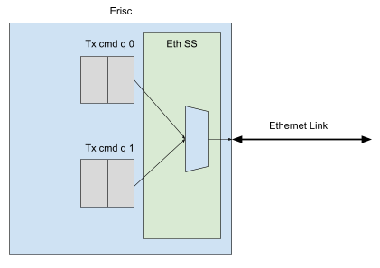

As previously mentioned, commands submitted to the command queue may start at a later time. It is therefore unsafe to modify the contents of the source address range of the packet until the sender has received some sort of acknowledgement that the write command has completed on the destination.

This asynchronous behavior puts the user at risk of race conditions if certain practices are not followed.

### End-to-End Flow Control

Since Ethernet does not provide a mechanism for the sender to know when packets are sent from L1 over the Ethernet link the user must provide their own flow control.

Although it is possible to implement custom flow-control with only the `eth_send_packet()` function, Metallium’s CCL provides the ethernet dataflow API which implements end to end flow control for a fixed number of ethernet channels with its helper functions. The [`erisc_info`](https://github.com/tenstorrent/tt-metal/blob/97b21652e1a00579882427a21e95db318bc0c079/tt_metal/hw/inc/ethernet/tunneling.h#L41) with [`eth_channel_sync_t`](https://github.com/tenstorrent/tt-metal/blob/97b21652e1a00579882427a21e95db318bc0c079/tt_metal/hw/inc/ethernet/tunneling.h#L17) is also provided as a book-keeping data-structure for the ethernet dataflow API functions to implement end-to-end-flow control. 

The fields used in the `ethernet_channel_sync_t` to implement flow control are the `bytes_sent` and `receiver_ack` fields. The `eth_channel_sync_t` is sent to the receiver to indicate payload status. The fields are used in the following way:

[**bytes_sent**](https://github.com/tenstorrent/tt-metal/blob/97b21652e1a00579882427a21e95db318bc0c079/tt_metal/hw/inc/ethernet/tunneling.h#L24)**:** The sender sets this to a non-zero value, matching the number of bytes sent in the payload associated with this channel.

Receiver clears this field (and receiver ack), to indicate that the receiver buffer is free for writing into by the sender.

[**receiver_ack**](https://github.com/tenstorrent/tt-metal/blob/97b21652e1a00579882427a21e95db318bc0c079/tt_metal/hw/inc/ethernet/tunneling.h#L28)**:** Receiver sets this field to a non-zero value to indicate to the sender that it has received the packet.

[Recommendation]: Use a different source address by the receiver when sending an acknowledgment message compared to when sending a completion message to avoid a race condition that could lead to double completion messages. Set aside a 16B word in receiver EDM L1 with an `eth_channel_sync_t` struct mapped onto it and have the `receiver_ack` field set to non-zero.

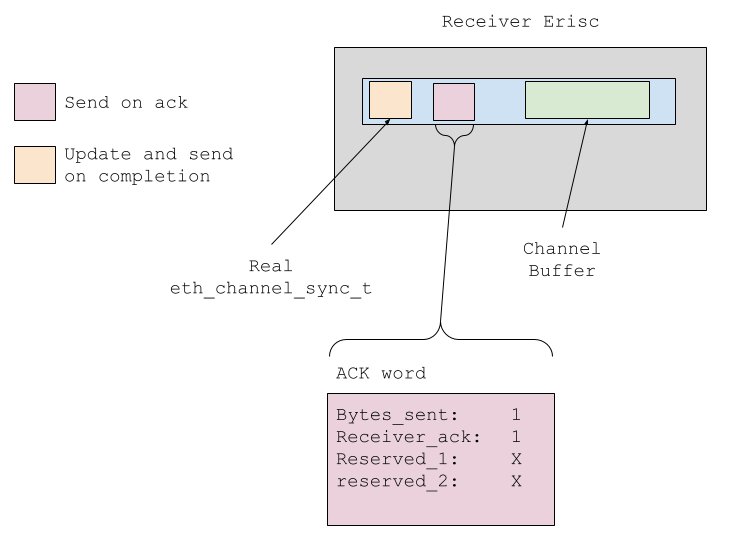

By default, `eth_channel_sync_t` updates are made by separate packet sends. However, when possible, it is more efficient to pack the `eth_channel_sync_t` as a suffix to the payload and send the payload and channel sync updates in the same send packet call. This avoids gaps that could otherwise be inserted by the ethernet transaction command queue accepting the payload command but back-pressuring the channel sync update command.

[Recommendation]: Allocate sizeof(eth_channel_sync_t) of space after each channel buffer. Update this `eth_channel_sync_t` before sending each payload from sender and include that in the `eth_send_packet` call when sending the main payload. 

When both the eth_channel_sync_t and payload are merged, the channel synchronization part of the total message *must* be appended to the end to avoid a race. Otherwise, the receiver could see that the channel synchronization value flipped, while the payload is still being transmitted, and it could read data later in the buffer which may not have been updated yet, since it is still in transit;.

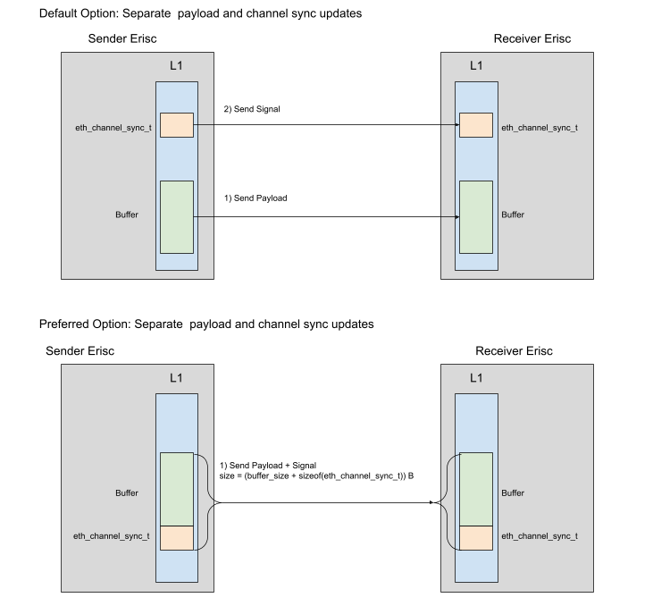

The following code snippet shows an example of a packet send that extends the payload size by 16 bytes (or one Ethernet word) to include a channel synchronization flit that was allocated at the end of the buffer.

```
// Sender channel side, src, dest buffer addresses match in this example  
volatile eth_channel_sync_t* channel_sync = buffer_base_address + buffer_size_bytes;  
channel_sync->bytes_sent = buffer_size_bytes;  
channe_sync->receiver_ack = 0;

uint32_t buffer_address_eth_words = buffer_base_address >> 4;  
uint32_t send_size_eth_words = (buffer_size_bytes + sizeof(eth_channel_sync_t)) >> 4;

eth_send_packet(  
  0,   
  buffer_address_eth_words,   
  buffer_address_eth_words,   
  send_size_eth_words);  
```

# Microbenchmarks {#microbenchmarks}

Several microbenchmarks have been built and run to help characterize the Ethernet performance and capabilities. The microbenchmark results are summarized in this section. They are intended to drive multichip workloads towards better performing designs.

Four main microbenchmarks are shown:

1) Raw bidirectional bandwidth microbenchmark by size most ideal   
2) Raw bidirectional bandwidth microbenchmark by size and packet count  
3) Multichip ring ping latency  
4) There-and-back single Ethernet link ping-response time 

## Bidirectional Bandwidth - By Packet Size and Max Channel Count

This bidirectional bandwidth microbenchmark measures the peak achieved bandwidth for a given packet size but a configurable number of channels of that packet size. For a given packet size, a number of channels are tested and the highest measured bandwidth is reported, leading to the following curve. The number of channels was limited to 30 per direction, which may explain the lower utilization for packets sized less than 4KB, due to overall lower L1 buffering at that number of channels for those smaller packets.

The slight performance degradation for packets above 16KB has not been root caused  

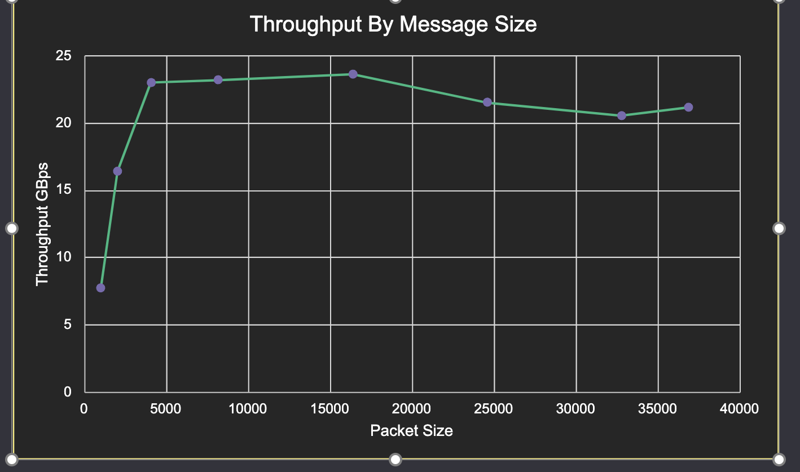

\[Recommendations\]:  
Prefer packet sizes between 4KB and 16KB each. If choosing smaller packet sizes, ensure there will be enough packets sent to utilize all of the instantiated channels. For smaller CCL operations, it can be preferable to instantiate more channels with smaller packets.


## Bidirectional Bandwidth -By Packet Size and Fixed Channel Count

Bandwidth utilization scales positively with packet size, as seen in these microbenchmark results. The results below are for a synthetic bidirectional bandwidth microbenchmark. This benchmark only sends packets between the ethernet cores and does not account for moving data in and out of the ERISC from the Tensix grid.

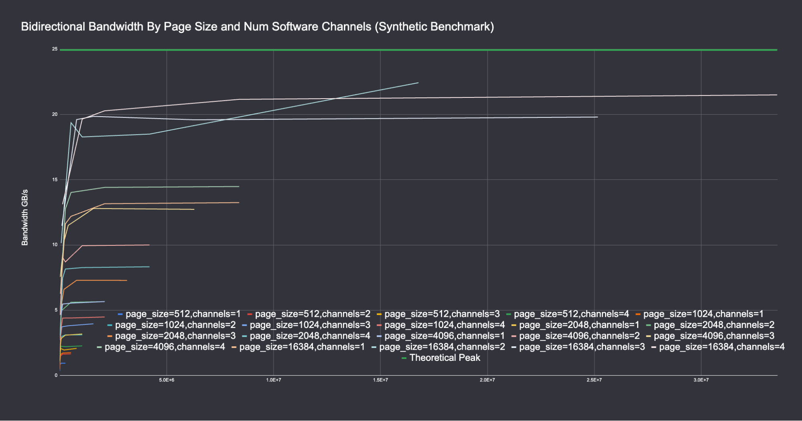

With the results of this microbenchmark, and the one listed below, the recommendation is to prefer packets sized 4KB to 16KB. 

## Ring Ping Latency

This microbenchmark measures the time it takes for a packet -or group of packets -to complete one trip around a ring. The number of chips in the ring, the number of concurrent packets, and the packet size are configurable.

Timing measurements are made by assigning a master core that initiates the roundtrip ping and timing how long it takes for that same core to receive the message from over ethernet after traversing through the full ring. In this formulation of the microbenchmark, the packet and payload available signal are not merged as is recommended in the “End-to-End Flow Control” section.

The measurements plotted below indicate the time taken to send # of channels single flit packets around two ring sizes (eight and twelve hops). The numbers provided indicate an approximately 690ns latency per hop for an 8 chip ring. Per hop numbers are similar, though slightly higher per hop for a 12 chip ring. 

Note: these numbers are outdated. More recent formulations of the benchmark result in lower overall latency at around 650ns per hop with a total 8 hop round-trip ping time of approximately ~5.2us. This new formulation merges the packet and payload available signals.  
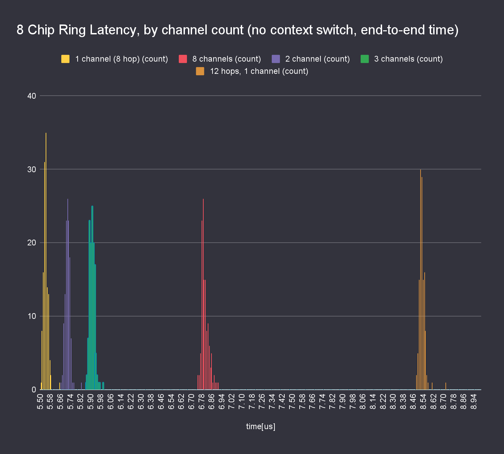

Below, the total ring latency is plotted by packet size. For a 1KB packet size, there is roughly a 1us per hop latency. The yellow line is the measured ring latency, by packet size. The red line is the computed bandwidth, based on the yellow line, minus the latency cost due to various link bandwidths. As the packet size grows, the time to serialize it over the link also grows linearly based on the throughput of the link. The red line is the measured bandwidth minus this number. Extrapolating the results below indicate that after packet sizes of approximately 5KB, the latency attributed to link BW starts to dominate.   

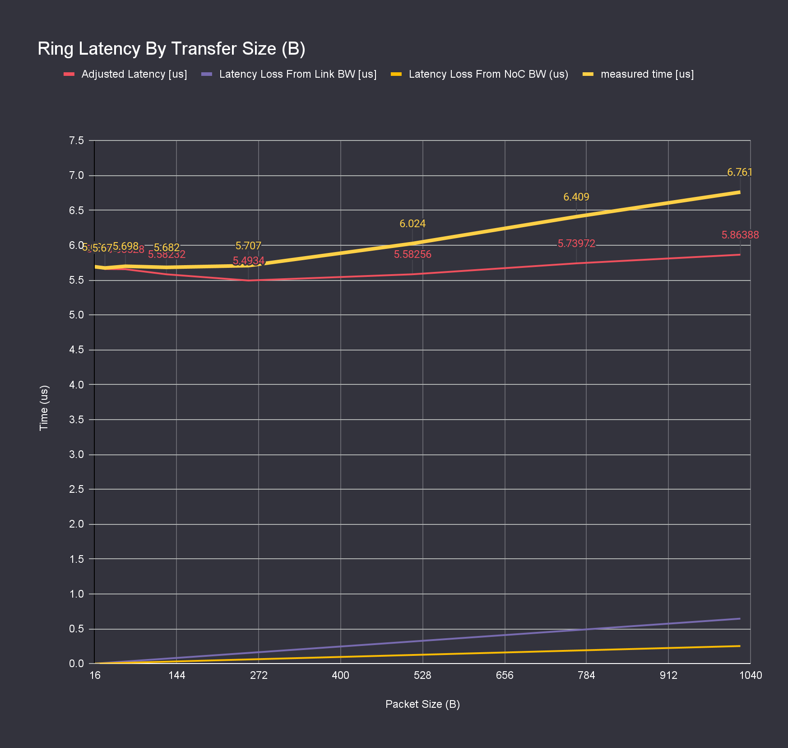

## Single Ethernet Link Round-Trip Latency

This microbenchmark sends a packet over the Ethernet link and measures how long it takes to receive a reply. Several components of the send and reply are profiled to better understand where the time is spent.

It can be seen that the latency to send a packet over the ethernet link is between 530 and 620 ns. This number is derived by taking the total time taken for the sender to send the packet and receive the response, minus the latency overhead to send the payload over the link, divided by two directions. Overall showing a roughly 1100 ns roundtrip time. 

Further, we estimate the time in the Ethernet subsystem and on the link to be approximately 500 ns, based on taking the total end-to-end time and subtracting the cycles taken by sender/receiver to initiate the requests/responses and subtracting the ideal send time (based on taking size in bytes divided by the link throughput).

Not shown are the time taken to initiate packet sends, which is roughly 80ns (including timer overheads).  

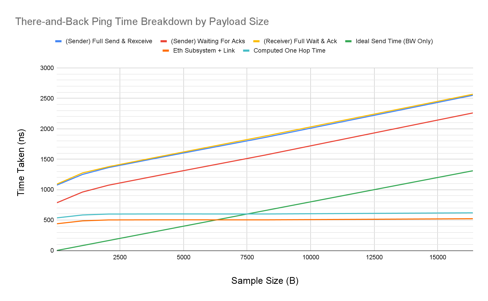

The results of this microbenchmark can inform Ethernet packet sizing for performance in order to mask send latency. Based on the numbers above, it is recommended to keep at least 8 KB worth of outstanding Ethernet message sized transfers in the tx command queues. 

# Operating Environment {#operating-environment}

The operating environment encompasses all of the runtime components that are outside of a user kernel and that are responsible for launching and executing user kernels. Typically, this operating environment includes the fast dispatch component, which offers certain guarantees for single chip workloads.

Multichip collective operations must take into account extra considerations and constraints that are inapplicable for single chip programs/operations. These concerns primarily relate to initialization of data-structures prior to program start. In a single chip (Program) the following components of a program and Tensix core are guaranteed to to be initialized, resolvable, computed, or completed, across the entire chip, prior to any worker starting their kernels:

* *[Resolved]* Input/output tensor address(es)  
* *[Initialized]* Semaphore initial values  
* *[Completed]* Prior “Program” kernels: The current program won’t start  
* *[Not Running]* Future program kernels: Will not start until all local cores are done the current “Program”  
* *[Usable]* NoC: it is always safe to initiate noc commands to/from any other core on the same chip without clobbering other “Program” state (assuming valid buffer addresses)  
* [Implementation] One program implements entire op

While all of the above guarantees can safely be built on for single chip kernels, they must be accounted for and designed for in multichip collective operations.

## Multichip Programming Challenges

The various new challenges that arise in the multichip environment are described below. For each of these challenges, candidate example solutions are described. 

### Tensor And Semaphore Lifetime and Address Resolution Problems

For a single chip program, all workers know the input and output tensor addresses they operate on, by the time they start. The worker kernel is safe to read from or write into its tensors any time during its lifetime. This is because the lifetime for these tensors is bounded and guaranteed to start no later than the earlier kernel start and finish no later than the latest kernel finish for the program.

This guarantee does not exist for tensors that reside on other chips. Even to pass in a tensor address for a tensor on a remote chip requires that the tensor is allocated and the address is resolved prior to creating the kernel or setting the runtime args. 

Two possible options to deal with this are to hard sync before assigning the kernel addresses or to switch to a scheme that doesn’t require absolute addresses. One such scheme is to implement pipes that route end-to-end, where the endpoints handle addresses to their local tensors.

The discussion above also applies to any other address information that is computed through host APIs such as semaphore addresses. 

### Asynchronous Program Start

Programs that are dispatched to different chips have no guarantees of timing or synchronization across the chip boundaries, even if the programs are part of a larger, logically atomic workload, such as an op. Therefore, any multi-chip (multiprogram) workloads must explicitly handle this asynchronous start problem and must ensure that it only sends data to other chips if and when it *knows* it is safe to do so through some other synchronization mechanism. In addition to using some synchronization mechanism to coordinate the startup of multi-chip workloads, the synchronization mechanism should also be *consistent* 

One solution to this problem is to require ERISC cores that share links to both implement a handshake protocol prior to sending/receiving any other Ethernet traffic. Additionally, require that every Ethernet protocol uses the same mechanism (i.e. with same addresses reserved for handshake), so that temporally adjacent kernels don’t clobber each other’s L1 space by trying to handshake at different L1 locations.

Without a protocol to take this into consideration, corruption can occur. 

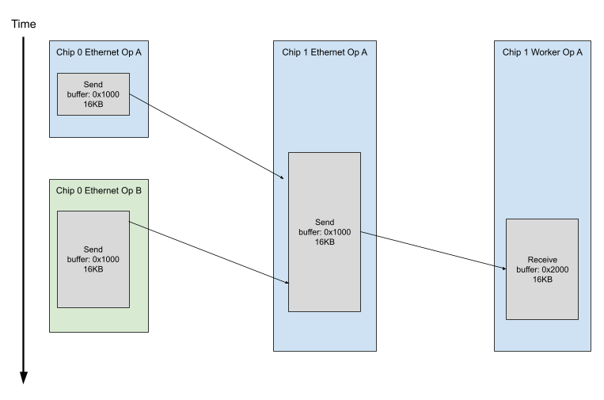

Without an initialization handshake for “Chip 0 Ethernet Op B”, it can start to send to a buffer which is in use by a prior op, while that remote Ethernet core may still be reading out the contents, which leads to data corruption

### Asynchronous Program Completion Problem

Similar to how programs across chips can start at different times, they also can complete at different times. Even with a consistent handshake protocol used across a temporal sequence of kernels, there is still a possibility of a race due to program completion if not handled properly. To properly handle this concern, it is recommended to wait for all outstanding credits or acks to arrive back for every send that expects them. 

Without following this recommendation, it is possible for an acknowledgement or credit, in flight from a temporally earlier kernel on the remote end of the link, to cause a later kernel on the local ERISC to misinterpret it as a handshake or packet acknowledgement.

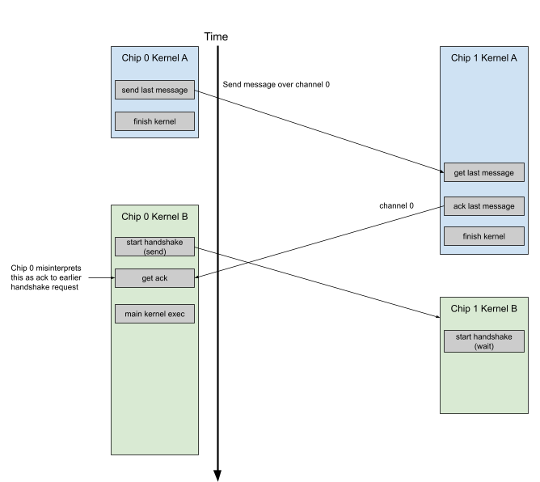

Without an adequate teardown process for Ethernet kernels, in-flight credit messages can be misinterpreted by temporally later kernels.

In conclusion, for Ethernet kernels, a recommended starting point is to have setup and teardown “handshakes”, where the teardown “handshake” can be as simple as waiting for outstanding credits to reach the sender.

### Fixed Datapath Resources Problem (Through ERISC)

Given that the ERISC core *must* be used to facilitate traffic over Ethernet between chips, for mutl-chip traffic, it becomes analogous to what the NoC is for single-chip traffic. This complicates multichip dataflow and routing because there are certain resource limitations for basic chip-to-chip Ethernet transactions that do not exist with their analogous single-chip NoC commands.

From the programming model perspective, when issuing NoC commands, a user kernel can issue *arbitrarily* many unicast commands without any functional concerns around resource limitations. The user is guaranteed that all of the NoC commands will eventually complete. No explicit buffer allocation along the NoC path is required, nor is coordinating the issuing of commands across cores required either.

However, with Ethernet traffic, due to the required explicit facilitation of transactions by the ERISC, the routing problem for multichip is roughly analogous to requiring on-chip noc transactions to be explicitly buffered and routed in that for each chip-to-chip hop on the cluster (analog to core-to-core hop on NoC), explicit buffering and routing must be decided.

To support this difference in programming model, a user must decide if they wish to implement some static or dynamic routing protocol -or some combination of the two. Various strategies can be employed to implement the routing in either case.

#### Static Routing

There are various degrees of static routing generality that can be implemented and supported. One end of the spectrum is to implement a globally static routing where each worker core involved in end-to-end multichip communication has fixed connectivity from/to its producer/consumer worker cores. Connectivity doesn’t change for the lifetime of the op; it is completely resolved at build time. Routes are given their own resources on each Ethernet core they are routed through. This is the simplest but most restrictive routing where the topology is essentially hardcoded into the workload algorithm. 

The other end of the static routing spectrum allows for routing where routes share ERISC resources over time. Here, end-to-end routes are still static, but they are mapped onto ERISC resources in some temporal sequence. With a way to specify route paths, static routes can be built per op where each route is added as a command to each hop of the route, prior to adding the commands of other routes to those same ERISC cores.

Here is an example workload with a collection of point to point transmissions around a four chip ring with a static routing approach that treats each individual route as a command per hop.  The first diagram shows the producer and consumers as they are logically mapped onto the cluster. For demonstration purposes, this example is mapped onto a cluster with only one link connected to each neighbor, and with only enough buffering available to buffer one packet at a time.

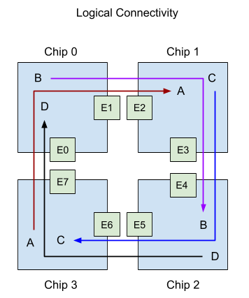

We choose to first route each path end-to-end before routing the next path, to trivially avoid all deadlock scenarios. This static routing approach exposes a routing optimization problem that can impact performance. This optimization work should be taken into account when considering this approach. Continuing from the example above, two schedules are shown, with the corresponding per ERISC command schedule shown. As can be seen, changing the traversal order of routes can greatly improve performance outcomes -half the number of timesteps in this case. 

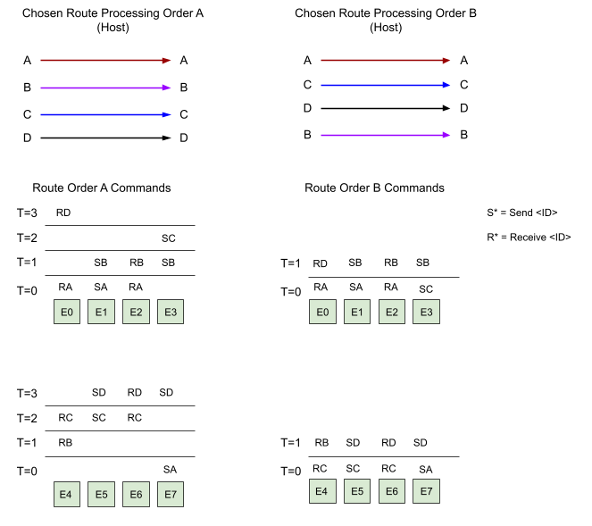

These are two high level examples of how static routing may be performed. More options may exist. At present, TTNN CCL ops are implemented with the more restrictive static routing where the op implementation and static route are tightly coupled. The goal is to alleviate this design pattern in future versions of the CCL software stack.

#### Dynamic Routing

Dynamic routing simplifies the multi-chip programming processing while also potentially enhancing the overall capabilities made available to the end developer. Similar to static routing, this option presents a spectrum of a solution space with various tradeoffs. The design space is more complex than static routing  and is worthy of a separate design discussion and document altogether and so further discussion is omitted from this document.

Design work on a multichip fabric that supports dynamic routing is underway, but is not mature enough to describe in detail here.

# Writing Ethernet Kernels {#writing-ethernet-kernels}

Previous sections have outlined the fundamentals that are needed in order to design multi-chip workloads, including differences in the programming model relative to single chip programming. However, the mechanics for implementing those multichip workloads are still required. This section outlines the key primitives and APIs that are used in building multi-chip applications, from a kernel writing perspective. This section does not discuss the mechanics for calling multiple multichip ops/workloads sequentially, back to back.

## Acquiring Ethernet Cores

When writing ERISC kernels, Ethernet cores must be targeted by the `CreateKernel` call. These Ethernet cores are distinct from the worker Tensix cores and have a separate logical mapping. Additionally, unlike worker Tensix cores, which have a consistent grid and logical mapping and are typically used in the same way from chip-to-chip (for a given op), the same Ethernet cores are not used from chip-to-chip when implementing a multi-chip workload.

When specifying Ethernet cores logically, the logical coordinate is of the form CoreCoord(0, channel_id), where channel_id is the index into the `eth` list in the (Wormhole) architecture file:


```   
eth:  
[ 9-0, 1-0, 8-0, 2-0, 7-0, 3-0, 6-0, 4-0,  
  9-6, 1-6, 8-6, 2-6, 7-6, 3-6, 6-6, 4-6]
```
From [wormhole_b0_80_arch.yaml](https://github.com/tenstorrent/tt-metal/blob/97b21652e1a00579882427a21e95db318bc0c079/tt_metal/soc_descriptors/wormhole_b0_80_arch.yaml)

For example, a logical Ethernet coordinate value of {0,2} would map to the third entry, which has the value “8-0” (x = 8, y = 0).

While the logical-to-routing mapping is consistent, the chosen cores will differ from chip to chip, depending on the specific connectivity of the cluster. In other words, if a user wishes to move data between two chips, the Ethernet cores that can be used to perform that data movement are entirely dependent on which cores form the Ethernet link.

To aid the user in identifying Ethernet core and link connectivity, an API is made available. In this host code snippet below, we acquire the active Ethernet cores on a chip and the associated Ethernet core(s) on the other end of the Ethernet link. In this case, an active Ethernet core is one that is connected to another core over Ethernet.  
   
[`Device::get_active_ethernet_cores`](https://github.com/tenstorrent/tt-metal/blob/b60149a4725c848aded5983b93e9b2459f5dad94/tt_metal/impl/device/device.hpp#L114) returns the active Ethernet cores on a device. The boolean argument specifies if the user wishes to omit Ethernet cores which are already reserved for the fast dispatch datapath. For user kernels, this argument will be true.

[`Device::get_connected_ethernet_core`](https://github.com/tenstorrent/tt-metal/blob/8b3ad7d17f76e611a77661dbc44fb30b1213a44d/tt_metal/impl/device/device.hpp#L132) returns the associated remote chip and remote core for the queried device and local Ethernet core. This allows the user to identify the Ethernet cores on each end of the link.

The following example shows how a user can identify an Ethernet core pair between their chosen local device and the device with chip ID = 1.

```  
// Acquire your device  
Device *local_device = …;

// Get a list of all active ethernet cores on this device  
// An active ethernet core is one with a connected and active link  
// We specify the true argument to only get ethernet cores (and links) that are   
// usable by user kernels; ignoring those cores which are used for the fast   
// dispatch tunneler  
std::vector<CoreCoord> logical_eth_core_coords =   
    local_device->get_active_ethernet_cores(true);

// At this point, we have the list of cores and these ethernet cores can, in  
// aggregate, connect to multiple other devices. We can filter for a connection   
// to a specific device, if desired. In this example, we arbitrarily decide we   
// want a link connected to device 1 from local device  
chip_id_t target_remote_device_id = 1;

// Find an ethernet core on the desired target device that connects to our local chip  
auto match_iter = std::find_first_if(  
    logical_eth_core_coords.begin(),  
    logical_eth_core_coords.end(),  
    [device, target_remote_device_id] (CoreCoord const& loc) {  
      auto const& [remote_device_id, receiver_core] =   
            device->get_connected_ethernet_core(loc);  
        return target_remote_device == remote_device_id;  
    });  
TT_ASSERT(*match_iter != logical_eth_core_coords.end());

auto sender_core = *match_iter;

// Grab the chip and core information for the receiver side on chip 1 that is   
// connected to sender_core  
auto [remote_device_id, receiver_core] =   
    local_device->get_connected_ethernet_core(*match_iter);  
```

## Creating a Kernel

Creating ERISC core kernels is the same process as creating kernels on Tensix cores, with the key difference being the kernel type that is specified. For ERISC kernels, specify the `EthernetConfig` kernel config.

```  
auto eth_sender_kernel = tt_metal::CreateKernel(  
    program,  
    "path_to_ethernet_kernel",  
    sender_core,  
    tt_metal::EthernetConfig{  
        .noc = noc_id,   
        .compile_args = eth_sender_ct_args});

```

## Ethernet Kernel Setup (Device Side)

Because individual chips may advance through their program schedule at different rates, it is possible, and likely, for them to be started at different times. This means when an ERISC kernel is started on a chip, the corresponding ERISC kernel connected to the other end of the link on the neighbor chip, is not started yet.

For this reason, it is important for the ERISC to establish a handshake with the other end of the link before sending any payloads to the L1 of the other ERISC, to avoid possible corruption of an in-progress kernel on the other end of the link;.

The following snippet is an example implementation of a simple handshaking scheme which can be run at the start of each ERISC kernel invocation. If this code sample is used, the kernel should make sure to only use addresses greater than [`eth_l1_mem::address_map::ERISC_L1_UNRESERVED_BASE`](https://github.com/tenstorrent/tt-metal/blob/97b21652e1a00579882427a21e95db318bc0c079/tt_metal/hw/inc/wormhole/eth_l1_address_map.h#L72)` + 16` for the kernel scratch space.

The 16B payload to/from `handshake_scratch_address` is a dummy payload that is sent to an address that is safe to clobber with the handshake payload.  
   
```  
// Pick an arbitrary address to send the payload for eth_send_bytes to use  
// ERISC_L1_UNRESERVED_BASE is the base address of the kernel usable memory address   
// range  
uint32_t handshake_scratch_address =   
    eth_l1_mem::address_map::ERISC_L1_UNRESERVED_BASE;

if (is_master_in_handshake) {  
    eth_send_bytes(handshake_scratch_address, handshake_scratch_address, 16);  
    eth_wait_for_receiver_done();  
} else {  
    eth_wait_for_bytes(16);  
    eth_receiver_channel_done(0);  
}  
```  
*[Recommendation]*: Use the [`erisc_info`](https://github.com/tenstorrent/tt-metal/blob/97b21652e1a00579882427a21e95db318bc0c079/tt_metal/hw/inc/ethernet/tunneling.h#L33) channel 0 for initial handshaking only to bootstrap your main flow-controlled algorithm. 

## Ethernet Kernel Teardown

In this example, the ERISC kernel is using the built in `ERISC_info->channels` for flow control over the ethernet link. For a number of these channels, the ERISC kernel is acting as a sender. This code excerpt is intended to be run at the end of the kernel.  
```  
for (std::size_t i = sender_channels_start;   
     i < sender_channels_start + num_sender_channels;   
     i++  
) {  
    while(not eth_is_receiver_channel_done(i)) {  
        // For better performance, don’t call this every iteration. Instead,   
        // consider calling after after a large number of idle loop iterations   
        // are completed, due to large performance overhead of the run_routing()   
        // routine  
        run_routing();  
    }  
}  
```

Without this wait for credits to arrive back at sender, it is possible for a channel done update from the other link to corrupt a future op running on the sender ERISC core, as mentioned in the “Asynchronous Program Completion Problem” section. 

# Example Multi-Chip Program Implementation Walkthrough {#example-multi-chip-program-implementation-walkthrough}

With the information presented in earlier sections, it is possible to write end-to-end multi-chip workloads/programs. This section walks through the implementation of a simple end-to-end microbenchmark including host and device code snippets.

## Example Program Description

The example workload that will be described in this section is adapted and simplified from a ring cluster round-trip ping time measurement microbenchmark. The setup of this workload is that it is run on a multichip system and forms a ring route, going through the specified number of devices. It sends a packet, of specifiable size, around the ring, and measures the time taken for the packet to arrive back to the first send. The workload designates a specific chip and core as a master core to initiate the roundtrip pings.

Depending on the specific Ethernet channels that are used to connect any given pair of chips, the routes within each chip NoC may vary. This sample code does not take this variation into account or try to avoid it. The diagram below shows an example of how the connectivity may look for a 4 chip ring. The provided connections have been arbitrarily chosen for the example and may not represent real connectivity in any actual deployment; they are for demonstration purposes.

During execution, the “Master Receiver” core on chip 0 will send a packet over the NOC to the “Sender” core on chip 0. The chip 0 sender will send over Ethernet to the “Receiver” core on Chip 1. This sequence repeats until we get back to the “Master Receiver” core: {chip 1 “Receiver”, chip 1 NoC, chip 1 “Sender”, chip 2 “Receiver”, chip 2 NoC, chip 2 “Sender”, chip 3 “Receiver”, chip 3 NoC, chip 3 “Sender”, chip 0 “Master Receiver” (start)}.

Note: since this is a microbenchmark meant to measure roundtrip ping latency, it sends a first, unmeasured roundtrip to flush the data path. This is necessary to avoid unintentionally measuring the skew in compile and launch time of the programs across chips.

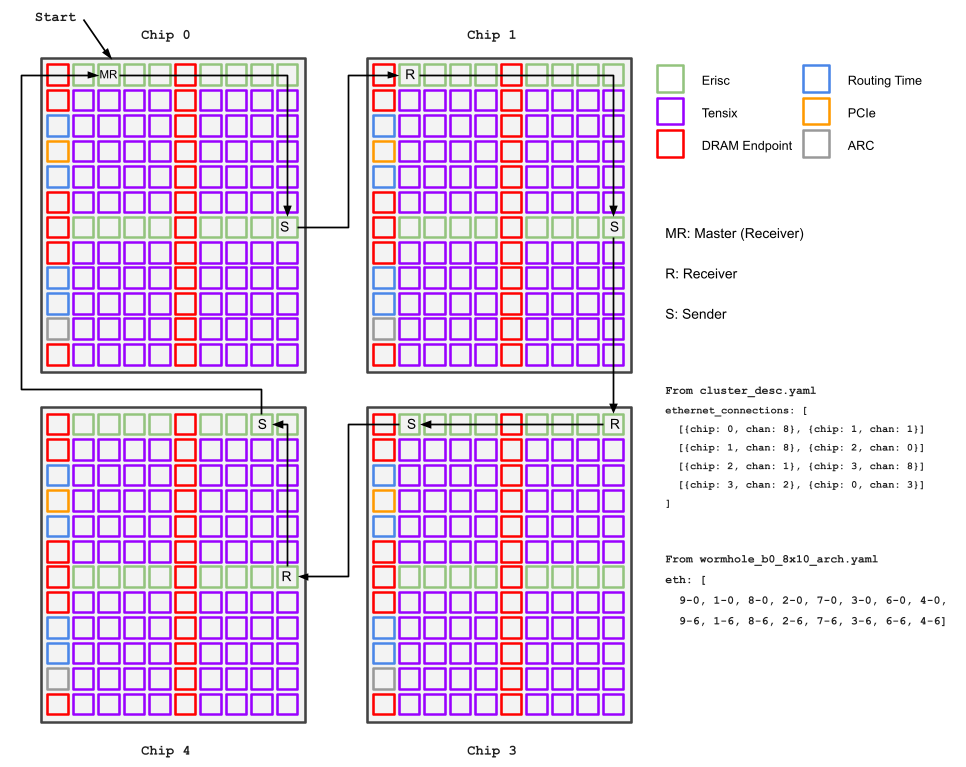

## Workload Component Overview

To implement this workload, three device components to execute and a host program to set up and launch the workload are designed and implemented.

### Device Components Overview

To implement this workload, 3 device kernels are implemented:

* “Receiver” kernel: is responsible for accepting the packet from Ethernet and forwarding it to the “Sender” core on the same chip  
  * The “Master Receiver” kernel will first send the packet to the sender kernel prior to waiting for the payload from Ethernet  
    * Additionally, it will open a timer before sending the packet and will close it when it receives the packet back from the Ethernet link  
* “Sender” kernel: is responsible for receiving a packet from the “Receiver” core over NoC and forwarding it over the ethernet link to the “Receiver” core on the other end.  
* Worker setup kernel: This kernel facilitates the initialization of each of the “Receiver” and “Sender” kernels, primarily to deal with semaphore initialization.  
  * This kernel is not required if ERISC kernel semaphores are created with CreateSemaphore

### Host Program Overview

A host program is written to set up one Program per chip, identify Ethernet cores that connect to each other and form a ring, and then dispatch kernels.

## Device Kernels

The implementation of each device kernel is described in further detail in this section.

### Receiver Kernel

Intialization: initialize local data-structures and wait for go signal from setup kernel  
```  
// This address resides in the eth_channel_sync data-structure for the Ethernet   
// channel  
*(volatile uint32_t*)channels_sem_addr = 0;

// This can be deleted when CreateSemaphore is used on the ERisc kernel  
// Tell the initialization helper worker we are ready to send/receive messages  
// with the sender on the local chip  
uint64_t init_handshake_noc_addr =   
    get_noc_addr(init_handshake_noc_x, init_handshake_noc_y, init_handshake_addr);  
noc_semaphore_inc(init_handshake_noc_addr, 1);

eth_noc_semaphore_wait(start_semaphore, 1);  
```

Handshake with sender over Ethernet link: make sure it’s safe to send/receive over the link.  
```  
 eth_setup_handshake(handshake_addr, false);  
```  
Refer to section “Ethernet Kernel Setup (Device Side)” for a sample eth handshake implementation

Send the pings in a loop. The first one isn’t measured because other chips might not be programmed or initialized yet.  
```  
// Clear the ring  
roundtrip_ping<false>(  
    channels_addrs,   
    channels_sem_addrs,   
    max_concurrent_samples,   
    16, // No need to send anything larger than a single flit  
    eth_noc_x,   
    eth_noc_y,   
    eth_channel_sync_ack_addr,   
    is_ring_start);

for (uint32_t i = 0; i < num_samples; i++) {  
    roundtrip_ping<true>(channels_addrs,   
        channels_sem_addrs,   
        max_concurrent_samples,   
        transfer_size,   
        eth_noc_x, // sender eth noc x  
        eth_noc_y, // sender eth noc y  
        eth_channel_sync_ack_addr,   
        is_ring_start);  
}  
```  
`is_ring_start` is used to indicate if the kernel is the “Master Receiver”.

#### Master Receiver roundtrip_ping Implementation 

The “Master Receiver” roundtrip_ping starts with injecting a packet into the ring to the downstream “Sender” kernel on the local chip:  
```  
uint32_t sender_sem = channels_sem_addrs[i];  
uint32_t buffer_addr = channels_addrs[i];  
uint64_t send_buffer_noc_addr = get_noc_addr(eth_noc_x, eth_noc_y, buffer_addr);  
uint64_t send_sem_noc_addr = get_noc_addr(eth_noc_x, eth_noc_y, sender_sem);

noc_async_write(buffer_addr, send_buffer_noc_addr, page_size);  
noc_semaphore_inc(send_sem_noc_addr, 1);

// Technically, given how the current workload works, this write barrier is not  
// required because the write is guaranteed to be completed by the time we receive  
// the payload from Ethernet  
eth_noc_async_write_barrier();  
```

Next, the kernel waits for the payload from the producer “Sender” kernel, from over the Ethernet link. We explicitly avoid using the context switching eth_dataflow_api call because this is a microbenchmark and we want minimal overhead. In real-world workloads, we must ensure there is an escape path to eventually reach the Erisc context switch in case links need to be retrained. If this loop is in production, it is recommended to modify it to have an idle count that occasionally context switches after many loop iterations. This recommendation is in place until updated APIs are made available to directly query Ethernet link health with only a few register read operations.  
```  
while(!eth_bytes_are_available_on_channel(i)) {  
    asm volatile ("");  
}  
```

#### Receiver roundtrip_ping Implementation

This code sequence is for the non-master receiver kernel, but has overlap with the “Master Receiver” roundtrip_ping implementation. Similar to the “Master Receiver” Ethernet packet wait code block, we use a non-context switching loop. 

First wait for the packet to arrive over Ethernet. 
```  
while(!eth_bytes_are_available_on_channel(i)) {  
    asm volatile ("");  
}  
```  
Next, send the “Sender” kernel on the local chip the payload that was just received. Also notify it of a payload available with a semaphore increment.  
```  
// Forward the payload to the sender on this chip  
uint64_t send_buffer_noc_addr = get_noc_addr(eth_noc_x, eth_noc_y, channel_buffer_addr);  
uint64_t send_sem_noc_addr = get_noc_addr(eth_noc_x, eth_noc_y, channel_sender_sem);  
noc_async_write(channel_buffer_addr, send_buffer_noc_addr, page_size);

// Signals to the downstream sender that the payload is available  
noc_semaphore_inc(send_sem_noc_addr, 1);  
```

Finally, we must complete the transaction with the upstream sender by acknowledging the payload and sending completion.   
```  
// We send an acknowledgement to the upstream sender, as soon as possible, so that the // ack isn’t delayed behind the write to the local sender kernel to complete  
eth_receiver_channel_ack(0, eth_channel_sync_ack_addr);  
eth_noc_async_write_barrier();

// Tell upstream sender that we’re done with the transaction from the receiver side. // Sender is free to send a new packet to this buffer   
eth_receiver_channel_done(0);  
```

### Sender Kernel

The sender kernel always accepts a packet from the “Receiver” kernel on the local chip and then forwards it over the Ethernet link to the downstream “Receiver” kernel, which is naturally on the next chip in the ring.

The startup code sequences mirror the startup sequences of the “Receiver” kernel and where they are the two are the same, the code samples are omitted.

The sender does not wait for a response signal from the set up worker because its first payload will act as that signal.

#### Sender Kernel ‘forward_ping’ Implementation

The core functionality of the forward_ping operation for the “Sender” kernel is specified below. This implementation is simplified to support only one transaction channel. 
``` 
// We use a non-context switching semaphore wait. To use the context switching   
// version, use the version of the function that is prefixed with `eth_`  
noc_semaphore_wait(sem_addr, 1);  
*channel_sem_addr = 0;

// The way this workload is setup, the buffer address is the same on the sender and   
// receiver side  
eth_send_bytes_over_channel(channels_addr, channels_addr, page_size, i);

// Non-blocking wait for completion signal from receiver  
while (!eth_is_receiver_channel_send_done(i)) {  
    asm volatile ("");  
}
```

## Host Program Implementation

Most of the host program code will be omitted because it is common and typical for metal program setup. The host code that is novel in this example is related to specifying chip order and choosing Ethernet channels for each chip to its forward/reverse neighbors.

### Identifying Correct Chip Order

First, depending on the ring size that is desired for the workload, a device ordering is specified. A T3000 system is assumed for this workload. This device ordering ensures that all the devices are adjacent in the ring, rather than being distributed in a non-ring topology.

```  
auto get_device_list = [](std::vector<Device*> const& all_devices, std::size_t n_hops) {  
  switch (n_hops) {  
    case 2:  
      return std::vector<Device*>{all_devices[0], all_devices[1]};

    case 4:  
      return std::vector<Device*>{  
        all_devices[0], all_devices[1], all_devices[2], all_devices[3]};

    case 8:  
      return std::vector<Device*>{  
        all_devices[0], all_devices[4], all_devices[5], all_devices[1],  
        all_devices[2], all_devices[6], all_devices[7], all_devices[3]};

    case 12: // Does an extra loop through the inner ring  
      return std::vector<Device*>{  
        all_devices[0], all_devices[4], all_devices[5], all_devices[1],   
        all_devices[2], all_devices[3], all_devices[0], all_devices[1],   
        all_devices[2], all_devices[6], all_devices[7], all_devices[3]};

    default:  
      TT_ASSERT("Unsupported hop_count");  
      return std::vector<Device*>{};  
  };  
};
```

### Identifying Ethernet Links

For every chip in the multichip ring, the specific Ethernet links between neighboring chips must be chosen. In other words, a route for the ring must be chosen. For each hop on the ring, Ethernet cores are chosen that connect to the same Ethernet links as the Ethernet cores on the neighbor hop chip. 

``` 
std::vector<hop_eth_sockets> build_eth_sockets_list(  
  std::vector<Device*> const& devices  
) {  
  std::vector<hop_eth_sockets> sockets;  
  std::unordered_map<uint64_t, std::size_t> n_edge_visits;  
  for (std::size_t i = 0; i < devices.size(); i++) {  
    Device *curr_device = devices.at(i);  
    Device *next_device = (i == devices.size() -1) ?   
      devices.at(0) :   
      devices.at(i + 1);  
      uint64_t edge = (static_cast<uint64_t>(curr_device->id()) << 32) |   
        static_cast<uint64_t>(next_device->id());  
      bool edge_needs_tunneling = !is_device_pcie_connected(curr_device->id()) ||   
        !is_device_pcie_connected(next_device->id());

      // Any revisit of this edge must use a different connection, so we set the  
      // target connection index to be the number of prior visits  
      std::size_t conn = n_edge_visits[edge];  
      std::size_t link = 0;  
      std::unordered_map<uint64_t, int> edge_link_idx;

      // Only consider Ethernet cores/links which are not already occupied  
      // for fast-dispatch, otherwise we’ll clobber that core and have  
      // undefined behaviour  
      auto const& active_eth_cores = curr_device->get_active_ethernet_cores(true);  
      auto eth_sender_core_iter = active_eth_cores.begin();  
      bool found = false;  
      for (;   
        !found && eth_sender_core_iter != active_eth_cores.end();  
        eth_sender_core_iter++) {

        auto [device_id, receiver_core] =   
          curr_device->get_connected_ethernet_core(*eth_sender_core_iter);  
        if (device_id == next_device->id()) {  
          uint64_t pair_edge = (static_cast<uint64_t>(curr_device->id()) << 32) |   
            static_cast<uint64_t>(device_id);  
           if (edge_link_idx[pair_edge] == conn) {  
             CoreCoord eth_sender_core = *eth_sender_core_iter;  
             CoreCoord eth_receiver_core = receiver_core;  
             chip_id_t receiver_device_id = device_id;  
             sockets.push_back({  
               receiver_device_id,  
               eth_receiver_core,curr_device->id(),  
               eth_sender_core  
             });  
             TT_ASSERT(receiver_device_id == next_device->id());  
             found = true;  
             break;  
           }  
         edge_link_idx[pair_edge]++;  
       }  
     }  
     TT_ASSERT(eth_sender_core_iter != active_eth_cores.end());  
     TT_ASSERT(found);

     // Increment the number of visits to this edge in case we need to loop back   
     // around through the cluster for a ring which is larger than the cluster.  
     // In those cases, we need to make sure to use different Ethernet links  
     // each time.  
     n_edge_visits[edge] += 1;  
   }

   return sockets;  
}
```

### Main kernel setup

The kernel setup is done with the data structures that are initialized in the prior two steps. The routine iterates through each hop in the ring, and instantiates the “Receiver”, “Sender”, and helper worker kernels for each one. In this particular test, we may hop over a given chip more than once, so we keep track of which program maps to which device in the event that we need to add more kernels -for a future hop -to that chip’s program.

```
void build_and_run_roundtrip_latency_test(  
   std::vector<Device*> devices,  
   std::vector<hop_eth_sockets> hop_eth_sockets,  
   std::size_t num_samples,  
   std::size_t sample_page_size,  
   std::size_t max_concurrent_samples,  
   std::size_t n_hops,

   std::vector<Program> &programs,  
   std::vector<KernelHandle> &receiver_kernel_ids,  
   std::vector<KernelHandle> &sender_kernel_ids  
) {  
   // Need to create one program per chip because a Program is a single chip construct  
   programs.reserve(n_hops);  
   receiver_kernel_ids.reserve(n_hops);  
   sender_kernel_ids.reserve(n_hops);

   // In case we want a 12-hop ring, we maps from device to program incase two  
   // different hops land on the same device (though use different sockets.  
   std::unordered_map<Device*,Program*> device_program_map;  
   for (std::size_t i = 0; i < n_hops; i++) {  
       if (device_program_map.find(devices.at(i)) == device_program_map.end()) {  
           programs.emplace_back();  
           device_program_map[devices.at(i)] = &programs.back();  
       }  
   }

   std::unordered_map<Device*, uint32_t> device_visits;

   // Step through the sender/receiver cores/channels for each hop, that were  
   // assembled prior to calling this function, and instantiate the appropriate  
   // receiver and sender kernels on their respective cores  
   for (std::size_t i = 0; i < n_hops; i++) {  
       auto previous_hop = i == 0 ? n_hops -1 : i -1;  
       Device *device = devices.at(i);  
       auto &program = *device_program_map.at(device);  
       auto const& eth_sender_core = hop_eth_sockets.at(i).sender_core;  
       auto const& eth_receiver_core = hop_eth_sockets.at(previous_hop).receiver_core;

       // Setup the kernels on each chip  
       // ...
```

# CCL Higher Level Building Blocks {#ccl-higher-level-building-blocks}

Although a reader should be able to write custom multichip workloads from start to finish with the information presented so far, there are common patterns which benefit from being componentized for reused and focused optimization that can benefit all users of those components.

For this reason, the CCL provides pre-written components that were built to account for the design complexities mentioned earlier in the document. It is *recommended* to use these components as building blocks for higher level operations/end-to-end workloads, including CCL ops such as all-gather. The user is not *required* to use any of these components, but is *strongly* encouraged to use them to streamline implementation work, avoid certain classes of bugs (as mentioned in the “Operating Environment” section), and automatically absorb any performance optimizations that are implemented over time. 

Some examples of commonized components include:

* ERISC Data Mover (EDM): a multi-channel, bidirectional data mover engine that runs on Ethernet core pairs, over Ethernet links  
* Worker kernel utilities that assist in packetizing and depacketizing workload data  
* Host-side data-structures to describe concepts such as cluster topology  
* Host-side builder components that simplify argument passing and kernel instantiation

# ERISC Data Mover (EDM) Engine {#erisc-data-mover-(edm)-engine}

The ERISC Data Mover is a reusable data movement component that’s used to send data over ethernet links. It is designed to provide ethernet link utilization while also handling the additional design concerns raised by implementing multichip collective operations. The EDM supports multi-channel, bidirectional data transfers. It exposes a communication protocol with workers to signal data and buffer availability. The EDM was implemented as a common and reusable software component that runs on ERISC cores. Optimizations and functional improvements can carry over all CCL ops this way.

Based on bandwidth microbenchmark results, to achieve good utilization of the ethernet link, we desire two things:

1) we must prefer to send larger packets over smaller packets, and preferably packets of size 16K  
2) we prefer to instantiate multiple channels for a given EDM

For these reasons, the EDM is typically instantiated with multiple channels. Workers feed data into EDM channels in packetized form. Typically pages are only a single tile which is typically 2K or less in size, so workers must assemble multiple pages before issuing send commands to achieve higher utilization. As seen from the bandwidth microbenchmark where we allow a large number of channels for a given packet size, a packet size range of 4KB to 16KB is desired for optimal performance. Any less will lead to inadequate link utilization.

## EDM Communication Interface

The EDM provides an interface for the reader and sender side. Fundamentally, the EDM interfaces have 2 main parts: the termination sequence, and the data movement flow control signaling. The EDM manages state for every channel independently. The EDM instantiates channels in either sender or receiver mode where a sender channel is one which sends data over Ethernet to a receiver channel and a receiver channel receives data from over Ethernet.

### Initialization and Source -Destination Readiness Signaling

Because programs are dispatched to different chips independently, and without any explicit synchronization across the chips, then it is the responsibility of the EDM to ensure both sides of the ethernet link are ready to participate in the operation. For this reason, the EDM will always perform a handshake with the connected e-risc before proceeding with main op execution. 

The handshake is performed by first designating an ERISC as the sender or receiver in the handshake. This is done currently with an arbitrary rule where the sender will be the one with sender ethernet channels. In the event that both ERISC cores of the EDM have a sender side, the side with the lowest sender channel ID will be designated as the sender for the purpose of the handshake.

After a sender is designated, the handshake begins. To complete the handshake, the sender sends a dummy packet to a designated 16B handshake address. The receiver waits for this packet and then sends an acknowledgement and proceeds. After the sender side receives the acknowledgment, it also proceeds with execution.


Because the handshake address and the transaction state structures (namely ERISC_info->channels of type eth_channel_sync_t) are persistent, there is no concern of data clobbering with a previous invocation of the EDM. If the previous invocation was still expecting some sort of ethernet payload, then that would be a bug with how the EDM was invoked (one end was told to send/receive more messages than the other).

### Termination Mode

The EDM currently supports 2 termination modes, which are specified as a compile time argument. The termination mode dictates what the termination condition is for the EDM as well as where to obtain the inputs to determine if the termination condition is met. The chosen termination mode is currently shared across all channels, though could be modified to be per channel.  
 

* Fixed message count: `ccl::EriscDataMoverTerminationMode::MESSAGE_COUNT_REACHED`  
  * EDM is programmed to forward or receive a fixed number of messages for a given channel, after which, the channel terminates  
* Worker driven termination signal: `ccl::EriscDataMoverTerminationMode::WORKER_INITIATED`  
  * In this mode, the EDM channel runs indefinitely until it receives a worker termination signal on the sender and receiver side from the connected workers  
  * At present, this mode requires the sender worker to signal the terminate signal when it is setting the go signal for the final message

Currently, CCL ops use a mix of the fixed message count termination mode and the signal termination mode, depending on the operation. *[future work]* All-gather should be moved to signal termination mode to eliminate code from the host side that would otherwise be needed to compute exact message counts.

### Worker -Sender Side EDM Interface (Per Channel)

The interface described in this section is between an EDM sender channel and the worker that writes to it. Signaling between the ERISC and the worker is accomplished through a pair of semaphores, one on each core. One buffer is allocated on the EDM sender channel and the address is shared with the sender worker core.

The semaphore on the worker core is incremented by the ERISC and is used to notify the worker that the worker can write into the buffer of the sender channel on the ERISC.

The semaphore on the EDM sender channel is incremented by the worker and is used to signal from the worker to the EDM sender channel that a *new* payload is written into the channel buffer and is ready to send. 

Sender Worker Fields:  
*Sender_local_semaphore*:

* Usage (from EDM): EDM notifies this address on worker when the EDM channel buffer is available for writing into  
* Usage (from Worker): Read for non-zero to indicate that the destination buffer can be written into. Worker clears before notifying EDM of payload available.  
* *Initialization (host)*: create with CreateSemaphore (initialized to 0), and give address to EDM kernel for associated channel

EDM Channel Fields:  
*edm_channel_semaphore*:

* Usage (from EDM): EDM watches this address to see when a payload is available for sending on the channel.  
* Usage (from Worker): Worker increments the value at this location in ERISC L1 to tell the EDM channel a new valid payload is available. In practice, it’s typically safe to send a semaphore_inc immediately following the noc_async_write to the buffer given that by default, both of those commands will use the default unicast VC and therefore the semaphore_inc will always land after the payload write is complete.  
* *Initialization (device)*: before notifying the worker of buffer availability at startup, EDM must first clear this semaphore to 0 to avoid a race.

*edm_channel_buffer*:

* The location in ERISC L1 where the sender will write payload contents into

#### Sequence Per Channel

This subsection outlines, step by step, how the sequence between the sender worker and EDM sender channel progresses. 

The below snippet shows a simple sequence to implement the transaction sequence from sender worker to EDM sender channel. This snippet could be wrapped in one (or more loops), if the op requires multiple packets to be sent.

``` // sender worker snippet  
// wait for EDM to signal to sender worker that a buffer can be written to  
noc_semaphore_wait(receiver_local_semaphore_address, 1);

// Reset the semaphore before advancing through the read/ack sequence to avoid races  
noc_semaphore_set(receiver_local_semaphore_address, 0);

noc_async_write(sender_source_l1_address, edm_buffer_address, payload_size_bytes);  
// By default, the noc_semaphore_inc will use the same virtual channel and will not  
// race ahead of the write, so we queue it up immediately after  
noc_semaphore_inc(edm_buffer_semaphore_address, 1);  
```

Visually, this sequence appears as follows:

* EDM channel notifies sender worker of buffer available through EDM -> sender semaphore increment. EDM must clear local semaphore before notifying sender to avoid race.

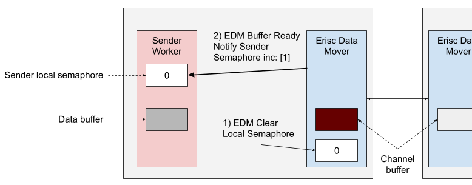

* Worker fills EDM channel buffer

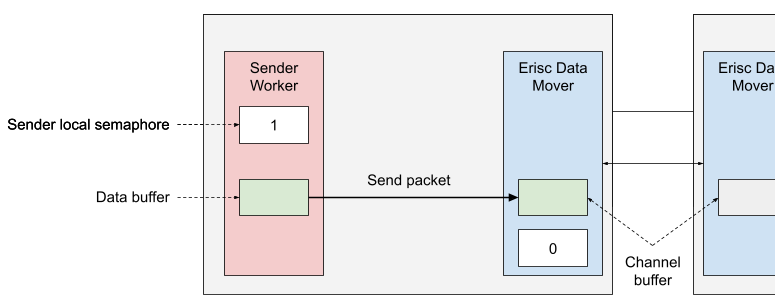

* Worker notifies EDM channel of payload complete through sender -> EDM semaphore. Worker must make sure to clear local semaphore before notifying EDM to avoid race

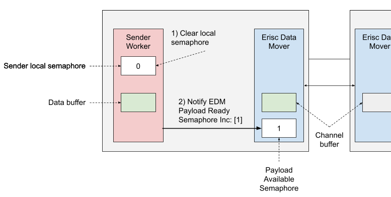

* Goto first step


### Receiver Side EDM -Worker Interface (Per Channel)

The interface between the EDM receiver channel and the receiver worker is very similar and has the same base components: two signaling semaphores and a channel buffer. The key difference in operation is that presently, the data is pulled from the EDM receiver by the worker, instead of pushed to the worker by the EDM. The semaphores are used by the ERISC and the worker to signal payload available and payload read completion, respectively. The buffer address on the EDM receiver channel is shared with the receiver worker. In the future, a push mode will be added to the EDM receiver channel to improve latency.

ReceiverWorker Fields:  
*receiver_local_semaphore*:

* Usage (from EDM): EDM notifies this address on worker when the EDM channel buffer is available for reading from  
* Usage (from Worker): Read for non-zero to indicate that the source buffer can be read from. The worker must clear this value locally before notifying EDM of payload read completion.  
* *Initialization (host)*: create with CreateSemaphore (initialized to 0), and give address to EDM kernel for associated channel

EDM Channel Fields:  
*edm_channel_semaphore*:

* Usage (from EDM): EDM watches this address to see when a payload read from this channel has been completed by the workers  
* Usage (from Worker): Worker increments the value at this location in ERISC L1 to tell the EDM channel that it is done reading the contents of the channel buffer and that they can safely be discarded/overwritten (i.e. by the upstream sender channel).  
* *Initialization (device)*: before handshaking with EDM on the other end of the ethernet link, this value must be cleared to 0.

*edm_channel_buffer*:

* The location in ERISC L1 where the reader will read the buffer from. Additionally, this is the same address that the sender side will send to -although this is internal the EDM and is not exposed externally.

#### Sequence Per Channel

This subsection outlines, step by step, how the sequence between the EDM receiver channel and receiver worker progresses. 

``` // receiver worker snippet  
// wait for EDM to signal to worker that a packet is available  
noc_semaphore_wait(receiver_local_semaphore_address, 1);

// Reset the semaphore before advancing through the read/ack sequence to avoid races  
noc_semaphore_set(receiver_local_semaphore_address, 0);

noc_async_read(edm_buffer_address, receiver_local_l1_address, payload_size_bytes);  
// Typically needed but optional depending on use case  
noc_async_read_barrier();

// Notify the EDM that receiver has read the payload and the EDM buffer can   
// be overwritten with new data  
noc_semaphore_inc(edm_buffer_semaphore_address, 1);  
```

Visually, this sequence appears as follows:

* EDM channel waits for message from sender   
  * notifies receiver worker of payload available through EDM -> receiver semaphore increment  
  * EDM must clear its local semaphore before incrementing the worker semaphore to avoid a race

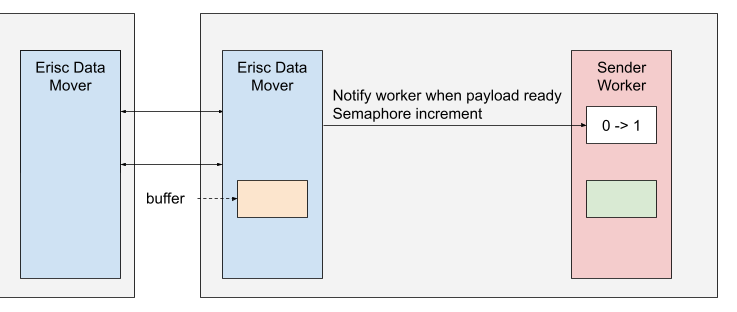

* Worker reads EDM channel buffer

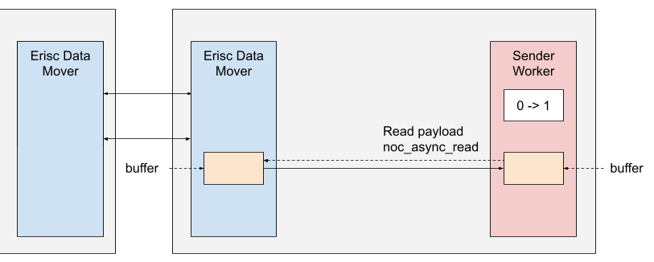

* The worker notifies EDM channel of read complete through receiver -> EDM semaphore.   
  * The worker must clear local semaphore before sending semaphore update to EDM, otherwise there is a race condition.

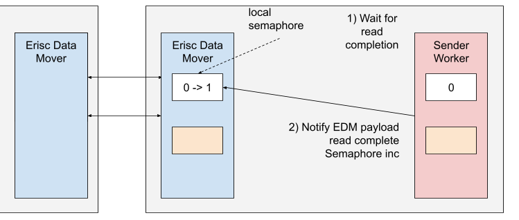

* Goto first step

….

## Topology Support

The EDM is not constrained to any specific multichip topology, given that it is a generic multi-channel data mover over Ethernet and that external (e.g. worker) cores are still needed to implement the “application” logic. However, certain topologies are more easily supported than others, and the current form of the EDM and its capabilities has been informed by that. 

Our experience as a team at Tenstorrent, so far, has shown that multichip data-movement patterns are typically regular and easily mapped to static routing schedules. *Arbitrarily* complex and *asymmetric*  any-to-any data movement patterns have not yet needed support and have not been a focus of CCL work to date. However, architectures such as mixture-of-experts with large tensors benefit from data mover components that support more dynamic and non-regular, and definitely non-predictable, data movement patterns, with good performance.

For these reasons, the EDM has so far been used to support ring and linear topologies and unicast point-to-point routes. Future work is to provide a more robust infrastructure that can handle more complex data movement patterns.

Line and ring topologies map well onto static routing and static channel allocation strategies because of their predictable data movement. Additionally, line and ring topologies only ever require direct communication between neighbor chips and never multi-hop transfers. This means there is no explicit routing required to support these use cases. For this reason, an optimized data movement component that only does point to point data movement is sufficient. No complex routing or multi-hop support is required.

Additionally, with these ring and line algorithms where all transfers are only to immediate neighbor chips, it is always sufficient to perform a single handshake between the ERISC cores on either end of the link of the directly connected chips to ensure end-to-end synchronization with respect to source and destination readiness. 

## EDM Performance

Plot TODO but measured upwards of 20 GB/s link util

# Host CCL Op Builder Components {#host-ccl-op-builder-components}

Some host components have been written to simplify instantiation and connectivity of CCL device components (such as EDM) to workers.

A summarized list of CCL builder components includes the:

* EDM Builder  
* Tensor Slicer (Scheduler)  
* Topology Config

## ERISC Data Mover (EDM) Builder

The EDM simplifies the host code side setup of EDM in a larger op/workload. Its responsibilities are primarily to:

* Simplify kernel argument setup between worker and EDM kernels  
* Hide EDM argument setup to make EDM feature addition more easily backward compatible  
  * As long as EDM builder is used, new compile time and runtime arguments can easily be added under the abstraction without the worker kernel or op host code explicitly being required to be aware  
* Manage buffering and memory for the EDM

The EDM Builder is defined in [ccl_host_datastructures.hpp](https://github.com/tenstorrent/tt-metal/blob/dd1a3ee2fb5b4483d2513b2aa9389b2d876ae77a/tt_eager/tt_dnn/op_library/ccl/ccl_host_datastructures.hpp#L121).

The EDM builder provides easy to use methods to instantiate sender/receiver channels and pass the relevant interface information to the connected worker(s).

The general usage pattern is to, per program/chip, instantiate an EDM builder per link and then to use that to establish connections between workers and sender/receiver workers (depending on the direction of the connection).

### EDM Builder Example

Here we work through example usage of the EDM builder from the host set up code of an op.  
First we can create an EDM builder. Today, we must, ahead of time, decide on the number of channels. In the future. In the future, this will be dynamic based on the number of channel registrations. Additionally, we must specify the buffer sharing and termination modes, which are described earlier.

There is currently one usability improvement to the builder that is missing that will be resolved in the future which is that it is currently up to the user to identify the EDM channel buffer addresses ahead of time before instantiating the builder. This logic will be incorporated and hidden in the builder in the future, which will streamline its use and remove certain bug categories from appearing. The recommendation to avoid this issue is to use the [`ccl::create_erisc_datamover_builder`](https://github.com/tenstorrent/tt-metal/blob/8b3ad7d17f76e611a77661dbc44fb30b1213a44d/tt_eager/tt_dnn/op_library/ccl/ccl_common.cpp#L111) function which abstracts this concern away.

In the example, we are only instantiating a single channel that will be used by a single worker and forward a fixed number of messages before terminating. We use the `create_erisc_datamover_builder` function to streamline address generation.  
```  
Std::size_t num_edm_channels = 1;  
auto buffer_sharing_mode = ccl::EriscDataMoverBufferSharingMode::NOT_SHARED;  
auto edm_termination_mode = ccl::EriscDataMoverTerminationMode::MESSAGE_COUNT_REACHED;   
ccl::EriscDataMoverBuilder edm_builder = create_erisc_datamover_builder(  
    num_edm_channels,   
    op_config.get_page_size(),   
    buffer_sharing_mode,   
    edm_termination_mode);  
```

After this point, the EDM builder can be used to establish connections between workers and channels. These associations produce resolved buffer and semaphore addresses when kernel runtime arguments are specified.

We may wish to assign a worker to a sender channel of the builder. For this channel, the worker will *push* packets to the EDM channel. We create the association with the [`add_sender_channel`](https://github.com/tenstorrent/tt-metal/blob/d14f694198a1993ccac2d629225abd8ce92f56a8/tt_eager/tt_dnn/op_library/ccl/ccl_host_datastructures.hpp#L222) method.   
```  
ccl::EriscDatamoverBuilder::ChannelBufferInterface const& sender_channel_buffer_info =  
    edm_builder.add_sender_channel(  
        worker_sender_semaphore_address,  
        num_packets_to_send,  
        sender_worker_coords,  
        packet_size_bytes);  
```  
With the returned `ChannelBufferInterface`, we can generate arguments at a later point  
```  
// ... later in the host code, when setting arguments for the sender worker

tt_metal::SetRuntimeArgs(  
    program,  
    sender_worker_kernel_id,  
    sender_worker_core,  
    {  
        // ... non-EDM, worker specific args

        // This argument tells the sender worker where to write the payload  
        // in the EDM L1  
     sender_channel_buffer_info.eth_buffer_l1_address,

        // This argument tells the sender worker where to signal to the EDM  
        // that a new payload is available  
        sender_channel_buffer_info.eth_semaphore_l1_address,

        // ... possibly other non-EDM, worker specific args  
    });  
```  
Note that both sender and receiver channels can be added to an EDM builder.

After all channels have been registered with a given EDM, the EDM can be built with the ccl::generate_edm_kernel function. This function should only be called once per EDM per link per chip. Calling this function multiple times for a given Ethernet core is an error.  
```  
auto edm_sender_kernel =  
    ccl::generate_edm_kernel(  
        program,   
        device,   
        edm_builder,   
        eth_sender_core,   
        edm_noc_id);  
```  
Note that this call will only create the EDM for one side of the link, at the core location specified to the call. A corresponding EDM must also be built on the other end of the link, for the program associated with that remote chip.

Extending this example further, a simple ring could be formed by creating a second EDM builder to instantiate on an Ethernet core connected to a chip in the opposite direction along the ring. We can follow the same process above to associate this new EDM builder with the receiver worker but call [`add_receiver_channel`](https://github.com/tenstorrent/tt-metal/blob/d14f694198a1993ccac2d629225abd8ce92f56a8/tt_eager/tt_dnn/op_library/ccl/ccl_host_datastructures.hpp#L252) instead of `add_sender_channel`. 

## Tensor Slicer Scheduling

The tensor slicer (scheduler) is a recent addition to  CCL op building infrastructure. It is referred to as CclTensorSlicer in the code, but for disambiguation in this documentation between it and the device kernel tensor slicer also used by ops such as ReduceScatter, it will be referred to as the Tensor Slicer Scheduler.

This component is responsible for taking in a description of the workload and producing the tensor slice shapes that each worker will be assigned for the operation. Inputs include the number of workers, tensor shape, fracture dim, and cluster size while the output is just a tensor slice shape list.

Whatever slice shapes are chosen must be small enough to fit within the data-pipeline without causing backpressure on the op. For some ops this may not be a concern (e.g. with allgather implemented with separate reader and writer workers), but for others it is required (e.g. reduce_scatter).

## Topology Config

The topology config is a shared data structure which standardizes some topology information (such as if it is a ring or line) for ops to reuse.

# Calling Multichip Ops From Host (TTNN) {#calling-multichip-ops-from-host-(ttnn)}

In addition to the lower level APIs and programming model entry points described earlier in this doc, some software infrastructure exists at a higher level (TTNN) to facilitate writing multi-chip applications. The mesh tensor is one of the key components that simplifies multi-chip model implementation and CCL op calling. 

The mesh tensor wraps the smaller, partial tensors that form larger multichip tensor but exposes the collection as a single logical tensor. With this, higher level operations are enabled. For example, a mesh tensor sharded in 2 dimensions and also mapped to a 2D cluster mesh, can invoke higher level operations such as row/column all-gather/all-reduce. 

This way, lower level details like chip IDs and connectivity don’t need to be explicitly managed by the user. They can instead continue to describe their multi-chip workload at a higher level.

# CCL Ops

The CCL library provides a collection of pre-written multi-chip operations. The current list of supported ops is small and constrained to only a few configurations, which are shown further below. The intended minimal set of operations is larger and includes commonly used collective operations such as all-gather, reduce-scatter, all-reduce, reduce, gather, scatter, gather-scatter, send/receive.

This section of the documents walks through the high level implementation of two CCL ops: all-gather and reduce-scatter, which have different data movement patterns and behavior. The intent with these walkthroughs is to provide examples for a user to write their own CCL op from scratch as well as to equip the reader with the knowledge they might need to extend and optimize the existi ng implementations.

# Op List {#op-list}

The current CCL op status is as follows:

| Configuration/Layout | All Gather | Reduce Scatter | Send/Receive | All Reduce |
| :---- | :---- | :---- | :---- | :---- |
| Interleaved (Row Major) | Y | N | N | N |
| Interleaved (Tile) | Y | Y | N | N |
| Width Sharded (Tile) | Y | Y | N | N |
| Width Sharded (Row Major) | Y | N | N | N |
| Height Sharded (Tile) | Y | N | N | N |
| Height Sharded (Row Major) | N | N | N | N |
| Block Sharded (Tile) | Y | Y | N | N |
| Block Sharded (Row Major) | N | N | N | N |
| Bidirectional | Y | N | N | N |
|  |  |  |  |  |

A CCL typically provides implementations for standard collective operations. At present (July 2024), only a small subset of all standard CCL ops are implemented in the Tenstorrent CCL. More will be added in the future.

All-gather has support for line and ring topologies - and by extension, multiple concurrent lines/rings on a mesh to perform multiple row or column all-gathers on a mesh. Reduce scatter currently only supports ring topology, which again can be instantiated concurrently multiple times for a mesh if performing reduce-scatter along rows or columns.

# Measuring Op Performance {#measuring-op-performance}

When measuring the performance of CCL operations, there are several extra things to keep in mind that are not applicable to single chip operations.

Given that programs for different chips are not guaranteed to compile at the same time, then looking at a raw op performance report at face value can be misleading. For example, consider the following sample perf report for an 8 chip CCL operation running on a ring. Based on the `"DEVICE KERNEL DURATION [ns]"` numbers, the reader may be led to believe that this operation took ~5.2 billion cycles (5.2 seconds for WH @1GHz aiclk). 

This number is misleading because it includes compilation time of the CCL op programs on the other chips. What’s shown here is that the first chip’s program is compiled and then dispatched. The timer for this program opens but in the mean-time, the programs for chips one through seven are still being compiled. Chip 0 is unable to make progress -except for initialization -until its neighbors are compiled and started. This applies for all but the last chip. Only the last chip program is able to run without waiting for compilation to complete for other chips.

For this reason, if measuring CCL op performance the following it is recommended to use the measurements for the last chip in the sequence for the op

![][image7]

# (Ring/Line) All Gather {#(ring/line)-all-gather}

The all-gather operation is a standard all-to-all collective operation. This section describes the high level implementation of the all-gather operation for ring and line topologies, in the Tenstorrent CCL.


## Algorithm Description

All gather takes an input tensor per rank and performs a concatenation along a specified dimension and stores the result on all ranks, hence the “all” in “all-gather”. In the ring version of all-gather, for each time step except the first and last, the rank receives an input from a neighbor, concatenates it locally into the output tensor, then forwards it to the next neighbor. For the first timestep, the rank does not receive an input from a neighbor and for the last time step, it does not forward it further.

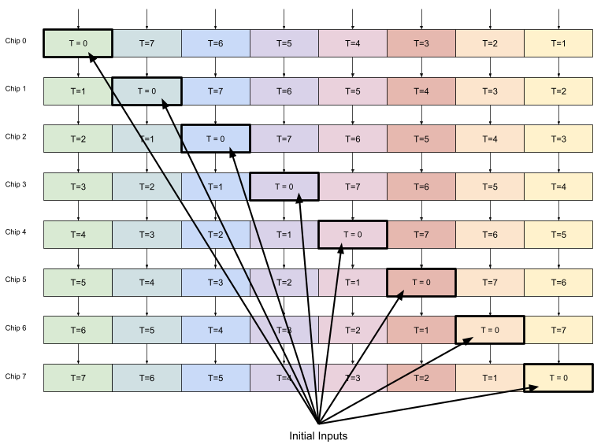

## Implementation

In a ring all-gather, the current implementation is as follows:

* Each logical worker unit is dispatched across two cores: one for receiving from EDM and one for forwarding to EDM.  
* The sender reads the input tensors and forwards to both to the output tensor and to the EDM  
* The receiver worker accepts payloads from EDM and fills the portion it is responsible for of t=1, then t=2, and so on.   
* For every chunk of data committed to the output tensor -typically EDM packet size worth of pages -the receiver worker increments a semaphore on the sender worker core  
* The sender reads from the output tensor and forwards the data any time it sees the local semaphore increment

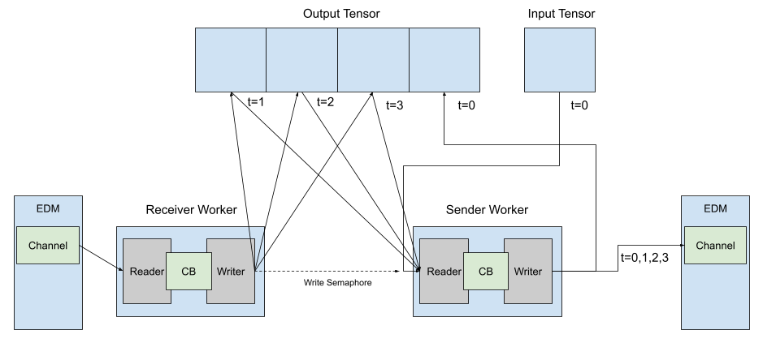

Single chip logical view of a single worker all-gather, instantiated on the third chip of a 4chip ring. In practice, multiple workers are typically instantiated and subdivide the input/output tensor into pieces

### Bidirectionality

The all-gather op supports bidirectionality to make use of the full Ethernet bandwidth in both directions over the link. The current approach for implementing bidirectionality is to logically split the input tensors into two pieces and to execute two all-gather operations in parallel. In practice, these are not two separate all-gather operations (programs) and the parallel all-gather operations are run in the same programs.

This bidirectional approach sends half of each tensor in opposite directions fully around the ring.

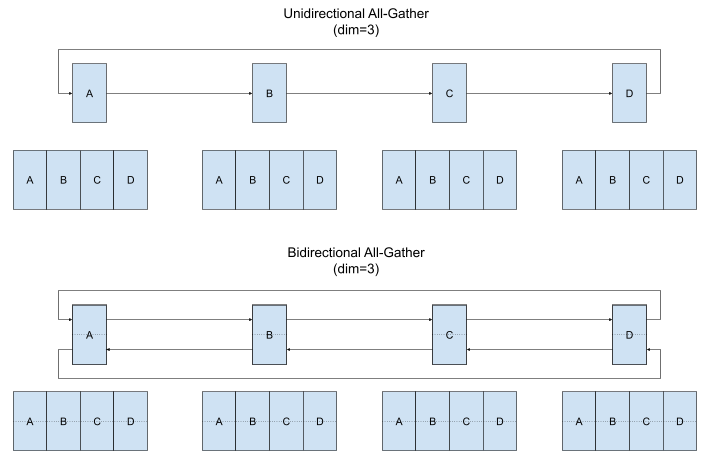

An alternative bidirectional approach is to send the full input tensor in each direction, but only halfway around the ring. This has the benefit of being simpler to fuse with operations like matrix multiplication. Additionally, this approach is also latency optimized for smaller tensors because the latency overhead of initiating and completing transfers is reduced because fewer hops are made.  Support for this alternative approach is in progress for better small all-gather performance and as a setup for fused all-gather-matmul fusion to overlap compute and data movement.


#### Line Topology

The line topology all-gather is inherently bidirectional in nature. This topology is implemented in the same way as the second bidirectional approach except that the number of hops in each direction is dictated by distance from the end of the line, rather than ring size divided by two. Additionally, the bandwidth utilization characteristics are different from a bidirectional ring that lead to worse performance overall. The effective peak Ethernet bandwidth achievable is half of the theoretical bidirectional peak because 

1) The tensors on the ends of the line can only be sent in one direction  
2) The transfers are not balanced left to right, with the exception of the middle tensors

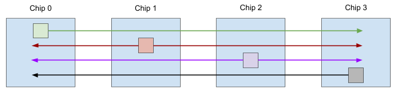

### Sharding Support/In Flight Resharding

All-gather implements a concatenation operation so when comparing input and output tensors that are sharded, the number of pages per shard/core changes, even if the shard-grid stays the same. This means that all-gather must implement in-flight resharding for functional correctness. The current all-gather op implements this with custom indexers which require many calculations on the host to set up the initial parameters for the indexers.

## Special Attributes

All-gather has a special attribute that it is a pure data movement operation with no intermediate outputs or math operations. For a functional implementation, no explicit synchronization is required between senders and receivers if the sender knows. However, for performance reasons, and because of current infrastructural limitations, the all-gather op is implemented in a way where each chip along the ring must explicitly send and receive the input for each hop. With a generic multichip fabric, an op like all-gather could be implemented exclusively on the sender side with multicast commands, after either handshaking with each destination or knowing the absolute buffer address for each destination.

## Usage

Invoking allgather is straightforward when a mesh tensor is available for the input. The all-gather op currently doesn’t support out of order tensors with respect to chip ordering in the line or ring. Any constructed mesh tensor must therefore also contain the ordered tensors as they would be mapped to the ring.

```  
result_mesh_tensor = ttnn.all_gather(input_mesh_tensor, dim)  
optional kw_args: 

* num_links  
* memory_config

```

ttl.tensor.line_allgather()

# (Ring) Reduce Scatter {#(ring)-reduce-scatter}

Reduce scatter takes an input tensor per chip, and fractures it into num_ranks pieces along the specified dimension. A reduction is then performed with the pairwise fractures across each chip. In the unidirectional ring version, this is done by first forwarding fracture (chip_id + 1) to the neighbor, and then iterating through the fractured chunks, each time reducing it with the input received from the previous neighbor and forwarding the partial result to the next rank. Finally, when the chip arrives at its chip_id fracture chunk, it performs the pairwise reduction but stores the result locally to the output tensor. The final output is distributed across ranks, hence the “scatter” of “reduce scatter”.

Below is a visual representation of the algorithm. Note that some of the steps of the reduce scatter have been excluded from the diagram to reduce visual noise. The timestep is annotated beside each displayed chip-to-chip transfer. Note that a bidirectional implementation is possible, though not implemented yet.

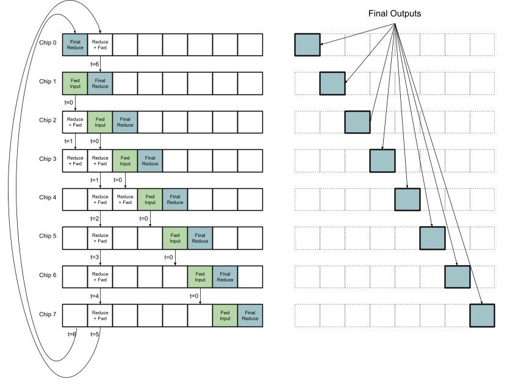

## Implementation

Reduce scatter is implemented with host and device components and primitives that are more inline with the intended design of CCL v1. In particular, the host code is simplified quite a bit with these. In no particular order, the following is a list of key and important host CCL components:

* ERISCDataMoverBuilder  
* TensorSlicer

Although logically, the input tensor is split by a factor of num_ranks along the specified dimension, in practice, the input tensor is often split by further factors to improve performance and to avoid issues such as deadlock. The algorithmic fracturing along dim from the reduce scattering operation itself must always be preserved. However, each fractured chunk can be further sliced; effectively breaking up the larger reduce scatter into multiple, smaller, and potentially concurrent, reduce scatter operations. All slice lines must be the same across all fractured chunks. 

Multiple factors may contribute to the final slice shape for a given reduce-scatter invocation, such as desired number of workers and internal data pipeline buffering capacity. Taking these factors into account, it is possible that a given worker is responsible for processing more than one slice, in which case it processes slices sequentially. 

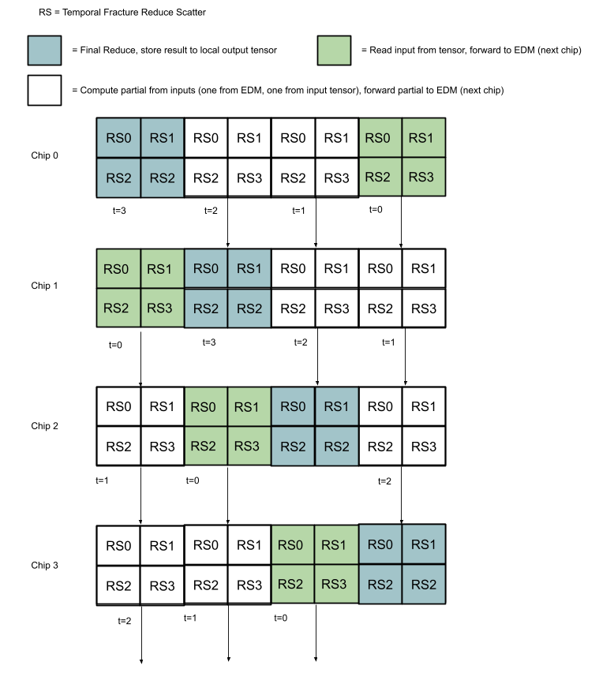

The tensor slicer must create slices that fit within the data pipeline without causing a deadlock. This is because there is no storage to park the full set of intermediate outputs between workers/ring stages. In general, we accomplish this by logically breaking up the reduce scatter operation into smaller reduce scatter operations where each smaller conceptual reduce scatter op doesn’t require buffering that exceeds the data pipeline buffering capacity. Although we are logically breaking up the reduce scatter into smaller independent reduce scatter operations, the operation is still executed with a single invocation.

With this implementation of reduce-scatter, the worker will see `ring_size` worth of a given tensor slice before it advances to the next logical output slice step in the tensor. The first chunks from the local tensor will be forwarded without partial reduction. The other (ring_size -1) chunks for that same slice offset will arrive from the EDM, one for each of the other ranks in the ring, and will be pairwise reduced with each subsequent timestep in the slice. Each timestep is an advance of fracture slice size (on the fracture dim) into the input tensor. The result from the last timestep is actually the final result for that chip and slice and is stored in the output tensor.

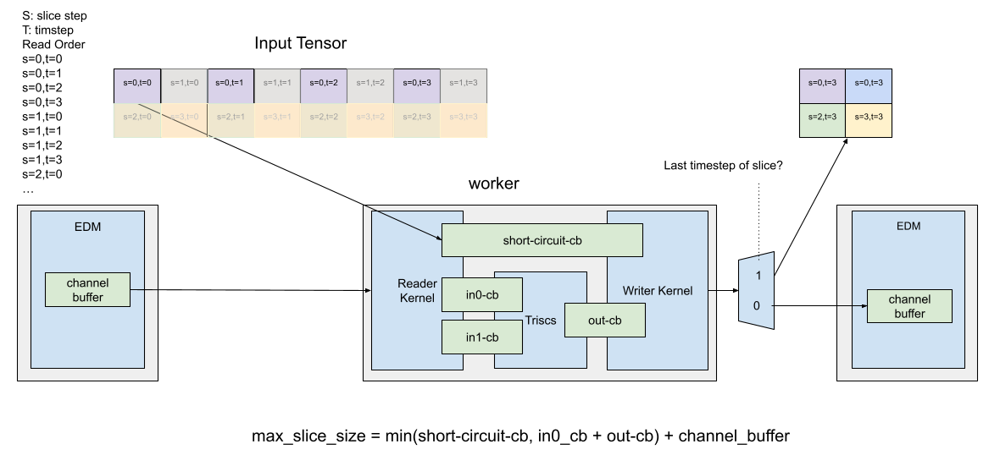

Logical view of a single reduce scatter worker connected to a sender and receiver EDM channel on a single chip. In this example, timesteps and steps are specified for chip3 in a 4chip ring. The larger fractures are split into smaller slice steps to satisfy buffering limitations

When multiple workers are present, each worker takes alternating slices out of the input and output tensors such that subsequent slices for a given worker are strided by the entire worker group worth of slices.

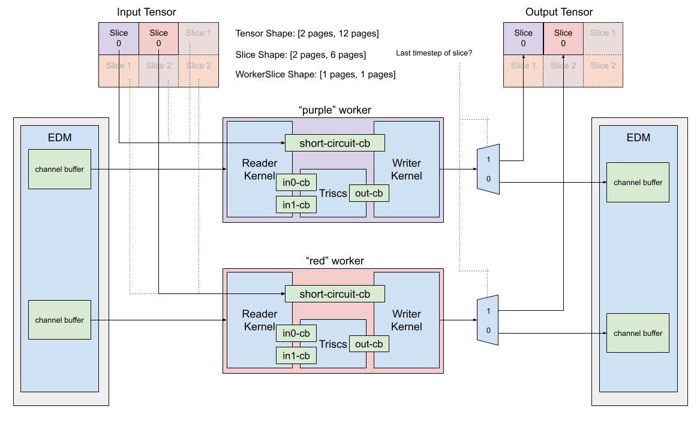
*Logical view of a single chip of reduce-scatter with 2 workers implementing the operation. **Note that in this diagram, only one timestep/fracture is shown***

## Special Attributes

Reduce-scatter has a special attribute where the op produces partial outputs for each timestep and each rank and that partial output is used as input for another rank and on another timestep. This is relevant to the CCL design space because it enforces that there is no direct path from input to output tensor without some form of synchronization between ranks or workers coordinating production and consumption of partials.

# Invoking CCL Operations

CCL operations can be dispatched across various chips and sub-topologies of a multi-chip cluster. Programming APIs are made available, via TT-NN, to express collective operations at higher levels and across entire clusters. 

For example, it is possible to describe an operation such as an all-gathering along the rows of a multichip cluster that has multiple rows or columns, where the TT-NN infrastructure can decide the appropriate way to dispatch the underlying CCL operations..

Refer to the ["Programming Mesh of Devices with TT-NN"](../Programming%20Mesh%20of%20Devices/Programming%20Mesh%20of%20Devices%20with%20TT-NN.md) guide for programming examples and further information.
